# Convert Word to PDF in Azure App Service on Linux

Syncfusion&reg; DocIO is a [.NET Word library](https://www.syncfusion.com/document-sdk/net-word-library) used to create, read, edit and **convert Word documents** programmatically without **Microsoft Word** or interop dependencies. Using this library, you can **convert a Word document to PDF in Azure App Service on Linux**.

**Prerequisites:**

* Visual Studio 2022 or later with the **ASP.NET and web development** workload installed.
* An Azure account. If you do not have one, create a [free Azure account](https://azure.microsoft.com/free/) before you begin.
* Target framework: [.NET 8.0 or later](https://dotnet.microsoft.com/en-us/download/dotnet).

## Steps to convert Word document to PDF in Azure App Service on Linux

Step 1: Create a new ASP.NET Core Web App (Model-View-Controller).

Step 2: Create a project name and select the location.

Step 3: In the **Additional information** dialog, select **.NET 8.0 (Long Term Support)**, choose the required **Authentication type**, and click **Create**. Leave the other settings as their default values.
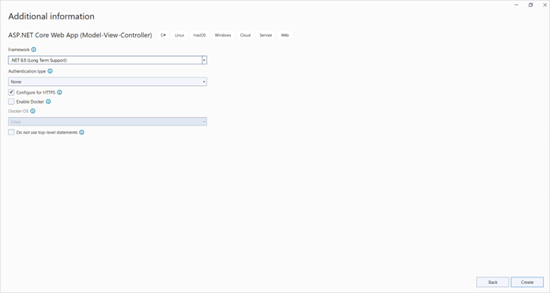

Step 4: Install the following **NuGet packages** in your application from [NuGet.org](https://www.nuget.org/).

* [Syncfusion.DocIORenderer.Net.Core](https://www.nuget.org/packages/Syncfusion.DocIORenderer.Net.Core) (version **21.2.4** or later is recommended for Linux compatibility)
* [SkiaSharp.NativeAssets.Linux 3.119.1](https://www.nuget.org/packages/SkiaSharp.NativeAssets.Linux/3.119.1) (use `SkiaSharp.NativeAssets.Linux.NoDependencies` for ARM64 environments)
* [HarfBuzzSharp.NativeAssets.Linux 8.3.1.2](https://www.nuget.org/packages/HarfBuzzSharp.NativeAssets.Linux/8.3.1.2)

> **Note:** The SkiaSharp and HarfBuzzSharp versions are pinned to match the native assets bundled with the current `Syncfusion.DocIORenderer.Net.Core` release. If you upgrade the Syncfusion package, verify the matching native-asset versions in the [NuGet Packages Required to Convert Word to PDF](https://help.syncfusion.com/document-processing/word/conversions/word-to-pdf/net/nuget-packages-required-word-to-pdf).

After installing the packages, build the project to verify that all packages restore successfully.

 
 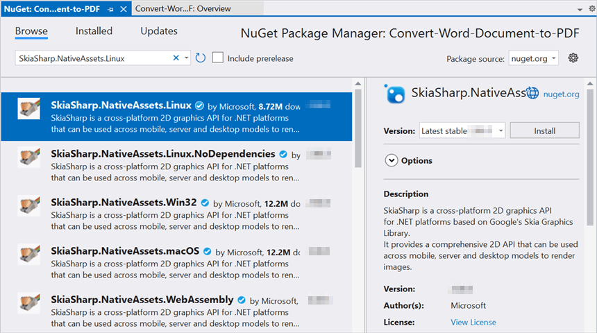
 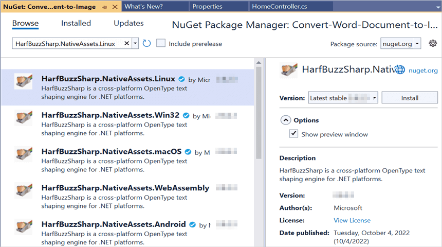

N> Starting with v16.2.0.x, if you reference Syncfusion&reg; assemblies from trial setup or from the NuGet feed, you also have to add "Syncfusion.Licensing" assembly reference and include a license key in your projects. Please refer to this [link](https://help.syncfusion.com/common/essential-studio/licensing/overview) to know about registering Syncfusion&reg; license key in your application to use our components.

Step 5: Add a new button in the **Index.cshtml** as shown below.




@{Html.BeginForm("WordToPDF", "Home", FormMethod.Post, new { enctype = "multipart/form-data" });
 
{
    

        

            

                This sample illustrates how to convert Word document to PDF using .NET Word library (DocIO) and .NET PDF library (PDF).
            

            &nbsp;
            

            Click the button to view the resultant PDF document being converted from Word document using DocIO. Please note that PDF viewer is required to view the resultant PDF.
                    

                        

                            Select Document :
                            @Html.TextBox("file", "", new { type = "file", accept = ".docx" })  
                        

                    

                            <input class="buttonStyle" type="submit" value="Convert to PDF" name="button" style="width:150px;height:27px" />
                             
                            

                                @ViewBag.Message
                            

                    

                

            

             
        

    

    Html.EndForm();
    }
}




Step 6: Include the following namespaces in **HomeController.cs**.





using System.IO;
using Microsoft.AspNetCore.Mvc;
using Syncfusion.DocIO;
using Syncfusion.DocIO.DLS;
using Syncfusion.DocIORenderer;
using Syncfusion.Pdf;





Step 7: Include the following code snippet in **HomeController.cs** to convert the Word document to PDF.





/// 

/// Convert Word document to PDF
/// 

/// <param name="button">The value of the submitted "Convert to PDF" button; used to detect that the form was posted.</param>
/// <returns>The converted PDF file or the Index view with an error message.</returns>
[HttpPost]
public IActionResult WordToPDF(string button)
{
    if (button == null)
        return View("Index");

    if (Request.Form.Files != null)
    {
        if (Request.Form.Files.Count == 0)
        {
            ViewBag.Message = string.Format("Browse a Word document and then click the button to convert as a PDF document");
            return View("Index");
        }
        // Gets the extension from file.
        string extension = Path.GetExtension(Request.Form.Files[0].FileName).ToLower();
        // Compares extension with supported extensions.
        if (extension == ".docx")
        {
            MemoryStream stream = new MemoryStream();
            Request.Form.Files[0].CopyTo(stream);
            try
            {
                //Open using Syncfusion
                using (WordDocument document = new WordDocument(stream, FormatType.Docx))
                {
                    stream.Dispose();                         
                    // Creates a new instance of DocIORenderer class.
                    using (DocIORenderer render = new DocIORenderer())
                    {
                        // Converts Word document into PDF document
                        using (PdfDocument pdf = render.ConvertToPDF(document))
                        {                                                                     
                            MemoryStream memoryStream = new MemoryStream();
                            // Save the PDF document
                            pdf.Save(memoryStream);
                            memoryStream.Position = 0;                       
                            return File(memoryStream, "application/pdf", "WordToPDF.pdf");
                        }                                                           
                    } 
                }                                                
            }
            catch (Exception ex)
            {
                ViewBag.Message = ex.ToString();
            }
        }
        else
        {
            ViewBag.Message = string.Format("Please choose Word format document to convert to PDF");
        }
    }
    else
    {
        ViewBag.Message = string.Format("Browse a Word document and then click the button to convert as a PDF document");
    }
    return View("Index");
}





## Steps to publish as Azure App Service on Linux

Before you publish, complete the following pre-publish verifications:

* Ensure the project's **Target Framework** is set to a Linux-compatible TFM (e.g `net8.0` of later).
* Run the application locally and verify the Word-to-PDF conversion works.
* Confirm the **publish runtime** is set to **linux-x64** (or **linux-arm64** if you installed the `SkiaSharp.NativeAssets.Linux.NoDependencies` package).

Step 1: Right-click the project and select **Publish** option.
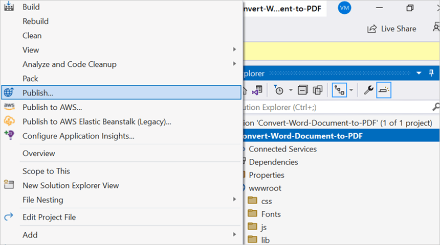

Step 2: Click the **Add a Publish Profile** button.
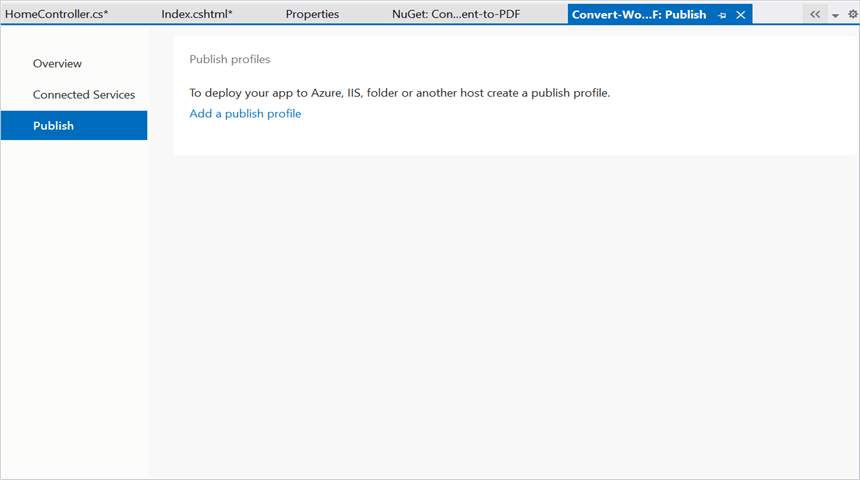

Step 3: Select the publish target as **Azure**.
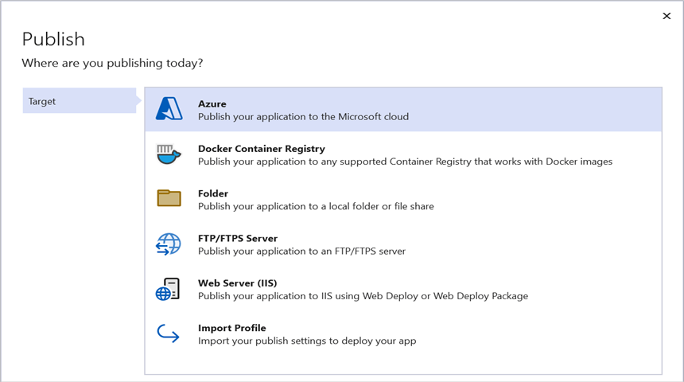

Step 4: Select the Specific target as **Azure App Service (Linux)**.

Step 5: To create a new app service, click the **Create new** option.
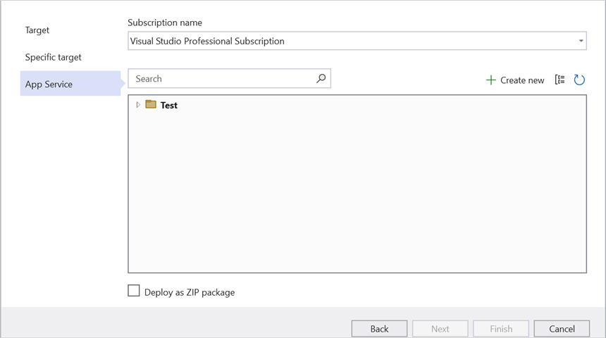

Step 6: Click the **Create** button to proceed with **App Service** creation.
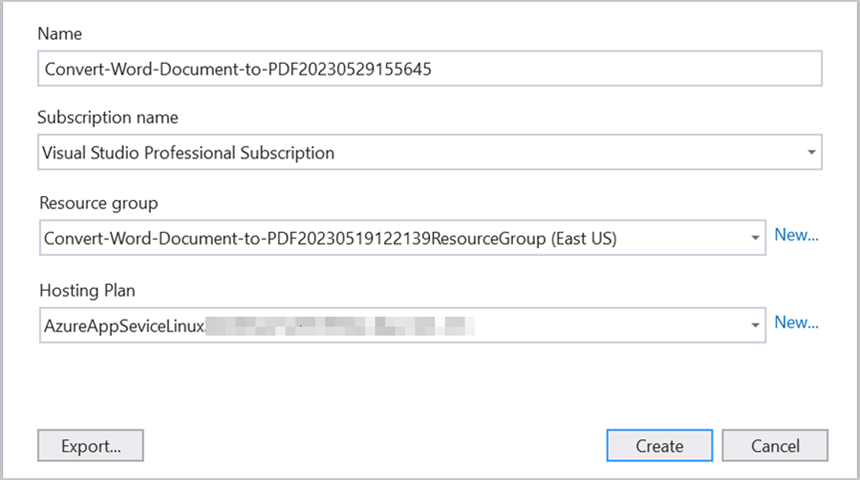

Step 7: Click the **Finish** button to finalize the **App Service** creation.
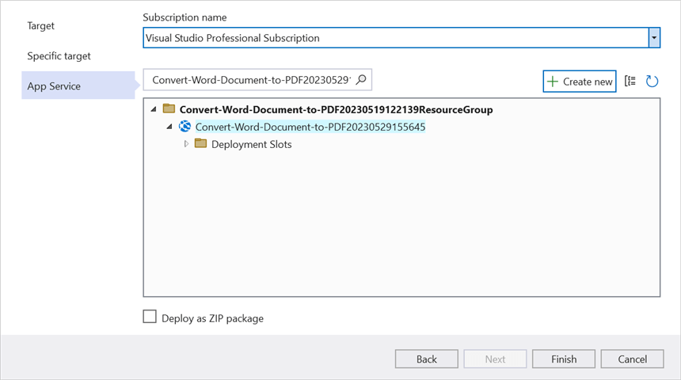

Step 8: Click the **Close** button.
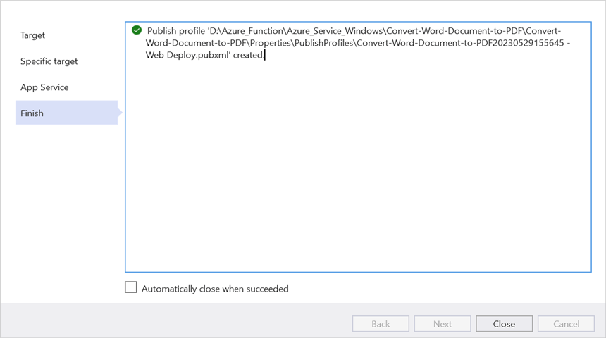

Step 9: Click the **Publish** button.
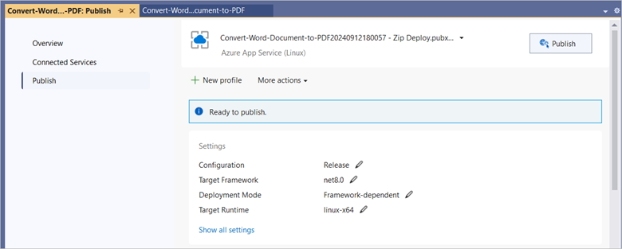

Step 10: Publishing is now complete.
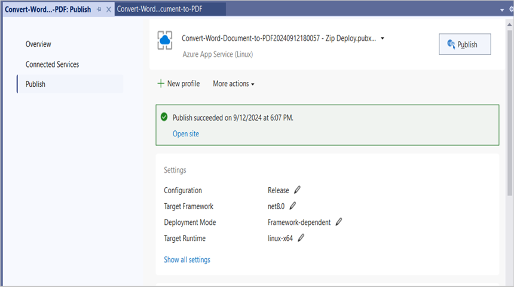

Step 11: The published webpage now opens in the **browser**.
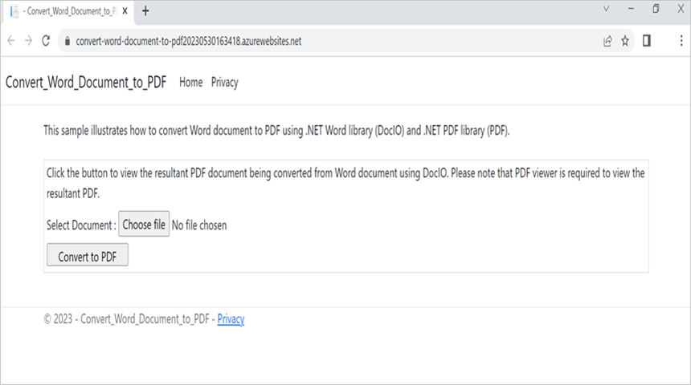

Step 12: Select the Word document and click **Convert to PDF** to convert the given Word document to a PDF. You will get the output PDF document as follows.

You can download a complete working sample from [GitHub](https://github.com/SyncfusionExamples/DocIO-Examples/tree/main/Word-to-PDF-Conversion/Convert-Word-document-to-PDF/Azure/Azure_App_Service).

Looking for the full .NET Word Library overview, features, pricing, and documentation? Visit the [.NET Word Library](https://www.syncfusion.com/document-sdk/net-word-library) page.

An online sample link to [convert Word document to PDF](https://document.syncfusion.com/demos/word/wordtopdf#/tailwind) in ASP.NET Core.

## See also

* [.NET Word Library overview, features, and pricing](https://www.syncfusion.com/document-sdk/net-word-library)
* [Online demo: convert Word document to PDF in ASP.NET Core](https://document.syncfusion.com/demos/word/wordtopdf#/tailwind)
* [NuGet packages required for Word to PDF conversion](https://help.syncfusion.com/document-processing/word/conversions/word-to-pdf/net/nuget-packages-required-word-to-pdf)
* [Fallback fonts for Word to PDF conversion](https://help.syncfusion.com/document-processing/word/conversions/word-to-pdf/net/fallback-fonts-word-to-pdf)
* [Word to PDF conversion FAQ](https://help.syncfusion.com/document-processing/word/conversions/word-to-pdf/net/faqs-word-to-pdf)
