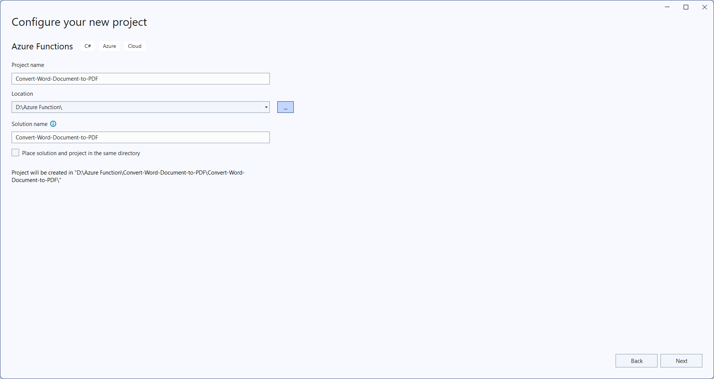
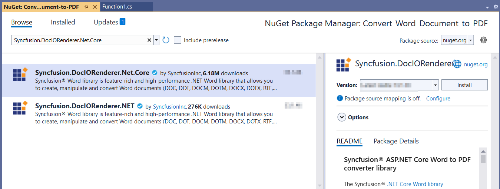
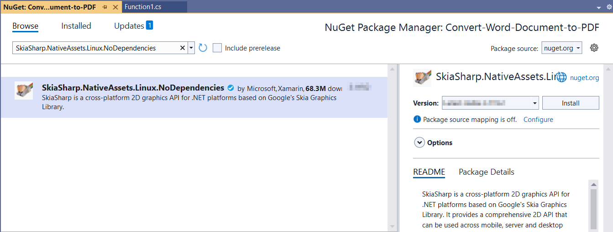
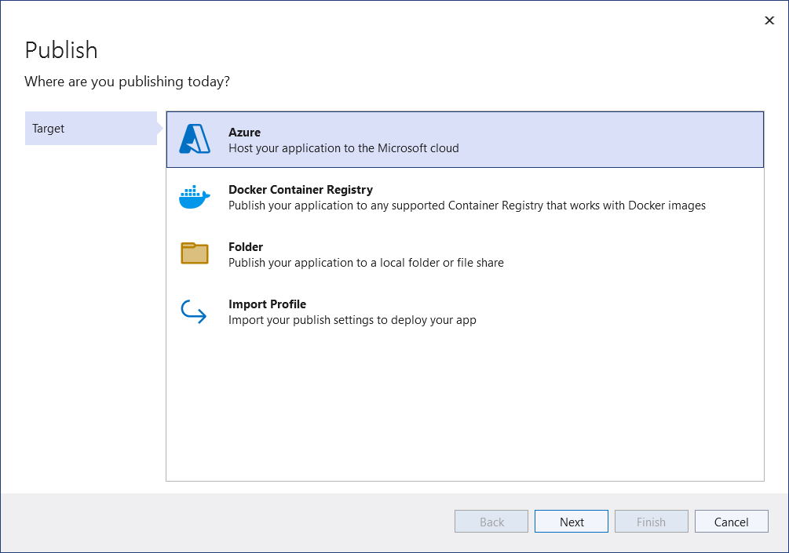
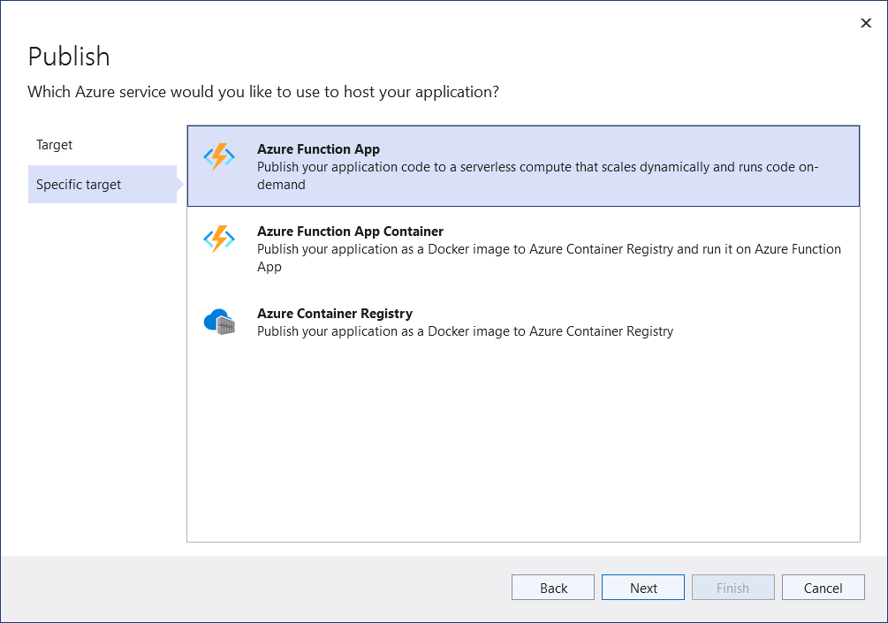
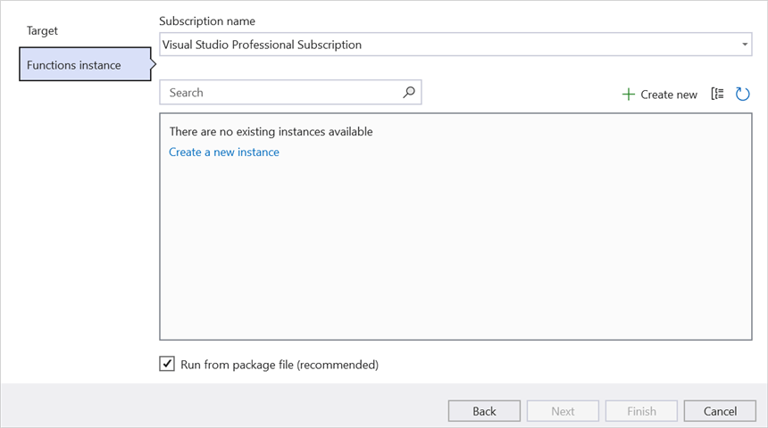
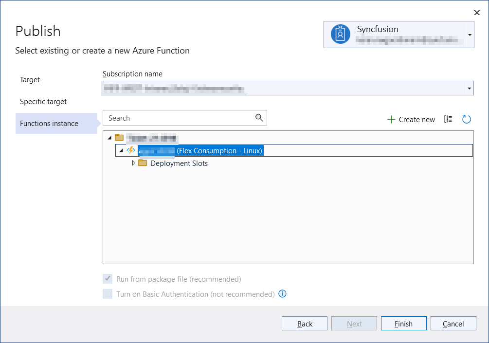
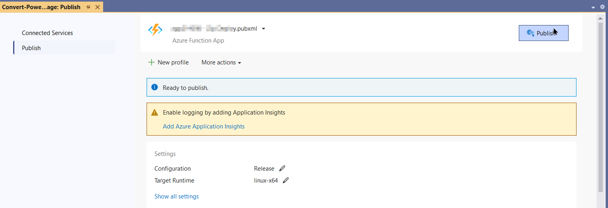
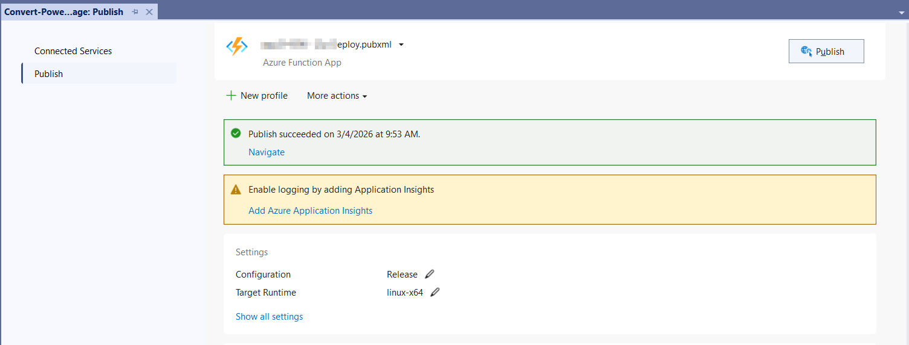
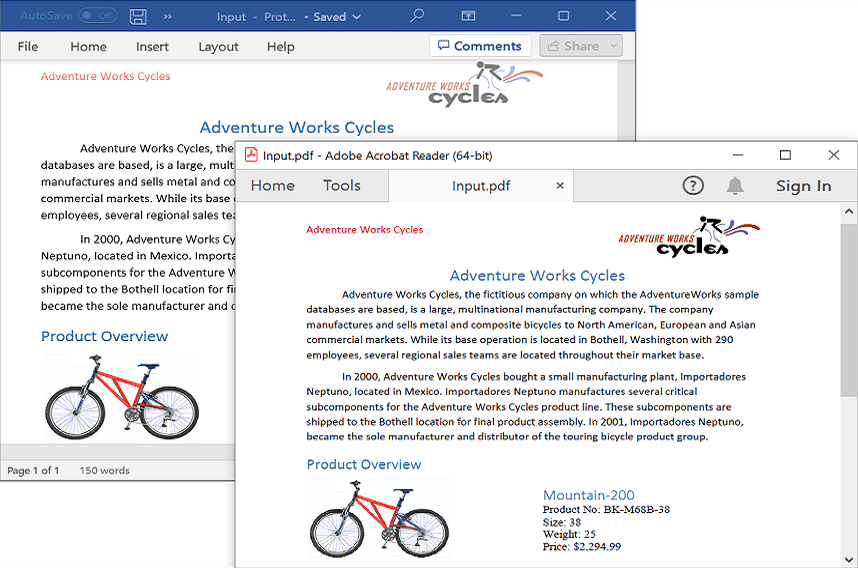

# Convert Word to PDF in Azure Functions (Flex Consumption)

Syncfusion&reg; DocIO is a [.NET Core Word library](https://www.syncfusion.com/document-sdk/net-word-library) used to create, read, edit, and **convert Word documents** programmatically without **Microsoft Word** or interop dependencies. Using this library, you can **convert a Word document to PDF in Azure Functions deployed on a Flex Consumption plan**.

## Prerequisites

- An active Azure subscription.
- Visual Studio 2022 (or later) with the **Azure Development** workload installed.
- [Azure Functions Tools](https://learn.microsoft.com/en-us/azure/azure-functions/functions-develop-local?pivots=programming-language-csharp) for Visual Studio.
- [.NET 8 SDK or later](https://dotnet.microsoft.com/en-us/download/dotnet) (the Flex Consumption plan supports only the **.NET 8 isolated worker** model).
- A Syncfusion license key. Refer to this [link](https://help.syncfusion.com/common/essential-studio/licensing/overview) to know about registering the Syncfusion&reg; license key in your application.

## Steps to convert a Word document to PDF in Azure Functions (Flex Consumption)

Step 1: Create a new Azure Functions project.

Step 2: Enter a project name and select the location.

Step 3: In the **Additional information** dialog, select the function worker as **.NET 8.0 (Long Term Support) (Isolated)** and choose **Flex Consumption** as the hosting plan. Then click **Create**.

Step 4: Install the [Syncfusion.DocIORenderer.Net.Core](https://www.nuget.org/packages/Syncfusion.DocIORenderer.Net.Core) and [SkiaSharp.NativeAssets.Linux.NoDependencies v3.119.1](https://www.nuget.org/packages/SkiaSharp.NativeAssets.Linux.NoDependencies/3.119.1) NuGet packages as references to your project from [NuGet.org](https://www.nuget.org/).

N> Starting with v16.2.0.x, if you reference Syncfusion&reg; assemblies from trial setup or from the NuGet feed, you also have to add "Syncfusion.Licensing" assembly reference and include a license key in your projects. Please refer to this [link](https://help.syncfusion.com/common/essential-studio/licensing/overview) to know about registering Syncfusion&reg; license key in your application to use our components.

Step 5: Include the following namespaces in the **Function1.cs** file.




using System;
using System.IO;
using System.Threading.Tasks;
using Microsoft.AspNetCore.Http;
using Microsoft.AspNetCore.Mvc;
using Microsoft.Azure.Functions.Worker;
using Microsoft.Extensions.Logging;
using Syncfusion.DocIO;
using Syncfusion.DocIO.DLS;
using Syncfusion.DocIORenderer;
using Syncfusion.Pdf;




Step 6: Add the following code snippet in the **Run** method of the **Function1** class to perform **Word document to PDF conversion** in Azure Functions and return the resultant **PDF** to the client end. The font substitution handler and the `ILogger` field shown below are part of the same class.




public async Task<IActionResult> Run([HttpTrigger(AuthorizationLevel.Function, "post")] HttpRequest req)
    {
        try
        {
            // Create a memory stream to hold the incoming request body (Word document bytes)
            await using MemoryStream inputStream = new MemoryStream();
            // Copy the request body into the memory stream
            await req.Body.CopyToAsync(inputStream);
            // Check if the stream is empty (no file content received)
            if (inputStream.Length == 0)
                return new BadRequestObjectResult("No file content received in request body.");
            // Reset stream position to the beginning for reading
            inputStream.Position = 0;
            // Load the Word document from the stream (auto-detects format type)
            using WordDocument document = new WordDocument(inputStream, FormatType.Automatic);
            // Attach font substitution handler to manage missing fonts
            document.FontSettings.SubstituteFont += FontSettings_SubstituteFont;
            // Initialize DocIORenderer to convert Word document to PDF
            using DocIORenderer renderer = new DocIORenderer();
            // Convert the Word document to a PDF document
            using PdfDocument pdfDoc = renderer.ConvertToPDF(document);
            // Create a memory stream to hold the PDF output
            await using MemoryStream outputStream = new MemoryStream();
            // Save the PDF into the output stream
            pdfDoc.Save(outputStream);
            // Close the PDF document and release resources
            pdfDoc.Close(true);
            // Reset stream position to the beginning for reading
            outputStream.Position = 0;
            // Convert the PDF stream to a byte array
            var pdfBytes = outputStream.ToArray();

            // Create a file result to return the PDF as a downloadable file
            var fileResult = new FileContentResult(pdfBytes, "application/pdf")
            {
                FileDownloadName = "converted.pdf"
            };
            // Return the PDF file result to the client
            return fileResult;
        }
        catch (Exception ex)
        {
            // Log the error with details for troubleshooting
            _logger.LogError(ex, "Error converting DOCX to PDF.");
            // Prepare error message including exception details
            var msg = $"Exception: {ex.Message}\n\n{ex}";
            // Return a 500 Internal Server Error response with the message
            return new ContentResult { StatusCode = 500, Content = msg, ContentType = "text/plain; charset=utf-8" };
        }
    }
    /// 

    /// Event handler for font substitution during PDF conversion
    /// 

    /// <param name="sender"></param>
    /// <param name="args"></param>
    private void FontSettings_SubstituteFont(object sender, SubstituteFontEventArgs args)
    {
        // Define the path to the Fonts folder in the application base directory
        string fontsFolder = Path.Combine(AppContext.BaseDirectory, "Fonts");
        // If the original font is Calibri, substitute with calibri-regular.ttf
        if (args.OriginalFontName == "Calibri")
        {
            args.AlternateFontStream = File.OpenRead(Path.Combine(fontsFolder, "calibri-regular.ttf"));
        }
        // Otherwise, substitute with Times New Roman
        else
        {
            args.AlternateFontStream = File.OpenRead(Path.Combine(fontsFolder, "Times New Roman.ttf"));
        }
    }
	



Step 7: Right click the project and select **Publish**. Then, create a new profile in the Publish Window.

Step 8: Select the target as **Azure** and click **Next** button.

Step 9: Select the specific target as **Azure Function App** and click **Next**.

Step 10: Click **Create new** button to configure a new Azure Function App instance.

Step 11: In the hosting plan list, select **Flex Consumption** (required for the isolated worker model on .NET 8) and click **Create**.

Step 12: After the Function App is created, click **Finish**.

Step 13: Click **Publish**.

Step 14: Publishing succeeded.

Step 15: Go to the Azure portal and select **App Services** → your Function App → **Functions** → **Function1**. Click **Get Function URL** and copy the URL (it includes the `?code=...` function key). Paste this URL into the client console app below to send a Word document to the function and receive the converted PDF. The output PDF is shown below.

## Steps to post the request to Azure Functions

Step 1: Create a .NET console application to request the Azure Functions API.

Step 2: Add the following code snippet into Main method to post the request to Azure Functions with template Word document and get the resultant PDF.



using System;
using System.IO;
using System.Net.Http;
using System.Threading.Tasks;




Step 3: Add the following code snippet to the **Main** method to post the Word document to the Azure Function and save the returned PDF (or the error response, if conversion fails).



static async Task Main()
    {  
        Console.Write("Please enter your Azure Functions URL : ");
        // Read the URL entered by the user and trim whitespace
        string url = Console.ReadLine()?.Trim();
        // If no URL was entered, exit the program
        if (string.IsNullOrEmpty(url)) return;
        // Create a new HttpClient instance for sending requests
        using var http = new HttpClient();
        // Read all bytes from the input Word document file
        var bytes = await File.ReadAllBytesAsync(@"Data/Input.docx");
        // Create HTTP content from the document bytes
        using var content = new ByteArrayContent(bytes);
        // Set the content type header to application/octet-stream (binary data)
        content.Headers.ContentType = new System.Net.Http.Headers.MediaTypeHeaderValue("application/octet-stream");
        // Send a POST request to the Azure Function with the document content
        using var res = await http.PostAsync(url, content);
        // Read the response content as a byte array
        var resBytes = await res.Content.ReadAsByteArrayAsync();
        // Get the media type (e.g., application/pdf or text/plain) from the response headers
        string mediaType = res.Content.Headers.ContentType?.MediaType ?? string.Empty;
        string outFile = mediaType.Contains("pdf", StringComparison.OrdinalIgnoreCase)
            ? Path.GetFullPath(@"../../../Output/Output.pdf")
            : Path.GetFullPath(@"../../../Output/function-error.txt");
        // Write the response bytes to the chosen output file
        await File.WriteAllBytesAsync(outFile, resBytes);
        Console.WriteLine($"Saved: {outFile} ");        
    }



N> **Function key:** Because the trigger is configured with `AuthorizationLevel.Function`, the client must send the URL with the function key (the `?code=...` value) or supply the `x-functions-key` header. The **Get Function URL** link in the Azure portal already includes the key in the query string.

From GitHub, you can download the [console application](https://github.com/SyncfusionExamples/DocIO-Examples/tree/main/Word-to-PDF-Conversion/Convert-Word-document-to-PDF/Azure/Azure_Functions/Console_App_Flex_Consumption) and [Azure Functions Flex Consumption](https://github.com/SyncfusionExamples/DocIO-Examples/tree/main/Word-to-PDF-Conversion/Convert-Word-document-to-PDF/Azure/Azure_Functions/Azure_Function_Flex_Consumption).

Looking for the full .NET Word Library overview, features, pricing, and documentation? Visit the [.NET Word Library](https://www.syncfusion.com/document-sdk/net-word-library) page.

An online sample link to [convert Word document to PDF](https://document.syncfusion.com/demos/word/wordtopdf#/tailwind) in ASP.NET Core.