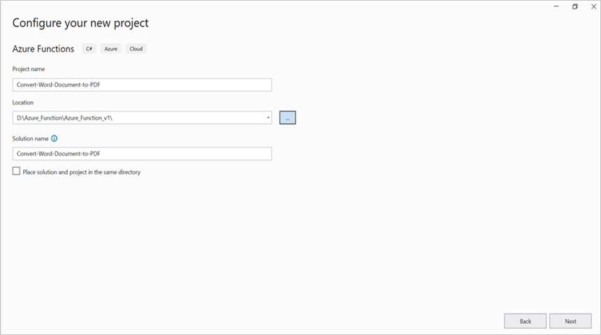
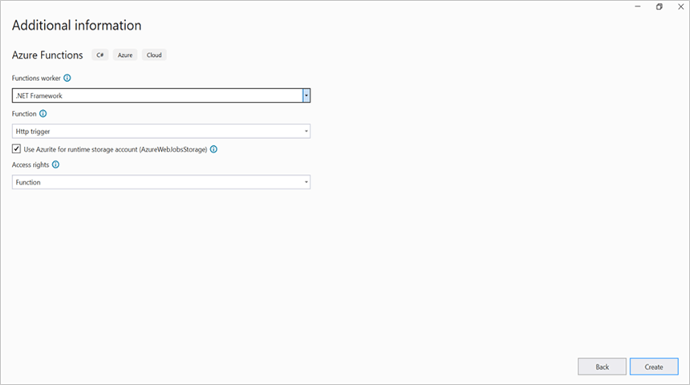
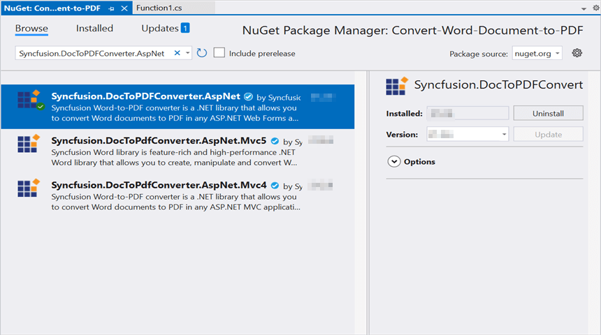
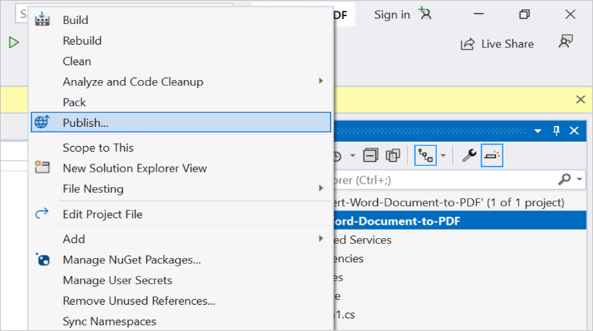
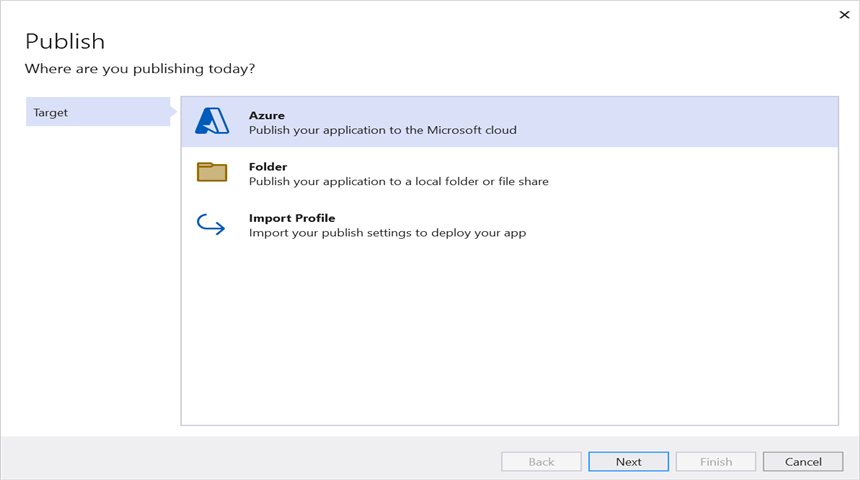
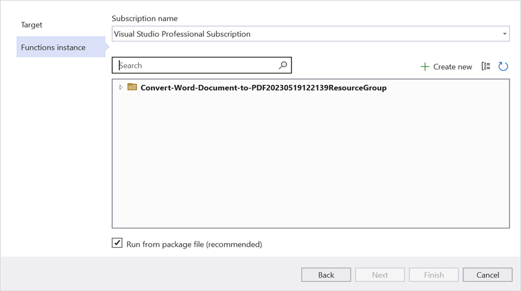
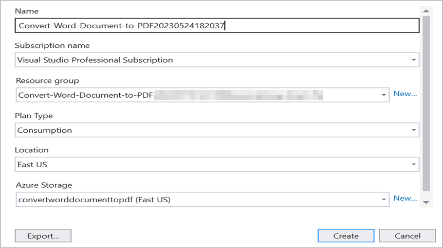
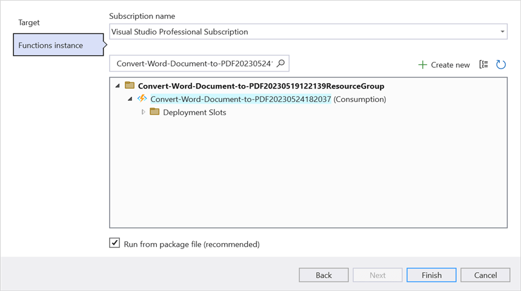
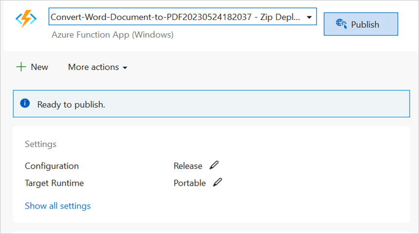
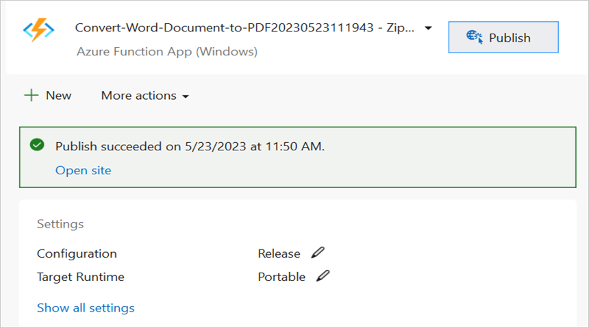

# Convert Word to PDF in Azure Functions v1

Syncfusion&reg; DocIO is a [.NET Word library](https://www.syncfusion.com/document-sdk/net-word-library) used to create, read, edit and **convert Word documents** programmatically without **Microsoft Word** or interop dependencies. Using this library, you can **convert a Word document to PDF in Azure Functions v1**.

## Prerequisites

- An active Azure subscription.
- Visual Studio 2022 or later with the **Azure Development** workload installed.
- [Azure Functions Tools](https://learn.microsoft.com/en-us/azure/azure-functions/functions-develop-local?pivots=programming-language-csharp) for Visual Studio.
- [.NET Framework](https://dotnet.microsoft.com/en-us/download/dotnet-framework) 4.6.2 or later (required for Azure Functions v1 runtime).

## Steps to convert a Word document to PDF in Azure Functions v1

Step 1: Create a new Azure Functions project. When prompted, select the **HttpTrigger** trigger and set the authorization level to **Anonymous** for easy testing.

Step 2: Enter a project name and select the location.

Step 3: Select the function worker as **.NET Framework** and the Azure Functions runtime version as **Azure Functions v1 (.NET Framework)**.

Step 4: Install the [Syncfusion.DocToPDFConverter.AspNet](https://www.nuget.org/packages/Syncfusion.DocToPDFConverter.AspNet) NuGet package (v20.x or later) as a reference to your project from [NuGet.org](https://www.nuget.org/).

N> Starting with v16.2.0.x, if you reference Syncfusion&reg; assemblies from trial setup or from the NuGet feed, you also have to add "Syncfusion.Licensing" assembly reference and include a license key in your projects. Please refer to this [link](https://help.syncfusion.com/common/essential-studio/licensing/overview) to know about registering Syncfusion&reg; license key in your application to use our components.

Step 5: Include the following namespaces in the **Function1.cs** file.



using System.IO;
using System.Net;
using System.Net.Http;
using System.Net.Http.Headers;
using Syncfusion.DocIO;
using Syncfusion.DocIO.DLS;
using Syncfusion.DocToPDFConverter;
using Syncfusion.Pdf;




Step 6: Add the following code snippet in the **Run** method of the **Function1** class to perform **Word to PDF conversion** in Azure Functions and return the resultant **PDF document** to the client end.




//Gets the input Word document as stream from request
Stream stream = req.Content.ReadAsStreamAsync().Result;
//Loads an existing Word document
using (WordDocument document = new WordDocument(stream))
{
    //Creates an instance of the DocToPDFConverter
    using (DocToPDFConverter converter = new DocToPDFConverter())
    {
        //Converts Word document into PDF document
        using (PdfDocument pdfDocument = converter.ConvertToPDF(document))
        {
            MemoryStream memoryStream = new MemoryStream();
            //Saves the PDF file
            pdfDocument.Save(memoryStream);
            //Reset the memory stream position
            memoryStream.Position = 0;
            //Create the response to return
            HttpResponseMessage response = new HttpResponseMessage(HttpStatusCode.OK);
            //Set the PDF document saved stream as content of response
            response.Content = new ByteArrayContent(memoryStream.ToArray());
            //Set the contentDisposition as attachment
            response.Content.Headers.ContentDisposition = new ContentDispositionHeaderValue("attachment")
            {
                FileName = "Sample.Pdf"
            };
            //Set the content type as PDF document mime type
            response.Content.Headers.ContentType = new System.Net.Http.Headers.MediaTypeHeaderValue("application/pdf");
            //Return the response with output PDF document stream
            return response;
        }
    }
}





Step 7: Right-click the project and select **Publish**. Then, create a new publishing profile in the Publish Window.

Step 8: Select the target as **Azure** and click the **Next** button.

Step 9: Click the **Create new** button.

Step 10: Click the **Create** button.

Step 11: After creating the app service, click the **Finish** button.

Step 12: Click the **Publish** button.

Step 13: Wait until publishing succeeds.

Step 14: Go to the Azure portal and select **App Services**. After the function is running, click **Get function URL** to copy it. Then, paste it into the client sample in the next section. The client sample will request the Azure Functions endpoint to perform **Word to PDF conversion** using the template Word document. You will get the output PDF document as follows.

## Steps to post the request to Azure Functions

Step 1: Create a console application to request the Azure Functions API.

Step 2: Add the following code snippet into **Main** method to post the request to Azure Functions with template Word document and get the resultant PDF document.




//Reads the template Word document.
FileStream fs = new FileStream(@"../../Data/Input.docx", FileMode.Open, FileAccess.ReadWrite, FileShare.ReadWrite);
fs.Position = 0;
//Saves the Word document in memory stream.
MemoryStream inputStream = new MemoryStream();
fs.CopyTo(inputStream);
inputStream.Position = 0;
try
{
    Console.WriteLine("Please enter your Azure Functions URL :");
    string functionURL = Console.ReadLine();
    //Create HttpWebRequest with hosted azure functions URL.    
    HttpWebRequest req = (HttpWebRequest)WebRequest.Create(functionURL);
    //Set request method as POST
    req.Method = "POST";
    //Get the request stream to save the Word document stream
    Stream stream = req.GetRequestStream();
    //Write the Word document stream into request stream
    stream.Write(inputStream.ToArray(), 0, inputStream.ToArray().Length);
    //Gets the responce from the Azure Functions.
    HttpWebResponse res = (HttpWebResponse)req.GetResponse();
    //Saves the PDF document stream.
    FileStream fileStream = File.Create("DocToPDF.pdf");
    res.GetResponseStream().CopyTo(fileStream);
    //Dispose the streams
    inputStream.Dispose();
    fileStream.Dispose();
}
catch (Exception ex)
{
    throw;
}




From GitHub, you can download the [console application](https://github.com/SyncfusionExamples/DocIO-Examples/tree/main/Word-to-PDF-Conversion/Convert-Word-document-to-PDF/Azure/Azure_Functions/Console_Application) and [Azure Functions v1](https://github.com/SyncfusionExamples/DocIO-Examples/tree/main/Word-to-PDF-Conversion/Convert-Word-document-to-PDF/Azure/Azure_Functions/Azure_Functions_v1).

Looking for the full .NET Word Library overview, features, pricing, and documentation? Visit the [.NET Word Library](https://www.syncfusion.com/document-sdk/net-word-library) page.

An online sample link to [convert Word document to PDF](https://document.syncfusion.com/demos/word/wordtopdf#/tailwind) in ASP.NET Core.

