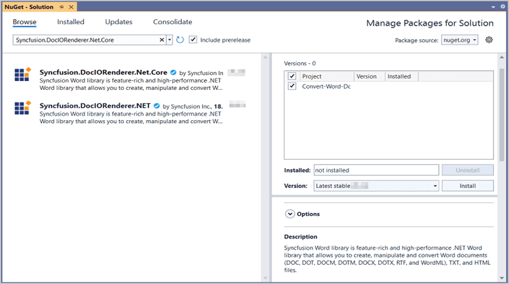
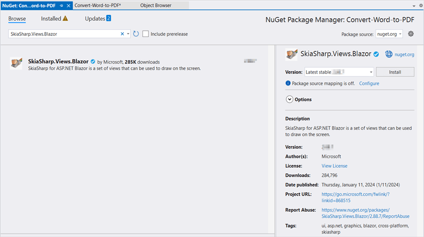

# Convert Word document to PDF in Blazor

Syncfusion<sup>&reg;</sup> DocIO is a [Blazor Word library](https://www.syncfusion.com/document-processing/word-framework/blazor/word-library) used to create, read, edit, and **convert Word documents** programmatically without **Microsoft Word** or interop dependencies. Using this library, you can **convert a Word document to PDF in Blazor**.

**Prerequisites:**




* Visual Studio 2019 Preview or later
* Install [.NET 8 SDK](https://dotnet.microsoft.com/en-us/download/dotnet/8.0) or later.


* Visual Studio Code
* Install [.NET 8 SDK](https://dotnet.microsoft.com/en-us/download/dotnet/8.0) or later.
* Open Visual Studio Code and install the [C# for Visual Studio Code extension](https://marketplace.visualstudio.com/items?itemName=ms-dotnettools.csharp) from the Extensions Marketplace.




## Word to PDF in Blazor Server app




Step 1: Create a new C# Blazor Server app project. Select Blazor Server App from the template and click the Next button.


Step 2: To **convert a Word document to PDF in server app**, install [Syncfusion.DocIORenderer.Net.Core](https://www.nuget.org/packages/Syncfusion.DocIORenderer.Net.Core) to the Blazor project.



 


Step 1: Create a new C# Blazor Server app project using Visual Studio Code via [Microsoft Templates](https://learn.microsoft.com/en-us/aspnet/core/blazor/tooling?view=aspnetcore-7.0&pivots=vsc).

Alternatively, create a Server application using the following command in the terminal(<kbd>Ctrl</kbd>+<kbd>`</kbd>).

```
dotnet new blazorserver -o Convert-Word-document-to-PDF
```

Run the following command to navigate to the project directory.

```
cd Convert-Word-document-to-PDF
```

Step 2: To **convert a Word document to PDF in server app**, run the following command to  install [Syncfusion.DocIORenderer.Net.Core](https://www.nuget.org/packages/Syncfusion.DocIORenderer.Net.Core) to the Blazor project.

```
dotnet add package Syncfusion.DocIORenderer.Net.Core
```


 



N> Starting with v16.2.0.x, if you reference Syncfusion<sup>&reg;</sup> assemblies from trial setup or from the NuGet feed, you also have to add "Syncfusion.Licensing" assembly reference and include a license key in your projects. Please refer to this [link](https://help.syncfusion.com/common/essential-studio/licensing/overview) to know about registering Syncfusion<sup>&reg;</sup> license key in your application to use our components.

Step 3: Create a razor file with name as **DocIO** under **Pages** folder and include the following namespaces in the file.




@page "/docio"
@using Convert_Word_Document_to_PDF;
@inject Convert_Word_Document_to_PDF.Data.WordService service
@inject Microsoft.JSInterop.IJSRuntime JS



Step 4: Add the following code in **DocIO.razor** file to create a new button.



<h2>Syncfusion DocIO library </h2>
<p>Syncfusion DocIO library is a Blazor DocIO library used to create, read, edit, and convert Word files in your applications without Microsoft Office dependencies.</p>
<button class="btn btn-primary" @onclick="@ConvertWordtoPDF">Convert Word to PDF</button>



Step 5: Add the following code in **DocIO.razor** file to create and download the **PDF document**.



@code {
    MemoryStream documentStream;
    /// <summary>
    /// Convert Word to PDF and download the PDF document
    /// </summary>
    protected async void ConvertWordtoPDF()
    {
        documentStream = service.ConvertWordtoPDF();
        await JS.SaveAs("Sample.pdf", documentStream.ToArray());
    }
}



Step 6: Create a new cs file with name as **WordService** under Data folder and include the following namespaces in the file.




using Syncfusion.DocIO;
using Syncfusion.DocIO.DLS;
using Syncfusion.DocIORenderer;
using Syncfusion.Pdf;




Step 7: Create a new MemoryStream method with name as **ConvertWordtoPDF** in **WordService** class and include the following code snippet to **convert the Word document to Pdf** in Server app.





using (FileStream sourceStreamPath = new FileStream(@"wwwroot/Input.docx", FileMode.Open, FileAccess.Read, FileShare.ReadWrite))
{
    //Open an existing Word document.
    using (WordDocument document = new WordDocument(sourceStreamPath, FormatType.Docx))
    {
        //Instantiation of DocIORenderer for Word to PDF conversion
        using (DocIORenderer render = new DocIORenderer())
        {
            //Converts Word document into PDF document
            using (PdfDocument pdfDocument = render.ConvertToPDF(document))
            {
                //Saves the PDF document to MemoryStream.
                MemoryStream stream = new MemoryStream();
                pdfDocument.Save(stream);
                stream.Position = 0;
                return stream;
            }
        }
    }
}





Step 8: Add the following line to the Program.cs file to register the WordService as a scoped service in your Blazor application. 




builder.Services.AddSingleton<WordService>();




Step 9: Create a new class file in the project, with name as FileUtils and add the following code to invoke the JavaScript action to download the file in the browser.





public static class FileUtils
{
    public static ValueTask<object> SaveAs(this IJSRuntime js, string filename, byte[] data)
       => js.InvokeAsync<object>(
            "saveAsFile",
            filename,
            Convert.ToBase64String(data));
}




Step 10: Add the following JavaScript function in the _Host.cshtml in the Pages folder.





<script type="text/javascript">
    function saveAsFile(filename, bytesBase64) {
        if (navigator.msSaveBlob) {
            //Download document in Edge browser
            var data = window.atob(bytesBase64);
            var bytes = new Uint8Array(data.length);
            for (var i = 0; i < data.length; i++) {
                bytes[i] = data.charCodeAt(i);
            }
            var blob = new Blob([bytes.buffer], { type: "application/octet-stream" });
            navigator.msSaveBlob(blob, filename);
        }
        else {
            var link = document.createElement('a');
            link.download = filename;
            link.href = "data:application/octet-stream;base64," + bytesBase64;
            document.body.appendChild(link); // Needed for Firefox
            link.click();
            document.body.removeChild(link);
        }
    }
</script>





Step 11: Add the following code snippet in the razor file of Navigation menu in the Shared folder.





<li class="nav-item px-3">
    <NavLink class="nav-link" href="docio">
        <span class="oi oi-list-rich" aria-hidden="true"></span> Convert Word to PDF
    </NavLink>
</li>





Step 12: Build the project.





Click on Build → Build Solution or press Ctrl + Shift + B to build the project.





Run the following command in terminal to build the project.

```
dotnet build
```





Step 13: Run the project.





Click the Start button (green arrow) or press F5 to run the app.





Run the following command in terminal to build the project.

```
dotnet run
```




You can download a complete working sample from [GitHub](https://github.com/SyncfusionExamples/DocIO-Examples/tree/main/Word-to-PDF-Conversion/Convert-Word-document-to-PDF/Blazor/Server-app).

By executing the program, you will get the **PDF document** as follows.


Click [here](https://www.syncfusion.com/document-processing/word-framework/blazor) to explore the rich set of Syncfusion<sup>&reg;</sup> Word library (DocIO) features. 

An online sample link to [convert Word document to PDF](https://blazor.syncfusion.com/demos/word/word-to-pdf?theme=fluent) in Blazor. 

## Word to PDF in Blazor WASM app




Step 1: Create a new C# Blazor WASM app project. Select Blazor WebAssembly App from the template and click the Next button.


Step 2:Install the following **Nuget packages** in your application from [Nuget.org](https://www.nuget.org/).
* [Syncfusion.DocIORenderer.Net.Core](https://www.nuget.org/packages/Syncfusion.DocIORenderer.Net.Core)
* [SkiaSharp.Views.Blazor v3.116.1](https://www.nuget.org/packages/SkiaSharp.Views.Blazor/3.116.1)




N> 1. Starting with v16.2.0.x, if you reference Syncfusion<sup>&reg;</sup> assemblies from trial setup or from the NuGet feed, you also have to add "Syncfusion.Licensing" assembly reference and include a license key in your projects. Please refer to this [link](https://help.syncfusion.com/common/essential-studio/licensing/overview) to know about registering Syncfusion<sup>&reg;</sup> license key in your application to use our components.
N> 2. Install this wasm-tools and wasm-tools-net6 by using the "dotnet workload install wasm-tools" and "dotnet workload install wasm-tools-net6" commands in your command prompt respectively if you are facing issues related to Skiasharp during runtime. After installing wasm tools using the above commands, please restart your machine.


 


Step 1: Create a new C# Blazor WASM app project using Visual Studio Code via [Microsoft Templates](https://learn.microsoft.com/en-us/aspnet/core/blazor/tooling?view=aspnetcore-7.0&pivots=vsc).

Alternatively, create a Server application using the following command in the terminal(<kbd>Ctrl</kbd>+<kbd>`</kbd>).

```
dotnet new blazorserver -o Convert-Word-document-to-PDF
```

Run the following command to navigate to the project directory.

```
cd Convert-Word-document-to-PDF
```

Step 2: To **convert a Word document to PDF in Blazor WASM app**,run the following command to  install  the following **Nuget packages** in your application.
* [Syncfusion.DocIORenderer.Net.Core](https://www.nuget.org/packages/Syncfusion.DocIORenderer.Net.Core)
* [SkiaSharp.Views.Blazor v3.116.1](https://www.nuget.org/packages/SkiaSharp.Views.Blazor/3.116.1)

```
dotnet add package Syncfusion.DocIORenderer.Net.Core
```

```
dotnet add package SkiaSharp.Views.Blazor --version 3.116.1
```

N> 1. Starting with v16.2.0.x, if you reference Syncfusion<sup>&reg;</sup> assemblies from trial setup or from the NuGet feed, you also have to add "Syncfusion.Licensing" assembly reference and include a license key in your projects. Please refer to this [link](https://help.syncfusion.com/common/essential-studio/licensing/overview) to know about registering Syncfusion<sup>&reg;</sup> license key in your application to use our components.
N> 2. If you face issues related to SkiaSharp during runtime, install the necessary WebAssembly tools by running the following commands in the terminal:

N> ```
N> dotnet workload install wasm-tools
N> dotnet workload install wasm-tools-net6
N> ```
N> After completing the installation, restart Visual Studio Code to ensure proper integration of the tools.


 



Step 3: Create a razor file with name as ``DocIO`` under ``Pages`` folder and add the following namespaces in the file.




@page "/docio"
@using Syncfusion.DocIO
@using Syncfusion.Pdf
@using Syncfusion.DocIORenderer
@using Syncfusion.DocIO.DLS
@inject Microsoft.JSInterop.IJSRuntime JS
@inject HttpClient client




Step 4: Add the following code to create a new button.





<h2>Syncfusion DocIO library</h2>
<p>Syncfusion Blazor DocIO library used to create, read, edit, and convert DocIO files in your applications without Microsoft Office dependencies.</p>
<button class="btn btn-primary" @onclick="@WordToPDF">Convert Word to PDF</button>





Step 5: Create a new async method with name as ``WordToPDF`` and include the following code snippet to **create a Word document in Blazor** WASM app.





using (Stream inputStream = await client.GetStreamAsync("sample-data/Input.docx"))
{
    //Open an existing Word document.
    using (WordDocument document = new WordDocument(inputStream, FormatType.Docx))
    {
        //Initialize the DocIORenderer for Word to PDF conversion.
        using (DocIORenderer render = new DocIORenderer())
        {
            //Convert Word document into PDF document.
            using (PdfDocument pdfDocument = render.ConvertToPDF(document))
            {
                //Save the PDF document to MemoryStream.
                using (MemoryStream outputStream = new MemoryStream())
                {
                    pdfDocument.Save(outputStream);
                    outputStream.Position = 0;
                    //Download PDF file in the browser.
                    await JS.SaveAs("Output.pdf", outputStream.ToArray());
                }
            }
        }
    }
}




Step 6: Create a class file with FileUtils name and add the following code to invoke the JavaScript action to download the file in the browser.





public static class FileUtils
{
    public static ValueTask<object> SaveAs(this IJSRuntime js, string filename, byte[] data)
       => js.InvokeAsync<object>(
            "saveAsFile",
            filename,
            Convert.ToBase64String(data));
}





Step 7: Add the following JavaScript function in the Index.html file present under ``wwwroot``.





<script type="text/javascript">
    function saveAsFile(filename, bytesBase64) {
        if (navigator.msSaveBlob) {
            //Download document in Edge browser
            var data = window.atob(bytesBase64);
            var bytes = new Uint8Array(data.length);
            for (var i = 0; i < data.length; i++) {
                bytes[i] = data.charCodeAt(i);
            }
            var blob = new Blob([bytes.buffer], { type: "application/octet-stream" });
            navigator.msSaveBlob(blob, filename);
        }
        else {
            var link = document.createElement('a');
            link.download = filename;
            link.href = "data:application/octet-stream;base64," + bytesBase64;
            document.body.appendChild(link); // Needed for Firefox
            link.click();
            document.body.removeChild(link);
        }
    }
</script>





Step 8: Add the following code snippet in the razor file of Navigation menu in the Shared folder.





<li class="nav-item px-3">
    <NavLink class="nav-link" href="docio">
        <span class="oi oi-list-rich" aria-hidden="true"></span> Convert Word to PDF
    </NavLink>
</li>





Step 9: Build the project.





Click on Build → Build Solution or press Ctrl + Shift + B to build the project.





Run the following command in terminal to build the project.

```
dotnet build
```





Step 10: Run the project.





Click the Start button (green arrow) or press F5 to run the app.





Run the following command in terminal to build the project.

```
dotnet run
```





You can download a complete working sample from [GitHub](https://github.com/SyncfusionExamples/DocIO-Examples/tree/main/Word-to-PDF-Conversion/Convert-Word-document-to-PDF/Blazor/WASM-app).

By executing the program, you will get the **PDF document** as follows.


N> To convert Word to PDF, it is necessary to access the font stream internally. However, this cannot be done automatically in a Blazor WASM application. Therefore, we recommend using a Server app, even though Word to PDF conversion works in a WASM app.

Click [here](https://www.syncfusion.com/document-processing/word-framework/blazor) to explore the rich set of Syncfusion<sup>&reg;</sup> Word library (DocIO) features. 

An online sample link to [convert Word document to PDF](https://blazor.syncfusion.com/demos/word/word-to-pdf?theme=fluent) in Blazor. 
