# Convert Word to PDF in Google Cloud Run

Syncfusion&reg; DocIO is a [.NET Core Word library](https://www.syncfusion.com/document-sdk/net-word-library) that allows you to create, read, edit, and **convert Word documents** programmatically, without the need for **Microsoft Word** or interop dependencies. Using this library, you can **convert a Word document to a PDF in Google Cloud Run**.

## Set up Cloud Run

Step 1: Access Google Cloud Console

**Sign in** to the **Google Cloud Console** and navigate to Cloud Run from the left-hand menu.

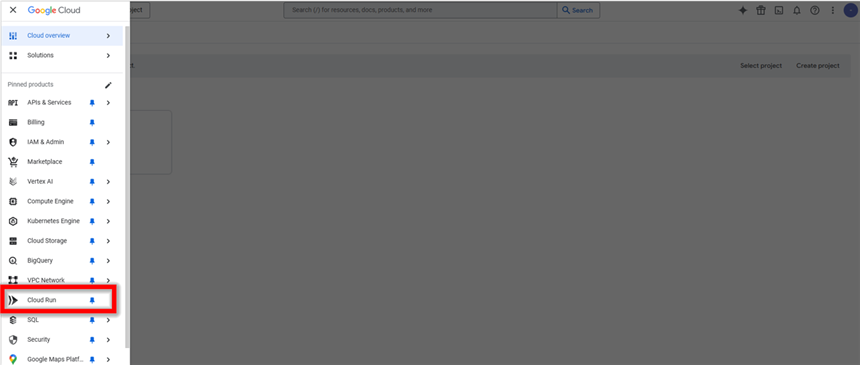

Step 2: Activate Cloud Shell

Click on the **Activate Cloud Shell** button in the top-right corner of the console. This opens a built-in terminal for running Google Cloud CLI commands without additional setup.

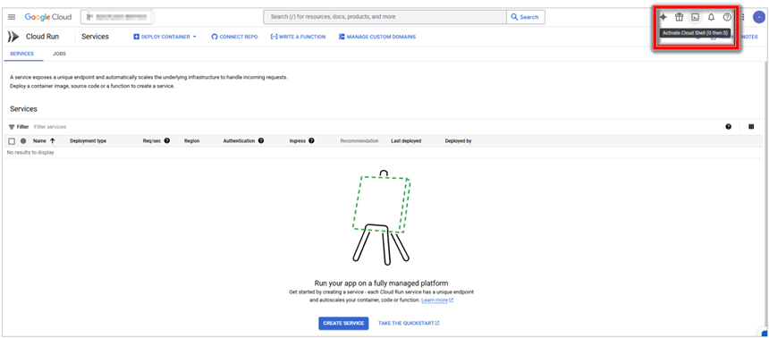

Step 3: Verify Authenticated Accounts

In the Cloud Shell terminal, enter the following **command** to list authenticated accounts and verify your active account:



gcloud auth list



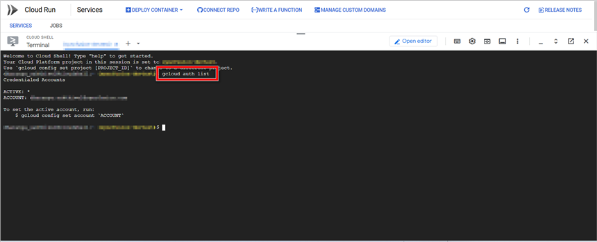

Step 4: Set Active Account

If multiple accounts are listed, **set the desired account as active** using:



gcloud config set account <your-email@example.com>



Replace <your-email@example.com> with your actual Google Cloud email.

Step 5: Enable Cloud Run API

Enable the Cloud Run API using the following **command**:



gcloud services enable run.googleapis.com



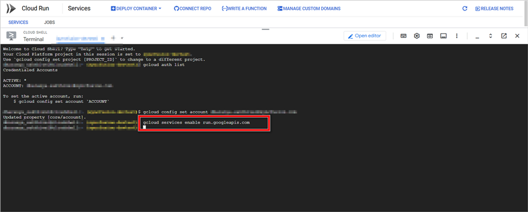

This step ensures that Cloud Run is ready for deployment. If the API is already enabled, the command will confirm that no changes were needed.

## Create an application for Cloud Run

Step 1: In Visual Studio, create a **new ASP.NET Core Web App (Model-View-Controller)** project (for example, named **Convert-Word-Document-to-PDF**), select the **.NET 8.0** framework, and click **Create**. This project will be containerized and deployed in the steps below.

Step 2: Install the following NuGet packages as a reference to your project from [NuGet.org](https://www.nuget.org/).

* [Syncfusion.DocIORenderer.Net.Core](https://www.nuget.org/packages/Syncfusion.DocIORenderer.Net.Core)
* [SkiaSharp.NativeAssets.Linux.NoDependencies](https://www.nuget.org/packages/SkiaSharp.NativeAssets.Linux.NoDependencies/)

N> The `SkiaSharp.NativeAssets.Linux.NoDependencies` package ships without native Skia libraries. The Dockerfile in Step 10 installs the required native dependencies (`fontconfig`, `libfreetype6`) at container build time.

N> Starting with v16.2.0.x, if you reference Syncfusion&reg; assemblies from trial setup or from the NuGet feed, you also have to add the "Syncfusion.Licensing" assembly reference and include a license key in your projects. Refer to this [link](https://help.syncfusion.com/common/essential-studio/licensing/overview) to know about registering the Syncfusion&reg; license key in your application.

Step 3: Include the following namespaces in the HomeController.cs file.





using Syncfusion.DocIO;
using Syncfusion.DocIO.DLS;
using Syncfusion.DocIORenderer;
using Syncfusion.Pdf;





Step 4: A default action method named Index will be present in HomeController.cs. Right click on Index method and select **Go To View** where you will be directed to its associated view page **Index.cshtml**.

Step 5: Add a new button in the Index.cshtml as shown below.





@{Html.BeginForm("ConvertWordtoPDF", "Home", FormMethod.Get);
{

    <input type="submit" value="Convert Word Document to PDF" style="width:220px;height:27px" />

}
Html.EndForm();
}





Step 6: Add a new action method **ConvertWordDocumentToPdf** in HomeController.cs and include the below code snippet to **convert the Word document to Pdf** and download it. Ensure the file has the following `using` directives at the top: `using System.IO;` and `using Microsoft.AspNetCore.Mvc;`.





//Open the file as Stream
using (FileStream docStream = new FileStream(Path.GetFullPath("Data/Template.docx"), FileMode.Open, FileAccess.Read))
{
    //Loads file stream into Word document
    using (WordDocument wordDocument = new WordDocument(docStream, FormatType.Docx))
    {
        //Instantiation of DocIORenderer for Word to PDF conversion
        using (DocIORenderer render = new DocIORenderer())
        {
            //Converts Word document into PDF document
            PdfDocument pdfDocument = render.ConvertToPDF(wordDocument);

            //Saves the PDF document to MemoryStream.
            MemoryStream stream = new MemoryStream();
            pdfDocument.Save(stream);
            stream.Position = 0;

            //Download PDF document in the browser.
            return File(stream, "application/pdf", "Sample.pdf");
        }
    }
}





Step 7: Add the following code in Program.cs file.

N> The line `app.UseHttpsRedirection();` is included by the default MVC template. Cloud Run terminates TLS at the load balancer and serves plain HTTP to the container, so the redirect may not work as expected. You can safely remove this line for Cloud Run deployments.





var builder = WebApplication.CreateBuilder(args);

// Add services to the container.
builder.Services.AddControllersWithViews();

var port = Environment.GetEnvironmentVariable("PORT") ?? "8080";
var url = $"http://0.0.0.0:{port}";

var app = builder.Build();

// Configure the HTTP request pipeline.
if (!app.Environment.IsDevelopment())
{
    app.UseExceptionHandler("/Home/Error");
    // The default HSTS value is 30 days. You may want to change this for production scenarios, see https://aka.ms/aspnetcore-hsts.
    app.UseHsts();
}

app.UseHttpsRedirection();
app.UseStaticFiles();

app.UseRouting();

app.UseAuthorization();

app.MapControllerRoute(
    name: "default",
    pattern: "{controller=Home}/{action=Index}/{id?}");

app.Run(url);





Step 8: Create a Dockerfile in the project root and add the following content.




FROM mcr.microsoft.com/dotnet/aspnet:8.0 AS base
RUN apt-get update -y && apt-get install -y \
    fontconfig \
    libfontconfig1 \
    libfreetype6 \
    && rm -rf /var/lib/apt/lists/*

USER $APP_UID
WORKDIR /app

# This stage is used to build the service project
FROM mcr.microsoft.com/dotnet/sdk:8.0 AS build
ARG BUILD_CONFIGURATION=Release
WORKDIR /src
COPY ["Convert-Word-Document-to-PDF.csproj", "."]
RUN dotnet restore "./Convert-Word-Document-to-PDF.csproj"
COPY . .
WORKDIR "/src/."
RUN dotnet build "./Convert-Word-Document-to-PDF.csproj" -c $BUILD_CONFIGURATION -o /app/build

# This stage is used to publish the service project to be copied to the final stage
FROM build AS publish
ARG BUILD_CONFIGURATION=Release
RUN dotnet publish "./Convert-Word-Document-to-PDF.csproj" -c $BUILD_CONFIGURATION -o /app/publish /p:UseAppHost=false

# This stage is used in production or when running from VS in regular mode (default when not using the Debug configuration)
FROM base AS final
WORKDIR /app
COPY --from=publish /app/publish .
ENTRYPOINT ["dotnet", "Convert-Word-Document-to-PDF.dll"]




## Upload application to Cloud Shell Editor

Step 1: Open **Cloud Shell Editor**

Open Cloud Shell Editor by clicking the pencil icon in Cloud Shell:

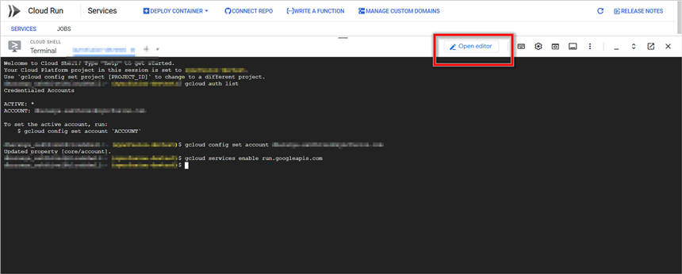

Step 2: **Upload** the sample folder

Upload the Docker sample folder to Cloud Shell Editor by selecting the **Upload Files** option.

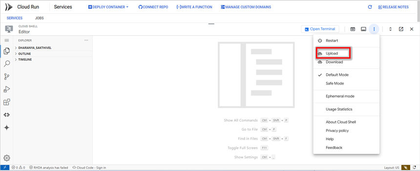

Step 3: **Navigate** to the sample folder

After uploading, open the terminal in Cloud Shell Editor and move to the sample folder using:



cd <sample-folder-name>



Replace <sample-folder-name> with the actual folder name.

## Create and Deploy Docker image in Cloud Run

Step 1: Enable the required APIs

Before building or deploying, enable the Cloud Run, Cloud Build, and Artifact Registry APIs in your project:



gcloud services enable run.googleapis.com cloudbuild.googleapis.com artifactregistry.googleapis.com



Step 2: Build and submit the Docker image to **Google Container Registry (GCR)**

Run the following command to build and submit the Docker image to Google Container Registry (GCR):



gcloud builds submit --tag gcr.io/<your-project-id>/wordtopdf



Replace `<your-project-id>` with your actual Google Cloud project ID.

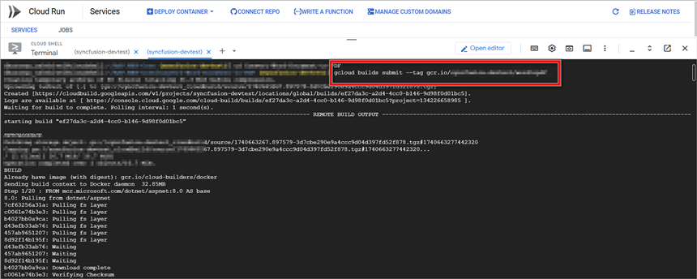

N> **Google Container Registry is deprecated.** For new projects, prefer Artifact Registry. Replace the image tag with `REGION-docker.pkg.dev/<your-project-id>/wordtopdf-repo/wordtopdf` after creating a repository named `wordtopdf-repo` (`gcloud artifacts repositories create wordtopdf-repo --repository-format=docker --location=REGION`).

Step 3: List stored container images in **GCR**

Verify the stored container images using:



gcloud container images list



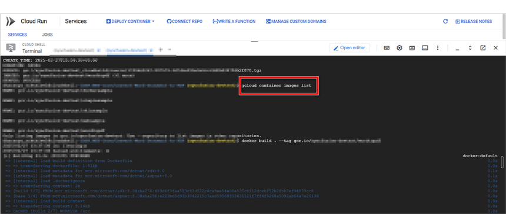

Step 4: **Build** the Docker image

Enter the following command to build the application.



docker build . --tag gcr.io/<your-project-id>/wordtopdf



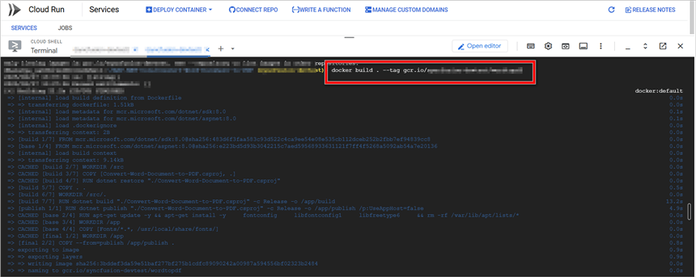

Step 5: **Run** the sample locally

Run the container locally on port 8080 to verify it works before deploying:



docker run -p 8080:8080 gcr.io/<your-project-id>/wordtopdf



To close the preview page, return to the terminal, and press **Ctrl+C** to stop the process.

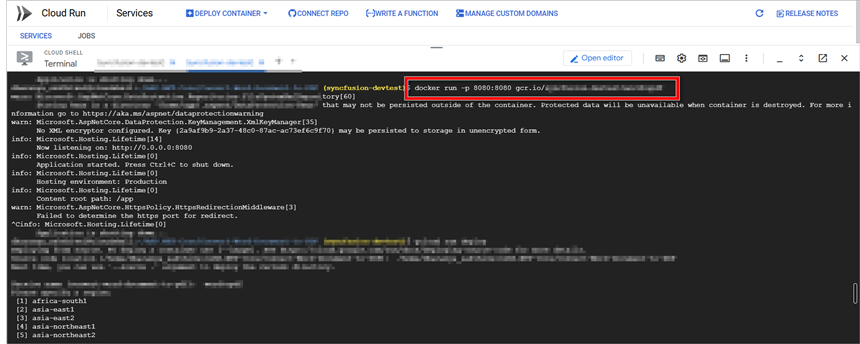

Step 6: **Deploy** the sample to Cloud Run

Deploy the container to Cloud Run using the following command. Replace the placeholders with your values:



gcloud run deploy wordtopdf \
  --image gcr.io/<your-project-id>/wordtopdf \
  --platform managed \
  --region <your-region> \
  --allow-unauthenticated



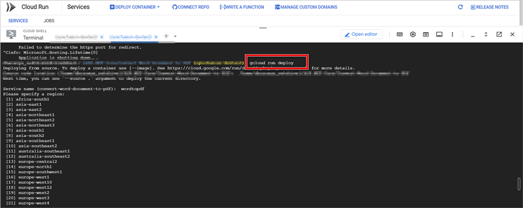

Provide the following values when prompted (or replace the placeholders in the command above):

* **Container Image URL** – Enter `gcr.io/<your-project-id>/wordtopdf`.
* **Service Name** – Assign a name to your service (for example, `wordtopdf`).
* **Region** – Choose the deployment region (for example, `us-central1`).

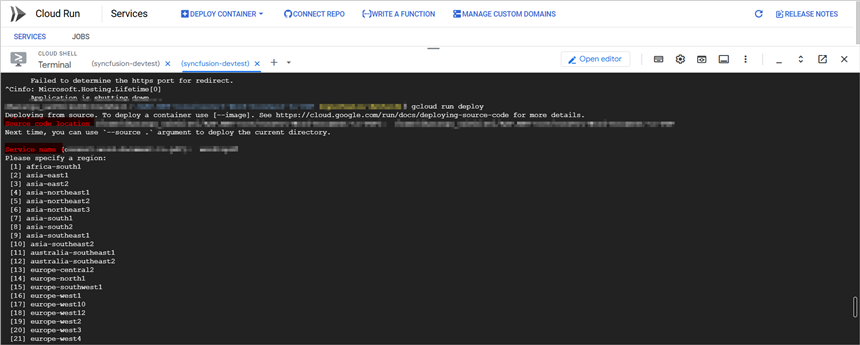

Step 7: Retrieve the generated **Service URL**

Once deployment is complete, a Cloud Run service URL will be generated. Copy this URL to access your deployed service.

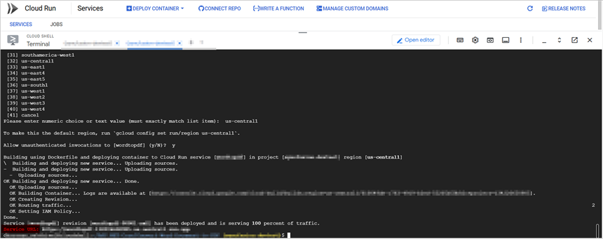

You can download a complete working sample from [GitHub](https://github.com/SyncfusionExamples/DocIO-Examples/tree/main/Word-to-PDF-Conversion/Convert-Word-document-to-PDF/GCP/Google-Cloud-Run).

By executing the program, you will get the **PDF document** as follows. The output is downloaded by the browser when the deployed service is invoked.

Looking for the full .NET Word Library overview, features, pricing, and documentation? Visit the [.NET Word Library](https://www.syncfusion.com/document-sdk/net-word-library) page.

An online sample link to [convert a Word document to PDF](https://document.syncfusion.com/demos/word/wordtopdf#/tailwind) in ASP.NET Core. 

## See also

* [Convert Word to PDF in Google App Engine](https://help.syncfusion.com/document-processing/word/conversions/word-to-pdf/net/convert-word-document-to-pdf-in-google-app-engine)
* [Convert Word to PDF in Google Cloud Platform (GCP)](https://help.syncfusion.com/document-processing/word/conversions/word-to-pdf/net/convert-word-document-to-pdf-in-google-cloud-platform) — overview of all supported GCP services.
