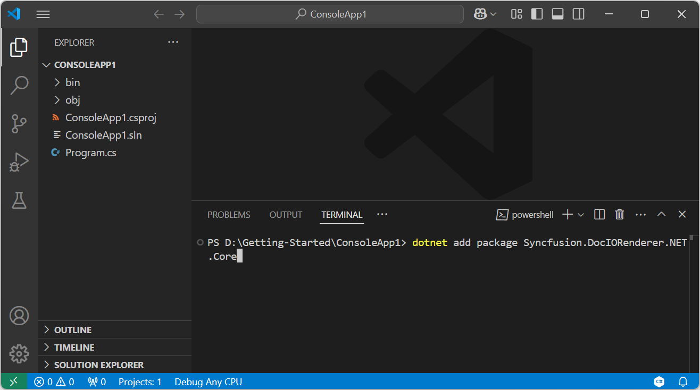
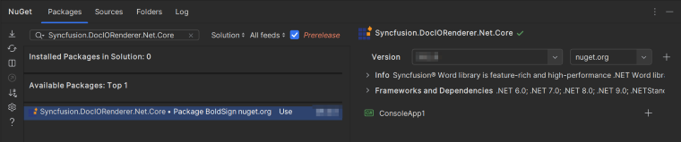

# Convert Word document to PDF on macOS

Syncfusion<sup>&reg;</sup> DocIO is a [.NET Core Word library](https://www.syncfusion.com/document-processing/word-framework/net-core/word-library) used to create, read, edit, and **convert Word documents** programmatically without **Microsoft Word** or interop dependencies. Using this library, you can **convert a Word document to PDF in .NET Core application on macOS**.

## Steps to convert Word document to PDF in .NET Core application on macOS





**Prerequisites:**

* Visual Studio 2022.
* Install [.NET 8 SDK](https://dotnet.microsoft.com/en-us/download/dotnet/8.0) or later.

Step 1: Create a new .NET Core console application project.


Step 2: Select the project version.


Step 3: Install the [Syncfusion.DocIORenderer.Net.Core ](https://www.nuget.org/packages/Syncfusion.DocIORenderer.Net.Core/) NuGet package as a reference to your project from [NuGet.org](https://www.nuget.org/).Install the Nuget Package on Mac please refer this [Link](https://learn.microsoft.com/en-us/visualstudio/mac/nuget-walkthrough?view=vsmac-2022).

N> Starting with v16.2.0.x, if you reference Syncfusion<sup>&reg;</sup> assemblies from trial setup or from the NuGet feed, you also have to add "Syncfusion.Licensing" assembly reference and include a license key in your projects. Please refer to this [link](https://help.syncfusion.com/common/essential-studio/licensing/overview) to know about registering Syncfusion<sup>&reg;</sup> license key in your application to use our components.

Step 4: Include the following Namespaces in the Program.cs file.




using Syncfusion.DocIO;
using Syncfusion.DocIO.DLS;
using Syncfusion.DocIORenderer;
using Syncfusion.Pdf;




Step 5: Add the following code snippet in Program.cs file.




using (FileStream docStream = new FileStream(Path.GetFullPath(@"../../../Data/Template.docx"), FileMode.Open, FileAccess.Read))
{
    //Loads file stream into Word document
    using (WordDocument wordDocument = new WordDocument(docStream, FormatType.Docx))
    {
        //Instantiation of DocIORenderer for Word to PDF conversion
        using (DocIORenderer render = new DocIORenderer())
        {
            //Converts Word document into PDF document
            using (PdfDocument pdfDocument = render.ConvertToPDF(wordDocument))
            {
                //Saves the PDF document to MemoryStream.
                MemoryStream stream = new MemoryStream();
                pdfDocument.Save(stream);
                stream.Position = 0;

                //Save the PDF document in local machine
                Stream file = File.Create("Sample.pdf");
                stream.CopyTo(file);
                file.Close();
            }
        }
    }
}





Step 6: Build the project.

Click on Build → Build Solution or press <kbd>Ctrl</kbd>+<kbd>Shift</kbd>+<kbd>B</kbd> to build the project.

Step 7: Run the project.

Click the Start button (green arrow) or press <kbd>F5</kbd> to run the app.

You can download a complete working sample from [GitHub](https://github.com/SyncfusionExamples/DocIO-Examples/tree/main/Word-to-PDF-Conversion/Convert-Word-document-to-PDF/Mac).

By executing the program, you will get the **PDF document** as follows. The output will be saved in bin folder.






**Prerequisites:**

* Visual Studio Code.
* Install [.NET 8 SDK](https://dotnet.microsoft.com/en-us/download/dotnet/8.0) or later.
* Open Visual Studio Code and install the [C# for Visual Studio Code extension](https://marketplace.visualstudio.com/items?itemName=ms-dotnettools.csharp) from the Extensions Marketplace.

Step 1: Create a new .NET Core console application project.
* Open the command palette by pressing <kbd>Ctrl</kbd>+<kbd>Shift</kbd>+<kbd>P</kbd> and type **.NET:New Project** and enter.
* Choose the **Console App** template.


* Select the project location, type the project name and press enter.
* Then choose **Create project**.

Step 2: To **convert a Word document to PDF in console app**, install [Syncfusion.DocIORenderer.Net.Core ](https://www.nuget.org/packages/Syncfusion.DocIORenderer.Net.Core/) to the project.
* Press <kbd>Ctrl</kbd> + <kbd>`</kbd> (backtick) to open the integrated terminal in Visual Studio Code.
* Ensure you're in the project root directory where your .csproj file is located.
* Run the command `dotnet add package Syncfusion.DocIORenderer.NET.Core` to install the NuGet package.

 

N> Starting with v16.2.0.x, if you reference Syncfusion<sup>&reg;</sup> assemblies from trial setup or from the NuGet feed, you also have to add "Syncfusion.Licensing" assembly reference and include a license key in your projects. Please refer to this [link](https://help.syncfusion.com/common/essential-studio/licensing/overview) to know about registering Syncfusion<sup>&reg;</sup> license key in your application to use our components.

Step 3: Include the following Namespaces in the Program.cs file.




using Syncfusion.DocIO;
using Syncfusion.DocIO.DLS;
using Syncfusion.DocIORenderer;
using Syncfusion.Pdf;




Step 4: Add the following code snippet in Program.cs file.




using (FileStream docStream = new FileStream(Path.GetFullPath(@"../../../Data/Template.docx"), FileMode.Open, FileAccess.Read))
{
    //Loads file stream into Word document
    using (WordDocument wordDocument = new WordDocument(docStream, FormatType.Docx))
    {
        //Instantiation of DocIORenderer for Word to PDF conversion
        using (DocIORenderer render = new DocIORenderer())
        {
            //Converts Word document into PDF document
            using (PdfDocument pdfDocument = render.ConvertToPDF(wordDocument))
            {
                //Saves the PDF document to MemoryStream.
                MemoryStream stream = new MemoryStream();
                pdfDocument.Save(stream);
                stream.Position = 0;

                //Save the PDF document in local machine
                Stream file = File.Create("Sample.pdf");
                stream.CopyTo(file);
                file.Close();
            }
        }
    }
}





Step 5: Build the project.

Run the following command in terminal to build the project.

```
dotnet build
```

Step 6: Run the project.

Run the following command in terminal to run the project.

```
dotnet run
```

You can download a complete working sample from [GitHub](https://github.com/SyncfusionExamples/DocIO-Examples/tree/main/Word-to-PDF-Conversion/Convert-Word-document-to-PDF/Mac).

By executing the program, you will get the **PDF document** as follows. The output will be saved in bin folder.






**Prerequisites:**

* JetBrains Rider.
* Install .NET 8 SDK or later.

Step 1. Open JetBrains Rider and create a new .NET Core console application project.
* Launch JetBrains Rider.
* Click **New solution** on the welcome screen.


* In the New Solution dialog, select **Project Type** as **Console**.
* Select the target framework (e.g., .NET 8.0, .NET 9.0).
* Enter a project name and specify the location.
* Click create.


Step 2: Install the NuGet package from [NuGet.org](https://www.nuget.org/).
* Click the NuGet icon in the Rider toolbar and type [Syncfusion.DocIORenderer.Net.Core](https://www.nuget.org/packages/Syncfusion.DocIORenderer.Net.Core) in the search bar.
* Ensure that nuget.org is selected as the package source.
* Select the latest Syncfusion.DocIORenderer.Net.Core NuGet package from the list.
* Click the + (Add) button to add the package.



* Click the **Install** button to complete the installation.


N> Starting with v16.2.0.x, if you reference Syncfusion assemblies from trial setup or from the NuGet feed, you also have to add "Syncfusion.Licensing" assembly reference and include a license key in your projects. Please refer to this [link](https://help.syncfusion.com/common/essential-studio/licensing/overview) to know about registering Syncfusion license key in your application to use our components.

Step 3: Include the following Namespaces in the Program.cs file.




using Syncfusion.DocIO;
using Syncfusion.DocIO.DLS;
using Syncfusion.DocIORenderer;
using Syncfusion.Pdf;




Step 4: Add the following code snippet in Program.cs file.




using (FileStream docStream = new FileStream(Path.GetFullPath(@"../../../Data/Template.docx"), FileMode.Open, FileAccess.Read))
{
    //Loads file stream into Word document
    using (WordDocument wordDocument = new WordDocument(docStream, FormatType.Docx))
    {
        //Instantiation of DocIORenderer for Word to PDF conversion
        using (DocIORenderer render = new DocIORenderer())
        {
            //Converts Word document into PDF document
            using (PdfDocument pdfDocument = render.ConvertToPDF(wordDocument))
            {
                //Saves the PDF document to MemoryStream.
                MemoryStream stream = new MemoryStream();
                pdfDocument.Save(stream);
                stream.Position = 0;

                //Save the PDF document in local machine
                Stream file = File.Create("Sample.pdf");
                stream.CopyTo(file);
                file.Close();
            }
        }
    }
}





Step 5: Build the project.

Click the **Build** button in the toolbar or press <kbd>Ctrl</kbd>+<kbd>Shift</kbd>+<kbd>B</kbd> to build the project.

Step 6: Run the project.

Click the **Run** button (green arrow) in the toolbar or press <kbd>F5</kbd> to run the app.

You can download a complete working sample from [GitHub](https://github.com/SyncfusionExamples/DocIO-Examples/tree/main/Word-to-PDF-Conversion/Convert-Word-document-to-PDF/Mac).

By executing the program, you will get the **PDF document** as follows. The output will be saved in bin folder.






Click [here](https://www.syncfusion.com/document-processing/word-framework/net-core) to explore the rich set of Syncfusion<sup>&reg;</sup> Word library (DocIO) features. 

An online sample link to [convert Word document to PDF](https://document.syncfusion.com/demos/word/wordtopdf#/tailwind) in ASP.NET Core. 