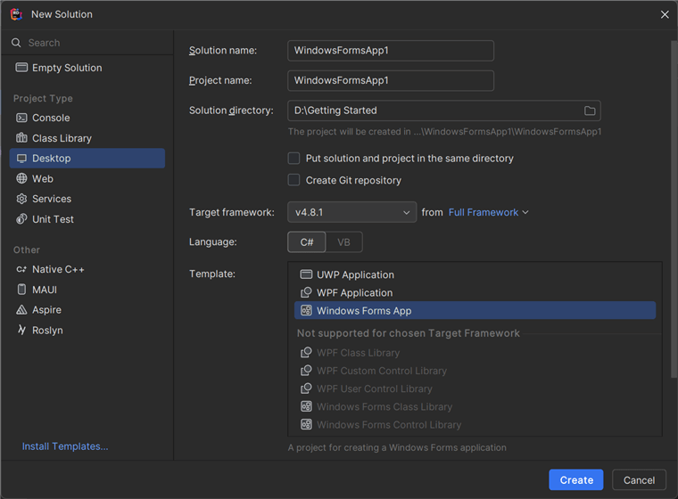

# Convert Word document to PDF in Windows Forms

Syncfusion&reg; DocIO is a [.NET Word library](https://www.syncfusion.com/document-processing/word-framework/net/word-library) used to create, read, edit, and **convert Word documents** programmatically without **Microsoft Word** or interop dependencies. Using this library, you can **convert a Word document to PDF in Windows Forms**.

## Steps to convert Word document to PDF in Windows Forms





**Prerequisites:**

* Visual Studio 2022.
* Install **.NET desktop development** workload with necessary .NET Framework SDK.

Step 1: Create a new Windows Forms application project.

Step 2: Install [Syncfusion.DocToPdfConverter.WinForms](https://www.nuget.org/packages/Syncfusion.DocToPDFConverter.WinForms) NuGet package as a reference to your Windows Forms application from the [NuGet.org](https://www.nuget.org/).

N> Starting with v16.2.0.x, if you reference Syncfusion&reg; assemblies from trial setup or from the NuGet feed, you also have to add "Syncfusion.Licensing" assembly reference and include a license key in your projects. Please refer to this [link](https://help.syncfusion.com/common/essential-studio/licensing/overview) to know about registering Syncfusion&reg; license key in your application to use our components.

Step 3: Include the following namespaces in the **Form1.Designer.cs** file.





using Syncfusion.DocIO.DLS;
using Syncfusion.DocIO;
using Syncfusion.DocToPDFConverter;
using Syncfusion.Pdf;





Step 4: Add a new button in **Form1.Designer.cs** to create Word file as follows.





private Button btnCreate;
private Label label;

private void InitializeComponent()
{
    label = new Label();
    btnCreate = new Button();
    //Label
    label.Location = new System.Drawing.Point(0, 40);
    label.Size = new System.Drawing.Size(426, 35);
    label.Text = "Click the button to Convert Word document to PDF generated by Essential DocIO. Please note that Microsoft Word Viewer or Microsoft Word is required to view the resultant Word document";
    label.TextAlign = System.Drawing.ContentAlignment.MiddleCenter;

    //Button
    btnCreate.Location = new System.Drawing.Point(180, 110);
    btnCreate.Size = new System.Drawing.Size(85, 36);
    btnCreate.Text = "Convert Word document to PDF";
    btnCreate.Click += new EventHandler(btnConvert_Click);

    //Create Word
    ClientSize = new System.Drawing.Size(450, 150);
    Controls.Add(label);
    Controls.Add(btnCreate);
    Text = "Convert Word document to PDF";
}




Step 5: Add the following code in **btnConvert_Click** to **convert Word document to PDF** with simple text.





//Load the existing Word document 
using (WordDocument document = new WordDocument(Path.GetFullPath(@"../../Data/Input.docx"), FormatType.Docx))
{
    //Instantiation of DocToPDFConverter for Word to PDF conversion
    using (DocToPDFConverter converter = new DocToPDFConverter())
    {
        //Converts Word document into PDF document
        using (PdfDocument pdfDocument = converter.ConvertToPDF(document))
        {
            //Saves the PDF document
            pdfDocument.Save(Path.GetFullPath(@"../../Sample.pdf"));                       
        }
    };               
}





Step 6: Build the project.

Click on Build → Build Solution or press <kbd>Ctrl</kbd>+<kbd>Shift</kbd>+<kbd>B</kbd> to build the project.

Step 7: Run the project.

Click the Start button (green arrow) or press <kbd>F5</kbd> to run the app.

You can download a complete working sample from [GitHub](https://github.com/SyncfusionExamples/DocIO-Examples/tree/main/Word-to-PDF-Conversion/Convert-Word-document-to-PDF/WindowForms).

By executing the program, you will get the **PDF document** as follows.





**Prerequisites:**

* JetBrains Rider.
* Install .NET Framework Developer Pack.

Step 1. Open JetBrains Rider and create a new Windows Forms Application project.
* Launch JetBrains Rider.
* Click **New Solution** on the welcome screen.

* In the New Solution dialog, select **Project Type** as **Desktop**.
* Enter a project name and specify the location.
* Select the target framework as Full Framework and choose the desired version.
* Select **Template** as **Windows Forms App**.
* Click create.

Step 2: Install the NuGet package from [NuGet.org](https://www.nuget.org/).
* Click the NuGet icon in the Rider toolbar and type [Syncfusion.DocToPdfConverter.WinForms](https://www.nuget.org/packages/Syncfusion.DocToPdfConverter.WinForms/) in the search bar.
* Ensure that nuget.org is selected as the package source.
* Select the latest Syncfusion.DocToPdfConverter.WinForms NuGet package from the list.
* Click the + (Add) button to add the package.

* Click the Install button to complete the installation.

N> Starting with v16.2.0.x, if you reference Syncfusion assemblies from trial setup or from the NuGet feed, you also have to add "Syncfusion.Licensing" assembly reference and include a license key in your projects. Please refer to this [link](https://help.syncfusion.com/common/essential-studio/licensing/overview) to know about registering Syncfusion license key in your application to use our components.

Step 3: Include the following namespaces in the **Form1.Designer.cs** file.





using Syncfusion.DocIO.DLS;
using Syncfusion.DocIO;
using Syncfusion.DocToPDFConverter;
using Syncfusion.Pdf;





Step 4: Add a new button in **Form1.Designer.cs** to create Word file as follows.





private Button btnCreate;
private Label label;

private void InitializeComponent()
{
    label = new Label();
    btnCreate = new Button();
    //Label
    label.Location = new System.Drawing.Point(0, 40);
    label.Size = new System.Drawing.Size(426, 35);
    label.Text = "Click the button to Convert Word document to PDF generated by Essential DocIO. Please note that Microsoft Word Viewer or Microsoft Word is required to view the resultant Word document";
    label.TextAlign = System.Drawing.ContentAlignment.MiddleCenter;

    //Button
    btnCreate.Location = new System.Drawing.Point(180, 110);
    btnCreate.Size = new System.Drawing.Size(85, 36);
    btnCreate.Text = "Convert Word document to PDF";
    btnCreate.Click += new EventHandler(btnConvert_Click);

    //Create Word
    ClientSize = new System.Drawing.Size(450, 150);
    Controls.Add(label);
    Controls.Add(btnCreate);
    Text = "Convert Word document to PDF";
}




Step 5: Add the following code in **btnConvert_Click** to **convert Word document to PDF** with simple text.





//Load the existing Word document 
using (WordDocument document = new WordDocument(Path.GetFullPath(@"../../Data/Input.docx"), FormatType.Docx))
{
    //Instantiation of DocToPDFConverter for Word to PDF conversion
    using (DocToPDFConverter converter = new DocToPDFConverter())
    {
        //Converts Word document into PDF document
        using (PdfDocument pdfDocument = converter.ConvertToPDF(document))
        {
            //Saves the PDF document
            pdfDocument.Save(Path.GetFullPath(@"../../Sample.pdf"));                       
        }
    };               
}





Step 6: Build the project.

Click the **Build** button in the toolbar or press <kbd>Ctrl</kbd>+<kbd>Shift</kbd>+<kbd>B</kbd> to build the project.

Step 7: Run the project.

Click the **Run** button (green arrow) in the toolbar or press <kbd>F5</kbd> to run the app.

You can download a complete working sample from [GitHub](https://github.com/SyncfusionExamples/DocIO-Examples/tree/main/Word-to-PDF-Conversion/Convert-Word-document-to-PDF/WindowForms).

By executing the program, you will get the **PDF document** as follows.





Click [here](https://www.syncfusion.com/document-processing/word-framework/net) to explore the rich set of Syncfusion&reg; Word library (DocIO) features.

An online sample link to [convert Word document to PDF](https://ej2.syncfusion.com/aspnetcore/Word/WordToPDF#/material3) in ASP.NET Core. 