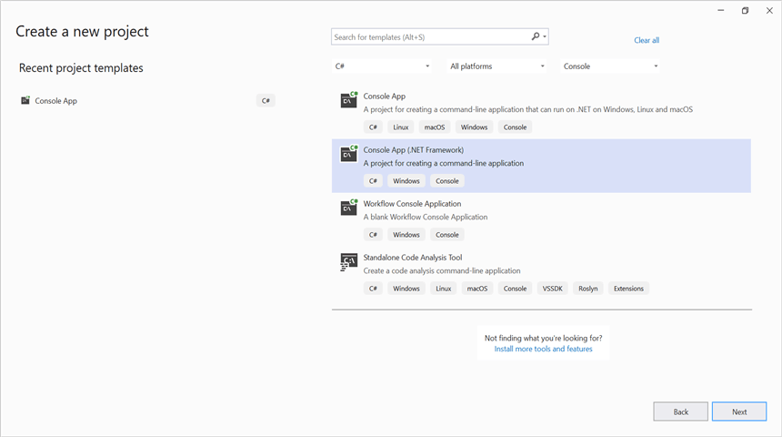

# Convert Word to PDF in Console application

Syncfusion<sup>&reg;</sup> DocIO is a [.NET Word library](https://www.syncfusion.com/document-processing/word-framework/net/word-library) used to create, read, edit, and **convert Word documents** programmatically without **Microsoft Word** or interop dependencies. Using this library, you can **convert Word to PDF in Console application**.

## Convert Word to PDF using .NET Core and Latest





**Prerequisites:**

* Visual Studio 2022.
* Install [.NET 8 SDK](https://dotnet.microsoft.com/en-us/download/dotnet/8.0) or later.

Step 1: Create a new **.NET Core console application** project.


Step 2: Install the [Syncfusion.DocIORenderer.Net.Core ](https://www.nuget.org/packages/Syncfusion.DocIORenderer.Net.Core/) NuGet package as a reference to your project from [NuGet.org](https://www.nuget.org/).


N> Starting with v16.2.0.x, if you reference Syncfusion<sup>&reg;</sup> assemblies from trial setup or from the NuGet feed, you also have to add "Syncfusion.Licensing" assembly reference and include a license key in your projects. Please refer to this [link](https://help.syncfusion.com/common/essential-studio/licensing/overview) to know about registering Syncfusion<sup>&reg;</sup> license key in your application to use our components.

Step 3: Include the following namespaces in **Program.cs** file.




using Syncfusion.DocIO;
using Syncfusion.DocIO.DLS;
using Syncfusion.DocIORenderer;
using Syncfusion.Pdf;




Step 4: Include the below code snippet in **Program.cs** to **convert Word to PDF**.




//Open the file as Stream.
using (FileStream docStream = new FileStream(Path.GetFullPath("Data/Template.docx"), FileMode.Open, FileAccess.Read))
{
    //Load file stream into Word document.
    using (WordDocument wordDocument = new WordDocument(docStream, FormatType.Docx))
    {
        //Instantiation of DocIORenderer for Word to PDF conversion.
        using (DocIORenderer render = new DocIORenderer())
        {
            //Convert Word document into PDF document.
            PdfDocument pdfDocument = render.ConvertToPDF(wordDocument);

            //Save the PDF document.
            using(FileStream stream = new FileStream("Sample.pdf", FileMode.Create, FileAccess.Write))
            {
                pdfDocument.Save(stream);
            }           
        }
    }
}




Step 6: Build the project.

Click on Build → Build Solution or press <kbd>Ctrl</kbd>+<kbd>Shift</kbd>+<kbd>B</kbd> to build the project.

Step 7: Run the project.

Click the Start button (green arrow) or press <kbd>F5</kbd> to run the app.

You can download a complete working sample from [GitHub](https://github.com/SyncfusionExamples/DocIO-Examples/tree/main/Word-to-PDF-Conversion/Convert-Word-document-to-PDF/.NET).

By executing the program, you will get the **PDF** as follows.






**Prerequisites:**

* Visual Studio Code.
* Install [.NET 8 SDK](https://dotnet.microsoft.com/en-us/download/dotnet/8.0) or later.
* Open Visual Studio Code and install the [C# for Visual Studio Code extension](https://marketplace.visualstudio.com/items?itemName=ms-dotnettools.csharp) from the Extensions Marketplace.

Step 1: Create a new .NET Core console application project.
* Open the command palette by pressing <kbd>Ctrl</kbd>+<kbd>Shift</kbd>+<kbd>P</kbd> and type **.NET:New Project** and enter.
* Choose the **Console App** template.


* Select the project location, type the project name and press enter.
* Then choose **Create project**.

Step 2: To **convert a Word document to PDF in console app**, install [Syncfusion.DocIORenderer.Net.Core ](https://www.nuget.org/packages/Syncfusion.DocIORenderer.Net.Core/) to the project.
* Press <kbd>Ctrl</kbd> + <kbd>`</kbd> (backtick) to open the integrated terminal in Visual Studio Code.
* Ensure you're in the project root directory where your .csproj file is located.
* Run the command `dotnet add package Syncfusion.DocIORenderer.NET.Core` to install the NuGet package.

 

N> Starting with v16.2.0.x, if you reference Syncfusion<sup>&reg;</sup> assemblies from trial setup or from the NuGet feed, you also have to add "Syncfusion.Licensing" assembly reference and include a license key in your projects. Please refer to this [link](https://help.syncfusion.com/common/essential-studio/licensing/overview) to know about registering Syncfusion<sup>&reg;</sup> license key in your application to use our components.

Step 3: Include the following namespaces in **Program.cs** file.




using Syncfusion.DocIO;
using Syncfusion.DocIO.DLS;
using Syncfusion.DocIORenderer;
using Syncfusion.Pdf;




Step 4: Include the below code snippet in **Program.cs** to **convert Word to PDF**.




//Open the file as Stream.
using (FileStream docStream = new FileStream(Path.GetFullPath("Data/Template.docx"), FileMode.Open, FileAccess.Read))
{
    //Load file stream into Word document.
    using (WordDocument wordDocument = new WordDocument(docStream, FormatType.Docx))
    {
        //Instantiation of DocIORenderer for Word to PDF conversion.
        using (DocIORenderer render = new DocIORenderer())
        {
            //Convert Word document into PDF document.
            PdfDocument pdfDocument = render.ConvertToPDF(wordDocument);

            //Save the PDF document.
            using(FileStream stream = new FileStream("Sample.pdf", FileMode.Create, FileAccess.Write))
            {
                pdfDocument.Save(stream);
            }           
        }
    }
}




Step 5: Build the project.

Run the following command in terminal to build the project.

```
dotnet build
```

Step 6: Run the project.

Run the following command in terminal to run the project.

```
dotnet run
```

You can download a complete working sample from [GitHub](https://github.com/SyncfusionExamples/DocIO-Examples/tree/main/Word-to-PDF-Conversion/Convert-Word-document-to-PDF/.NET).

By executing the program, you will get the **PDF** as follows.



 


## Convert Word to PDF in .NET Framework

The below steps illustrates creating a simple **Word document** in console application using **.NET Framework**.

Step 1: Create a new **.NET FrameWork console application** project.


Step 2: Install [Syncfusion.DocToPdfConverter.WinForms](https://www.nuget.org/packages/Syncfusion.DocToPDFConverter.WinForms) NuGet package as a reference to your Windows Forms application from the [NuGet.org](https://www.nuget.org/).


N> 1. The [Syncfusion.DocToPdfConverter.WinForms](https://www.nuget.org/packages/Syncfusion.DocToPDFConverter.WinForms) is a dependency for Syncfusion<sup>&reg;</sup> Windows Forms GUI controls and is named with the suffix "WinForms". It contains platform-independent .NET Framework assemblies (compatible with versions 4.0, 4.5, 4.5.1, and 4.6) for the Word library and does not include any Windows Forms-related references or code. Therefore, we recommend using this package for .NET Framework Console applications.
N> 2. Starting with v16.2.0.x, if you reference Syncfusion<sup>&reg;</sup> assemblies from trial setup or from the NuGet feed, you also have to add "Syncfusion.Licensing" assembly reference and include a license key in your projects. Please refer to this [link](https://help.syncfusion.com/common/essential-studio/licensing/overview) to know about registering Syncfusion<sup>&reg;</sup> license key in your application to use our components.

Step 3: Include the following namespaces in **Program.cs** file.




using Syncfusion.DocIO.DLS;
using Syncfusion.DocIO;
using Syncfusion.DocToPDFConverter;
using Syncfusion.Pdf;




Step 5: Include the below code snippet in **Program.cs** to **convert Word to PDF**.




//Load the existing Word document.
using (WordDocument document = new WordDocument("Data/Input.docx", FormatType.Docx))
{
    //Instantiation of DocToPDFConverter for Word to PDF conversion.
    using (DocToPDFConverter converter = new DocToPDFConverter())
    {
        //Convert Word document into PDF document.
        using (PdfDocument pdfDocument = converter.ConvertToPDF(document))
        {
            //Save the PDF document.
            pdfDocument.Save("Sample.pdf");                       
        }
    }               
}




You can download a complete working sample from [GitHub](https://github.com/SyncfusionExamples/DocIO-Examples/tree/main/Word-to-PDF-Conversion/Convert-Word-document-to-PDF/.NET-Framework).

By executing the program, you will get the **PDF** as follows.


An online sample link to [convert Word document to PDF](https://ej2aspnetcore.azurewebsites.net/aspnetcore/word/wordtopdf#/material3) in ASP.NET Core.
