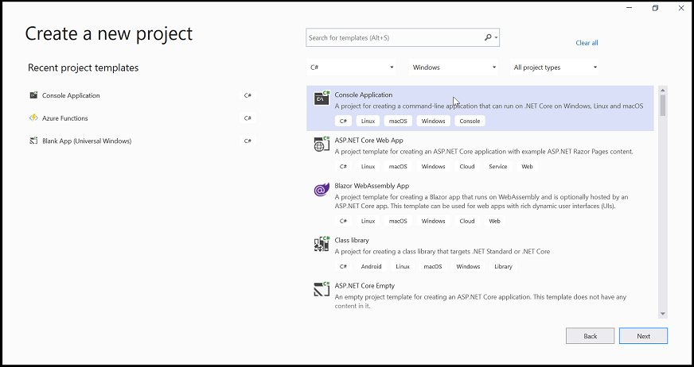
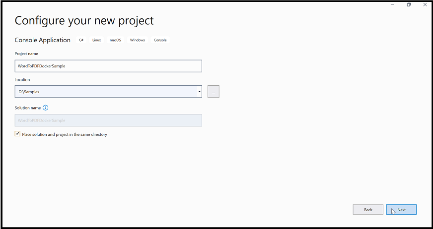
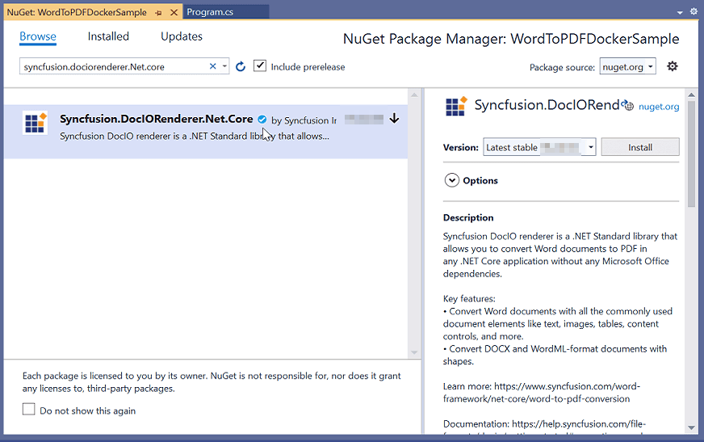
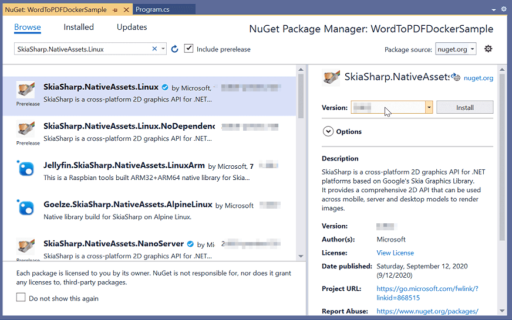
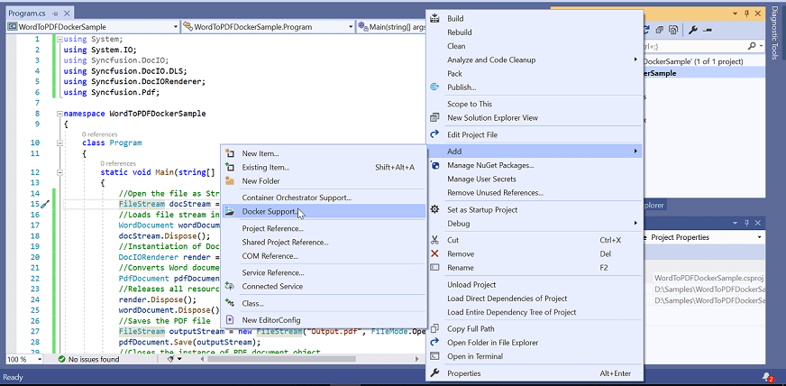
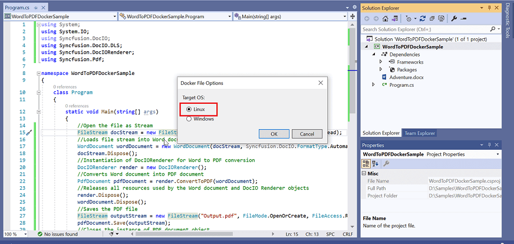
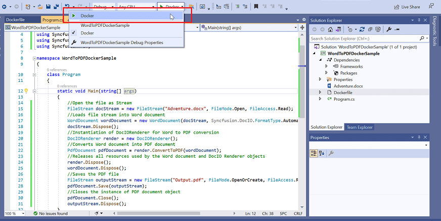
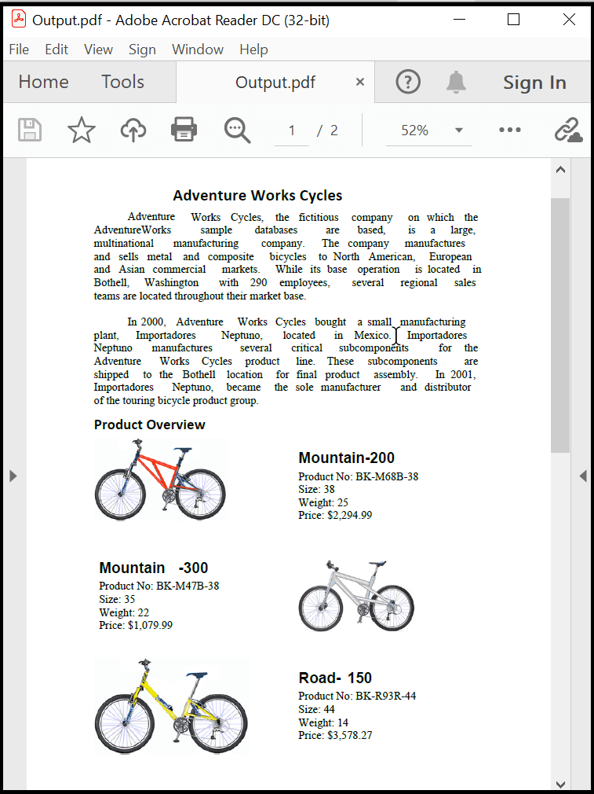

# Essential&reg; DocIO in Docker

Docker is an open platform for developing, shipping and running applications. You can use Essential&reg; DocIO in Docker container to create, read, write and convert Microsoft Word documents into various formats. From this page, you can learn how to convert Word document to PDF in Linux Docker using Syncfusion&reg; Word library (Essential&reg; DocIO). 

## Steps to convert a Word document to PDF in Linux Docker

Step 1: Create a new Core Console application.

Step 2: Install the below NuGet packages as a reference to your project from [NuGet.org](https://www.nuget.org/).

* [Syncfusion.DocIORenderer.Net.Core](https://www.nuget.org/packages/Syncfusion.DocIORenderer.Net.Core/)
* [SkiaSharp.NativeAssets.Linux v3.119.1](https://www.nuget.org/packages/SkiaSharp.NativeAssets.Linux/3.119.1) 
* [HarfBuzzSharp.NativeAssets.Linux v8.3.0.2](https://www.nuget.org/packages/HarfBuzzSharp.NativeAssets.Linux/8.3.0.2) 

N> Starting with v16.2.0.x, if you reference Syncfusion&reg; assemblies from trial setup or from the NuGet feed, you also have to add "Syncfusion.Licensing" assembly reference and include a license key in your projects. Please refer to this [link](https://help.syncfusion.com/common/essential-studio/licensing/overview) to know about Syncfusion&reg; Syncfusion&reg; license key in your application to use our components.

Step 3: Include the following namespaces in the Program.cs file.



using System.IO;
using Syncfusion.DocIO.DLS;
using Syncfusion.DocIORenderer;
using Syncfusion.Pdf;



Step 4: Add the following code snippet in Program.cs file.



//Open the file as Stream
using (FileStream docStream = new FileStream(@"Adventure.docx", FileMode.Open, FileAccess.Read))
{
    //Loads file stream into Word document
    using (WordDocument wordDocument = new WordDocument(docStream, Syncfusion.DocIO.FormatType.Automatic))
    {
        //Instantiation of DocIORenderer for Word to PDF conversion
        using (DocIORenderer render = new DocIORenderer())
        {
            //Converts Word document into PDF document
            using (PdfDocument pdfDocument = render.ConvertToPDF(wordDocument))
            {
                //Saves the PDF file
                using (FileStream outputStream = new FileStream("Output.pdf", FileMode.OpenOrCreate, FileAccess.ReadWrite))
                {
                    pdfDocument.Save(outputStream);
                }
            }
        }
    }
}



Step 5: Add Docker support to that application by clicking <b>Add -> Docker Support.</b>

Step 6: Choose Linux option in order to run the application in Linux Docker container.

Step 7: Open the Dockerfile to see the default Docker commands that are shown below.




FROM mcr.microsoft.com/dotnet/aspnet:8.0-buster-slim AS base
RUN apt-get update -y && apt-get install fontconfig -y
WORKDIR /app

FROM mcr.microsoft.com/dotnet/sdk:8.0-buster-slim AS build
WORKDIR /src
COPY ["WordToPDFDockerSample.csproj", "."]
RUN dotnet restore "./WordToPDFDockerSample.csproj"
COPY . .
WORKDIR "/src/."
RUN dotnet build "WordToPDFDockerSample.csproj" -c Release -o /app/build

FROM build AS publish
RUN dotnet publish "WordToPDFDockerSample.csproj" -c Release -o /app/publish

FROM base AS final
WORKDIR /app
COPY --from=publish /app/publish .
ENTRYPOINT ["dotnet", "WordToPDFDockerSample.dll"]




Step 8: Select Docker option and Run the application.

A complete working example of converting Word document to PDF in Linux Docker container can be downloaded from [GitHub](https://github.com/SyncfusionExamples/DocIO-Examples/tree/main/Word-to-PDF-Conversion/Convert-Word-document-to-PDF/Docker/Debian/WordToPDFDockerSample).

Finally, you will get the converted PDF document as follows.

## Dockerfile Examples

The following examples demonstrate how the Docker file should be configured in order to convert a Word document to PDF in different Linux distributions.

## Alpine

You can use the below Dockerfile to convert a Word document to PDF in Alpine Linux.




FROM mcr.microsoft.com/dotnet/aspnet:8.0-alpine AS base
RUN apk update && apk upgrade && apk add fontconfig
RUN apk add --update ttf-dejavu fontconfig
WORKDIR /app

FROM mcr.microsoft.com/dotnet/sdk:8.0-alpine AS build
WORKDIR /src
COPY ["WordToPDFDockerSample.csproj", "."]
RUN dotnet restore "./WordToPDFDockerSample.csproj"
COPY . .
WORKDIR "/src/."
RUN dotnet build "WordToPDFDockerSample.csproj" -c Release -o /app/build

FROM build AS publish
RUN dotnet publish "WordToPDFDockerSample.csproj" -c Release -o /app/publish

FROM base AS final
WORKDIR /app
COPY --from=publish /app/publish .
ENTRYPOINT ["dotnet", "WordToPDFDockerSample.dll"]




A complete working example of converting Word document to PDF in Alpine Linux Docker container can be downloaded from [GitHub](https://github.com/SyncfusionExamples/DocIO-Examples/tree/main/Word-to-PDF-Conversion/Convert-Word-document-to-PDF/Docker/Alpine/WordToPDFDockerSample).

## CentOS

You can use the below Dockerfile to convert a Word document to PDF in CentOS Linux.




FROM mcr.microsoft.com/dotnet/sdk:8.0 AS build
RUN apt-get update -y && apt-get install libfontconfig -y
WORKDIR /src

COPY ["WordToPDFDockerSample.csproj", "."]
RUN dotnet restore "WordToPDFDockerSample.csproj"

COPY . .
RUN dotnet build "WordToPDFDockerSample.csproj" -c Release -o /app/build

FROM build AS publish
RUN dotnet publish "WordToPDFDockerSample.csproj" -c Release -o /app/publish /p:UseAppHost=false

FROM centos:8

RUN dnf install -y https://packages.microsoft.com/config/centos/8/prod.repo \
    && dnf install -y dotnet-runtime-8.0 \
    && dnf clean all

RUN dnf install -y fontconfig

WORKDIR /app

COPY --from=publish /app/publish .

ENTRYPOINT ["dotnet", "WordToPDFDockerSample.dll"]




A complete working example of converting Word document to PDF in CentOS Linux Docker container can be downloaded from [GitHub](https://github.com/SyncfusionExamples/DocIO-Examples/tree/main/Word-to-PDF-Conversion/Convert-Word-document-to-PDF/Docker/CentOS/WordToPDFDockerSample).

## Debian

You can use the below Dockerfile to convert a Word document to PDF in Debian Linux.




FROM mcr.microsoft.com/dotnet/aspnet:8.0-buster-slim AS base
RUN apt-get update -y && apt-get install fontconfig -y
WORKDIR /app

FROM mcr.microsoft.com/dotnet/sdk:8.0-buster-slim AS build
WORKDIR /src
COPY ["WordToPDFDockerSample.csproj", "."]
RUN dotnet restore "./WordToPDFDockerSample.csproj"
COPY . .
WORKDIR "/src/."
RUN dotnet build "WordToPDFDockerSample.csproj" -c Release -o /app/build

FROM build AS publish
RUN dotnet publish "WordToPDFDockerSample.csproj" -c Release -o /app/publish

FROM base AS final
WORKDIR /app
COPY --from=publish /app/publish .
ENTRYPOINT ["dotnet", "WordToPDFDockerSample.dll"]




A complete working example of converting Word document to PDF in Debian Linux Docker container can be downloaded from [GitHub](https://github.com/SyncfusionExamples/DocIO-Examples/tree/main/Word-to-PDF-Conversion/Convert-Word-document-to-PDF/Docker/Debian/WordToPDFDockerSample).

## Fedora

You can use the below Dockerfile to convert a Word document to PDF in Fedora Linux.




FROM fedora:latest

Run dnf install dotnet-sdk-8.0 -y
RUN dnf install dotnet-runtime-8.0 -y

RUN dnf install fontconfig -y

WORKDIR /app

COPY ["WordToPDFDockerSample.csproj", "."]
RUN dotnet restore "WordToPDFDockerSample.csproj"
COPY . .

RUN dotnet build "WordToPDFDockerSample.csproj" -c Release -o /app/build

RUN dotnet publish "WordToPDFDockerSample.csproj" -c Release -o /app/publish

ENTRYPOINT ["dotnet", "WordToPDFDockerSample.dll"]




A complete working example of converting Word document to PDF in Fedora Linux Docker container can be downloaded from [GitHub](https://github.com/SyncfusionExamples/DocIO-Examples/tree/main/Word-to-PDF-Conversion/Convert-Word-document-to-PDF/Docker/Fedora/WordToPDFDockerSample).

## RHEL - Red Hat Enterprise Linux

You can use the below Dockerfile to convert a Word document to PDF in RHEL Linux.




FROM registry.access.redhat.com/ubi8/dotnet-80-runtime AS base
USER root
RUN microdnf install -y fontconfig \
    && microdnf clean all
WORKDIR /app

FROM registry.access.redhat.com/ubi8/dotnet-80 AS build
WORKDIR /src
COPY ["WordToPDFDockerSample.csproj", ""]
RUN dotnet restore "./WordToPDFDockerSample.csproj"
COPY . .
WORKDIR "/src/."
RUN dotnet build "WordToPDFDockerSample.csproj" -c Release -o /app/build

FROM build AS publish
RUN dotnet publish "WordToPDFDockerSample.csproj" -c Release -o /app/publish

FROM base AS final
WORKDIR /app
COPY --from=publish /app/publish .
ENTRYPOINT ["dotnet", "WordToPDFDockerSample.dll"]




A complete working example of converting Word document to PDF in RHEL Linux Docker container can be downloaded from [GitHub](https://github.com/SyncfusionExamples/DocIO-Examples/tree/main/Word-to-PDF-Conversion/Convert-Word-document-to-PDF/Docker/RHEL/WordToPDFDockerSample).

## Ubuntu

You can use the below Dockerfile to convert a Word document to PDF in Ubuntu Linux.




FROM mcr.microsoft.com/dotnet/runtime:8.0-jammy AS base
RUN apt-get update -y && apt-get install fontconfig -y
WORKDIR /app

FROM mcr.microsoft.com/dotnet/sdk:8.0-jammy AS build
WORKDIR /src
COPY ["WordToPDFDockerSample.csproj", "."]
RUN dotnet restore "./WordToPDFDockerSample.csproj"
COPY . .
WORKDIR "/src/."
RUN dotnet build "WordToPDFDockerSample.csproj" -c Release -o /app/build

FROM build AS publish
RUN dotnet publish "WordToPDFDockerSample.csproj" -c Release -o /app/publish

FROM base AS final
WORKDIR /app
COPY --from=publish /app/publish .
ENTRYPOINT ["dotnet", "WordToPDFDockerSample.dll"]




A complete working example of converting Word document to PDF in Ubuntu Linux Docker container can be downloaded from [GitHub](https://github.com/SyncfusionExamples/DocIO-Examples/tree/main/Word-to-PDF-Conversion/Convert-Word-document-to-PDF/Docker/Ubuntu/WordToPDFDockerSample).

Click [here](https://www.syncfusion.com/document-processing/word-framework/net-core) to explore the rich set of Syncfusion&reg; Word library (DocIO) features. 

An online sample link to [convert Word document to PDF](https://ej2.syncfusion.com/aspnetcore/Word/WordToPDF#/material3) in ASP.NET Core.

## See Also

* [How to copy necessary fonts to Linux containers?](https://help.syncfusion.com/document-processing/word/word-library/net/faqs/linux-faqs#how-to-copy-necessary-fonts-to-linux-containers)
* [How to install necessary fonts in Linux containers?](https://help.syncfusion.com/document-processing/word/word-library/net/faqs/linux-faqs#how-to-install-necessary-fonts-in-linux-containers)
* [How to set culture/locale in Docker containers (Windows and Linux containers)?](https://help.syncfusion.com/document-processing/word/word-library/net/faqs/linux-faqs#how-to-set-culturelocale-in-docker-containers-windows-and-linux-containers)

