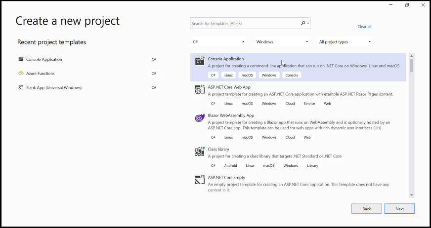
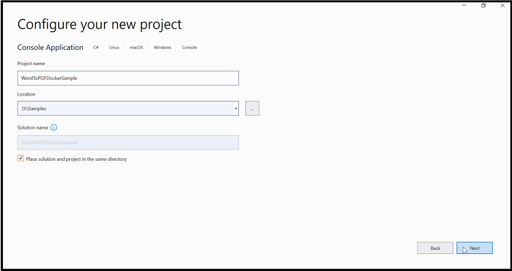
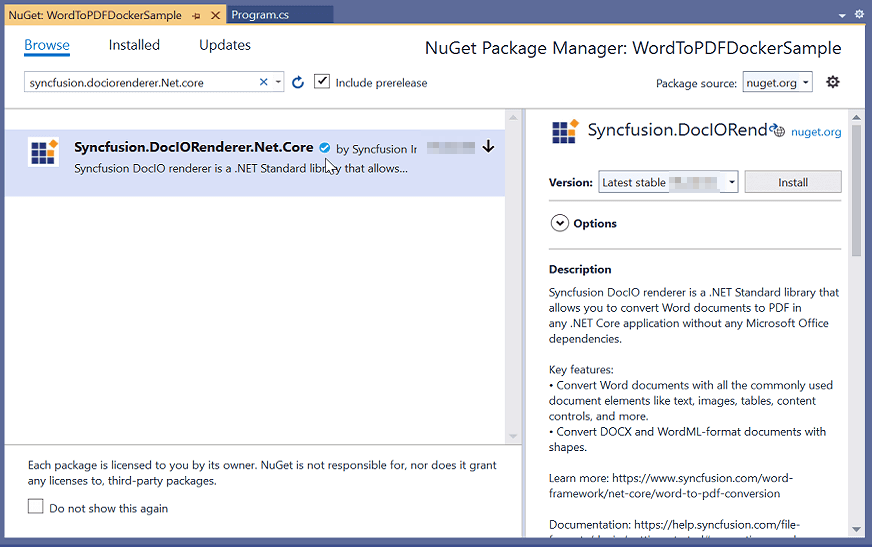
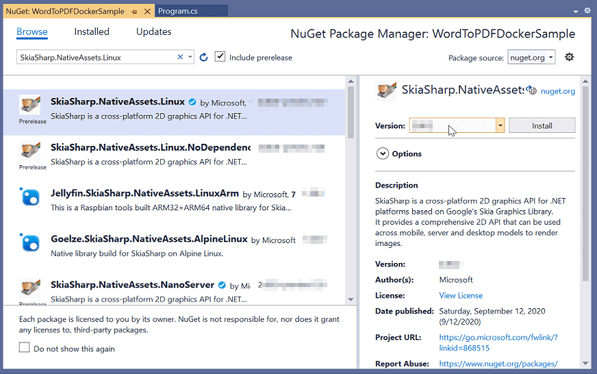
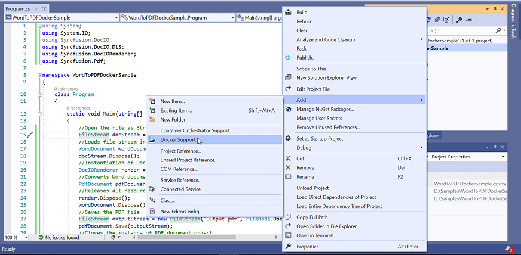
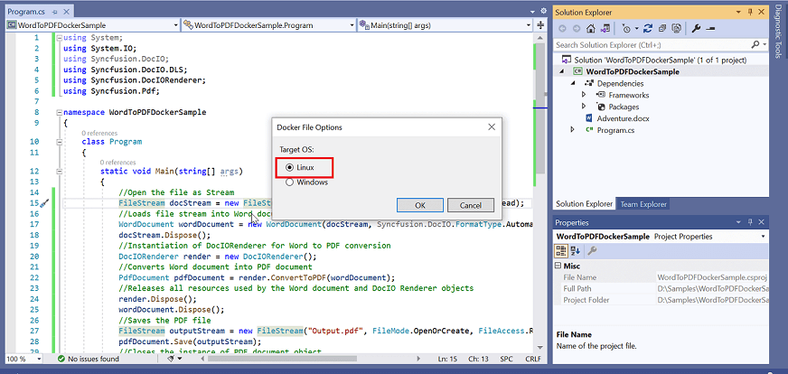
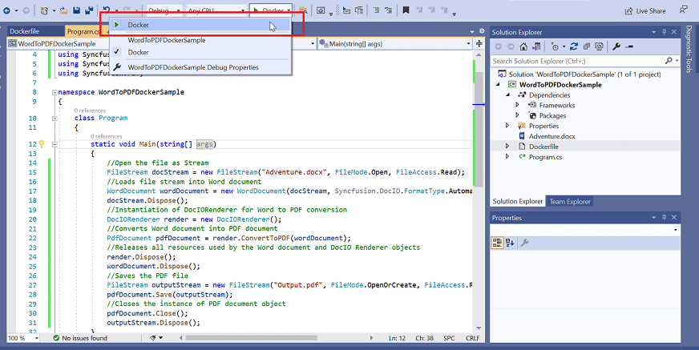
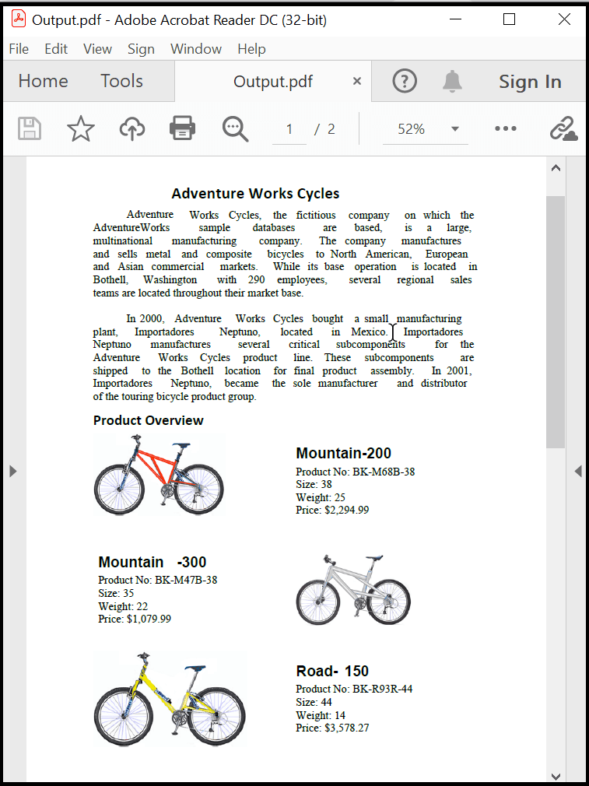

# Essential&reg; DocIO in Docker

Docker is an open platform for developing, shipping and running applications. You can use Essential&reg; DocIO in a Docker container to create, read, write, and convert Microsoft Word documents into various formats. From this page, you can learn how to convert a Word document to PDF in a Linux Docker container using the [.NET Word Library](https://www.syncfusion.com/document-sdk/net-word-library) (Essential&reg; DocIO). 

## Prerequisites

The following prerequisites are required before you begin:

* [.NET SDK 8.0](https://dotnet.microsoft.com/en-us/download/dotnet/8.0)
* [Docker Desktop](https://www.docker.com/products/docker-desktop/) (Windows/macOS) or Docker Engine (Linux) installed and running
* A valid Syncfusion&reg; license key. Refer to this [licensing guide](https://help.syncfusion.com/common/essential-studio/licensing/overview) to generate and register a key.
* [Visual Studio 2022](https://visualstudio.microsoft.com/downloads/) with the **.NET desktop development** and **.NET Core cross-platform development** workloads (for the "Add Docker Support" steps in Visual Studio)

## Steps to convert a Word document to PDF in Linux Docker

Step 1: Create a new .NET Core Console application targeting **.NET 8.0**.

Step 2: Install the below NuGet packages as a reference to your project from [NuGet.org](https://www.nuget.org/).

* [Syncfusion.DocIO.Net.Core](https://www.nuget.org/packages/Syncfusion.DocIO.Net.Core/)
* [Syncfusion.DocIORenderer.Net.Core](https://www.nuget.org/packages/Syncfusion.DocIORenderer.Net.Core/)
* [SkiaSharp.NativeAssets.Linux v3.119.1](https://www.nuget.org/packages/SkiaSharp.NativeAssets.Linux/3.119.1) 
* [HarfBuzzSharp.NativeAssets.Linux v8.3.1.2](https://www.nuget.org/packages/HarfBuzzSharp.NativeAssets.Linux/8.3.1.2) 

N> Starting with v16.2.0.x, if you reference Syncfusion&reg; assemblies from a trial setup or from the NuGet feed, you also have to add a reference to the **Syncfusion.Licensing** assembly and include a license key in your project. Refer to this [licensing guide](https://help.syncfusion.com/common/essential-studio/licensing/overview) to learn how to register the license key in your application.

Step 3: Include the following namespaces in the Program.cs file.



using System.IO;
using Syncfusion.DocIO.DLS;
using Syncfusion.DocIORenderer;
using Syncfusion.Pdf;



Step 4: Add the following code snippet to the **Program.cs** file.



//Open the file as Stream
using (FileStream docStream = new FileStream(@"Adventure.docx", FileMode.Open, FileAccess.Read))
{
    //Loads file stream into Word document
    using (WordDocument wordDocument = new WordDocument(docStream, Syncfusion.DocIO.FormatType.Automatic))
    {
        //Instantiation of DocIORenderer for Word to PDF conversion
        using (DocIORenderer render = new DocIORenderer())
        {
            //Converts Word document into PDF document
            using (PdfDocument pdfDocument = render.ConvertToPDF(wordDocument))
            {
                //Saves the PDF file
                using (FileStream outputStream = new FileStream("Output.pdf", FileMode.OpenOrCreate, FileAccess.ReadWrite))
                {
                    pdfDocument.Save(outputStream);
                }
            }
        }
    }
}



Step 5: Add Docker support to the application by right-clicking the project in **Solution Explorer** and selecting <b>Add &gt; Docker Support.</b>

Step 6: Choose the **Linux** option to run the application in a Linux Docker container.

Step 7: Open the **Dockerfile**, which contains the following default Docker commands:




FROM mcr.microsoft.com/dotnet/aspnet:8.0-buster-slim AS base
RUN apt-get update -y && apt-get install fontconfig -y
WORKDIR /app

FROM mcr.microsoft.com/dotnet/sdk:8.0-buster-slim AS build
WORKDIR /src
COPY ["WordToPDFDockerSample.csproj", "."]
RUN dotnet restore "./WordToPDFDockerSample.csproj"
COPY . .
WORKDIR "/src/."
RUN dotnet build "WordToPDFDockerSample.csproj" -c Release -o /app/build

FROM build AS publish
RUN dotnet publish "WordToPDFDockerSample.csproj" -c Release -o /app/publish

FROM base AS final
WORKDIR /app
COPY --from=publish /app/publish .
ENTRYPOINT ["dotnet", "WordToPDFDockerSample.dll"]




Step 8: Place a copy of **Adventure.docx** in the project output folder (or update the path in `Program.cs`), then select the **Docker** option and run the application.

A complete working example of converting Word document to PDF in Linux Docker container can be downloaded from [GitHub](https://github.com/SyncfusionExamples/DocIO-Examples/tree/main/Word-to-PDF-Conversion/Convert-Word-document-to-PDF/Docker/Debian/WordToPDFDockerSample).

Finally, you will get the converted PDF document as follows.

## Dockerfile Examples

The following examples demonstrate how the Docker file should be configured in order to convert a Word document to PDF in different Linux distributions.

## Alpine

You can use the below Dockerfile to convert a Word document to PDF in Alpine Linux.




FROM mcr.microsoft.com/dotnet/runtime:8.0-alpine AS base
RUN apk update && apk add --no-cache fontconfig ttf-dejavu
WORKDIR /app

FROM mcr.microsoft.com/dotnet/sdk:8.0-alpine AS build
WORKDIR /src
COPY ["WordToPDFDockerSample.csproj", "."]
RUN dotnet restore "./WordToPDFDockerSample.csproj"
COPY . .
WORKDIR "/src/."
RUN dotnet build "WordToPDFDockerSample.csproj" -c Release -o /app/build

FROM build AS publish
RUN dotnet publish "WordToPDFDockerSample.csproj" -c Release -o /app/publish

FROM base AS final
WORKDIR /app
COPY --from=publish /app/publish .
ENTRYPOINT ["dotnet", "WordToPDFDockerSample.dll"]




A complete working example of converting Word document to PDF in Alpine Linux Docker container can be downloaded from [GitHub](https://github.com/SyncfusionExamples/DocIO-Examples/tree/main/Word-to-PDF-Conversion/Convert-Word-document-to-PDF/Docker/Alpine/WordToPDFDockerSample).

## CentOS

You can use the below Dockerfile to convert a Word document to PDF in CentOS Linux.




FROM mcr.microsoft.com/dotnet/sdk:8.0 AS build
RUN apt-get update -y && apt-get install libfontconfig -y
WORKDIR /src

COPY ["WordToPDFDockerSample.csproj", "."]
RUN dotnet restore "WordToPDFDockerSample.csproj"

COPY . .
RUN dotnet build "WordToPDFDockerSample.csproj" -c Release -o /app/build

FROM build AS publish
RUN dotnet publish "WordToPDFDockerSample.csproj" -c Release -o /app/publish /p:UseAppHost=false

FROM centos:8

RUN dnf install -y https://packages.microsoft.com/config/centos/8/prod.repo \
    && dnf install -y dotnet-runtime-8.0 \
    && dnf clean all

RUN dnf install -y fontconfig

WORKDIR /app

COPY --from=publish /app/publish .

ENTRYPOINT ["dotnet", "WordToPDFDockerSample.dll"]




A complete working example of converting a Word document to PDF in a CentOS Linux Docker container can be downloaded from [GitHub](https://github.com/SyncfusionExamples/DocIO-Examples/tree/main/Word-to-PDF-Conversion/Convert-Word-document-to-PDF/Docker/CentOS/WordToPDFDockerSample).

## Debian

You can use the below Dockerfile to convert a Word document to PDF in Debian Linux.




FROM mcr.microsoft.com/dotnet/runtime:8.0-bookworm-slim AS base
RUN apt-get update -y && apt-get install fontconfig -y
WORKDIR /app

FROM mcr.microsoft.com/dotnet/sdk:8.0-bookworm-slim AS build
WORKDIR /src
COPY ["WordToPDFDockerSample.csproj", "."]
RUN dotnet restore "./WordToPDFDockerSample.csproj"
COPY . .
WORKDIR "/src/."
RUN dotnet build "WordToPDFDockerSample.csproj" -c Release -o /app/build

FROM build AS publish
RUN dotnet publish "WordToPDFDockerSample.csproj" -c Release -o /app/publish

FROM base AS final
WORKDIR /app
COPY --from=publish /app/publish .
ENTRYPOINT ["dotnet", "WordToPDFDockerSample.dll"]




A complete working example of converting Word document to PDF in Debian Linux Docker container can be downloaded from [GitHub](https://github.com/SyncfusionExamples/DocIO-Examples/tree/main/Word-to-PDF-Conversion/Convert-Word-document-to-PDF/Docker/Debian/WordToPDFDockerSample).

## Fedora

You can use the below Dockerfile to convert a Word document to PDF in Fedora Linux.




FROM fedora:latest

Run dnf install dotnet-sdk-8.0 -y
RUN dnf install dotnet-runtime-8.0 -y

RUN dnf install fontconfig -y

WORKDIR /app

COPY ["WordToPDFDockerSample.csproj", "."]
RUN dotnet restore "WordToPDFDockerSample.csproj"
COPY . .

RUN dotnet build "WordToPDFDockerSample.csproj" -c Release -o /app/build

RUN dotnet publish "WordToPDFDockerSample.csproj" -c Release -o /app/publish

ENTRYPOINT ["dotnet", "WordToPDFDockerSample.dll"]




A complete working example of converting Word document to PDF in Fedora Linux Docker container can be downloaded from [GitHub](https://github.com/SyncfusionExamples/DocIO-Examples/tree/main/Word-to-PDF-Conversion/Convert-Word-document-to-PDF/Docker/Fedora/WordToPDFDockerSample).

## RHEL - Red Hat Enterprise Linux

You can use the below Dockerfile to convert a Word document to PDF in RHEL Linux.




FROM registry.access.redhat.com/ubi8/dotnet-80-runtime AS base
USER root
RUN microdnf install -y fontconfig \
    && microdnf clean all
WORKDIR /app

FROM registry.access.redhat.com/ubi8/dotnet-80 AS build
WORKDIR /src
COPY ["WordToPDFDockerSample.csproj", ""]
RUN dotnet restore "./WordToPDFDockerSample.csproj"
COPY . .
WORKDIR "/src/."
RUN dotnet build "WordToPDFDockerSample.csproj" -c Release -o /app/build

FROM build AS publish
RUN dotnet publish "WordToPDFDockerSample.csproj" -c Release -o /app/publish

FROM base AS final
WORKDIR /app
COPY --from=publish /app/publish .
ENTRYPOINT ["dotnet", "WordToPDFDockerSample.dll"]




A complete working example of converting Word document to PDF in RHEL Linux Docker container can be downloaded from [GitHub](https://github.com/SyncfusionExamples/DocIO-Examples/tree/main/Word-to-PDF-Conversion/Convert-Word-document-to-PDF/Docker/RHEL/WordToPDFDockerSample).

## Ubuntu

You can use the below Dockerfile to convert a Word document to PDF in Ubuntu Linux.




FROM mcr.microsoft.com/dotnet/runtime:8.0-jammy AS base
RUN apt-get update -y && apt-get install fontconfig -y
WORKDIR /app

FROM mcr.microsoft.com/dotnet/sdk:8.0-jammy AS build
WORKDIR /src
COPY ["WordToPDFDockerSample.csproj", "."]
RUN dotnet restore "./WordToPDFDockerSample.csproj"
COPY . .
WORKDIR "/src/."
RUN dotnet build "WordToPDFDockerSample.csproj" -c Release -o /app/build

FROM build AS publish
RUN dotnet publish "WordToPDFDockerSample.csproj" -c Release -o /app/publish

FROM base AS final
WORKDIR /app
COPY --from=publish /app/publish .
ENTRYPOINT ["dotnet", "WordToPDFDockerSample.dll"]




A complete working example of converting Word document to PDF in Ubuntu Linux Docker container can be downloaded from [GitHub](https://github.com/SyncfusionExamples/DocIO-Examples/tree/main/Word-to-PDF-Conversion/Convert-Word-document-to-PDF/Docker/Ubuntu/WordToPDFDockerSample).

Looking for the full .NET Word Library overview, features, pricing, and documentation? Visit the [.NET Word Library](https://www.syncfusion.com/document-sdk/net-word-library) page.

An online sample to [convert a Word document to PDF](https://document.syncfusion.com/demos/word/wordtopdf#/tailwind) is also available.

## See Also

* [How to copy necessary fonts to Linux containers?](https://help.syncfusion.com/document-processing/word/word-library/net/faqs/linux-faqs#how-to-copy-necessary-fonts-to-linux-containers)
* [How to install necessary fonts in Linux containers?](https://help.syncfusion.com/document-processing/word/word-library/net/faqs/linux-faqs#how-to-install-necessary-fonts-in-linux-containers)
* [How to set culture/locale in Docker containers (Windows and Linux containers)?](https://help.syncfusion.com/document-processing/word/word-library/net/faqs/linux-faqs#how-to-set-culturelocale-in-docker-containers-windows-and-linux-containers)

