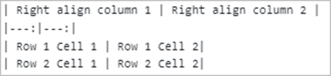
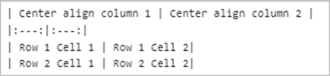

# Markdown to Word Conversion

Markdown is a lightweight markup language that adds formatting elements to plain text documents. The .NET Word (DocIO) library supports converting Markdown files to Word documents, which mostly follows the CommonMark specification and GitHub-flavored syntax.

To quickly start converting a Markdown file to a Word document, check out this video:


## Assemblies and NuGet packages required

Refer to the following links for assemblies and NuGet packages required based on platforms to convert a Markdown file to a Word document using the [.NET Word Library](https://www.syncfusion.com/document-sdk/net-word-library) (DocIO).

* [Markdown to Word conversion assemblies](https://help.syncfusion.com/document-processing/word/word-library/net/assemblies-required)
* [Markdown to Word conversion NuGet packages](https://help.syncfusion.com/document-processing/word/word-library/net/nuget-packages-required)

## Convert Markdown to Word document

Convert an existing markdown file to a Word document (DOC, DOCX, or RTF) using the .NET Word (DocIO) library.

The following code example shows how to convert a Markdown file to a Word document. Add the required `using` directives to your source file:

```csharp
using System.IO;
using Syncfusion.DocIO;
using Syncfusion.DocIO.DLS;
```

N> Refer to the appropriate tabs in the code snippets section: ***C# [Cross-platform]*** for ASP.NET Core, Blazor, Xamarin, UWP, .NET MAUI, and WinUI; ***C# [Windows-specific]*** for WinForms and WPF; ***VB.NET [Windows-specific]*** for VB.NET applications.




// Open an existing Markdown file.
using (WordDocument document = new WordDocument(Path.GetFullPath(@"Data/Input.md")))
{
    // Save as a Word document.
    document.Save(Path.GetFullPath(@"Output/MarkdownToWord.docx"), FormatType.Docx);
}



//Open an existing Markdown file.
using (WordDocument document = new WordDocument("Input.md", FormatType.Markdown))
{
    //Save as a Word document.
    document.Save("MarkdownToWord.docx", FormatType.Docx);
}



'Open an existing Markdown file.
Using document As WordDocument = New WordDocument("Input.md", FormatType.Markdown)
    'Save as a Word document.
    document.Save("MarkdownToWord.docx", FormatType.Docx)
End Using




You can download a complete working sample from [GitHub](https://github.com/SyncfusionExamples/DocIO-Examples/tree/main/Markdown-to-Word-conversion/Convert-Markdown-to-Word).

T> You can also save the markdown file as [HTML](https://help.syncfusion.com/document-processing/word/word-library/net/html), [PDF](https://help.syncfusion.com/document-processing/word/conversions/word-to-pdf/net/word-to-pdf), and [Image](https://help.syncfusion.com/document-processing/word/conversions/word-to-image/net/word-to-image).

N> In Markdown to Word conversion, SVG or invalid images are replaced with a red "X" image instead of the original image.

## Markdown Import Settings

When opening an existing Markdown document, the .NET Word (DocIO) library provides custom import settings through the **MdImportSettings** property. This allows you to customize how the Markdown content is parsed and imported.

The following properties are available on `MdImportSettings`:

| Property | Description |
| --- | --- |
| `ImageNodeVisited` | An event raised for each image encountered while importing. Use it to load image data from a custom source. |
| `Encoding` | The character encoding used to read the Markdown file. Defaults to `Encoding.UTF8`. |

### Customize image data

The .NET Word (DocIO) library provides an [ImageNodeVisited](https://help.syncfusion.com/cr/document-processing/Syncfusion.DocIO.DLS.SaveOptions.html#Syncfusion_DocIO_DLS_SaveOptions_ImageNodeVisited) event that customizes image data while importing a Markdown file. Handle this event to load image data from a custom source.

The `ImageNodeVisited` event provides an `MdImageNodeVisitedEventArgs` object with the following members:

* `Uri` — the image source declared in the Markdown (file name, relative path, or URL).
* `ImageStream` — the stream to populate. The library reads from this stream when inserting the image into the Word document.

The following code example shows how to load image data based on the image source path when importing the Markdown files.




//Create a Word document instance.
using (WordDocument document = new WordDocument())
{
    // Hook the event to customize the image while importing Markdown.
    document.MdImportSettings.ImageNodeVisited += MdImportSettings_ImageNodeVisited;
    // Open the Markdown file.
    document.Open(Path.GetFullPath("Data/Input.md"));
    // Save as a Word document.
    document.Save(Path.GetFullPath(@"Output/Sample.docx"));
}



//Create a Word document instance.
using (WordDocument document = new WordDocument())
{
    //Hook the event to customize the image while importing Markdown.
    document.MdImportSettings.ImageNodeVisited += MdImportSettings_ImageNodeVisited;
    //Open the Markdown file.
    document.Open("Input.md");
    //Save as a Word document.
    document.Save("Sample.docx");
}



'Create a Word document instance.
Using document As WordDocument = New WordDocument()
    'Hook the event to customize the image while importing Markdown.
    document.MdImportSettings.ImageNodeVisited += MdImportSettings_ImageNodeVisited
    'Open the Markdown file.
    document.Open("Input.md")
    'Save as a Word document.
    document.Save("Sample.docx")
End Using




The following code examples show the event handler to customize the image based on the source path.




private static void MdImportSettings_ImageNodeVisited(object sender, Syncfusion.Office.Markdown.MdImageNodeVisitedEventArgs args)
{
    //Set the image stream based on the image name from the input Markdown.
    if (args.Uri == "Image_1.png")
        args.ImageStream = new FileStream("Image_1.png", FileMode.Open);
    else if (args.Uri == "Image_2.png")
        args.ImageStream = new FileStream("Image_2.png", FileMode.Open);
    //Retrieve the image from the website and use it.
    else if (args.Uri.StartsWith("https://"))
    {
        //Download the image as a stream.
        using (HttpClient client = new HttpClient())
        {
            byte[] image = client.GetByteArrayAsync(args.Uri).GetAwaiter().GetResult();
            args.ImageStream = new MemoryStream(image);
        }
    }
}



private static void MdImportSettings_ImageNodeVisited(object sender, Syncfusion.Office.Markdown.MdImageNodeVisitedEventArgs args)
{
    //Set the image stream based on the image name from the input Markdown.
    if (args.Uri == "Image_1.png")
        args.ImageStream = new FileStream("Image_1.png", FileMode.Open);
    else if (args.Uri == "Image_2.png")
        args.ImageStream = new FileStream("Image_2.png", FileMode.Open);
    //Retrieve the image from the website and use it.
    else if (args.Uri.StartsWith("https://"))
    {
        //Download the image as a stream.
        using (HttpClient client = new HttpClient())
        {
            byte[] image = client.GetByteArrayAsync(args.Uri).GetAwaiter().GetResult();
            args.ImageStream = new MemoryStream(image);
        }
    }
}



Private Shared Sub MdImportSettings_ImageNodeVisited(ByVal sender As Object, ByVal args As Syncfusion.Office.Markdown.MdImageNodeVisitedEventArgs)
    'Set the image stream based on the image name from the input Markdown.
    If args.Uri Is "Image_1.png" Then
        args.ImageStream = New FileStream("Image_1.png", FileMode.Open)
    ElseIf args.Uri Is "Image_2.png" Then
        args.ImageStream = New FileStream("Image_2.png", FileMode.Open)
    'Retrieve the image from the website and use it.
    ElseIf args.Uri.StartsWith("https://") Then
        'Download the image as a stream.
        Using client As New HttpClient()
            Dim image As Byte() = client.GetByteArrayAsync(args.Uri).GetAwaiter().GetResult()
            args.ImageStream = New MemoryStream(image)
        End Using
    End If
End Sub




N> Hook the event handler before opening the Markdown file, as shown in the previous code example. Stream instances assigned to `args.ImageStream` are not disposed by DocIO; dispose of them yourself when you no longer need the image data.

You can download a complete working sample from [GitHub](https://github.com/SyncfusionExamples/DocIO-Examples/tree/main/Markdown-to-Word-conversion/Customize-image).

### Encoding

The .NET Word (DocIO) library provides an `Encoding` property to specify the character encoding to use when opening a Markdown file. This property is useful when you need to open Markdown files that are saved with specific character encodings such as UTF-8, UTF-16, or ASCII. The default value is `Encoding.UTF8`.

The following code example shows how to open a Markdown file with a specific encoding.




//Create a Word document instance.
using (WordDocument document = new WordDocument())
{
    //Set the encoding for the Markdown file.
    document.MdImportSettings.Encoding = System.Text.Encoding.UTF8;
    //Open the Markdown file.
    document.Open(Path.GetFullPath("Data/Input.md"));
    //Save as a Word document.
    document.Save(Path.GetFullPath(@"Output/Output.docx"), FormatType.Docx);
}



//Create a Word document instance.
using (WordDocument document = new WordDocument())
{
    //Set the encoding for the Markdown file.
    document.MdImportSettings.Encoding = System.Text.Encoding.UTF8;
    //Open the Markdown file.
    document.Open("Input.md");
    //Save as a Word document.
    document.Save("Output.docx", FormatType.Docx);
}



'Create a Word document instance.
Using document As WordDocument = New WordDocument()
    'Set the encoding for the Markdown file.
    document.MdImportSettings.Encoding = System.Text.Encoding.UTF8
    'Open the Markdown file.
    document.Open("Input.md")
    'Save as a Word document.
    document.Save("Output.docx", FormatType.Docx)
End Using




N> Provide the encoding value before opening the Markdown file, as shown in the above code example.

## Supported Markdown Syntax

<table>
<tbody>
<tr>
<th>Element</th>
<th>Syntax</th>
<th>Description</th>
</tr>
<tr>
<td style="width: 16%;">
<p>Bold</p>
</td>
<td style="width: 26%;">
<p>Sample content for **bold text**.</p>
</td>
<td style="width: 41.7072%;">
<p>For bold, add ** to the front and back of the text.</p>
</td>
</tr>
<tr>
<td style="width: 16%;">
<p>Italic</p>
</td>
<td style="width: 26%;">
<p>Sample content for *Italic text*.</p>
</td>
<td style="width: 41.7072%;">
<p>For italic, add * to the front and back of the text.</p>
</td>
</tr>
<tr>
<td style="width: 16%;">
<p>Bold and Italics</p>
</td>
<td style="width: 26%;">
<p>Sample content for ***bold and Italic text***.</p>
</td>
<td style="width: 41.7072%;">
<p>For bold and italics, add *** to the front and back of the text.</p>
</td>
</tr>
<tr>
<td style="width: 16%;">
<p>Strikethrough</p>
</td>
<td style="width: 26%;">
<p>Sample content for ~~strike through text~~.</p>
</td>
<td style="width: 41.7072%;">
<p>For strikethrough, add ~~ to the front and back of the text.</p>
</td>
</tr>
<tr>
<td style="width: 16%;">
<p>Subscript (HTML)</p>
</td>
<td style="width: 26%;">
<p>&lt;sub&gt;Subscript text&lt;/sub&gt;</p>
</td>
<td style="width: 41.7072%;">
<p>For subscript, add &lt;sub&gt; to the front and &lt;/sub&gt; to the back of the text.</p>
</td>
</tr>
<tr>
<td style="width: 16%;">
<p>Superscript (HTML)</p>
</td>
<td style="width: 26%;">
<p>&lt;sup&gt;Superscript text&lt;/sup&gt;</p>
</td>
<td style="width: 41.7072%;">
<p>For superscript, add &lt;sup&gt; to the front and &lt;/sup&gt; to the back of the text.</p>
</td>
</tr>
<tr>
<td style="width: 16%;">
<p>Heading 1</p>
</td>
<td style="width: 26%;">
<p>#Heading 1 content</p>
</td>
<td style="width: 41.7072%;">
<p>For heading 1, add # to the start of the line.</p>
</td>
</tr>
<tr>
<td style="width: 16%;">
<p>Heading 2</p>
</td>
<td style="width: 26%;">
<p>##Heading 2 content</p>
</td>
<td style="width: 41.7072%;">
<p>For heading 2, add ## to the start of the line.</p>
</td>
</tr>
<tr>
<td style="width: 16%;">
<p>Heading 3</p>
</td>
<td style="width: 26%;">
<p>###Heading 3 content</p>
</td>
<td style="width: 41.7072%;">
<p>For heading 3, add ### to the start of the line.</p>
</td>
</tr>
<tr>
<td style="width: 16%;">
<p>Heading 4</p>
</td>
<td style="width: 26%;">
<p>####Heading 4 content</p>
</td>
<td style="width: 41.7072%;">
<p>For heading 4, add #### to the start of the line.</p>
</td>
</tr>
<tr>
<td style="width: 16%;">
<p>Heading 5</p>
</td>
<td style="width: 26%;">
<p>#####Heading 5 content</p>
</td>
<td style="width: 41.7072%;">
<p>For heading 5, add ##### to the start of the line.</p>
</td>
</tr>
<tr>
<td style="width: 16%;">
<p>Heading 6</p>
</td>
<td style="width: 26%;">
<p>######Heading 6 content</p>
</td>
<td style="width: 41.7072%;">
<p>For heading 6, add ###### to the start of the line.</p>
</td>
</tr>
<tr>
<td style="width: 16%;">
<p>Block quotes</p>
</td>
<td style="width: 26%;">
<p>&gt;Block quotes text</p>
</td>
<td style="width: 41.7072%;">
<p>For block quotes, add &gt; to the start of the line.</p>
</td>
</tr>
<tr>
<td style="width: 16%;">
<p>Code span</p>
</td>
<td style="width: 26%;">
<p>`Code span text`</p>
</td>
<td style="width: 41.7072%;">
<p>For a code span, add ` to the front and back of the text.</p>
</td>
</tr>
<tr>
<td style="width: 16%;">
<p>Indented code block</p>
</td>
<td style="width: 26%;">
<p>4 spaces</p>
</td>
<td style="width: 41.7072%;">
<p>For an indented code block, add 4 spaces at the beginning of the line.</p>
</td>
</tr>
<tr>
<td style="width: 16%;">
<p>Fenced code block</p>
</td>
<td style="width: 26%;">
<p>```<br /> Multi line code text<br /> Multi line code text<br /> ```</p>
</td>
<td style="width: 41.7072%;">
<p>For a fenced code block, add ``` on a new line before and after the content.</p>
</td>
</tr>
<tr>
<td style="width: 16%;">
<p>Ordered List</p>
</td>
<td style="width: 26%;">
<p>1. First<br /> 2. Second</p>
</td>
<td style="width: 41.7072%;">
<p>For an ordered list, precede the text with a number followed by a dot and a space (for example, <code>1. </code>).</p>
</td>
</tr>
<tr>
<td style="width: 16%;">
<p>Unordered List</p>
</td>
<td style="width: 26%;">
<p>- First<br /> - second</p>
</td>
<td style="width: 41.7072%;">
<p>For an unordered list, precede the text with &ndash; (hyphen and space).</p>
</td>
</tr>
<tr>
<td style="width: 16%;">
<p>Links</p>
</td>
<td style="width: 26%;">
<p><strong>Link text without title text</strong>:<br /> [Link text](URL)<br /> <strong>Link text with title text</strong>:<br /> [Link text](URL , &ldquo;title text&rdquo;)</p>
</td>
<td style="width: 41.7072%;">
<p>For a hyperlink, enclose the link text within brackets [ ], and then enclose the URL as the first parameter and the title as the second parameter within parentheses ().<br /> <strong>Note:</strong> The title text is optional.</p>
</td>
</tr>
<tr>
<td style="width: 16%;">
<p>Table</p>
</td>
<td style="width: 26%;"></td>
<td style="width: 41.7072%;">
<p>Create a table using the pipes and underscores as shown in the syntax to create a 2 x 2 table.</p>
<p>You can also set column alignments using the syntax below; the default is left aligned.</p>
<p>Right alignment:<br/><br /><br /> Center alignment:<br/></p>
</td>
</tr>
<tr>
<td style="width: 16%;">
<p>Horizontal Line</p>
</td>
<td style="width: 26%;">
<p>--- (three hyphen characters)</p>
</td>
<td style="width: 41.7072%;">
<p>For a horizontal line, add --- (three hyphens) on a new line.</p>
</td>
</tr>
<tr>
<td style="width: 16%;">
<p>Image</p>
</td>
<td style="width: 26%;">
<p>![Alternate text] (URL path)</p>
</td>
<td style="width: 41.7072%;">
<p>For an image, enclose alternative text within brackets [], and then the image URL within parentheses ().</p>
<p>If the URL is a base64 string, it will be preserved properly in the Word document. Otherwise, see the [customize image data](#customize-image-data) section to set the image from a stream while opening the Markdown file.</p>
</td>
</tr>
<tr>
<td style="width: 16%;">
<p>Escape Character</p>
</td>
<td style="width: 26%;">
<p>\(any syntax)</p>
</td>
<td style="width: 41.7072%;">
<p>Escape any markdown syntax by adding \ as prefix to the syntax.<br /> Example:<br /> \**non-bold text**</p>
</td>
</tr>
</tbody>
</table>

## Online Demo

* Explore how to convert the Markdown file to Word document using the [.NET Word Library](https://www.syncfusion.com/document-sdk/net-word-library) (DocIO) in a live demo [here](https://document.syncfusion.com/demos/word/markdowntoword#/tailwind).

## See Also

* [Convert Word document to Markdown in C#](word-to-markdown-conversion.md)
* [How to change the image size during Markdown to Word conversion](https://support.syncfusion.com/kb/article/17707/how-to-change-the-image-size-during-markdown-to-word-conversion)
