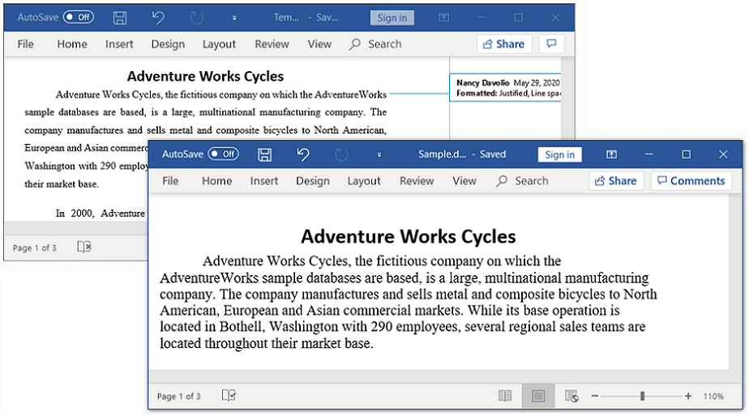

# Accepting or Rejecting Track Changes

It is used to keep track of the changes made to a Word document. It helps to maintain the record of author, name and time for every insertion, deletion, or modification in a document. This can be enabled by using the [TrackChanges](https://help.syncfusion.com/cr/document-processing/Syncfusion.DocIO.DLS.WordDocument.html#Syncfusion_DocIO_DLS_WordDocument_TrackChanges) property of the Word document.

N> With this support, the changes made in the Word document by DocIO library cannot be tracked.

To quickly start to handle Tracked Changes in Word document, please check out this video:


The following code example illustrates how to enable track changes of the document.

N> Refer to the appropriate tabs in the code snippets section: ***C# [Cross-platform]*** for ASP.NET Core, Blazor, Xamarin, UWP, .NET MAUI, and WinUI; ***C# [Windows-specific]*** for WinForms and WPF; ***VB.NET [Windows-specific]*** for VB.NET applications.




//Creates a new Word document 
WordDocument document = new WordDocument();
//Adds new section to the document
IWSection section = document.AddSection();
//Adds new paragraph to the section
IWParagraph paragraph = section.AddParagraph();
//Appends text to the paragraph
IWTextRange text = paragraph.AppendText("This sample illustrates how to track the changes made to the word document. ");
//Sets font name and size for text
text.CharacterFormat.FontName = "Times New Roman";
text.CharacterFormat.FontSize = 14;
text = paragraph.AppendText("This track changes is useful in shared environment.");
text.CharacterFormat.FontSize = 12;
//Turns on the track changes option
document.TrackChanges = true;
//Saves the Word document to  MemoryStream
MemoryStream stream = new MemoryStream();
document.Save(stream, FormatType.Docx);
//Closes the document
document.Close();



//Creates a new Word document 
WordDocument document = new WordDocument();
//Adds new section to the document
IWSection section = document.AddSection();
//Adds new paragraph to the section
IWParagraph paragraph = section.AddParagraph();
//Appends text to the paragraph
IWTextRange text = paragraph.AppendText("This sample illustrates how to track the changes made to the word document. ");
//Sets font name and size for text
text.CharacterFormat.FontName = "Times New Roman";
text.CharacterFormat.FontSize = 14;
text = paragraph.AppendText("This track changes is useful in shared environment.");
text.CharacterFormat.FontSize = 12;
//Turns on the track changes option
document.TrackChanges = true;
//Saves and closes the document
document.Save("Sample.docx", FormatType.Docx);
document.Close();



'Creates a new Word document 
Dim document As New WordDocument()
'Adds new section to the document
Dim section As IWSection = document.AddSection()
'Adds new paragraph to the section
Dim paragraph As IWParagraph = section.AddParagraph()
'Appends text to the paragraph
Dim text As IWTextRange = paragraph.AppendText("This sample illustrates how to track the changes made to the word document. ")
'Sets font name and size for text
text.CharacterFormat.FontName = "Times New Roman"
text.CharacterFormat.FontSize = 14
text = paragraph.AppendText("This track changes is useful in shared environment.")
text.CharacterFormat.FontSize = 12
'Turns on the track changes option
document.TrackChanges = True
'Saves and closes the document
document.Save("Sample.docx", FormatType.Docx)
document.Close()




You can download a complete working sample from [GitHub](https://github.com/SyncfusionExamples/DocIO-Examples/tree/main/Track-Changes/Enable-track-changes-of-Word).

## Accept all changes

You can **accept all track changes in Word document** using [AcceptAll](https://help.syncfusion.com/cr/document-processing/Syncfusion.DocIO.DLS.RevisionCollection.html#Syncfusion_DocIO_DLS_RevisionCollection_AcceptAll) method.

The following code example shows how to accept all the tracked changes.




//Opens an existing Word document
FileStream fileStreamPath = new FileStream("Template.docx", FileMode.Open, FileAccess.Read, FileShare.ReadWrite);           
WordDocument document = new WordDocument(fileStreamPath, FormatType.Docx);
//Accepts all the tracked changes revisions in the Word document
if (document.HasChanges)
    document.Revisions.AcceptAll();
//Saves the Word document to MemoryStream
MemoryStream stream = new MemoryStream();
document.Save(stream, FormatType.Docx);
//Closes the document
document.Close();
 


//Opens an existing Word document
WordDocument document = new WordDocument("Template.docx", FormatType.Docx);
//Accepts all the tracked changes revisions
if (document.HasChanges)
    document.Revisions.AcceptAll();
//Saves and closes the document
document.Save("Sample.docx", FormatType.Docx);
document.Close();
 


'Opens an existing Word document
Dim document As WordDocument = New WordDocument("Template.docx", FormatType.Docx)
'Accepts all the tracked changes revisions
If document.HasChanges Then
    document.Revisions.AcceptAll()
End If
'Saves and closes the document
document.Save("Sample.docx", FormatType.Docx)
document.Close()
System.Diagnostics.Process.Start("Sample.docx")
 



You can download a complete working sample from [GitHub](https://github.com/SyncfusionExamples/DocIO-Examples/tree/main/Track-Changes/Accept-all-changes).

By executing the above code example, it generates output Word document as follows.

## Reject all changes

You can **reject all track changes in Word document** using [RejectAll](https://help.syncfusion.com/cr/document-processing/Syncfusion.DocIO.DLS.RevisionCollection.html#Syncfusion_DocIO_DLS_RevisionCollection_RejectAll) method.

The following code example shows how to reject all the tracked changes.




//Opens an existing word document 
FileStream fileStreamPath = new FileStream("Template.docx", FileMode.Open, FileAccess.Read, FileShare.ReadWrite);           
WordDocument document = new WordDocument(fileStreamPath, FormatType.Docx);
//Rejects all the tracked changes revisions in the Word document
if (document.HasChanges)
    document.Revisions.RejectAll();
//Saves the Word document to MemoryStream
MemoryStream stream = new MemoryStream();
document.Save(stream, FormatType.Docx);
//Closes the document
document.Close();



//Opens an existing Word document
WordDocument document = new WordDocument("Template.docx", FormatType.Docx);
//Rejects all the tracked changes revisions
if (document.HasChanges)
    document.Revisions.RejectAll();
//Saves and closes the document
document.Save("Sample.docx", FormatType.Docx);
document.Close();
 


'Opens an existing Word document
Dim document As WordDocument = New WordDocument("Template.docx", FormatType.Docx)
'Rejects all the tracked changes revisions
If document.HasChanges Then
    document.Revisions.RejectAll()
End If
'Saves and closes the document
document.Save("Sample.docx", FormatType.Docx)
document.Close()
 



You can download a complete working sample from [GitHub](https://github.com/SyncfusionExamples/DocIO-Examples/tree/main/Track-Changes/Reject-all-changes).

By executing the above code example, it generates output Word document as follows.

## Accept all changes by a particular reviewer

You can **accept all changes made by the author** in the Word document using [Accept](https://help.syncfusion.com/cr/document-processing/Syncfusion.DocIO.DLS.Revision.html#Syncfusion_DocIO_DLS_Revision_Accept) method.

The following code example shows how to accept the tracked changes made by the author.




//Opens an existing word document 
FileStream fileStreamPath = new FileStream("Template.docx", FileMode.Open, FileAccess.Read, FileShare.ReadWrite);           
WordDocument document = new WordDocument(fileStreamPath, FormatType.Docx);
//Iterates into all the revisions in Word document
for (int i = document.Revisions.Count - 1; i >= 0; i--)
{
    //Checks the author of current revision and accepts it.
    if (document.Revisions[i].Author == "Nancy Davolio")
        document.Revisions[i].Accept();
    //Resets to last item when accept the moving related revisions.
    if (i > document.Revisions.Count - 1)
        i = document.Revisions.Count;
}
//Saves the Word document to MemoryStream
MemoryStream stream = new MemoryStream();
document.Save(stream, FormatType.Docx);
//Closes the document
document.Close();



//Opens an existing Word document
WordDocument document = new WordDocument("Template.docx", FormatType.Docx);
//Iterates into all the revisions in Word document
for (int i = document.Revisions.Count - 1; i >= 0; i--)
{
    //Checks the author of current revision and accepts it.
    if (document.Revisions[i].Author == "Nancy Davolio")
        document.Revisions[i].Accept();
    //Resets to last item when accept the moving related revisions.
    if (i > document.Revisions.Count - 1)
        i = document.Revisions.Count;
}
//Saves and closes the document
document.Save("Sample.docx", FormatType.Docx);
document.Close();
 


'Opens an existing Word document
Dim document As WordDocument = New WordDocument("Template.docx", FormatType.Docx)
'Iterates into all the revisions in Word document
For i As Integer = document.Revisions.Count - 1 To 0 Step -1
    'Checks the author of current revision and accepts it.
    If document.Revisions(i).Author Is "Nancy Davolio" Then
        document.Revisions(i).Accept()
    End If
    'Resets to last item when accept the moving related revisions.
    If i > document.Revisions.Count - 1 Then
        i = document.Revisions.Count
    End If
Next
'Saves and closes the document
document.Save("Sample.docx", FormatType.Docx)
document.Close()




You can download a complete working sample from [GitHub](https://github.com/SyncfusionExamples/DocIO-Examples/tree/main/Track-Changes/Accept-all-changes-made-by-author).

## Reject all changes by particular reviewer

You can **reject all changes made by the author** in the Word document using [Reject](https://help.syncfusion.com/cr/document-processing/Syncfusion.DocIO.DLS.Revision.html#Syncfusion_DocIO_DLS_Revision_Reject) method.

The following code example shows how to reject the tracked changes made by the author.




//Opens an existing word document 
FileStream fileStreamPath = new FileStream("Template.docx", FileMode.Open, FileAccess.Read, FileShare.ReadWrite);           
WordDocument document = new WordDocument(fileStreamPath, FormatType.Docx);
//Iterates into all the revisions in Word document
for (int i = document.Revisions.Count - 1; i >= 0; i--)
{
    //Checks the author of current revision and rejects it.
    if (document.Revisions[i].Author == "Nancy Davolio")
        document.Revisions[i].Reject();
    //Resets to last item when reject the moving related revisions.
    if (i > document.Revisions.Count - 1)
        i = document.Revisions.Count;
}
//Saves the Word document to MemoryStream
MemoryStream stream = new MemoryStream();
document.Save(stream, FormatType.Docx);
//Closes the document
document.Close();



//Opens an existing Word document
WordDocument document = new WordDocument("Template.docx", FormatType.Docx);
//Iterates into all the revisions in Word document
for (int i = document.Revisions.Count - 1; i >= 0; i--)
{
    //Checks the author of current revision and rejects it.
    if (document.Revisions[i].Author == "Nancy Davolio")
        document.Revisions[i].Reject();
    //Resets to last item when reject the moving related revisions.
    if (i > document.Revisions.Count - 1)
        i = document.Revisions.Count;
}
//Saves and closes the document
document.Save("Sample.docx", FormatType.Docx);
document.Close();
 


'Opens an existing Word document
Dim document As WordDocument = New WordDocument("Template.docx", FormatType.Docx)
'Iterates into all the revisions in Word document
For i As Integer = document.Revisions.Count - 1 To 0 Step -1
    'Checks the author of current revision and rejects it.
    If document.Revisions(i).Author Is "Nancy Davolio" Then
        document.Revisions(i).Reject()
    End If
    'Resets to last item when accept the moving related revisions.
    If i > document.Revisions.Count - 1 Then
        i = document.Revisions.Count
    End If
Next
'Saves and closes the document
document.Save("Sample.docx", FormatType.Docx)
document.Close()




You can download a complete working sample from [GitHub](https://github.com/SyncfusionExamples/DocIO-Examples/tree/main/Track-Changes/Reject-all-changes-made-by-author).

## Revision information

You can get the **revision information of track changes** in the Word document like author name, date, and type of revision.

The following code example shows how to get the details about the revision information of track changes.




//Opens an existing word document 
FileStream fileStreamPath = new FileStream("Template.docx", FileMode.Open, FileAccess.Read, FileShare.ReadWrite);           
WordDocument document = new WordDocument(fileStreamPath, FormatType.Docx);
//Accesses the first revision in the word document
Revision revision = document.Revisions[0];
//Gets the name of the user who made the specified tracked change
string author = revision.Author;
// Gets the date and time that the tracked change was made
DateTime dateTime = revision.Date;
// Gets the type of the track changes revision
RevisionType revisionType = revision.RevisionType;
//Closes the document
document.Close();



//Opens an existing Word document
WordDocument document = new WordDocument("Template.docx", FormatType.Docx);
//Accesses the first revision in the word document
Revision revision = document.Revisions[0];
//Gets the name of the user who made the specified tracked change
string author = revision.Author;
// Gets the date and time that the tracked change was made
DateTime dateTime = revision.Date;
// Gets the type of the track changes revision
RevisionType revisionType = revision.RevisionType;
//Closes the document
document.Close();
 


'Opens an existing Word document
Dim document As WordDocument = New WordDocument("Template.docx", FormatType.Docx)
'Accesses the first revision in the word document
Dim revision As Revision = document.Revisions(0)
'Gets the name of the user who made the specified tracked change
Dim author As String = revision.Author
' Gets the date and time that the tracked change was made
Dim dateTime As Date = revision.Date
' Gets the type of the track changes revision
Dim revisionType As RevisionType = revision.RevisionType
'Closes the document
document.Close()
'Saves and closes the document
document.Save("Sample.docx", FormatType.Docx)
document.Close()




You can download a complete working sample from [GitHub](https://github.com/SyncfusionExamples/DocIO-Examples/tree/main/Track-Changes/Get-revision-information).

## Online Demo

* Explore how to accept or reject the tracked changes in the Word document using the .NET Word Library (DocIO) in a live demo [here](https://document.syncfusion.com/demos/word/trackchanges#/tailwind).

## Frequently Asked Questions

* [How to check whether a Word document contains tracked changes or not?](https://help.syncfusion.com/document-processing/word/word-library/net/faqs/track-changes-faqs#how-to-check-whether-a-word-document-contains-tracked-changes-or-not)
* [How to accept or reject track changes of specific type in the Word document?](https://help.syncfusion.com/document-processing/word/word-library/net/faqs/track-changes-faqs#how-to-accept-or-reject-track-changes-of-specific-type-in-the-word-document)
* [How to enable track changes for Word document?](https://help.syncfusion.com/document-processing/word/word-library/net/faqs/track-changes-faqs#how-to-enable-track-changes-for-word-document)
* [What happens when Word documents with track changes are used for comparing?](https://help.syncfusion.com/document-processing/word/word-library/net/faqs/track-changes-faqs#what-happens-when-word-documents-with-track-changes-are-used-for-comparing)
