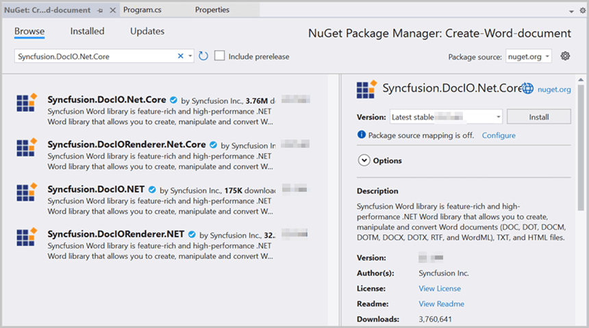
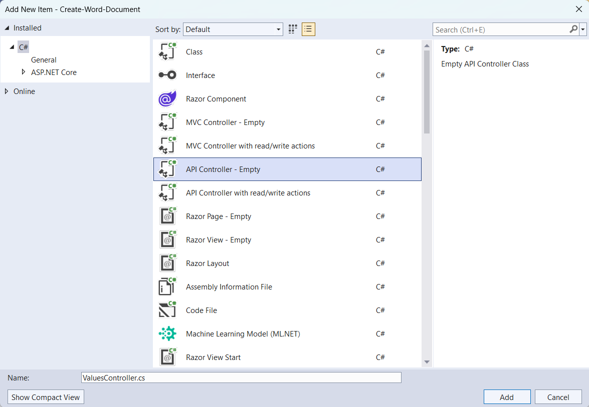
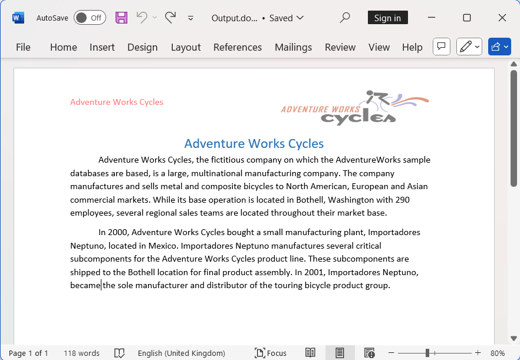

# Create a Word document using ASP.NET Core Web API

Syncfusion&reg; Essential&reg; DocIO is a [.NET Word library](https://www.syncfusion.com/document-processing/word-framework/net/word-library) used to create, read, and edit **Word** documents programmatically without **Microsoft Word** or interop dependencies. Using this library, you can **create a Word document in ASP.NET Core Web API**.

## Steps to create Word document programmatically:

The below steps illustrate creating a simple Word document in ASP.NET Core Web API.

Step 1: Create a new C# ASP.NET Core Web API project.

Step 2: Install the [Syncfusion.DocIO.Net.Core](https://www.nuget.org/packages/Syncfusion.DocIO.Net.Core) NuGet package as a reference to your project from [NuGet.org](https://www.nuget.org).

N> Starting with v16.2.0.x, if you reference Syncfusion&reg; assemblies from trial setup or from the NuGet feed, you also have to add "Syncfusion.Licensing" assembly reference and include a license key in your projects. Please refer to this [link](https://help.syncfusion.com/common/essential-studio/licensing/overview) to know about registering Syncfusion&reg; license key in your application to use our components.

Step 3: Add a new API controller empty file in the project.

Step 4: Include the following namespaces in the **ValuesController.cs** file.





using Microsoft.AspNetCore.Mvc;
using Syncfusion.DocIO;
using Syncfusion.DocIO.DLS;





Step 5: Add a new action method CreateDocument in **ValuesController.cs** and include the below code snippet to create an Word file and download it.





 [HttpGet]
 [Route("api/Word")]
 public IActionResult CreateDocument()
 {
     try
     {
         var fileDownloadName = "Output.docx";
         const string contentType = "application/vnd.openxmlformats-officedocument.wordprocessingml.document";
         var stream = GenerateWordDocument();
         stream.Position = 0;
         return File(stream, contentType, fileDownloadName);
     }
     catch (Exception ex)
     {
         // Log or handle the exception
         return BadRequest("Error occurred while creating Excel file: " + ex.Message);
     }
 }
 
 



Step 6: Implement the `GenerateWordDocument` method in `ValuesController.cs`.
 




 public static MemoryStream GenerateWordDocument()
 {
     //Creating a new document
     WordDocument document = new WordDocument();
     //Adding a new section to the document
     WSection section = document.AddSection() as WSection;
     //Set Margin of the section
     section.PageSetup.Margins.All = 72;
     //Set page size of the section
     section.PageSetup.PageSize = new Syncfusion.Drawing.SizeF(612, 792);

     //Create Paragraph styles
     WParagraphStyle style = document.AddParagraphStyle("Normal") as WParagraphStyle;
     style.CharacterFormat.FontName = "Calibri";
     style.CharacterFormat.FontSize = 11f;
     style.ParagraphFormat.BeforeSpacing = 0;
     style.ParagraphFormat.AfterSpacing = 8;
     style.ParagraphFormat.LineSpacing = 13.8f;

     style = document.AddParagraphStyle("Heading 1") as WParagraphStyle;
     style.ApplyBaseStyle("Normal");
     style.CharacterFormat.FontName = "Calibri Light";
     style.CharacterFormat.FontSize = 16f;
     style.CharacterFormat.TextColor = Syncfusion.Drawing.Color.FromArgb(46, 116, 181);
     style.ParagraphFormat.BeforeSpacing = 12;
     style.ParagraphFormat.AfterSpacing = 0;
     style.ParagraphFormat.Keep = true;
     style.ParagraphFormat.KeepFollow = true;
     style.ParagraphFormat.OutlineLevel = OutlineLevel.Level1;

     IWParagraph paragraph = section.HeadersFooters.Header.AddParagraph();
     paragraph.ApplyStyle("Normal");
     paragraph.ParagraphFormat.HorizontalAlignment = HorizontalAlignment.Left;
     WTextRange textRange = paragraph.AppendText("Adventure Works Cycles") as WTextRange;
     textRange.CharacterFormat.FontSize = 12f;
     textRange.CharacterFormat.FontName = "Calibri";
     textRange.CharacterFormat.TextColor = Syncfusion.Drawing.Color.Red;

     //Appends paragraph
     paragraph = section.AddParagraph();
     paragraph.ApplyStyle("Heading 1");
     paragraph.ParagraphFormat.HorizontalAlignment = HorizontalAlignment.Center;
     textRange = paragraph.AppendText("Adventure Works Cycles") as WTextRange;
     textRange.CharacterFormat.FontSize = 18f;
     textRange.CharacterFormat.FontName = "Calibri";

     //Appends paragraph
     paragraph = section.AddParagraph();
     paragraph.ParagraphFormat.FirstLineIndent = 36;
     paragraph.BreakCharacterFormat.FontSize = 12f;
     textRange = paragraph.AppendText("Adventure Works Cycles, the fictitious company on which the AdventureWorks sample databases are based, is a large, multinational manufacturing company. The company manufactures and sells metal and composite bicycles to North American, European and Asian commercial markets. While its base operation is in Bothell, Washington with 290 employees, several regional sales teams are located throughout their market base.") as WTextRange;
     textRange.CharacterFormat.FontSize = 12f;

     //Appends paragraph
     paragraph = section.AddParagraph();
     paragraph.ParagraphFormat.FirstLineIndent = 36;
     paragraph.BreakCharacterFormat.FontSize = 12f;
     textRange = paragraph.AppendText("In 2000, AdventureWorks Cycles bought a small manufacturing plant, Importadores Neptuno, located in Mexico. Importadores Neptuno manufactures several critical subcomponents for the AdventureWorks Cycles product line. These subcomponents are shipped to the Bothell location for final product assembly. In 2001, Importadores Neptuno, became the sole manufacturer and distributor of the touring bicycle product group.") as WTextRange;
     textRange.CharacterFormat.FontSize = 12f;

     //Saving the Excel to the MemoryStream 
     MemoryStream stream = new MemoryStream();
     document.Save(stream, FormatType.Docx);
     document.Close();
     //Set the position as '0'.
     stream.Position = 0;
     return stream;
 }





Step 7: Build the project.

Click on Build → Build Solution or press <kbd>Ctrl</kbd>+<kbd>Shift</kbd>+<kbd>B</kbd> to build the project.

Step 8: Run the project.

Click the Start button (green arrow) or press <kbd>F5</kbd> to run the app.

A complete working sample is available on [GitHub](https://github.com/SyncfusionExamples/DocIO-Examples/tree/main/Getting-Started/ASP.NET-Core-Web-API/Create-Word-Document).

## Steps for accessing the Web API using HTTP requests

Step 1: Create a console application.

N> Ensure your ASP.NET Core Web API is running on the specified port before running this client. Adjust the port number if your Web API runs on a different port (check the ASP.NET Core app's launch settings).

Step 2: Add the below code snippet in the **Program.cs** file for accessing the Web API using HTTP requests. 

This method sends a GET request to the Web API endpoint to retrieve and save the generated Word document.





 // Create an HttpClient instance
 using (HttpClient client = new HttpClient())
 {
     try
     {
         // Send a GET request to a URL
         HttpResponseMessage response = await client.GetAsync("https://localhost:7152/api/Values/api/Word");
         // Check if the response is successful
         if (response.IsSuccessStatusCode)
         {
             // Read the content as a string
             Stream responseBody = await response.Content.ReadAsStreamAsync();
             FileStream fileStream = File.Create("../../../Output/Output.docx");
             responseBody.CopyTo(fileStream);
             fileStream.Close();
         }
         else
         {
             Console.WriteLine("HTTP error status code: " + response.StatusCode);
         }
     }
     catch (HttpRequestException e)
     {
         Console.WriteLine("Request exception: " + e.Message);
     }
 }





Step 3: Build the project.

Click on Build → Build Solution or press <kbd>Ctrl</kbd>+<kbd>Shift</kbd>+<kbd>B</kbd> to build the project.

Step 4: Run the project.

Click the Start button (green arrow) or press <kbd>F5</kbd> to run the app.

A complete working sample is available on [GitHub](https://github.com/SyncfusionExamples/DocIO-Examples/tree/main/Getting-Started/ASP.NET-Core-Web-API/Client%20Application).

Upon executing the program, the **Word document** will be generated as follows.

Click [here](https://www.syncfusion.com/document-processing/word-framework/net) to explore the rich set of Syncfusion&reg; Word library (DocIO) features.

An online sample link to [create a Word document](https://document.syncfusion.com/demos/word/helloworld#/tailwind) in ASP.NET Core. 
