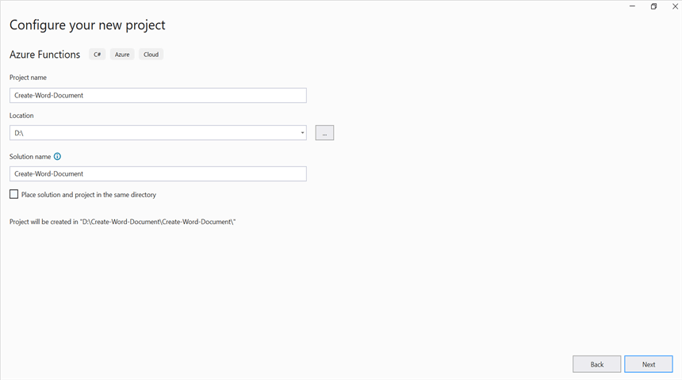
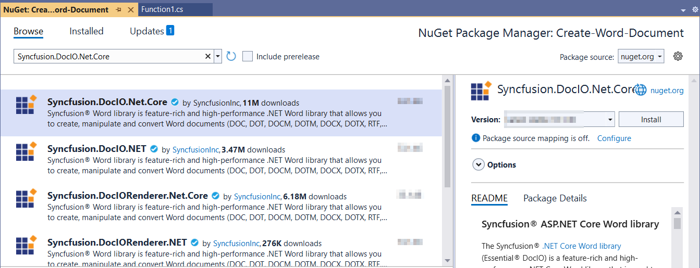
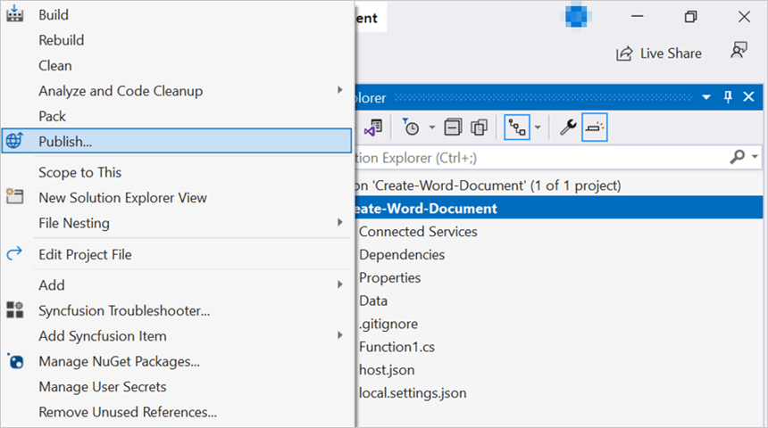

# Create Word document in Azure Functions (Flex Consumption)

Syncfusion&reg; DocIO is a [.NET Core Word library](https://www.syncfusion.com/document-processing/word-framework/net/word-library) used to create, read, edit, and convert Word documents programmatically without **Microsoft Word** or interop dependencies. Using this library, you can **Create Word document in Azure Functions deployed on Flex (Consumption) plan**.

## Steps to Create Word document in Azure Functions (Flex Consumption)

Step 1: Create a new Azure Functions project.

Step 2: Create a project name and select the location.

Step 3: Select function worker as **.NET 8.0 (Long Term Support)** (isolated worker) and target Flex/Consumption hosting suitable for isolated worker.

Step 4: Install the [Syncfusion.DocIO.Net.Core](https://www.nuget.org/packages/Syncfusion.DocIO.Net.Core) NuGet package as a reference to your project from [NuGet.org](https://www.nuget.org/).

N> Starting with v16.2.0.x, if you reference Syncfusion&reg; assemblies from trial setup or from the NuGet feed, you also have to add "Syncfusion.Licensing" assembly reference and include a license key in your projects. Please refer to this [link](https://help.syncfusion.com/common/essential-studio/licensing/overview) to know about registering Syncfusion&reg; license key in your application to use our components.

Step 5: Include the following namespaces in the **Function1.cs** file.




using Syncfusion.DocIO;
using Syncfusion.DocIO.DLS;





Step 6: Add the following code snippet in **Run** method of **Function1** class to perform **Create Word document** in Azure Functions and return the resultant **Word document** to client end.




public async Task<IActionResult> Run([HttpTrigger(AuthorizationLevel.Function, "post")] HttpRequest req)
    {
        try
        {
            // Creating a new document.
            WordDocument document = new WordDocument();
            //Adding a new section to the document.
            WSection section = document.AddSection() as WSection;
            //Set Margin of the section
            section.PageSetup.Margins.All = 72;
            //Set page size of the section
            section.PageSetup.PageSize = new Syncfusion.Drawing.SizeF(612, 792);

            //Create Paragraph styles
            WParagraphStyle style = document.AddParagraphStyle("Normal") as WParagraphStyle;
            style.CharacterFormat.FontName = "Calibri";
            style.CharacterFormat.FontSize = 11f;
            style.ParagraphFormat.BeforeSpacing = 0;
            style.ParagraphFormat.AfterSpacing = 8;
            style.ParagraphFormat.LineSpacing = 13.8f;

            style = document.AddParagraphStyle("Heading 1") as WParagraphStyle;
            style.ApplyBaseStyle("Normal");
            style.CharacterFormat.FontName = "Calibri Light";
            style.CharacterFormat.FontSize = 16f;
            style.CharacterFormat.TextColor = Syncfusion.Drawing.Color.FromArgb(46, 116, 181);
            style.ParagraphFormat.BeforeSpacing = 12;
            style.ParagraphFormat.AfterSpacing = 0;
            style.ParagraphFormat.Keep = true;
            style.ParagraphFormat.KeepFollow = true;
            style.ParagraphFormat.OutlineLevel = OutlineLevel.Level1;

            IWParagraph paragraph = section.HeadersFooters.Header.AddParagraph();
            // Gets the image stream.
            var assembly = Assembly.GetExecutingAssembly();
            var stream = assembly.GetManifestResourceStream("Create_Word_Document.Data.AdventureCycle.jpg");
            IWPicture picture = paragraph.AppendPicture(stream);
            picture.TextWrappingStyle = TextWrappingStyle.InFrontOfText;
            picture.VerticalOrigin = VerticalOrigin.Margin;
            picture.VerticalPosition = -45;
            picture.HorizontalOrigin = HorizontalOrigin.Column;
            picture.HorizontalPosition = 263.5f;
            picture.WidthScale = 20;
            picture.HeightScale = 15;

            paragraph.ApplyStyle("Normal");
            paragraph.ParagraphFormat.HorizontalAlignment = HorizontalAlignment.Left;
            WTextRange textRange = paragraph.AppendText("Adventure Works Cycles") as WTextRange;
            textRange.CharacterFormat.FontSize = 12f;
            textRange.CharacterFormat.FontName = "Calibri";
            textRange.CharacterFormat.TextColor = Syncfusion.Drawing.Color.Red;

            //Appends paragraph.
            paragraph = section.AddParagraph();
            paragraph.ApplyStyle("Heading 1");
            paragraph.ParagraphFormat.HorizontalAlignment = HorizontalAlignment.Center;
            textRange = paragraph.AppendText("Adventure Works Cycles") as WTextRange;
            textRange.CharacterFormat.FontSize = 18f;
            textRange.CharacterFormat.FontName = "Calibri";

            //Appends paragraph.
            paragraph = section.AddParagraph();
            paragraph.ParagraphFormat.FirstLineIndent = 36;
            paragraph.BreakCharacterFormat.FontSize = 12f;
            textRange = paragraph.AppendText("Adventure Works Cycles, the fictitious company on which the AdventureWorks sample databases are based, is a large, multinational manufacturing company. The company manufactures and sells metal and composite bicycles to North American, European and Asian commercial markets. While its base operation is in Bothell, Washington with 290 employees, several regional sales teams are located throughout their market base.") as WTextRange;
            textRange.CharacterFormat.FontSize = 12f;

            //Appends paragraph.
            paragraph = section.AddParagraph();
            paragraph.ParagraphFormat.FirstLineIndent = 36;
            paragraph.BreakCharacterFormat.FontSize = 12f;
            textRange = paragraph.AppendText("In 2000, AdventureWorks Cycles bought a small manufacturing plant, Importadores Neptuno, located in Mexico. Importadores Neptuno manufactures several critical subcomponents for the AdventureWorks Cycles product line. These subcomponents are shipped to the Bothell location for final product assembly. In 2001, Importadores Neptuno, became the sole manufacturer and distributor of the touring bicycle product group.") as WTextRange;
            textRange.CharacterFormat.FontSize = 12f;

            paragraph = section.AddParagraph();
            paragraph.ApplyStyle("Heading 1");
            paragraph.ParagraphFormat.HorizontalAlignment = HorizontalAlignment.Left;
            textRange = paragraph.AppendText("Product Overview") as WTextRange;
            textRange.CharacterFormat.FontSize = 16f;
            textRange.CharacterFormat.FontName = "Calibri";

            //Appends table.
            IWTable table = section.AddTable();
            table.ResetCells(3, 2);
            table.TableFormat.Borders.BorderType = BorderStyle.None;
            table.TableFormat.IsAutoResized = true;
            //Appends paragraph.
            paragraph = table[0, 0].AddParagraph();
            paragraph.ParagraphFormat.AfterSpacing = 0;
            paragraph.BreakCharacterFormat.FontSize = 12f;
            //Appends picture to the paragraph.
            var assembly1 = Assembly.GetExecutingAssembly();
            using (var stream1 = assembly1.GetManifestResourceStream("Create_Word_Document.Data.Mountain-200.jpg"))
                picture = paragraph.AppendPicture(stream1);
            picture.TextWrappingStyle = TextWrappingStyle.TopAndBottom;
            picture.VerticalOrigin = VerticalOrigin.Paragraph;
            picture.VerticalPosition = 4.5f;
            picture.HorizontalOrigin = HorizontalOrigin.Column;
            picture.HorizontalPosition = -2.15f;
            picture.WidthScale = 79;
            picture.HeightScale = 79;

            //Appends paragraph.
            paragraph = table[0, 1].AddParagraph();
            paragraph.ApplyStyle("Heading 1");
            paragraph.ParagraphFormat.AfterSpacing = 0;
            paragraph.ParagraphFormat.LineSpacing = 12f;
            paragraph.AppendText("Mountain-200");
            //Appends paragraph.
            paragraph = table[0, 1].AddParagraph();
            paragraph.ParagraphFormat.AfterSpacing = 0;
            paragraph.ParagraphFormat.LineSpacing = 12f;
            paragraph.BreakCharacterFormat.FontSize = 12f;
            paragraph.BreakCharacterFormat.FontName = "Times New Roman";
            textRange = paragraph.AppendText("Product No: BK-M68B-38\r") as WTextRange;
            textRange.CharacterFormat.FontSize = 12f;
            textRange.CharacterFormat.FontName = "Times New Roman";
            textRange = paragraph.AppendText("Size: 38\r") as WTextRange;
            textRange.CharacterFormat.FontSize = 12f;
            textRange.CharacterFormat.FontName = "Times New Roman";
            textRange = paragraph.AppendText("Weight: 25\r") as WTextRange;
            textRange.CharacterFormat.FontSize = 12f;
            textRange.CharacterFormat.FontName = "Times New Roman";
            textRange = paragraph.AppendText("Price: $2,294.99\r") as WTextRange;
            textRange.CharacterFormat.FontSize = 12f;
            textRange.CharacterFormat.FontName = "Times New Roman";
            //Appends paragraph.
            paragraph = table[0, 1].AddParagraph();
            paragraph.ParagraphFormat.AfterSpacing = 0;
            paragraph.ParagraphFormat.LineSpacing = 12f;
            paragraph.BreakCharacterFormat.FontSize = 12f;

            //Appends paragraph.
            paragraph = table[1, 0].AddParagraph();
            paragraph.ApplyStyle("Heading 1");
            paragraph.ParagraphFormat.AfterSpacing = 0;
            paragraph.ParagraphFormat.LineSpacing = 12f;
            paragraph.AppendText("Mountain-300 ");
            //Appends paragraph.
            paragraph = table[1, 0].AddParagraph();
            paragraph.ParagraphFormat.AfterSpacing = 0;
            paragraph.ParagraphFormat.LineSpacing = 12f;
            paragraph.BreakCharacterFormat.FontSize = 12f;
            paragraph.BreakCharacterFormat.FontName = "Times New Roman";
            textRange = paragraph.AppendText("Product No: BK-M47B-38\r") as WTextRange;
            textRange.CharacterFormat.FontSize = 12f;
            textRange.CharacterFormat.FontName = "Times New Roman";
            textRange = paragraph.AppendText("Size: 35\r") as WTextRange;
            textRange.CharacterFormat.FontSize = 12f;
            textRange.CharacterFormat.FontName = "Times New Roman";
            textRange = paragraph.AppendText("Weight: 22\r") as WTextRange;
            textRange.CharacterFormat.FontSize = 12f;
            textRange.CharacterFormat.FontName = "Times New Roman";
            textRange = paragraph.AppendText("Price: $1,079.99\r") as WTextRange;
            textRange.CharacterFormat.FontSize = 12f;
            textRange.CharacterFormat.FontName = "Times New Roman";
            //Appends paragraph.
            paragraph = table[1, 0].AddParagraph();
            paragraph.ParagraphFormat.AfterSpacing = 0;
            paragraph.ParagraphFormat.LineSpacing = 12f;
            paragraph.BreakCharacterFormat.FontSize = 12f;

            //Appends paragraph.
            paragraph = table[1, 1].AddParagraph();
            paragraph.ApplyStyle("Heading 1");
            paragraph.ParagraphFormat.LineSpacing = 12f;
            //Appends picture to the paragraph.
            var assembly2 = Assembly.GetExecutingAssembly();
            using (var stream2 = assembly2.GetManifestResourceStream("Create_Word_Document.Data.Mountain-300.jpg"))
                picture = paragraph.AppendPicture(stream2);
            picture.TextWrappingStyle = TextWrappingStyle.TopAndBottom;
            picture.VerticalOrigin = VerticalOrigin.Paragraph;
            picture.VerticalPosition = 8.2f;
            picture.HorizontalOrigin = HorizontalOrigin.Column;
            picture.HorizontalPosition = -14.95f;
            picture.WidthScale = 75;
            picture.HeightScale = 75;

            //Appends paragraph.
            paragraph = table[2, 0].AddParagraph();
            paragraph.ApplyStyle("Heading 1");
            paragraph.ParagraphFormat.LineSpacing = 12f;
            //Appends picture to the paragraph.
            var assembly3 = Assembly.GetExecutingAssembly();
            using (var stream3 = assembly3.GetManifestResourceStream("Create_Word_Document.Data.Road-550-W.jpg"))
                picture = paragraph.AppendPicture(stream3);
            picture.TextWrappingStyle = TextWrappingStyle.TopAndBottom;
            picture.VerticalOrigin = VerticalOrigin.Paragraph;
            picture.VerticalPosition = 3.75f;
            picture.HorizontalOrigin = HorizontalOrigin.Column;
            picture.HorizontalPosition = -5f;
            picture.WidthScale = 92;
            picture.HeightScale = 92;

            //Appends paragraph.
            paragraph = table[2, 1].AddParagraph();
            paragraph.ApplyStyle("Heading 1");
            paragraph.ParagraphFormat.AfterSpacing = 0;
            paragraph.ParagraphFormat.LineSpacing = 12f;
            paragraph.AppendText("Road-150 ");
            //Appends paragraph.
            paragraph = table[2, 1].AddParagraph();
            paragraph.ParagraphFormat.AfterSpacing = 0;
            paragraph.ParagraphFormat.LineSpacing = 12f;
            paragraph.BreakCharacterFormat.FontSize = 12f;
            paragraph.BreakCharacterFormat.FontName = "Times New Roman";
            textRange = paragraph.AppendText("Product No: BK-R93R-44\r") as WTextRange;
            textRange.CharacterFormat.FontSize = 12f;
            textRange.CharacterFormat.FontName = "Times New Roman";
            textRange = paragraph.AppendText("Size: 44\r") as WTextRange;
            textRange.CharacterFormat.FontSize = 12f;
            textRange.CharacterFormat.FontName = "Times New Roman";
            textRange = paragraph.AppendText("Weight: 14\r") as WTextRange;
            textRange.CharacterFormat.FontSize = 12f;
            textRange.CharacterFormat.FontName = "Times New Roman";
            textRange = paragraph.AppendText("Price: $3,578.27\r") as WTextRange;
            textRange.CharacterFormat.FontSize = 12f;
            textRange.CharacterFormat.FontName = "Times New Roman";
            //Appends paragraph.
            section.AddParagraph();

            MemoryStream memoryStream = new MemoryStream();
            //Saves the Word document file.
            document.Save(memoryStream, FormatType.Docx);
            memoryStream.Position = 0;
            var bytes = memoryStream.ToArray();
            return new FileContentResult(bytes, "application/vnd.openxmlformats-officedocument.wordprocessingml.document")
            {
                FileDownloadName = "document.docx"
            };
        }
        catch (Exception ex)
        {
            // Log the error with details for troubleshooting
            _logger.LogError(ex, "Error converting Word document to Image.");
            // Prepare error message including exception details
            var msg = $"Exception: {ex.Message}\n\n{ex}";
            // Return a 500 Internal Server Error response with the message
            return new ContentResult { StatusCode = 500, Content = msg, ContentType = "text/plain; charset=utf-8" };
        }
    }
	



Step 7: Right click the project and select **Publish**. Then, create a new profile in the Publish Window.

Step 8: Select the target as **Azure** and click **Next** button.

Step 9: Select the specific target as **Azure Function App** and click **Next** button.

Step 10: Select the **Create new** button.

Step 11: Click **Create** button. 

Step 12: After creating app service then click **Finish** button. 

Step 13: Click the **Publish** button.

Step 14: Publish has been succeed.

Step 15: Now, go to Azure portal and select the App Services. After running the service, click **Get function URL by copying it**. Then, paste it in the below client sample (which will request the Azure Functions, to perform **create a Word document** using the template Word document). You will get the output Word document as follows.

## Steps to post the request to Azure Functions

Step 1: Create a console application to request the Azure Functions API.

Step 2: Add the following code snippet into Main method to post the request to Azure Functions with template Word document and get the resultant Word document.



static async Task Main()
    {
        try
        {
            Console.Write("Please enter your Azure Function URL: ");
            string url = Console.ReadLine();
            if (string.IsNullOrWhiteSpace(url)) return;
            // Create a new HttpClient instance for sending HTTP requests
            using var http = new HttpClient();
            using var content = new StringContent(string.Empty);
            using var res = await http.PostAsync(url, content);
            // Read the response body as a byte array
            var resBytes = await res.Content.ReadAsByteArrayAsync();
            // Extract the media type from the response headers
            string mediaType = res.Content.Headers.ContentType?.MediaType ?? string.Empty;
            // Decide the output file path the response is an docx or txt   
            string outputPath = mediaType.Contains("word", StringComparison.OrdinalIgnoreCase)
                || mediaType.Contains("officedocument", StringComparison.OrdinalIgnoreCase)
                || mediaType.Equals("application/vnd.openxmlformats-officedocument.wordprocessingml.document", StringComparison.OrdinalIgnoreCase)
                ? Path.GetFullPath("../../../Output/Output.docx")
                : Path.GetFullPath("../../../Output/function-error.txt");
            // Write the response bytes to the output file
            await File.WriteAllBytesAsync(outputPath, resBytes);
            Console.WriteLine($"Saved: {outputPath}");
        }
        catch (Exception ex)
        {
           throw;
        }        
    }



From GitHub, you can download the [console application](https://github.com/SyncfusionExamples/DocIO-Examples/tree/main/Getting-Started/Azure/Azure_Functions/Console_App_Flex_Consumption) and [Azure Functions Flex Consumption](https://github.com/SyncfusionExamples/DocIO-Examples/tree/main/Getting-Started/Azure/Azure_Functions/Azure_Functions_Flex_Consumption).

Click [here](https://www.syncfusion.com/document-processing/word-framework/net-core) to explore the rich set of Syncfusion&reg; Word library (DocIO) features. 

An online sample link to [create a Word document](https://document.syncfusion.com/demos/word/helloworld#/tailwind) in ASP.NET Core.  