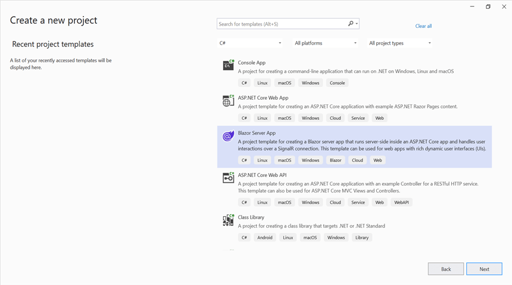
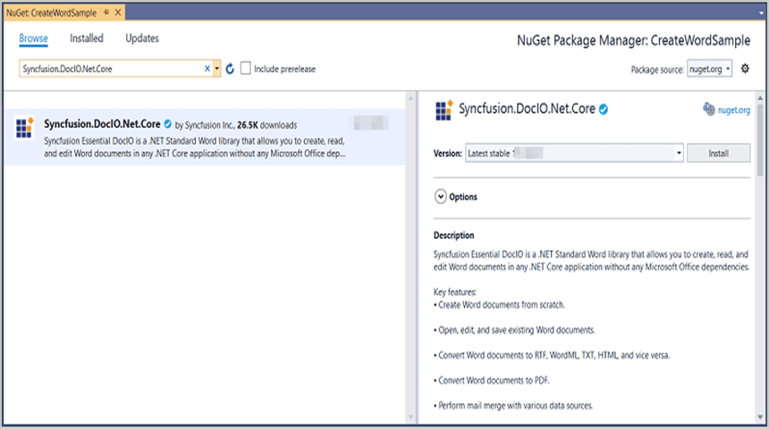
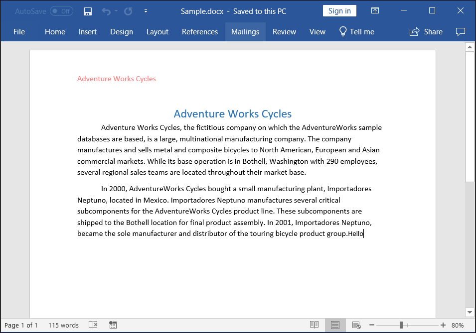

# Create Word document in Blazor

Syncfusion<sup>&reg;</sup> Essential<sup>&reg;</sup> DocIO is a [.NET Core Word library](https://www.syncfusion.com/document-processing/word-framework/net-core/word-library) used to create, read, and edit **Word** documents programmatically without **Microsoft Word** or interop dependencies. Using this library, you can **create a Word document in Blazor**.

To quickly get started with creating a Word document in Blazor, check this video:




**Prerequisites:**





* Visual Studio 2019 Preview or later
* Install the [.NET Core SDK 3.1 Preview or Greater](https://dotnet.microsoft.com/en-us/download/dotnet/3.1)
  




* Visual Studio Code
* Install the [.NET Core SDK 3.1 Preview or Greater](https://dotnet.microsoft.com/en-us/download/dotnet/3.1)
* Open Visual Studio Code and install the [C# for Visual Studio Code extension](https://marketplace.visualstudio.com/items?itemName=ms-dotnettools.csharp) from the Extensions Marketplace.
  

 



## Server app





Step 1: Create a new C# Blazor Server app project. Select Blazor Server App from the template and click the Next button.



Step 2: To **create a Word document in Blazor Server app**, install [Syncfusion.DocIO.Net.Core](https://www.nuget.org/packages/Syncfusion.DocIO.Net.Core) to the Blazor project.







Step 1: Create a new C# Blazor Server app project using Visual Studio Code via [Microsoft Templates](https://learn.microsoft.com/en-us/aspnet/core/blazor/tooling?view=aspnetcore-7.0&pivots=vsc).

Alternatively, create a Server application using the following command in the terminal(<kbd>Ctrl</kbd>+<kbd>`</kbd>).

```
dotnet new blazorserver -o Create-Word-document
```

Run the following command to navigate to the project directory.

```
cd Create-Word-document
```

Step 2: To **create a Word document in Blazor Server app**,run the following command to  install [Syncfusion.DocIO.Net.Core](https://www.nuget.org/packages/Syncfusion.DocIO.Net.Core) to the Blazor project.

```
dotnet add package Syncfusion.DocIO.Net.Core
```


 


N> Starting with v16.2.0.x, if you reference Syncfusion<sup>&reg;</sup> assemblies from trial setup or from the NuGet feed, you also have to add "Syncfusion.Licensing" assembly reference and include a license key in your projects. Please refer to this [link](https://help.syncfusion.com/common/essential-studio/licensing/overview) to know about registering Syncfusion<sup>&reg;</sup> license key in your application to use our components.

Step 3: Create a razor file with name as **DocIO** under **Pages** folder and include the following namespaces in the file.



@page "/DocIO"
@using System.IO;
@using ServerSideApplication;
@inject ServerSideApplication.Data.WordService service
@inject Microsoft.JSInterop.IJSRuntime JS



Step 4: Add the following code in **DocIO.razor** file to create a new button.



<h2>Syncfusion DocIO library (Essential DocIO)</h2>
<p>Syncfusion DocIO library (Essential DocIO) is a Blazor DocIO library used to create, read, edit, and convert Word files in your applications without Microsoft Office dependencies.</p>
<button class="btn btn-primary" @onclick="@CreateWord">Create Word</button>



Step 5: Add the following code in **DocIO.razor** file to create and download the **Word document**.



@code {
    MemoryStream documentStream;
    /// <summary>
    /// Create and download the Word document
    /// </summary>
    protected async void CreateWord()
    {
        documentStream = service.CreateWord();
        await JS.SaveAs("Sample.docx", documentStream.ToArray());
    }
}



Step 6: Create a new cs file with name as **WordService** under Data folder and include the following namespaces in the file.




using Syncfusion.DocIO;
using Syncfusion.DocIO.DLS;
using System.IO;




Step 7: Create a new MemoryStream method with name as **CreateWord** in **WordService** class and include the following code snippet to **create a simple Word document in Blazor** Server app.





public MemoryStream CreateWord()
{
    //Creating a new document
    WordDocument document = new WordDocument();
    //Adding a new section to the document
    WSection section = document.AddSection() as WSection;
    //Set Margin of the section
    section.PageSetup.Margins.All = 72;
    //Set page size of the section
    section.PageSetup.PageSize = new Syncfusion.Drawing.SizeF(612, 792);

    //Create Paragraph styles
    WParagraphStyle style = document.AddParagraphStyle("Normal") as WParagraphStyle;
    style.CharacterFormat.FontName = "Calibri";
    style.CharacterFormat.FontSize = 11f;
    style.ParagraphFormat.BeforeSpacing = 0;
    style.ParagraphFormat.AfterSpacing = 8;
    style.ParagraphFormat.LineSpacing = 13.8f;

    style = document.AddParagraphStyle("Heading 1") as WParagraphStyle;
    style.ApplyBaseStyle("Normal");
    style.CharacterFormat.FontName = "Calibri Light";
    style.CharacterFormat.FontSize = 16f;
    style.CharacterFormat.TextColor = Syncfusion.Drawing.Color.FromArgb(46, 116, 181);
    style.ParagraphFormat.BeforeSpacing = 12;
    style.ParagraphFormat.AfterSpacing = 0;
    style.ParagraphFormat.Keep = true;
    style.ParagraphFormat.KeepFollow = true;
    style.ParagraphFormat.OutlineLevel = OutlineLevel.Level1;

    IWParagraph paragraph = section.HeadersFooters.Header.AddParagraph();
    paragraph.ApplyStyle("Normal");
    paragraph.ParagraphFormat.HorizontalAlignment = HorizontalAlignment.Left;
    WTextRange textRange = paragraph.AppendText("Adventure Works Cycles") as WTextRange;
    textRange.CharacterFormat.FontSize = 12f;
    textRange.CharacterFormat.FontName = "Calibri";
    textRange.CharacterFormat.TextColor = Syncfusion.Drawing.Color.Red;

    //Appends paragraph
    paragraph = section.AddParagraph();
    paragraph.ApplyStyle("Heading 1");
    paragraph.ParagraphFormat.HorizontalAlignment = HorizontalAlignment.Center;
    textRange = paragraph.AppendText("Adventure Works Cycles") as WTextRange;
    textRange.CharacterFormat.FontSize = 18f;
    textRange.CharacterFormat.FontName = "Calibri";

    //Appends paragraph
    paragraph = section.AddParagraph();
    paragraph.ParagraphFormat.FirstLineIndent = 36;
    paragraph.BreakCharacterFormat.FontSize = 12f;
    textRange = paragraph.AppendText("Adventure Works Cycles, the fictitious company on which the AdventureWorks sample databases are based, is a large, multinational manufacturing company. The company manufactures and sells metal and composite bicycles to North American, European and Asian commercial markets. While its base operation is in Bothell, Washington with 290 employees, several regional sales teams are located throughout their market base.") as WTextRange;
    textRange.CharacterFormat.FontSize = 12f;

    //Appends paragraph
    paragraph = section.AddParagraph();
    paragraph.ParagraphFormat.FirstLineIndent = 36;
    paragraph.BreakCharacterFormat.FontSize = 12f;
    textRange = paragraph.AppendText("In 2000, AdventureWorks Cycles bought a small manufacturing plant, Importadores Neptuno, located in Mexico. Importadores Neptuno manufactures several critical subcomponents for the AdventureWorks Cycles product line. These subcomponents are shipped to the Bothell location for final product assembly. In 2001, Importadores Neptuno, became the sole manufacturer and distributor of the touring bicycle product group.") as WTextRange;
    textRange.CharacterFormat.FontSize = 12f;

    //Saves the Word document to MemoryStream
    MemoryStream stream = new MemoryStream();
    document.Save(stream, FormatType.Docx);
    //Closes the Word document
    document.Close();
    stream.Position = 0;
    return stream;
}




Step 8: Add the following line to the Program.cs file to register the WordService as a scoped service in your Blazor application. 




builder.Services.AddSingleton<WordService>();





Step 9: Create a new class file in the project, with name as FileUtils and add the following code to invoke the JavaScript action to download the file in the browser.





public static class FileUtils
{
    public static ValueTask<object> SaveAs(this IJSRuntime js, string filename, byte[] data)
       => js.InvokeAsync<object>(
            "saveAsFile",
            filename,
            Convert.ToBase64String(data));
}




Step 10: Add the following JavaScript function in the _Host.cshtml in the Pages folder.





<script type="text/javascript">
    function saveAsFile(filename, bytesBase64) {
        if (navigator.msSaveBlob) {
            //Download document in Edge browser
            var data = window.atob(bytesBase64);
            var bytes = new Uint8Array(data.length);
            for (var i = 0; i < data.length; i++) {
                bytes[i] = data.charCodeAt(i);
            }
            var blob = new Blob([bytes.buffer], { type: "application/octet-stream" });
            navigator.msSaveBlob(blob, filename);
        }
        else {
            var link = document.createElement('a');
            link.download = filename;
            link.href = "data:application/octet-stream;base64," + bytesBase64;
            document.body.appendChild(link); // Needed for Firefox
            link.click();
            document.body.removeChild(link);
        }
    }
</script>





Step 11: Add the following code snippet in the razor file of Navigation menu in the Shared folder.





<li class="nav-item px-3">
    <NavLink class="nav-link" href="docio">
        <span class="oi oi-list-rich" aria-hidden="true"></span> Create Word
    </NavLink>
</li>





Step 12: Build the project.





Click on Build → Build Solution or press Ctrl + Shift + B to build the project.


 


Run the following command in terminal to build the project.

```
dotnet build
```


 


Step 13: Run the project.





Click the Start button (green arrow) or press F5 to run the app.





Run the following command in terminal to build the project.

```
dotnet run
```




You can download a complete working sample from [GitHub](https://github.com/SyncfusionExamples/DocIO-Examples/tree/main/Getting-Started/Blazor/Server-side-application).

By executing the program, you will get the **Word document** as follows.



Click [here](https://www.syncfusion.com/document-processing/word-framework/blazor) to explore the rich set of Syncfusion Word library (DocIO) features. 

An online sample link to [create a Word document](https://blazor.syncfusion.com/demos/word/hello-world?theme=fluent) in Blazor. 

## WASM app





Step 1: Create a new C# Blazor WASM app project. Select Blazor WebAssembly App from the template and click the Next button.


Step 2: To **create a Word document in WASM app**, install [Syncfusion.DocIO.Net.Core](https://www.nuget.org/packages/Syncfusion.DocIO.Net.Core) to the Blazor project.



 


Step 1: Create a new C# Blazor WASM app project using Visual Studio Code via [Microsoft Templates](https://learn.microsoft.com/en-us/aspnet/core/blazor/tooling?view=aspnetcore-7.0&pivots=vsc).

Alternatively, create a Server application using the following command in the terminal(<kbd>Ctrl</kbd>+<kbd>`</kbd>).

```
dotnet new blazorserver -o Create-Word-document
```

Run the following command to navigate to the project directory.

```
cd Create-Word-document
```

Step 2: To **create a Word document in Blazor WASM app**,run the following command to  install [Syncfusion.DocIO.Net.Core](https://www.nuget.org/packages/Syncfusion.DocIO.Net.Core) to the Blazor project.

```
dotnet add package Syncfusion.DocIO.Net.Core
```

 



N> Starting with v16.2.0.x, if you reference Syncfusion<sup>&reg;</sup> assemblies from trial setup or from the NuGet feed, you also have to add "Syncfusion.Licensing" assembly reference and include a license key in your projects. Please refer to this [link](https://help.syncfusion.com/common/essential-studio/licensing/overview) to know about registering Syncfusion license key in your application to use our components.

Step 3: Create a razor file with name as ``DocIO`` under ``Pages`` folder and add the following namespaces in the file.




@page "/DocIO"
@inject Microsoft.JSInterop.IJSRuntime JS
@using Syncfusion.DocIO
@using Syncfusion.DocIO.DLS
@using System.IO




Step 4: Add the following code to create a new button.





<h2>Syncfusion DocIO library (Essential DocIO)</h2>
<p>Syncfusion Blazor DocIO library (Essential DocIO) used to create, read, edit, and convert DocIO files in your applications without Microsoft Office dependencies.</p>
<button class="btn btn-primary" @onclick="@CreateWord">Create Word</button>





Step 5: Create a new async method with name as ``CreateWord`` and include the following code snippet to **create a Word document in Blazor** WASM app.





@functions {
    async void CreateWord()
    {
        //Creating a new document
        WordDocument document = new WordDocument();
        //Adding a new section to the document
        WSection section = document.AddSection() as WSection;
        //Set Margin of the section
        section.PageSetup.Margins.All = 72;
        //Set page size of the section
        section.PageSetup.PageSize = new Syncfusion.Drawing.SizeF(612, 792);

        //Create Paragraph styles
        WParagraphStyle style = document.AddParagraphStyle("Normal") as WParagraphStyle;
        style.CharacterFormat.FontName = "Calibri";
        style.CharacterFormat.FontSize = 11f;
        style.ParagraphFormat.BeforeSpacing = 0;
        style.ParagraphFormat.AfterSpacing = 8;
        style.ParagraphFormat.LineSpacing = 13.8f;

        style = document.AddParagraphStyle("Heading 1") as WParagraphStyle;
        style.ApplyBaseStyle("Normal");
        style.CharacterFormat.FontName = "Calibri Light";
        style.CharacterFormat.FontSize = 16f;
        style.CharacterFormat.TextColor = Syncfusion.Drawing.Color.FromArgb(46, 116, 181);
        style.ParagraphFormat.BeforeSpacing = 12;
        style.ParagraphFormat.AfterSpacing = 0;
        style.ParagraphFormat.Keep = true;
        style.ParagraphFormat.KeepFollow = true;
        style.ParagraphFormat.OutlineLevel = OutlineLevel.Level1;

        IWParagraph paragraph = section.HeadersFooters.Header.AddParagraph();
        paragraph.ApplyStyle("Normal");
        paragraph.ParagraphFormat.HorizontalAlignment = HorizontalAlignment.Left;
        WTextRange textRange = paragraph.AppendText("Adventure Works Cycles") as WTextRange;
        textRange.CharacterFormat.FontSize = 12f;
        textRange.CharacterFormat.FontName = "Calibri";
        textRange.CharacterFormat.TextColor = Syncfusion.Drawing.Color.Red;

        //Appends paragraph
        paragraph = section.AddParagraph();
        paragraph.ApplyStyle("Heading 1");
        paragraph.ParagraphFormat.HorizontalAlignment = HorizontalAlignment.Center;
        textRange = paragraph.AppendText("Adventure Works Cycles") as WTextRange;
        textRange.CharacterFormat.FontSize = 18f;
        textRange.CharacterFormat.FontName = "Calibri";

        //Appends paragraph
        paragraph = section.AddParagraph();
        paragraph.ParagraphFormat.FirstLineIndent = 36;
        paragraph.BreakCharacterFormat.FontSize = 12f;
        textRange = paragraph.AppendText("Adventure Works Cycles, the fictitious company on which the AdventureWorks sample databases are based, is a large, multinational manufacturing company. The company manufactures and sells metal and composite bicycles to North American, European and Asian commercial markets. While its base operation is in Bothell, Washington with 290 employees, several regional sales teams are located throughout their market base.") as WTextRange;
        textRange.CharacterFormat.FontSize = 12f;

        //Appends paragraph
        paragraph = section.AddParagraph();
        paragraph.ParagraphFormat.FirstLineIndent = 36;
        paragraph.BreakCharacterFormat.FontSize = 12f;
        textRange = paragraph.AppendText("In 2000, AdventureWorks Cycles bought a small manufacturing plant, Importadores Neptuno, located in Mexico. Importadores Neptuno manufactures several critical subcomponents for the AdventureWorks Cycles product line. These subcomponents are shipped to the Bothell location for final product assembly. In 2001, Importadores Neptuno, became the sole manufacturer and distributor of the touring bicycle product group.") as WTextRange;
        textRange.CharacterFormat.FontSize = 12f;

        //Saves the Word document to MemoryStream
        MemoryStream stream = new MemoryStream();
        document.Save(stream, FormatType.Docx);
        //Closes the Word document
        document.Close();
        stream.Position = 0;
        //Download the Word document in the browser
        JS.SaveAs("Sample.docx", stream.ToArray());
    }
}




Step 6: Create a class file with FileUtils name and add the following code to invoke the JavaScript action to download the file in the browser.





public static class FileUtils
{
    public static ValueTask<object> SaveAs(this IJSRuntime js, string filename, byte[] data)
       => js.InvokeAsync<object>(
            "saveAsFile",
            filename,
            Convert.ToBase64String(data));
}





Step 7: Add the following JavaScript function in the Index.html file present under ``wwwroot``.





<script type="text/javascript">
    function saveAsFile(filename, bytesBase64) {
        if (navigator.msSaveBlob) {
            //Download document in Edge browser
            var data = window.atob(bytesBase64);
            var bytes = new Uint8Array(data.length);
            for (var i = 0; i < data.length; i++) {
                bytes[i] = data.charCodeAt(i);
            }
            var blob = new Blob([bytes.buffer], { type: "application/octet-stream" });
            navigator.msSaveBlob(blob, filename);
        }
        else {
            var link = document.createElement('a');
            link.download = filename;
            link.href = "data:application/octet-stream;base64," + bytesBase64;
            document.body.appendChild(link); // Needed for Firefox
            link.click();
            document.body.removeChild(link);
        }
    }
</script>





Step 8: Add the following code snippet in the razor file of Navigation menu in the Shared folder.





<li class="nav-item px-3">
    <NavLink class="nav-link" href="docio">
        <span class="oi oi-list-rich" aria-hidden="true"></span> Create Word
    </NavLink>
</li>





Step 9: Build the project.





Click on Build → Build Solution or press Ctrl + Shift + B to build the project.


 



Run the following command in terminal to build the project.

```
dotnet build
```


 


Step 10: Run the project.





Click the Start button (green arrow) or press F5 to run the app.


 



Run the following command in terminal to build the project.
```
dotnet run
```





You can download a complete working sample from [GitHub](https://github.com/SyncfusionExamples/DocIO-Examples/tree/main/Getting-Started/Blazor/Client-side-application).

By executing the program, you will get the **Word document** as follows.


N> Even though Word library works in WASM, it is recommended to use server  deployment. Since the WASM deployment increases the application payload size.

Kindly explore the [supported and unsupported features of Word library in Blazor](https://help.syncfusion.com/document-processing/word/word-library/net/supported-and-unsupported-features#blazor-supported-features)

Click [here](https://www.syncfusion.com/document-processing/word-framework/blazor) to explore the rich set of Syncfusion<sup>&reg;</sup> Word library (DocIO) features. 

An online sample link to [create a Word document](https://blazor.syncfusion.com/demos/word/hello-world?theme=fluent) in Blazor.
