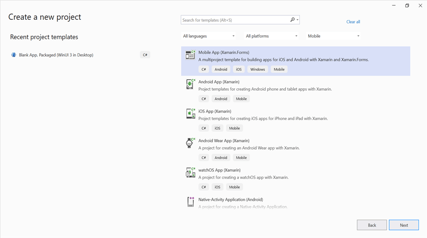
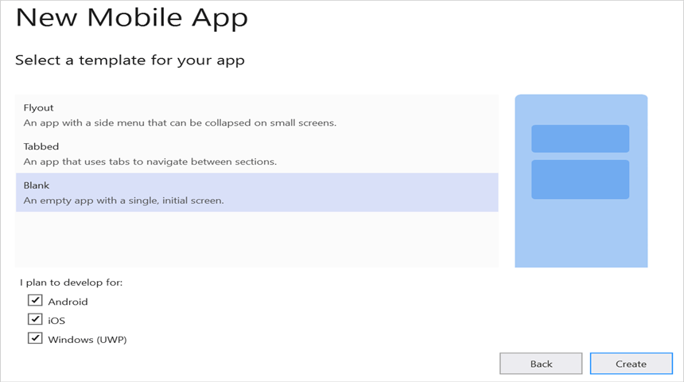
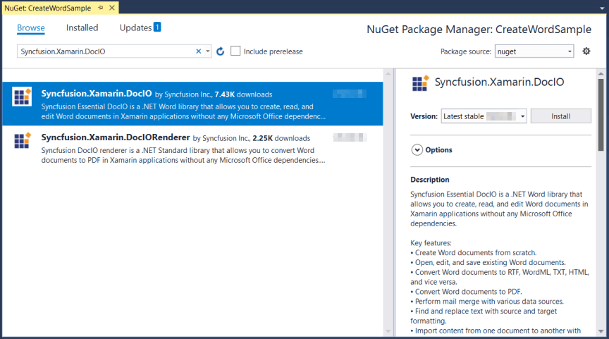

# Create Word document in Xamarin

Syncfusion<sup>&reg;</sup> Essential<sup>&reg;</sup> DocIO is a [Xamarin Word library](https://www.syncfusion.com/document-processing/word-framework/xamarin/word-library) used to create, read, and edit **Word** documents programmatically without **Microsoft Word** or interop (Microsoft.Office.Interop.Word) dependencies. Using this library, you can **create a Word document in Xamarin**.

N> Xamarin is deprecated as of May 2024. For new projects, consider using .NET MAUI. The DocIO library also supports .NET MAUI; see the [.NET MAUI Word Library](https://www.syncfusion.com/document-processing/word-framework/maui/word-library) for details.

## Prerequisites

Before you begin, ensure the following:

- Visual Studio with the **Mobile development with .NET** workload installed (includes Xamarin.Forms templates).
- A Syncfusion<sup>&reg;</sup> license key. Starting with v16.2.0.x, registering a license key is required; see the [licensing overview](https://help.syncfusion.com/common/essential-studio/licensing/overview).
- Supported target frameworks: .NET Standard 2.0 (recommended) or Portable Class Library (PCL). The `Syncfusion.Xamarin.DocIO` package targets `netstandard1.4` and `netstandard2.0`.
- Images and helper files (see the [Helper files for Xamarin](#helper-files-for-xamarin) section) bundled per the platform-specific instructions described later in this topic.

## Steps to Create Word Document Programmatically

Step 1: Create a new Xamarin.Forms application project.



Step 2: Select a project template and required platforms to deploy the application. In this application, the portable assemblies are shared across multiple platforms; the .NET Standard code sharing strategy has been selected. For more details about code sharing refer [here](https://learn.microsoft.com/en-us/xamarin/cross-platform/app-fundamentals/code-sharing).

N> If .NET Standard is not available in the code sharing strategy, the Portable Class Library (PCL) can be selected.



Step 3: Install [Syncfusion.Xamarin.DocIO](https://www.nuget.org/packages/Syncfusion.Xamarin.DocIO) NuGet package as a reference to the .NET Standard project in your application from [NuGet.org](https://www.nuget.org/).



N> Starting with v16.2.0.x, if you reference Syncfusion<sup>&reg;</sup> assemblies from trial setup or from the NuGet feed, you also have to add "Syncfusion.Licensing" assembly reference and include a license key in your projects. Please refer to this [link](https://help.syncfusion.com/common/essential-studio/licensing/overview) to know about registering Syncfusion<sup>&reg;</sup> license key in your application to use our components.

Step 4: Add a new Forms XAML page in the **portable project**. If no XAML page is defined in the App class, add one; otherwise proceed to the next step.

- To add the new XAML page, right-click the **portable project**, select **Add > New Item**, and add a **Forms XAML Page** from the list. Name it **MainXamlPage**.
- In the App class of the **portable project** (`App.cs`), replace the existing constructor of the App class with the code snippet given below, which invokes **MainXamlPage**. Ensure the `MainXamlPage` class is accessible from `App.cs` (either via a `using` directive for your project's default namespace or by fully qualifying the type name).




public App()
{
    // The root page of your application
    MainPage = new MainXamlPage();
}




Step 5: In the `MainXamlPage.xaml` add a new button as shown below.





<ContentPage xmlns="http://xamarin.com/schemas/2014/forms"
        xmlns:x="http://schemas.microsoft.com/winfx/2009/xaml"
        x:Class="GettingStarted.MainXamlPage">

    <StackLayout VerticalOptions="Center">
        <Button Text="Generate Document" Clicked="OnButtonClicked" HorizontalOptions="Center"/>
    </StackLayout>
</ContentPage>





Step 6: Include the following namespaces in the `MainXamlPage.xaml.cs` file. The `Syncfusion.Drawing` types (`Color`, `SizeF`) are provided by the `Syncfusion.Core.XForms` assembly, which is pulled in transitively by the `Syncfusion.Xamarin.DocIO` NuGet package.




using Syncfusion.DocIO;
using Syncfusion.DocIO.DLS;
using Syncfusion.Drawing;
using System;
using System.IO;
using System.Reflection;
using Xamarin.Forms;




Step 7: Include the below code snippet in the click event of the button in `MainXamlPage.xaml.cs`, to create a Word document and save it in a stream.

N> This step uses `Xamarin.Forms.DependencyService.Get<ISave>()`, which requires the [Helper files for Xamarin](#helper-files-for-xamarin) to be added to your platform projects first. It also references several images (`AdventureCycle.jpg`, `Mountain-200.jpg`, `Mountain-300.jpg`, `Road-550-W.jpg`) that you must add to a **Templates** folder in the **portable project** with **Build Action** set to **Embedded Resource**. Update the `GettingStarted` namespace prefix in each `GetManifestResourceStream` call to match your project's default namespace.





void OnButtonClicked(object sender, EventArgs args)
{
    //"GettingStarted" is the default namespace of the portable project.
    Assembly assembly = typeof(App).GetTypeInfo().Assembly;
    //Creating a new document
    using (WordDocument document = new WordDocument())
    {
    //Adding a new section to the document
    WSection section = document.AddSection() as WSection;
    //Set Margin of the section
    section.PageSetup.Margins.All = 72;
    //Set page size of the section
    section.PageSetup.PageSize = new Syncfusion.Drawing.SizeF(612, 792);

    //Create Paragraph styles
    WParagraphStyle style = document.AddParagraphStyle("Normal") as WParagraphStyle;
    style.CharacterFormat.FontName = "Calibri";
    style.CharacterFormat.FontSize = 11f;
    style.ParagraphFormat.BeforeSpacing = 0;
    style.ParagraphFormat.AfterSpacing = 8;
    style.ParagraphFormat.LineSpacing = 13.8f;

    style = document.AddParagraphStyle("Heading 1") as WParagraphStyle;
    style.ApplyBaseStyle("Normal");
    style.CharacterFormat.FontName = "Calibri Light";
    style.CharacterFormat.FontSize = 16f;
    style.CharacterFormat.TextColor = Syncfusion.Drawing.Color.FromArgb(46, 116, 181);
    style.ParagraphFormat.BeforeSpacing = 12;
    style.ParagraphFormat.AfterSpacing = 0;
    style.ParagraphFormat.Keep = true;
    style.ParagraphFormat.KeepFollow = true;
    style.ParagraphFormat.OutlineLevel = OutlineLevel.Level1;

    IWParagraph paragraph = section.HeadersFooters.Header.AddParagraph();
    //Gets the image stream
    Stream imageStream1 = assembly.GetManifestResourceStream("GettingStarted.Templates.AdventureCycle.jpg");
    IWPicture picture = paragraph.AppendPicture(imageStream1);
    picture.TextWrappingStyle = TextWrappingStyle.InFrontOfText;
    picture.VerticalOrigin = VerticalOrigin.Margin;
    picture.VerticalPosition = -45;
    picture.HorizontalOrigin = HorizontalOrigin.Column;
    picture.HorizontalPosition = 263.5f;
    picture.WidthScale = 20;
    picture.HeightScale = 15;

    paragraph.ApplyStyle("Normal");
    paragraph.ParagraphFormat.HorizontalAlignment = HorizontalAlignment.Left;
    WTextRange textRange = paragraph.AppendText("Adventure Works Cycles") as WTextRange;
    textRange.CharacterFormat.FontSize = 12f;
    textRange.CharacterFormat.FontName = "Calibri";
    textRange.CharacterFormat.TextColor = Syncfusion.Drawing.Color.Red;

    //Appends paragraph
    paragraph = section.AddParagraph();
    paragraph.ApplyStyle("Heading 1");
    paragraph.ParagraphFormat.HorizontalAlignment = HorizontalAlignment.Center;
    textRange = paragraph.AppendText("Adventure Works Cycles") as WTextRange;
    textRange.CharacterFormat.FontSize = 18f;
    textRange.CharacterFormat.FontName = "Calibri";

    //Appends paragraph
    paragraph = section.AddParagraph();
    paragraph.ParagraphFormat.FirstLineIndent = 36;
    paragraph.BreakCharacterFormat.FontSize = 12f;
    textRange = paragraph.AppendText("Adventure Works Cycles, the fictitious company on which the AdventureWorks sample databases are based, is a large, multinational manufacturing company. The company manufactures and sells metal and composite bicycles to North American, European and Asian commercial markets. While its base operation is in Bothell, Washington with 290 employees, several regional sales teams are located throughout their market base.") as WTextRange;
    textRange.CharacterFormat.FontSize = 12f;

    //Appends paragraph
    paragraph = section.AddParagraph();
    paragraph.ParagraphFormat.FirstLineIndent = 36;
    paragraph.BreakCharacterFormat.FontSize = 12f;
    textRange = paragraph.AppendText("In 2000, AdventureWorks Cycles bought a small manufacturing plant, Importadores Neptuno, located in Mexico. Importadores Neptuno manufactures several critical subcomponents for the AdventureWorks Cycles product line. These subcomponents are shipped to the Bothell location for final product assembly. In 2001, Importadores Neptuno, became the sole manufacturer and distributor of the touring bicycle product group.") as WTextRange;
    textRange.CharacterFormat.FontSize = 12f;

    paragraph = section.AddParagraph();
    paragraph.ApplyStyle("Heading 1");
    paragraph.ParagraphFormat.HorizontalAlignment = HorizontalAlignment.Left;
    textRange = paragraph.AppendText("Product Overview") as WTextRange;
    textRange.CharacterFormat.FontSize = 16f;
    textRange.CharacterFormat.FontName = "Calibri";

    //Appends table
    IWTable table = section.AddTable();
    table.ResetCells(3, 2);
    table.TableFormat.Borders.BorderType = BorderStyle.None;
    table.TableFormat.IsAutoResized = true;
    //Appends paragraph
    paragraph = table[0, 0].AddParagraph();
    paragraph.ParagraphFormat.AfterSpacing = 0;
    paragraph.BreakCharacterFormat.FontSize = 12f;
    //Appends picture to the paragraph
    Stream imageStream2 = assembly.GetManifestResourceStream("GettingStarted.Templates.Mountain-200.jpg");
    picture = paragraph.AppendPicture(imageStream2);
    picture.TextWrappingStyle = TextWrappingStyle.TopAndBottom;
    picture.VerticalOrigin = VerticalOrigin.Paragraph;
    picture.VerticalPosition = 4.5f;
    picture.HorizontalOrigin = HorizontalOrigin.Column;
    picture.HorizontalPosition = -2.15f;
    picture.WidthScale = 79;
    picture.HeightScale = 79;

    //Appends paragraph
    paragraph = table[0, 1].AddParagraph();
    paragraph.ApplyStyle("Heading 1");
    paragraph.ParagraphFormat.AfterSpacing = 0;
    paragraph.ParagraphFormat.LineSpacing = 12f;
    paragraph.AppendText("Mountain-200");
    //Appends paragraph
    paragraph = table[0, 1].AddParagraph();
    paragraph.ParagraphFormat.AfterSpacing = 0;
    paragraph.ParagraphFormat.LineSpacing = 12f;
    paragraph.BreakCharacterFormat.FontSize = 12f;
    paragraph.BreakCharacterFormat.FontName = "Times New Roman";
    textRange = paragraph.AppendText("Product No: BK-M68B-38\r") as WTextRange;
    textRange.CharacterFormat.FontSize = 12f;
    textRange.CharacterFormat.FontName = "Times New Roman";
    textRange = paragraph.AppendText("Size: 38\r") as WTextRange;
    textRange.CharacterFormat.FontSize = 12f;
    textRange.CharacterFormat.FontName = "Times New Roman";
    textRange = paragraph.AppendText("Weight: 25\r") as WTextRange;
    textRange.CharacterFormat.FontSize = 12f;
    textRange.CharacterFormat.FontName = "Times New Roman";
    textRange = paragraph.AppendText("Price: $2,294.99\r") as WTextRange;
    textRange.CharacterFormat.FontSize = 12f;
    textRange.CharacterFormat.FontName = "Times New Roman";
    //Appends paragraph
    paragraph = table[0, 1].AddParagraph();
    paragraph.ParagraphFormat.AfterSpacing = 0;
    paragraph.ParagraphFormat.LineSpacing = 12f;
    paragraph.BreakCharacterFormat.FontSize = 12f;

    //Appends paragraph
    paragraph = table[1, 0].AddParagraph();
    paragraph.ApplyStyle("Heading 1");
    paragraph.ParagraphFormat.AfterSpacing = 0;
    paragraph.ParagraphFormat.LineSpacing = 12f;
    paragraph.AppendText("Mountain-300 ");
    //Appends paragraph
    paragraph = table[1, 0].AddParagraph();
    paragraph.ParagraphFormat.AfterSpacing = 0;
    paragraph.ParagraphFormat.LineSpacing = 12f;
    paragraph.BreakCharacterFormat.FontSize = 12f;
    paragraph.BreakCharacterFormat.FontName = "Times New Roman";
    textRange = paragraph.AppendText("Product No: BK-M47B-38\r") as WTextRange;
    textRange.CharacterFormat.FontSize = 12f;
    textRange.CharacterFormat.FontName = "Times New Roman";
    textRange = paragraph.AppendText("Size: 35\r") as WTextRange;
    textRange.CharacterFormat.FontSize = 12f;
    textRange.CharacterFormat.FontName = "Times New Roman";
    textRange = paragraph.AppendText("Weight: 22\r") as WTextRange;
    textRange.CharacterFormat.FontSize = 12f;
    textRange.CharacterFormat.FontName = "Times New Roman";
    textRange = paragraph.AppendText("Price: $1,079.99\r") as WTextRange;
    textRange.CharacterFormat.FontSize = 12f;
    textRange.CharacterFormat.FontName = "Times New Roman";
    //Appends paragraph
    paragraph = table[1, 0].AddParagraph();
    paragraph.ParagraphFormat.AfterSpacing = 0;
    paragraph.ParagraphFormat.LineSpacing = 12f;
    paragraph.BreakCharacterFormat.FontSize = 12f;

    //Appends paragraph
    paragraph = table[1, 1].AddParagraph();
    paragraph.ApplyStyle("Heading 1");
    paragraph.ParagraphFormat.LineSpacing = 12f;
    //Appends picture to the paragraph
    Stream imageStream3 = assembly.GetManifestResourceStream("GettingStarted.Templates.Mountain-300.jpg");
    picture = paragraph.AppendPicture(imageStream3);
    picture.TextWrappingStyle = TextWrappingStyle.TopAndBottom;
    picture.VerticalOrigin = VerticalOrigin.Paragraph;
    picture.VerticalPosition = 8.2f;
    picture.HorizontalOrigin = HorizontalOrigin.Column;
    picture.HorizontalPosition = -14.95f;
    picture.WidthScale = 75;
    picture.HeightScale = 75;

    //Appends paragraph
    paragraph = table[2, 0].AddParagraph();
    paragraph.ApplyStyle("Heading 1");
    paragraph.ParagraphFormat.LineSpacing = 12f;
    //Appends picture to the paragraph
    Stream imageStream4 = assembly.GetManifestResourceStream("GettingStarted.Templates.Road-550-W.jpg");
    picture = paragraph.AppendPicture(imageStream4);
    picture.TextWrappingStyle = TextWrappingStyle.TopAndBottom;
    picture.VerticalOrigin = VerticalOrigin.Paragraph;
    picture.VerticalPosition = 3.75f;
    picture.HorizontalOrigin = HorizontalOrigin.Column;
    picture.HorizontalPosition = -5f;
    picture.WidthScale = 92;
    picture.HeightScale = 92;

    //Appends paragraph
    paragraph = table[2, 1].AddParagraph();
    paragraph.ApplyStyle("Heading 1");
    paragraph.ParagraphFormat.AfterSpacing = 0;
    paragraph.ParagraphFormat.LineSpacing = 12f;
    paragraph.AppendText("Road-150 ");
    //Appends paragraph
    paragraph = table[2, 1].AddParagraph();
    paragraph.ParagraphFormat.AfterSpacing = 0;
    paragraph.ParagraphFormat.LineSpacing = 12f;
    paragraph.BreakCharacterFormat.FontSize = 12f;
    paragraph.BreakCharacterFormat.FontName = "Times New Roman";
    textRange = paragraph.AppendText("Product No: BK-R93R-44\r") as WTextRange;
    textRange.CharacterFormat.FontSize = 12f;
    textRange.CharacterFormat.FontName = "Times New Roman";
    textRange = paragraph.AppendText("Size: 44\r") as WTextRange;
    textRange.CharacterFormat.FontSize = 12f;
    textRange.CharacterFormat.FontName = "Times New Roman";
    textRange = paragraph.AppendText("Weight: 14\r") as WTextRange;
    textRange.CharacterFormat.FontSize = 12f;
    textRange.CharacterFormat.FontName = "Times New Roman";
    textRange = paragraph.AppendText("Price: $3,578.27\r") as WTextRange;
    textRange.CharacterFormat.FontSize = 12f;
    textRange.CharacterFormat.FontName = "Times New Roman";
    //Appends paragraph
    section.AddParagraph();

    //Saves the Word document to MemoryStream
    using (MemoryStream stream = new MemoryStream())
    {
    document.Save(stream, FormatType.Docx);
    //Save the stream as a file in the device and invoke it for viewing
    Xamarin.Forms.DependencyService.Get<ISave>().SaveAndView("Sample.docx", "application/msword", stream);
    }
    } // disposes WordDocument
}




## Helper files for Xamarin

The Step 7 code relies on the helper files below. Add them to your projects **before** running Step 7. Download the helper files from this [link](https://www.syncfusion.com/downloads/support/directtrac/general/HELPER~1-696201504.ZIP) and add them into the mentioned project. These helper files allow you to save the stream as a physical file and open the file for viewing.

The following interface defines the save operation contract. Add it to the **portable project** as `ISave.cs`:

```csharp
public interface ISave
{
    void SaveAndView(string filename, string contentType, MemoryStream stream);
}
```

<table>
  <tr>
  <td>
    <b>Project</b>
  </td>
  <td>
    <b>File Name</b>
  </td>
  <td>
    <b>Summary</b>
  </td>
  </tr>
  <tr>
  <td>
    Portable project
  </td>
  <td>
    ISave.cs
  </td>
  <td>Represent the base interface for save operation
  </td>
  </tr>
  <tr>
  <td rowspan="2">
    iOS Project
  </td>
  <td>
    SaveIOS.cs
  </td>
  <td>
    Save implementation for iOS device
  </td>
  </tr>
  <tr>
  <td>
    PreviewControllerDS.cs
  </td>
  <td>
    Helper class for viewing the <b>Word document</b> in iOS device
  </td>
  </tr>
  <tr>
  <td>
    Android project
  </td>
  <td>
    SaveAndroid.cs
  </td>
  <td>Save implementation for Android device
  </td>
  </tr>
  <tr>
  <td>
    WinPhone project
  </td>
  <td>
    SaveWinPhone.cs
  </td>
  <td>Save implementation for Windows Phone device
  </td>
  </tr>
  <tr>
  <td>
    UWP project
  </td>
  <td>
    SaveWindows.cs
  </td>
  <td>Save implementation for UWP device.
  </td>
  </tr>
  <tr>
  <td>
    Windows (8.1) project
  </td>
  <td>
    SaveWindows81.cs
  </td>
  <td>Save implementation for WinRT device.
  </td>
  </tr>
</table>

N> **Platform-specific permissions:** On Android, add the `WRITE_EXTERNAL_STORAGE` permission to the Android manifest and request runtime storage permission on Android 6.0+ (API 23+). On UWP, grant `broadFileSystemAccess` capability in the package manifest if you need to save outside the app's local folder. On iOS, no additional file-system permission is required for saving to the app sandbox and previewing via `QLPreviewController`.

Compile and execute the application. Now this application **creates a Word document**.

You can download a complete working sample from [GitHub](https://github.com/SyncfusionExamples/DocIO-Examples/tree/main/Getting-Started/Xamarin).

By executing the program, you will get the Word document as follows.


Looking for the full .NET Word Library overview, features, pricing, and documentation? Visit the [.NET Word Library](https://www.syncfusion.com/document-sdk/net-word-library) page.

## See also

- [Edit Word document in Xamarin](https://help.syncfusion.com/document-processing/word/word-library/xamarin/edit-word-document)
- [Convert Word document to PDF in Xamarin](https://help.syncfusion.com/document-processing/word/word-library/xamarin/word-to-pdf)
- [Generate Word document from template in Xamarin](https://help.syncfusion.com/document-processing/word/word-library/xamarin/working-with-mail-merge)
- [DocIO NuGet packages](https://www.syncfusion.com/document-processing/word/nuget-packages) 