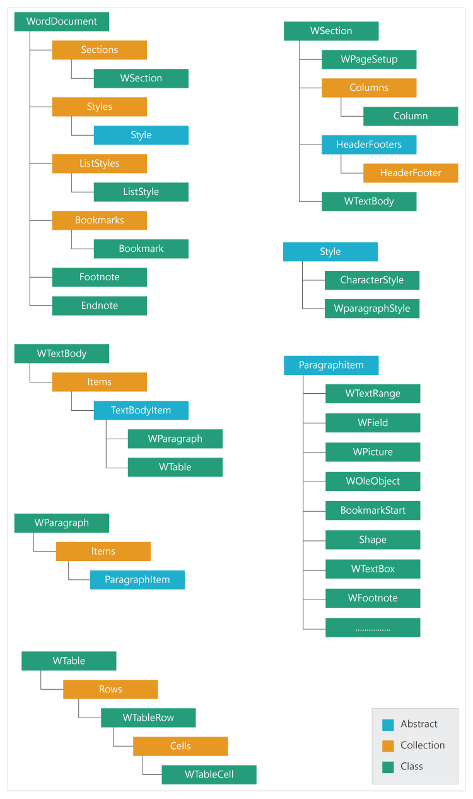

# Document Object Model representation in .NET Word (DocIO) library

When an existing document is opened or a new document is created, the .NET Word (DocIO) library builds a **Document Object Model** (DOM) of the document in memory. This in-memory object model can be traversed and modified programmatically through the DocIO API to manipulate the document as needed.

