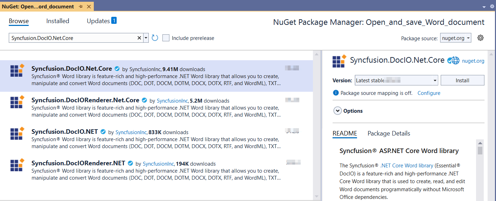
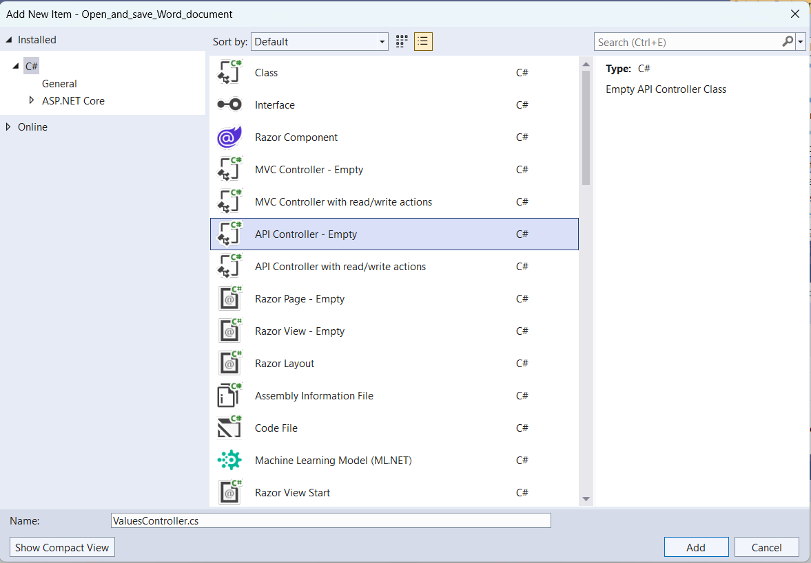
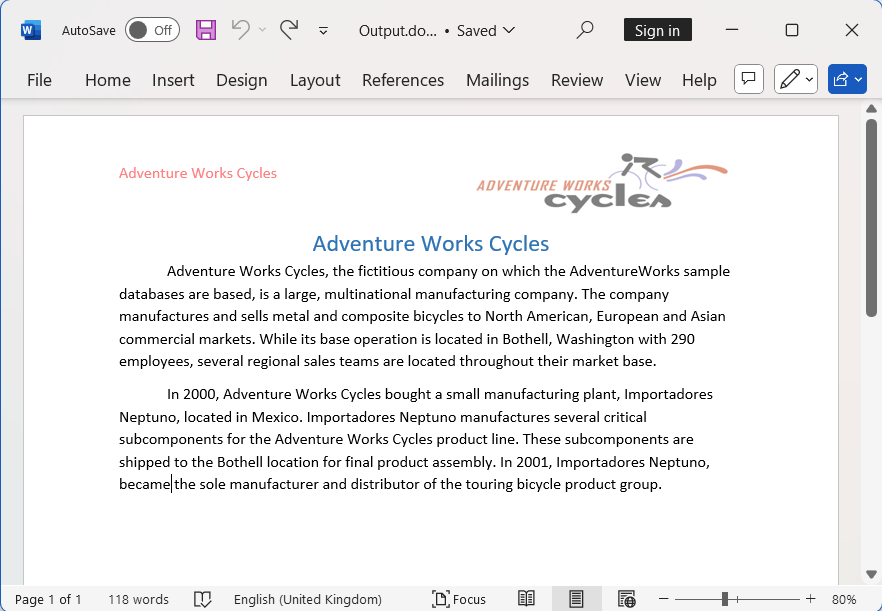

# Open and save Word document using ASP.NET Core Web API

Syncfusion&reg; DocIO is a [.NET Core Word library](https://www.syncfusion.com/document-processing/word-framework/net-core/word-library) used to create, read, and edit **Word** documents programmatically without **Microsoft Word** or interop dependencies. Using this library, you can **open and save a Word document in ASP.NET Core Web API**.

## Steps to open and save Word document programmatically:

The below steps illustrate open and save a simple Word document in ASP.NET Core Web API.

Step 1: Create a new C# ASP.NET Core Web API project.

Step 2: Install the [Syncfusion.DocIO.Net.Core](https://www.nuget.org/packages/Syncfusion.DocIO.Net.Core) NuGet package as a reference to your project from [NuGet.org](https://www.nuget.org).

N> Starting with v16.2.0.x, if you reference Syncfusion&reg; assemblies from trial setup or from the NuGet feed, you also have to add "Syncfusion.Licensing" assembly reference and include a license key in your projects. Please refer to this [link](https://help.syncfusion.com/common/essential-studio/licensing/overview) to know about registering Syncfusion&reg; license key in your application to use our components.

Step 3: Add a new API controller empty file in the project.

Step 4: Include the following namespaces in the **ValuesController.cs** file.





using Microsoft.AspNetCore.Mvc;
using Syncfusion.DocIO;
using Syncfusion.DocIO.DLS;





Step 5: Add a new action method DownloadWordDocument in **ValuesController.cs** and include the below code snippet to Open and save an Word file and download it.





 [HttpGet]
 [Route("api/Word")]
 public IActionResult DownloadWordDocument()
 {
     try
     {
         var fileDownloadName = "Output.docx";
         const string contentType = "application/vnd.openxmlformats-officedocument.wordprocessingml.document";
         var stream = OpenandSaveDocument();
         stream.Position = 0;
         return File(stream, contentType, fileDownloadName);
     }
     catch (Exception ex)
     {
         // Log or handle the exception
         return BadRequest("Error occurred while creating Word file: " + ex.Message);
     }
 }
 
 



Step 6: Implement the `OpenandSaveDocument` method in `ValuesController.cs`.
 




 public static MemoryStream OpenandSaveDocument()
 {
     //Open an existing Word document.
     WordDocument document = new WordDocument(Path.GetFullPath("Data/Input.docx"));
     //Access the section in a Word document.
     IWSection section = document.Sections[0];
     //Add a new paragraph to the section.
     IWParagraph paragraph = section.AddParagraph();
     paragraph.ParagraphFormat.FirstLineIndent = 36;
     paragraph.BreakCharacterFormat.FontSize = 12f;
     IWTextRange text = paragraph.AppendText("In 2000, Adventure Works Cycles bought a small manufacturing plant, Importadores Neptuno, located in Mexico. Importadores Neptuno manufactures several critical subcomponents for the Adventure Works Cycles product line. These subcomponents are shipped to the Bothell location for final product assembly. In 2001, Importadores Neptuno, became the sole manufacturer and distributor of the touring bicycle product group.");
     text.CharacterFormat.FontSize = 12f;

     //Saving the Word document to the MemoryStream 
     MemoryStream stream = new MemoryStream();
     document.Save(stream, FormatType.Docx);
     document.Close();
     //Set the position as '0'.
     stream.Position = 0;
     return stream;
 }





Step 7: Build the project.

Click on Build → Build Solution or press <kbd>Ctrl</kbd>+<kbd>Shift</kbd>+<kbd>B</kbd> to build the project.

Step 8: Run the project.

Click the Start button (green arrow) or press <kbd>F5</kbd> to run the app.

A complete working sample is available on [GitHub](https://github.com/SyncfusionExamples/DocIO-Examples/tree/main/Read-and-Save-document/Open-and-save-Word-document/ASP.NET-Core-Web-API/Open_and_save_Word_document).

## Steps for accessing the Web API using HTTP requests

Step 1: Create a console application.

N> Ensure your ASP.NET Core Web API is running on the specified port before running this client. Adjust the port number if your Web API runs on a different port (check the ASP.NET Core app's launch settings).

Step 2: Add the below code snippet in the **Program.cs** file for accessing the Web API using HTTP requests. 

This method sends a GET request to the Web API endpoint to retrieve and save the generated Word document.





// Create an HttpClient instance
using (HttpClient client = new HttpClient())
{
    try
    {
        // Send a GET request to a URL
        HttpResponseMessage response = await client.GetAsync("https://localhost:7125/api/Values/api/Word");

        // Check if the response is successful
        if (response.IsSuccessStatusCode)
        {
            // Read the content as a string
            Stream responseBody = await response.Content.ReadAsStreamAsync();
            FileStream fileStream = File.Create("../../../Output/Output.docx");
            responseBody.CopyTo(fileStream);
            fileStream.Close();
        }
        else
        {
            Console.WriteLine("HTTP error status code: " + response.StatusCode);
        }
    }
    catch (HttpRequestException e)
    {
        Console.WriteLine("Request exception: " + e.Message);
    }
}





Step 3: Build the project.

Click on Build → Build Solution or press <kbd>Ctrl</kbd>+<kbd>Shift</kbd>+<kbd>B</kbd> to build the project.

Step 4: Run the project.

Click the Start button (green arrow) or press <kbd>F5</kbd> to run the app.

A complete working sample is available on [GitHub](https://github.com/SyncfusionExamples/DocIO-Examples/tree/main/Read-and-Save-document/Open-and-save-Word-document/ASP.NET-Core-Web-API/Client-Application).

Upon executing the program, the **Word document** will be generated as follows.

Click [here](https://www.syncfusion.com/document-processing/word-framework/net) to explore the rich set of Syncfusion&reg; Word library (DocIO) features.
