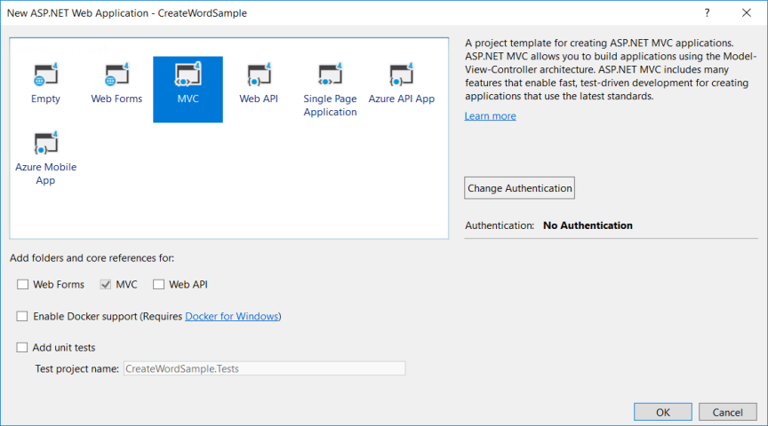

# Open and Save Word document in ASP.NET MVC

Syncfusion DocIO is a [.NET Word library](https://www.syncfusion.com/document-processing/word-framework/net/word-library) used to **create, read, and edit Word documents** programmatically without **Microsoft Word** or interop dependencies. Using this library, you can **open and save a Word document in ASP.NET MVC**.

## Steps to open and save Word document programmatically:

Step 1: Create a new ASP.NET MVC application project.

Step 2: Install the [Syncfusion.DocIO.AspNet.Mvc5](https://www.nuget.org/packages/Syncfusion.DocIO.AspNet.Mvc5) NuGet package as a reference to your project from [NuGet.org](https://www.nuget.org/).

N> Starting with v16.2.0.x, if you reference Syncfusion assemblies from trial setup or from the NuGet feed, you also have to add "Syncfusion.Licensing" assembly reference and include a license key in your projects. Please refer to this [link](https://help.syncfusion.com/common/essential-studio/licensing/overview) to know about registering Syncfusion license key in your application to use our components.

Step 3: Include the following namespace in that HomeController.cs file.





using Syncfusion.DocIO;
using Syncfusion.DocIO.DLS;





Step 4: A default action method named **Index** will be present in HomeController.cs. Right click on this action method and select **Go To View** where you will be directed to its associated view page **Index.cshtml**.

Step 5: Add a new button in the Index.cshtml as shown below.




@{Html.BeginForm("OpenAndSaveDocument", "Home", FormMethod.Get);
{

    <input type="submit" value="Open and Save Document" style="width:180px;height:27px" />

}
Html.EndForm();
}




Step 6: Add a new action method **OpenAndSaveDocument** in HomeController.cs.

Step 7: Add below code example to **open an existing Word document in ASP.NET MVC**.




//Open an existing Word document.
WordDocument document = new WordDocument("Input.docx");




Step 8: Add below code example to add a paragraph in the Word document.




//Access the section in a Word document.
IWSection section = document.Sections[0];
//Add a new paragraph to the section.
IWParagraph paragraph = section.AddParagraph();
paragraph.ParagraphFormat.FirstLineIndent = 36;
paragraph.BreakCharacterFormat.FontSize = 12f;
IWTextRange text = paragraph.AppendText("In 2000, Adventure Works Cycles bought a small manufacturing plant, Importadores Neptuno, located in Mexico. Importadores Neptuno manufactures several critical subcomponents for the Adventure Works Cycles product line. These subcomponents are shipped to the Bothell location for final product assembly. In 2001, Importadores Neptuno, became the sole manufacturer and distributor of the touring bicycle product group.");
text.CharacterFormat.FontSize = 12f;




Step 9: Add below code example to **save the Word document in ASP.NET MVC**.




//Save the Word document and download as attachment.
document.Save("Sample.docx", FormatType.Docx, HttpContext.ApplicationInstance.Response, HttpContentDisposition.Attachment);




You can download a complete working sample from [GitHub](https://github.com/SyncfusionExamples/DocIO-Examples/tree/main/Read-and-Save-document/Open-and-save-Word-document/ASP.NET-MVC).

By executing the program, you will get the **Word document** as follows.

Click [here](https://www.syncfusion.com/document-processing/word-framework/net) to explore the rich set of Syncfusion Word library (DocIO) features. 