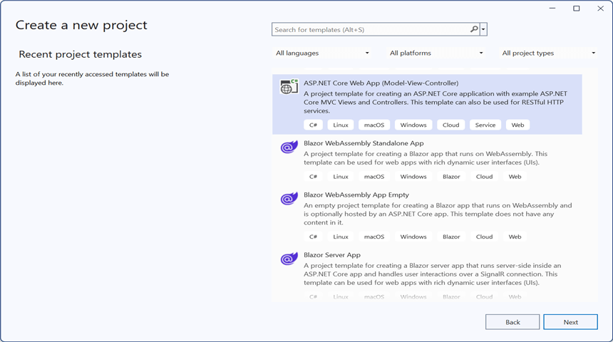
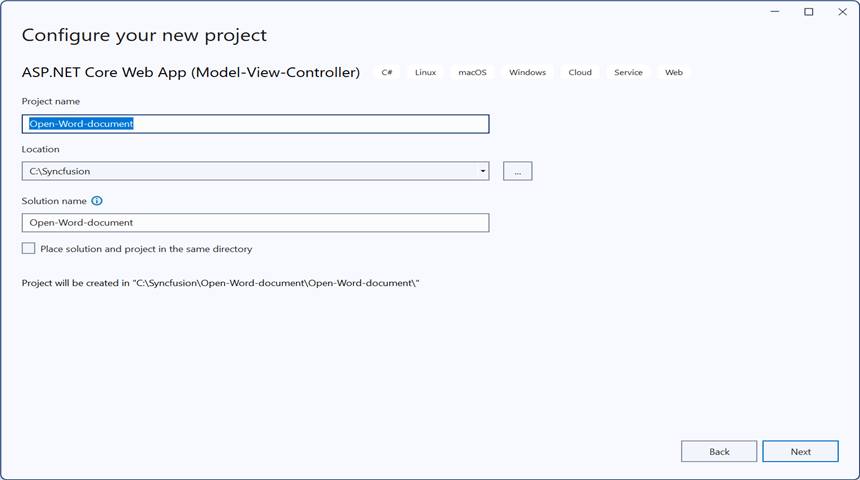
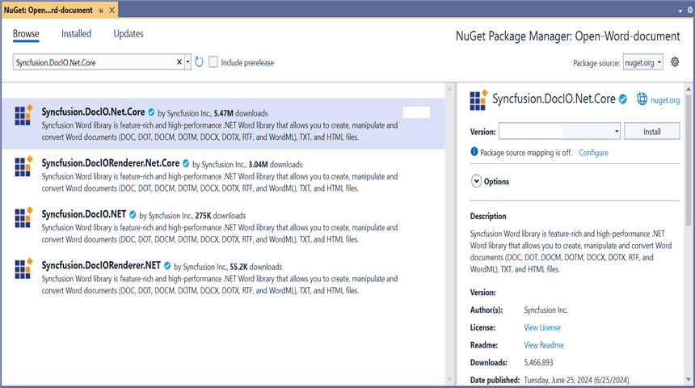
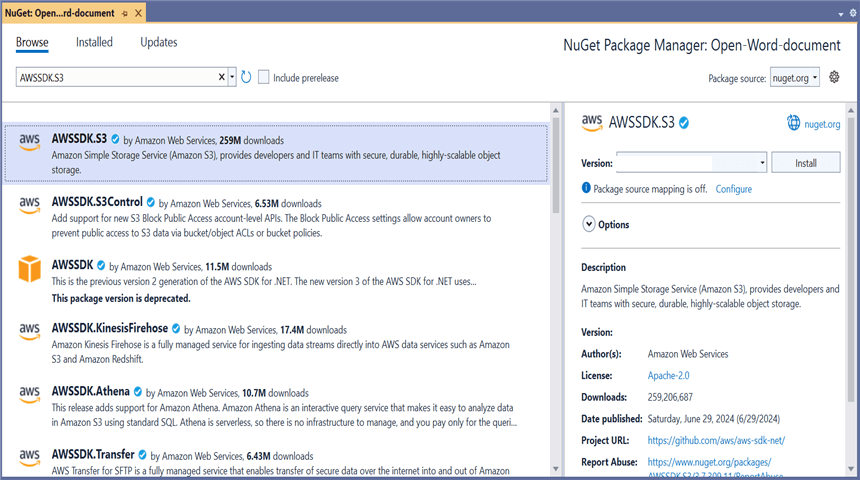
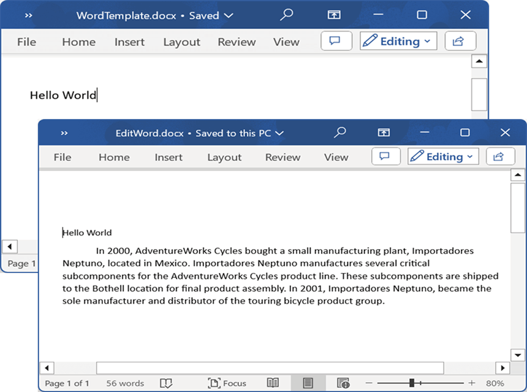
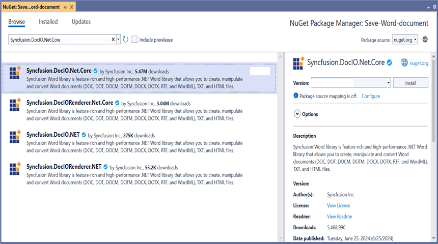
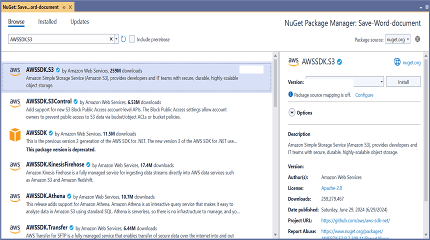
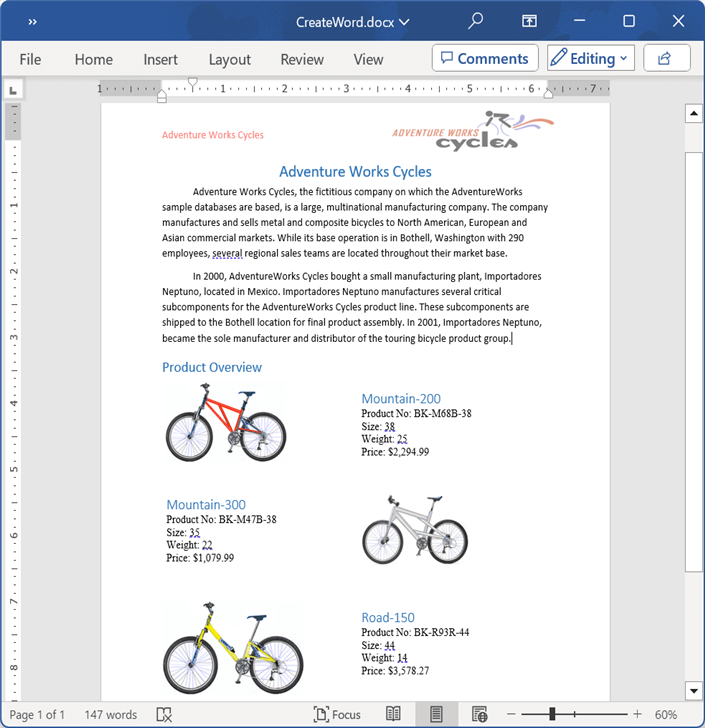

# Open and Save Word document in AWS S3 Cloud Storage

## Prerequisites  

* **[AWS S3 Cloud Storage](https://docs.aws.amazon.com/AmazonS3/latest/userguide/Welcome.html)** is required.

## Open Word document from AWS S3

Steps to open a Word document from AWS S3 Cloud Storage.

Step 1: Create a new ASP.NET Core Web Application (Model-View-Controller).

Step 2: Name the project.

Step 3: Install the following **Nuget packages** in your application from [NuGet.org](https://www.nuget.org/).

* [Syncfusion.DocIO.Net.Core](https://www.nuget.org/packages/Syncfusion.DocIO.Net.Core)
* [AWSSDK.S3](https://www.nuget.org/packages/AWSSDK.S3)

Step 4: Add a new button in the **Index.cshtml** as shown below.

  

@{Html.BeginForm("EditDocument", "Home", FormMethod.Get);
    {
        

            <input type="submit" value="Edit Document" style="width:150px;height:27px" />
        

    }
    Html.EndForm();
}



Step 5: Include the following namespaces in **HomeController.cs**.



using Amazon.S3;
using Syncfusion.DocIO.DLS;



Step 6: Include the below code snippet in **HomeController.cs** to **open a Word document from AWS S3 Cloud Storage**.



public async Task<IActionResult> EditDocument()
{
    try
    {
        //Retrieve the document from AWS S3
        MemoryStream stream = await GetDocumentFromS3();

        //Set the position to the beginning of the MemoryStream
        stream.Position = 0;

        //Create an instance of WordDocument
        using (WordDocument wordDocument = new WordDocument(stream, Syncfusion.DocIO.FormatType.Docx))
        {
            //Access the section in a Word document
            IWSection section = wordDocument.Sections[0];

            //Add new paragraph to the section
            IWParagraph paragraph = section.AddParagraph();
            paragraph.ParagraphFormat.FirstLineIndent = 36;
            paragraph.BreakCharacterFormat.FontSize = 12f;

            //Add new text to the paragraph
            IWTextRange textRange = paragraph.AppendText("In 2000, AdventureWorks Cycles bought a small manufacturing plant, Importadores Neptuno, located in Mexico. Importadores Neptuno manufactures several critical subcomponents for the AdventureWorks Cycles product line. These subcomponents are shipped to the Bothell location for final product assembly. In 2001, Importadores Neptuno, became the sole manufacturer and distributor of the touring bicycle product group.") as IWTextRange;
            textRange.CharacterFormat.FontSize = 12f;

            //Saving the Word document to a MemoryStream 
            MemoryStream outputStream = new MemoryStream();
            wordDocument.Save(outputStream, Syncfusion.DocIO.FormatType.Docx);

            //Download the Word file in the browser
            FileStreamResult fileStreamResult = new FileStreamResult(outputStream, "application/msword");
            fileStreamResult.FileDownloadName = "EditWord.docx";
            return fileStreamResult;
        }
    }
    catch (Exception ex)
    {
        Console.WriteLine($"Error: {ex.Message}");
        return Content("Error occurred while processing the file.");
    }
}



### Download file from AWS S3 cloud storage

This is the helper method to download Word document from AWS S3 cloud storage.



/// 

/// Download file from AWS S3 cloud storage
/// 

/// <returns></returns>
public async Task<MemoryStream> GetDocumentFromS3()
{
    //Your AWS Storage Account bucket name 
    string bucketName = "your-bucket-name";

    //Name of the Word file you want to load from AWS S3
    string key = "WordTemplate.docx";

    //Configure AWS credentials and region
    var region = Amazon.RegionEndpoint.USEast1;
    var credentials = new Amazon.Runtime.BasicAWSCredentials("your-access-key", "your-secret-key");
    var config = new AmazonS3Config
    {
        RegionEndpoint = region
    };

    try
    {
        using (var client = new AmazonS3Client(credentials, config))
        {
            //Create a MemoryStream to copy the file content
            MemoryStream stream = new MemoryStream();

            //Download the file from S3 into the MemoryStream
            var response = await client.GetObjectAsync(new Amazon.S3.Model.GetObjectRequest
            {
                BucketName = bucketName,
                Key = key
            });

            //Copy the response stream to the MemoryStream
            await response.ResponseStream.CopyToAsync(stream);

            return stream;
        }
    }
    catch (Exception ex)
    {
        Console.WriteLine($"Error retrieving document from S3: {ex.Message}");
        throw; // or handle the exception as needed
    }
}



You can download a complete working sample from [GitHub](https://github.com/SyncfusionExamples/DocIO-Examples/tree/main/Read-and-Save-document/Open-and-save-Word-document/AWS-S3-Bucket/Open-Word-document).

By executing the program, you will get the **Word document** as follows.

## Save Word document to AWS S3

Steps to save a Word document to AWS S3 Cloud Storage.

Step 1: Create a new ASP.NET Core Web Application (Model-View-Controller).

Step 2: Name the project.

Step 3: Install the following **Nuget packages** in your application from [NuGet.org](https://www.nuget.org/).

* [Syncfusion.DocIO.Net.Core](https://www.nuget.org/packages/Syncfusion.DocIO.Net.Core)
* [AWSSDK.S3](https://www.nuget.org/packages/AWSSDK.S3)

Step 4: Add a new button in the **Index.cshtml** as shown below.

  

@{Html.BeginForm("UploadDocument", "Home", FormMethod.Get);
    {
        

            <input type="submit" value="Upload Document" style="width:150px;height:27px" />
        

    }
    Html.EndForm();
}



Step 5: Include the following namespaces in **HomeController.cs**.



using Amazon.S3;
using Amazon.S3.Transfer;
using Syncfusion.DocIO;
using Syncfusion.DocIO.DLS;



Step 6: Include the below code snippet in **HomeController.cs** to **save a Word document to AWS S3 Cloud Storage**.



public async Task<IActionResult> UploadDocument()
{
    //Creating a new document
    WordDocument document = new WordDocument();

    //Adding a new section to the document
    WSection section = document.AddSection() as WSection;

    //Set Margin of the section
    section.PageSetup.Margins.All = 72;

    //Set page size of the section
    section.PageSetup.PageSize = new Syncfusion.Drawing.SizeF(612, 792);

    //Create Paragraph styles
    WParagraphStyle style = document.AddParagraphStyle("Normal") as WParagraphStyle;
    style.CharacterFormat.FontName = "Calibri";
    style.CharacterFormat.FontSize = 11f;
    style.ParagraphFormat.BeforeSpacing = 0;
    style.ParagraphFormat.AfterSpacing = 8;
    style.ParagraphFormat.LineSpacing = 13.8f;

    style = document.AddParagraphStyle("Heading 1") as WParagraphStyle;
    style.ApplyBaseStyle("Normal");
    style.CharacterFormat.FontName = "Calibri Light";
    style.CharacterFormat.FontSize = 16f;
    style.CharacterFormat.TextColor = Syncfusion.Drawing.Color.FromArgb(46, 116, 181);
    style.ParagraphFormat.BeforeSpacing = 12;
    style.ParagraphFormat.AfterSpacing = 0;
    style.ParagraphFormat.Keep = true;
    style.ParagraphFormat.KeepFollow = true;
    style.ParagraphFormat.OutlineLevel = OutlineLevel.Level1;

    IWParagraph paragraph = section.HeadersFooters.Header.AddParagraph();

    //Gets the image stream
    FileStream imageStream = new FileStream("AdventureCycle.jpg", FileMode.Open, FileAccess.Read);
    IWPicture picture = paragraph.AppendPicture(imageStream);
    picture.TextWrappingStyle = TextWrappingStyle.InFrontOfText;
    picture.VerticalOrigin = VerticalOrigin.Margin;
    picture.VerticalPosition = -45;
    picture.HorizontalOrigin = HorizontalOrigin.Column;
    picture.HorizontalPosition = 263.5f;
    picture.WidthScale = 20;
    picture.HeightScale = 15;

    paragraph.ApplyStyle("Normal");
    paragraph.ParagraphFormat.HorizontalAlignment = HorizontalAlignment.Left;
    WTextRange textRange = paragraph.AppendText("Adventure Works Cycles") as WTextRange;
    textRange.CharacterFormat.FontSize = 12f;
    textRange.CharacterFormat.FontName = "Calibri";
    textRange.CharacterFormat.TextColor = Syncfusion.Drawing.Color.Red;

    //Appends paragraph
    paragraph = section.AddParagraph();
    paragraph.ApplyStyle("Heading 1");
    paragraph.ParagraphFormat.HorizontalAlignment = HorizontalAlignment.Center;
    textRange = paragraph.AppendText("Adventure Works Cycles") as WTextRange;
    textRange.CharacterFormat.FontSize = 18f;
    textRange.CharacterFormat.FontName = "Calibri";

    //Appends paragraph
    paragraph = section.AddParagraph();
    paragraph.ParagraphFormat.FirstLineIndent = 36;
    paragraph.BreakCharacterFormat.FontSize = 12f;
    textRange = paragraph.AppendText("Adventure Works Cycles, the fictitious company on which the AdventureWorks sample databases are based, is a large, multinational manufacturing company. The company manufactures and sells metal and composite bicycles to North American, European and Asian commercial markets. While its base operation is in Bothell, Washington with 290 employees, several regional sales teams are located throughout their market base.") as WTextRange;
    textRange.CharacterFormat.FontSize = 12f;

    //Appends paragraph
    paragraph = section.AddParagraph();
    paragraph.ParagraphFormat.FirstLineIndent = 36;
    paragraph.BreakCharacterFormat.FontSize = 12f;
    textRange = paragraph.AppendText("In 2000, AdventureWorks Cycles bought a small manufacturing plant, Importadores Neptuno, located in Mexico. Importadores Neptuno manufactures several critical subcomponents for the AdventureWorks Cycles product line. These subcomponents are shipped to the Bothell location for final product assembly. In 2001, Importadores Neptuno, became the sole manufacturer and distributor of the touring bicycle product group.") as WTextRange;
    textRange.CharacterFormat.FontSize = 12f;

    paragraph = section.AddParagraph();
    paragraph.ApplyStyle("Heading 1");
    paragraph.ParagraphFormat.HorizontalAlignment = HorizontalAlignment.Left;
    textRange = paragraph.AppendText("Product Overview") as WTextRange;
    textRange.CharacterFormat.FontSize = 16f;
    textRange.CharacterFormat.FontName = "Calibri";

    //Appends table
    IWTable table = section.AddTable();
    table.ResetCells(3, 2);
    table.TableFormat.Borders.BorderType = BorderStyle.None;
    table.TableFormat.IsAutoResized = true;

    //Appends paragraph
    paragraph = table[0, 0].AddParagraph();
    paragraph.ParagraphFormat.AfterSpacing = 0;
    paragraph.BreakCharacterFormat.FontSize = 12f;

    //Appends picture to the paragraph
    FileStream image1 = new FileStream("Mountain-200.jpg", FileMode.Open, FileAccess.Read);
    picture = paragraph.AppendPicture(image1);
    picture.TextWrappingStyle = TextWrappingStyle.TopAndBottom;
    picture.VerticalOrigin = VerticalOrigin.Paragraph;
    picture.VerticalPosition = 4.5f;
    picture.HorizontalOrigin = HorizontalOrigin.Column;
    picture.HorizontalPosition = -2.15f;
    picture.WidthScale = 79;
    picture.HeightScale = 79;

    //Appends paragraph
    paragraph = table[0, 1].AddParagraph();
    paragraph.ApplyStyle("Heading 1");
    paragraph.ParagraphFormat.AfterSpacing = 0;
    paragraph.ParagraphFormat.LineSpacing = 12f;
    paragraph.AppendText("Mountain-200");

    //Appends paragraph
    paragraph = table[0, 1].AddParagraph();
    paragraph.ParagraphFormat.AfterSpacing = 0;
    paragraph.ParagraphFormat.LineSpacing = 12f;
    paragraph.BreakCharacterFormat.FontSize = 12f;
    paragraph.BreakCharacterFormat.FontName = "Times New Roman";
    textRange = paragraph.AppendText("Product No: BK-M68B-38\r") as WTextRange;
    textRange.CharacterFormat.FontSize = 12f;
    textRange.CharacterFormat.FontName = "Times New Roman";
    textRange = paragraph.AppendText("Size: 38\r") as WTextRange;
    textRange.CharacterFormat.FontSize = 12f;
    textRange.CharacterFormat.FontName = "Times New Roman";
    textRange = paragraph.AppendText("Weight: 25\r") as WTextRange;
    textRange.CharacterFormat.FontSize = 12f;
    textRange.CharacterFormat.FontName = "Times New Roman";
    textRange = paragraph.AppendText("Price: $2,294.99\r") as WTextRange;
    textRange.CharacterFormat.FontSize = 12f;
    textRange.CharacterFormat.FontName = "Times New Roman";

    //Appends paragraph
    paragraph = table[0, 1].AddParagraph();
    paragraph.ParagraphFormat.AfterSpacing = 0;
    paragraph.ParagraphFormat.LineSpacing = 12f;
    paragraph.BreakCharacterFormat.FontSize = 12f;

    //Appends paragraph
    paragraph = table[1, 0].AddParagraph();
    paragraph.ApplyStyle("Heading 1");
    paragraph.ParagraphFormat.AfterSpacing = 0;
    paragraph.ParagraphFormat.LineSpacing = 12f;
    paragraph.AppendText("Mountain-300 ");

    //Appends paragraph
    paragraph = table[1, 0].AddParagraph();
    paragraph.ParagraphFormat.AfterSpacing = 0;
    paragraph.ParagraphFormat.LineSpacing = 12f;
    paragraph.BreakCharacterFormat.FontSize = 12f;
    paragraph.BreakCharacterFormat.FontName = "Times New Roman";
    textRange = paragraph.AppendText("Product No: BK-M47B-38\r") as WTextRange;
    textRange.CharacterFormat.FontSize = 12f;
    textRange.CharacterFormat.FontName = "Times New Roman";
    textRange = paragraph.AppendText("Size: 35\r") as WTextRange;
    textRange.CharacterFormat.FontSize = 12f;
    textRange.CharacterFormat.FontName = "Times New Roman";
    textRange = paragraph.AppendText("Weight: 22\r") as WTextRange;
    textRange.CharacterFormat.FontSize = 12f;
    textRange.CharacterFormat.FontName = "Times New Roman";
    textRange = paragraph.AppendText("Price: $1,079.99\r") as WTextRange;
    textRange.CharacterFormat.FontSize = 12f;
    textRange.CharacterFormat.FontName = "Times New Roman";

    //Appends paragraph
    paragraph = table[1, 0].AddParagraph();
    paragraph.ParagraphFormat.AfterSpacing = 0;
    paragraph.ParagraphFormat.LineSpacing = 12f;
    paragraph.BreakCharacterFormat.FontSize = 12f;

    //Appends paragraph
    paragraph = table[1, 1].AddParagraph();
    paragraph.ApplyStyle("Heading 1");
    paragraph.ParagraphFormat.LineSpacing = 12f;

    //Appends picture to the paragraph
    FileStream image2 = new FileStream("Mountain-300.jpg", FileMode.Open, FileAccess.Read);
    picture = paragraph.AppendPicture(image2);
    picture.TextWrappingStyle = TextWrappingStyle.TopAndBottom;
    picture.VerticalOrigin = VerticalOrigin.Paragraph;
    picture.VerticalPosition = 8.2f;
    picture.HorizontalOrigin = HorizontalOrigin.Column;
    picture.HorizontalPosition = -14.95f;
    picture.WidthScale = 75;
    picture.HeightScale = 75;

    //Appends paragraph
    paragraph = table[2, 0].AddParagraph();
    paragraph.ApplyStyle("Heading 1");
    paragraph.ParagraphFormat.LineSpacing = 12f;

    //Appends picture to the paragraph
    FileStream image3 = new FileStream("Road-550-W.jpg", FileMode.Open, FileAccess.Read);
    picture = paragraph.AppendPicture(image3);
    picture.TextWrappingStyle = TextWrappingStyle.TopAndBottom;
    picture.VerticalOrigin = VerticalOrigin.Paragraph;
    picture.VerticalPosition = 3.75f;
    picture.HorizontalOrigin = HorizontalOrigin.Column;
    picture.HorizontalPosition = -5f;
    picture.WidthScale = 92;
    picture.HeightScale = 92;

    //Appends paragraph
    paragraph = table[2, 1].AddParagraph();
    paragraph.ApplyStyle("Heading 1");
    paragraph.ParagraphFormat.AfterSpacing = 0;
    paragraph.ParagraphFormat.LineSpacing = 12f;
    paragraph.AppendText("Road-150 ");

    //Appends paragraph
    paragraph = table[2, 1].AddParagraph();
    paragraph.ParagraphFormat.AfterSpacing = 0;
    paragraph.ParagraphFormat.LineSpacing = 12f;
    paragraph.BreakCharacterFormat.FontSize = 12f;
    paragraph.BreakCharacterFormat.FontName = "Times New Roman";
    textRange = paragraph.AppendText("Product No: BK-R93R-44\r") as WTextRange;
    textRange.CharacterFormat.FontSize = 12f;
    textRange.CharacterFormat.FontName = "Times New Roman";
    textRange = paragraph.AppendText("Size: 44\r") as WTextRange;
    textRange.CharacterFormat.FontSize = 12f;
    textRange.CharacterFormat.FontName = "Times New Roman";
    textRange = paragraph.AppendText("Weight: 14\r") as WTextRange;
    textRange.CharacterFormat.FontSize = 12f;
    textRange.CharacterFormat.FontName = "Times New Roman";
    textRange = paragraph.AppendText("Price: $3,578.27\r") as WTextRange;
    textRange.CharacterFormat.FontSize = 12f;
    textRange.CharacterFormat.FontName = "Times New Roman";

    //Appends paragraph
    section.AddParagraph();

    //Saves the Word document to MemoryStream
    MemoryStream stream = new MemoryStream();
    document.Save(stream, FormatType.Docx);            

    //Upload the document to AWS S3
    await UploadDocumentToS3(stream);

    return Ok("Word document uploaded to AWS S3 Storage.");
}



### Upload file to AWS S3 cloud storage

This is the helper method to upload Word document to AWS S3 cloud storage.



/// 

/// Upload file to AWS S3 cloud storage
/// 

/// <param name="stream"></param>
/// <returns></returns>
public async Task<MemoryStream> UploadDocumentToS3(MemoryStream stream)
{
    //Your AWS Storage Account bucket name 
    string bucketName = "your-bucket-name";

    //Name of the Word file you want to upload
    string key = "CreateWord.docx";

    //Configure AWS credentials and region
    var region = Amazon.RegionEndpoint.USEast1;
    var credentials = new Amazon.Runtime.BasicAWSCredentials("your-access-key", "your-secret-key");
    var config = new AmazonS3Config
    {
        RegionEndpoint = region
    };

    using (var client = new AmazonS3Client(credentials, config))
    {
        var fileTransferUtility = new TransferUtility(client);

        try
        {
            //Upload the stream to AWS S3
            await fileTransferUtility.UploadAsync(stream, bucketName, key);
            Console.WriteLine("Upload completed successfully");
        }
        catch (AmazonS3Exception e)
        {
            Console.WriteLine("Error encountered on server. Message:'{0}' when writing an object", e.Message);
        }
        catch (Exception e)
        {
            Console.WriteLine("Unknown encountered on server. Message:'{0}' when writing an object", e.Message);
        }
    }
    return stream;
}



You can download a complete working sample from [GitHub](https://github.com/SyncfusionExamples/DocIO-Examples/tree/main/Read-and-Save-document/Open-and-save-Word-document/AWS-S3-Bucket/Save-Word-document).

By executing the program, you will get the **Word document** as follows.

