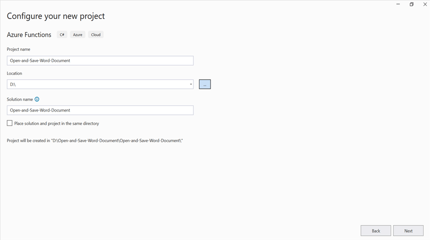
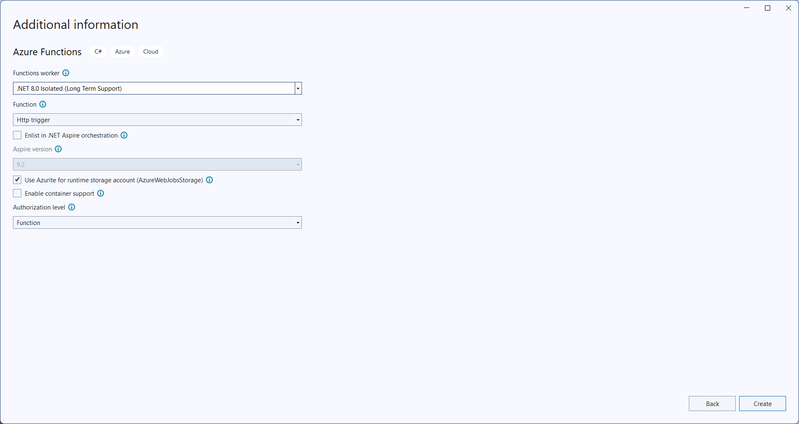
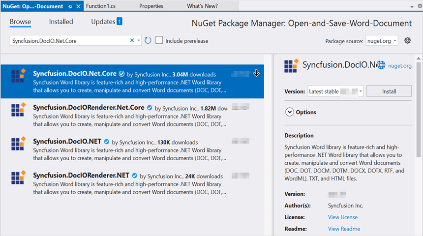
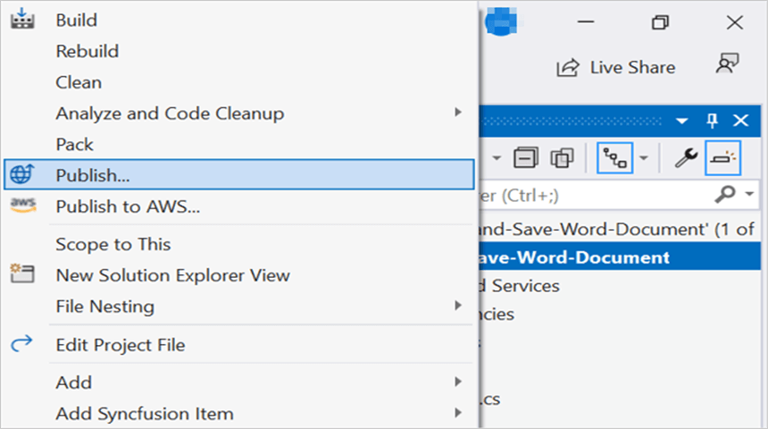
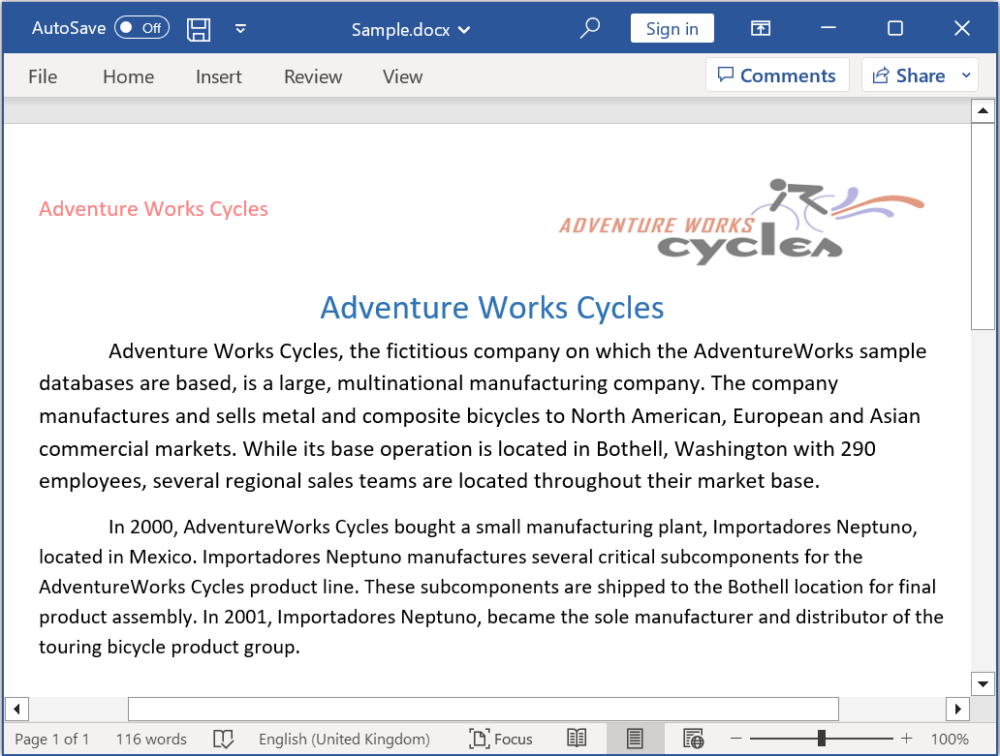

# Open and save Word document in Azure Functions (Flex Consumption)

Syncfusion&reg; DocIO is a [.NET Core Word library](https://www.syncfusion.com/document-processing/word-framework/net/word-library) used to create, read, edit, and convert Word documents programmatically without **Microsoft Word** or interop dependencies. Using this library, you can **Open and save Word document in Azure Functions deployed on Flex (Consumption) plan**.

## Steps to Open and save Word document in Azure Functions (Flex Consumption)

Step 1: Create a new Azure Functions project.

Step 2: Create a project name and select the location.

Step 3: Select function worker as **.NET 8.0 (Long Term Support)** (isolated worker) and target Flex/Consumption hosting suitable for isolated worker.

Step 4: Install the [Syncfusion.DocIO.Net.Core](https://www.nuget.org/packages/Syncfusion.DocIO.Net.Core) NuGet package as a reference to your project from [NuGet.org](https://www.nuget.org/).

N> Starting with v16.2.0.x, if you reference Syncfusion&reg; assemblies from trial setup or from the NuGet feed, you also have to add "Syncfusion.Licensing" assembly reference and include a license key in your projects. Please refer to this [link](https://help.syncfusion.com/common/essential-studio/licensing/overview) to know about registering Syncfusion&reg; license key in your application to use our components.

Step 5: Include the following namespaces in the **Function1.cs** file.




using Syncfusion.DocIO;
using Syncfusion.DocIO.DLS;





Step 6: Add the following code snippet in **Run** method of **Function1** class to perform **Open and save Word document** in Azure Functions and return the resultant **Word document** to client end.




public async Task<IActionResult> Run([HttpTrigger(AuthorizationLevel.Function, "post")] HttpRequest req)
    {
        try
        {
            // Create a memory stream to hold the incoming request body (Word document bytes)
            await using MemoryStream inputStream = new MemoryStream();
            // Copy the request body into the memory stream
            await req.Body.CopyToAsync(inputStream);
            // Check if the stream is empty (no file content received)
            if (inputStream.Length == 0)
                return new BadRequestObjectResult("No file content received in request body.");
            // Reset stream position to the beginning for reading
            inputStream.Position = 0;
            // Load the Word document from the stream (auto-detects format type)
            using WordDocument document = new WordDocument(inputStream, Syncfusion.DocIO.FormatType.Automatic);
            //Access the section in a Word document.
            IWSection section = document.Sections[0];
            //Add a new paragraph to the section.
            IWParagraph paragraph = section.AddParagraph();
            paragraph.ParagraphFormat.FirstLineIndent = 36;
            paragraph.BreakCharacterFormat.FontSize = 12f;
            IWTextRange text = paragraph.AppendText("In 2000, Adventure Works Cycles bought a small manufacturing plant, Importadores Neptuno, located in Mexico. Importadores Neptuno manufactures several critical subcomponents for the Adventure Works Cycles product line. These subcomponents are shipped to the Bothell location for final product assembly. In 2001, Importadores Neptuno, became the sole manufacturer and distributor of the touring bicycle product group.");
            text.CharacterFormat.FontSize = 12f;
            MemoryStream memoryStream = new MemoryStream();
            //Saves the Word document file.
            document.Save(memoryStream, FormatType.Docx);
            memoryStream.Position = 0;
            var bytes = memoryStream.ToArray();
            return new FileContentResult(bytes, "application/vnd.openxmlformats-officedocument.wordprocessingml.document")
            {
                FileDownloadName = "document.docx"
            };
        }
        catch (Exception ex)
        {
            // Log the error with details for troubleshooting
            _logger.LogError(ex, "Error Open and Save document.");
            // Prepare error message including exception details
            var msg = $"Exception: {ex.Message}\n\n{ex}";
            // Return a 500 Internal Server Error response with the message
            return new ContentResult { StatusCode = 500, Content = msg, ContentType = "text/plain; charset=utf-8" };
        }
    }
	



Step 7: Right click the project and select **Publish**. Then, create a new profile in the Publish Window.

Step 8: Select the target as **Azure** and click **Next** button.

Step 9: Select the specific target as **Azure Function App** and click **Next** button.

Step 10: Select the **Create new** button.

Step 11: Click **Create** button. 

Step 12: After creating app service then click **Finish** button. 

Step 13: Click the **Publish** button.

Step 14: Publish has been succeed.

Step 15: Now, go to Azure portal and select the App Services. After running the service, click **Get function URL by copying it**. Then, paste it in the below client sample (which will request the Azure Functions, to perform **Open and save a Word document** using the template Word document). You will get the output Word document as follows.

## Steps to post the request to Azure Functions

Step 1: Create a console application to request the Azure Functions API.

Step 2: Add the following code snippet into Main method to post the request to Azure Functions with template Word document and get the resultant Word document.



static async Task Main()
    {
        try
        {
            Console.Write("Please enter your Azure Functions URL : ");
            string url = Console.ReadLine();
            if (string.IsNullOrEmpty(url)) return;
            // Create a new HttpClient instance for sending HTTP requests
            using var http = new HttpClient();
            // Read all bytes from the input Word document 
            byte[] bytes = await File.ReadAllBytesAsync(@"Data/Input.docx");
            // Wrap the file bytes into a ByteArrayContent object for HTTP transmission
            using var content = new ByteArrayContent(bytes);
            // Set the content type header to indicate binary data
            content.Headers.ContentType = new System.Net.Http.Headers.MediaTypeHeaderValue("application/octet-stream");
            // Send a POST request to the provided Azure Functions URL with the file content
            using var res = await http.PostAsync(url, content);
            // Read the response body as a byte array
            var resBytes = await res.Content.ReadAsByteArrayAsync();
            // Extract the media type from the response headers
            string mediaType = res.Content.Headers.ContentType?.MediaType ?? string.Empty;
            // Decide the output file path the response is an image or txt         
            string outputPath = mediaType.Contains("word", StringComparison.OrdinalIgnoreCase)
                || mediaType.Contains("officedocument", StringComparison.OrdinalIgnoreCase)
                || mediaType.Equals("application/vnd.openxmlformats-officedocument.wordprocessingml.document", StringComparison.OrdinalIgnoreCase)
                ? Path.GetFullPath(@"../../../Output/Output.docx")
                : Path.GetFullPath(@"../../../function-error.txt");
            // Write the response bytes to the output file 
            await File.WriteAllBytesAsync(outputPath, resBytes);
            Console.WriteLine($"Saved: {outputPath}");
        }
        catch (Exception ex)
        {
            throw;
        }
    }



From GitHub, you can download the [console application](https://github.com/SyncfusionExamples/DocIO-Examples/tree/main/Read-and-Save-document/Open-and-save-Word-document/Azure/Azure_Functions/Console_App_Flex_Consumption) and [Azure Functions Flex Consumption](https://github.com/SyncfusionExamples/DocIO-Examples/tree/main/Read-and-Save-document/Open-and-save-Word-document/Azure/Azure_Functions/Azure_Function_Flex_Consumption).

Click [here](https://www.syncfusion.com/document-processing/word-framework/net-core) to explore the rich set of Syncfusion&reg; Word library (DocIO) features. 