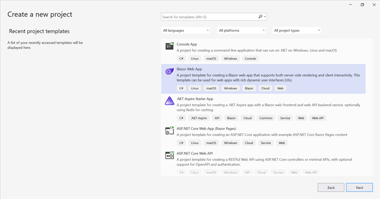
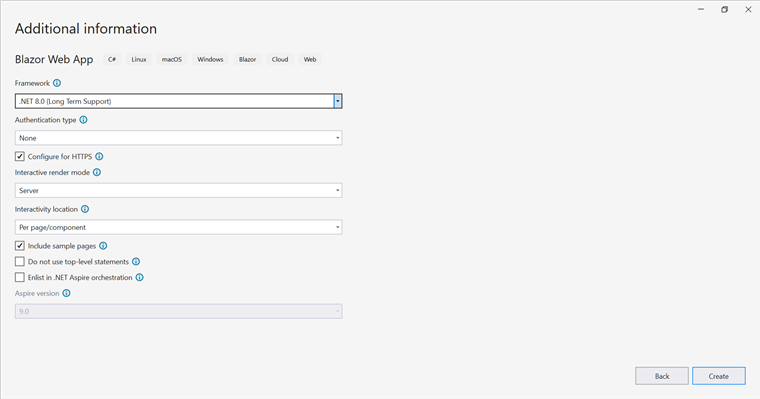

# Open and Save Word Document in Blazor

Syncfusion&reg; DocIO is a [.NET Core Word library](https://www.syncfusion.com/document-processing/word-framework/net-core/word-library) used to create, read, and edit **Word** documents programmatically without **Microsoft Word** or interop dependencies. Using this library, a **open and save a Word document in Blazor**.

## Blazor Web App Server Application

**Prerequisites:**

*   Visual Studio 2022.
*   Install [.NET 8 SDK](https://dotnet.microsoft.com/en-us/download/dotnet/8.0) or later.

Step 1: Create a new C# Blazor Web app project.
*   Select "Blazor Web App" from the template and click **Next**.

*   Name the project and click **Next**.

*   Select the framework and click **Create** button.

Step 2: Install the `Syncfusion.DocIO.Net.Core` NuGet package.
To **open and save a Word document in a Blazor Web App Server**, install [Syncfusion.DocIO.Net.Core](https://www.nuget.org/packages/Syncfusion.DocIO.Net.Core) into the Blazor project.

N> Starting with v16.2.0.x, if Syncfusion&reg; assemblies are referenced from trial setup or from the NuGet feed, the "Syncfusion.Licensing" assembly reference must also be added and a license key included in projects. Refer to this [link](https://help.syncfusion.com/common/essential-studio/licensing/overview) to know about registering Syncfusion&reg; license key in an application to use Syncfusion components.

Step 3: Create a Razor file named `DocIO.razor` in the `Pages` folder, which is located inside the `Components` folder.

Include the following namespaces in the file:		  



@rendermode InteractiveServer
@page "/DocIO"
@using System.IO;
@using Open_and_save_Word_document;
@inject Open_and_save_Word_document.Data.WordService service
@inject Microsoft.JSInterop.IJSRuntime JS



Step 4: Add a button to `DocIO.razor`.

Include the following code to create a new button that triggers document processing:



<h2>Syncfusion DocIO Library (DocIO)</h2>

The Syncfusion DocIO library (DocIO) is a Blazor DocIO library used to create, read, edit, and convert Word files in applications without Microsoft Office dependencies.

<button class="btn btn-primary" @onclick="@OpenAndSaveDocument">Open and save Document</button>



Step 5: Implement `OpenAndSaveDocument` method in `DocIO.razor`.

Add the following code snippet to open and save the Word document and download it.



@code {
    MemoryStream documentStream;
    /// 

    /// Open and save the Word document and download it.
    /// 

    protected async void OpenAndSaveDocument()
    {
        documentStream = service.OpenAndSaveDocument();
        await JS.SaveAs("Sample.docx", documentStream.ToArray());
    }
}



Step 6: Create new cs file `WordService.cs` in the `Data` folder.

Include the following namespaces in the file:




using Syncfusion.DocIO;
using Syncfusion.DocIO.DLS;




Step 7: Create a new `MemoryStream` method named `OpenAndSaveDocument` in the `WordService` class, and include the following code snippet to **open an existing Word document in Blazor** Web App Server.





public MemoryStream OpenAndSaveDocument()
{
    using (FileStream sourceStreamPath = new FileStream("Input.docx", FileMode.Open, FileAccess.Read, FileShare.ReadWrite))
    {
        // Open an existing Word document.
        using (WordDocument document = new WordDocument(sourceStreamPath, FormatType.Docx))
    }
}




Step 8: Add below code example to add a paragraph in the Word document.




// Access the section in a Word document.
IWSection section = document.Sections[0];
// Add a new paragraph to the section.
IWParagraph paragraph = section.AddParagraph();
paragraph.ParagraphFormat.FirstLineIndent = 36;
paragraph.BreakCharacterFormat.FontSize = 12f;
IWTextRange text = paragraph.AppendText("In 2000, Adventure Works Cycles bought a small manufacturing plant, Importadores Neptuno, located in Mexico. Importadores Neptuno manufactures several critical subcomponents for the Adventure Works Cycles product line. These subcomponents are shipped to the Bothell location for final product assembly. In 2001, Importadores Neptuno, became the sole manufacturer and distributor of the touring bicycle product group.");
text.CharacterFormat.FontSize = 12f;




Step 9: Add below code example to **save the Word document in Blazor**.




// Save the Word document to MemoryStream.
MemoryStream stream = new MemoryStream();
document.Save(stream, FormatType.Docx);
stream.Position = 0;
return stream;




Step 10: Create `FileUtils.cs` for JavaScript interoperability.

Create a new class file named `FileUtils` in the project and add the following code to invoke the JavaScript action for file download in the browser.





public static class FileUtils
{
    public static ValueTask<object> SaveAs(this IJSRuntime js, string filename, byte[] data)
       => js.InvokeAsync<object>(
            "saveAsFile",
            filename,
            Convert.ToBase64String(data));
}




Step 11: Add JavaScript function to `App.razor`.

Add the following JavaScript function in the `App.razor` file located in the `Pages` folder.









Step 12: Add navigation link.

Add the following code snippet to the Navigation menu's Razor file in the `Layout` folder.





     <NavLink class="nav-link" href="docio">
         Create Word
     </NavLink>
 





Step 13: Add the service in `Program.cs`.

Add the following line to the `Program.cs` file to register `WordService` as a scoped service in the Blazor application. 




builder.Services.AddScoped<Open_and_save_Word_document.Data.WordService>();




Step 14: Build the project.

Click on **Build** → **Build Solution** or press <kbd>Ctrl</kbd>+<kbd>Shift</kbd>+<kbd>B</kbd> to build the project.

Step 15: Run the project.

Click the Start button (green arrow) or press <kbd>F5</kbd> to run the application.

A complete working sample is available on [GitHub](https://github.com/SyncfusionExamples/DocIO-Examples/tree/main/Read-and-Save-document/Open-and-save-Word-document/Blazor/Blazor-Web-app).

Upon executing the program, the **Word document** will be generated as follows:

Click [here](https://www.syncfusion.com/document-processing/word-framework/blazor) to explore the rich set of Syncfusion&reg; Word library (DocIO) features.

## WASM Standalone Application

**Prerequisites:**

*   Visual Studio 2022.
*   Install [.NET 8 SDK](https://dotnet.microsoft.com/en-us/download/dotnet/8.0) or later.
																			
Step 1: Create a new C# Blazor WASM Standalone app project.

Select "Blazor WebAssembly Standalone App" from the template and click **Next**.

Step 2: Install the `Syncfusion.DocIO.Net.Core` NuGet package.

To **open and save a Word document in Blazor WASM Standalone app**, install [Syncfusion.DocIO.Net.Core](https://www.nuget.org/packages/Syncfusion.DocIO.Net.Core) into the Blazor project.

N> Starting with v16.2.0.x, if Syncfusion&reg; assemblies are referenced from trial setup or from the NuGet feed, the "Syncfusion.Licensing" assembly reference must also be added and a license key included in projects. Refer to this [link](https://help.syncfusion.com/common/essential-studio/licensing/overview) to know about registering Syncfusion&reg; license key in an application to use Syncfusion components.

Step 3: Create a Razor file named `DocIO.razor` in the `Pages` folder.

Add the following namespaces:




@page "/DocIO"
@inject Microsoft.JSInterop.IJSRuntime JS
@inject HttpClient client
@using Syncfusion.DocIO
@using Syncfusion.DocIO.DLS
@using System.IO




Step 4: Add a button to `DocIO.razor`.

Add the following code to create a new button that triggers document processing:





<h2>Syncfusion DocIO Library (DocIO)</h2>

The Syncfusion Blazor DocIO library (DocIO) used to create, read, edit, and convert DocIO files in applications without Microsoft Office dependencies.

<button class="btn btn-primary" @onclick="@OpenAndSaveDocument">Open and save Document</button>





Step 5: Implement `OpenAndSaveDocument` method in `DocIO.razor`.

Create a new `async` method named `OpenAndSaveDocument` and include the following code snippet to **open an existing Word document in Blazor** WASM Standalone app.





@functions {
    async void OpenAndSaveDocument()
    {
        using (Stream inputStream = await client.GetStreamAsync("Input.docx"))
        {
            // Open an existing Word document.
            using (WordDocument document = new WordDocument(inputStream, FormatType.Docx))
        }
    }




Step 6: Add below code example to add a paragraph in the Word document.




// Access the section in a Word document.
IWSection section = document.Sections[0];
// Add a new paragraph to the section.
IWParagraph paragraph = section.AddParagraph();
paragraph.ParagraphFormat.FirstLineIndent = 36;
paragraph.BreakCharacterFormat.FontSize = 12f;
IWTextRange text = paragraph.AppendText("In 2000, Adventure Works Cycles bought a small manufacturing plant, Importadores Neptuno, located in Mexico. Importadores Neptuno manufactures several critical subcomponents for the Adventure Works Cycles product line. These subcomponents are shipped to the Bothell location for final product assembly. In 2001, Importadores Neptuno, became the sole manufacturer and distributor of the touring bicycle product group.");
text.CharacterFormat.FontSize = 12f;




Step 7: Add below code example to **save the Word document in Blazor**.




// Save the Word document to MemoryStream.
using (MemoryStream stream = new MemoryStream())
{
    document.Save(stream, FormatType.Docx);
    stream.Position = 0;
    //Download the Word document in the browser.
    await JS.SaveAs("Sample.docx", stream.ToArray());
}




Step 8: Create `FileUtils.cs` for JavaScript interoperability.

Create a new class file named `FileUtils` in the project and add the following code to invoke the JavaScript action for file download in the browser.





public static class FileUtils
{
    public static ValueTask<object> SaveAs(this IJSRuntime js, string filename, byte[] data)
       => js.InvokeAsync<object>(
            "saveAsFile",
            filename,
            Convert.ToBase64String(data));
}




Step 9: Add JavaScript function to `index.html`.

Add the following JavaScript function in the `index.html` file present under `wwwroot`.









Step 10: Add navigation link.

Add the following code snippet to the Navigation menu's Razor file in the `Layout` folder.





    <NavLink class="nav-link" href="docio">
         Create Word
    </NavLink>





Step 11: Build the project.

Click on **Build** → **Build Solution** or press <kbd>Ctrl</kbd>+<kbd>Shift</kbd>+<kbd>B</kbd> to build the project.

Step 12: Run the project.

Click the Start button (green arrow) or press <kbd>F5</kbd> to run the application.

A complete working sample is available on [GitHub](https://github.com/SyncfusionExamples/DocIO-Examples/tree/main/Read-and-Save-document/Open-and-save-Word-document/Blazor/Blazor-WASM-Standalone-app).

Upon executing the program, the **Word document** will be generated as follows:

N> While the Word library functions in WASM Standalone, server-side deployment is recommended. WASM Standalone deployment increases the application payload size.

Click [here](https://www.syncfusion.com/document-processing/word-framework/blazor) to explore the rich set of Syncfusion&reg; Word library (DocIO) features.

Kindly explore the [supported and unsupported features of Word library in Blazor](https://help.syncfusion.com/document-processing/word/word-library/net/supported-and-unsupported-features#blazor-supported-features)

