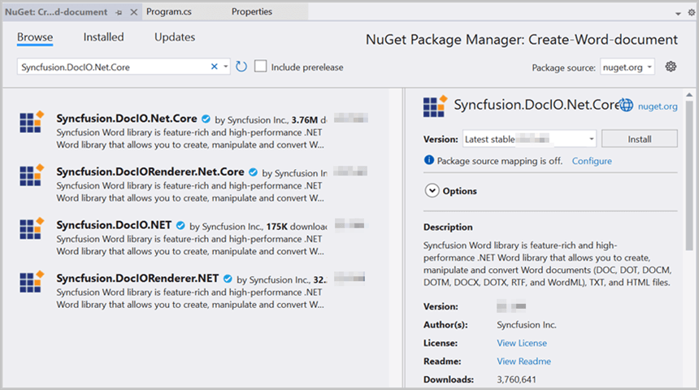

# Open and save Word document in Console application

Syncfusion&reg; DocIO is a [.NET Word library](https://www.syncfusion.com/document-processing/word-framework/net/word-library) used to create, read, and edit **Word documents** programmatically without **Microsoft Word** or interop dependencies. Using this library, you can **open and save Word document in Console application**.

## Open and save Word document using .NET Core and Latest

The below steps illustrates open and save **Word document** in console application using **.NET Core**.

Step 1: Create a new **.NET Core console application** project.

Step 2: Install the [Syncfusion.DocIO.Net.Core](https://www.nuget.org/packages/Syncfusion.DocIO.Net.Core) NuGet package as a reference to your project from [NuGet.org](https://www.nuget.org/).

N> Starting with v16.2.0.x, if you reference Syncfusion&reg; assemblies from trial setup or from the NuGet feed, you also have to add "Syncfusion.Licensing" assembly reference and include a license key in your projects. Please refer to this [link](https://help.syncfusion.com/common/essential-studio/licensing/overview) to know about registering Syncfusion&reg; license key in your application to use our components.

Step 3: Include the following namespaces in **Program.cs** file.




using Syncfusion.DocIO; 
using Syncfusion.DocIO.DLS; 




Step 4: Add the following code snippet in Program.cs file to **open an existing Word document in console application**.




//Open an existing Word document.
using (WordDocument document = new WordDocument(new FileStream("Input.docx", FileMode.Open, FileAccess.Read)));




Step 5: Add below code example to **add a paragraph** in the Word document.




//Access the section in a Word document.
IWSection section = document.Sections[0];
//Add a new paragraph to the section.
IWParagraph paragraph = section.AddParagraph();
paragraph.ParagraphFormat.FirstLineIndent = 36;
paragraph.BreakCharacterFormat.FontSize = 12f;
IWTextRange text = paragraph.AppendText("In 2000, Adventure Works Cycles bought a small manufacturing plant, Importadores Neptuno, located in Mexico. Importadores Neptuno manufactures several critical subcomponents for the Adventure Works Cycles product line. These subcomponents are shipped to the Bothell location for final product assembly. In 2001, Importadores Neptuno, became the sole manufacturer and distributor of the touring bicycle product group.");
text.CharacterFormat.FontSize = 12f;




Step 6: Add below code example to **save the Word document in .NET Core console application**.




//Create a FileStream to save the Word file.
using (FileStream outputStream = new FileStream("Result.docx", FileMode.Create, FileAccess.ReadWrite, FileShare.ReadWrite))
{
    //Save the Word file.
    document.Save(outputStream, FormatType.Docx);
}




You can download a complete working sample from [GitHub](https://github.com/SyncfusionExamples/DocIO-Examples/tree/main/Read-and-Save-document/Open-and-save-Word-document/.NET-Standard).

By executing the program, you will get the **Word document** as follows.

## Open and save Word document in .NET Framework

The below steps illustrates open and save **Word document** in console application using **.NET Framework**.

Step 1: Create a new **.NET FrameWork console application** project.

Step 2: Install [Syncfusion.DocIO.WinForms](https://www.nuget.org/packages/Syncfusion.DocIO.WinForms/) NuGet package as a reference to your Windows Forms application from the [NuGet.org](https://www.nuget.org/).

N> 1. The [Syncfusion.DocIO.WinForms](https://www.nuget.org/packages/Syncfusion.DocIO.WinForms/) is a dependency for Syncfusion&reg; Windows Forms GUI controls and is named with the suffix "WinForms". It contains platform-independent .NET Framework assemblies (compatible with versions 4.0, 4.5, 4.5.1, and 4.6) for the Word library and does not include any Windows Forms-related references or code. Therefore, we recommend using this package for .NET Framework Console applications.
N> 2. Starting with v16.2.0.x, if you reference Syncfusion&reg; assemblies from trial setup or from the NuGet feed, you also have to add "Syncfusion.Licensing" assembly reference and include a license key in your projects. Please refer to this [link](https://help.syncfusion.com/common/essential-studio/licensing/overview) to know about registering Syncfusion&reg; license key in your application to use our components.

Step 3: Include the following namespaces in **Program.cs** file.




using Syncfusion.DocIO;
using Syncfusion.DocIO.DLS;




Step 4: Add the following code snippet in **Program.cs** file to **open an existing Word document in .NET FrameWork console application**.




//Open an existing Word document.
using (WordDocument document = new WordDocument("Input.docx", FormatType.Docx));




Step 5: Add below code example to **add a paragraph** in the Word document.




//Access the section in a Word document.
IWSection section = document.Sections[0];
//Add a new paragraph to the section.
IWParagraph paragraph = section.AddParagraph();
paragraph.ParagraphFormat.FirstLineIndent = 36;
paragraph.BreakCharacterFormat.FontSize = 12f;
IWTextRange text = paragraph.AppendText("In 2000, Adventure Works Cycles bought a small manufacturing plant, Importadores Neptuno, located in Mexico. Importadores Neptuno manufactures several critical subcomponents for the Adventure Works Cycles product line. These subcomponents are shipped to the Bothell location for final product assembly. In 2001, Importadores Neptuno, became the sole manufacturer and distributor of the touring bicycle product group.");
text.CharacterFormat.FontSize = 12f;




Step 6: Add below code example to **save the Word document in .NET FrameWork console application**.




//Save the Word file.
document.Save("Result.docx");




You can download a complete working sample from [GitHub](https://github.com/SyncfusionExamples/DocIO-Examples/tree/main/Read-and-Save-document/Open-and-save-Word-document/.NET-Framework).

By executing the program, you will get the **Word document** as follows.

