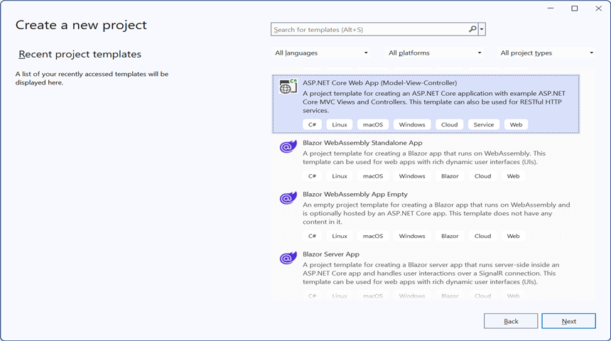
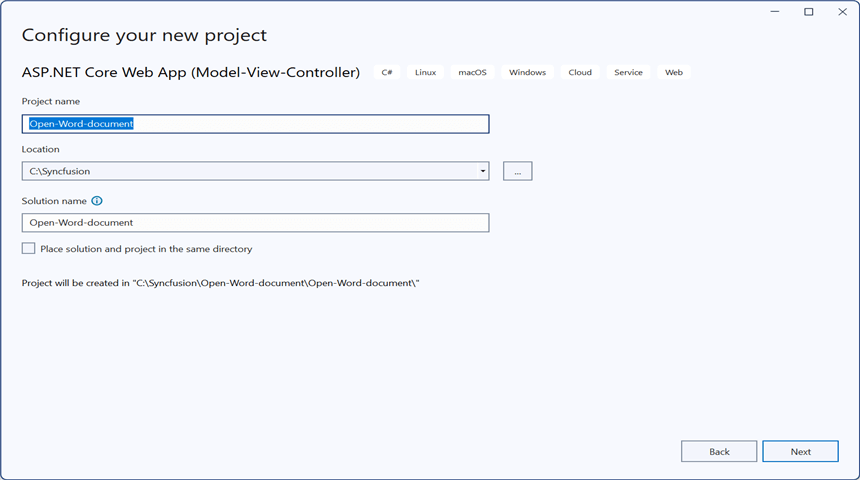
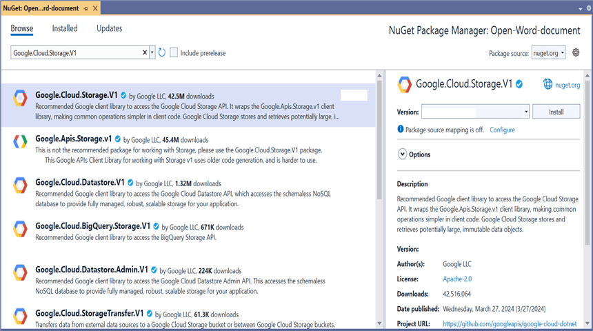
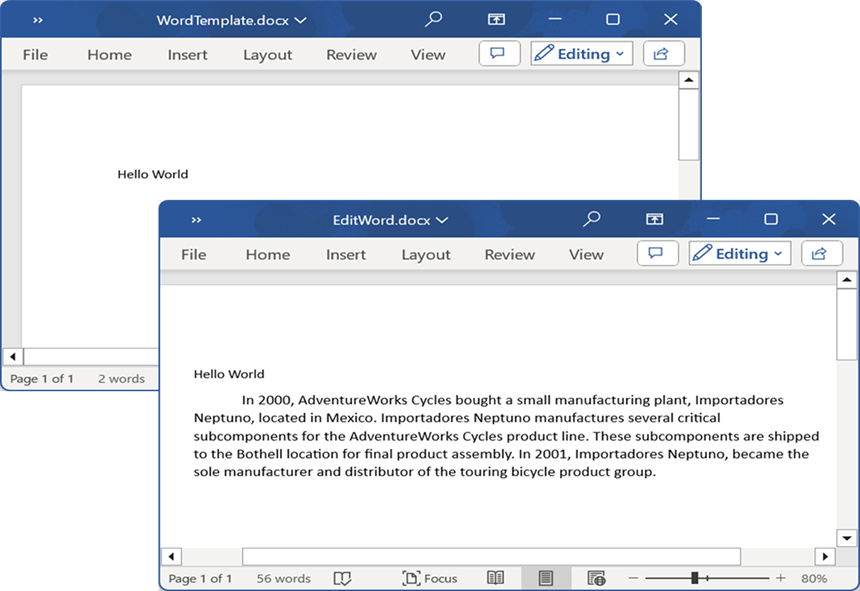
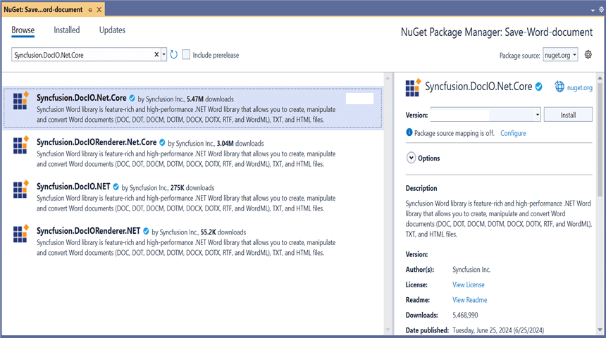
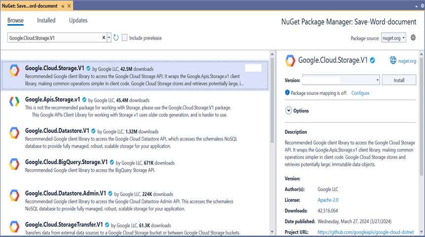
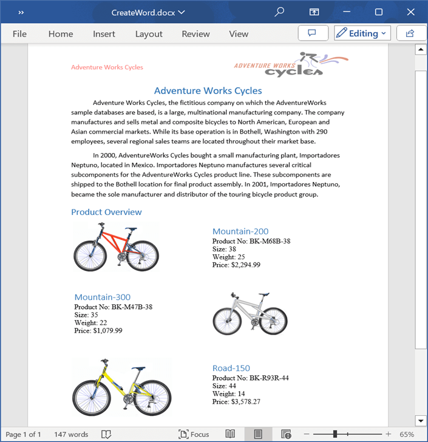

# Open and Save Word document in Google Cloud Storage

## Prerequisites  

* **[Google cloud storage](https://cloud.google.com/storage/docs/creating-buckets)** is required. 

* **[Service account](https://cloud.google.com/iam/docs/service-accounts-create)** is required.

* **[Service account key](https://cloud.google.com/iam/docs/keys-create-delete#creating)** is required.

## Open Word document from Google Cloud Storage

Steps to open a Word document from Google Cloud Storage.

Step 1: Create a new ASP.NET Core Web Application (Model-View-Controller).

Step 2: Name the project.

Step 3: Install the following **Nuget packages** in your application from [NuGet.org](https://www.nuget.org/).

* [Syncfusion.DocIO.Net.Core](https://www.nuget.org/packages/Syncfusion.DocIO.Net.Core)
* [Google.Cloud.Storage.V1](https://www.nuget.org/packages/Google.Cloud.Storage.V1)

Step 4: Add a new button in the **Index.cshtml** as shown below.

  

@{Html.BeginForm("EditDocument", "Home", FormMethod.Get);
    {
        

            <input type="submit" value="Edit Document" style="width:150px;height:27px" />
        

    }
    Html.EndForm();
}



Step 5: Include the following namespaces in **HomeController.cs**.



using Google.Apis.Auth.OAuth2;
using Google.Cloud.Storage.V1;
using Syncfusion.DocIO.DLS;



Step 6: Include the below code snippet in **HomeController.cs** to **open a Word document from Google Cloud Storage**.



public async Task<IActionResult> EditDocument()
{
    //Download the file from Google
    MemoryStream memoryStream = await GetDocumentFromGoogle();

    //Create an instance of WordDocument
    using (WordDocument wordDocument = new WordDocument(memoryStream, Syncfusion.DocIO.FormatType.Docx))
    {
        //Access the section in a Word document
        IWSection section = wordDocument.Sections[0];

        //Add new paragraph to the section
        IWParagraph paragraph = section.AddParagraph();
        paragraph.ParagraphFormat.FirstLineIndent = 36;
        paragraph.BreakCharacterFormat.FontSize = 12f;

        //Add new text to the paragraph
        IWTextRange textRange = paragraph.AppendText("In 2000, AdventureWorks Cycles bought a small manufacturing plant, Importadores Neptuno, located in Mexico. Importadores Neptuno manufactures several critical subcomponents for the AdventureWorks Cycles product line. These subcomponents are shipped to the Bothell location for final product assembly. In 2001, Importadores Neptuno, became the sole manufacturer and distributor of the touring bicycle product group.") as IWTextRange;
        textRange.CharacterFormat.FontSize = 12f;

        //Saving the Word document to a MemoryStream
        MemoryStream outputStream = new MemoryStream();
        wordDocument.Save(outputStream, Syncfusion.DocIO.FormatType.Docx);

        //Download the Word file in the browser
        FileStreamResult fileStreamResult = new FileStreamResult(outputStream, "application/msword");
        fileStreamResult.FileDownloadName = "EditWord.docx";
        return fileStreamResult;
    }
}



### Download file from Google cloud storage

This is the helper method to download Word document from Google cloud storage.



/// 

/// Download file from Google
/// 

/// <returns></returns>
public async Task<MemoryStream> GetDocumentFromGoogle()
{
    try
    {
        //Your bucket name
        string bucketName = "Your_bucket_name";

        //Your service account key file path
        string keyPath = "credentials.json";

        //Name of the file to download from the Google Cloud Storage
        string fileName = "WordTemplate.docx";

        //Create Google Credential from the service account key file
        GoogleCredential credential = GoogleCredential.FromFile(keyPath);

        //Instantiates a storage client to interact with Google Cloud Storage
        StorageClient storageClient = StorageClient.Create(credential);

        //Download a file from Google Cloud Storage
        MemoryStream memoryStream = new MemoryStream();
        await storageClient.DownloadObjectAsync(bucketName, fileName, memoryStream);
        memoryStream.Position = 0;

        return memoryStream;
    }
    catch (Exception ex)
    {
        Console.WriteLine($"Error retrieving document from Google Cloud Storage: {ex.Message}");
        throw; // or handle the exception as needed
    }
}



You can download a complete working sample from [GitHub](https://github.com/SyncfusionExamples/DocIO-Examples/tree/main/Read-and-Save-document/Open-and-save-Word-document/Google-Cloud-Storage/Open-Word-document).

By executing the program, you will get the **Word document** as follows.

## Save Word document to Google Cloud Storage

Steps to save a Word document to Google Cloud Storage.

Step 1: Create a new ASP.NET Core Web Application (Model-View-Controller).

Step 2: Name the project.

Step 3: Install the following **Nuget packages** in your application from [NuGet.org](https://www.nuget.org/).

* [Syncfusion.DocIO.Net.Core](https://www.nuget.org/packages/Syncfusion.DocIO.Net.Core)
* [Google.Cloud.Storage.V1](https://www.nuget.org/packages/Google.Cloud.Storage.V1)

Step 4: Add a new button in the **Index.cshtml** as shown below.

  

@{Html.BeginForm("UploadDocument", "Home", FormMethod.Get);
    {
        

            <input type="submit" value="Upload Document" style="width:150px;height:27px" />
        

    }
    Html.EndForm();
}



Step 5: Include the following namespaces in **HomeController.cs**.



using Google.Apis.Auth.OAuth2;
using Google.Cloud.Storage.V1;
using Syncfusion.DocIO;
using Syncfusion.DocIO.DLS;



Step 6: Include the below code snippet in **HomeController.cs** to **save a Word document to Google Cloud Storage**.



public async Task<IActionResult> UploadDocument()
{
    //Creating a new document
    WordDocument document = new WordDocument();

    //Adding a new section to the document
    WSection section = document.AddSection() as WSection;

    //Set Margin of the section
    section.PageSetup.Margins.All = 72;

    //Set page size of the section
    section.PageSetup.PageSize = new Syncfusion.Drawing.SizeF(612, 792);

    //Create Paragraph styles
    WParagraphStyle style = document.AddParagraphStyle("Normal") as WParagraphStyle;
    style.CharacterFormat.FontName = "Calibri";
    style.CharacterFormat.FontSize = 11f;
    style.ParagraphFormat.BeforeSpacing = 0;
    style.ParagraphFormat.AfterSpacing = 8;
    style.ParagraphFormat.LineSpacing = 13.8f;

    style = document.AddParagraphStyle("Heading 1") as WParagraphStyle;
    style.ApplyBaseStyle("Normal");
    style.CharacterFormat.FontName = "Calibri Light";
    style.CharacterFormat.FontSize = 16f;
    style.CharacterFormat.TextColor = Syncfusion.Drawing.Color.FromArgb(46, 116, 181);
    style.ParagraphFormat.BeforeSpacing = 12;
    style.ParagraphFormat.AfterSpacing = 0;
    style.ParagraphFormat.Keep = true;
    style.ParagraphFormat.KeepFollow = true;
    style.ParagraphFormat.OutlineLevel = OutlineLevel.Level1;

    IWParagraph paragraph = section.HeadersFooters.Header.AddParagraph();

    //Gets the image stream
    FileStream imageStream = new FileStream("AdventureCycle.jpg", FileMode.Open, FileAccess.Read);
    IWPicture picture = paragraph.AppendPicture(imageStream);
    picture.TextWrappingStyle = TextWrappingStyle.InFrontOfText;
    picture.VerticalOrigin = VerticalOrigin.Margin;
    picture.VerticalPosition = -45;
    picture.HorizontalOrigin = HorizontalOrigin.Column;
    picture.HorizontalPosition = 263.5f;
    picture.WidthScale = 20;
    picture.HeightScale = 15;

    paragraph.ApplyStyle("Normal");
    paragraph.ParagraphFormat.HorizontalAlignment = HorizontalAlignment.Left;
    WTextRange textRange = paragraph.AppendText("Adventure Works Cycles") as WTextRange;
    textRange.CharacterFormat.FontSize = 12f;
    textRange.CharacterFormat.FontName = "Calibri";
    textRange.CharacterFormat.TextColor = Syncfusion.Drawing.Color.Red;

    //Appends paragraph
    paragraph = section.AddParagraph();
    paragraph.ApplyStyle("Heading 1");
    paragraph.ParagraphFormat.HorizontalAlignment = HorizontalAlignment.Center;
    textRange = paragraph.AppendText("Adventure Works Cycles") as WTextRange;
    textRange.CharacterFormat.FontSize = 18f;
    textRange.CharacterFormat.FontName = "Calibri";

    //Appends paragraph
    paragraph = section.AddParagraph();
    paragraph.ParagraphFormat.FirstLineIndent = 36;
    paragraph.BreakCharacterFormat.FontSize = 12f;
    textRange = paragraph.AppendText("Adventure Works Cycles, the fictitious company on which the AdventureWorks sample databases are based, is a large, multinational manufacturing company. The company manufactures and sells metal and composite bicycles to North American, European and Asian commercial markets. While its base operation is in Bothell, Washington with 290 employees, several regional sales teams are located throughout their market base.") as WTextRange;
    textRange.CharacterFormat.FontSize = 12f;

    //Appends paragraph
    paragraph = section.AddParagraph();
    paragraph.ParagraphFormat.FirstLineIndent = 36;
    paragraph.BreakCharacterFormat.FontSize = 12f;
    textRange = paragraph.AppendText("In 2000, AdventureWorks Cycles bought a small manufacturing plant, Importadores Neptuno, located in Mexico. Importadores Neptuno manufactures several critical subcomponents for the AdventureWorks Cycles product line. These subcomponents are shipped to the Bothell location for final product assembly. In 2001, Importadores Neptuno, became the sole manufacturer and distributor of the touring bicycle product group.") as WTextRange;
    textRange.CharacterFormat.FontSize = 12f;

    paragraph = section.AddParagraph();
    paragraph.ApplyStyle("Heading 1");
    paragraph.ParagraphFormat.HorizontalAlignment = HorizontalAlignment.Left;
    textRange = paragraph.AppendText("Product Overview") as WTextRange;
    textRange.CharacterFormat.FontSize = 16f;
    textRange.CharacterFormat.FontName = "Calibri";

    //Appends table
    IWTable table = section.AddTable();
    table.ResetCells(3, 2);
    table.TableFormat.Borders.BorderType = BorderStyle.None;
    table.TableFormat.IsAutoResized = true;

    //Appends paragraph
    paragraph = table[0, 0].AddParagraph();
    paragraph.ParagraphFormat.AfterSpacing = 0;
    paragraph.BreakCharacterFormat.FontSize = 12f;

    //Appends picture to the paragraph
    FileStream image1 = new FileStream("Mountain-200.jpg", FileMode.Open, FileAccess.Read);
    picture = paragraph.AppendPicture(image1);
    picture.TextWrappingStyle = TextWrappingStyle.TopAndBottom;
    picture.VerticalOrigin = VerticalOrigin.Paragraph;
    picture.VerticalPosition = 4.5f;
    picture.HorizontalOrigin = HorizontalOrigin.Column;
    picture.HorizontalPosition = -2.15f;
    picture.WidthScale = 79;
    picture.HeightScale = 79;

    //Appends paragraph
    paragraph = table[0, 1].AddParagraph();
    paragraph.ApplyStyle("Heading 1");
    paragraph.ParagraphFormat.AfterSpacing = 0;
    paragraph.ParagraphFormat.LineSpacing = 12f;
    paragraph.AppendText("Mountain-200");

    //Appends paragraph
    paragraph = table[0, 1].AddParagraph();
    paragraph.ParagraphFormat.AfterSpacing = 0;
    paragraph.ParagraphFormat.LineSpacing = 12f;
    paragraph.BreakCharacterFormat.FontSize = 12f;
    paragraph.BreakCharacterFormat.FontName = "Times New Roman";
    textRange = paragraph.AppendText("Product No: BK-M68B-38\r") as WTextRange;
    textRange.CharacterFormat.FontSize = 12f;
    textRange.CharacterFormat.FontName = "Times New Roman";
    textRange = paragraph.AppendText("Size: 38\r") as WTextRange;
    textRange.CharacterFormat.FontSize = 12f;
    textRange.CharacterFormat.FontName = "Times New Roman";
    textRange = paragraph.AppendText("Weight: 25\r") as WTextRange;
    textRange.CharacterFormat.FontSize = 12f;
    textRange.CharacterFormat.FontName = "Times New Roman";
    textRange = paragraph.AppendText("Price: $2,294.99\r") as WTextRange;
    textRange.CharacterFormat.FontSize = 12f;
    textRange.CharacterFormat.FontName = "Times New Roman";

    //Appends paragraph
    paragraph = table[0, 1].AddParagraph();
    paragraph.ParagraphFormat.AfterSpacing = 0;
    paragraph.ParagraphFormat.LineSpacing = 12f;
    paragraph.BreakCharacterFormat.FontSize = 12f;

    //Appends paragraph
    paragraph = table[1, 0].AddParagraph();
    paragraph.ApplyStyle("Heading 1");
    paragraph.ParagraphFormat.AfterSpacing = 0;
    paragraph.ParagraphFormat.LineSpacing = 12f;
    paragraph.AppendText("Mountain-300 ");

    //Appends paragraph
    paragraph = table[1, 0].AddParagraph();
    paragraph.ParagraphFormat.AfterSpacing = 0;
    paragraph.ParagraphFormat.LineSpacing = 12f;
    paragraph.BreakCharacterFormat.FontSize = 12f;
    paragraph.BreakCharacterFormat.FontName = "Times New Roman";
    textRange = paragraph.AppendText("Product No: BK-M47B-38\r") as WTextRange;
    textRange.CharacterFormat.FontSize = 12f;
    textRange.CharacterFormat.FontName = "Times New Roman";
    textRange = paragraph.AppendText("Size: 35\r") as WTextRange;
    textRange.CharacterFormat.FontSize = 12f;
    textRange.CharacterFormat.FontName = "Times New Roman";
    textRange = paragraph.AppendText("Weight: 22\r") as WTextRange;
    textRange.CharacterFormat.FontSize = 12f;
    textRange.CharacterFormat.FontName = "Times New Roman";
    textRange = paragraph.AppendText("Price: $1,079.99\r") as WTextRange;
    textRange.CharacterFormat.FontSize = 12f;
    textRange.CharacterFormat.FontName = "Times New Roman";

    //Appends paragraph
    paragraph = table[1, 0].AddParagraph();
    paragraph.ParagraphFormat.AfterSpacing = 0;
    paragraph.ParagraphFormat.LineSpacing = 12f;
    paragraph.BreakCharacterFormat.FontSize = 12f;

    //Appends paragraph
    paragraph = table[1, 1].AddParagraph();
    paragraph.ApplyStyle("Heading 1");
    paragraph.ParagraphFormat.LineSpacing = 12f;

    //Appends picture to the paragraph
    FileStream image2 = new FileStream("Mountain-300.jpg", FileMode.Open, FileAccess.Read);
    picture = paragraph.AppendPicture(image2);
    picture.TextWrappingStyle = TextWrappingStyle.TopAndBottom;
    picture.VerticalOrigin = VerticalOrigin.Paragraph;
    picture.VerticalPosition = 8.2f;
    picture.HorizontalOrigin = HorizontalOrigin.Column;
    picture.HorizontalPosition = -14.95f;
    picture.WidthScale = 75;
    picture.HeightScale = 75;

    //Appends paragraph
    paragraph = table[2, 0].AddParagraph();
    paragraph.ApplyStyle("Heading 1");
    paragraph.ParagraphFormat.LineSpacing = 12f;

    //Appends picture to the paragraph
    FileStream image3 = new FileStream("Road-550-W.jpg", FileMode.Open, FileAccess.Read);
    picture = paragraph.AppendPicture(image3);
    picture.TextWrappingStyle = TextWrappingStyle.TopAndBottom;
    picture.VerticalOrigin = VerticalOrigin.Paragraph;
    picture.VerticalPosition = 3.75f;
    picture.HorizontalOrigin = HorizontalOrigin.Column;
    picture.HorizontalPosition = -5f;
    picture.WidthScale = 92;
    picture.HeightScale = 92;

    //Appends paragraph
    paragraph = table[2, 1].AddParagraph();
    paragraph.ApplyStyle("Heading 1");
    paragraph.ParagraphFormat.AfterSpacing = 0;
    paragraph.ParagraphFormat.LineSpacing = 12f;
    paragraph.AppendText("Road-150 ");

    //Appends paragraph
    paragraph = table[2, 1].AddParagraph();
    paragraph.ParagraphFormat.AfterSpacing = 0;
    paragraph.ParagraphFormat.LineSpacing = 12f;
    paragraph.BreakCharacterFormat.FontSize = 12f;
    paragraph.BreakCharacterFormat.FontName = "Times New Roman";
    textRange = paragraph.AppendText("Product No: BK-R93R-44\r") as WTextRange;
    textRange.CharacterFormat.FontSize = 12f;
    textRange.CharacterFormat.FontName = "Times New Roman";
    textRange = paragraph.AppendText("Size: 44\r") as WTextRange;
    textRange.CharacterFormat.FontSize = 12f;
    textRange.CharacterFormat.FontName = "Times New Roman";
    textRange = paragraph.AppendText("Weight: 14\r") as WTextRange;
    textRange.CharacterFormat.FontSize = 12f;
    textRange.CharacterFormat.FontName = "Times New Roman";
    textRange = paragraph.AppendText("Price: $3,578.27\r") as WTextRange;
    textRange.CharacterFormat.FontSize = 12f;
    textRange.CharacterFormat.FontName = "Times New Roman";

    //Appends paragraph
    section.AddParagraph();

    //Saves the Word document to MemoryStream
    MemoryStream stream = new MemoryStream();
    document.Save(stream, FormatType.Docx);

    //Upload the document to Google
    await UploadDocumentToGoogle(stream);

    return Ok("Word document uploaded to Google Cloud Storage.");
}



### Upload file to Google cloud storage

This is the helper method to upload Word document to Google cloud storage.



/// 

/// Upload file to Google
/// 

/// <param name="stream"></param>
/// <returns></returns>
public async Task<MemoryStream> UploadDocumentToGoogle(MemoryStream stream)
{
    try
    {
        //Your bucket name
        string bucketName = "Your_bucket_name";

        //Your service account key file path
        string keyPath = "credentials.json";

        //Name of the file to upload to Google Cloud Storage
        string fileName = "CreateWord.docx";

        //Create Google Credential from the service account key file
        GoogleCredential credential = GoogleCredential.FromFile(keyPath);

        //Instantiates a storage client to interact with Google Cloud Storage
        StorageClient storageClient = StorageClient.Create(credential);

        //Uploads a file to Google Cloud Storage
        storageClient.UploadObject(bucketName, fileName, null, stream);

        Console.WriteLine("Upload completed successfully");
    }
    catch (Exception e)
    {
        Console.WriteLine("Unknown encountered on server. Message:'{0}' when writing an object", e.Message);
    }
    return stream;
}



You can download a complete working sample from [GitHub](https://github.com/SyncfusionExamples/DocIO-Examples/tree/main/Read-and-Save-document/Open-and-save-Word-document/Google-Cloud-Storage/Save-Word-document).

By executing the program, you will get the **Word document** as follows.

