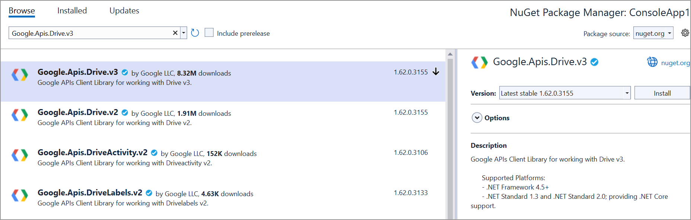

# Open and Save Word document in Google Drive Cloud Storage

## Prerequisites  

* **[Google Drive Cloud Storage](https://www.google.com/intl/en_in/drive/)** is required.

## Open Word document from Google Drive

Steps to open a Word document from Google Drive Cloud Storage.

Step 1: Set up **Google Drive API**.

You must set up a project in the Google Developers Console and enable the Google Drive API. Obtain the necessary credentials to access the API. For more information, view the official [link](https://developers.google.com/drive/api/guides/enable-sdk).

Step 2: Create a new **.NET Core console application** project.

Step 3: Install the [Google.Apis.Drive.v3](https://www.nuget.org/packages/Google.Apis.Drive.v3) NuGet package as a reference to your project from the [NuGet.org](https://www.nuget.org/).

Step 4: Include the following namespaces in the **Program.cs** file.





    using Google.Apis.Auth.OAuth2;
    using Google.Apis.Drive.v3;
    using Google.Apis.Services;
    using Google.Apis.Util.Store;





Step 5: Add the below code example to **open a Word document from Google Drive**.





    UserCredential credential;
    string[] Scopes = { DriveService.Scope.DriveReadonly };
    string ApplicationName = "YourAppName";
    // Step 1: Open Google Drive with credentials.
    using (var credentialStream = new FileStream("credentials.json", FileMode.Open, FileAccess.Read))
    {
        string credPath = "token.json";
        credential = GoogleWebAuthorizationBroker.AuthorizeAsync(
        GoogleClientSecrets.Load(credentialStream).Secrets,
        Scopes,
        "user",
        CancellationToken.None,
        new FileDataStore(credPath, true)).Result;
    }

    // Step 2: Create Drive API service.
    var service = new DriveService(new BaseClientService.Initializer()
    {
        HttpClientInitializer = credential,
        ApplicationName = ApplicationName,
    });

    // Step 3: Specify the file ID of the Word document you want to open.
    string fileId = "YOUR_FILE_ID"; // Replace with the actual file ID YOUR_FILE_ID.

    // Step 4: Download the Word document from Google Drive.
    var request = service.Files.Get(fileId);
    var stream = new MemoryStream();
    request.Download(stream);

    // Step 5: Save the Word document locally.
    using (FileStream fileStream = new FileStream("Output.docx", FileMode.Create, FileAccess.Write))
    {
        stream.WriteTo(fileStream);
    }
    //Dispose the stream.
	stream.Dispose();
   




You can download a complete working sample from [GitHub](https://github.com/SyncfusionExamples/DocIO-Examples/tree/main/Read-and-Save-document/Open-and-save-Word-document/Google-Drive/Open-Word-document).

## Save Word document to Google Drive

To save a Word document to Google Drive, you can follow the steps below

Step 1: Set up **Google Drive API**.

You must set up a project in the Google Developers Console and enable the Google Drive API. Obtain the necessary credentials to access the API. For more information, view the official [link](https://developers.google.com/drive/api/guides/enable-sdk).

Step 2: Create a new **.NET Core console application** project.

Step 3: Install the following **Nuget packages** in your application from [NuGet.org](https://www.nuget.org/).

* [Syncfusion.DocIO.Net.Core](https://www.nuget.org/packages/Syncfusion.DocIO.Net.Core)
* [Google.Apis.Drive.v3](https://www.nuget.org/packages/Google.Apis.Drive.v3)

Step 4: Include the following namespaces in the **Program.cs** file.





    using Syncfusion.DocIO.DLS;
    using Syncfusion.DocIO;
    using Google.Apis.Auth.OAuth2;
    using Google.Apis.Drive.v3;
    using Google.Apis.Services;
    using Google.Apis.Util.Store;
    using File = Google.Apis.Drive.v3.Data.File;





Step 5: Add the below code example to create a simple Word document and **save in Google Drive**.





    //Creating a new document.
    WordDocument document = new WordDocument();
    //Adding a new section to the document.
    WSection section = document.AddSection() as WSection;
    //Set Margin of the section.
    section.PageSetup.Margins.All = 72;
    //Set page size of the section.
    section.PageSetup.PageSize = new Syncfusion.Drawing.SizeF(612, 792);

    //Create Paragraph styles.
    WParagraphStyle style = document.AddParagraphStyle("Normal") as WParagraphStyle;
    style.CharacterFormat.FontName = "Calibri";
    style.CharacterFormat.FontSize = 11f;
    style.ParagraphFormat.BeforeSpacing = 0;
    style.ParagraphFormat.AfterSpacing = 8;
    style.ParagraphFormat.LineSpacing = 13.8f;

    style = document.AddParagraphStyle("Heading 1") as WParagraphStyle;
    style.ApplyBaseStyle("Normal");
    style.CharacterFormat.FontName = "Calibri Light";
    style.CharacterFormat.FontSize = 16f;
    style.CharacterFormat.TextColor = Syncfusion.Drawing.Color.FromArgb(46, 116, 181);
    style.ParagraphFormat.BeforeSpacing = 12;
    style.ParagraphFormat.AfterSpacing = 0;
    style.ParagraphFormat.Keep = true;
    style.ParagraphFormat.KeepFollow = true;
    style.ParagraphFormat.OutlineLevel = OutlineLevel.Level1;

    IWParagraph paragraph = section.HeadersFooters.Header.AddParagraph();

    //Gets the image stream.
    FileStream imageStream = new FileStream(Path.GetFullPath("Data/AdventureCycle.jpg"), FileMode.Open, FileAccess.Read);
    IWPicture picture = paragraph.AppendPicture(imageStream);
    picture.TextWrappingStyle = TextWrappingStyle.InFrontOfText;
    picture.VerticalOrigin = VerticalOrigin.Margin;
    picture.VerticalPosition = -45;
    picture.HorizontalOrigin = HorizontalOrigin.Column;
    picture.HorizontalPosition = 263.5f;
    picture.WidthScale = 20;
    picture.HeightScale = 15;

    paragraph.ApplyStyle("Normal");
    paragraph.ParagraphFormat.HorizontalAlignment = HorizontalAlignment.Left;
    WTextRange textRange = paragraph.AppendText("Adventure Works Cycles") as WTextRange;
    textRange.CharacterFormat.FontSize = 12f;
    textRange.CharacterFormat.FontName = "Calibri";
    textRange.CharacterFormat.TextColor = Syncfusion.Drawing.Color.Red;

    //Appends paragraph.
    paragraph = section.AddParagraph();
    paragraph.ApplyStyle("Heading 1");
    paragraph.ParagraphFormat.HorizontalAlignment = HorizontalAlignment.Center;
    textRange = paragraph.AppendText("Adventure Works Cycles") as WTextRange;
    textRange.CharacterFormat.FontSize = 18f;
    textRange.CharacterFormat.FontName = "Calibri";

    //Appends paragraph.
    paragraph = section.AddParagraph();
    paragraph.ParagraphFormat.FirstLineIndent = 36;
    paragraph.BreakCharacterFormat.FontSize = 12f;
    textRange = paragraph.AppendText("Adventure Works Cycles, the fictitious company on which the AdventureWorks sample databases are based, is a large, multinational manufacturing company. The company manufactures and sells metal and composite bicycles to North American, European and Asian commercial markets. While its base operation is in Bothell, Washington with 290 employees, several regional sales teams are located throughout their market base.") as WTextRange;
    textRange.CharacterFormat.FontSize = 12f;

    //Appends paragraph.
    paragraph = section.AddParagraph();
    paragraph.ParagraphFormat.FirstLineIndent = 36;
    paragraph.BreakCharacterFormat.FontSize = 12f;
    textRange = paragraph.AppendText("In 2000, AdventureWorks Cycles bought a small manufacturing plant, Importadores Neptuno, located in Mexico. Importadores Neptuno manufactures several critical subcomponents for the AdventureWorks Cycles product line. These subcomponents are shipped to the Bothell location for final product assembly. In 2001, Importadores Neptuno, became the sole manufacturer and distributor of the touring bicycle product group.") as WTextRange;
    textRange.CharacterFormat.FontSize = 12f;

    paragraph = section.AddParagraph();
    paragraph.ApplyStyle("Heading 1");
    paragraph.ParagraphFormat.HorizontalAlignment = HorizontalAlignment.Left;
    textRange = paragraph.AppendText("Product Overview") as WTextRange;
    textRange.CharacterFormat.FontSize = 16f;
    textRange.CharacterFormat.FontName = "Calibri";

    //Appends table.
    IWTable table = section.AddTable();
    table.ResetCells(3, 2);
    table.TableFormat.Borders.BorderType = BorderStyle.None;
    table.TableFormat.IsAutoResized = true;

    //Appends paragraph.
    paragraph = table[0, 0].AddParagraph();
    paragraph.ParagraphFormat.AfterSpacing = 0;
    paragraph.BreakCharacterFormat.FontSize = 12f;

    //Appends picture to the paragraph.
    FileStream image1 = new FileStream(Path.GetFullPath("Data/Mountain -200.jpg"), FileMode.Open, FileAccess.Read);
    picture = paragraph.AppendPicture(image1);
    picture.TextWrappingStyle = TextWrappingStyle.TopAndBottom;
    picture.VerticalOrigin = VerticalOrigin.Paragraph;
    picture.VerticalPosition = 4.5f;
    picture.HorizontalOrigin = HorizontalOrigin.Column;
    picture.HorizontalPosition = -2.15f;
    picture.WidthScale = 79;
    picture.HeightScale = 79;
    
    //Appends paragraph.
    paragraph = table[0, 1].AddParagraph();
    paragraph.ApplyStyle("Heading 1");
    paragraph.ParagraphFormat.AfterSpacing = 0;
    paragraph.ParagraphFormat.LineSpacing = 12f;
    paragraph.AppendText("Mountain-200");

    //Appends paragraph.
    paragraph = table[0, 1].AddParagraph();
    paragraph.ParagraphFormat.AfterSpacing = 0;
    paragraph.ParagraphFormat.LineSpacing = 12f;
    paragraph.BreakCharacterFormat.FontSize = 12f;
    paragraph.BreakCharacterFormat.FontName = "Times New Roman";
    textRange = paragraph.AppendText("Product No: BK-M68B-38\r") as WTextRange;
    textRange.CharacterFormat.FontSize = 12f;
    textRange.CharacterFormat.FontName = "Times New Roman";
    textRange = paragraph.AppendText("Size: 38\r") as WTextRange;
    textRange.CharacterFormat.FontSize = 12f;
    textRange.CharacterFormat.FontName = "Times New Roman";
    textRange = paragraph.AppendText("Weight: 25\r") as WTextRange;
    textRange.CharacterFormat.FontSize = 12f;
    textRange.CharacterFormat.FontName = "Times New Roman";
    textRange = paragraph.AppendText("Price: $2,294.99\r") as WTextRange;
    textRange.CharacterFormat.FontSize = 12f;
    textRange.CharacterFormat.FontName = "Times New Roman";
    
    //Appends paragraph.
    paragraph = table[0, 1].AddParagraph();
    paragraph.ParagraphFormat.AfterSpacing = 0;
    paragraph.ParagraphFormat.LineSpacing = 12f;
    paragraph.BreakCharacterFormat.FontSize = 12f;
    
    //Appends paragraph.
    paragraph = table[1, 0].AddParagraph();
    paragraph.ApplyStyle("Heading 1");
    paragraph.ParagraphFormat.AfterSpacing = 0;
    paragraph.ParagraphFormat.LineSpacing = 12f;
    paragraph.AppendText("Mountain-300 ");
    
    //Appends paragraph.
    paragraph = table[1, 0].AddParagraph();
    paragraph.ParagraphFormat.AfterSpacing = 0;
    paragraph.ParagraphFormat.LineSpacing = 12f;
    paragraph.BreakCharacterFormat.FontSize = 12f;
    paragraph.BreakCharacterFormat.FontName = "Times New Roman";
    textRange = paragraph.AppendText("Product No: BK-M47B-38\r") as WTextRange;
    textRange.CharacterFormat.FontSize = 12f;
    textRange.CharacterFormat.FontName = "Times New Roman";
    textRange = paragraph.AppendText("Size: 35\r") as WTextRange;
    textRange.CharacterFormat.FontSize = 12f;
    textRange.CharacterFormat.FontName = "Times New Roman";
    textRange = paragraph.AppendText("Weight: 22\r") as WTextRange;
    textRange.CharacterFormat.FontSize = 12f;
    textRange.CharacterFormat.FontName = "Times New Roman";
    textRange = paragraph.AppendText("Price: $1,079.99\r") as WTextRange;
    textRange.CharacterFormat.FontSize = 12f;
    textRange.CharacterFormat.FontName = "Times New Roman";
    
    //Appends paragraph.
    paragraph = table[1, 0].AddParagraph();
    paragraph.ParagraphFormat.AfterSpacing = 0;
    paragraph.ParagraphFormat.LineSpacing = 12f;
    paragraph.BreakCharacterFormat.FontSize = 12f;
    
    //Appends paragraph.
    paragraph = table[1, 1].AddParagraph();
    paragraph.ApplyStyle("Heading 1");
    paragraph.ParagraphFormat.LineSpacing = 12f;
    
    //Appends picture to the paragraph.
    FileStream image2 = new FileStream(Path.GetFullPath("Data/Mountain-300.jpg"), FileMode.Open, FileAccess.Read);
    picture = paragraph.AppendPicture(image2);
    picture.TextWrappingStyle = TextWrappingStyle.TopAndBottom;
    picture.VerticalOrigin = VerticalOrigin.Paragraph;
    picture.VerticalPosition = 8.2f;
    picture.HorizontalOrigin = HorizontalOrigin.Column;
    picture.HorizontalPosition = -14.95f;
    picture.WidthScale = 75;
    picture.HeightScale = 75;
    
    //Appends paragraph.
    paragraph = table[2, 0].AddParagraph();
    paragraph.ApplyStyle("Heading 1");
    paragraph.ParagraphFormat.LineSpacing = 12f;
    
    //Appends picture to the paragraph.
    FileStream image3 = new FileStream(Path.GetFullPath("Data/Road-550-W.jpg"), FileMode.Open, FileAccess.Read);
    picture = paragraph.AppendPicture(image3);
    picture.TextWrappingStyle = TextWrappingStyle.TopAndBottom;
    picture.VerticalOrigin = VerticalOrigin.Paragraph;
    picture.VerticalPosition = 3.75f;
    picture.HorizontalOrigin = HorizontalOrigin.Column;
    picture.HorizontalPosition = -5f;
    picture.WidthScale = 92;
    picture.HeightScale = 92;
    
    //Appends paragraph.
    paragraph = table[2, 1].AddParagraph();
    paragraph.ApplyStyle("Heading 1");
    paragraph.ParagraphFormat.AfterSpacing = 0;
    paragraph.ParagraphFormat.LineSpacing = 12f;
    paragraph.AppendText("Road-150 ");
    
    //Appends paragraph.
    paragraph = table[2, 1].AddParagraph();
    paragraph.ParagraphFormat.AfterSpacing = 0;
    paragraph.ParagraphFormat.LineSpacing = 12f;
    paragraph.BreakCharacterFormat.FontSize = 12f;
    paragraph.BreakCharacterFormat.FontName = "Times New Roman";
    textRange = paragraph.AppendText("Product No: BK-R93R-44\r") as WTextRange;
    textRange.CharacterFormat.FontSize = 12f;
    textRange.CharacterFormat.FontName = "Times New Roman";
    textRange = paragraph.AppendText("Size: 44\r") as WTextRange;
    textRange.CharacterFormat.FontSize = 12f;
    textRange.CharacterFormat.FontName = "Times New Roman";
    textRange = paragraph.AppendText("Weight: 14\r") as WTextRange;
    textRange.CharacterFormat.FontSize = 12f;
    textRange.CharacterFormat.FontName = "Times New Roman";
    textRange = paragraph.AppendText("Price: $3,578.27\r") as WTextRange;
    textRange.CharacterFormat.FontSize = 12f;
    textRange.CharacterFormat.FontName = "Times New Roman";
    
    //Appends paragraph.
    section.AddParagraph();
    
    //Saves the Word document to MemoryStream.
    MemoryStream stream = new MemoryStream();
    document.Save(stream, FormatType.Docx);
    
    // Load Google Drive API credentials from a file.
    UserCredential credential;
    string[] Scopes = { DriveService.Scope.Drive };
    string ApplicationName = "YourAppName";

    using (var stream1 = new FileStream("credentials.json", FileMode.Open, FileAccess.Read))//Replace with your actual credentials.json
    {
        string credPath = "token.json";
        // Authorize the Google Drive API access.
            credential = GoogleWebAuthorizationBroker.AuthorizeAsync(
        GoogleClientSecrets.Load(stream1).Secrets,
        Scopes,
        "user",
        CancellationToken.None,
        new FileDataStore(credPath, true)).Result;
    }
    // Create a new instance of Google Drive service.
    var service = new DriveService(new BaseClientService.Initializer()
    {
        HttpClientInitializer = credential,
        ApplicationName = ApplicationName,
    });

    // Create metadata for the file to be uploaded.
    var fileMetadata = new File()
    {
        Name = "Output.docx", // Name of the file in Google Drive.
        MimeType = "application/msword",
    };
    FilesResource.CreateMediaUpload request;
    
    // Create a memory stream from the Word document.
    using (var fs = new MemoryStream(stream.ToArray()))
    {
        // Create an upload request for Google Drive.
        request = service.Files.Create(fileMetadata, fs, "application/msword");
        // Upload the file.
        request.Upload();
    }
    //Dispose the stream.
	stream.Dispose();
    document.Close();





You can download a complete working sample from [GitHub](https://github.com/SyncfusionExamples/DocIO-Examples/tree/main/Read-and-Save-document/Open-and-save-Word-document/Google-Drive/Save-Word-document).

By executing the program, you will get the **Word document** as follows.

