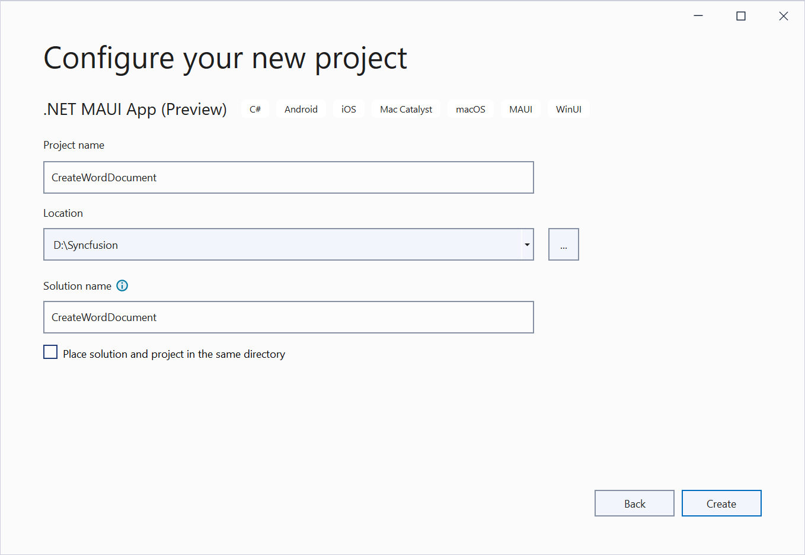
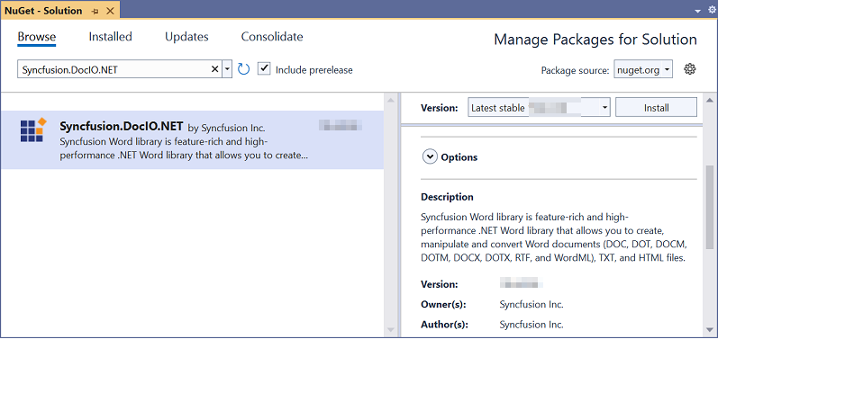
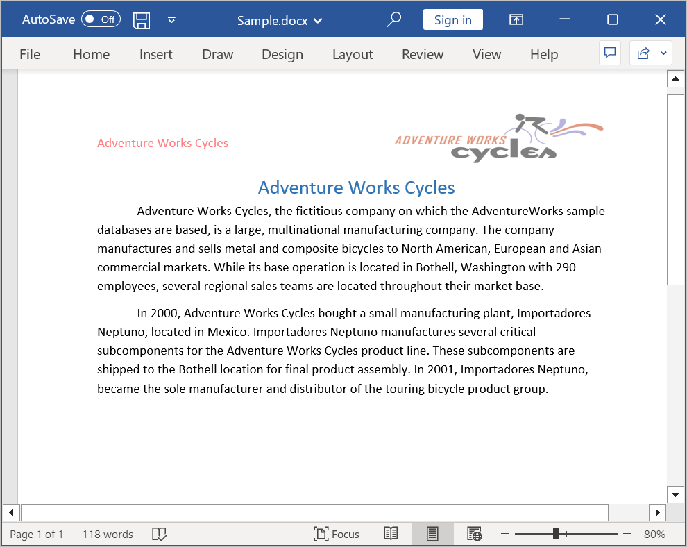

# Open and Save Word document in .NET MAUI

Syncfusion&reg; DocIO is a [.NET MAUI Word library](https://www.syncfusion.com/document-processing/word-framework/maui/word-library) used to **create, read, and edit Word documents** programmatically without **Microsoft Word** or interop dependencies. Using this library, you can **open and save a Word document in .NET MAUI**.

**Prerequisites:**
To create .NET Multi-platform App UI (.NET MAUI) apps, you need the latest versions of Visual Studio 2022 and .NET 6. For more details, refer [here](https://learn.microsoft.com/en-us/dotnet/maui/get-started/installation?view=net-maui-7.0&tabs=vswin).

## Steps to open and save Word document programmatically in .NET MAUI

Step 1: Create a new C# .NET MAUI app. Select **.NET MAUI App (Preview)** from the template and click the **Next** button.

Step 2: Enter the project name and click **Create**.

Step 3: Install the [Syncfusion.DocIO.NET](https://www.nuget.org/packages/Syncfusion.DocIO.Net) NuGet package as a reference to your project from [NuGet.org](https://www.nuget.org/).

N> Starting with v16.2.0.x, if you reference Syncfusion&reg; assemblies from trial setup or from the NuGet feed, you also have to add "Syncfusion.Licensing" assembly reference and include a license key in your projects. Please refer to this [link](https://help.syncfusion.com/common/essential-studio/licensing/overview) to know about registering a Syncfusion&reg; license key in your application to use our components.

Step 4: Add a new button to the **MainPage.xaml** as shown below.




<ContentPage xmlns="http://schemas.microsoft.com/dotnet/2021/maui"
            xmlns:x="http://schemas.microsoft.com/winfx/2009/xaml"
            x:Class="Open_and_save_Word_document.MainPage"
            BackgroundColor="{DynamicResource SecondaryColor}">
    <ScrollView>
        <Grid RowSpacing="25" RowDefinitions="Auto,Auto,Auto,Auto,*"
            Padding="{OnPlatform iOS='30,60,30,30', Default='30'}">
            <Button 
                Text="Open and Save Document"
                FontAttributes="Bold"
                Grid.Row="0"
                SemanticProperties.Hint="Open and Save Word document you click"
                Clicked="OpenAndSaveDocument"
                HorizontalOptions="Center" />
        </Grid>
    </ScrollView>
</ContentPage>




Step 5: Include the following namespaces in the **MainPage.xaml.cs** file.




using Syncfusion.DocIO;
using Syncfusion.DocIO.DLS;




Step 6: Add a new action method **OpenAndSaveDocument** in MainPage.xaml.cs and include the below code snippet to **open an existing Word document in .NET MAUI**.




//Load an existing Word document.
Assembly assembly = typeof(App).GetTypeInfo().Assembly;
using (WordDocument document = new WordDocument(assembly.GetManifestResourceStream("Open_and_save_Word_document.Resources.Input.docx")))
{

}




Step 7: Add below code example to add a paragraph in the Word document.




//Access the section in a Word document.
IWSection section = document.Sections[0];
//Add a new paragraph to the section.
IWParagraph paragraph = section.AddParagraph();
paragraph.ParagraphFormat.FirstLineIndent = 36;
paragraph.BreakCharacterFormat.FontSize = 12f;
IWTextRange text = paragraph.AppendText("In 2000, Adventure Works Cycles bought a small manufacturing plant, Importadores Neptuno, located in Mexico. Importadores Neptuno manufactures several critical subcomponents for the Adventure Works Cycles product line. These subcomponents are shipped to the Bothell location for final product assembly. In 2001, Importadores Neptuno, became the sole manufacturer and distributor of the touring bicycle product group.");
text.CharacterFormat.FontSize = 12f;




Step 8: Add below code example to **save the Word document in .NET MAUI**.




//Saves the Word document to the memory stream.
using MemoryStream ms = new();
document.Save(ms, FormatType.Docx);
ms.Position = 0;
//Save the memory stream as a file.
SaveService saveService = new();
saveService.SaveAndView("Sample.docx", "application/msword", ms);




## Helper files for .NET MAUI

Refer the helper files to be added into the mentioned project. These helper files allow you to save the stream as a physical file and open the file for viewing.

<table>
  <tr>
  <td>
    <b>Folder Name</b>
  </td>
  <td>
    <b>File Name</b>
  </td>
  <td>
    <b>Summary</b>
  </td>
  </tr>
  <tr>
  <td>
    .NET MAUI Project
  </td>
  <td>
    {{'[SaveService.cs](https://github.com/SyncfusionExamples/DocIO-Examples/blob/main/Getting-Started/.NET-MAUI/Create-Word-document/Services/SaveService.cs)' | markdownify}} 
  </td>
  <td>Represent the base class for save operation.
  </td>
  </tr>
  <tr>
  <td>
    Windows
  </td>
  <td>
    {{'[SaveWindows.cs](https://github.com/SyncfusionExamples/DocIO-Examples/blob/main/Getting-Started/.NET-MAUI/Create-Word-document/Platforms/Windows/SaveWindows.cs)' | markdownify}} 
  </td>
  <td>Save implementation for Windows.
  </td>
  </tr>
  <tr>
  <td>
    Android
  </td>
  <td>
    {{'[SaveAndroid.cs](https://github.com/SyncfusionExamples/DocIO-Examples/blob/main/Getting-Started/.NET-MAUI/Create-Word-document/Platforms/Android/SaveAndroid.cs)' | markdownify}} 
  </td>
  <td>Save implementation for Android device.
  </td>
  </tr>
  <tr>
  <td>
    Mac Catalyst
  </td>
  <td>
    {{'[SaveMac.cs](https://github.com/SyncfusionExamples/DocIO-Examples/blob/main/Getting-Started/.NET-MAUI/Create-Word-document/Platforms/MacCatalyst/SaveMac.cs)' | markdownify}} 
  </td>
  <td>Save implementation for Mac Catalyst device.
  </td>
  </tr>
  <tr>
  <td rowspan="2">
    iOS
  </td>
  <td>
    {{'[SaveIOS.cs](https://github.com/SyncfusionExamples/DocIO-Examples/blob/main/Getting-Started/.NET-MAUI/Create-Word-document/Platforms/iOS/SaveIOS.cs)' | markdownify}} 
  </td>
  <td>
    Save implementation for iOS device
  </td>
  </tr>
  <tr>
  <td>
    {{'[PreviewControllerDS.cs](https://github.com/SyncfusionExamples/DocIO-Examples/blob/main/Getting-Started/.NET-MAUI/Create-Word-document/Platforms/iOS/PreviewControllerDS.cs)' | markdownify}} 
     {{'[QLPreviewItemFileSystem.cs](https://github.com/SyncfusionExamples/DocIO-Examples/blob/main/Getting-Started/.NET-MAUI/Create-Word-document/Platforms/iOS/QLPreviewItemFileSystem.cs)' | markdownify}} 
  </td>
  <td>
    Helper classes for viewing the <b>Word document</b> in iOS device
  </td>
  </tr>
</table>

You can download a complete working sample from [GitHub](https://github.com/SyncfusionExamples/DocIO-Examples/tree/main/Read-and-Save-document/Open-and-save-Word-document/.NET-MAUI).

By executing the program, you will get the **Word document** as follows.

Click [here](https://www.syncfusion.com/document-processing/word-framework/maui) to explore the rich set of Syncfusion&reg; Word library (DocIO) features. 
