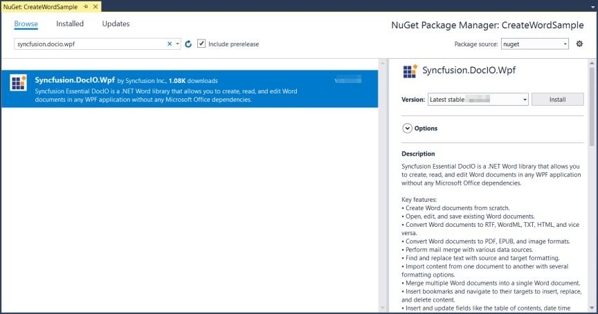

# Open and Save Word document in WPF

Syncfusion&reg; DocIO is a [.NET Word library](https://www.syncfusion.com/document-processing/word-framework/net/word-library) used to **create, read, and edit Word documents** programmatically without **Microsoft Word** or interop dependencies. Using this library, you can **open and save a Word document in WPF**.

## Steps to open and save Word document programmatically in WPF:

Step 1: Create a new WPF application project.

Step 2: Install the [Syncfusion.DocIO.Wpf](https://www.nuget.org/packages/Syncfusion.DocIO.Wpf) NuGet package as a reference to your WPF application from [NuGet.org](https://www.nuget.org/).

N> Starting with v16.2.0.x, if you reference 
Syncfusion&reg; assemblies from trial setup or from the NuGet feed, you also have to add "Syncfusion.Licensing" assembly reference and include a license key in your projects. Please refer to this [link](https://help.syncfusion.com/common/essential-studio/licensing/overview) to know about registering 
Syncfusion&reg; license key in your application to use our components.

Step 3: Include the following namespaces in the MainWindow.xaml.cs file.





using Syncfusion.DocIO;
using Syncfusion.DocIO.DLS;





Step 4: Add a new button in **MainWindow.xaml** to create Word file as follows.




<Button Click="btnOpenAndSave_Click" Margin="0,0,10,12" VerticalAlignment="Bottom" Height="30" BorderBrush="LightBlue" HorizontalAlignment="Right" Width="180">
    <Button.Background>
        <LinearGradientBrush EndPoint="0.5,-0.04" StartPoint="0.5,1.04">
            <GradientStop Color="#FFD9E9F7" Offset="0"/>
            <GradientStop Color="#FFEFF8FF" Offset="1"/>
        </LinearGradientBrush>
    </Button.Background>
    <StackPanel Orientation="Horizontal" Height="23" Margin="0,0,0,-2.52" VerticalAlignment="Bottom" HorizontalAlignment="Right" Width="100">
        <Image Name="image2" Margin="2" HorizontalAlignment="Center" VerticalAlignment="Center" />
        <TextBlock Text="Opend and Save" Height="15.96" Width="126" Margin="0,4,0,3" />
    </StackPanel>
</Button>




Step 5: Add the following code in **btnOpenAndSave_Click** to **open an existing Word document in WPF**.




//Open an existing Word document.
WordDocument document = new WordDocument("Input.docx");




Step 6: Add below code example to add a paragraph in the Word document.




//Access the section in a Word document.
IWSection section = document.Sections[0];
//Add a new paragraph to the section.
IWParagraph paragraph = section.AddParagraph();
paragraph.ParagraphFormat.FirstLineIndent = 36;
paragraph.BreakCharacterFormat.FontSize = 12f;
IWTextRange text = paragraph.AppendText("In 2000, Adventure Works Cycles bought a small manufacturing plant, Importadores Neptuno, located in Mexico. Importadores Neptuno manufactures several critical subcomponents for the Adventure Works Cycles product line. These subcomponents are shipped to the Bothell location for final product assembly. In 2001, Importadores Neptuno, became the sole manufacturer and distributor of the touring bicycle product group.");
text.CharacterFormat.FontSize = 12f;




Step 7: Add below code example to **save the Word document in WPF**.




//Save the Word document
document.Save("Sample.docx");




You can download a complete working sample from [GitHub](https://github.com/SyncfusionExamples/DocIO-Examples/tree/main/Read-and-Save-document/Open-and-save-Word-document/WPF).

By executing the program, you will get the **Word document** as follows.

Click [here](https://www.syncfusion.com/document-processing/word-framework/net) to explore the rich set of 
Syncfusion&reg; Word library (DocIO) features. 