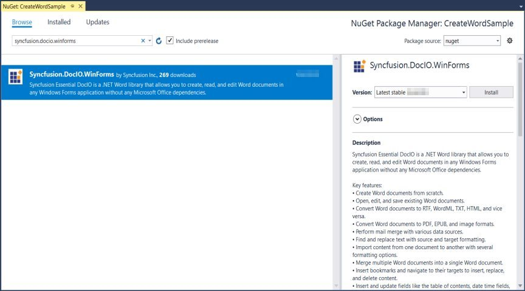
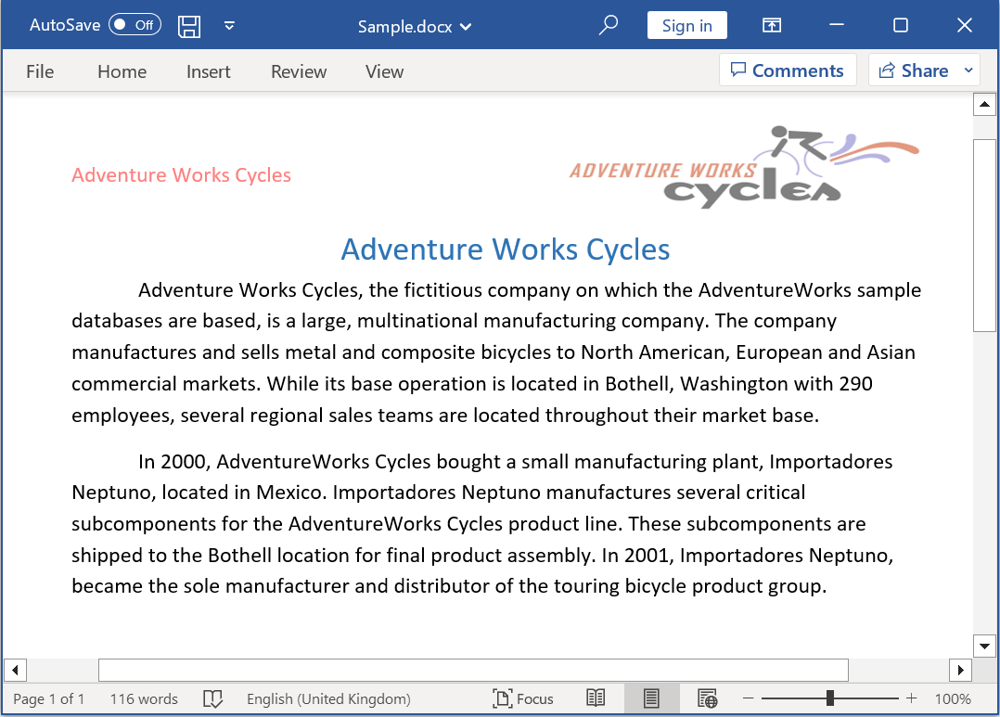

# Open and save Word document in Windows Forms

Syncfusion&reg; DocIO is a [.NET Word library](https://www.syncfusion.com/document-processing/word-framework/net/word-library) used to create, read, and edit **Word documents** programmatically without **Microsoft Word** or interop dependencies. Using this library, you can **open and save a Word document in Windows Forms**.

## Steps to open and save Word document programmatically:

Step 1: Create a new Windows Forms application project.

Step 2: Install [Syncfusion.DocIO.WinForms](https://www.nuget.org/packages/Syncfusion.DocIO.WinForms/) NuGet package as a reference to your Windows Forms application from the [NuGet.org](https://www.nuget.org/).

N> Starting with v16.2.0.x, if you reference Syncfusion&reg; assemblies from trial setup or from the NuGet feed, you also have to add "Syncfusion.Licensing" assembly reference and include a license key in your projects. Please refer to this [link](https://help.syncfusion.com/common/essential-studio/licensing/overview) to know about registering Syncfusion&reg; license key in your application to use our components.

Step 3: Include the following namespaces in the **Form1.Designer.cs** file.





using Syncfusion.DocIO;
using Syncfusion.DocIO.DLS;





Step 4: Add a new button in **Form1.Designer.cs** to create Word file as follows.





private Button btnOpenAndSave;
private Label label;

private void InitializeComponent()
{
    label = new Label();
    btnOpenAndSave = new Button();

    //Label
    label.Location = new System.Drawing.Point(0, 40);
    label.Size = new System.Drawing.Size(426, 35);
    label.Text = "Click the button to view a Word document generated by Essential DocIO. Please note that Microsoft Word Viewer or Microsoft Word is required to view the resultant Word document";
    label.TextAlign = System.Drawing.ContentAlignment.MiddleCenter;

    //Button
    btnOpenAndSave.Location = new System.Drawing.Point(180, 110);
    btnOpenAndSave.Size = new System.Drawing.Size(85, 36);
    btnOpenAndSave.Text = "Open and Save Document";
    btnOpenAndSave.Click += new EventHandler(btnOpenAndSave_Click);

    //Create Word
    ClientSize = new System.Drawing.Size(450, 150);
    Controls.Add(label);
    Controls.Add(btnOpenAndSave);
    Text = "Open and Save Word";
}




Step 5: Add the following code in **btnOpenAndSave_Click** to **open an existing Word document in Windows-Forms**.




//Open an existing Word document.
WordDocument document = new WordDocument("Input.docx");





Step 6: Add below code example to add a paragraph in the Word document.




//Access the section in a Word document
IWSection section = document.Sections[0];
//Add new paragraph to the section
IWParagraph paragraph = section.AddParagraph();
paragraph.ParagraphFormat.FirstLineIndent = 36;
paragraph.BreakCharacterFormat.FontSize = 12f;
//Add new text to the paragraph
WTextRange textRange = paragraph.AppendText("In 2000, AdventureWorks Cycles bought a small manufacturing plant, Importadores Neptuno, located in Mexico. Importadores Neptuno manufactures several critical subcomponents for the AdventureWorks Cycles product line. These subcomponents are shipped to the Bothell location for final product assembly. In 2001, Importadores Neptuno, became the sole manufacturer and distributor of the touring bicycle product group.") as WTextRange;
textRange.CharacterFormat.FontSize = 12f;




Step 7: Add below code example to **save the Word document in Windows Forms**.




//Save the Word document.
document.Save("Sample.docx");




You can download a complete working sample from [GitHub](https://github.com/SyncfusionExamples/DocIO-Examples/tree/main/Read-and-Save-document/Open-and-save-Word-document/Windows-Forms)

By executing the program, you will get the **Word document** as follows.

Click [here](https://www.syncfusion.com/document-processing/word-framework/net) to explore the rich set of Syncfusion&reg; Word library (DocIO) features. 