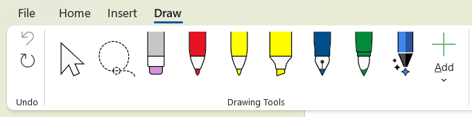
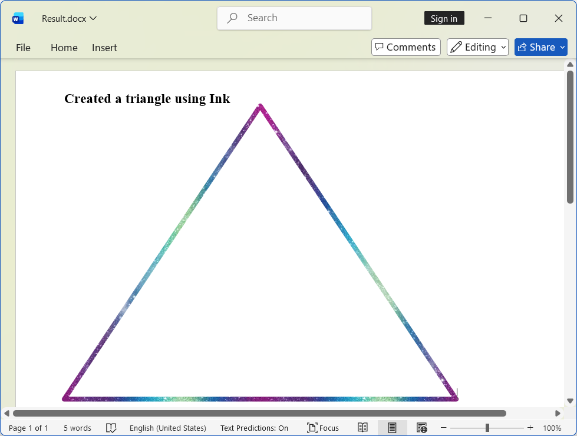
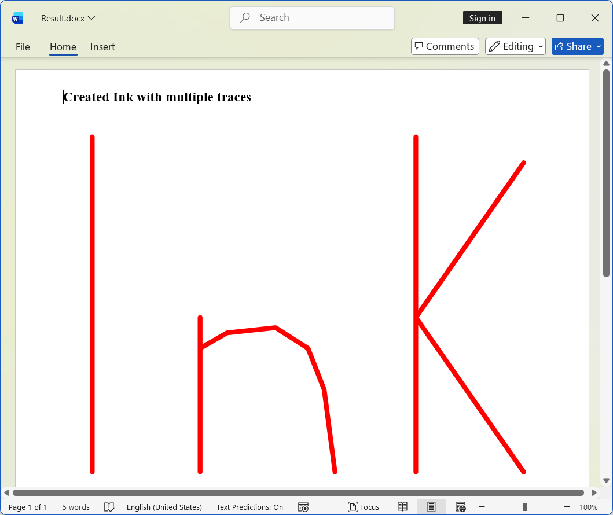
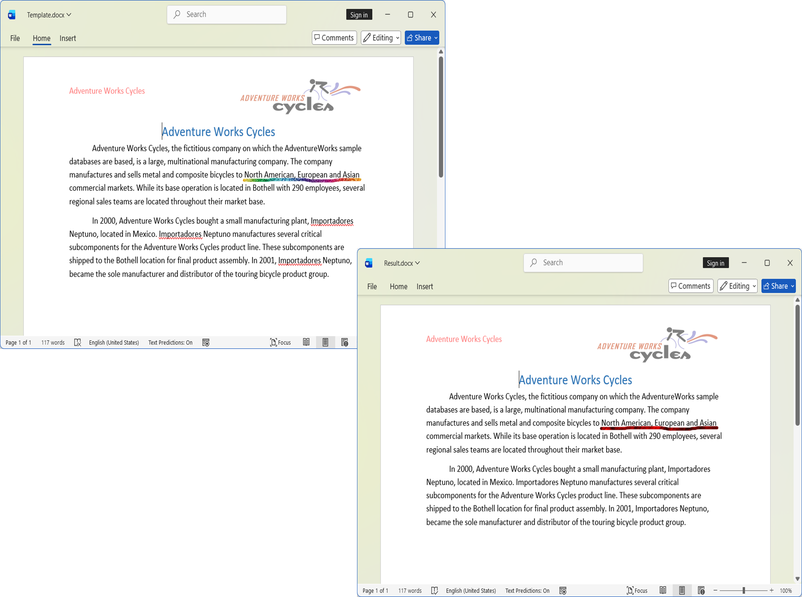
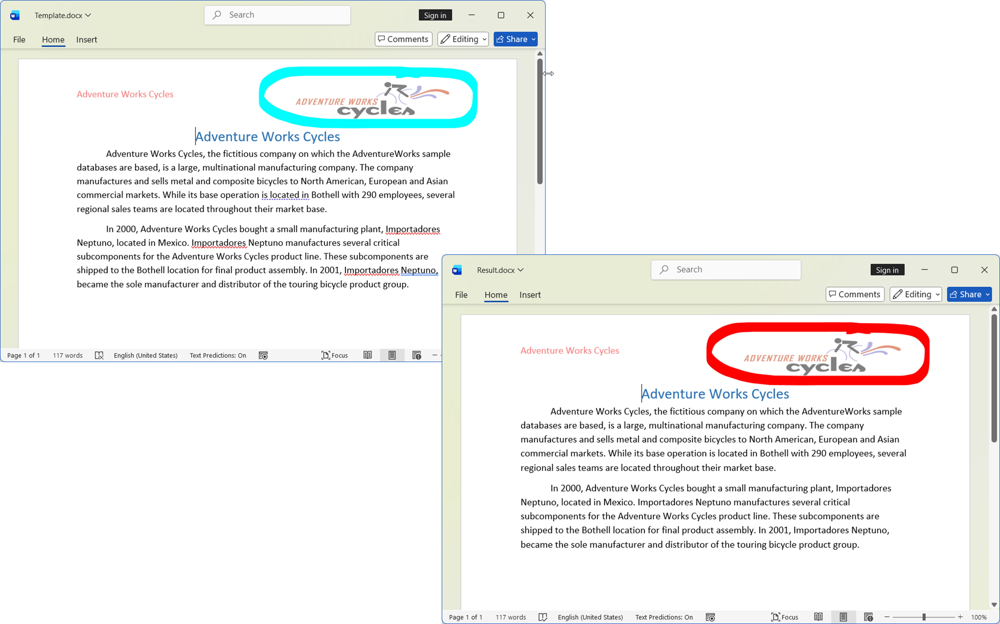
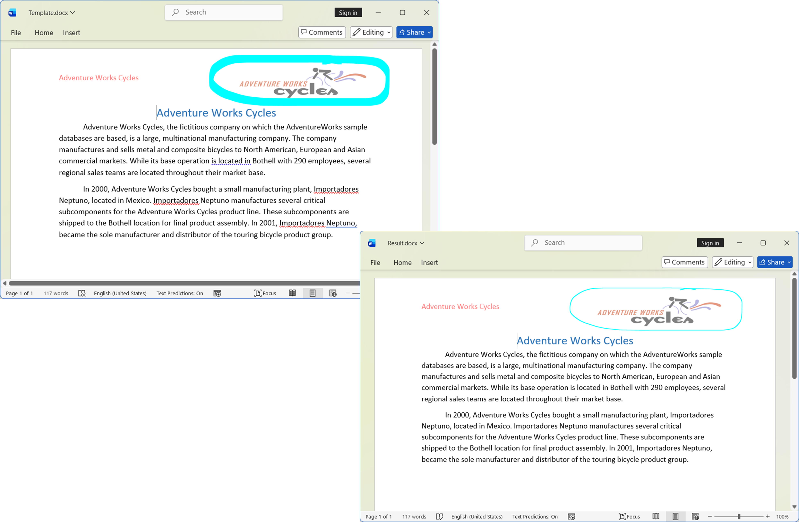
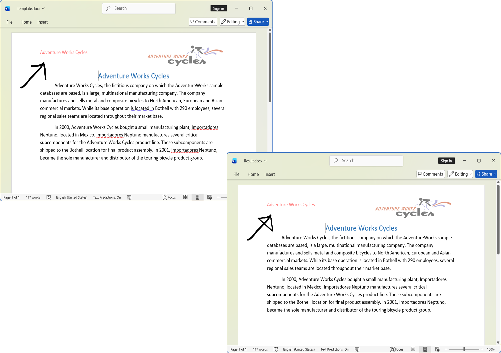
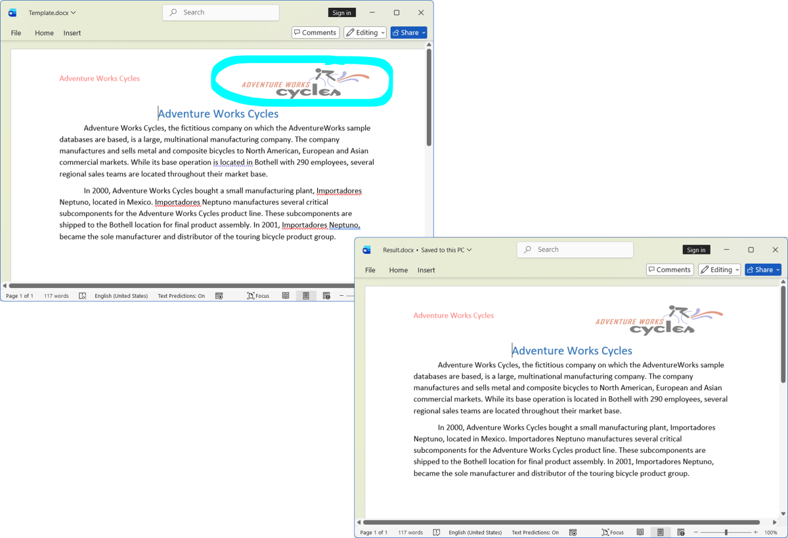

# Working with Ink Elements

An Ink annotation is a freehand drawing or handwritten input composed of stroke points that conveys signatures, notes, or sketches directly on a page. You can add and modify Ink in Word documents using Syncfusion&reg; Word library (DocIO).

N> DocIO supports Ink only in DOCX format documents.

You can insert Ink elements in the document by using the drawing tools available under the **Draw** tab in Word.

## Create Ink

The following code example illustrating how to create an Ink in a Word document. 





//Creates a new Word document.
WordDocument document = new WordDocument();
//Adds new section to the document.
IWSection section = document.AddSection();
//Adds new paragraph to the section.
WParagraph paragraph = section.AddParagraph() as WParagraph;
//Adds new text to the paragraph
IWTextRange firstText = paragraph.AppendText("Created a triangle using Ink");
//Apply formatting for first text range
firstText.CharacterFormat.FontSize = 14;
firstText.CharacterFormat.Bold = true;
//Adds new ink to the document.
WInk ink = paragraph.AppendInk(400, 300);
// Gets the ink traces collection from the ink object.
IOfficeInkTraces traces = ink.Traces;
// Adds new ink stroke with required trace points
PointF[] triangle = new PointF[] { new PointF(0f, 300f), new PointF(200f, 0f), new PointF(400f, 300f), new PointF(0f, 300f) };
// Adds a new ink trace to the ink object using the triangle points.
IOfficeInkTrace trace = traces.Add(triangle);
// Modify the brush effects and size
IOfficeInkBrush brush = trace.Brush;
// Sets the brush size for the ink stroke.
brush.Size = new SizeF(5f, 5f);
// Sets the ink effect to 'Galaxy'.
brush.InkEffect = OfficeInkEffectType.Galaxy;
//Saves the Word document to MemoryStream
MemoryStream stream = new MemoryStream();
document.Save(stream, FormatType.Docx);
//Closes the document
document.Close();





//Creates a new Word document.
WordDocument document = new WordDocument();
//Adds new section to the document.
IWSection section = document.AddSection();
//Adds new paragraph to the section.
WParagraph paragraph = section.AddParagraph() as WParagraph;
//Adds new text to the paragraph
IWTextRange firstText = paragraph.AppendText("Created a triangle using Ink");
//Apply formatting for first text range
firstText.CharacterFormat.FontSize = 14;
firstText.CharacterFormat.Bold = true;
//Adds new ink to the document.
WInk ink = paragraph.AppendInk(400, 300);
// Gets the ink traces collection from the ink object.
IOfficeInkTraces traces = ink.Traces;
// Adds new ink stroke with required trace points
PointF[] triangle = new PointF[] { new PointF(0f, 300f), new PointF(200f, 0f), new PointF(400f, 300f), new PointF(0f, 300f) };
// Adds a new ink trace to the ink object using the triangle points.
IOfficeInkTrace trace = traces.Add(triangle);
// Modify the brush effects and size
IOfficeInkBrush brush = trace.Brush;
// Sets the brush size for the ink stroke.
brush.Size = new SizeF(5f, 5f);
// Sets the ink effect to 'Galaxy'.
brush.InkEffect = OfficeInkEffectType.Galaxy;
//Saves and closes the document instance
document.Save("Result.docx", FormatType.Docx);
//Closes the document
document.Close();





'Creates a new Word document.
Dim document As New WordDocument()
'Adds new section to the document.
Dim section As IWSection = document.AddSection()
'Adds new paragraph to the section.
Dim paragraph As IWParagraph = section.AddParagraph()
'Adds new text to the paragraph
Dim firstText As IWTextRange = paragraph.AppendText("Created a triangle using Ink")
'Apply formatting for first text range
firstText.CharacterFormat.FontSize = 14
firstText.CharacterFormat.Bold = True
'Adds new ink to the document.
Dim ink As WInk = paragraph.AppendInk(400, 300)
' Gets the ink traces collection from the ink object.
Dim traces As IOfficeInkTraces = ink.Traces
' Adds new ink stroke with required trace points
Dim triangle As PointF() = New PointF() { New PointF(0F, 300F), New PointF(200F, 0F), New PointF(400F, 300F), New PointF(0F, 300F) }
' Adds a new ink trace to the ink object using the triangle points.
Dim trace As IOfficeInkTrace = traces.Add(triangle)
' Modify the brush effects and size
Dim brush As IOfficeInkBrush = trace.Brush
' Sets the brush size for the ink stroke.
brush.Size = New SizeF(5F, 5F)
' Sets the ink effect to 'Galaxy'.
brush.InkEffect = OfficeInkEffectType.Galaxy
'Saves and closes the document instance
document.Save("Result.docx", FormatType.Docx)
'Closes the document
document.Close()





By running the above code, you will generate a a document with **Ink elements** as shown below.

You can download a complete working sample from [GitHub](https://github.com/SyncfusionExamples/DocIO-Examples/tree/main/Ink/Create-ink/.NET/).

## Create Ink with Multiple Traces 

The following code example illustrating how to create an Ink with Multiple Traces (strokes) in a Word document. 





//Creates a new Word document.
WordDocument document = new WordDocument();
//Adds new section to the document.
IWSection section = document.AddSection();
//Adds new paragraph to the section.
WParagraph paragraph = section.AddParagraph() as WParagraph;
//Adds new ink to the document.
WInk ink = paragraph.AppendInk(450, 350);
// Sets the horizontal position of the ink object.
ink.HorizontalPosition = 30;
// Sets the Vertical position of the ink object.
ink.VerticalPosition = 50;
// Sets the text wrapping style for the ink object to be in front of text.
ink.WrapFormat.TextWrappingStyle = TextWrappingStyle.InFrontOfText;
// Gets the ink traces collection from the ink object.
IOfficeInkTraces traces = ink.Traces;
// Gets all trace point arrays from the helper method.
List<PointF[]> pointsCollection = GetPoints();
// Adds each trace to the ink object.
foreach (var points in pointsCollection)
{
    // Adds the trace to the ink object.
    IOfficeInkTrace trace = traces.Add(points);
    // Sets the brush color for the trace to red.
    trace.Brush.Color = Color.Red;
    // Sets the brush size for the ink stroke.
    trace.Brush.Size = new SizeF(5f, 5f);
}
//Saves the Word document to MemoryStream
MemoryStream stream = new MemoryStream();
document.Save(stream, FormatType.Docx);
//Closes the document
document.Close();





//Creates a new Word document.
WordDocument document = new WordDocument();
//Adds new section to the document.
IWSection section = document.AddSection();
//Adds new paragraph to the section.
WParagraph paragraph = section.AddParagraph() as WParagraph;
//Adds new ink to the document.
WInk ink = paragraph.AppendInk(450, 350);
// Sets the horizontal position of the ink object.
ink.HorizontalPosition = 30;
// Sets the Vertical position of the ink object.
ink.VerticalPosition = 50;
// Sets the text wrapping style for the ink object to be in front of text.
ink.WrapFormat.TextWrappingStyle = TextWrappingStyle.InFrontOfText;
// Gets the ink traces collection from the ink object.
IOfficeInkTraces traces = ink.Traces;
// Gets all trace point arrays from the helper method.
List<PointF[]> pointsCollection = GetPoints();
// Adds each trace to the ink object.
foreach (var points in pointsCollection)
{
    // Adds the trace to the ink object.
    IOfficeInkTrace trace = traces.Add(points);
    // Sets the brush color for the trace to red.
    trace.Brush.Color = Color.Red;
    // Sets the brush size for the ink stroke.
    trace.Brush.Size = new SizeF(5f, 5f);
}
//Saves and closes the document instance
document.Save("Result.docx", FormatType.Docx);
//Closes the document
document.Close();





'Creates a new Word document.
Dim document As New WordDocument()
'Adds new section to the document.
Dim section As IWSection = document.AddSection()
'Adds new paragraph to the section.
Dim paragraph As IWParagraph = section.AddParagraph()
'Adds new ink to the document.
Dim ink As WInk = paragraph.AppendInk(450, 350)
' Sets the horizontal position of the ink object.
ink.HorizontalPosition = 30
' Sets the Vertical position of the ink object.
ink.VerticalPosition = 50
' Sets the text wrapping style for the ink object to be in front of text.
ink.WrapFormat.TextWrappingStyle = TextWrappingStyle.InFrontOfText
' Gets the ink traces collection from the ink object.
Dim traces As IOfficeInkTraces = ink.Traces
' Gets all trace point arrays from the helper method.
Dim pointsCollection As List(Of PointF()) = GetPoints()
' Adds each trace to the ink object.
For Each points In pointsCollection
    ' Adds the trace to the ink object.
    Dim trace As IOfficeInkTrace = traces.Add(points)
    ' Sets the brush color for the trace to red.
    trace.Brush.Color = Color.Red
    ' Sets the brush size for the ink stroke.
    trace.Brush.Size = New SizeF(5F, 5F)
Next
'Saves and closes the document instance
document.Save("Result.docx", FormatType.Docx)
'Closes the document
document.Close()





By running the above code, you will generate an **Ink with multiple trace points** as shown below.

You can download a complete working sample from [GitHub](https://github.com/SyncfusionExamples/DocIO-Examples/tree/main/Ink/Create-ink-with-multipletraces/.NET/).

The following code example shows GetPoints method which is used to get trace points.





public List<PointF[]> GetPoints()
{
    return new List<PointF[]>
    {
        //Trace_i
        new PointF[] {
            new PointF(20f, 10f),
            new PointF(20f, 140f),
        },
        //Trace_n
        new PointF[]
        {
            new PointF(60f, 80f),
            new PointF(60f, 100f),
            new PointF(60f, 140f),
            new PointF(60f, 92f),
            new PointF(70f, 86f),
            new PointF(88f, 84f),
            new PointF(100f, 92f),
            new PointF(106f, 108f),
            new PointF(110f, 140f)
        },
        //Trace_k
        new PointF[] {
            new PointF(140f, 10f),
            new PointF(140f, 140f),
            new PointF(140f, 80f),
            new PointF(180f, 20f),
            new PointF(140f, 80f),
            new PointF(180f, 140f)
        }
    };
}





public List<PointF[]> GetPoints()
{
    return new List<PointF[]>
    {
        //Trace_i
        new PointF[] {
            new PointF(20f, 10f),
            new PointF(20f, 140f),
        },
        //Trace_n
        new PointF[]
        {
            new PointF(60f, 80f),
            new PointF(60f, 100f),
            new PointF(60f, 140f),
            new PointF(60f, 92f),
            new PointF(70f, 86f),
            new PointF(88f, 84f),
            new PointF(100f, 92f),
            new PointF(106f, 108f),
            new PointF(110f, 140f)
        },
        //Trace_k
        new PointF[] {
            new PointF(140f, 10f),
            new PointF(140f, 140f),
            new PointF(140f, 80f),
            new PointF(180f, 20f),
            new PointF(140f, 80f),
            new PointF(180f, 140f)
        }
    };
}





Public Function GetPoints() As List(Of PointF())
    Return New List(Of PointF()) From {
        'Trace_i
        New PointF() {
            New PointF(20F, 10F),
            New PointF(20F, 140F)
        },
        'Trace_n
        New PointF() {
            New PointF(60F, 80F),
            New PointF(60F, 100F),
            New PointF(60F, 140F),
            New PointF(60F, 92F),
            New PointF(70F, 86F),
            New PointF(88F, 84F),
            New PointF(100F, 92F),
            New PointF(106F, 108F),
            New PointF(110F, 140F)
        },
        'Trace_k
        New PointF() {
            New PointF(140F, 10F),
            New PointF(140F, 140F),
            New PointF(140F, 80F),
            New PointF(180F, 20F),
            New PointF(140F, 80F),
            New PointF(180F, 140F)
        }
    }
End Function





## Modify Ink

You can modify the appearance of Ink by changing the trace ink effects, color, size, points.  

### Modify Ink Effect

The following code example demonstrates how to customize the Ink Effect.





//Opens the template document
FileStream fileStreamPath = new FileStream("Template.docx", FileMode.Open, FileAccess.Read, FileShare.ReadWrite);
WordDocument document = new WordDocument(fileStreamPath, FormatType.Docx);
// Gets the first section of the document.
WSection section = document.Sections[0];
// Access the ink and customize its effect.
WInk ink = section.Paragraphs[1].ChildEntities[0] as WInk;
// Gets the ink trace from the ink object.
IOfficeInkTrace inkTrace = ink.Traces[0];
// Modify the ink effect to 'Lava'.
inkTrace.Brush.InkEffect = OfficeInkEffectType.Lava;
//Saves the Word document to MemoryStream
MemoryStream stream = new MemoryStream();
document.Save(stream, FormatType.Docx);
//Closes the Word document
document.Close();





//Opens the template document
WordDocument document = new WordDocument("Template.docx");
// Gets the first section of the document.
WSection section = document.Sections[0];
// Access the ink and customize its effect.
WInk ink = section.Paragraphs[1].ChildEntities[0] as WInk;
// Gets the ink trace from the ink object.
IOfficeInkTrace inkTrace = ink.Traces[0];
// Modify the ink effect to 'Lava'.
inkTrace.Brush.InkEffect = OfficeInkEffectType.Lava;
//Saves and closes the Word document instance
document.Save("Result.docx");
document.Close();





'Opens the template document
Dim document As New WordDocument("Template.docx", FormatType.Docx)
' Gets the first section of the document.
Dim section As WSection = document.Sections(0)
' Access the ink and customize its effect.
Dim ink As WInk = TryCast(section.Paragraphs(1).ChildEntities(0), WInk)
' Gets the ink trace from the ink object.
Dim inkTrace As IOfficeInkTrace = ink.Traces(0)
' Modify the ink effect to 'Lava'.
inkTrace.Brush.InkEffect = OfficeInkEffectType.Lava
'Saves and closes the Word document instance
document.Save("Result.docx")
document.Close()





By running the above code, you will generate a **Modified ink effect** as shown below.

You can download a complete working sample from [GitHub](https://github.com/SyncfusionExamples/DocIO-Examples/tree/main/Ink/Modify-ink-effect/.NET/).

### Modify Ink Color

The following code example demonstrates how to customize the Ink Color. 





//Opens the template document
FileStream fileStreamPath = new FileStream("Template.docx", FileMode.Open, FileAccess.Read, FileShare.ReadWrite);
WordDocument document = new WordDocument(fileStreamPath, FormatType.Docx);
// Gets the first section of the document.
WSection section = document.Sections[0];
// Access the ink and customize its color.
WInk ink = section.Paragraphs[0].ChildEntities[0] as WInk;
// Gets the ink trace from the ink object.
IOfficeInkTrace inkTrace = ink.Traces[0];
// Modify the brush color to Color.Red.
inkTrace.Brush.Color = Color.Red;
//Saves the Word document to MemoryStream
MemoryStream stream = new MemoryStream();
document.Save(stream, FormatType.Docx);
//Closes the Word document
document.Close();





//Opens the template document
WordDocument document = new WordDocument("Template.docx");
// Gets the first section of the document.
WSection section = document.Sections[0];
// Access the ink and customize its color.
WInk ink = section.Paragraphs[0].ChildEntities[0] as WInk;
// Gets the ink trace from the ink object.
IOfficeInkTrace inkTrace = ink.Traces[0];
// Modify the brush color to Color.Red.
inkTrace.Brush.Color = Color.Red;
//Saves and closes the Word document instance
document.Save("Result.docx");
//Closes the Word document
document.Close();





'Opens the template document
Dim document As New WordDocument("Template.docx")
' Gets the first section of the document.
Dim section As WSection = document.Sections(0)
' Access the ink and customize its color.
Dim ink As WInk = TryCast(section.Paragraphs(0).ChildEntities(0), WInk)
' Gets the ink trace from the ink object.
Dim inkTrace As IOfficeInkTrace = ink.Traces(0)
' Modify the brush color to Color.Red.
inkTrace.Brush.Color = Color.Red
'Saves and closes the Word document instance
document.Save("Result.docx")
'Closes the Word document
document.Close()





By running the above code, you will generate a **Modified ink color** as shown below.

You can download a complete working sample from [GitHub](https://github.com/SyncfusionExamples/DocIO-Examples/tree/main/Ink/Modify-ink-color/.NET/).

### Modify Ink Thickness

The following code example demonstrates how to customize the Ink thickness.





//Opens the template document
FileStream fileStreamPath = new FileStream("Template.docx", FileMode.Open, FileAccess.Read, FileShare.ReadWrite);
WordDocument document = new WordDocument(fileStreamPath, FormatType.Docx);
// Gets the first section of the document.
WSection section = document.Sections[0];
// Access the ink and customize its trace size.
WInk ink = section.Paragraphs[0].ChildEntities[0] as WInk;
// Gets the ink trace from the ink object.
IOfficeInkTrace inkTrace = ink.Traces[0];
// Modify the ink size (thickness) to 1 point.
inkTrace.Brush.Size = new SizeF(1f, 1f);
//Saves the Word document to MemoryStream
MemoryStream stream = new MemoryStream();
document.Save(stream, FormatType.Docx);
//Closes the document
document.Close();





//Opens the template document 
WordDocument document = new WordDocument("Template.docx");
// Gets the first section of the document.
WSection section = document.Sections[0];
// Access the ink and customize its trace size.
WInk ink = section.Paragraphs[0].ChildEntities[0] as WInk;
// Gets the ink trace from the ink object.
IOfficeInkTrace inkTrace = ink.Traces[0];
// Modify the ink size (thickness) to 1 point.
inkTrace.Brush.Size = new SizeF(1f, 1f);
//Saves and closes the Word document instance
document.Save("Sample.docx");
//Closes the document
document.Close();





'Opens the template document 
Dim document As New WordDocument("Template.docx")
' Gets the first section of the document.
Dim section As WSection = document.Sections(0)
' Access the ink and customize its trace size.
Dim ink As WInk = TryCast(section.Paragraphs(0).ChildEntities(0), WInk)
' Gets the ink trace from the ink object.
Dim inkTrace As IOfficeInkTrace = ink.Traces(0)
' Modify the ink size (thickness) to 1 point.
inkTrace.Brush.Size = New SizeF(1F, 1F)
'Saves and closes the Word document instance
document.Save("Sample.docx")
'Closes the document
document.Close()





By running the above code, you will generate a **Modified ink thickness** as shown below.

You can download a complete working sample from [GitHub](https://github.com/SyncfusionExamples/DocIO-Examples/tree/main/Ink/Modify-ink-thickness/.NET/).

### Modify Ink Points 

The following code example demonstrates how to customize the Ink Points. 





//Opens the template document
FileStream fileStreamPath = new FileStream("Template.docx", FileMode.Open, FileAccess.Read, FileShare.ReadWrite);
WordDocument document = new WordDocument(fileStreamPath, FormatType.Docx);
// Gets the first section of the document.
WSection section = document.Sections[0];
// Access the ink and customize its trace points.
WInk ink = section.Paragraphs[0].ChildEntities[0] as WInk;
// Gets the ink trace from the ink object.
IOfficeInkTrace inkTrace = ink.Traces[0];
// Close the ink stroke by setting the last point to be the same as the first point
inkTrace.Points[inkTrace.Points.Length - 1] = new PointF(inkTrace.Points[0].X, inkTrace.Points[0].Y);
//Saves the Word document to MemoryStream
MemoryStream stream = new MemoryStream();
document.Save(stream, FormatType.Docx);
//Closes the document
document.Close();





//Opens the template document 
WordDocument document = new WordDocument("Template.docx");
// Gets the first section of the document.
WSection section = document.Sections[0];
// Access the ink and customize its trace points.
WInk ink = section.Paragraphs[0].ChildEntities[0] as WInk;
// Gets the ink trace from the ink object.
IOfficeInkTrace inkTrace = ink.Traces[0];
// Close the ink stroke by setting the last point to be the same as the first point
inkTrace.Points[inkTrace.Points.Length - 1] = new PointF(inkTrace.Points[0].X, inkTrace.Points[0].Y);
//Saves and closes the Word document instance
document.Save("Sample.docx");
//Closes the document
document.Close();





'Opens the template document 
Dim document As New WordDocument("Template.docx")
' Gets the first section of the document.
Dim section As WSection = document.Sections(0)
' Access the ink and customize its trace points.
Dim ink As WInk = TryCast(section.Paragraphs(0).ChildEntities(0), WInk)
' Gets the ink trace from the ink object.
Dim inkTrace As IOfficeInkTrace = ink.Traces(0)
' Close the ink stroke by setting the last point to be the same as the first point
inkTrace.Points(inkTrace.Points.Length - 1) = New PointF(inkTrace.Points(0).X, inkTrace.Points(0).Y)
'Saves and closes the Word document instance
document.Save("Sample.docx")
'Closes the document
document.Close()





By running the above code,  you will generate **modified ink points** as shown below.

You can download a complete working sample from [GitHub](https://github.com/SyncfusionExamples/DocIO-Examples/tree/main/Ink/Modify-ink-points/.NET/).

## Remove Ink

You can remove ink by iterating through Ink objects or specifying an index. The following code example demonstrates how to remove the Ink.





//Opens the template document
FileStream fileStreamPath = new FileStream("Template.docx", FileMode.Open, FileAccess.Read, FileShare.ReadWrite);
WordDocument document = new WordDocument(fileStreamPath, FormatType.Docx);
//Get the ink paragraph of the document.
WParagraph paragraph = document.Sections[0].Paragraphs[0];
//Iterates through the child elements of ink paragraph.
for (int i = 0; i < paragraph.ChildEntities.Count; i++)
{
    //Removes the ink from the paragraph.
    if (paragraph.ChildEntities[i] is WInk)
    {
        paragraph.Items.RemoveAt(i);
        i--;
    }
}
//Saves the Word document to MemoryStream
MemoryStream stream = new MemoryStream();
document.Save(stream, FormatType.Docx);
//Closes the document
document.Close();





//Opens the template document 
WordDocument document = new WordDocument("Template.docx");
//Get the ink paragraph of the document.
WParagraph paragraph = document.Sections[0].Paragraphs[0];
//Iterates through the child elements of ink paragraph.
for (int i = 0; i < paragraph.ChildEntities.Count; i++)
{
    //Removes the ink from the paragraph.
    if (paragraph.ChildEntities[i] is WInk)
    {
        paragraph.Items.RemoveAt(i);
        i--;
    }
}
//Saves and closes the Word document instance
document.Save("Sample.docx");
//Closes the document
document.Close();





'Opens the template document 
Dim document As New WordDocument("Template.docx")
'Get the ink paragraph of the document.
Dim paragraph As WParagraph = document.Sections(0).Paragraphs(0)
'Iterates through the child elements of ink paragraph.
Dim i As Integer = 0
While i < paragraph.ChildEntities.Count
    'Removes the ink from the paragraph.
    If TypeOf paragraph.ChildEntities(i) Is WInk Then
        paragraph.Items.RemoveAt(i)
        i -= 1
    End If
    i += 1
End While
'Saves and closes the Word document instance
document.Save("Sample.docx")
'Closes the document
document.Close()





By running the above code, you will generate a **Remove Ink** as shown below.

You can download a complete working sample from [GitHub](https://github.com/SyncfusionExamples/DocIO-Examples/tree/main/Ink/Remove-ink/.NET/).
																																						  
## Limitations

The .NET Word Library (DocIO) has the following limitations when creating Ink programmatically or processing Ink from an existing Word document.

**Document Processing Functionalities**

Document Comparison - Ink elements are not included in document comparison operations. 

**Compatibility with Older Documents**

DocIO supports Ink elements only in DOCX format. However, documents created in Word 2003 compatibility mode are an exception. In these documents, DocIO does not treat the Ink as Ink elements but instead treats it as document model data stored as base64-encoded ISF data. As a result, Ink content cannot be **edited or converted**.

**To resolve this**, upgrade the document to the latest Word compatibility format. Open the document in **Microsoft Word**, save it with the **latest compatibility** version, and then reload it in DocIO. After upgrading, you can edit or convert the Ink elements as needed.

**Word-to-PDF and Image Conversion**

During Word-to-PDF and Word-to-Image conversions, Syncfusion Word Library uses fallback images embedded in the document to preserve the Ink visual appearance. However, when Ink is created or modified using the Syncfusion Word Library, some Ink effects cannot be rendered accurately due to rendering engine limitations. Although the Ink stroke geometry is preserved, visual brush effects are lost.

**To resolve this**, save the created or modified document using DocIO first in DOCX format. Then, open the saved document in Microsoft Word and save it again. Finally, convert it to PDF or Image using DocIO. This process regenerates the required Ink fallback images, ensuring accurate visual output.

## Frequently Asked Questions

* [What is Ink Trace?](https://help.syncfusion.com/document-processing/word/word-library/net/faqs/paragraph-and-paragraph-items-faqs#what-is-ink-trace)
* [How Ink Width and Height Work](https://help.syncfusion.com/document-processing/word/word-library/net/faqs/paragraph-and-paragraph-items-faqs#how-ink-width-and-height-work)
* [How Trace Points Are Calculated?](https://help.syncfusion.com/document-processing/word/word-library/net/faqs/paragraph-and-paragraph-items-faqs#how-trace-points-are-calculated)
* [Example: Triangle Ink Trace Points](https://help.syncfusion.com/document-processing/word/word-library/net/faqs/paragraph-and-paragraph-items-faqs#example:-triangle-ink-trace-points)
* [How to Set Stroke Thickness?](https://help.syncfusion.com/document-processing/word/word-library/net/faqs/paragraph-and-paragraph-items-faqs#how-to-set-stroke-thickness)
