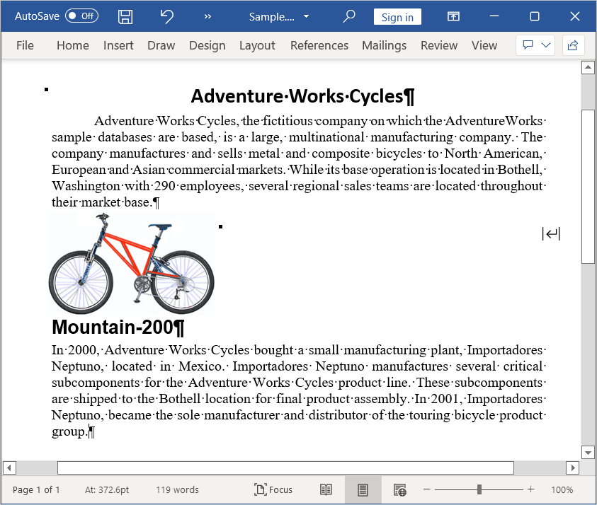

# Working with Paragraph

Paragraph is the basic element in a Word document that contains a textual and graphical contents. Each paragraph has its own formatting such as line spacing, alignment, indentation, and more. Within a paragraph, the contents are represented by one or more child elements such as [WTextRange](https://help.syncfusion.com/cr/document-processing/Syncfusion.DocIO.DLS.WTextRange.html), [WPicture](https://help.syncfusion.com/cr/document-processing/Syncfusion.DocIO.DLS.WPicture.html), and [Hyperlink](https://help.syncfusion.com/cr/document-processing/Syncfusion.DocIO.DLS.Hyperlink.html) and more. The [ParagraphItem](https://help.syncfusion.com/cr/document-processing/Syncfusion.DocIO.DLS.ParagraphItem.html) is the base class for the child elements of paragraph. The following elements can be the child elements of a paragraph:

* Text: Represented by an instance of [WTextRange](https://help.syncfusion.com/cr/document-processing/Syncfusion.DocIO.DLS.WTextRange.html).
* Image: Represented by an instance of [WPicture](https://help.syncfusion.com/cr/document-processing/Syncfusion.DocIO.DLS.WPicture.html). 
* Comments: Represented by an instance of [WComment](https://help.syncfusion.com/cr/document-processing/Syncfusion.DocIO.DLS.WComment.html).
* Hyperlink: Represented by an instance of [Hyperlink](https://help.syncfusion.com/cr/document-processing/Syncfusion.DocIO.DLS.Hyperlink.html). 
* Symbols: Represented by an instance of [WSymbol](https://help.syncfusion.com/cr/document-processing/Syncfusion.DocIO.DLS.WSymbol.html). 
* Breaks: Represented by an instance of [Break](https://help.syncfusion.com/cr/document-processing/Syncfusion.DocIO.DLS.Break.html). 
* OLE Object: Represented by an instance of [WOleObject](https://help.syncfusion.com/cr/document-processing/Syncfusion.DocIO.DLS.WOleObject.html). 
* Shapes:  Represented by an instance of [Shape](https://help.syncfusion.com/cr/document-processing/Syncfusion.DocIO.DLS.Shape.html). 
* TextBox: Represented by an instance of [WTextBox](https://help.syncfusion.com/cr/document-processing/Syncfusion.DocIO.DLS.WTextBox.html). 
* Chart: Represented by an instance of [WChart](https://help.syncfusion.com/cr/document-processing/Syncfusion.DocIO.DLS.WChart.html).
* Fields: Represented by an instance of [WField](https://help.syncfusion.com/cr/document-processing/Syncfusion.DocIO.DLS.WField.html).
* Form Fields: Represented by an instance of [WFormField](https://help.syncfusion.com/cr/document-processing/Syncfusion.DocIO.DLS.WFormField.html).
* Bookmarks: Represented by instances of [BookmarkStart](https://help.syncfusion.com/cr/document-processing/Syncfusion.DocIO.DLS.BookmarkStart.html) and [BookmarkEnd](https://help.syncfusion.com/cr/document-processing/Syncfusion.DocIO.DLS.BookmarkEnd.html). 
* Footnotes and Endnotes: Represented by an instance of [WFootnote](https://help.syncfusion.com/cr/document-processing/Syncfusion.DocIO.DLS.WFootnote.html).

The following code example explains how to add a new paragraph.

N> Refer to the appropriate tabs in the code snippets section: ***C# [Cross-platform]*** for ASP.NET Core, Blazor, Xamarin, UWP, .NET MAUI, and WinUI; ***C# [Windows-specific]*** for WinForms and WPF; ***VB.NET [Windows-specific]*** for VB.NET applications.

  


//Creates a new Word document 
WordDocument document = new WordDocument();
//Adds new section to the document
IWSection section = document.AddSection();
//Adds new paragraph to the section
IWParagraph paragraph = section.AddParagraph();
//Adds new text to the paragraph
paragraph.AppendText("Adding new paragraph to the document");
//Saves the Word document to MemoryStream
MemoryStream stream = new MemoryStream();
document.Save(stream, FormatType.Docx);
//Closes the Word document
document.Close();



//Creates a new Word document 
WordDocument document = new WordDocument();
//Adds new section to the document
IWSection section = document.AddSection();
//Adds new paragraph to the section
IWParagraph paragraph = section.AddParagraph();
//Adds new text to the paragraph
paragraph.AppendText("Adding new paragraph to the document");
//Saves the Word document
document.Save("Sample.docx", FormatType.Docx);
//Closes the document
document.Close();



'Creates a new Word document 
Dim document As New WordDocument()
'Adds new section to the document
Dim section As IWSection = document.AddSection()
'Adds new paragraph to the section
Dim paragraph As IWParagraph = section.AddParagraph()
'Adds new text to the paragraph
paragraph.AppendText("Adding new paragraph to the document")
'Saves the Word document
document.Save("Sample.docx", FormatType.Docx)
'Closes the document
document.Close()




You can download a complete working sample from [GitHub](https://github.com/SyncfusionExamples/DocIO-Examples/tree/main/Paragraphs/Add-paragraph).

The following code example illustrates how to modify an existing paragraph.




FileStream fileStream = new FileStream(@"Test.docx", FileMode.Open, FileAccess.ReadWrite);
//Loads the template document
WordDocument document = new WordDocument(fileStream, FormatType.Docx);
//Gets the text body of first section
WTextBody textBody = document.Sections[0].Body;
//Gets the paragraph at index 1
WParagraph paragraph = textBody.Paragraphs[1];
//Iterates through the child elements of paragraph
foreach (ParagraphItem item in paragraph.ChildEntities)
{
    if (item is WTextRange)
    {
        WTextRange text = item as WTextRange;
        //Modifies the character format of the text
        text.CharacterFormat.Bold = true;
        break;
    }
}
///Saves the Word document to MemoryStream
MemoryStream stream = new MemoryStream();
document.Save(stream, FormatType.Docx);
//Closes the Word document
document.Close();
 


//Loads the template document
WordDocument document = new WordDocument("Template.docx");
//Gets the text body of first section
WTextBody textBody = document.Sections[0].Body;
//Gets the paragraph at index 1
WParagraph paragraph = textBody.Paragraphs[1];
//Iterates through the child elements of paragraph
foreach (ParagraphItem item in paragraph.ChildEntities)
{
    if (item is WTextRange)
    {
        WTextRange text = item as WTextRange;
        //Modifies the character format of the text
        text.CharacterFormat.Bold = true;
        break;
    }
}
//Saves the Word document
document.Save("Sample.docx", FormatType.Docx);
//Closes the document
document.Close();



'Loads the template document
Dim document As New WordDocument("Template.docx")
'Gets the text body of first section
Dim textBody As WTextBody = document.Sections(0).Body
'Gets the paragraph at index 1
Dim paragraph As WParagraph = textBody.Paragraphs(1)
'Iterates through the child elements of paragraph
For Each item As ParagraphItem In paragraph.ChildEntities
    If TypeOf item Is WTextRange Then
        Dim text As WTextRange = TryCast(item, WTextRange)
        'Modifies the character format of the text
        text.CharacterFormat.Bold = True
        Exit For
    End If
Next
'Saves the Word document
document.Save("Sample.docx", FormatType.Docx)
'Closes the document
document.Close()




You can download a complete working sample from [GitHub](https://github.com/SyncfusionExamples/DocIO-Examples/tree/main/Paragraphs/Modify-an-existing-paragraph).

## Applying paragraph formatting

As in the Microsoft Word, DocIO provides support for all the paragraph formatting options such as line spacing, indentation, spacing before and after, keep follow, and more. The following code example explains how to apply formatting to a paragraph.

N> The [FirstLineIndent](https://help.syncfusion.com/cr/document-processing/Syncfusion.DocIO.DLS.WParagraphFormat.html#Syncfusion_DocIO_DLS_WParagraphFormat_FirstLineIndent) can be used to update or retrieve both hanging and first line indents. Negative value for this property denotes the hanging indent and positive value denotes the first line indent of the paragraph.




//Open the file as Stream.
using (FileStream docStream = new FileStream("Input.docx", FileMode.Open, FileAccess.Read))
{
    //Load the file stream into a Word document.
    using (WordDocument document = new WordDocument(docStream, FormatType.Docx))
    {
        //Access the section in a Word document.
        IWSection section = document.Sections[0];
        //Access the paragraph in a Word document.
        IWParagraph paragraph = section.Paragraphs[4];
        //Apply paragraph formatting.
        paragraph.ParagraphFormat.AfterSpacing = 18f;
        paragraph.ParagraphFormat.BeforeSpacing = 18f;
        paragraph.ParagraphFormat.BackColor = Color.LightGray;
        paragraph.ParagraphFormat.FirstLineIndent = 10f;
        paragraph.ParagraphFormat.LineSpacing = 10f;
        paragraph.ParagraphFormat.HorizontalAlignment = HorizontalAlignment.Right;
        //Access the paragraph in a Word document.
        paragraph = section.Paragraphs[7];
        //Apply keep lines together property to the paragraph.
        paragraph.ParagraphFormat.Keep = true;
        //Access the paragraph in a Word document.
        paragraph = section.Paragraphs[6];
        //Apply keep with next property to the paragraph.
        paragraph.ParagraphFormat.KeepFollow = true;
        //Saves the Word document to MemoryStream
        MemoryStream stream = new MemoryStream();
        document.Save(stream, FormatType.Docx);
        //Closes the Word document
        document.Close();
    }
}



//Load an existing Word document.
using (WordDocument document = new WordDocument("Input.docx", FormatType.Docx))
{
    //Access the section in a Word document.
    IWSection section = document.Sections[0];
    //Access the paragraph in a Word document.
    IWParagraph paragraph = section.Paragraphs[4];
    //Apply paragraph formatting.
    paragraph.ParagraphFormat.AfterSpacing = 18f;
    paragraph.ParagraphFormat.BeforeSpacing = 18f;
    paragraph.ParagraphFormat.BackColor = Color.LightGray;
    paragraph.ParagraphFormat.FirstLineIndent = 10f;
    paragraph.ParagraphFormat.LineSpacing = 10f;
    paragraph.ParagraphFormat.HorizontalAlignment = HorizontalAlignment.Right;
    //Access the paragraph in a Word document.
    paragraph = section.Paragraphs[7];
    //Apply keep lines together property to the paragraph.
    paragraph.ParagraphFormat.Keep = true;
    //Access the paragraph in a Word document.
    paragraph = section.Paragraphs[6];
    //Apply keep with next property to the paragraph.
    paragraph.ParagraphFormat.KeepFollow = true;
    //Save a Word document.
    document.Save("Sample.docx", FormatType.Docx);
}



'Load an existing Word document.
Using document As WordDocument = New WordDocument("Input.docx", FormatType.Docx)
    'Access the section in a Word document.
    Dim section As IWSection = document.Sections(0)
    'Access the paragraph in a Word document.
    Dim paragraph As IWParagraph = section.Paragraphs(4)
    'Apply paragraph formatting.
    paragraph.ParagraphFormat.AfterSpacing = 18F
    paragraph.ParagraphFormat.BeforeSpacing = 18F
    paragraph.ParagraphFormat.BackColor = Color.LightGray
    paragraph.ParagraphFormat.FirstLineIndent = 10F
    paragraph.ParagraphFormat.LineSpacing = 10F
    paragraph.ParagraphFormat.HorizontalAlignment = HorizontalAlignment.Right
    'Access the paragraph in a Word document.
    paragraph = section.Paragraphs(7)
    'Apply keep lines together property to the paragraph.
    paragraph.ParagraphFormat.Keep = True
    'Access the paragraph in a Word document.
    paragraph = section.Paragraphs(6)
    'Apply keep with next property to the paragraph.
    paragraph.ParagraphFormat.KeepFollow = True
    'Save a Word document.
    document.Save("Sample.docx", FormatType.Docx)
End Using




You can download a complete working sample from [GitHub](https://github.com/SyncfusionExamples/DocIO-Examples/tree/main/Paragraphs/Apply-paragraph-formatting).

### Paragraph style  

Paragraph style contains definition for both font (text) and paragraph formatting that can be applied to the contents of an entire paragraph. DocIO supports various pre-defined styles and also provides ability to create custom paragraph styles.

T> You can define a custom style or modify any built-in style to the required formatting, and apply this style to the part of Word document to be formatted. You can reduce the file size and code length by using styles instead of formatting each element explicitly.

The following code example explains how to use the predefined styles.




//Creates a new Word document 
WordDocument document = new WordDocument();
//Adds new section to the document
IWSection section = document.AddSection();
//Adds new paragraph to the section
IWParagraph firstParagraph = section.AddParagraph();
//Adds new text to the paragraph
IWTextRange firstText = firstParagraph.AppendText("Built-in styles can be applied to the paragraph. Heading1 style is applied to this paragraph.");
//Applies built-in style for the paragraph
firstParagraph.ApplyStyle(BuiltinStyle.Heading1);
//Saves the Word document to MemoryStream
MemoryStream stream = new MemoryStream();
document.Save(stream, FormatType.Docx);
//Closes the Word document
document.Close();



//Creates a new Word document
WordDocument document = new WordDocument();
//Adds new section to the document
IWSection section = document.AddSection();
//Adds new paragraph to the section
IWParagraph firstParagraph = section.AddParagraph();
//Adds new text to the paragraph
IWTextRange firstText = firstParagraph.AppendText("Built-in styles can be applied to the paragraph. Heading1 style is applied to this paragraph.");
//Applies built-in style for the paragraph
firstParagraph.ApplyStyle(BuiltinStyle.Heading1);
//Saves the Word document
document.Save("Sample.docx", FormatType.Docx);
//Closes the document
document.Close();



'Creates a new Word document 
Dim document As New WordDocument()
'Adds new section to the document
Dim section As IWSection = document.AddSection()
'Adds new paragraph to the section
Dim firstParagraph As IWParagraph = section.AddParagraph()
'Adds new text to the paragraph
Dim firstText As IWTextRange = firstParagraph.AppendText("Built-in styles can be applied to the paragraph. Heading1 style is applied to this paragraph.")
'Applies built-in style for the paragraph
firstParagraph.ApplyStyle(BuiltinStyle.Heading1)
'Saves the Word document
document.Save("Sample.docx", FormatType.Docx)
'Closes the document
document.Close()




You can download a complete working sample from [GitHub](https://github.com/SyncfusionExamples/DocIO-Examples/tree/main/Paragraphs/Apply-paragraph-style).

### Custom paragraph style  

The following code example explains how to create a custom paragraph style and apply it to a paragraph.




//Creates a new Word document 
WordDocument document = new WordDocument();
//Adds new section to the document
IWSection section = document.AddSection();
//Creates user defined style
IWParagraphStyle style = document.AddParagraphStyle("User_defined_style");
style.ParagraphFormat.BackColor = Color.LightGray;
style.ParagraphFormat.AfterSpacing = 18f;
style.ParagraphFormat.BeforeSpacing = 18f;
style.ParagraphFormat.Borders.BorderType = Syncfusion.DocIO.DLS.BorderStyle.DotDash;
style.ParagraphFormat.Borders.LineWidth = 0.5f;
style.ParagraphFormat.LineSpacing = 15f;
style.CharacterFormat.FontName = "Calibri";
style.CharacterFormat.Italic = true;
//Adds new paragraph to the section
IWParagraph paragraph = section.AddParagraph();
IWTextRange text = paragraph.AppendText("A new paragraph style is created and is applied to this paragraph.");
//Applies the new style to paragraph
paragraph.ApplyStyle("User_defined_style");
///Saves the Word document to MemoryStream
MemoryStream stream = new MemoryStream();
document.Save(stream, FormatType.Docx);
//Closes the Word document
document.Close();



//Creates a new Word document 
WordDocument document = new WordDocument();
//Adds new section to the document
IWSection section = document.AddSection();
//Creates user defined style
IWParagraphStyle style = document.AddParagraphStyle("User_defined_style");
style.ParagraphFormat.BackColor = Color.LightGray;
style.ParagraphFormat.AfterSpacing = 18f;
style.ParagraphFormat.BeforeSpacing = 18f;
style.ParagraphFormat.Borders.BorderType = Syncfusion.DocIO.DLS.BorderStyle.DotDash;
style.ParagraphFormat.Borders.LineWidth = 0.5f;
style.ParagraphFormat.LineSpacing = 15f;
style.CharacterFormat.FontName = "Calibri";
style.CharacterFormat.Italic = true;
//Adds new paragraph to the section
IWParagraph paragraph = section.AddParagraph();
IWTextRange text = paragraph.AppendText("A new paragraph style is created and is applied to this paragraph.");
//Applies the new style to paragraph
paragraph.ApplyStyle("User_defined_style");
//Saves the Word document
document.Save("Sample.docx", FormatType.Docx);
//Closes the document
document.Close();



'Creates a new Word document 
Dim document As New WordDocument()
'Adds new section to the document
Dim section As IWSection = document.AddSection()
'Creates user defined style
Dim style As IWParagraphStyle = document.AddParagraphStyle("User_defined_style")
style.ParagraphFormat.BackColor = Color.LightGray
style.ParagraphFormat.AfterSpacing = 18.0F
style.ParagraphFormat.BeforeSpacing = 18.0F
style.ParagraphFormat.Borders.BorderType = Syncfusion.DocIO.DLS.BorderStyle.DotDash
style.ParagraphFormat.Borders.LineWidth = 0.5F
style.ParagraphFormat.LineSpacing = 15.0F
style.CharacterFormat.FontName = "Calibri"
style.CharacterFormat.Italic = True
'Adds new paragraph to the section
Dim paragraph As IWParagraph = section.AddParagraph()
Dim text As IWTextRange = paragraph.AppendText("A new paragraph style is created and is applied to this paragraph.")
'Applies the new style to paragraph
paragraph.ApplyStyle("User_defined_style")
'Saves the Word document
document.Save("Sample.docx", FormatType.Docx)
'Closes the document
document.Close()




You can download a complete working sample from [GitHub](https://github.com/SyncfusionExamples/DocIO-Examples/tree/main/Paragraphs/Create-custom-paragraph-style).

### Tab stop

A tab stop is a horizontal position that is set for aligning text of the paragraph.  A tab character causes the carriage to go to the next tab stop.

Each paragraph has its own tab stop collection where the new tab stop can be added and existing tab stop can be removed.

The following code example explains how to add tab stops to the paragraph.




//Creates a new Word document 
WordDocument document = new WordDocument();
//Adds new section to the document
IWSection section = document.AddSection();
//Adds new paragraph to the section
IWParagraph paragraph = section.AddParagraph();
//Adds tab stop at position 11
Tab firstTab = paragraph.ParagraphFormat.Tabs.AddTab(11, TabJustification.Left, TabLeader.Dotted);
//Adds tab stop at position 62
paragraph.ParagraphFormat.Tabs.AddTab(62, TabJustification.Left, TabLeader.Single);
paragraph.AppendText("This sample\t illustrates the use of tabs in the paragraph. Tabs\t can be inserted or removed from the paragraph.");
//Removes tab stop from the collection
paragraph.ParagraphFormat.Tabs.RemoveByTabPosition(11);
//Saves the Word document to MemoryStream
MemoryStream stream = new MemoryStream();
document.Save(stream, FormatType.Docx);
//Closes the Word document
document.Close();



//Creates a new Word document 
WordDocument document = new WordDocument();
//Adds new section to the document
IWSection section = document.AddSection();
//Adds new paragraph to the section
IWParagraph paragraph = section.AddParagraph();
//Adds tab stop at position 11
Tab firstTab = paragraph.ParagraphFormat.Tabs.AddTab(11, TabJustification.Left, TabLeader.Dotted);            
//Adds tab stop at position 62
paragraph.ParagraphFormat.Tabs.AddTab(62, TabJustification.Left, TabLeader.Single);
paragraph.AppendText("This sample\t illustrates the use of tabs in the paragraph. Tabs\t can be inserted or removed from the paragraph.");
//Removes tab stop from the collection
paragraph.ParagraphFormat.Tabs.RemoveByTabPosition(11);
//Saves the Word document
document.Save("Sample.docx", FormatType.Docx);
//Closes the document
document.Close();



'Creates a new Word document 
Dim document As New WordDocument()
'Adds new section to the document
Dim section As IWSection = document.AddSection()
'Adds new paragraph to the section
Dim paragraph As IWParagraph = section.AddParagraph()
'Adds tab stop at position 11
Dim firstTab As Tab = paragraph.ParagraphFormat.Tabs.AddTab(11, TabJustification.Left, TabLeader.Dotted)
'Adds tab stop at position 62
paragraph.ParagraphFormat.Tabs.AddTab(62, TabJustification.Left, TabLeader.[Single])
paragraph.AppendText("This sample" & vbTab & " illustrates the use of tabs in the paragraph. Tabs" & vbTab & " can be inserted or removed from the paragraph.")
'Removes tab stop from the collection
paragraph.ParagraphFormat.Tabs.RemoveByTabPosition(11)
'Saves the Word document
document.Save("Sample.docx", FormatType.Docx)
'Closes the document
document.Close()




You can download a complete working sample from [GitHub](https://github.com/SyncfusionExamples/DocIO-Examples/tree/main/Paragraphs/Add-tab-stop).

### RTL paragraph

You can set RTL (Right-to-left) direction to the paragraph in a Word document. The following code example shows how to set RTL (Right-to-left) for a paragraph in Word document.




FileStream fileStreamPath = new FileStream("Template.docx", FileMode.Open, FileAccess.Read, FileShare.ReadWrite);
//Loads or opens an existing Word document through Open method of WordDocument class
WordDocument document = new WordDocument(fileStreamPath, FormatType.Docx);
//Gets the text body of first section
WTextBody textBody = document.Sections[0].Body;
//Gets the paragraph at index 1
WParagraph paragraph = textBody.Paragraphs[1];
//Gets a value indicating whether the paragraph is right-to-left. True indicates the paragraph direction is RTL
bool isRTL = paragraph.ParagraphFormat.Bidi;
//Sets RTL direction for a paragraph
if(!isRTL)
    paragraph.ParagraphFormat.Bidi = true;
//Saves the Word document to MemoryStream
MemoryStream stream = new MemoryStream();
document.Save(stream, FormatType.Docx);
//Closes the Word document
document.Close();



//Loads the template document
WordDocument document = new WordDocument("Template.docx");
//Gets the text body of first section
WTextBody textBody = document.Sections[0].Body;
//Gets the paragraph at index 1
WParagraph paragraph = textBody.Paragraphs[1];
//Gets a value indicating whether the paragraph is right-to-left. True indicates the paragraph direction is RTL
bool isRTL = paragraph.ParagraphFormat.Bidi;
//Sets RTL direction for a paragraph
if(!isRTL)
    paragraph.ParagraphFormat.Bidi = true;
//Saves the Word document
document.Save("Sample.docx", FormatType.Docx);
//Closes the document
document.Close();



'Loads the template document
Dim document As WordDocument = New WordDocument("Template.docx")
'Gets the text body of first section
Dim textBody As WTextBody = document.Sections(0).Body
'Gets the paragraph at index 1
Dim paragraph As WParagraph = textBody.Paragraphs(1)
'Gets a value indicating whether the paragraph is right-to-left. True indicates the paragraph direction is RTL
Dim isRTL As Boolean = paragraph.ParagraphFormat.Bidi
'Sets RTL direction for a paragraph
If Not isRTL Then
    paragraph.ParagraphFormat.Bidi = True
End If
'Saves the Word document
document.Save("Sample.docx", FormatType.Docx)
'Closes the document
document.Close()




You can download a complete working sample from [GitHub](https://github.com/SyncfusionExamples/DocIO-Examples/tree/main/Paragraphs/RTL-paragraph).

## Working with Styles

A style is a predefined set of table, numbering, paragraph, and character properties that can be applied to regions within a document. DocIO provides the following functionalities related with styles.

* Access and modify the existing styles in the word document
* Create new paragraph style. 
* Apply built-in styles.

### Access Styles

Paragraph and character styles present in the existing document are accessible through the [Styles](https://help.syncfusion.com/cr/document-processing/Syncfusion.DocIO.DLS.WordDocument.html#Syncfusion_DocIO_DLS_WordDocument_Styles) property of [WordDocument](https://help.syncfusion.com/cr/document-processing/Syncfusion.DocIO.DLS.WordDocument.html) class. 

This following code example demonstrates how a style can be accessed and style properties like text color and first line indent can be updated.




FileStream sourceStreamPath = new FileStream(sourceFileName, FileMode.Open, FileAccess.Read, FileShare.ReadWrite);
//Opens an source document from file system through constructor of WordDocument class
using (WordDocument document = new WordDocument(sourceStreamPath, FormatType.Docx))
{
    //Accesses the styles collection that contains paragraph and character styles in Word document
    IStyleCollection styleCollection = document.Styles;
    //Finds the style with the name "Heading 1"
    WParagraphStyle heading1ParagraphStyle = styleCollection.FindByName("Heading 1") as WParagraphStyle;
    //Changes the text color of style "Heading 1" as DarkBlue
    heading1ParagraphStyle.CharacterFormat.TextColor = Syncfusion.Drawing.Color.DarkBlue;
    //Changes the first line indent of Paragraph as 36 points
    heading1ParagraphStyle.ParagraphFormat.FirstLineIndent = 36;
    //Saves the Word document to MemoryStream
    MemoryStream stream = new MemoryStream();
    document.Save(stream, FormatType.Docx);
    //Closes the Word document
    document.Close();
}



//Opens an input Word template
WordDocument document = new WordDocument(inputFileName);
//Accesses the styles collection that contains paragraph and character styles in Word document
IStyleCollection styleCollection = document.Styles;
//Finds the style with the name "Heading 1"
WParagraphStyle heading1ParagraphStyle = styleCollection.FindByName("Heading 1") as WParagraphStyle;
//Changes the text color of style "Heading 1" as DarkBlue
heading1ParagraphStyle.CharacterFormat.TextColor = Color.DarkBlue;
//Changes the first line indent of Paragraph as 36 points
heading1ParagraphStyle.ParagraphFormat.FirstLineIndent = 36;
//Saves and closes the document instance
document.Save(outputFileName, FormatType.Docx);
document.Close();



'Opens an input Word template
Dim document As New WordDocument(inputFileName)
'Accesses the styles collection that contains paragraph and character styles in Word document
Dim styleCollection As IStyleCollection = document.Styles
'Finds the style with the name "Heading 1"
Dim heading1ParagraphStyle As WParagraphStyle = TryCast(styleCollection.FindByName("Heading 1"), WParagraphStyle)
'Changes the text color of style "Heading 1" as DarkBlue
heading1ParagraphStyle.CharacterFormat.TextColor = Color.DarkBlue
'Changes the first line indent of paragraph as 36 points
heading1ParagraphStyle.ParagraphFormat.FirstLineIndent = 36
'Saves and closes the document instance
document.Save(outputFileName, FormatType.Docx)
document.Close()




You can download a complete working sample from [GitHub](https://github.com/SyncfusionExamples/DocIO-Examples/tree/main/Word-document/Access-styles-in-document).

### Creating a new Paragraph Style

You can create a new paragraph style by using [WordDocument.AddParagraphStyle](https://help.syncfusion.com/cr/document-processing/Syncfusion.DocIO.DLS.WordDocument.html#Syncfusion_DocIO_DLS_WordDocument_AddParagraphStyle_System_String_) method and apply it by using [ApplyStyle](https://help.syncfusion.com/cr/document-processing/Syncfusion.DocIO.DLS.WParagraph.html#Syncfusion_DocIO_DLS_WParagraph_ApplyStyle_System_String_) method of [WParagraph](https://help.syncfusion.com/cr/document-processing/Syncfusion.DocIO.DLS.WParagraph.html) class.




FileStream sourceStreamPath = new FileStream(sourceFileName, FileMode.Open, FileAccess.Read, FileShare.ReadWrite);
//Opens an source document from file system through constructor of WordDocument class
using (WordDocument document = new WordDocument(sourceStreamPath, FormatType.Docx))
{
    IWParagraphStyle myStyle = document.AddParagraphStyle("MyStyle");
    //Sets the formatting of the style
    myStyle.CharacterFormat.FontSize = 16f;
    myStyle.CharacterFormat.TextColor = Syncfusion.Drawing.Color.DarkBlue;
    myStyle.ParagraphFormat.HorizontalAlignment = HorizontalAlignment.Right;
    //Appends the contents into the paragraph
    document.LastParagraph.AppendText("AdventureWorks Cycles, the fictitious company on which the AdventureWorks sample databases are based, is a large, multinational manufacturing company.");
    //Applies the style to paragraph
    document.LastParagraph.ApplyStyle("MyStyle");
    //Saves the Word document to MemoryStream
    MemoryStream stream = new MemoryStream();
    document.Save(stream, FormatType.Docx);
    //Closes the Word document
    document.Close();
}



//Opens an input Word template
WordDocument document = new WordDocument();
//This method adds a section and a paragraph in the document
document.EnsureMinimal();
//Adds a new paragraph style named "MyStyle"
IWParagraphStyle myStyle = document.AddParagraphStyle("MyStyle");
//Sets the formatting of the style
myStyle.CharacterFormat.FontSize = 16f;
myStyle.CharacterFormat.TextColor = Color.DarkBlue;
myStyle.ParagraphFormat.HorizontalAlignment = HorizontalAlignment.Right;
//Appends the contents into the paragraph
document.LastParagraph.AppendText("AdventureWorks Cycles, the fictitious company on which the AdventureWorks sample databases are based, is a large, multinational manufacturing company.");
//Applies the style to paragraph
document.LastParagraph.ApplyStyle("MyStyle");
document.Save(outputFileName, FormatType.Docx);
document.Close();



'Opens an input Word template
Dim document As New WordDocument()
'This method adds a section and a paragraph in the document
document.EnsureMinimal()
'Adds a new paragraph style named "MyStyle"
Dim myStyle As IWParagraphStyle = document.AddParagraphStyle("MyStyle")
'Sets the formatting of the style
myStyle.CharacterFormat.FontSize = 16.0F
myStyle.CharacterFormat.TextColor = Color.DarkBlue
myStyle.ParagraphFormat.HorizontalAlignment = HorizontalAlignment.Right
'Appends the content into the paragraph
document.LastParagraph.AppendText("AdventureWorks Cycles, the fictitious company on which the AdventureWorks sample databases are based, is a large, multinational manufacturing company.")
'Applies the style to paragraph
document.LastParagraph.ApplyStyle("MyStyle")
document.Save(outputFileName, FormatType.Docx)
document.Close()




You can download a complete working sample from [GitHub](https://github.com/SyncfusionExamples/DocIO-Examples/tree/main/Word-document/Create-new-paragraph-style).

### Applying built-in styles

DocIO provides a set of predefined styles. You can apply those predefined styles as shown in the following code example.




FileStream sourceStreamPath = new FileStream(sourceFileName, FileMode.Open, FileAccess.Read, FileShare.ReadWrite);
//Opens an source document from file system through constructor of WordDocument class
using (WordDocument document = new WordDocument(sourceStreamPath, FormatType.Docx))
{
    //Applies the style to paragraph
    document.LastParagraph.ApplyStyle(BuiltinStyle.Emphasis);
    //Saves the Word document to MemoryStream
    MemoryStream stream = new MemoryStream();
    document.Save(stream, FormatType.Docx);
    //Closes the Word document
    document.Close();
}



//Opens an input Word template
WordDocument document = new WordDocument();
//This method adds a section and a paragraph in the document
document.EnsureMinimal();
IWParagraph paragraph = document.LastParagraph;
//Appends the content into the paragraph
paragraph.AppendText("AdventureWorks Cycles, the fictitious company on which the AdventureWorks sample databases are based, is a large, multinational manufacturing company.");
//Applies the style to paragraph
paragraph.ApplyStyle(BuiltinStyle.Emphasis);
document.Save(outputFileName, FormatType.Docx);
document.Close();



'Opens an input Word template
Dim document As New WordDocument()
'This method adds a section and a paragraph in the document
document.EnsureMinimal()
Dim paragraph As IWParagraph = document.LastParagraph
'Appends the content into the paragraph
paragraph.AppendText("AdventureWorks Cycles, the fictitious company on which the AdventureWorks sample databases are based, is a large, multinational manufacturing company.")
'Applies the style to paragraph
paragraph.ApplyStyle(BuiltinStyle.Emphasis)
document.Save(outputFileName, FormatType.Docx)
document.Close()




You can download a complete working sample from [GitHub](https://github.com/SyncfusionExamples/DocIO-Examples/tree/main/Word-document/Apply-built-in-style).

### Remove Styles

You can remove the styles present in the existing document using the [Remove](https://help.syncfusion.com/cr/document-processing/Syncfusion.DocIO.DLS.Style.html#Syncfusion_DocIO_DLS_Style_Remove) method.

The following code example explains how to remove the style from the word document.

 


//Opens an input Word template.
FileStream fileStreamPath = new FileStream("Template.docx", FileMode.Open, FileAccess.Read, FileShare.ReadWrite);
WordDocument document = new WordDocument(fileStreamPath, FormatType.Docx);
 //Accesses the styles collection that contains paragraph and character styles in a Word document.
IStyleCollection styleCollection = document.Styles;
//Finds the style with the name "Style1."
WParagraphStyle style = styleCollection.FindByName("Style1") as WParagraphStyle;
//Remove the "Style1" style from the Word document.
style.Remove();
//Saves the Word document to MemoryStream
MemoryStream stream = new MemoryStream();
document.Save(stream, FormatType.Docx);
//Closes the Word document
document.Close();



//Opens an input Word template.
WordDocument document = new WordDocument("Template.docx");
//Accesses the styles collection that contains paragraph and character styles in a Word document.
IStyleCollection styleCollection = document.Styles;
//Finds the style with the name "Style1."
WParagraphStyle style = styleCollection.FindByName("Style1") as WParagraphStyle;
//Remove the "Style1" style from the Word document.
style.Remove();
//Saves and closes the document instance.
document.Save("Sample.docx", FormatType.Docx);
document.Close();



'Opens an input Word template.
Dim document As WordDocument = New WordDocument("Template.docx")
'Accesses the styles collection that contains paragraph and character styles in a Word document.
Dim styleCollection As IStyleCollection = document.Styles
'Finds the style with the name "Style1."
Dim style As WParagraphStyle = CType(styleCollection.FindByName("Style1"), WParagraphStyle)
'Remove the "Style1" style from the Word document.
style.Remove
'Saves and closes the document instance.
document.Save("Sample.docx", FormatType.Docx)
document.Close()


 

You can download a complete working sample from [GitHub](https://github.com/SyncfusionExamples/DocIO-Examples/tree/main/Word-document/Remove-particular-style-from-document).

## Working with Text 

Text within a paragraph is represented by one or more instances of the [WTextRange](https://help.syncfusion.com/cr/document-processing/Syncfusion.DocIO.DLS.WTextRange.html). Each [WTextRange](https://help.syncfusion.com/cr/document-processing/Syncfusion.DocIO.DLS.WTextRange.html) instance can have its own font (text) formatting.  

The following code example explains how to append text to the paragraph.




//Creates a new Word document 
WordDocument document = new WordDocument();
//Adds new section to the document
IWSection section = document.AddSection();
//Adds new paragraph to the section
IWParagraph firstParagraph = section.AddParagraph();
//Adds new text to the paragraph
IWTextRange firstText = firstParagraph.AppendText("A new text is added to the paragraph.");
firstText.CharacterFormat.FontSize = 14;
firstText.CharacterFormat.Bold = true;
firstText.CharacterFormat.TextColor = Color.Green;
//Saves the Word document to MemoryStream
MemoryStream stream = new MemoryStream();
document.Save(stream, FormatType.Docx);
//Closes the Word document
document.Close();



//Creates a new Word document 
WordDocument document = new WordDocument();
//Adds new section to the document
IWSection section = document.AddSection();
//Adds new paragraph to the section
IWParagraph firstParagraph = section.AddParagraph();
//Adds new text to the paragraph
IWTextRange firstText = firstParagraph.AppendText("A new text is added to the paragraph.");
firstText.CharacterFormat.FontSize = 14;
firstText.CharacterFormat.Bold = true;
firstText.CharacterFormat.TextColor = Color.Green;
//Saves the Word document
document.Save("Sample.docx", FormatType.Docx);
//Closes the document
document.Close();



'Creates a new Word document 
Dim document As New WordDocument()
'Adds new section to the document
Dim section As IWSection = document.AddSection()
'Adds new paragraph to the section
Dim firstParagraph As IWParagraph = section.AddParagraph()
'Adds new text to the paragraph
Dim text As IWTextRange = firstParagraph.AppendText("A new text is added to the paragraph.")
text.CharacterFormat.FontSize = 14
text.CharacterFormat.Bold = True
text.CharacterFormat.TextColor = Color.Green
'Saves the Word document
document.Save("Sample.docx", FormatType.Docx)
'Closes the document
document.Close()




You can download a complete working sample from [GitHub](https://github.com/SyncfusionExamples/DocIO-Examples/tree/main/Paragraphs/Append-text-to-paragraph).

Text in the paragraph can be modified or replaced with a new text. This can be achieved by iterating through the paragraph items.

The following code example explains how to replace the text of a text range.




FileStream fileStream = new FileStream(@"Template.docx", FileMode.Open, FileAccess.ReadWrite);
//Loads the template document 
WordDocument document = new WordDocument(fileStream, FormatType.Automatic);
//Gets the last paragraph
WParagraph lastParagraph = document.LastParagraph;
//Iterates through the paragraph items to get the text range and modifies its content.
for (int i = 0; i < lastParagraph.ChildEntities.Count; i++)
{
    if (lastParagraph.ChildEntities[i] is WTextRange)
    {
        WTextRange textRange = lastParagraph.ChildEntities[i] as WTextRange;
        textRange.Text = "First text range of the last paragraph is replaced";
        textRange.CharacterFormat.FontSize = 14;
        break;
    }
}
//Saves the Word document to MemoryStream.
MemoryStream stream = new MemoryStream();
document.Save(stream, FormatType.Docx);
//Closes the Word document.
document.Close();



//Loads the template document 
WordDocument document = new WordDocument("Template.docx");
//Gets the last paragraph
WParagraph lastParagraph = document.LastParagraph;
//Iterates through the paragraph items to get the text range and modifies its content.
for (int i = 0; i < lastParagraph.ChildEntities.Count; i++)
{
    if (lastParagraph.ChildEntities[i] is WTextRange)
    {
        WTextRange textRange = lastParagraph.ChildEntities[i] as WTextRange;
        textRange.Text = "First text range of the last paragraph is replaced";
        textRange.CharacterFormat.FontSize = 14;
        break;
    }
}
//Saves the Word document
document.Save("Sample.docx", FormatType.Docx);
//Closes the document
document.Close();



'Loads the template document 
Dim document As New WordDocument("Template.docx")
'Gets the last paragraph
Dim lastParagraph As WParagraph = document.LastParagraph
'Iterates through the paragraph items to get the text range and modifies its content
For i As Integer = 0 To lastParagraph.ChildEntities.Count - 1
    If TypeOf lastParagraph.ChildEntities(i) Is WTextRange Then
        Dim textRange As WTextRange = TryCast(lastParagraph.ChildEntities(i), WTextRange)
        textRange.Text = "First text range of the last paragraph is replaced"
        textRange.CharacterFormat.FontSize = 14
        Exit For
    End If
Next
'Saves the Word document
document.Save("Sample.docx", FormatType.Docx)
'Closes the document
document.Close()




You can download a complete working sample from [GitHub](https://github.com/SyncfusionExamples/DocIO-Examples/tree/main/Paragraphs/Replace-text-of-a-text-range).

Text formatting enhances the appearance of text in the document. Text formatting includes font size, font color, font name, bold, italic, underline, etc. 

The following code example explains how to apply formatting to the text.




//Create a new Word document 
WordDocument document = new WordDocument();
//Add new section to the document
IWSection section = document.AddSection();
//Add new paragraph to the section
IWParagraph firstParagraph = section.AddParagraph();
//Add new text to the paragraph
IWTextRange firstText = firstParagraph.AppendText("This is the first text range. ");
//Apply formatting for first text range
firstText.CharacterFormat.Bold = true;
firstText.CharacterFormat.FontSize = 14;
firstText.CharacterFormat.Shadow = true;
firstText.CharacterFormat.SmallCaps = true;
IWTextRange secondText = firstParagraph.AppendText("This the second text range");
//Apply formatting for second text range
secondText.CharacterFormat.HighlightColor = Color.GreenYellow;
secondText.CharacterFormat.UnderlineStyle = UnderlineStyle.DotDash;
secondText.CharacterFormat.Italic = true;
secondText.CharacterFormat.FontName = "Times New Roman";
secondText.CharacterFormat.TextColor = Color.Green;
//Add new paragraph to the section
IWParagraph secondParagraph = section.AddParagraph();
//Add new text to the paragraph
IWTextRange thirdText = secondParagraph.AppendText("שלום עולם");
thirdText.CharacterFormat.Bidi = true;
//Set language Identifier for right to left characters.
thirdText.CharacterFormat.LocaleIdBidi = (short)LocaleIDs.he_IL;
//Add third paragraph to the section.
IWParagraph thirdParagraph = section.AddParagraph();
//Add text to the third paragraph
IWTextRange fourthText = thirdParagraph.AppendText("X");
IWTextRange fifthText = thirdParagraph.AppendText("2");
//Apply super script formatting for fifth text range.
fifthText.CharacterFormat.SubSuperScript = SubSuperScript.SuperScript;
IWParagraph fourthParagraph = section.AddParagraph();
//Add text to the fourth paragraph
IWTextRange sixthText = fourthParagraph.AppendText("m");
IWTextRange seventhText = fourthParagraph.AppendText("3");
//Apply sub script formatting for seventh text range.
seventhText.CharacterFormat.SubSuperScript = SubSuperScript.SubScript;
//Saves the Word document to MemoryStream.
MemoryStream stream = new MemoryStream();
document.Save(stream, FormatType.Docx);
//Closes the Word document.
document.Close();



//Create a new Word document 
WordDocument document = new WordDocument();
//Add new section to the document
IWSection section = document.AddSection();
//Add new paragraph to the section
IWParagraph firstParagraph = section.AddParagraph();
//Add new text to the paragraph
IWTextRange firstText = firstParagraph.AppendText("This is the first text range. ");
//Apply formatting for first text range
firstText.CharacterFormat.Bold = true;
firstText.CharacterFormat.FontSize = 14;
firstText.CharacterFormat.Shadow = true;
firstText.CharacterFormat.SmallCaps = true;
IWTextRange secondText = firstParagraph.AppendText("This the second text range");
//Apply formatting for second text range
secondText.CharacterFormat.HighlightColor = Color.GreenYellow;
secondText.CharacterFormat.UnderlineStyle = UnderlineStyle.DotDash;
secondText.CharacterFormat.Italic = true;
secondText.CharacterFormat.FontName = "Times New Roman";
secondText.CharacterFormat.TextColor = Color.Green;
//Add new paragraph to the section
IWParagraph secondParagraph = section.AddParagraph();
//Add new text to the paragraph
IWTextRange thirdText = secondParagraph.AppendText("שלום עולם");
thirdText.CharacterFormat.Bidi = true;
//Set language Identifier for right to left characters.
thirdText.CharacterFormat.LocaleIdBidi = (short)LocaleIDs.he_IL;
//Add third paragraph to the section.
IWParagraph thirdParagraph = section.AddParagraph();
//Add text to the third paragraph
IWTextRange fourthText = thirdParagraph.AppendText("X");
IWTextRange fifthText = thirdParagraph.AppendText("2");
//Apply super script formatting for fifth text range.
fifthText.CharacterFormat.SubSuperScript = SubSuperScript.SuperScript;
IWParagraph fourthParagraph = section.AddParagraph();
//Add text to the fourth paragraph
IWTextRange sixthText = fourthParagraph.AppendText("m");
IWTextRange seventhText = fourthParagraph.AppendText("3");
//Apply sub script formatting for seventh text range
seventhText.CharacterFormat.SubSuperScript = SubSuperScript.SubScript;
//Save the Word document
document.Save("Sample.docx", FormatType.Docx);
//Close the document
document.Close();



'Create a new Word document 
Dim document As New WordDocument()
'Add new section to the document
Dim section As IWSection = document.AddSection()
'Add new paragraph to the section
Dim firstParagraph As IWParagraph = section.AddParagraph()
'Add new text to the paragraph
Dim firstText As IWTextRange = firstParagraph.AppendText("This is the first text range. ")
'Apply formatting for first text range
firstText.CharacterFormat.Bold = True
firstText.CharacterFormat.FontSize = 14
firstText.CharacterFormat.Shadow = True
firstText.CharacterFormat.SmallCaps = True
Dim secondText As IWTextRange = firstParagraph.AppendText("This the second text range")
'Apply formatting for second text range
secondText.CharacterFormat.HighlightColor = Color.GreenYellow
secondText.CharacterFormat.UnderlineStyle = UnderlineStyle.DotDash
secondText.CharacterFormat.Italic = True
secondText.CharacterFormat.FontName = "Times New Roman"
secondText.CharacterFormat.TextColor = Color.Green
'Add new paragraph to the section
Dim secondParagraph As IWParagraph = section.AddParagraph()
'Add new text to the paragraph
Dim thirdText As IWTextRange = secondParagraph.AppendText("שלום עולם")
thirdText.CharacterFormat.Bidi = True
'Set language Identifier for right to left characters.
thirdText.CharacterFormat.LocaleIdBidi = LocaleIDs.he_IL
'Add third paragraph to the section
Dim thirdParagraph As IWParagraph = section.AddParagraph()
'Add text to the third paragraph
Dim fourthText As IWTextRange = thirdParagraph.AppendText("X")
Dim fifthText As IWTextRange = thirdParagraph.AppendText("2")
'Apply super script formatting for fifth text range.
fifthText.CharacterFormat.SubSuperScript = SubSuperScript.SuperScript
'Add text to the fourth paragraph
Dim fourthParagraph As IWParagraph = section.AddParagraph()
Dim sixthText As IWTextRange = fourthParagraph.AppendText("m")
Dim seventhText As IWTextRange = fourthParagraph.AppendText("3")
'Apply sub script formatting for seventh text range
seventhText.CharacterFormat.SubSuperScript = SubSuperScript.SubScript
'Save the Word document
document.Save("Sample.docx", FormatType.Docx)
'Close the document
document.Close()



//Create a new Word document 
WordDocument document = new WordDocument();
//Add new section to the document
IWSection section = document.AddSection();
//Add new paragraph to the section
IWParagraph firstParagraph = section.AddParagraph();
//Add new text to the paragraph
IWTextRange firstText = firstParagraph.AppendText("This is the first text range. ");
//Apply formatting for first text range
firstText.CharacterFormat.Bold = true;
firstText.CharacterFormat.FontSize = 14;
firstText.CharacterFormat.Shadow = true;
firstText.CharacterFormat.SmallCaps = true;
IWTextRange secondText = firstParagraph.AppendText("This the second text range");
//Apply formatting for second text range
secondText.CharacterFormat.HighlightColor = Syncfusion.Drawing.Color.GreenYellow;
secondText.CharacterFormat.UnderlineStyle = Syncfusion.Drawing.UnderlineStyle.DotDash;
secondText.CharacterFormat.Italic = true;
secondText.CharacterFormat.FontName = "Times New Roman";
secondText.CharacterFormat.TextColor = Syncfusion.Drawing.Color.Green;
//Add new paragraph to the section
IWParagraph secondParagraph = section.AddParagraph();
//Add new text to the paragraph
IWTextRange thirdText = secondParagraph.AppendText("שלום עולם");
thirdText.CharacterFormat.Bidi = true;
//Set language Identifier for right to left characters.
thirdText.CharacterFormat.LocaleIdBidi = (short)LocaleIDs.he_IL;
//Add third paragraph to the section.
IWParagraph thirdParagraph = section.AddParagraph();
//Add text to the third paragraph
IWTextRange fourthText = thirdParagraph.AppendText("X");
IWTextRange fifthText = thirdParagraph.AppendText("2");
//Apply super script formatting for fifth text range.
fifthText.CharacterFormat.SubSuperScript = SubSuperScript.SuperScript;
IWParagraph fourthParagraph = section.AddParagraph();
//Add text to the fourth paragraph
IWTextRange sixthText = fourthParagraph.AppendText("m");
IWTextRange seventhText = fourthParagraph.AppendText("3");
//Apply sub script formatting for seventh text range
seventhText.CharacterFormat.SubSuperScript = SubSuperScript.SubScript;
//Save and close the Word document instance
MemoryStream stream = new MemoryStream();
//Save the Word file to MemoryStream
document.Save(stream, FormatType.Docx);
document.Close();
//Save the stream as a file in the device and invoke it for viewing
Xamarin.Forms.DependencyService.Get<ISave>().SaveAndView("Result.docx", "application/msword", stream);
//Download the helper files from the following link to save the stream as file and open the file for viewing in Xamarin platform
//https://help.syncfusion.com/document-processing/word/word-library/net/create-word-document-in-xamarin#helper-files-for-xamarin




You can download a complete working sample from [GitHub](https://github.com/SyncfusionExamples/DocIO-Examples/tree/main/Paragraphs/Apply-formatting-to-text).

## Working with Images

DocIO provides support for both inline and absolute positioned images. 

* Inline images: The position of the image is constrained to the lines of text on the page.
* Absolute positioned images: The images can be positioned anywhere irrespective of the lines of text.

For further information, click [here](https://help.syncfusion.com/document-processing/word/word-library/net/working-with-images).

## Working with lists

Lists can organize and format the contents of a document in hierarchical way. There are nine levels in the list, starting from level 0 to level 8. DocIO supports both built-in list styles and custom list styles. The following are the types of list supported in DocIO: 

* Numbered list
* Bulleted list 

For further information, click [here](https://help.syncfusion.com/document-processing/word/word-library/net/working-with-lists).

## Working with hyperlinks

Hyperlink is a reference to data that can link to external contents like images, files, webpage, and more. In Word document, a hyperlink may target to any one of the following sources:

* Webpage: Represents the web content.
* File: Represents the file in some location.
* Email: Represents an Email.
* Bookmark: Represents the bookmarks in the document.

For further information, click [here](https://help.syncfusion.com/document-processing/word/word-library/net/working-with-hyperlinks).

## Working with symbols

Symbols are used to add contents such as currencies, numbers, punctuations, etc. DocIO represents symbols with [WSymbol](https://help.syncfusion.com/cr/document-processing/Syncfusion.DocIO.DLS.WSymbol.html) instance. Each symbol can be identified with their character codes.

The following code example explains how to add new symbol to the document.




//Creates a new Word document 
WordDocument document = new WordDocument();
//Adds new section to the document
IWSection section = document.AddSection();
//Adds new paragraph to the section
IWParagraph paragraph = section.AddParagraph();
paragraph.AppendText("Example of adding symbols to the paragraph: ");
//Inserts symbol with character code 100
paragraph.AppendSymbol(100);
//Saves the Word document to MemoryStream.
MemoryStream stream = new MemoryStream();
document.Save(stream, FormatType.Docx);
//Closes the Word document.
document.Close();



//Creates a new Word document 
WordDocument document = new WordDocument();
//Adds new section to the document
IWSection section = document.AddSection();
//Adds new paragraph to the section
IWParagraph paragraph = section.AddParagraph();
paragraph.AppendText("Example of adding symbols to the paragraph: ");
//Inserts symbol with character code 100
paragraph.AppendSymbol(100);
//Saves and closes the Word document
document.Save("Sample.docx", FormatType.Docx);
document.Close();



'Creates a new Word document 
Dim document As New WordDocument()
'Adds new section to the document
Dim section As IWSection = document.AddSection()
'Adds new paragraph to the section
Dim paragraph As IWParagraph = section.AddParagraph()
paragraph.AppendText("Example of adding symbols to the paragraph: ")
'Inserts symbol with character code 100
paragraph.AppendSymbol(100)
'Saves and closes the Word document
document.Save("Sample.docx", FormatType.Docx)
document.Close()




You can download a complete working sample from [GitHub](https://github.com/SyncfusionExamples/DocIO-Examples/tree/main/Paragraphs/Add-symbols).

The following code example explains how to modify an existing symbol.




FileStream fileStream = new FileStream(@"Sample1.docx", FileMode.Open, FileAccess.ReadWrite);
//Loads the template document
WordDocument document = new WordDocument(fileStream, FormatType.Docx);
//Gets the textbody content
WTextBody textbody = document.Sections[0].Body;
//Iterates through the paragraphs
foreach (WParagraph paragraph in textbody.Paragraphs)
{
    //Gets the symbol from the paragraph items
    foreach (ParagraphItem item in paragraph.ChildEntities)
    {
        if (item is WSymbol)
        {
            WSymbol symbol = item as WSymbol;
            if (symbol.CharacterCode == 100)
            {
                //Modifies the character code
                symbol.CharacterCode = 40;
                symbol.FontName = "Wingdings";
            }
        }
    }
}
//Saves the Word document to MemoryStream.
MemoryStream stream = new MemoryStream();
document.Save(stream, FormatType.Docx);
//Closes the Word document.
document.Close();



//Loads the template document
WordDocument document = new WordDocument("Sample.docx", FormatType.Docx);
//Gets the textbody content
WTextBody textbody = document.Sections[0].Body;
//Iterates through the paragraphs
foreach (WParagraph paragraph in textbody.Paragraphs)
{
    //Gets the symbol from the paragraph items
    foreach (ParagraphItem item in paragraph.ChildEntities)
    {
        if (item is WSymbol)
        {
            WSymbol symbol = item as WSymbol;
            if (symbol.CharacterCode == 100)
            {
                //Modifies the character code
                symbol.CharacterCode = 40;
                symbol.FontName = "Wingdings";
            }
        }
    }
}
//Saves and closes the Word document
document.Save("Sample.docx", FormatType.Docx);
document.Close();



'Loads the template document
Dim document As New WordDocument("Sample.docx", FormatType.Docx)
'Gets the textbody content
Dim textbody As WTextBody = document.Sections(0).Body
'Iterates through the paragraphs
For Each paragraph As WParagraph In textbody.Paragraphs
    'Gets the symbol from the paragraph items
    For Each item As ParagraphItem In paragraph.ChildEntities
        If TypeOf item Is WSymbol Then
            Dim symbol As WSymbol = TryCast(item, WSymbol)
            If symbol.CharacterCode = 100 Then
                'Modifies the character code
                symbol.CharacterCode = 40
                symbol.FontName = "Wingdings"
            End If
        End If
    Next
Next
'Saves and closes the Word document
document.Save("Sample.docx", FormatType.Docx)
document.Close()




You can download a complete working sample from [GitHub](https://github.com/SyncfusionExamples/DocIO-Examples/tree/main/Paragraphs/Modify-an-existing-symbol).

## Appending breaks

Breaks allow the document contents to split into multiple parts to customize the appearance of the contents. The following are the types of breaks supported in the DocIO:

* Page break: Starts the content on the next page.
* Line break: Starts the content in a new line.
* Column break: Starts the content in the next column.
* Text wrapping break: Starts the content below to the picture, table, or other items.

The following code example explains how various types of breaks can be appended to the paragraphs.




//Creates a new Word document 
WordDocument document = new WordDocument();
//Adds new section to the document
IWSection section = document.AddSection();
//Adds new paragraph to the section
IWParagraph paragraph = section.AddParagraph();
paragraph.AppendText("Before line break");
//Adds line break to the paragraph
paragraph.AppendBreak(BreakType.LineBreak);
paragraph.AppendText("After line break");
IWParagraph pageBreakPara = section.AddParagraph();
pageBreakPara.AppendText("Before page break");
//Adds page break to the paragraph
pageBreakPara.AppendBreak(BreakType.PageBreak);
pageBreakPara.AppendText("After page break");
IWSection secondSection = document.AddSection();    
//Adds columns to the section
secondSection.AddColumn(100, 2);
secondSection.AddColumn(100, 2);
IWParagraph columnBreakPara = secondSection.AddParagraph();
columnBreakPara.AppendText("Before column break");
//Adds column break to the paragraph
columnBreakPara.AppendBreak(BreakType.ColumnBreak);
columnBreakPara.AppendText("After column break");
//Saves the Word document to MemoryStream.
MemoryStream stream = new MemoryStream();
document.Save(stream, FormatType.Docx);
//Closes the Word document.
document.Close();



//Creates a new Word document 
WordDocument document = new WordDocument();
//Adds new section to the document
IWSection section = document.AddSection();
//Adds new paragraph to the section
IWParagraph paragraph = section.AddParagraph();
paragraph.AppendText("Before line break");
//Adds line break to the paragraph
paragraph.AppendBreak(BreakType.LineBreak);
paragraph.AppendText("After line break");
IWParagraph pageBreakPara = section.AddParagraph();
pageBreakPara.AppendText("Before page break");
//Adds page break to the paragraph
pageBreakPara.AppendBreak(BreakType.PageBreak);
pageBreakPara.AppendText("After page break");
IWSection secondSection = document.AddSection();
//Adds columns to the section
secondSection.AddColumn(100, 2);
secondSection.AddColumn(100, 2);
IWParagraph columnBreakPara = secondSection.AddParagraph();
columnBreakPara.AppendText("Before column break");
//Adds column break to the paragraph
columnBreakPara.AppendBreak(BreakType.ColumnBreak);
columnBreakPara.AppendText("After column break");
//Saves and closes the document instance
document.Save("Sample.docx", FormatType.Docx);
document.Close(); 



'Creates a new Word document 
Dim document As New WordDocument()
'Adds new section to the document
Dim section As IWSection = document.AddSection()
'Adds new paragraph to the section
Dim paragraph As IWParagraph = section.AddParagraph()
paragraph.AppendText("Before line break")
'Adds line break to the paragraph
paragraph.AppendBreak(BreakType.LineBreak)
paragraph.AppendText("After line break")
Dim pageBreakPara As IWParagraph = section.AddParagraph()
pageBreakPara.AppendText("Before page break")
'Adds page break to the paragraph
pageBreakPara.AppendBreak(BreakType.PageBreak)
pageBreakPara.AppendText("After page break")
Dim secondSection As IWSection = document.AddSection()
'Adds columns to the section
secondSection.AddColumn(100, 2)
secondSection.AddColumn(100, 2)
Dim columnBreakPara As IWParagraph = secondSection.AddParagraph()
columnBreakPara.AppendText("Before column break")
'Adds column break to the paragraph
columnBreakPara.AppendBreak(BreakType.ColumnBreak)
columnBreakPara.AppendText("After column break")
'Saves and closes the document instance
document.Save("Sample.docx", FormatType.Docx)
document.Close() 




You can download a complete working sample from [GitHub](https://github.com/SyncfusionExamples/DocIO-Examples/tree/main/Paragraphs/Append-breaks).

### Text wrapping break

When including images or other objects in a Word document, the text is wrapped around the objects as per wrapping behavior. If you wish to move the text below to the picture (as like caption), instead of adding an extra line break or empty paragraphs, you can add the text wrapping break to achieve it.

The following code example illustrates how to insert a text wrapping break to move the text below to the picture.




//Opens the file as Stream.
using (FileStream docStream = new FileStream("Template.docx", FileMode.Open, FileAccess.Read))
{
    //Loads file stream into Word document.
    using (WordDocument document = new WordDocument(docStream, FormatType.Docx))
    {
        //Access paragraph from section.
        WParagraph paragraph = document.LastSection.Body.ChildEntities[2] as WParagraph;
        //Create text wrapping break.
        Break textWrappingBreak = new Break(document, BreakType.TextWrappingBreak);
        //Insert text wrapping break in specific index.
        paragraph.ChildEntities.Insert(1, textWrappingBreak);
        //Saves the Word document to MemoryStream.
        MemoryStream stream = new MemoryStream();
        document.Save(stream, FormatType.Docx);
        //Closes the Word document.
        document.Close();
    }
}



//Opens an existing Word document.
using (WordDocument document = new WordDocument("Template.docx", FormatType.Docx))
{
    //Access paragraph from section.
    WParagraph paragraph = document.LastSection.Body.ChildEntities[2] as WParagraph;
    //Create text wrapping break.
    Break textWrappingBreak = new Break(document, BreakType.TextWrappingBreak);
    //Insert text wrapping break in specific index.
    paragraph.ChildEntities.Insert(1, textWrappingBreak);
    //Saves the WordDocument instance.
    document.Save("Sample.docx", FormatType.Docx);
}



'Opens an existing Word document.
Using document As WordDocument = New WordDocument("Template.docx", FormatType.Docx)
    'Access paragraph from section.
    Dim paragraph As WParagraph = TryCast(document.LastSection.Body.ChildEntities(2), WParagraph)
    'Create text wrapping break.
    Dim textWrappingBreak As Break = New Break(document, BreakType.TextWrappingBreak)
    'Insert text wrapping break in specific index.
    paragraph.ChildEntities.Insert(1, textWrappingBreak)
    'Saves the WordDocument instance.
    document.Save("Sample.docx", FormatType.Docx)
End Using




You can download a complete working sample from [GitHub](https://github.com/SyncfusionExamples/DocIO-Examples/tree/main/Paragraphs/Text-wrapping-break).

By executing the code example above, it generates the resultant Word document as follows.

## Working with OLE objects

OLE (Object Linking and Embedding) objects allow embedding and linking to documents and other objects. It allows the content of one program to be used in a Word document. The Objects can be inserted in the following two ways:

* Linked: The content is linked to the source file
* Embedded: The content is copied to the Word document and is not linked to the source file 

You can create and manipulate the OLE Objects of both Linked and Embedded types in the Word document by using [WOleObject](https://help.syncfusion.com/cr/document-processing/Syncfusion.DocIO.DLS.WOleObject.html) instance.

For further information, click [here](https://help.syncfusion.com/document-processing/word/word-library/net/working-with-ole-objects).

## Working with Text Box

Text box contains a group of textual and graphical contents. DocIO supports to create and manipulate the text box and its formatting by using the [WTextBox](https://help.syncfusion.com/cr/document-processing/Syncfusion.DocIO.DLS.WTextBox.html) instance.

The following code example explains how to add new text box to the paragraph.




//Creates a new Word document 
WordDocument document = new WordDocument();
//Adds new section to the document
IWSection section = document.AddSection();
//Adds new paragraph to the section
IWParagraph paragraph = section.AddParagraph();
//Appends new textbox to the paragraph
IWTextBox textbox = paragraph.AppendTextBox(150, 75);
//Adds new text to the textbox body
IWParagraph textboxParagraph = textbox.TextBoxBody.AddParagraph();
textboxParagraph.AppendText("Text inside text box");
textboxParagraph = textbox.TextBoxBody.AddParagraph();
//Adds new picture to textbox body
FileStream imagestream = new FileStream(@"Mountain-200.jpg", FileMode.Open, FileAccess.ReadWrite);
IWPicture picture = textboxParagraph.AppendPicture(imagestream);
picture.Height = 75;
picture.Width = 50;
//Saves the Word document to MemoryStream
MemoryStream stream = new MemoryStream();
document.Save(stream, FormatType.Docx);
//Closes the Word document
document.Close();



//Creates a new Word document 
WordDocument document = new WordDocument();
//Adds new section to the document
IWSection section = document.AddSection();
//Adds new paragraph to the section
IWParagraph paragraph = section.AddParagraph();
//Appends new textbox to the paragraph
IWTextBox textbox = paragraph.AppendTextBox(150, 75);
//Adds new text to the textbox body
IWParagraph textboxParagraph = textbox.TextBoxBody.AddParagraph();
textboxParagraph.AppendText("Text inside text box");
textboxParagraph = textbox.TextBoxBody.AddParagraph();
//Adds new picture to textbox body
IWPicture picture = textboxParagraph.AppendPicture(Image.FromFile(@"Image.png"));
picture.Height = 75;
picture.Width = 50;
//Saves and closes the Word document
document.Save("Sample.docx", FormatType.Docx);
document.Close(); 



'Creates a new Word document 
Dim document As New WordDocument()
'Adds new section to the document
Dim section As IWSection = document.AddSection()
'Adds new paragraph to the section
Dim paragraph As IWParagraph = section.AddParagraph()
'Appends new textbox to the paragraph
Dim textbox As IWTextBox = paragraph.AppendTextBox(150, 75)
'Adds new text to the textbox body
Dim textboxParagraph As IWParagraph = textbox.TextBoxBody.AddParagraph()
textboxParagraph.AppendText("Text inside text box")
textboxParagraph = textbox.TextBoxBody.AddParagraph()
'Adds new picture to textbox body
Dim picture As IWPicture = textboxParagraph.AppendPicture(Image.FromFile("Image.png"))
picture.Height = 75
picture.Width = 50
'Saves and closes the Word document
document.Save("Sample.docx", FormatType.Docx)
document.Close() 




You can download a complete working sample from [GitHub](https://github.com/SyncfusionExamples/DocIO-Examples/tree/main/Paragraphs/Add-text-box).

### Format and rotate text box

Text box has its own formatting such as outline color, fill effects, text direction, wrap formats, and more. You can also rotate the text box and apply flipping (horizontal and vertical) to it.

The following code example explains how to apply formatting and rotation for text box.




//Creates a new Word document 
WordDocument document = new WordDocument();
//Adds new section to the document
IWSection section = document.AddSection();
//Adds new paragraph to the section
IWParagraph paragraph = section.AddParagraph();
//Appends new textbox to the paragraph
IWTextBox textbox = paragraph.AppendTextBox(150, 75);
//Adds new text to the textbox body
IWParagraph textboxParagraph = textbox.TextBoxBody.AddParagraph();
textboxParagraph.AppendText("Text inside text box");
//Sets fill color and line width for textbox
textbox.TextBoxFormat.FillColor = Color.LightGreen;
textbox.TextBoxFormat.LineWidth = 2;
//Applies textbox text direction
textbox.TextBoxFormat.TextDirection = Syncfusion.DocIO.DLS.TextDirection.VerticalTopToBottom;
//Sets text wrapping style
textbox.TextBoxFormat.TextWrappingStyle = TextWrappingStyle.InFrontOfText;
//Sets horizontal and vertical position
textbox.TextBoxFormat.HorizontalPosition = 200;
textbox.TextBoxFormat.VerticalPosition = 200;
//Sets horizontal and vertical origin
textbox.TextBoxFormat.VerticalOrigin = VerticalOrigin.Margin;
textbox.TextBoxFormat.HorizontalOrigin = HorizontalOrigin.Page;
//Sets top and bottom margin values
textbox.TextBoxFormat.InternalMargin.Bottom = 5f;
textbox.TextBoxFormat.InternalMargin.Top = 5f;
//Sets 90 degree rotation
textbox.TextBoxFormat.Rotation = 90;
//Sets horizontal flip
textbox.TextBoxFormat.FlipHorizontal = true;
//Saves the Word document to MemoryStream
MemoryStream stream = new MemoryStream();
document.Save(stream, FormatType.Docx);
//Closes the Word document
document.Close();



//Creates a new Word document 
WordDocument document = new WordDocument();
//Adds new section to the document
IWSection section = document.AddSection();
//Adds new paragraph to the section
IWParagraph paragraph = section.AddParagraph();
//Appends new textbox to the paragraph
IWTextBox textbox = paragraph.AppendTextBox(150, 75);
//Adds new text to the textbox body
IWParagraph textboxParagraph = textbox.TextBoxBody.AddParagraph();
textboxParagraph.AppendText("Text inside text box");
//Sets fill color and line width for textbox
textbox.TextBoxFormat.FillColor = Color.LightGreen;
textbox.TextBoxFormat.LineWidth = 2;
//Applies textbox text direction
textbox.TextBoxFormat.TextDirection = Syncfusion.DocIO.DLS.TextDirection.VerticalTopToBottom;
//Sets text wrapping style
textbox.TextBoxFormat.TextWrappingStyle = TextWrappingStyle.InFrontOfText;
//Sets horizontal and vertical position
textbox.TextBoxFormat.HorizontalPosition = 200;
textbox.TextBoxFormat.VerticalPosition = 200; 
//Sets horizontal and vertical origin
textbox.TextBoxFormat.VerticalOrigin = VerticalOrigin.Margin;
textbox.TextBoxFormat.HorizontalOrigin = HorizontalOrigin.Page;
//Sets top and bottom margin values
textbox.TextBoxFormat.InternalMargin.Bottom = 5f;
textbox.TextBoxFormat.InternalMargin.Top = 5f;
//Sets 90 degree rotation
textbox.TextBoxFormat.Rotation = 90;
//Sets horizontal flip
textbox.TextBoxFormat.FlipHorizontal = true;
//Saves and closes the Word document
document.Save("Sample.docx", FormatType.Docx);
document.Close(); 



'Creates a new Word document 
Dim document As New WordDocument()
'Adds new section to the document
Dim section As IWSection = document.AddSection()
'Adds new paragraph to the section
Dim paragraph As IWParagraph = section.AddParagraph()
'Appends new textbox to the paragraph
Dim textbox As IWTextBox = paragraph.AppendTextBox(150, 75)
'Adds new text to the textbox body
Dim textboxParagraph As IWParagraph = textbox.TextBoxBody.AddParagraph()
textboxParagraph.AppendText("Text inside text box")
'Sets fill color and line width for textbox
textbox.TextBoxFormat.FillColor = Color.LightGreen
textbox.TextBoxFormat.LineWidth = 2
'Applies textbox text direction
textbox.TextBoxFormat.TextDirection = Syncfusion.DocIO.DLS.TextDirection.VerticalTopToBottom
'Sets text wrapping style
textbox.TextBoxFormat.TextWrappingStyle = TextWrappingStyle.InFrontOfText
'Sets horizontal and vertical position
textbox.TextBoxFormat.HorizontalPosition = 200
textbox.TextBoxFormat.VerticalPosition = 200
'Sets horizontal and vertical origin
textbox.TextBoxFormat.VerticalOrigin = VerticalOrigin.Margin
textbox.TextBoxFormat.HorizontalOrigin = HorizontalOrigin.Page
'Sets top and bottom margin values
textbox.TextBoxFormat.InternalMargin.Bottom = 5.0F
textbox.TextBoxFormat.InternalMargin.Top = 5.0F
'Sets 90 degree rotation
textbox.TextBoxFormat.Rotation = 90
'Sets horizontal flip
textbox.TextBoxFormat.FlipHorizontal = true
'Saves and closes the Word document
document.Save("Sample.docx", FormatType.Docx)
document.Close() 




You can download a complete working sample from [GitHub](https://github.com/SyncfusionExamples/DocIO-Examples/tree/main/Paragraphs/Format-and-rotate-text-box).

## Online Demo

* Explore how to apply built-in and custom styles to the contents of the Word document using the .NET Word Library (DocIO) in a live demo [here](https://document.syncfusion.com/demos/word/styles#/tailwind).
* See how to create a Word document with right-to-left language text using the .NET Word Library (DocIO) in a live demo [here](https://document.syncfusion.com/demos/word/rtl#/tailwind).
* See how to insert breaks to the Word document using the .NET Word Library (DocIO) in a live demo [here](https://document.syncfusion.com/demos/word/insertbreak#/tailwind).

## See Also

* [How to edit Word document in C#, VB.NET](https://support.syncfusion.com/kb/article/11494/how-to-edit-word-document-in-c-vb-net)
* [How to insert different document as OLE object in the Word document](https://support.syncfusion.com/kb/article/11310/how-to-insert-different-document-as-ole-object-in-the-word-document)
* [How to extract Images from Word document in C# and VB](https://support.syncfusion.com/kb/article/11829/how-to-extract-images-from-word-document-in-c-and-vb)
* [How to extract text from Word document in C# and VB](https://support.syncfusion.com/kb/article/11646/how-to-extract-text-from-word-document-in-c-and-vb)
* [How to find list of used fonts in the Word document](https://support.syncfusion.com/kb/article/11334/how-to-find-list-of-used-fonts-in-the-word-document)
* [How to remove hyperlink from a Word document using C#, VB.NET](https://support.syncfusion.com/kb/article/9534/how-to-remove-hyperlink-from-a-word-document-using-c-vb-net)
* [Is it possible to insert image on each page of Word document](https://support.syncfusion.com/kb/article/6987/is-it-possible-to-insert-image-on-each-page-of-word-document)
* [Is it possible to apply "No Paragraph Space" option to a Word document](https://support.syncfusion.com/kb/article/4682/how-is-it-possible-to-apply-no-paragraph-space-option-to-a-word-document-in-winforms-)
* [How to create the deep level numbering( 1.1-1.2.1-1.2.2 etc.) using DocIO](https://support.syncfusion.com/kb/article/1277/how-to-create-the-deep-level-numbering-1-1-1-2-1-1-2-2-etc-using-docio)
* [How to replace URL of image hyperlink in Word document](https://support.syncfusion.com/kb/article/11259/how-to-replace-url-of-image-hyperlink-in-word-document)
* [How to fit image within a text box in the Word document](https://support.syncfusion.com/kb/article/10284/how-to-fit-image-within-a-text-box-in-the-word-document)
* [How to find and modify hyperlink address in Word document?](https://support.syncfusion.com/kb/article/12198/find-and-modify-hyperlink-address-in-word-document)
* [How to change the character/symbol used for bullet points in Word document?](https://support.syncfusion.com/kb/article/12099/how-to-change-the-character-symbol-used-for-bullet-points-in-word-document)
* [How to resize list character in a Word document?](https://support.syncfusion.com/kb/article/12327/how-to-resize-list-character-in-a-word-document)
* [How to resize list character in a Word document?](https://support.syncfusion.com/kb/article/12327/how-to-resize-list-character-in-a-word-document)
* [How to modify the formatting for the default format of sections, paragraphs, and tables in a Word document?](https://support.syncfusion.com/kb/article/15884/how-to-modify-the-formatting-for-the-default-format-of-sections-paragraphs-and-tables-in-a-word-document?)
* [How to extract images from tables in a Word document?](https://support.syncfusion.com/kb/article/15812/how-to-extract-images-from-tables-in-a-word-document)
* [How to replace all OLE objects with text in a Word document?](https://support.syncfusion.com/kb/article/15654/how-to-replace-all-ole-objects-with-text-in-a-word-document)
* [How to change text to barcode by applying font in Word document using C#?](https://support.syncfusion.com/kb/article/16651/how-to-change-text-to-barcode-in-aspnet-word)
* [How to remove all page breaks from a Word document using C#?](https://support.syncfusion.com/kb/article/16897/how-to-remove-all-page-breaks-from-a-word-document-using-c)
* [How to change font for all text in Word document?](https://support.syncfusion.com/kb/article/17487/how-to-change-font-for-all-text-in-word-document)
* [How to add a line break after replacing text in a Word document](https://support.syncfusion.com/kb/article/17571/how-to-add-a-line-break-after-replacing-text-in-a-word-document)
* [How to retrieve list values for a specific heading in a Word document](https://support.syncfusion.com/kb/article/17713/how-to-retrieve-list-values-for-a-specific-heading-in-a-word-document)
* [How to change the font for specific content in a Word document](https://support.syncfusion.com/kb/article/17788/how-to-change-the-font-for-specific-content-in-a-word-document)
* [How to apply a left indent to the imported content after the list paragraph in a Word document](https://support.syncfusion.com/kb/article/17544/how-to-apply-a-left-indent-to-the-imported-content-in-core-docio)
* [How to expand and collapse content based on headings in a Word document](https://support.syncfusion.com/kb/article/17837/how-to-expand-and-collapse-content-based-on-headings-in-a-word-document) 
* [How to apply continuous list numbering when merging two documents with different list styles](https://support.syncfusion.com/kb/article/17848/how-to-apply-continuous-list-numbering-when-merging-two-documents-with-different-list-styles)
* [How to copy the format of the text from an RTF string and apply it to text in DOCX format document?](https://support.syncfusion.com/kb/article/17903/how-to-copy-the-format-of-the-text-from-an-rtf-string-and-apply-it-to-text-in-docx-format-document)
* [How to Change Font Size for all Text in ASP.NET Word?](https://support.syncfusion.com/kb/article/17719/how-to-change-font-size-for-all-text-in-aspnet-word?)
* [How to Convert Word Document to Images in WinForms?](https://support.syncfusion.com/kb/article/17701/how-to-convert-word-document-to-images-in-winforms?)
* [How to generate and insert a QR code in a Word Document?](https://support.syncfusion.com/kb/article/19794/how-to-generate-and-insert-a-qr-code-in-a-word-document)
* [How to apply background color to footer and add logo in header in a Word document?](https://support.syncfusion.com/kb/article/19582/how-to-apply-background-color-to-footer-and-add-logo-in-header-in-a-word-document)
* [How to replace SVG and other images in ASP.NET Word document?](https://support.syncfusion.com/kb/article/19459/how-to-replace-svg-and-other-images-in-aspnet-word-document?)
* [How to restart numbering when replacing multiple texts with the same HTML list in Word document?](https://support.syncfusion.com/kb/article/19665/how-to-restart-numbering-when-replacing-multiple-texts-with-the-same-html-list-in-word-document)
* [How to create a list with a hanging indent in a Word document?](https://support.syncfusion.com/kb/article/19649/how-to-create-a-list-with-a-hanging-indent-in-a-word-document)
* [How to Keep Paragraphs Inside a Table in ASP.NET Core Word?](https://support.syncfusion.com/kb/article/19678/how-to-keep-paragraphs-inside-a-table-in-aspnet-core-word)
* [How to apply highlight color to fields in a Word document?](https://support.syncfusion.com/kb/article/20092/how-to-apply-highlight-color-to-fields-in-a-word-document)
* [How to Replace DISPLAYBARCODE Field with Image in DocIO .NET Core?](https://support.syncfusion.com/kb/article/19842/how-to-replace-displaybarcode-field-with-image-in-docio-net-core)
* [How to resize images to fit owner element in NET Core Word document?](https://support.syncfusion.com/kb/article/21490/how-to-resize-images-to-fit-owner-element-in-net-core-word-document)

## Frequently Asked Questions

* [How to modify an existing style?](https://help.syncfusion.com/document-processing/word/word-library/net/faqs/paragraph-and-paragraph-items-faqs#how-to-modify-an-existing-style)
* [How to set OpenType Font Features?](https://help.syncfusion.com/document-processing/word/word-library/net/faqs/paragraph-and-paragraph-items-faqs#how-to-set-opentype-font-features)
