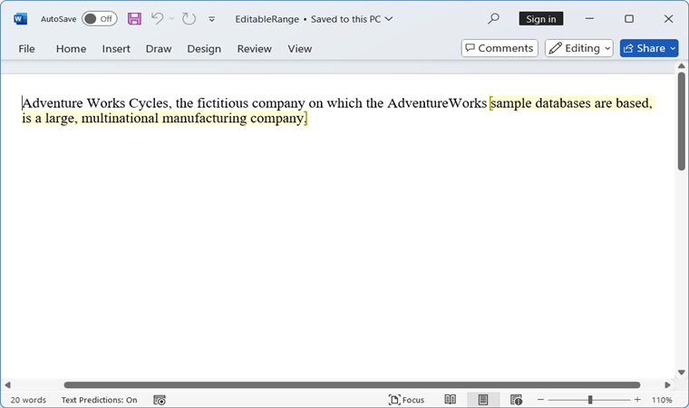
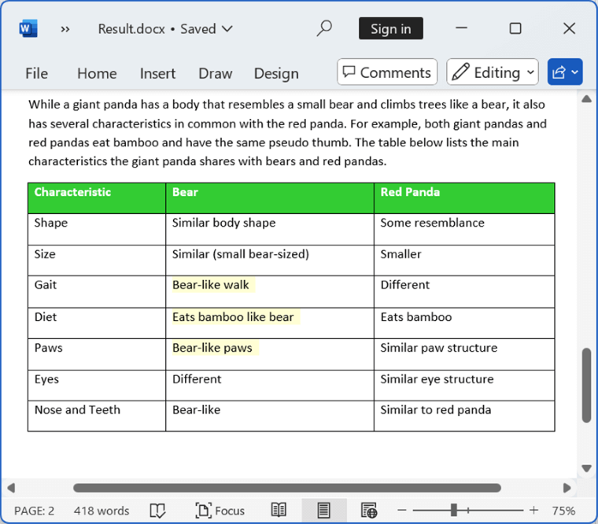

# Working with Security

You can encrypt a Word document with password to restrict unauthorized access. You can also control the types of changes you make to this document.

To quickly encrypt and decrypt a Word document with the .NET Word (DOCIO) Library, please check out this video:


## Encrypting with password

The following code example shows how to encrypt the Word document with password.

N> Refer to the appropriate tabs in the code snippets section: ***C# [Cross-platform]*** for ASP.NET Core, Blazor, Xamarin, UWP, .NET MAUI, and WinUI; ***C# [Windows-specific]*** for WinForms and WPF; ***VB.NET [Windows-specific]*** for VB.NET applications.




//Opens an existing document from stream through constructor of WordDocument class
FileStream fileStreamPath = new FileStream("Template.docx", FileMode.Open, FileAccess.Read, FileShare.ReadWrite);
WordDocument document = new WordDocument(fileStreamPath, FormatType.Automatic);
//Encrypts the Word document with a password
document.EncryptDocument("syncfusion");
//Saves the Word document to MemoryStream
MemoryStream stream = new MemoryStream();
document.Save(stream, FormatType.Docx);
//Closes the document
document.Close();



//Opens an input Word document
WordDocument document = new WordDocument("Template.docx");
//Encrypts the Word document with a password
document.EncryptDocument("syncfusion");
//Saves and closes the Word document instance
document.Save("Sample.docx", FormatType.Docx);
document.Close();



'Opens an input Word document
Dim document As New WordDocument("Template.docx")
'Encrypts the Word document with a password
document.EncryptDocument("syncfusion")
‘Saves and closes the Word document instance
document.Save("Sample.docx", FormatType.Docx)
document.Close()




You can download a complete working sample from [GitHub](https://github.com/SyncfusionExamples/DocIO-Examples/tree/main/Security/Encrypt-Word-document-with-password).

## Opening the encrypted Word document

The following code example shows how to open the encrypted Word document. 




//Opens an existing document from stream through constructor of WordDocument class
FileStream fileStreamPath = new FileStream("Template.docx", FileMode.Open, FileAccess.Read, FileShare.ReadWrite);
//Opens an encrypted Word document
WordDocument document = new WordDocument(fileStreamPath, "password");
//Saves the Word document to MemoryStream
MemoryStream stream = new MemoryStream();
document.Save(stream, FormatType.Docx);
//Closes the document
document.Close();



//Opens an encrypted Word document
WordDocument document = new WordDocument ("Template.docx", "password");
//Saves and closes the Word document instance
document.Save("Sample.docx", FormatType.Docx);
document.Close();



'Opens an encrypted Word document
Dim document As New WordDocument("Template.docx", "password")
‘Saves and closes the Word document instance
document.Save("Sample.docx", FormatType.Docx)
document.Close()



//"App" is the class of Portable project.
Assembly assembly = typeof(App).GetTypeInfo().Assembly;
using (WordDocument document = new WordDocument())
{
    //Loads or opens an existing Word document from stream
    Stream inputStream = assembly.GetManifestResourceStream("CreateWordSample.Assets.Test.doc");
    //Loads or opens an existing Word document through Open method of WordDocument class
    document.Open(inputStream, FormatType.Automatic, "password");
    MemoryStream stream = new MemoryStream();
    //Saves the Word file to MemoryStream
    await document.SaveAsync(stream, FormatType.Doc);
    //Saves the stream as Word file in local machine
    Save(stream, "Result.doc");
    document.Close();
}
//Saves the Word document
async void Save(MemoryStream streams, string filename)
{
    streams.Position = 0;
    StorageFile stFile;
    if (!(Windows.Foundation.Metadata.ApiInformation.IsTypePresent("Windows.Phone.UI.Input.HardwareButtons")))
    {
        FileSavePicker savePicker = new FileSavePicker();
        savePicker.DefaultFileExtension = ".doc";
        savePicker.SuggestedFileName = filename;
        savePicker.FileTypeChoices.Add("Word Documents", new List<string>() {".doc"});
        stFile = await savePicker.PickSaveFileAsync();
    }
    else
    {
        StorageFolder local = Windows.Storage.ApplicationData.Current.LocalFolder;
        stFile = await local.CreateFileAsync(filename, CreationCollisionOption.ReplaceExisting);
    }
    if (stFile != null)
    {
    using (IRandomAccessStream zipStream = await stFile.OpenAsync(FileAccessMode.ReadWrite))
    {
        //Write compressed data from memory to file
        using (Stream outstream = zipStream.AsStreamForWrite())
        {
            byte[] buffer = streams.ToArray();
            outstream.Write(buffer, 0, buffer.Length);
            outstream.Flush();
        }
    }
}
//Launch the saved Word file
await Windows.System.Launcher.LaunchFileAsync(stFile);
}




You can download a complete working sample from [GitHub](https://github.com/SyncfusionExamples/DocIO-Examples/tree/main/Security/Open-encrypted-Word-document).

## Remove encryption

You can open the encrypted Word document and remove the encryption from the document. The following code example shows how to remove the encryption from encrypted Word document.




//Opens an existing document from stream through constructor of WordDocument class
FileStream fileStreamPath = new FileStream("Template.docx", FileMode.Open, FileAccess.Read, FileShare.ReadWrite);
//Opens an encrypted Word document
WordDocument document = new WordDocument(fileStreamPath, FormatType.Docx, "syncfusion");
//Removes encryption in Word document
document.RemoveEncryption();
//Saves the Word document to MemoryStream
MemoryStream stream = new MemoryStream();
document.Save(stream, FormatType.Docx);
//Closes the document
document.Close();



//Opens an encrypted Word document
WordDocument document = new WordDocument("Template.docx", FormatType.Docx, "syncfusion");
//Removes encryption in Word document
document.RemoveEncryption();
//Saves and closes the Word document instance
document.Save("Sample.docx", FormatType.Docx);
document.Close();



'Opens an encrypted Word document
Dim document As New WordDocument("Template.docx", FormatType.Docx, "syncfusion")
'Removes encryption in Word document
document.RemoveEncryption()
‘Saves and closes the Word document instance
document.Save("Sample.docx", FormatType.Docx)
document.Close()



//"App" is the class of Portable project
Assembly assembly = typeof(App).GetTypeInfo().Assembly;
//Create new Word document instance
using (WordDocument document = new WordDocument())
{
    //Loads or opens an existing Word document from stream
    Stream inputStream = assembly.GetManifestResourceStream("Sample.Assets.Template.docx");
    //Loads or opens an existing Word document using the Open method of WordDocument class
    document.Open(inputStream, FormatType.Docx, "password");
    //Removes encryption in Word document
    document.RemoveEncryption();
    MemoryStream stream = new MemoryStream();
    //Saves the Word file to MemoryStream
    document.Save(stream, FormatType.Docx);
    //Closes the Word document instance
    document.Close();
    //Saves the stream as Word file in local machine
    Save(stream, "Sample.Docx");
}
//Refer to the following link to save Word document in UWP platform
//https://help.syncfusion.com/document-processing/word/word-library/net/create-word-document-in-uwp#save-word-document-in-uwp




You can download a complete working sample from [GitHub](https://github.com/SyncfusionExamples/DocIO-Examples/tree/main/Security/Remove-encryption-from-Word-document).

## Protecting Word document from editing

You can restrict a Word document from editing either by providing a password or without password. 

To quickly restrict editing in a Word document using the .NET Word (DOCIO) Library, please check out this video:


The following are the types of protection:

1. [AllowOnlyComments](https://help.syncfusion.com/cr/document-processing/Syncfusion.DocIO.ProtectionType.html): You can add/modify only the comments in the Word document.

2. [AllowOnlyFormFields](https://help.syncfusion.com/cr/document-processing/Syncfusion.DocIO.ProtectionType.html): You can modify the form field values in the Word document.

3. [AllowOnlyRevisions](https://help.syncfusion.com/cr/document-processing/Syncfusion.DocIO.ProtectionType.html): Allow only revisions to be made to existing content. After enabling this flag, accept and reject changes options in Microsoft Word application are disabled.

4. [AllowOnlyReading](https://help.syncfusion.com/cr/document-processing/Syncfusion.DocIO.ProtectionType.html): You can only view the content in the Word document.

5. [NoProtection](https://help.syncfusion.com/cr/document-processing/Syncfusion.DocIO.ProtectionType.html): You can access/edit the Word document contents as normally.

The following code example shows how to restrict editing to modify only form fields in a Word document.




FileStream fileStreamPath = new FileStream("Template.docx", FileMode.Open, FileAccess.Read, FileShare.ReadWrite);
//Opens an existing document from file system through constructor of WordDocument class
using (WordDocument document = new WordDocument(fileStreamPath, FormatType.Docx))
{
    //Sets the protection with password and it allows only to modify the form fields type
    document.Protect(ProtectionType.AllowOnlyFormFields, "password"); 
    MemoryStream stream = new MemoryStream();
    document.Save(stream, FormatType.docx);
    //Closes the Word document
    document.Close();
}



//Opens a Word document
WordDocument document = new WordDocument(@"Template.docx");
//Sets the protection with password and it allows only to modify the form fields type
document.Protect(ProtectionType.AllowOnlyFormFields, "password"); 
//Saves the Word document
document.Save("Protection.docx", FormatType.Docx);
document.Close();



'Opens a Word document
Dim document As New WordDocument("Template.docx")
'Sets the protection with password and it allows only to modify the form fields type
document.Protect(ProtectionType.AllowOnlyFormFields, "password")
'Saves the Word document
document.Save("Protection.docx", FormatType.Docx)
document.Close()




You can download a complete working sample from [GitHub](https://github.com/SyncfusionExamples/DocIO-Examples/tree/main/Security/Allow-editing-form-fields-only).

## Editable ranges

An **editable range** is a portion of a Word document that allows editing even when the document is protected. In the Syncfusion .NET Word library (DocIO), editable ranges are represented using the **EditableRange** class. You can define these ranges programmatically to allow user edits within protected documents.

### Add an editable range

You can add an editable range in the Word document by using **AppendEditableRangeStart** and **AppendEditableRangeEnd** methods of [WParagraph](https://help.syncfusion.com/cr/document-processing/Syncfusion.DocIO.DLS.WParagraph.html) class.

The following code example illustrates how to add an editable range in the Word document.

N> 1. DocIO supports editable ranges in DOCX format documents only.
N> 2. Refer to the appropriate tabs in the code snippets section: **C# [Cross-platform]** for ASP.NET Core, Blazor, Xamarin, UWP, .NET MAUI, and WinUI; **C# [Windows-specific]** for WinForms and WPF; **VB.NET [Windows-specific]** for VB.NET applications.




//Create a Word document
using (WordDocument document = new WordDocument())
{
    //Add a section and a paragraph to the Word document
    document.EnsureMinimal();
    WParagraph paragraph = document.LastParagraph;

    //Append text to the paragraph
    paragraph.AppendText("Adventure Works Cycles, the fictitious company on which the AdventureWorks ");

    //Add an editable range to the paragraph
    EditableRangeStart editableRangeStart = paragraph.AppendEditableRangeStart();
    paragraph.AppendText("sample databases are based, is a large, multinational manufacturing company.");
    paragraph.AppendEditableRangeEnd(editableRangeStart);

    //Set protection with a password to allow read-only access
    document.Protect(ProtectionType.AllowOnlyReading, "password");

    //Save the Word document to a MemoryStream
    MemoryStream stream = new MemoryStream();
    document.Save(stream, FormatType.Docx);
}



//Create a Word document
using (WordDocument document = new WordDocument())
{
    //Add a section and a paragraph to the Word document
    document.EnsureMinimal();
    WParagraph paragraph = document.LastParagraph;

    //Append text to the paragraph
    paragraph.AppendText("Adventure Works Cycles, the fictitious company on which the AdventureWorks ");

    //Add an editable range to the paragraph
    EditableRangeStart editableRangeStart = paragraph.AppendEditableRangeStart();
    paragraph.AppendText("sample databases are based, is a large, multinational manufacturing company.");
    paragraph.AppendEditableRangeEnd(editableRangeStart);

    //Set protection with a password to allow read-only access
    document.Protect(ProtectionType.AllowOnlyReading, "password");

    //Save the Word document
    document.Save("EditableRange.docx", FormatType.Docx);
}



'Creates a Word document
Using document As WordDocument = New WordDocument()
    'Adds a section and a paragraph in the document
    document.EnsureMinimal()
    Dim paragraph As WParagraph = document.LastParagraph

    'Append text into the paragraph
    paragraph.AppendText("Adventure Works Cycles, the fictitious company on which the AdventureWorks ")

    'Adds an editable range to the paragraph
    Dim editableRangeStart As EditableRangeStart = paragraph.AppendEditableRangeStart()
    paragraph.AppendText("sample databases are based, is a large, multinational manufacturing company.")
    paragraph.AppendEditableRangeEnd(editableRangeStart)

    'Sets the protection with password and allows only reading
    document.Protect(ProtectionType.AllowOnlyReading, "password")

    'Saves the Word document
    document.Save("EditableRange.docx", FormatType.Docx)
End Using




By running the above code, you will generate a **Editable range** as shown below.

You can download a complete working sample from [GitHub](https://github.com/SyncfusionExamples/DocIO-Examples/tree/main/Security/Add-editable-range).

### Retrieve Id of an editable range

You can retrieve the ID of an editable range using the **Id** property of the **EditableRange** class. 

The following code example illustrates how to retrieve the ID of an editable range from a Word document.




//Creates a Word document
using (WordDocument document = new WordDocument())
{
    //Adds a section and a paragraph in the Word document
    document.EnsureMinimal();
    WParagraph paragraph = document.LastParagraph;

    //Append text into the paragraph
    paragraph.AppendText("Adventure Works Cycles, the fictitious company on which the AdventureWorks ");

    //Adds an editable range to the paragraph
    EditableRangeStart editableRangeStart = paragraph.AppendEditableRangeStart();
    paragraph.AppendText("sample databases are based, is a large, multinational manufacturing company.");
    paragraph.AppendEditableRangeEnd(editableRangeStart);

    //Retrieve the editable range Id
    string editableRangeId = editableRangeStart.Id;

    //Sets the protection with password and allows only reading
    document.Protect(ProtectionType.AllowOnlyReading, "password");

    //Saves the Word document to MemoryStream
    MemoryStream stream = new MemoryStream();
    document.Save(stream, FormatType.Docx);
}



//Creates a Word document
using (WordDocument document = new WordDocument())
{
    //Adds a section and a paragraph in the Word document
    document.EnsureMinimal();
    WParagraph paragraph = document.LastParagraph;

    //Append text into the paragraph
    paragraph.AppendText("Adventure Works Cycles, the fictitious company on which the AdventureWorks ");

    //Adds an editable range to the paragraph
    EditableRangeStart editableRangeStart = paragraph.AppendEditableRangeStart();
    paragraph.AppendText("sample databases are based, is a large, multinational manufacturing company.");
    paragraph.AppendEditableRangeEnd(editableRangeStart);

    //Retrieve the editable range Id
    string editableRangeId = editableRangeStart.Id;

    //Sets the protection with password and allows only reading
    document.Protect(ProtectionType.AllowOnlyReading, "password");

    //Saves the Word document
    document.Save("EditableRange.docx", FormatType.Docx);
}



'Creates a Word document
Using document As WordDocument = New WordDocument()
    'Adds a section and a paragraph in the document
    document.EnsureMinimal()
    Dim paragraph As WParagraph = document.LastParagraph

    'Append text into the paragraph
    paragraph.AppendText("Adventure Works Cycles, the fictitious company on which the AdventureWorks ")

    'Adds an editable range to the paragraph
    Dim editableRangeStart As EditableRangeStart = paragraph.AppendEditableRangeStart()
    paragraph.AppendText("sample databases are based, is a large, multinational manufacturing company.")
    paragraph.AppendEditableRangeEnd(editableRangeStart)

    'Retrieve the editable range Id
    Dim editableRangeId As String = editableRangeStart.Id

    'Sets the protection with password and allows only reading
    document.Protect(ProtectionType.AllowOnlyReading, "password")

    'Saves the Word document
    document.Save("EditableRange.docx", FormatType.Docx)
End Using




You can download a complete working sample from [GitHub](https://github.com/SyncfusionExamples/DocIO-Examples/tree/main/Security/Retrieve-editable-range-id).

### Find an editable range

You can find an editable range of specific id in the collection of editable ranges through **FindById** method of **EditableRangeCollection** class. 

The following code example illustrates how to find the editable range in a Word document.




//Loads an existing Word document
using (FileStream fileStreamPath = new FileStream("Template.docx", FileMode.Open, FileAccess.Read, FileShare.ReadWrite))
{
    using (WordDocument document = new WordDocument(fileStreamPath, FormatType.Docx))
    {
        //Get the editable range by Id
        EditableRange editableRange = document.EditableRanges.FindById("0");

        //Saves the Word document to MemoryStream
        MemoryStream stream = new MemoryStream();
        document.Save(stream, FormatType.Docx);
    }
}



//Loads an existing Word document
using (WordDocument document = new WordDocument("Template.docx"))
{
    //Get the editable range by Id
    EditableRange editableRange = document.EditableRanges.FindById("0");

    //Saves the Word document
    document.Save("EditableRange.docx", FormatType.Docx);
}



'Loads an existing Word document
Using document As WordDocument = New WordDocument("Template.docx")

    'Get the editable range by Id
    Dim editableRange As EditableRange = document.EditableRanges.FindById("0")

    'Saves the Word document
    document.Save("EditableRange.docx", FormatType.Docx)
End Using




You can download a complete working sample from [GitHub](https://github.com/SyncfusionExamples/DocIO-Examples/tree/main/Security/Find-editable-range-by-id).

### Remove an editable range

You can remove an editable range using the **Remove** method of the **EditableRangeCollection** class.

The following code example demonstrates how to remove an editable range from a Word document.




//Loads an existing Word document
using (FileStream fileStreamPath = new FileStream("Template.docx", FileMode.Open, FileAccess.Read, FileShare.ReadWrite))
{    
    using (WordDocument document = new WordDocument(fileStreamPath, FormatType.Docx))
    {
        //Get the editable range by Id
        EditableRange editableRange = document.EditableRanges.FindById("0");

        //Remove the editable range
        document.EditableRanges.Remove(editableRange);

        //Saves the Word document to MemoryStream
        MemoryStream stream = new MemoryStream();
        document.Save(stream, FormatType.Docx);
    }
}



//Loads an existing Word document
using (WordDocument document = new WordDocument("Template.docx"))
{
    //Get the editable range by Id
    EditableRange editableRange = document.EditableRanges.FindById("0");

    //Remove the editable range
    document.EditableRanges.Remove(editableRange);

    //Saves the Word document
    document.Save("EditableRange.docx", FormatType.Docx);
}



'Loads an existing Word document
Using document As WordDocument = New WordDocument("Template.docx")

    'Get the editable range by Id
    Dim editableRange As EditableRange = document.EditableRanges.FindById("0")

    'Remove the editable range
    document.EditableRanges.Remove(editableRange)

    'Saves the Word document
    document.Save("EditableRange.docx", FormatType.Docx)
End Using




You can download a complete working sample from [GitHub](https://github.com/SyncfusionExamples/DocIO-Examples/tree/main/Security/Remove-editable-range).

An editable range at a specific index can also be removed from the **EditableRangeCollection** using the **RemoveAt** method.

The following code example demonstrates how to remove an editable range at particular index from a Word document.




//Loads an existing Word document
using (FileStream fileStreamPath = new FileStream("Template.docx", FileMode.Open, FileAccess.Read, FileShare.ReadWrite))
{                
    using (WordDocument document = new WordDocument(fileStreamPath, FormatType.Docx))
    {
        //Remove the editable range at a particular index
        document.EditableRanges.RemoveAt(1);

        //Saves the Word document to MemoryStream
        MemoryStream stream = new MemoryStream();
        document.Save(stream, FormatType.Docx);
    }
}



//Loads an existing Word document
using (WordDocument document = new WordDocument("Template.docx"))
{
    //Remove the editable range at a particular index
    document.EditableRanges.RemoveAt(1);

    //Saves the Word document
    document.Save("EditableRange.docx", FormatType.Docx);
}



'Loads an existing Word document
Using document As WordDocument = New WordDocument("Template.docx")

    'Remove the editable range at a particular index
    document.EditableRanges.RemoveAt(1)

    'Saves the Word document
    document.Save("EditableRange.docx", FormatType.Docx)
End Using




You can download a complete working sample from [GitHub](https://github.com/SyncfusionExamples/DocIO-Examples/tree/main/Security/Remove-editable-range-at-an-index).

### Editing permission
You can restrict editable ranges to specific groups or individuals.

#### Group permission

You can make an editable range editable by a group using the **EditorGroup** property of the **EditableRange** class.

The following code example illustrates how to make an editable range available to a group in a Word document.




//Creates a Word document
using (WordDocument document = new WordDocument())
{
    //Adds a section and a paragraph in the Word document
    document.EnsureMinimal();
    WParagraph paragraph = document.LastParagraph;

    //Append text into the paragraph
    paragraph.AppendText("Adventure Works Cycles, the fictitious company on which the AdventureWorks ");

    //Adds an editable range to the paragraph
    EditableRangeStart editableRangeStart = paragraph.AppendEditableRangeStart();

    //Set the editor group
    editableRangeStart.EditorGroup = EditorType.Everyone;

    paragraph.AppendText("sample databases are based, is a large, multinational manufacturing company.");
    paragraph.AppendEditableRangeEnd(editableRangeStart);

    //Sets the protection with password and allows only reading
    document.Protect(ProtectionType.AllowOnlyReading, "password");

    //Saves the Word document to MemoryStream
    MemoryStream stream = new MemoryStream();
    document.Save(stream, FormatType.Docx);
}



//Creates a Word document
using (WordDocument document = new WordDocument())
{
    //Adds a section and a paragraph in the Word document
    document.EnsureMinimal();
    WParagraph paragraph = document.LastParagraph;

    //Append text into the paragraph
    paragraph.AppendText("Adventure Works Cycles, the fictitious company on which the AdventureWorks ");

    //Adds an editable range to the paragraph
    EditableRangeStart editableRangeStart = paragraph.AppendEditableRangeStart();

    //Set the editor group
    editableRangeStart.EditorGroup = EditorType.Everyone;

    paragraph.AppendText("sample databases are based, is a large, multinational manufacturing company.");
    paragraph.AppendEditableRangeEnd(editableRangeStart);

    //Sets the protection with password and allows only reading
    document.Protect(ProtectionType.AllowOnlyReading, "password");

    //Saves the Word document
    document.Save("EditableRange.docx", FormatType.Docx);
}



'Creates a Word document
Using document As WordDocument = New WordDocument()
    'Adds a section and a paragraph in the document
    document.EnsureMinimal()
    Dim paragraph As WParagraph = document.LastParagraph

    'Append text into the paragraph
    paragraph.AppendText("Adventure Works Cycles, the fictitious company on which the AdventureWorks ")

    'Adds an editable range to the paragraph
    Dim editableRangeStart As EditableRangeStart = paragraph.AppendEditableRangeStart()

    'Set the editor group
    editableRangeStart.EditorGroup = EditorType.Everyone

    paragraph.AppendText("sample databases are based, is a large, multinational manufacturing company.")
    paragraph.AppendEditableRangeEnd(editableRangeStart)

    'Sets the protection with password and allows only reading
    document.Protect(ProtectionType.AllowOnlyReading, "password")

    'Saves the Word document
    document.Save("EditableRange.docx", FormatType.Docx)
End Using




You can download a complete working sample from [GitHub](https://github.com/SyncfusionExamples/DocIO-Examples/tree/main/Security/Group-permission-for-editable-range).

#### Single user permission

Use the **SingleUser** property of the **EditableRange** class to make an editable range available to a single user for editing.

The following code example illustrates how to make an editable range available to a single user in a Word document.




//Creates a Word document
using (WordDocument document = new WordDocument())
{
    //Adds a section and a paragraph in the Word document
    document.EnsureMinimal();
    WParagraph paragraph = document.LastParagraph;

    //Append text into the paragraph
    paragraph.AppendText("Adventure Works Cycles, the fictitious company on which the AdventureWorks ");

    //Adds an editable range to the paragraph
    EditableRangeStart editableRangeStart = paragraph.AppendEditableRangeStart();

    //Set the single user
    editableRangeStart.SingleUser = "user@domain.com";

    paragraph.AppendText("sample databases are based, is a large, multinational manufacturing company.");
    paragraph.AppendEditableRangeEnd(editableRangeStart);

    //Sets the protection with password and allows only reading
    document.Protect(ProtectionType.AllowOnlyReading, "password");

    //Saves the Word document to MemoryStream
    MemoryStream stream = new MemoryStream();
    document.Save(stream, FormatType.Docx);
}



//Creates a Word document
using (WordDocument document = new WordDocument())
{
    //Adds a section and a paragraph in the Word document
    document.EnsureMinimal();
    WParagraph paragraph = document.LastParagraph;

    //Append text into the paragraph
    paragraph.AppendText("Adventure Works Cycles, the fictitious company on which the AdventureWorks ");

    //Adds an editable range to the paragraph
    EditableRangeStart editableRangeStart = paragraph.AppendEditableRangeStart();

    //Set the single user
    editableRangeStart.SingleUser = "user@domain.com";

    paragraph.AppendText("sample databases are based, is a large, multinational manufacturing company.");
    paragraph.AppendEditableRangeEnd(editableRangeStart);

    //Sets the protection with password and allows only reading
    document.Protect(ProtectionType.AllowOnlyReading, "password");

    //Saves the Word document
    document.Save("EditableRange.docx", FormatType.Docx);
}



'Creates a Word document
Using document As WordDocument = New WordDocument()
    'Adds a section and a paragraph in the document
    document.EnsureMinimal()
    Dim paragraph As WParagraph = document.LastParagraph

    'Append text into the paragraph
    paragraph.AppendText("Adventure Works Cycles, the fictitious company on which the AdventureWorks ")

    'Adds an editable range to the paragraph
    Dim editableRangeStart As EditableRangeStart = paragraph.AppendEditableRangeStart()

    'Set the single user
    editableRangeStart.SingleUser = "user@domain.com"

    paragraph.AppendText("sample databases are based, is a large, multinational manufacturing company.")
    paragraph.AppendEditableRangeEnd(editableRangeStart)

    'Sets the protection with password and allows only reading
    document.Protect(ProtectionType.AllowOnlyReading, "password")

    'Saves the Word document
    document.Save("EditableRange.docx", FormatType.Docx)
End Using




You can download a complete working sample from [GitHub](https://github.com/SyncfusionExamples/DocIO-Examples/tree/main/Security/Single-user-permission-for-editable-range).

### Add editable range in a table

Using the **FirstColumn** and **LastColumn** properties of the **EditableRange** class, you can specify the starting and ending columns of an editable range within a table.

The following code example illustrates how to add an editable range inside a table in a Word document.




//Loads an existing Word document.
using (WordDocument document = new WordDocument(Path.GetFullPath(@"Data/Template.docx")))
{
    // Access the first table in the first section of the document
    WTable table = document.Sections[0].Tables[0] as WTable;
    // Access the paragraph in the third row and third column of the table
    WParagraph paragraph = table[2, 2].ChildEntities[0] as WParagraph;
    // Create a new editable range start for the table cell paragraph
    EditableRangeStart editableRangeStart = new EditableRangeStart(document);
    // Insert the editable range start at the beginning of the paragraph
    paragraph.ChildEntities.Insert(0, editableRangeStart);
    // Set the editor group for the editable range to allow everyone to edit
    editableRangeStart.EditorGroup = EditorType.Everyone;
    // Apply editable range to second column only
    editableRangeStart.FirstColumn = 1;
    editableRangeStart.LastColumn = 1;
    // Access the paragraph
    paragraph = table[5, 2].ChildEntities[0] as WParagraph;
    // Append an editable range end to close the editable region
    paragraph.AppendEditableRangeEnd();
    //Sets the protection with password and allows only reading
    document.Protect(ProtectionType.AllowOnlyReading, "password");
    //Saves the Word document to MemoryStream
    MemoryStream stream = new MemoryStream();
    document.Save(stream, FormatType.Docx); 
}



//Loads an existing Word document.
using (WordDocument document = new WordDocument(Path.GetFullPath(@"Data/Template.docx")))
{
    // Access the first table in the first section of the document
    WTable table = document.Sections[0].Tables[0] as WTable;
    // Access the paragraph in the third row and third column of the table
    WParagraph paragraph = table[2, 2].ChildEntities[0] as WParagraph;
    // Create a new editable range start for the table cell paragraph
    EditableRangeStart editableRangeStart = new EditableRangeStart(document);
    // Insert the editable range start at the beginning of the paragraph
    paragraph.ChildEntities.Insert(0, editableRangeStart);
    // Set the editor group for the editable range to allow everyone to edit
    editableRangeStart.EditorGroup = EditorType.Everyone;
    // Apply editable range to second column only
    editableRangeStart.FirstColumn = 1;
    editableRangeStart.LastColumn = 1;
    // Access the paragraph
    paragraph = table[5, 2].ChildEntities[0] as WParagraph;
    // Append an editable range end to close the editable region
    paragraph.AppendEditableRangeEnd();
    //Sets the protection with password and allows only reading
    document.Protect(ProtectionType.AllowOnlyReading, "password");
    //Saves the Word document
    document.Save("Result.docx", FormatType.Docx);
}



' Load an existing Word document.
Using document As New WordDocument(Path.GetFullPath("Data\Template.docx"))
    ' Access the first table in the first section of the document.
    Dim table As WTable = TryCast(document.Sections(0).Tables(0), WTable)
    ' Access the paragraph in the third row and third column of the table.
    Dim paragraph As WParagraph = TryCast(table(2, 2).ChildEntities(0), WParagraph)
    ' Create a new editable range start for the table cell paragraph.
    Dim editableRangeStart As New EditableRangeStart(document)
    ' Insert the editable range start at the beginning of the paragraph.
    paragraph.ChildEntities.Insert(0, editableRangeStart)
    ' Set the editor group for the editable range to allow everyone to edit.
    editableRangeStart.EditorGroup = EditorType.Everyone
    ' Apply editable range to the second column only.
    editableRangeStart.FirstColumn = 1
    editableRangeStart.LastColumn = 1
    ' Access the paragraph.
    paragraph = TryCast(table(5, 2).ChildEntities(0), WParagraph)
    ' Append an editable range end to close the editable region.
    paragraph.AppendEditableRangeEnd()
    ' Set the protection with password and allow only reading.
    document.Protect(ProtectionType.AllowOnlyReading, "password")
    ' Save the Word document.
    document.Save("Result.docx", FormatType.Docx)
End Using




By running the above code, you will generate a **Editable range** as shown below.

You can download a complete working sample from [GitHub](https://github.com/SyncfusionExamples/DocIO-Examples/tree/main/Security/Add-editable-range-in-a-table).

N> 1. Editable ranges are supported only in DOCX format.
N> 2. The **SingleUser** and **EditorGroup** properties cannot be set simultaneously for the same editable range. Setting one will clear the other.

## Online Demo

* Explore how to encrypt and decrypt the Word document using the .NET Word Library (DocIO) in a live demo [here](https://document.syncfusion.com/demos/word/encryptanddecrypt#/tailwind).  
* See how to protect the Word document from editing using the .NET Word Library (DocIO) in a live demo [here](https://document.syncfusion.com/demos/word/documentprotection#/tailwind).
