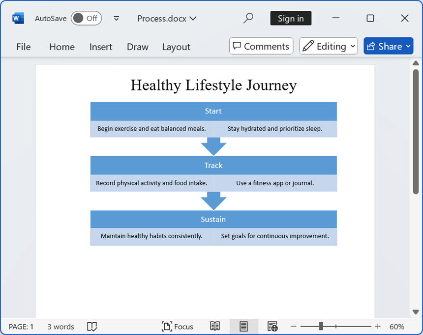

# Working with SmartArt

A SmartArt diagram is a visual representation of information that helps effectively communicate ideas in documents. You can add and modify SmartArt diagrams in Word documents using the Syncfusion&reg; Word library (DocIO).

## Create SmartArt 

You can create the following categories of SmartArt in a Word document.

* **List** – Displays information in a list format.
* **Process** – Illustrates steps in a process or workflow.
* **Cycle** – Represents a continuous cycle or loop.
* **Hierarchy** – Shows hierarchical relationships, such as organizational structures.
* **Relationship** – Depicts connections between different elements.
* **Matrix** – Displays relationships between parts and a whole.
* **Pyramid** – Represents information in a layered or hierarchical format.
* **Picture** – Uses images to enhance the visual representation of data.

N> DocIO supports SmartArt only in DOCX format document.

### List

The following code example illustrating how to create a **List SmartArt** in a Word document.




//Creates a new Word document.
WordDocument document = new WordDocument();
//Adds new section to the document.
IWSection section = document.AddSection();
//Adds new paragraph to the section.
IWParagraph paragraph = section.AddParagraph();
paragraph.ParagraphFormat.HorizontalAlignment = HorizontalAlignment.Center;
IWTextRange textRange = paragraph.AppendText("Project Planning List");
textRange.CharacterFormat.FontSize = 28f;
paragraph = section.AddParagraph();
paragraph = section.AddParagraph();
paragraph.ParagraphFormat.HorizontalAlignment = HorizontalAlignment.Center;
// Add SmartArt with "Vertical Chevron List" layout.
WSmartArt verticalChevronListSmartArt = paragraph.AppendSmartArt(OfficeSmartArtType.VerticalChevronList, 432, 252);
// Add the "Planning" phase node.
IOfficeSmartArtNode planningNode = verticalChevronListSmartArt.Nodes[0];
planningNode.TextBody.Text = "Planning";
planningNode.TextBody.Paragraphs[0].TextParts[0].Font.FontSize = 15f;
AddSmartArtChildNode(planningNode, "Set clear objectives.", "Allocate resources effectively.", 23f);
// Add the "Execution" phase node.
IOfficeSmartArtNode executionNode = verticalChevronListSmartArt.Nodes[1];
executionNode.TextBody.Text = "Execution";
executionNode.TextBody.Paragraphs[0].TextParts[0].Font.FontSize = 15f;
AddSmartArtChildNode(executionNode, "Assign tasks to the team.", "Track progress regularly.", 23f);
// Add the "Review" phase node.
IOfficeSmartArtNode reviewNode = verticalChevronListSmartArt.Nodes[2];
reviewNode.TextBody.Text = "Review";
reviewNode.TextBody.Paragraphs[0].TextParts[0].Font.FontSize = 15f;
AddSmartArtChildNode(reviewNode, "Analyze outcomes.", "Identify lessons learned.", 23f);
//Saves the Word document to MemoryStream
MemoryStream stream = new MemoryStream();
document.Save(stream, FormatType.Docx);
//Closes the document
document.Close();



//Creates a new Word document.
WordDocument document = new WordDocument();
//Adds new section to the document.
IWSection section = document.AddSection();
//Adds new paragraph to the section.
IWParagraph paragraph = section.AddParagraph();
paragraph.ParagraphFormat.HorizontalAlignment = HorizontalAlignment.Center;
IWTextRange textRange = paragraph.AppendText("Project Planning List");
textRange.CharacterFormat.FontSize = 28f;
paragraph = section.AddParagraph();
paragraph = section.AddParagraph();
paragraph.ParagraphFormat.HorizontalAlignment = HorizontalAlignment.Center;
// Add SmartArt with "Vertical Chevron List" layout.
WSmartArt verticalChevronListSmartArt = paragraph.AppendSmartArt(OfficeSmartArtType.VerticalChevronList, 432, 252);
// Add the "Planning" phase node.
IOfficeSmartArtNode planningNode = verticalChevronListSmartArt.Nodes[0];
planningNode.TextBody.Text = "Planning";
planningNode.TextBody.Paragraphs[0].TextParts[0].Font.FontSize = 15f;
AddSmartArtChildNode(planningNode, "Set clear objectives.", "Allocate resources effectively.", 23f);
// Add the "Execution" phase node.
IOfficeSmartArtNode executionNode = verticalChevronListSmartArt.Nodes[1];
executionNode.TextBody.Text = "Execution";
executionNode.TextBody.Paragraphs[0].TextParts[0].Font.FontSize = 15f;
AddSmartArtChildNode(executionNode, "Assign tasks to the team.", "Track progress regularly.", 23f);
// Add the "Review" phase node.
IOfficeSmartArtNode reviewNode = verticalChevronListSmartArt.Nodes[2];
reviewNode.TextBody.Text = "Review";
reviewNode.TextBody.Paragraphs[0].TextParts[0].Font.FontSize = 15f;
AddSmartArtChildNode(reviewNode, "Analyze outcomes.", "Identify lessons learned.", 23f);
//Saves the Word document
document.Save("Result.docx", FormatType.Docx);
//Closes the document
document.Close();



Dim document As New WordDocument()
Dim section As IWSection = document.AddSection()
' Retrieves the first paragraph and add text.
Dim paragraph As IWParagraph = section.AddParagraph()
paragraph.ParagraphFormat.HorizontalAlignment = HorizontalAlignment.Center
Dim textRange As IWTextRange = paragraph.AppendText("Project Planning List")
textRange.CharacterFormat.FontSize = 28.0F
paragraph = section.AddParagraph()
paragraph = section.AddParagraph()
paragraph.ParagraphFormat.HorizontalAlignment = HorizontalAlignment.Center
' Add SmartArt with "Vertical Chevron List" layout.
Dim verticalChevronListSmartArt As WSmartArt = paragraph.AppendSmartArt(OfficeSmartArtType.VerticalChevronList, 432, 252)
' Add the "Planning" phase node.
Dim planningNode As IOfficeSmartArtNode = verticalChevronListSmartArt.Nodes(0)
planningNode.TextBody.Text = "Planning"
planningNode.TextBody.Paragraphs(0).TextParts(0).Font.FontSize = 15.0F
AddSmartArtChildNode(planningNode, "Set clear objectives.", "Allocate resources effectively.", 23.0F)
' Add the "Execution" phase node.
Dim executionNode As IOfficeSmartArtNode = verticalChevronListSmartArt.Nodes(1)
executionNode.TextBody.Text = "Execution"
executionNode.TextBody.Paragraphs(0).TextParts(0).Font.FontSize = 15.0F
AddSmartArtChildNode(executionNode, "Assign tasks to the team.", "Track progress regularly.", 23.0F)
' Add the "Review" phase node.
Dim reviewNode As IOfficeSmartArtNode = verticalChevronListSmartArt.Nodes(2)
reviewNode.TextBody.Text = "Review"
reviewNode.TextBody.Paragraphs(0).TextParts(0).Font.FontSize = 15.0F
AddSmartArtChildNode(reviewNode, "Analyze outcomes.", "Identify lessons learned.", 23.0F)
' Saves the Word document
document.Save("Result.docx", FormatType.Docx)
' Closes the document
document.Close()




The following code example shows AddSmartArtChildNode, which is used to add child nodes to a given SmartArt node and apply formatting.




private void AddSmartArtChildNode(IOfficeSmartArtNode node, string childText1, string childText2, float fontSize)
{
    node.ChildNodes[0].TextBody.Text = childText1;
    node.ChildNodes[1].TextBody.Text = childText2;
    for (int i = 0; i < node.ChildNodes.Count; i++)
    {
        node.ChildNodes[i].TextBody.Paragraphs[0].TextParts[0].Font.FontSize = fontSize;
    }
}



private void AddSmartArtChildNode(IOfficeSmartArtNode node, string childText1, string childText2, float fontSize)
{
    node.ChildNodes[0].TextBody.Text = childText1;
    node.ChildNodes[1].TextBody.Text = childText2;
    for (int i = 0; i < node.ChildNodes.Count; i++)
    {
        node.ChildNodes[i].TextBody.Paragraphs[0].TextParts[0].Font.FontSize = fontSize;
    }
}



Private Sub AddSmartArtChildNode(node As IOfficeSmartArtNode, childText1 As String, childText2 As String, fontSize As Single)
    node.ChildNodes(0).TextBody.Text = childText1
    node.ChildNodes(1).TextBody.Text = childText2
    For i As Integer = 0 To node.ChildNodes.Count - 1
        node.ChildNodes(i).TextBody.Paragraphs(0).TextParts(0).Font.FontSize = fontSize
    Next
End Sub





By running the above code, you will generate a **List SmartArt** as shown below.

You can download a complete working sample from [GitHub](https://github.com/SyncfusionExamples/DocIO-Examples/tree/main/SmartArts/Create-SmartArt-List/.NET/).

### Process

The following code example illustrating how to create a **Process SmartArt** in a Word document.




//Creates a new Word document.
WordDocument document = new WordDocument();
//Adds new section to the document
IWSection section = document.AddSection();
//Adds new paragraph to the section.
IWParagraph paragraph = section.AddParagraph();
paragraph.ParagraphFormat.HorizontalAlignment = HorizontalAlignment.Center;
IWTextRange textRange1 = paragraph.AppendText("Healthy Lifestyle Journey");
textRange1.CharacterFormat.FontSize = 28f;
textRange1.CharacterFormat.FontName = "Times New Roman";
paragraph = section.AddParagraph();
paragraph = section.AddParagraph();
paragraph.ParagraphFormat.HorizontalAlignment = HorizontalAlignment.Center;
// Add SmartArt with "Segmented Process" layout
WSmartArt segmentedProcessSmartArt = paragraph.AppendSmartArt(OfficeSmartArtType.SegmentedProcess, 432, 252);
// Add the "Start" phase node
IOfficeSmartArtNode startProcess = segmentedProcessSmartArt.Nodes[0];
startProcess.TextBody.Text = "Start";
startProcess.TextBody.Paragraphs[0].TextParts[0].Font.FontSize = 15f;
AddSmartArtChildNode(startProcess, "Begin exercise and eat balanced meals.", "Stay hydrated and prioritize sleep.", 12f);
// Add the "Track" phase node
IOfficeSmartArtNode trackProcess = segmentedProcessSmartArt.Nodes[1];
trackProcess.TextBody.Text = "Track";
trackProcess.TextBody.Paragraphs[0].TextParts[0].Font.FontSize = 15f;
AddSmartArtChildNode(trackProcess, "Record physical activity and food intake.", "Use a fitness app or journal.", 12f);
// Add the "Sustain" phase node
IOfficeSmartArtNode sustainProcess = segmentedProcessSmartArt.Nodes[2];
sustainProcess.TextBody.Text = "Sustain";
sustainProcess.TextBody.Paragraphs[0].TextParts[0].Font.FontSize = 15f;
AddSmartArtChildNode(sustainProcess, "Maintain healthy habits consistently.", "Set goals for continuous improvement.", 12f);
//Saves the Word document to MemoryStream
MemoryStream stream = new MemoryStream();
document.Save(stream, FormatType.Docx);
//Closes the document
document.Close();



//Creates a new Word document.
WordDocument document = new WordDocument();
//Adds new section to the document.
IWSection section = document.AddSection();
//Adds new paragraph to the section.
IWParagraph paragraph = section.AddParagraph();
paragraph.ParagraphFormat.HorizontalAlignment = HorizontalAlignment.Center;
IWTextRange textRange1 = paragraph.AppendText("Healthy Lifestyle Journey");
textRange1.CharacterFormat.FontSize = 28f;
textRange1.CharacterFormat.FontName = "Times New Roman";
paragraph = section.AddParagraph();
paragraph = section.AddParagraph();
paragraph.ParagraphFormat.HorizontalAlignment = HorizontalAlignment.Center;
// Add SmartArt with "Segmented Process" layout
WSmartArt segmentedProcessSmartArt = paragraph.AppendSmartArt(OfficeSmartArtType.SegmentedProcess, 432, 252);
// Add the "Start" phase node
IOfficeSmartArtNode startProcess = segmentedProcessSmartArt.Nodes[0];
startProcess.TextBody.Text = "Start";
startProcess.TextBody.Paragraphs[0].TextParts[0].Font.FontSize = 15f;
AddSmartArtChildNode(startProcess, "Begin exercise and eat balanced meals.", "Stay hydrated and prioritize sleep.", 12f);
// Add the "Track" phase node
IOfficeSmartArtNode trackProcess = segmentedProcessSmartArt.Nodes[1];
trackProcess.TextBody.Text = "Track";
trackProcess.TextBody.Paragraphs[0].TextParts[0].Font.FontSize = 15f;
AddSmartArtChildNode(trackProcess, "Record physical activity and food intake.", "Use a fitness app or journal.", 12f);
// Add the "Sustain" phase node
IOfficeSmartArtNode sustainProcess = segmentedProcessSmartArt.Nodes[2];
sustainProcess.TextBody.Text = "Sustain";
sustainProcess.TextBody.Paragraphs[0].TextParts[0].Font.FontSize = 15f;
AddSmartArtChildNode(sustainProcess, "Maintain healthy habits consistently.", "Set goals for continuous improvement.", 12f);
//Saves the Word document
document.Save("Result.docx", FormatType.Docx);
//Closes the document
document.Close();



Dim document As New WordDocument()
Dim section As IWSection = document.AddSection()
' Retrieves the first paragraph and add text.
Dim paragraph As IWParagraph = section.AddParagraph()
paragraph.ParagraphFormat.HorizontalAlignment = HorizontalAlignment.Center
Dim textRange1 As IWTextRange = paragraph.AppendText("Healthy Lifestyle Journey")
textRange1.CharacterFormat.FontSize = 28.0F
textRange1.CharacterFormat.FontName = "Times New Roman"
paragraph = section.AddParagraph()
paragraph = section.AddParagraph()
paragraph.ParagraphFormat.HorizontalAlignment = HorizontalAlignment.Center
' Add SmartArt with "Segmented Process" layout
Dim segmentedProcessSmartArt As WSmartArt = paragraph.AppendSmartArt(OfficeSmartArtType.SegmentedProcess, 432, 252)
' Add the "Start" phase node
Dim startProcess As IOfficeSmartArtNode = segmentedProcessSmartArt.Nodes(0)
startProcess.TextBody.Text = "Start"
startProcess.TextBody.Paragraphs(0).TextParts(0).Font.FontSize = 15.0F
AddSmartArtChildNode(startProcess, "Begin exercise and eat balanced meals.", "Stay hydrated and prioritize sleep.", 12.0F)
' Add the "Track" phase node
Dim trackProcess As IOfficeSmartArtNode = segmentedProcessSmartArt.Nodes(1)
trackProcess.TextBody.Text = "Track"
trackProcess.TextBody.Paragraphs(0).TextParts(0).Font.FontSize = 15.0F
AddSmartArtChildNode(trackProcess, "Record physical activity and food intake.", "Use a fitness app or journal.", 12.0F)
' Add the "Sustain" phase node
Dim sustainProcess As IOfficeSmartArtNode = segmentedProcessSmartArt.Nodes(2)
sustainProcess.TextBody.Text = "Sustain"
sustainProcess.TextBody.Paragraphs(0).TextParts(0).Font.FontSize = 15.0F
AddSmartArtChildNode(sustainProcess, "Maintain healthy habits consistently.", "Set goals for continuous improvement.", 12.0F)
' Saves the Word document
document.Save("Result.docx", FormatType.Docx)
' Closes the document
document.Close()




The following code example shows AddSmartArtChildNode, which is used to add child nodes to a given SmartArt node and apply formatting.




private void AddSmartArtChildNode(IOfficeSmartArtNode node, string childText1, string childText2, float fontSize)
{
    node.ChildNodes[0].TextBody.Text = childText1;
    node.ChildNodes[1].TextBody.Text = childText2;
    for (int i = 0; i < node.ChildNodes.Count; i++)
    {
        node.ChildNodes[i].TextBody.Paragraphs[0].TextParts[0].Font.FontSize = fontSize;
    }
}



private void AddSmartArtChildNode(IOfficeSmartArtNode node, string childText1, string childText2, float fontSize)
{
    node.ChildNodes[0].TextBody.Text = childText1;
    node.ChildNodes[1].TextBody.Text = childText2;
    for (int i = 0; i < node.ChildNodes.Count; i++)
    {
        node.ChildNodes[i].TextBody.Paragraphs[0].TextParts[0].Font.FontSize = fontSize;
    }
}



Private Sub AddSmartArtChildNode(node As IOfficeSmartArtNode, childText1 As String, childText2 As String, fontSize As Single)
    node.ChildNodes(0).TextBody.Text = childText1
    node.ChildNodes(1).TextBody.Text = childText2
    For i As Integer = 0 To node.ChildNodes.Count - 1
        node.ChildNodes(i).TextBody.Paragraphs(0).TextParts(0).Font.FontSize = fontSize
    Next
End Sub





By running the above code, you will generate a **Process SmartArt** as shown below.

You can download a complete working sample from [GitHub](https://github.com/SyncfusionExamples/DocIO-Examples/tree/main/SmartArts/Create-SmartArt-Process/.NET/).

### Cycle

The following code example illustrating how to create a **Cycle SmartArt** in a Word document.




//Creates a new Word document.
WordDocument document = new WordDocument();
//Adds new section to the document.
IWSection section = document.AddSection();
//Adds new paragraph to the section.
IWParagraph paragraph = section.AddParagraph();
paragraph.ParagraphFormat.HorizontalAlignment = HorizontalAlignment.Center;
IWTextRange textRange1 = paragraph.AppendText("Customer Service Cycle");
textRange1.CharacterFormat.FontSize = 28f;
paragraph = section.AddParagraph();
paragraph = section.AddParagraph();
paragraph.ParagraphFormat.HorizontalAlignment = HorizontalAlignment.Center;
// Add SmartArt with "Block Cycle" layout
WSmartArt blockCycleSmartArt = paragraph.AppendSmartArt(OfficeSmartArtType.BlockCycle, 432, 252);
// Add the "Inquiry" phase node
IOfficeSmartArtNode inquiryNode = blockCycleSmartArt.Nodes[0];
inquiryNode.TextBody.Text = "Inquiry";
inquiryNode.TextBody.Paragraphs[0].TextParts[0].Font.FontSize = 15f;
// Add the "Response" phase node
IOfficeSmartArtNode responseNode = blockCycleSmartArt.Nodes[1];
responseNode.TextBody.Text = "Response";
responseNode.TextBody.Paragraphs[0].TextParts[0].Font.FontSize = 15f;
// Add the "Resolution" phase node
IOfficeSmartArtNode resolutionNode = blockCycleSmartArt.Nodes[2];
resolutionNode.TextBody.Text = "Resolution";
resolutionNode.TextBody.Paragraphs[0].TextParts[0].Font.FontSize = 15f;
// Add the "Feedback" phase node
IOfficeSmartArtNode feedBackNode = blockCycleSmartArt.Nodes[3];
feedBackNode.TextBody.Text = "Feedback";
feedBackNode.TextBody.Paragraphs[0].TextParts[0].Font.FontSize = 15f;
// Add the "Follow-up" phase node
IOfficeSmartArtNode followupNode = blockCycleSmartArt.Nodes[4];
followupNode.TextBody.Text = "Follow-up";
followupNode.TextBody.Paragraphs[0].TextParts[0].Font.FontSize = 15f;
//Saves the Word document to MemoryStream
MemoryStream stream = new MemoryStream();
document.Save(stream, FormatType.Docx);
//Closes the document
document.Close();



//Creates a new Word document.
WordDocument document = new WordDocument();
//Adds new section to the document.
IWSection section = document.AddSection();
//Adds new paragraph to the section.
IWParagraph paragraph = section.AddParagraph();
paragraph.ParagraphFormat.HorizontalAlignment = HorizontalAlignment.Center;
IWTextRange textRange1 = paragraph.AppendText("Customer Service Cycle");
textRange1.CharacterFormat.FontSize = 28f;
paragraph = section.AddParagraph();
paragraph = section.AddParagraph();
paragraph.ParagraphFormat.HorizontalAlignment = HorizontalAlignment.Center;
// Add SmartArt with "Block Cycle" layout
WSmartArt blockCycleSmartArt = paragraph.AppendSmartArt(OfficeSmartArtType.BlockCycle, 432, 252);
// Add the "Inquiry" phase node
IOfficeSmartArtNode inquiryNode = blockCycleSmartArt.Nodes[0];
inquiryNode.TextBody.Text = "Inquiry";
inquiryNode.TextBody.Paragraphs[0].TextParts[0].Font.FontSize = 15f;
// Add the "Response" phase node
IOfficeSmartArtNode responseNode = blockCycleSmartArt.Nodes[1];
responseNode.TextBody.Text = "Response";
responseNode.TextBody.Paragraphs[0].TextParts[0].Font.FontSize = 15f;
// Add the "Resolution" phase node
IOfficeSmartArtNode resolutionNode = blockCycleSmartArt.Nodes[2];
resolutionNode.TextBody.Text = "Resolution";
resolutionNode.TextBody.Paragraphs[0].TextParts[0].Font.FontSize = 15f;
// Add the "Feedback" phase node
IOfficeSmartArtNode feedBackNode = blockCycleSmartArt.Nodes[3];
feedBackNode.TextBody.Text = "Feedback";
feedBackNode.TextBody.Paragraphs[0].TextParts[0].Font.FontSize = 15f;
// Add the "Follow-up" phase node
IOfficeSmartArtNode followupNode = blockCycleSmartArt.Nodes[4];
followupNode.TextBody.Text = "Follow-up";
followupNode.TextBody.Paragraphs[0].TextParts[0].Font.FontSize = 15f;
//Saves the Word document
document.Save("Result.docx", FormatType.Docx);
//Closes the document
document.Close();



Dim document As New WordDocument()
Dim section As IWSection = document.AddSection()
' Retrieves the first paragraph and add text.
Dim paragraph As IWParagraph = section.AddParagraph()
paragraph.ParagraphFormat.HorizontalAlignment = HorizontalAlignment.Center
Dim textRange1 As IWTextRange = paragraph.AppendText("Customer Service Cycle")
textRange1.CharacterFormat.FontSize = 28.0F
paragraph = section.AddParagraph()
paragraph = section.AddParagraph()
paragraph.ParagraphFormat.HorizontalAlignment = HorizontalAlignment.Center
' Add SmartArt with "Block Cycle" layout
Dim blockCycleSmartArt As WSmartArt = paragraph.AppendSmartArt(OfficeSmartArtType.BlockCycle, 432, 252)
' Add the "Inquiry" phase node
Dim inquiryNode As IOfficeSmartArtNode = blockCycleSmartArt.Nodes(0)
inquiryNode.TextBody.Text = "Inquiry"
inquiryNode.TextBody.Paragraphs(0).TextParts(0).Font.FontSize = 15.0F
' Add the "Response" phase node
Dim responseNode As IOfficeSmartArtNode = blockCycleSmartArt.Nodes(1)
responseNode.TextBody.Text = "Response"
responseNode.TextBody.Paragraphs(0).TextParts(0).Font.FontSize = 15.0F
' Add the "Resolution" phase node
Dim resolutionNode As IOfficeSmartArtNode = blockCycleSmartArt.Nodes(2)
resolutionNode.TextBody.Text = "Resolution"
resolutionNode.TextBody.Paragraphs(0).TextParts(0).Font.FontSize = 15.0F
' Add the "Feedback" phase node
Dim feedBackNode As IOfficeSmartArtNode = blockCycleSmartArt.Nodes(3)
feedBackNode.TextBody.Text = "Feedback"
feedBackNode.TextBody.Paragraphs(0).TextParts(0).Font.FontSize = 15.0F
' Add the "Follow-up" phase node
Dim followupNode As IOfficeSmartArtNode = blockCycleSmartArt.Nodes(4)
followupNode.TextBody.Text = "Follow-up"
followupNode.TextBody.Paragraphs(0).TextParts(0).Font.FontSize = 15.0F
' Saves the Word document
document.Save("Result.docx", FormatType.Docx)
' Closes the document
document.Close()




By running the above code, you will generate a **Cycle SmartArt** as shown below.

You can download a complete working sample from [GitHub](https://github.com/SyncfusionExamples/DocIO-Examples/tree/main/SmartArts/Create-SmartArt-Cycle/.NET/).

### Hierarchy

The following code example illustrating how to create a **Hierarchy SmartArt** in a Word document.




//Creates a new Word document.
WordDocument document = new WordDocument();
//Adds new section to the document.
IWSection section = document.AddSection();
//Adds new paragraph to the section.
IWParagraph paragraph = section.AddParagraph();
paragraph.ParagraphFormat.HorizontalAlignment = HorizontalAlignment.Center;
IWTextRange textRange1 = paragraph.AppendText("Company Organizational Structure");
textRange1.CharacterFormat.FontSize = 28f;
paragraph = section.AddParagraph();
paragraph = section.AddParagraph();
paragraph.ParagraphFormat.HorizontalAlignment = HorizontalAlignment.Center;
// Add SmartArt with "Hierarchy" layout
WSmartArt hierarchySmartArt = paragraph.AppendSmartArt(OfficeSmartArtType.Hierarchy, 432, 252);
// Configure the "Manager" node and its hierarchy
IOfficeSmartArtNode manager = hierarchySmartArt.Nodes[0];
manager.TextBody.Text = "Manager";
manager.TextBody.Paragraphs[0].TextParts[0].Font.FontSize = 20f;
manager.ChildNodes[0].TextBody.Text = "Team Lead 1";
manager.ChildNodes[0].TextBody.Paragraphs[0].TextParts[0].Font.FontSize = 20f;
manager.ChildNodes[0].ChildNodes[0].TextBody.Text = "Employee 1";
manager.ChildNodes[0].ChildNodes[0].TextBody.Paragraphs[0].TextParts[0].Font.FontSize = 20f;
manager.ChildNodes[0].ChildNodes[1].TextBody.Text = "Employee 2";
manager.ChildNodes[0].ChildNodes[1].TextBody.Paragraphs[0].TextParts[0].Font.FontSize = 20f;
manager.ChildNodes[1].TextBody.Text = "Team Lead 2";
manager.ChildNodes[1].TextBody.Paragraphs[0].TextParts[0].Font.FontSize = 20f;
manager.ChildNodes[1].ChildNodes[0].TextBody.Text = "Employee 3";
manager.ChildNodes[1].ChildNodes[0].TextBody.Paragraphs[0].TextParts[0].Font.FontSize = 20f;
//Saves the Word document to MemoryStream
MemoryStream stream = new MemoryStream();
document.Save(stream, FormatType.Docx);
//Closes the document
document.Close();



//Creates a new Word document.
WordDocument document = new WordDocument();
//Adds new section to the document.
IWSection section = document.AddSection();
//Adds new paragraph to the section.
IWParagraph paragraph = section.AddParagraph();
paragraph.ParagraphFormat.HorizontalAlignment = HorizontalAlignment.Center;
IWTextRange textRange1 = paragraph.AppendText("Company Organizational Structure");
textRange1.CharacterFormat.FontSize = 28f;
paragraph = section.AddParagraph();
paragraph = section.AddParagraph();
paragraph.ParagraphFormat.HorizontalAlignment = HorizontalAlignment.Center;
// Add SmartArt with "Hierarchy" layout
WSmartArt hierarchySmartArt = paragraph.AppendSmartArt(OfficeSmartArtType.Hierarchy, 432, 252);
// Configure the "Manager" node and its hierarchy
IOfficeSmartArtNode manager = hierarchySmartArt.Nodes[0];
manager.TextBody.Text = "Manager";
manager.TextBody.Paragraphs[0].TextParts[0].Font.FontSize = 20f;
manager.ChildNodes[0].TextBody.Text = "Team Lead 1";
manager.ChildNodes[0].TextBody.Paragraphs[0].TextParts[0].Font.FontSize = 20f;
manager.ChildNodes[0].ChildNodes[0].TextBody.Text = "Employee 1";
manager.ChildNodes[0].ChildNodes[0].TextBody.Paragraphs[0].TextParts[0].Font.FontSize = 20f;
manager.ChildNodes[0].ChildNodes[1].TextBody.Text = "Employee 2";
manager.ChildNodes[0].ChildNodes[1].TextBody.Paragraphs[0].TextParts[0].Font.FontSize = 20f;
manager.ChildNodes[1].TextBody.Text = "Team Lead 2";
manager.ChildNodes[1].TextBody.Paragraphs[0].TextParts[0].Font.FontSize = 20f;
manager.ChildNodes[1].ChildNodes[0].TextBody.Text = "Employee 3";
manager.ChildNodes[1].ChildNodes[0].TextBody.Paragraphs[0].TextParts[0].Font.FontSize = 20f;
//Saves the Word document
document.Save("Result.docx", FormatType.Docx);
//Closes the document
document.Close();



Dim document As New WordDocument()
Dim section As IWSection = document.AddSection()
' Retrieves the first paragraph and add text.
Dim paragraph As IWParagraph = section.AddParagraph()
paragraph.ParagraphFormat.HorizontalAlignment = HorizontalAlignment.Center
Dim textRange1 As IWTextRange = paragraph.AppendText("Company Organizational Structure")
textRange1.CharacterFormat.FontSize = 28.0F
paragraph = section.AddParagraph()
paragraph = section.AddParagraph()
paragraph.ParagraphFormat.HorizontalAlignment = HorizontalAlignment.Center
' Add SmartArt with "Hierarchy" layout
Dim hierarchySmartArt As WSmartArt = paragraph.AppendSmartArt(OfficeSmartArtType.Hierarchy, 432, 252)
' Configure the "Manager" node and its hierarchy
Dim manager As IOfficeSmartArtNode = hierarchySmartArt.Nodes(0)
manager.TextBody.Text = "Manager"
manager.TextBody.Paragraphs(0).TextParts(0).Font.FontSize = 20.0F
manager.ChildNodes(0).TextBody.Text = "Team Lead 1"
manager.ChildNodes(0).TextBody.Paragraphs(0).TextParts(0).Font.FontSize = 20.0F
manager.ChildNodes(0).ChildNodes(0).TextBody.Text = "Employee 1"
manager.ChildNodes(0).ChildNodes(0).TextBody.Paragraphs(0).TextParts(0).Font.FontSize = 20.0F
manager.ChildNodes(0).ChildNodes(1).TextBody.Text = "Employee 2"
manager.ChildNodes(0).ChildNodes(1).TextBody.Paragraphs(0).TextParts(0).Font.FontSize = 20.0F
manager.ChildNodes(1).TextBody.Text = "Team Lead 2"
manager.ChildNodes(1).TextBody.Paragraphs(0).TextParts(0).Font.FontSize = 20.0F
manager.ChildNodes(1).ChildNodes(0).TextBody.Text = "Employee 3"
manager.ChildNodes(1).ChildNodes(0).TextBody.Paragraphs(0).TextParts(0).Font.FontSize = 20.0F
' Saves the Word document
document.Save("Result.docx", FormatType.Docx)
' Closes the document
document.Close()




By running the above code, you will generate a **Hierarchy SmartArt** as shown below.

You can download a complete working sample from [GitHub](https://github.com/SyncfusionExamples/DocIO-Examples/tree/main/SmartArts/Create-SmartArt-Hierarchy/.NET/).

### Relationship

The following code example illustrating how to create a **Relationship SmartArt** in a Word document.




//Creates a new Word document.
WordDocument document = new WordDocument();
//Adds new section to the document.
IWSection section = document.AddSection();
//Adds new paragraph to the section.
IWParagraph paragraph = section.AddParagraph();
paragraph.ParagraphFormat.HorizontalAlignment = HorizontalAlignment.Center;
IWTextRange textRange1 = paragraph.AppendText("Remote Work vs Office Work");
textRange1.CharacterFormat.FontSize = 28f;
paragraph = section.AddParagraph();
paragraph = section.AddParagraph();
paragraph.ParagraphFormat.HorizontalAlignment = HorizontalAlignment.Center;
// Add SmartArt with "Counter Balance Arrows" layout
WSmartArt counterBalanceArrowsSmartArt = paragraph.AppendSmartArt(OfficeSmartArtType.CounterBalanceArrows, 432, 252);
// Add the "Remote Work" phase node
IOfficeSmartArtNode remoteWorkNode = counterBalanceArrowsSmartArt.Nodes[0];
remoteWorkNode.TextBody.Text = "Remote Work";
remoteWorkNode.TextBody.Paragraphs[0].TextParts[0].Font.FontSize = 19f;
remoteWorkNode.ChildNodes.Add();
remoteWorkNode.ChildNodes.Add();
AddSmartArtChildNode(remoteWorkNode, "Flexibility", "Work-Life Balance", 15f);
// Add the "Office Work" phase node
IOfficeSmartArtNode officeWorkNode = counterBalanceArrowsSmartArt.Nodes[1];
officeWorkNode.TextBody.Text = "Office Work";
officeWorkNode.TextBody.Paragraphs[0].TextParts[0].Font.FontSize = 19f;
officeWorkNode.ChildNodes.Add();
officeWorkNode.ChildNodes.Add();
AddSmartArtChildNode(officeWorkNode, "Collaboration", "Structured Environment", 15f);
//Saves the Word document to MemoryStream
MemoryStream stream = new MemoryStream();
document.Save(stream, FormatType.Docx);
//Closes the document
document.Close();



//Creates a new Word document.
WordDocument document = new WordDocument();
//Adds new section to the document.
IWSection section = document.AddSection();
//Adds new paragraph to the section.
IWParagraph paragraph = section.AddParagraph();
paragraph.ParagraphFormat.HorizontalAlignment = HorizontalAlignment.Center;
IWTextRange textRange1 = paragraph.AppendText("Remote Work vs Office Work");
textRange1.CharacterFormat.FontSize = 28f;
paragraph = section.AddParagraph();
paragraph = section.AddParagraph();
paragraph.ParagraphFormat.HorizontalAlignment = HorizontalAlignment.Center;
// Add SmartArt with "Counter Balance Arrows" layout
WSmartArt counterBalanceArrowsSmartArt = paragraph.AppendSmartArt(OfficeSmartArtType.CounterBalanceArrows, 432, 252);
// Add the "Remote Work" phase node
IOfficeSmartArtNode remoteWorkNode = counterBalanceArrowsSmartArt.Nodes[0];
remoteWorkNode.TextBody.Text = "Remote Work";
remoteWorkNode.TextBody.Paragraphs[0].TextParts[0].Font.FontSize = 19f;
remoteWorkNode.ChildNodes.Add();
remoteWorkNode.ChildNodes.Add();
AddSmartArtChildNode(remoteWorkNode, "Flexibility", "Work-Life Balance", 15f);
// Add the "Office Work" phase node
IOfficeSmartArtNode officeWorkNode = counterBalanceArrowsSmartArt.Nodes[1];
officeWorkNode.TextBody.Text = "Office Work";
officeWorkNode.TextBody.Paragraphs[0].TextParts[0].Font.FontSize = 19f;
officeWorkNode.ChildNodes.Add();
officeWorkNode.ChildNodes.Add();
AddSmartArtChildNode(officeWorkNode, "Collaboration", "Structured Environment", 15f);
//Saves the Word document
document.Save("Result.docx", FormatType.Docx);
//Closes the document
document.Close();



Dim document As New WordDocument()
Dim section As IWSection = document.AddSection()
' Retrieves the first paragraph and add text.
Dim paragraph As IWParagraph = section.AddParagraph()
paragraph.ParagraphFormat.HorizontalAlignment = HorizontalAlignment.Center
Dim textRange1 As IWTextRange = paragraph.AppendText("Remote Work vs Office Work")
textRange1.CharacterFormat.FontSize = 28.0F
paragraph = section.AddParagraph()
paragraph = section.AddParagraph()
paragraph.ParagraphFormat.HorizontalAlignment = HorizontalAlignment.Center
' Add SmartArt with "Counter Balance Arrows" layout
Dim counterBalanceArrowsSmartArt As WSmartArt = paragraph.AppendSmartArt(OfficeSmartArtType.CounterBalanceArrows, 432, 252)
' Add the "Remote Work" phase node
Dim remoteWorkNode As IOfficeSmartArtNode = counterBalanceArrowsSmartArt.Nodes(0)
remoteWorkNode.TextBody.Text = "Remote Work"
remoteWorkNode.TextBody.Paragraphs(0).TextParts(0).Font.FontSize = 19.0F
remoteWorkNode.ChildNodes.Add()
remoteWorkNode.ChildNodes.Add()
AddSmartArtChildNode(remoteWorkNode, "Flexibility", "Work-Life Balance", 15.0F)
' Add the "Office Work" phase node
Dim officeWorkNode As IOfficeSmartArtNode = counterBalanceArrowsSmartArt.Nodes(1)
officeWorkNode.TextBody.Text = "Office Work"
officeWorkNode.TextBody.Paragraphs(0).TextParts(0).Font.FontSize = 19.0F
officeWorkNode.ChildNodes.Add()
officeWorkNode.ChildNodes.Add()
AddSmartArtChildNode(officeWorkNode, "Collaboration", "Structured Environment", 15.0F)
' Saves the Word document
document.Save("Result.docx", FormatType.Docx)
' Closes the document
document.Close()




The following code example shows AddSmartArtChildNode, which is used to add child nodes to a given SmartArt node and apply formatting.




private void AddSmartArtChildNode(IOfficeSmartArtNode node, string childText1, string childText2, float fontSize)
{
    node.ChildNodes[0].TextBody.Text = childText1;
    node.ChildNodes[1].TextBody.Text = childText2;
    for (int i = 0; i < node.ChildNodes.Count; i++)
    {
        node.ChildNodes[i].TextBody.Paragraphs[0].TextParts[0].Font.FontSize = fontSize;
    }
}



private void AddSmartArtChildNode(IOfficeSmartArtNode node, string childText1, string childText2, float fontSize)
{
    node.ChildNodes[0].TextBody.Text = childText1;
    node.ChildNodes[1].TextBody.Text = childText2;
    for (int i = 0; i < node.ChildNodes.Count; i++)
    {
        node.ChildNodes[i].TextBody.Paragraphs[0].TextParts[0].Font.FontSize = fontSize;
    }
}



Private Sub AddSmartArtChildNode(node As IOfficeSmartArtNode, childText1 As String, childText2 As String, fontSize As Single)
    node.ChildNodes(0).TextBody.Text = childText1
    node.ChildNodes(1).TextBody.Text = childText2
    For i As Integer = 0 To node.ChildNodes.Count - 1
        node.ChildNodes(i).TextBody.Paragraphs(0).TextParts(0).Font.FontSize = fontSize
    Next
End Sub





By running the above code, you will generate a **Relationship SmartArt** as shown below.

You can download a complete working sample from [GitHub](https://github.com/SyncfusionExamples/DocIO-Examples/tree/main/SmartArts/Create-SmartArt-Relationship/.NET/).

### Matrix

The following code example illustrating how to create a **Matrix SmartArt** in a Word document.




//Creates a new Word document.
WordDocument document = new WordDocument();
//Adds new section to the document.
IWSection section = document.AddSection();
//Adds new paragraph to the section.
IWParagraph paragraph = section.AddParagraph();
paragraph.ParagraphFormat.HorizontalAlignment = HorizontalAlignment.Center;
IWTextRange textRange1 = paragraph.AppendText("Marketing Campaign Process");
textRange1.CharacterFormat.FontSize = 28f;
paragraph = section.AddParagraph();
paragraph = section.AddParagraph();
paragraph.ParagraphFormat.HorizontalAlignment = HorizontalAlignment.Center;
// Add SmartArt with "Grid Matrix" layout
WSmartArt gridMatrixSmartArt = paragraph.AppendSmartArt(OfficeSmartArtType.GridMatrix, 432, 252);
// Add the "Planning" phase node
IOfficeSmartArtNode planningNode = gridMatrixSmartArt.Nodes[0];
planningNode.TextBody.Text = "Planning";
planningNode.TextBody.Paragraphs[0].TextParts[0].Font.FontSize = 13f;
planningNode.ChildNodes.Add();
planningNode.ChildNodes.Add();
AddSmartArtChildNode(planningNode, "Define goals and target audience.", "Identify key messaging and channels.", 10f);
// Add the "Execution" phase node
IOfficeSmartArtNode executionNode = gridMatrixSmartArt.Nodes[1];
executionNode.TextBody.Text = "Execution";
executionNode.TextBody.Paragraphs[0].TextParts[0].Font.FontSize = 13f;
executionNode.ChildNodes.Add();
executionNode.ChildNodes.Add();
AddSmartArtChildNode(executionNode, "Create content and implement strategies.", "Launch campaigns across chosen platforms.", 10f);
// Add the "Monitoring" phase node
IOfficeSmartArtNode monitoringNode = gridMatrixSmartArt.Nodes[2];
monitoringNode.TextBody.Text = "Monitoring";
monitoringNode.TextBody.Paragraphs[0].TextParts[0].Font.FontSize = 13f;
monitoringNode.ChildNodes.Add();
monitoringNode.ChildNodes.Add();
AddSmartArtChildNode(monitoringNode, "Track performance and engagement.", "Collect data and identify trends.", 10f);
// Add the "Optimization" phase node
IOfficeSmartArtNode optimizingNode = gridMatrixSmartArt.Nodes[3];
optimizingNode.TextBody.Text = "Optimization";
optimizingNode.TextBody.Paragraphs[0].TextParts[0].Font.FontSize = 13f;
optimizingNode.ChildNodes.Add();
optimizingNode.ChildNodes.Add();
AddSmartArtChildNode(optimizingNode, "Adjust strategies based on insights.", "Fine-tune campaigns for better results.", 10f);
//Saves the Word document to MemoryStream
MemoryStream stream = new MemoryStream();
document.Save(stream, FormatType.Docx);
//Closes the document
document.Close();



//Creates a new Word document.
WordDocument document = new WordDocument();
//Adds new section to the document.
IWSection section = document.AddSection();
//Adds new paragraph to the section.
IWParagraph paragraph = section.AddParagraph();
paragraph.ParagraphFormat.HorizontalAlignment = HorizontalAlignment.Center;
IWTextRange textRange1 = paragraph.AppendText("Marketing Campaign Process");
textRange1.CharacterFormat.FontSize = 28f;
paragraph = section.AddParagraph();
paragraph = section.AddParagraph();
paragraph.ParagraphFormat.HorizontalAlignment = HorizontalAlignment.Center;
// Add SmartArt with "Grid Matrix" layout
WSmartArt gridMatrixSmartArt = paragraph.AppendSmartArt(OfficeSmartArtType.GridMatrix, 432, 252);
// Add the "Planning" phase node
IOfficeSmartArtNode planningNode = gridMatrixSmartArt.Nodes[0];
planningNode.TextBody.Text = "Planning";
planningNode.TextBody.Paragraphs[0].TextParts[0].Font.FontSize = 13f;
planningNode.ChildNodes.Add();
planningNode.ChildNodes.Add();
AddSmartArtChildNode(planningNode, "Define goals and target audience.", "Identify key messaging and channels.", 10f);
// Add the "Execution" phase node
IOfficeSmartArtNode executionNode = gridMatrixSmartArt.Nodes[1];
executionNode.TextBody.Text = "Execution";
executionNode.TextBody.Paragraphs[0].TextParts[0].Font.FontSize = 13f;
executionNode.ChildNodes.Add();
executionNode.ChildNodes.Add();
AddSmartArtChildNode(executionNode, "Create content and implement strategies.", "Launch campaigns across chosen platforms.", 10f);
// Add the "Monitoring" phase node
IOfficeSmartArtNode monitoringNode = gridMatrixSmartArt.Nodes[2];
monitoringNode.TextBody.Text = "Monitoring";
monitoringNode.TextBody.Paragraphs[0].TextParts[0].Font.FontSize = 13f;
monitoringNode.ChildNodes.Add();
monitoringNode.ChildNodes.Add();
AddSmartArtChildNode(monitoringNode, "Track performance and engagement.", "Collect data and identify trends.", 10f);
// Add the "Optimization" phase node
IOfficeSmartArtNode optimizingNode = gridMatrixSmartArt.Nodes[3];
optimizingNode.TextBody.Text = "Optimization";
optimizingNode.TextBody.Paragraphs[0].TextParts[0].Font.FontSize = 13f;
optimizingNode.ChildNodes.Add();
optimizingNode.ChildNodes.Add();
AddSmartArtChildNode(optimizingNode, "Adjust strategies based on insights.", "Fine-tune campaigns for better results.", 10f);
//Saves and closes the document instance
document.Save("Result.docx", FormatType.Docx);
document.Close();



Dim document As New WordDocument()
Dim section As IWSection = document.AddSection()
' Retrieves the first paragraph and add text.
Dim paragraph As IWParagraph = section.AddParagraph()
paragraph.ParagraphFormat.HorizontalAlignment = HorizontalAlignment.Center
Dim textRange1 As IWTextRange = paragraph.AppendText("Marketing Campaign Process")
textRange1.CharacterFormat.FontSize = 28.0F
paragraph = section.AddParagraph()
paragraph = section.AddParagraph()
paragraph.ParagraphFormat.HorizontalAlignment = HorizontalAlignment.Center
' Add SmartArt with "Grid Matrix" layout
Dim gridMatrixSmartArt As WSmartArt = paragraph.AppendSmartArt(OfficeSmartArtType.GridMatrix, 432, 252)
' Add the "Planning" phase node
Dim planningNode As IOfficeSmartArtNode = gridMatrixSmartArt.Nodes(0)
planningNode.TextBody.Text = "Planning"
planningNode.TextBody.Paragraphs(0).TextParts(0).Font.FontSize = 13.0F
planningNode.ChildNodes.Add()
planningNode.ChildNodes.Add()
AddSmartArtChildNode(planningNode, "Define goals and target audience.", "Identify key messaging and channels.", 10.0F)
' Add the "Execution" phase node
Dim executionNode As IOfficeSmartArtNode = gridMatrixSmartArt.Nodes(1)
executionNode.TextBody.Text = "Execution"
executionNode.TextBody.Paragraphs(0).TextParts(0).Font.FontSize = 13.0F
executionNode.ChildNodes.Add()
executionNode.ChildNodes.Add()
AddSmartArtChildNode(executionNode, "Create content and implement strategies.", "Launch campaigns across chosen platforms.", 10.0F)
' Add the "Monitoring" phase node
Dim monitoringNode As IOfficeSmartArtNode = gridMatrixSmartArt.Nodes(2)
monitoringNode.TextBody.Text = "Monitoring"
monitoringNode.TextBody.Paragraphs(0).TextParts(0).Font.FontSize = 13.0F
monitoringNode.ChildNodes.Add()
monitoringNode.ChildNodes.Add()
AddSmartArtChildNode(monitoringNode, "Track performance and engagement.", "Collect data and identify trends.", 10.0F)
' Add the "Optimization" phase node
Dim optimizingNode As IOfficeSmartArtNode = gridMatrixSmartArt.Nodes(3)
optimizingNode.TextBody.Text = "Optimization"
optimizingNode.TextBody.Paragraphs(0).TextParts(0).Font.FontSize = 13.0F
optimizingNode.ChildNodes.Add()
optimizingNode.ChildNodes.Add()
AddSmartArtChildNode(optimizingNode, "Adjust strategies based on insights.", "Fine-tune campaigns for better results.", 10.0F)
' Saves and closes the document instance
document.Save("Result.docx", FormatType.Docx)
document.Close()




The following code example shows AddSmartArtChildNode, which is used to add child nodes to a given SmartArt node and apply formatting.




private void AddSmartArtChildNode(IOfficeSmartArtNode node, string childText1, string childText2, float fontSize)
{
    node.ChildNodes[0].TextBody.Text = childText1;
    node.ChildNodes[1].TextBody.Text = childText2;
    for (int i = 0; i < node.ChildNodes.Count; i++)
    {
        node.ChildNodes[i].TextBody.Paragraphs[0].TextParts[0].Font.FontSize = fontSize;
    }
}



private void AddSmartArtChildNode(IOfficeSmartArtNode node, string childText1, string childText2, float fontSize)
{
    node.ChildNodes[0].TextBody.Text = childText1;
    node.ChildNodes[1].TextBody.Text = childText2;
    for (int i = 0; i < node.ChildNodes.Count; i++)
    {
        node.ChildNodes[i].TextBody.Paragraphs[0].TextParts[0].Font.FontSize = fontSize;
    }
}



Private Sub AddSmartArtChildNode(node As IOfficeSmartArtNode, childText1 As String, childText2 As String, fontSize As Single)
    node.ChildNodes(0).TextBody.Text = childText1
    node.ChildNodes(1).TextBody.Text = childText2
    For i As Integer = 0 To node.ChildNodes.Count - 1
        node.ChildNodes(i).TextBody.Paragraphs(0).TextParts(0).Font.FontSize = fontSize
    Next
End Sub





By running the above code, you will generate a **Matrix SmartArt** as shown below.

You can download a complete working sample from [GitHub](https://github.com/SyncfusionExamples/DocIO-Examples/tree/main/SmartArts/Create-SmartArt-Matrix/.NET/).

### Pyramid

The following code example illustrating how to create a **Pyramid SmartArt** in a Word document.




//Creates a new Word document.
WordDocument document = new WordDocument();
//Adds new section to the document.
IWSection section = document.AddSection();
//Adds new paragraph to the section.
IWParagraph paragraph = section.AddParagraph();
paragraph.ParagraphFormat.HorizontalAlignment = HorizontalAlignment.Center;
IWTextRange textRange1 = paragraph.AppendText("Personal Growth");
textRange1.CharacterFormat.FontSize = 28f;
paragraph = section.AddParagraph();
paragraph = section.AddParagraph();
paragraph.ParagraphFormat.HorizontalAlignment = HorizontalAlignment.Center;
// Add SmartArt with "Basic Pyramid" layout
WSmartArt basicPyramidSmartArt = paragraph.AppendSmartArt(OfficeSmartArtType.BasicPyramid, 432, 252);
// Add the "Achievement" phase node
IOfficeSmartArtNode achievementNode = basicPyramidSmartArt.Nodes[0];
achievementNode.TextBody.Text = "Achievement";
achievementNode.TextBody.Paragraphs[0].TextParts[0].Font.FontSize = 26f;
// Add the "Skill Development" phase node
IOfficeSmartArtNode SkilldevelopmentNode = basicPyramidSmartArt.Nodes[1];
SkilldevelopmentNode.TextBody.Text = "Skill Development";
SkilldevelopmentNode.TextBody.Paragraphs[0].TextParts[0].Font.FontSize = 26f;
// Add the "Self-Awareness" phase node
IOfficeSmartArtNode selfAwarenessNode = basicPyramidSmartArt.Nodes[2];
selfAwarenessNode.TextBody.Text = "Self-Awareness";
selfAwarenessNode.TextBody.Paragraphs[0].TextParts[0].Font.FontSize = 26f;
//Saves the Word document to MemoryStream
MemoryStream stream = new MemoryStream();
document.Save(stream, FormatType.Docx);
//Closes the document
document.Close();



//Creates a new Word document.
WordDocument document = new WordDocument();
//Adds new section to the document.
IWSection section = document.AddSection();
//Adds new paragraph to the section.
IWParagraph paragraph = section.AddParagraph();
paragraph.ParagraphFormat.HorizontalAlignment = HorizontalAlignment.Center;
IWTextRange textRange1 = paragraph.AppendText("Personal Growth");
textRange1.CharacterFormat.FontSize = 28f;
paragraph = section.AddParagraph();
paragraph = section.AddParagraph();
paragraph.ParagraphFormat.HorizontalAlignment = HorizontalAlignment.Center;
// Add SmartArt with "Basic Pyramid" layout
WSmartArt basicPyramidSmartArt = paragraph.AppendSmartArt(OfficeSmartArtType.BasicPyramid, 432, 252);
// Add the "Achievement" phase node
IOfficeSmartArtNode achievementNode = basicPyramidSmartArt.Nodes[0];
achievementNode.TextBody.Text = "Achievement";
achievementNode.TextBody.Paragraphs[0].TextParts[0].Font.FontSize = 26f;
// Add the "Skill Development" phase node
IOfficeSmartArtNode SkilldevelopmentNode = basicPyramidSmartArt.Nodes[1];
SkilldevelopmentNode.TextBody.Text = "Skill Development";
SkilldevelopmentNode.TextBody.Paragraphs[0].TextParts[0].Font.FontSize = 26f;
// Add the "Self-Awareness" phase node
IOfficeSmartArtNode selfAwarenessNode = basicPyramidSmartArt.Nodes[2];
selfAwarenessNode.TextBody.Text = "Self-Awareness";
selfAwarenessNode.TextBody.Paragraphs[0].TextParts[0].Font.FontSize = 26f;
//Saves and closes the document instance
document.Save("Result.docx", FormatType.Docx);
document.Close();



Dim document As New WordDocument()
Dim section As IWSection = document.AddSection()
' Retrieves the first paragraph and add text.
Dim paragraph As IWParagraph = section.AddParagraph()
paragraph.ParagraphFormat.HorizontalAlignment = HorizontalAlignment.Center
Dim textRange1 As IWTextRange = paragraph.AppendText("Personal Growth")
textRange1.CharacterFormat.FontSize = 28.0F
paragraph = section.AddParagraph()
paragraph = section.AddParagraph()
paragraph.ParagraphFormat.HorizontalAlignment = HorizontalAlignment.Center
' Add SmartArt with "Basic Pyramid" layout
Dim basicPyramidSmartArt As WSmartArt = paragraph.AppendSmartArt(OfficeSmartArtType.BasicPyramid, 432, 252)
' Add the "Achievement" phase node
Dim achievementNode As IOfficeSmartArtNode = basicPyramidSmartArt.Nodes(0)
achievementNode.TextBody.Text = "Achievement"
achievementNode.TextBody.Paragraphs(0).TextParts(0).Font.FontSize = 26.0F
' Add the "Skill Development" phase node
Dim skillDevelopmentNode As IOfficeSmartArtNode = basicPyramidSmartArt.Nodes(1)
skillDevelopmentNode.TextBody.Text = "Skill Development"
skillDevelopmentNode.TextBody.Paragraphs(0).TextParts(0).Font.FontSize = 26.0F
' Add the "Self-Awareness" phase node
Dim selfAwarenessNode As IOfficeSmartArtNode = basicPyramidSmartArt.Nodes(2)
selfAwarenessNode.TextBody.Text = "Self-Awareness"
selfAwarenessNode.TextBody.Paragraphs(0).TextParts(0).Font.FontSize = 26.0F
' Saves and closes the document instance
document.Save("Result.docx", FormatType.Docx)
document.Close()




By running the above code, you will generate a **Pyramid SmartArt** as shown below.

You can download a complete working sample from [GitHub](https://github.com/SyncfusionExamples/DocIO-Examples/tree/main/SmartArts/Create-SmartArt-Pyramid/.NET/).

### Picture

The following code example illustrating how to create a **Picture SmartArt** in a Word document.




//Creates a new Word document.
WordDocument document = new WordDocument();
//Adds new section to the document.
IWSection section = document.AddSection();
//Adds new paragraph to the section.
IWParagraph paragraph = section.AddParagraph();
paragraph.ParagraphFormat.HorizontalAlignment = HorizontalAlignment.Center;
WTextRange textRange1 = paragraph.AppendText("Employee Report") as WTextRange;
textRange1.CharacterFormat.FontSize = 28f;
paragraph = section.AddParagraph();
paragraph = section.AddParagraph();
paragraph.ParagraphFormat.HorizontalAlignment = HorizontalAlignment.Center;
// Add SmartArt with "Picture Strips" layout
WSmartArt pictureStripsSmartArt = paragraph.AppendSmartArt(OfficeSmartArtType.PictureStrips, 432, 252);
// Add the "Employee1" phase node
IOfficeSmartArtNode employeeNode1 = pictureStripsSmartArt.Nodes[0];
employeeNode1.TextBody.Text = "Nancy Davolio";
employeeNode1.TextBody.Paragraphs[0].TextParts[0].Font.FontSize = 25f;
AddPicture(employeeNode1, Path.GetFullPath(@"Images/Nancy Davolio.png"));
// Add the "Employee2" phase node
IOfficeSmartArtNode employeeNode2 = pictureStripsSmartArt.Nodes[1];
employeeNode2.TextBody.Text = "Andrew Fuller";
employeeNode2.TextBody.Paragraphs[0].TextParts[0].Font.FontSize = 25f;
AddPicture(employeeNode2, Path.GetFullPath(@"Images/Andrew Fuller.png"));
// Add the "Employee3" phase node
IOfficeSmartArtNode employeeNode3 = pictureStripsSmartArt.Nodes[2];
employeeNode3.TextBody.Text = "Janet Leverling";
employeeNode3.TextBody.Paragraphs[0].TextParts[0].Font.FontSize = 25f;
AddPicture(employeeNode3, Path.GetFullPath(@"Images/Janet Leverling.png"));
//Saves the Word document to MemoryStream
MemoryStream stream = new MemoryStream();
document.Save(stream, FormatType.Docx);
//Closes the document
document.Close();



//Creates a new Word document.
WordDocument document = new WordDocument();
//Adds new section to the document.
IWSection section = document.AddSection();
//Adds new paragraph to the section.
IWParagraph paragraph = section.AddParagraph();
paragraph.ParagraphFormat.HorizontalAlignment = HorizontalAlignment.Center;
WTextRange textRange1 = paragraph.AppendText("Employee Report") as WTextRange;
textRange1.CharacterFormat.FontSize = 28f;
paragraph = section.AddParagraph();
paragraph = section.AddParagraph();
paragraph.ParagraphFormat.HorizontalAlignment = HorizontalAlignment.Center;
// Add SmartArt with "Picture Strips" layout
WSmartArt pictureStripsSmartArt = paragraph.AppendSmartArt(OfficeSmartArtType.PictureStrips, 432, 252);
// Add the "Employee1" phase node
IOfficeSmartArtNode employeeNode1 = pictureStripsSmartArt.Nodes[0];
employeeNode1.TextBody.Text = "Nancy Davolio";
employeeNode1.TextBody.Paragraphs[0].TextParts[0].Font.FontSize = 25f;
AddPicture(employeeNode1, Path.GetFullPath(@"Images/Nancy Davolio.png"));
// Add the "Employee2" phase node
IOfficeSmartArtNode employeeNode2 = pictureStripsSmartArt.Nodes[1];
employeeNode2.TextBody.Text = "Andrew Fuller";
employeeNode2.TextBody.Paragraphs[0].TextParts[0].Font.FontSize = 25f;
AddPicture(employeeNode2, Path.GetFullPath(@"Images/Andrew Fuller.png"));
// Add the "Employee3" phase node
IOfficeSmartArtNode employeeNode3 = pictureStripsSmartArt.Nodes[2];
employeeNode3.TextBody.Text = "Janet Leverling";
employeeNode3.TextBody.Paragraphs[0].TextParts[0].Font.FontSize = 25f;
AddPicture(employeeNode3, Path.GetFullPath(@"Images/Janet Leverling.png"));
//Saves and closes the document instance
document.Save("Result.docx", FormatType.Docx);
document.Close();



Dim document As New WordDocument()
Dim section As IWSection = document.AddSection()
' Retrieves the first paragraph and add text.
Dim paragraph As IWParagraph = section.AddParagraph()
paragraph.ParagraphFormat.HorizontalAlignment = HorizontalAlignment.Center
Dim textRange1 As WTextRange = TryCast(paragraph.AppendText("Employee Report"), WTextRange)
textRange1.CharacterFormat.FontSize = 28.0F
paragraph = section.AddParagraph()
paragraph = section.AddParagraph()
paragraph.ParagraphFormat.HorizontalAlignment = HorizontalAlignment.Center
' Add SmartArt with "Picture Strips" layout
Dim pictureStripsSmartArt As WSmartArt = paragraph.AppendSmartArt(OfficeSmartArtType.PictureStrips, 432, 252)
' Add the "Employee1" phase node
Dim employeeNode1 As IOfficeSmartArtNode = pictureStripsSmartArt.Nodes(0)
employeeNode1.TextBody.Text = "Nancy Davolio"
employeeNode1.TextBody.Paragraphs(0).TextParts(0).Font.FontSize = 25.0F
AddPicture(employeeNode1, Path.GetFullPath("Images/Nancy Davolio.png"))
' Add the "Employee2" phase node
Dim employeeNode2 As IOfficeSmartArtNode = pictureStripsSmartArt.Nodes(1)
employeeNode2.TextBody.Text = "Andrew Fuller"
employeeNode2.TextBody.Paragraphs(0).TextParts(0).Font.FontSize = 25.0F
AddPicture(employeeNode2, Path.GetFullPath("Images/Andrew Fuller.png"))
' Add the "Employee3" phase node
Dim employeeNode3 As IOfficeSmartArtNode = pictureStripsSmartArt.Nodes(2)
employeeNode3.TextBody.Text = "Janet Leverling"
employeeNode3.TextBody.Paragraphs(0).TextParts(0).Font.FontSize = 25.0F
AddPicture(employeeNode3, Path.GetFullPath("Images/Janet Leverling.png"))
' Saves and closes the document instance
document.Save("Result.docx", FormatType.Docx)
document.Close()




The following code example shows AddPicture, which is used to loads an image from the specified file path and assigns it to the given SmartArt node.




void AddPicture(IOfficeSmartArtNode node, string imagePath)
{
    // Load the image and assign it to the SmartArt node
    FileStream pictureStream = new FileStream(imagePath, FileMode.Open);
    MemoryStream memoryStream = new MemoryStream();
    pictureStream.CopyTo(memoryStream);

    //Convert the memory stream into a byte array
    byte[] picByte = memoryStream.ToArray();
    node.Shapes[1].Fill.FillType = OfficeShapeFillType.Picture;
    node.Shapes[1].Fill.PictureFill.ImageBytes = picByte;
    //Dispose the image stream.
    pictureStream.Dispose();
    memoryStream.Dispose();
}



void AddPicture(IOfficeSmartArtNode node, string imagePath)
{
    // Load the image and assign it to the SmartArt node
    FileStream pictureStream = new FileStream(imagePath, FileMode.Open);
    MemoryStream memoryStream = new MemoryStream();
    pictureStream.CopyTo(memoryStream);

    //Convert the memory stream into a byte array
    byte[] picByte = memoryStream.ToArray();
    node.Shapes[1].Fill.FillType = OfficeShapeFillType.Picture;
    node.Shapes[1].Fill.PictureFill.ImageBytes = picByte;
    //Dispose the image stream.
    pictureStream.Dispose();
    memoryStream.Dispose();
}



Sub AddPicture(ByVal node As IOfficeSmartArtNode, ByVal imagePath As String)
    ' Load the image and assign it to the SmartArt node
    Dim pictureStream As New FileStream(imagePath, FileMode.Open)
    Dim memoryStream As New MemoryStream()
    pictureStream.CopyTo(memoryStream)
    ' Convert the memory stream into a byte array
    Dim picByte As Byte() = memoryStream.ToArray()
    node.Shapes(1).Fill.FillType = OfficeShapeFillType.Picture
    node.Shapes(1).Fill.PictureFill.ImageBytes = picByte
    ' Dispose the image stream
    pictureStream.Dispose()
    memoryStream.Dispose()
End Sub




By running the above code, you will generate a **Picture SmartArt** as shown below.

You can download a complete working sample from [GitHub](https://github.com/SyncfusionExamples/DocIO-Examples/tree/main/SmartArts/Create-SmartArt-Picture/.NET/).

## Modify SmartArt appearance 

You can modify the appearance of SmartArt by changing the fill type, color, and text content. The following code example demonstrates how to customize the background, text, and shape styles of SmartArt nodes.




//Creates an instance of WordDocument class
FileStream fileStreamPath = new FileStream("EditSmartArtInput.docx", FileMode.Open, FileAccess.Read, FileShare.ReadWrite);
WordDocument document = new WordDocument(fileStreamPath, FormatType.Docx);
//Gets the last paragraph in the document.
WParagraph paragraph = document.LastParagraph;
//Retrieves the SmartArt object from the paragraph.
WSmartArt smartArt = paragraph.ChildEntities[0] as WSmartArt;
//Sets the background fill type of the SmartArt to solid.
smartArt.Background.FillType = OfficeShapeFillType.Solid;
//Sets the background color of the SmartArt.
smartArt.Background.SolidFill.Color = Color.FromArgb(255, 242, 169, 132);
//Gets the first node of the SmartArt.
IOfficeSmartArtNode node = smartArt.Nodes[0];
//Modifies the text content of the first node.
node.TextBody.Text = "Goals";
//Retrieves the first shape of the node.
IOfficeSmartArtShape shape = node.Shapes[0];
//Sets the fill color of the shape.
shape.Fill.SolidFill.Color = Color.FromArgb(255, 160, 43, 147);
//Sets the line format color of the shape.
shape.LineFormat.Fill.SolidFill.Color = Color.FromArgb(255, 160, 43, 147);
//Gets the first child node of the current node.
IOfficeSmartArtNode childNode = node.ChildNodes[0];
//Modifies the text content of the child node.
childNode.TextBody.Text = "Set clear goals to the team.";
//Sets the line format color of the first shape in the child node.
childNode.Shapes[0].LineFormat.Fill.SolidFill.Color = Color.FromArgb(255, 160, 43, 147);

//Retrieves the second node in the SmartArt and updates its text content.
node = smartArt.Nodes[1];
node.TextBody.Text = "Progress";

//Retrieves the third node in the SmartArt and updates its text content.
node = smartArt.Nodes[2];
node.TextBody.Text = "Result";
//Retrieves the first shape of the third node.
shape = node.Shapes[0];
//Sets the fill color of the shape.
shape.Fill.SolidFill.Color = Color.FromArgb(255, 78, 167, 46);
//Sets the line format color of the shape.
shape.LineFormat.Fill.SolidFill.Color = Color.FromArgb(255, 78, 167, 46);
//Sets the line format color of the first shape in the child node.
node.ChildNodes[0].Shapes[0].LineFormat.Fill.SolidFill.Color = Color.FromArgb(255, 78, 167, 46);
//Saves the Word document to MemoryStream
MemoryStream stream = new MemoryStream();
document.Save(stream, FormatType.Docx);
//Closes the document
document.Close();



//Open an existing document.
WordDocument document = new WordDocument("EditSmartArtInput.docx", FormatType.Docx);
//Gets the last paragraph in the document.
WParagraph paragraph = document.LastParagraph;
//Retrieves the SmartArt object from the paragraph.
WSmartArt smartArt = paragraph.ChildEntities[0] as WSmartArt;
//Sets the background fill type of the SmartArt to solid.
smartArt.Background.FillType = OfficeShapeFillType.Solid;
//Sets the background color of the SmartArt.
smartArt.Background.SolidFill.Color = Color.FromArgb(255, 242, 169, 132);
//Gets the first node of the SmartArt.
IOfficeSmartArtNode node = smartArt.Nodes[0];
//Modifies the text content of the first node.
node.TextBody.Text = "Goals";
//Retrieves the first shape of the node.
IOfficeSmartArtShape shape = node.Shapes[0];
//Sets the fill color of the shape.
shape.Fill.SolidFill.Color = Color.FromArgb(255, 160, 43, 147);
//Sets the line format color of the shape.
shape.LineFormat.Fill.SolidFill.Color = Color.FromArgb(255, 160, 43, 147);
//Gets the first child node of the current node.
IOfficeSmartArtNode childNode = node.ChildNodes[0];
//Modifies the text content of the child node.
childNode.TextBody.Text = "Set clear goals to the team.";
//Sets the line format color of the first shape in the child node.
childNode.Shapes[0].LineFormat.Fill.SolidFill.Color = Color.FromArgb(255, 160, 43, 147);

//Retrieves the second node in the SmartArt and updates its text content.
node = smartArt.Nodes[1];
node.TextBody.Text = "Progress";

//Retrieves the third node in the SmartArt and updates its text content.
node = smartArt.Nodes[2];
node.TextBody.Text = "Result";
//Retrieves the first shape of the third node.
shape = node.Shapes[0];
//Sets the fill color of the shape.
shape.Fill.SolidFill.Color = Color.FromArgb(255, 78, 167, 46);
//Sets the line format color of the shape.
shape.LineFormat.Fill.SolidFill.Color = Color.FromArgb(255, 78, 167, 46);
//Sets the line format color of the first shape in the child node.
node.ChildNodes[0].Shapes[0].LineFormat.Fill.SolidFill.Color = Color.FromArgb(255, 78, 167, 46);
//Saves and closes the document instance
document.Save("Result.docx", FormatType.Docx);
document.Close();



'Open an existing document.
Dim document As New WordDocument("EditSmartArtInput.docx", FormatType.Docx)
'Gets the last paragraph in the document.
Dim paragraph As WParagraph = document.LastParagraph
'Retrieves the SmartArt object from the paragraph.
Dim smartArt As WSmartArt = TryCast(paragraph.ChildEntities(0), WSmartArt)
'Sets the background fill type of the SmartArt to solid.
smartArt.Background.FillType = OfficeShapeFillType.Solid
'Sets the background color of the SmartArt.
smartArt.Background.SolidFill.Color = Color.FromArgb(255, 242, 169, 132)
'Gets the first node of the SmartArt.
Dim node As IOfficeSmartArtNode = smartArt.Nodes(0)
'Modifies the text content of the first node.
node.TextBody.Text = "Goals"
'Retrieves the first shape of the node.
Dim shape As IOfficeSmartArtShape = node.Shapes(0)
'Sets the fill color of the shape.
shape.Fill.SolidFill.Color = Color.FromArgb(255, 160, 43, 147)
'Sets the line format color of the shape.
shape.LineFormat.Fill.SolidFill.Color = Color.FromArgb(255, 160, 43, 147)
'Gets the first child node of the current node.
Dim childNode As IOfficeSmartArtNode = node.ChildNodes(0)
'Modifies the text content of the child node.
childNode.TextBody.Text = "Set clear goals to the team."
'Sets the line format color of the first shape in the child node.
childNode.Shapes(0).LineFormat.Fill.SolidFill.Color = Color.FromArgb(255, 160, 43, 147)

'Retrieves the second node in the SmartArt and updates its text content.
node = smartArt.Nodes(1)
node.TextBody.Text = "Progress"

'Retrieves the third node in the SmartArt and updates its text content.
node = smartArt.Nodes(2)
node.TextBody.Text = "Result"
'Retrieves the first shape of the third node.
shape = node.Shapes(0)
'Sets the fill color of the shape.
shape.Fill.SolidFill.Color = Color.FromArgb(255, 78, 167, 46)
'Sets the line format color of the shape.
shape.LineFormat.Fill.SolidFill.Color = Color.FromArgb(255, 78, 167, 46)
'Sets the line format color of the first shape in the child node.
node.ChildNodes(0).Shapes(0).LineFormat.Fill.SolidFill.Color = Color.FromArgb(255, 78, 167, 46)
'Saves and closes the document instance
document.Save("Result.docx", FormatType.Docx)
document.Close()




By running the above code, you will generate a modified SmartArt as shown below.

You can download a complete working sample from [GitHub](https://github.com/SyncfusionExamples/DocIO-Examples/tree/main/SmartArts/Modify-SmartArt/.NET/).																																	 

## Remove SmartArt

You can remove SmartArt by iterating through the SmartArt objects or specifying an index. The following code example demonstrates how to remove SmartArt in a Word document.




//Creates an instance of WordDocument class
FileStream fileStreamPath = new FileStream("Input.docx", FileMode.Open, FileAccess.Read, FileShare.ReadWrite);
WordDocument document = new WordDocument(fileStreamPath, FormatType.Docx);
//Get the last paragraph of the document.
WParagraph paragraph = document.LastParagraph;
//Iterates through the child elements of last paragraph.
for (int i = 0; i < paragraph.ChildEntities.Count; i++)
{
    //Removes the SmartArt from the paragraph.
    if (paragraph.ChildEntities[i] is WSmartArt)
    {
        paragraph.Items.RemoveAt(i);
        i--;
    }
}
//Saves the Word document to MemoryStream
MemoryStream stream = new MemoryStream();
document.Save(stream, FormatType.Docx);
//Closes the document
document.Close();



//Open an existing document.
WordDocument document = new WordDocument("Input.docx", FormatType.Docx);
//Get the last paragraph of the document.
WParagraph paragraph = document.LastParagraph;
//Iterates through the child elements of last paragraph.
for (int i = 0; i < paragraph.ChildEntities.Count; i++)
{
    //Removes the SmartArt from the paragraph.
    if (paragraph.ChildEntities[i] is WSmartArt)
    {
        paragraph.Items.RemoveAt(i);
        i--;
    }
}
//Saves and closes the document instance
document.Save("Result.docx", FormatType.Docx);
document.Close();



' Open an existing Word document in DOCX format.
Dim document As New WordDocument("Input.docx", FormatType.Docx)
' Get the last paragraph of the document.
Dim paragraph As WParagraph = document.LastParagraph
' Iterate through the child elements of the last paragraph.
Dim i As Integer = 0
While i < paragraph.ChildEntities.Count
    ' Check if the child entity is a SmartArt object.
    If TypeOf paragraph.ChildEntities(i) Is WSmartArt Then
        ' Remove the SmartArt from the paragraph.
        paragraph.Items.RemoveAt(i)
        
        ' Decrement the index to adjust for the removed item.
        i -= 1
    End If
    i += 1
End While
' Save the modified document as "Result.docx".
document.Save("Result.docx", FormatType.Docx)
' Close the document to release resources.
document.Close()




You can download a complete working sample from [GitHub](https://github.com/SyncfusionExamples/DocIO-Examples/tree/main/SmartArts/Remove-SmartArt/.NET/).																																	 

## Nodes in SmartArt

A SmartArt node in a Word document is an element within a SmartArt graphic that holds text or images for visual organization.

### Adding a node to the SmartArt 

You can add a new node to the SmartArt diagram. The following code example demonstrates the same.




//Creates a new Word document.
// Create a new Word document instance.
WordDocument document = new WordDocument();
// Add a new section to the document.
IWSection section = document.AddSection();
// Add a paragraph to the section.
IWParagraph paragraph = section.AddParagraph();
// Append a SmartArt object of type "Alternating Hexagons" to the paragraph with specified dimensions.
WSmartArt smartArt = paragraph.AppendSmartArt(OfficeSmartArtType.AlternatingHexagons, 432, 252);
// Add a new node to the SmartArt.
IOfficeSmartArtNode newNode = smartArt.Nodes.Add();
// Set text content for the newly added SmartArt node.
newNode.TextBody.AddParagraph("New main node added.");
//Saves the Word document to MemoryStream
MemoryStream stream = new MemoryStream();
document.Save(stream, FormatType.Docx);
//Closes the document
document.Close();



//Creates a new Word document.
// Create a new Word document instance.
WordDocument document = new WordDocument();
// Add a new section to the document.
IWSection section = document.AddSection();
// Add a paragraph to the section.
IWParagraph paragraph = section.AddParagraph();
// Append a SmartArt object of type "Alternating Hexagons" to the paragraph with specified dimensions.
WSmartArt smartArt = paragraph.AppendSmartArt(OfficeSmartArtType.AlternatingHexagons, 432, 252);
// Add a new node to the SmartArt.
IOfficeSmartArtNode newNode = smartArt.Nodes.Add();
// Set text content for the newly added SmartArt node.
newNode.TextBody.AddParagraph("New main node added.");
//Saves and closes the document instance
document.Save("Result.docx", FormatType.Docx);
document.Close();



' Create a new Word document instance.
Dim document As New WordDocument()
' Add a new section to the document.
Dim section As IWSection = document.AddSection()
' Add a paragraph to the section.
Dim paragraph As IWParagraph = section.AddParagraph()
' Append a SmartArt object of type "Alternating Hexagons" to the paragraph with specified dimensions.
Dim smartArt As WSmartArt = paragraph.AppendSmartArt(OfficeSmartArtType.AlternatingHexagons, 432, 252)
' Add a new node to the SmartArt.
Dim newNode As IOfficeSmartArtNode = smartArt.Nodes.Add()
' Set text content for the newly added SmartArt node.
newNode.TextBody.AddParagraph("New main node added.")
' Save and close the document instance.
document.Save("Result.docx", FormatType.Docx)
document.Close()




You can download a complete working sample from [GitHub](https://github.com/SyncfusionExamples/DocIO-Examples/tree/main/SmartArts/Add-SmartArt-node/.NET/).																																	   

In SmartArt Graphics, you can also **add nodes to several nested levels**. The maximum limit of nested levels may vary based on SmartArt types. The following code example demonstrates adding nested level nodes in a SmartArt.




//Creates a new Word document.
//Create a new Word document instance.
WordDocument document = new WordDocument();
//Add a new section to the document.
IWSection section = document.AddSection();
//Add a paragraph to the section.
IWParagraph paragraph = section.AddParagraph();
//Append a SmartArt object of type "Alternating Hexagons" to the paragraph with specified dimensions.
WSmartArt smartArt = paragraph.AppendSmartArt(OfficeSmartArtType.AlternatingHexagons, 432, 252);
//Add a new node to the SmartArt.
IOfficeSmartArtNode newNode = smartArt.Nodes.Add();
//Add a child node to the SmartArt node
IOfficeSmartArtNode childNode = newNode.ChildNodes.Add();
//Set a text to newly added child node.
childNode.TextBody.AddParagraph("Child node of the existing node.");
//Saves the Word document to MemoryStream
MemoryStream stream = new MemoryStream();
document.Save(stream, FormatType.Docx);
//Closes the document
document.Close();



//Creates a new Word document.
//Create a new Word document instance.
WordDocument document = new WordDocument();
//Add a new section to the document.
IWSection section = document.AddSection();
//Add a paragraph to the section.
IWParagraph paragraph = section.AddParagraph();
//Append a SmartArt object of type "Alternating Hexagons" to the paragraph with specified dimensions.
WSmartArt smartArt = paragraph.AppendSmartArt(OfficeSmartArtType.AlternatingHexagons, 432, 252);
//Add a new node to the SmartArt.
IOfficeSmartArtNode newNode = smartArt.Nodes.Add();
//Add a child node to the SmartArt node
IOfficeSmartArtNode childNode = newNode.ChildNodes.Add();
//Set a text to newly added child node.
childNode.TextBody.AddParagraph("Child node of the existing node.");
//Saves and closes the document instance
document.Save("Result.docx", FormatType.Docx);
document.Close();



' Create a new Word document instance.
Dim document As New WordDocument()
' Add a new section to the document.
Dim section As IWSection = document.AddSection()
' Add a paragraph to the section.
Dim paragraph As IWParagraph = section.AddParagraph()
' Append a SmartArt object of type "Alternating Hexagons" to the paragraph with specified dimensions.
Dim smartArt As WSmartArt = paragraph.AppendSmartArt(OfficeSmartArtType.AlternatingHexagons, 432, 252)
' Add a new node to the SmartArt.
Dim newNode As IOfficeSmartArtNode = smartArt.Nodes.Add()
' Add a child node to the SmartArt node.
Dim childNode As IOfficeSmartArtNode = newNode.ChildNodes.Add()
' Set text for the newly added child node.
childNode.TextBody.AddParagraph("Child node of the existing node.")
' Save and close the document instance.
document.Save("Result.docx", FormatType.Docx)
document.Close()




You can download a complete working sample from [GitHub](https://github.com/SyncfusionExamples/DocIO-Examples/tree/main/SmartArts/Adding-nested-level-nodes/.NET/).																																			   

### Iterating through child nodes of an existing SmartArt 

You can iterate through the child nodes and access the properties of each node in a SmartArt. The following code example demonstrates accessing and modifying the text content of node.




//Creates an instance of WordDocument class
FileStream fileStreamPath = new FileStream("Input.docx", FileMode.Open, FileAccess.Read, FileShare.ReadWrite);
WordDocument document = new WordDocument(fileStreamPath, FormatType.Docx);
//Get the last paragraph in the document.
WParagraph paragraph = document.LastParagraph;
//Iterate through all child elements in the paragraph.
for (int i = 0; i < paragraph.ChildEntities.Count; i++)
{
    //Check if the current child entity is a SmartArt object.
    if (paragraph.ChildEntities[i] is WSmartArt)
    {
        //Traverse through all nodes inside the SmartArt.
        foreach (IOfficeSmartArtNode node in (paragraph.ChildEntities[i] as WSmartArt).Nodes)
        {
            //Check if the node contains the text "Inquiry".
            if (node.TextBody.Text == "Inquiry")
            {
                //Update the text content of the node to "New Content".
                node.TextBody.Paragraphs[0].TextParts[0].Text = "New Content";
            }
        }
    }
}
//Saves the Word document to MemoryStream
MemoryStream stream = new MemoryStream();
document.Save(stream, FormatType.Docx);
//Closes the document
document.Close();



//Creates an instance of WordDocument class
FileStream fileStreamPath = new FileStream("Input.docx", FileMode.Open, FileAccess.Read, FileShare.ReadWrite);
WordDocument document = new WordDocument(fileStreamPath, FormatType.Docx);
//Get the last paragraph in the document.
WParagraph paragraph = document.LastParagraph;
//Iterate through all child elements in the paragraph.
for (int i = 0; i < paragraph.ChildEntities.Count; i++)
{
    //Check if the current child entity is a SmartArt object.
    if (paragraph.ChildEntities[i] is WSmartArt)
    {
        //Traverse through all nodes inside the SmartArt.
        foreach (IOfficeSmartArtNode node in (paragraph.ChildEntities[i] as WSmartArt).Nodes)
        {
            //Check if the node contains the text "Inquiry".
            if (node.TextBody.Text == "Inquiry")
            {
                //Update the text content of the node to "New Content".
                node.TextBody.Paragraphs[0].TextParts[0].Text = "New Content";
            }
        }
    }
}
//Saves and closes the document instance
document.Save("Result.docx", FormatType.Docx);
document.Close();



' Creates an instance of WordDocument class
Dim fileStreamPath As New FileStream("Input.docx", FileMode.Open, FileAccess.Read, FileShare.ReadWrite)
Dim document As New WordDocument(fileStreamPath, FormatType.Docx)
' Get the last paragraph in the document.
Dim paragraph As WParagraph = document.LastParagraph
' Iterate through all child elements in the paragraph.
For i As Integer = 0 To paragraph.ChildEntities.Count - 1
    ' Check if the current child entity is a SmartArt object.
    If TypeOf paragraph.ChildEntities(i) Is WSmartArt Then
        ' Traverse through all nodes inside the SmartArt.
        For Each node As IOfficeSmartArtNode In CType(paragraph.ChildEntities(i), WSmartArt).Nodes
            ' Check if the node contains the text "Inquiry".
            If node.TextBody.Text = "Inquiry" Then
                ' Update the text content of the node to "New Content".
                node.TextBody.Paragraphs(0).TextParts(0).Text = "New Content"
            End If
        Next
    End If
Next
' Saves and closes the document instance
document.Save("Result.docx", FormatType.Docx)
document.Close()




You can download a complete working sample from [GitHub](https://github.com/SyncfusionExamples/DocIO-Examples/tree/main/SmartArts/Iterate-child-nodes-of-existing-SmartArt/.NET/).																																							  

### Removing node from an existing SmartArt 

You can remove a node from the SmartArt Graphic. The following code example demonstrates the same.




//Creates an instance of WordDocument class
FileStream fileStreamPath = new FileStream("Input.docx", FileMode.Open, FileAccess.Read, FileShare.ReadWrite);
WordDocument document = new WordDocument(fileStreamPath, FormatType.Docx);
//Retrieve the first SmartArt object from the last paragraph in the document.
WSmartArt smartArt = document.LastParagraph.ChildEntities[0] as WSmartArt;
//Remove a node at the specified index.
smartArt.Nodes.RemoveAt(1);
//Saves the Word document to MemoryStream
MemoryStream stream = new MemoryStream();
document.Save(stream, FormatType.Docx);
//Closes the document
document.Close();



//Creates an instance of WordDocument class
FileStream fileStreamPath = new FileStream("Input.docx", FileMode.Open, FileAccess.Read, FileShare.ReadWrite);
WordDocument document = new WordDocument(fileStreamPath, FormatType.Docx);
//Retrieve the first SmartArt object from the last paragraph in the document.
WSmartArt smartArt = document.LastParagraph.ChildEntities[0] as WSmartArt;
//Remove a node at the specified index.
smartArt.Nodes.RemoveAt(1);
//Saves and closes the document instance
document.Save("Result.docx", FormatType.Docx);
document.Close();



' Create an instance of WordDocument class
Dim fileStreamPath As New FileStream("Input.docx", FileMode.Open, FileAccess.Read, FileShare.ReadWrite)
Dim document As New WordDocument(fileStreamPath, FormatType.Docx)
' Retrieve the first SmartArt object from the last paragraph in the document.
Dim smartArt As WSmartArt = TryCast(document.LastParagraph.ChildEntities(0), WSmartArt)
' Remove a node at the specified index.
smartArt.Nodes.RemoveAt(1)
' Save and close the document instance
document.Save("Result.docx", FormatType.Docx)
document.Close()




You can download a complete working sample from [GitHub](https://github.com/SyncfusionExamples/DocIO-Examples/tree/main/SmartArts/Remove-node-from-existing-SmartArt/.NET/).																																						

### Assistant nodes in SmartArt 

You can check whether a node is an assistant or not. Also you can change a node as assistant node or revert an assistant node to normal node.  The following code example demonstrates making an assistant node as normal node.




//Create a new Word document instance.
WordDocument wordDocument = new WordDocument();
//Add one section and one paragraph to the document.
wordDocument.EnsureMinimal();
//Add a SmartArt to the paragraph at the specified size.
WSmartArt smartArt = wordDocument.LastParagraph.AppendSmartArt(OfficeSmartArtType.OrganizationChart, 640, 426);
//Traverse through all nodes of the SmartArt.
foreach (IOfficeSmartArtNode node in smartArt.Nodes)
{
    foreach (IOfficeSmartArtNode childNode in node.ChildNodes)
    {
        //Check if the node is assistant or not.
        if (childNode.IsAssistant)
            //Set the assistant node to false.
            childNode.IsAssistant = false;
    }
}
//Saves the Word document to MemoryStream
MemoryStream stream = new MemoryStream();
document.Save(stream, FormatType.Docx);
//Closes the document
document.Close();



//Create a new Word document instance.
WordDocument wordDocument = new WordDocument();
//Add one section and one paragraph to the document.
wordDocument.EnsureMinimal();
//Add a SmartArt to the paragraph at the specified size.
WSmartArt smartArt = wordDocument.LastParagraph.AppendSmartArt(OfficeSmartArtType.OrganizationChart, 640, 426);
//Traverse through all nodes of the SmartArt.
foreach (IOfficeSmartArtNode node in smartArt.Nodes)
{
    foreach (IOfficeSmartArtNode childNode in node.ChildNodes)
    {
        //Check if the node is assistant or not.
        if (childNode.IsAssistant)
            //Set the assistant node to false.
            childNode.IsAssistant = false;
    }
}
//Saves and closes the document instance
document.Save("Result.docx", FormatType.Docx);
document.Close();



'Create a new Word document instance.
Dim wordDocument As New WordDocument()
'Add one section and one paragraph to the document.
wordDocument.EnsureMinimal()
'Add a SmartArt to the paragraph at the specified size.
Dim smartArt As WSmartArt = wordDocument.LastParagraph.AppendSmartArt(OfficeSmartArtType.OrganizationChart, 640, 426)
'Traverse through all nodes of the SmartArt.
For Each node As IOfficeSmartArtNode In smartArt.Nodes
    For Each childNode As IOfficeSmartArtNode In node.ChildNodes
        'Check if the node is assistant or not.
        If childNode.IsAssistant Then
            'Set the assistant node to false.
            childNode.IsAssistant = False
        End If
    Next
Next
'Saves and closes the document instance.
wordDocument.Save("Result.docx", FormatType.Docx)
wordDocument.Close()




The following images show the SmartArt before and after changing an assistant node into a normal node:

**SmartArt with Assistant Node**

**SmartArt with Normal Node**

You can download a complete working sample from [GitHub](https://github.com/SyncfusionExamples/DocIO-Examples/tree/main/SmartArts/Set-assistant-to-normal-node/.NET).																																				  

## Limitations

The .NET Word Library (DocIO) has the following limitations when creating SmartArt programmatically or processing SmartArt from an existing Word document.

**Document Processing Functionalities**

* Find and Replace – SmartArt content cannot be searched or replaced programmatically.
* Grouping– SmartArt cannot be grouped. Attempting this will result in an error.
* Ungrouping group shape with SmartArt – When ungrouping, only other elements are ungrouped from the group shape and preserved, but SmartArt is not be preserved.
* Document Comparison – SmartArt elements are not included in document comparison operations.

**Other limitations**

* Mathematical Equations (MathML) – Equations within SmartArt are not supported.
* Right-to-Left (RTL)– RTL layouts are not supported in SmartArt.
* Equalized Character Height – Text inside SmartArt does not support equalized character height.
* Theme Styles – Theme or preset styles applied to SmartArt shapes will not be preserved.
* Adding Pictures – Only the "Picture Strips" layout type is preserved. Other Picture SmartArt cannot be modified or created programmatically.

**Word-to-PDF and Image Conversion**

SmartArt typically contains graphic properties, including bounds information for SmartArt and its nodes. When creating or modifying SmartArt using the Syncfusion Word Library, these graphic properties (e.g., bounds information) are not generated. Due to this limitation, SmartArt created or modified using the Syncfusion Word Library may not be accurately preserved during Word-to-PDF and image conversions.

**To resolve this**, first save the document using DocIO before converting it to a PDF or image. Then, open the saved document in Microsoft Word, save it again, and finally convert it to a PDF or image using DocIO. This regenerates the required SmartArt properties, ensuring accurate output.

## Supported SmartArt layout types

1. Basic Block List
2. Alternating Hexagons
3. Picture Caption List
4. Lined List
5. Vertical Bullet List
6. Vertical Box List
7. Horizontal Bullet List
8. Square Accent List
9. Picture Accent List
10. Bending Picture Accent List
11. Stacked List
12. Increasing Circle Process
13. Pie Process
14. Detailed Process
15. Grouped List
16. Horizontal Picture List
17. Continuous Picture List
18. Picture Strips
19. Vertical Picture List
20. Alternating Picture Blocks
21. Vertical Picture Accent List
22. Titled Picture Accent List
23. Vertical Block List
24. Vertical Chevron List
25. Vertical Accent List
26. Vertical Arrow List
27. Trapezoid List
28. Descending Block List
29. Table List
30. Segmented Process
31. Vertical Curved List
32. Pyramid List
33. Target List
34. Vertical Circle List
35. Table Hierarchy
36. Basic Process
37. Step Up Process
38. Step Down Process
39. Accent Process
40. Alternating Flow
41. Continuous Block Process
42. Increasing Arrows Process
43. Continuous Arrow Process
44. Process Arrows
45. Circle Accent Time Line
46. Basic Time Line
47. Basic Chevron Process
48. Closed Chevron Process
49. Chevron List
50. Sub-Step Process
51. Phased Process
52. Random to Result Process
53. Staggered Process
54. Process List
55. Circle Arrow Process
56. Basic Bending Process
57. Vertical Bending Process
58. Ascending Picture Accent Process
59. Upward Arrow
60. Descending Process
61. Circular Bending Process
62. Equation
63. Vertical Equation
64. Funnel 
65. Gear
66. Arrow Ribbon
67. Opposing Arrows
68. Converging Arrows
69. Diverging Arrows
70. Basic Cycle
71. Text Cycle
72. Block Cycle
73. Non directional Cycle
74. Continuous Cycle
75. Multi Directional Cycle
76. Segmented Cycle
77. Basic Pie
78. Radial Cycle
79. Basic Radial
80. Diverging Radial
81. Radial Venn
82. Radial Cluster
83. Organization Chart
84. Name and Title Organization Chart
85. Half Circle Organization Chart
86. Circle Picture hierarchy
87. Hierarchy
88. Labeled Hierarchy
89. Horizontal Organization Chart
90. Horizontal Multi-Level Hierarchy
91. Horizontal Hierarchy
92. Horizontal Labeled Hierarchy
93. Balance
94. Circle Relationship
95. Hexagon Cluster
96. Opposing Ideas
97. Plus and Minus 
98. Reverse List
99. Counter Balance Arrows
100. Segmented Pyramid
101. Nested Target
102. Converging Radial 
103. Radial List
104. Basic Target
105. Basic Matrix
106. Titled Matrix
107. Grid Matrix
108. Cycle Matrix
109. Accent Picture
110. Circular Picture Callout
111. Snapshot Picture List
112. Spiral Picture
113. Captioned Pictures
114. Bending Picture Caption
115. Bending Picture-Semi Transparent Text
116. Bending Picture Blocks
117. Bending Picture Caption List
118. Titled Picture Blocks
119. Picture Grid
120. Picture Accent Blocks
121. Alternating Picture Circles
122. Title Picture Lineup
123. Picture Lineup
124. Framed Text Picture
125. Bubble Picture List
126. Basic Pyramid
127. Inverted Pyramid
128. Basic Venn
129. Linear Venn
130. Stacked Venn
131. Hierarchy List
132. Picture Accent Process
133. Repeating Bending Process
134. Vertical Process

## Online Demo

* Explore how to create a Word document with SmartArt using the .NET Word Library (DocIO) in a live demo [here](https://document.syncfusion.com/demos/word/createsmartart#/tailwind).
* Explore how to edit a Word document with SmartArt using the .NET Word Library (DocIO) in a live demo [here](https://document.syncfusion.com/demos/word/editsmartart#/tailwind).
