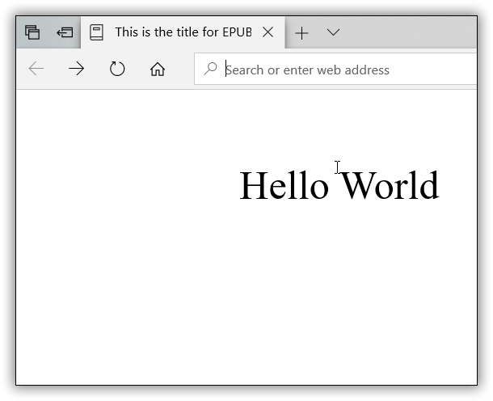

# Frequently asked questions about HTML and EPUB conversions 

The frequently asked questions about HTML and EPUB conversions using DocIO are listed below.

## How to set title when converting Word document to EPUB?

You can set title for EPUB file by setting the required title (string) to the built-in property "Title". If the built-in property "Title" doesn't have value, then no title will be applied for EPUB file.

The following code example illustrates how to set title for EPUB when converting a Word document to EPUB using DocIO.




//DocIO supports Word to EPUB in Windows Forms, UWP, WPF, ASP.NET Web, and MVC platforms alone



//Loads the existing Word document by using DocIO instance
WordDocument document = new WordDocument("Template.docx", FormatType.Docx);
//Sets title for Word document, which will be applied as title for the output EPUB file.
document.BuiltinDocumentProperties.Title = "This is a title in EPub document";
//Saves and closes the document
document.Save("Sample.epub", FormatType.EPub);
document.Close();



'Loads the existing Word document by using DocIO instance
Dim document As New WordDocument("Template.docx", FormatType.Docx)
'Sets title for Word document, which will be applied as title for the output EPUB file.
document.BuiltinDocumentProperties.Title = "This is a title in EPub document"
'Saves and closes the document.
document.Save("Sample.epub", FormatType.EPub)
document.Close()'Loads the existing Word document by using DocIO instance
Dim document As New WordDocument("Template.docx", FormatType.Docx)
'Sets title for Word document
document.BuiltinDocumentProperties.Title = "This is a title in EPub document"
'Saves and closes the document.
document.Save("Sample.epub", FormatType.EPub)
document.Close()



//Loads an existing Word document into DocIO instance
Assembly assembly = typeof(App).GetTypeInfo().Assembly;
using (WordDocument document = new WordDocument(assembly.GetManifestResourceStream("CreateWordSample.Assets.Template.docx"), FormatType.Docx))
{
    //Sets title for Word document, which will be applied as title for the output EPUB file.
    document.BuiltinDocumentProperties.Title = "This is a title in EPub document";
    //Saves the Word file to MemoryStream
    MemoryStream stream = new MemoryStream();
    await document.SaveAsync(stream, FormatType.EPub);
    //Saves the stream as Word file in local machine
    Save(stream, "Sample.epub");
    //Closes the document
    document.Close();
    //Please refer the below link to save Word document in UWP platform
    //https://help.syncfusion.com/document-processing/word/word-library/net/create-word-document-in-uwp#save-word-document-in-uwp
}




You can download a complete working sample from [GitHub](https://github.com/SyncfusionExamples/DocIO-Examples/tree/main/Word-to-EPUB-conversion/Set-title-for-EPUB).

## Why are there blank spaces or empty paragraphs when converting HTML to Word?

If the input HTML contains carriage return line feed (CRLF) inside the `
` tag, each CRLF is treated as a new line when converting the HTML to Word using Microsoft Word. DocIO follows the same behavior. This is not an issue but rather the expected behavior during HTML to Word conversion.

## How DocIO handles HTML validation while importing HTML?

DocIO supports validating HTML with Strict and Transitional standards. It uses XmlReader to parse input HTML content. To ensure successful parsing and document generation, the provided HTML must comply with XML standards. This means the HTML should have properly opened and closed tags to maintain a well-formed structure.

T> If you wish to use HTML that does not meet XML standards (e.g., improperly opened or closed tags), you can pass `XHTMLValidationType.None` when opening HTML using one of the following overloads:  
T> 
T> 1. [Open(string fileName, FormatType formatType, XHTMLValidationType validationType)](https://help.syncfusion.com/cr/document-processing/Syncfusion.DocIO.DLS.IWordDocument.html#Syncfusion_DocIO_DLS_IWordDocument_Open_System_String_Syncfusion_DocIO_FormatType_Syncfusion_DocIO_DLS_XHTMLValidationType_)  
T> 2. [Open(string fileName, FormatType formatType, XHTMLValidationType validationType, string baseUrl)](https://help.syncfusion.com/cr/document-processing/Syncfusion.DocIO.DLS.IWordDocument.html#Syncfusion_DocIO_DLS_IWordDocument_Open_System_String_Syncfusion_DocIO_FormatType_Syncfusion_DocIO_DLS_XHTMLValidationType_System_String_)  
T> 3. [OpenReadOnly(string fileName, FormatType formatType, XHTMLValidationType validationType)](https://help.syncfusion.com/cr/document-processing/Syncfusion.DocIO.DLS.IWordDocument.html#Syncfusion_DocIO_DLS_IWordDocument_OpenReadOnly_System_String_Syncfusion_DocIO_FormatType_Syncfusion_DocIO_DLS_XHTMLValidationType_)  
T> 4. [OpenReadOnly(string fileName, FormatType formatType, XHTMLValidationType validationType, string baseUrl)](https://help.syncfusion.com/cr/document-processing/Syncfusion.DocIO.DLS.IWordDocument.html#Syncfusion_DocIO_DLS_IWordDocument_OpenReadOnly_System_String_Syncfusion_DocIO_FormatType_Syncfusion_DocIO_DLS_XHTMLValidationType_System_String_)  

## How should measurement values be defined in HTML for proper processing with DocIO?

When importing an HTML file into a Word document using DocIO, it is essential to specify measurement values correctly to ensure accurate processing.

**Incorrect Example:**





 Hello world





In this example, the values lack measurement units (e.g., pt), which can lead to inconsistent formatting in the resulting Word document.

**Correct Example:**





Hello world





By including **pt** as the measurement unit, the spacing and styling are accurately interpreted and applied during the conversion process.

## Why does Syncfusion.Drawing.ColorTranslator.FromHtml not parse #rrggbbaa hex color notation correctly? 

The [System.Drawing.ColorTranslator.FromHtml](https://learn.microsoft.com/en-us/dotnet/api/system.drawing.colortranslator.fromhtml?view=net-9.0) function does not support parsing #rrggbbaa (red, green, blue, alpha) hex color notation. This limitation exists because it adheres to the HTML 4.01 and CSS color standards, which only recognize #rrggbb (6-character) and #rgb (3-character) formats. The #rrggbbaa format, which includes alpha transparency, is a modern feature and is not supported by the function.

Similarly, the Syncfusion.Drawing.ColorTranslator.FromHtml function behaves the same as the [System.Drawing.ColorTranslator.FromHtml](https://learn.microsoft.com/en-us/dotnet/api/system.drawing.colortranslator.fromhtml?view=net-9.0) function, and it does not parse #rrggbbaa hex color notation.

## How can I apply custom fonts and sizes to mathematical equations in a Word document using DocIO?

In Microsoft Word, customizing fonts and sizes for mathematical equations can be tricky. When you apply changes to the whole equation, they may not affect all parts as expected. This happens because Word applies changes to the equation container, not the individual parts.

You can customize fonts and sizes for specific parts, like variables (e.g., "A"). However, symbols like parentheses or brackets adjust automatically based on the equation's content and cannot have their font properties directly changed.

With DocIO, you can programmatically set fonts and sizes for variables and letters in an equation. Keep in mind, symbols like parentheses or special characters are dynamic and will adjust automatically, so their fonts can't be directly customized.
