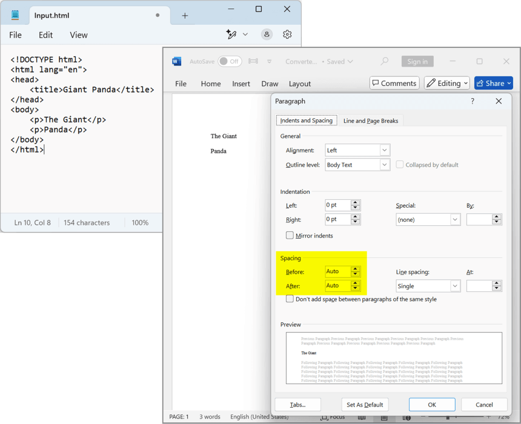
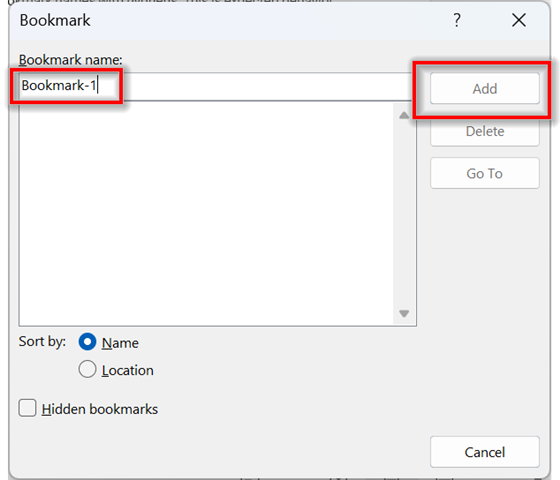

# Frequently asked questions about paragraph and paragraph items in Word document

The frequently asked questions about working with paragraph and paragraph items in Word documents using DocIO are listed below.

## How to modify an existing style?

The following code illustrates how to modify the built-in style while creating new Word document.




//Creates a new Word document 
WordDocument document = new WordDocument();
//Adds new section to the document
IWSection section = document.AddSection();
//Creates built-in style and modifies its properties
Style style = Style.CreateBuiltinStyle(BuiltinStyle.Heading1, document) as Style;
style.CharacterFormat.Italic = true;
style.CharacterFormat.TextColor = Color.DarkGreen;
//Adds it to the styles collection
document.Styles.Add(style);
//Adds new paragraph to the section
IWParagraph paragraph = section.AddParagraph();
IWTextRange text = paragraph.AppendText("A built-in style is modified and is applied to this paragraph.");
//Applies the new style to paragraph
paragraph.ApplyStyle(style.Name);
//Saves the Word document
document.Save("Sample.docx", FormatType.Docx);
//Closes the document
document.Close();



'Creates a new Word document 
Dim document As New WordDocument()
'Adds new section to the document
Dim section As IWSection = document.AddSection()
'Creates built-in style and modifies its properties
Dim style__1 As Style = TryCast(Style.CreateBuiltinStyle(BuiltinStyle.Heading1, document), Style)
style__1.CharacterFormat.Italic = True
style__1.CharacterFormat.TextColor = Color.DarkGreen
'Adds it to the styles collection
document.Styles.Add(style__1)
'Adds new paragraph to the section
Dim paragraph As IWParagraph = section.AddParagraph()
Dim text As IWTextRange = paragraph.AppendText("A built-in style is modified and is applied to this paragraph.")
'Applies the new style to paragraph
paragraph.ApplyStyle(style__1.Name)
'Saves the Word document
document.Save("Sample.docx", FormatType.Docx)
'Closes the document
document.Close()
  

 

You can download a complete working sample from [GitHub](https://github.com/SyncfusionExamples/DocIO-Examples/tree/main/Word-document/Modify-built-in-style).

## How to set OpenType Font Features?

The Open type features provide special effects for the text. This feature is specific to Word 2010 and later version documents.

The OpenType features includes the following:

* Ligatures – combination of characters, written as glyph
* Use Contextual Alternates – combination of letters based on surrounding characters
* Number spacing – specifies number width 
* Number forms – specifies number height
* Stylistic sets – specifies the look of the text, based on the font used

The following code illustrates how to set ligature types for text.

  


//Creates a new Word document 
WordDocument document = new WordDocument();
//Adds new section to the document
IWSection section = document.AddSection();
//Adds new paragraph to the section
IWParagraph paragraph = section.AddParagraph();
//Adds new text
IWTextRange text = paragraph.AppendText("Text to describe discretional ligatures");
//Sets ligature type
text.CharacterFormat.Ligatures = LigatureType.Discretional;
text.CharacterFormat.FontName = "Arial";
paragraph = section.AddParagraph();
text = paragraph.AppendText("Text to describe contextual ligatures");
text.CharacterFormat.Ligatures = LigatureType.Contextual;
text.CharacterFormat.FontName = "Arial";
paragraph = section.AddParagraph();
text = paragraph.AppendText("Text to describe historical ligatures");
text.CharacterFormat.Ligatures = LigatureType.Historical;
text.CharacterFormat.FontName = "Arial";
//Saves and closes the document
document.Save("Sample.docx", FormatType.Docx);
document.Close();



'Creates a new Word document 
Dim document As New WordDocument()
'Adds new section to the document
Dim section As IWSection = document.AddSection()
'Adds new paragraph to the section
Dim paragraph As IWParagraph = section.AddParagraph()
'Adds new text
Dim text As IWTextRange = paragraph.AppendText("Text to describe discretional ligatures")
'Sets ligature type as Discretional
text.CharacterFormat.Ligatures = LigatureType.Discretional
text.CharacterFormat.FontName = "Arial"
paragraph = section.AddParagraph()
text = paragraph.AppendText("Text to describe contextual ligatures")
'Sets ligature type as Contextual
text.CharacterFormat.Ligatures = LigatureType.Contextual
text.CharacterFormat.FontName = "Arial"
paragraph = section.AddParagraph()
text = paragraph.AppendText("Text to describe historical ligatures")
'Sets ligature type as Historical
text.CharacterFormat.Ligatures = LigatureType.Historical
text.CharacterFormat.FontName = "Arial"
'Saves and closes the document
document.Save("Sample.docx", FormatType.Docx)
document.Close()
 

  

You can download a complete working sample from [GitHub](https://github.com/SyncfusionExamples/DocIO-Examples/tree/main/Paragraphs/Set-ligature-types-tor-text).

The following code example illustrates how to set contextual alternates.

 


//Creates a new Word document 
WordDocument document = new WordDocument();
//Adds new section to the document
IWSection section = document.AddSection();
//Adds new paragraph to the section
IWParagraph paragraph = section.AddParagraph();
//Adds new text
IWTextRange text = paragraph.AppendText("Text to describe contextual alternates");
text.CharacterFormat.FontName = "Segoe Script";
//Sets contextual alternates
text.CharacterFormat.UseContextualAlternates = true;
paragraph = section.AddParagraph();
//Saves and closes the document
document.Save("Sample.docx", FormatType.Docx);
document.Close();



'Creates a new Word document 
Dim document As New WordDocument()
'Adds new section to the document
Dim section As IWSection = document.AddSection()
'Adds new paragraph to the section
Dim paragraph As IWParagraph = section.AddParagraph()
'Adds new text
Dim text As IWTextRange = paragraph.AppendText("Text to describe contextual alternates")
text.CharacterFormat.FontName = "Segoe Script"
'Sets contextual alternates
text.CharacterFormat.UseContextualAlternates = True
paragraph = section.AddParagraph()
'Saves and closes the document
document.Save("Sample.docx", FormatType.Docx)
document.Close()
 

  

You can download a complete working sample from [GitHub](https://github.com/SyncfusionExamples/DocIO-Examples/tree/main/Paragraphs/Set-contextual-alternates-for-text).

The following code example illustrates how to set number spacing.

  


//Creates a new Word document 
WordDocument document = new WordDocument();
//Adds new section to the document
IWSection section = document.AddSection();
//Adds new paragraph to the section
IWParagraph paragraph = section.AddParagraph();
//Adds new text
IWTextRange text = paragraph.AppendText("Numbers to describe tabular number spacing 0123456789");
text.CharacterFormat.FontName = "Calibri";
//Sets number spacing
text.CharacterFormat.NumberSpacing = NumberSpacingType.Tabular;
paragraph = section.AddParagraph();
text = paragraph.AppendText("Numbers to describe proportional number spacing 0123456789");
text.CharacterFormat.FontName = "Calibri";
//Sets number spacing
text.CharacterFormat.NumberSpacing = NumberSpacingType.Proportional;
//Saves and closes the document
document.Save("Sample.docx", FormatType.Docx);
document.Close();



'Creates a new Word document 
Dim document As New WordDocument()
'Adds new section to the document
Dim section As IWSection = document.AddSection()
'Adds new paragraph to the section
Dim paragraph As IWParagraph = section.AddParagraph()
'Adds new text
Dim text As IWTextRange = paragraph.AppendText("Numbers to describe tabular number spacing 0123456789")
text.CharacterFormat.FontName = "Calibri"
'Sets number spacing
text.CharacterFormat.NumberSpacing = NumberSpacingType.Tabular
paragraph = section.AddParagraph()
text = paragraph.AppendText("Numbers to describe proportional number spacing 0123456789")
text.CharacterFormat.FontName = "Calibri"
'Sets number spacing
text.CharacterFormat.NumberSpacing = NumberSpacingType.Proportional
'Saves and closes the document
document.Save("Sample.docx", FormatType.Docx)
document.Close()
 

  

You can download a complete working sample from [GitHub](https://github.com/SyncfusionExamples/DocIO-Examples/tree/main/Paragraphs/Set-number-spacing).

The following code example illustrates how to set number style.

 


//Creates a new Word document 
WordDocument document = new WordDocument();
//Adds new section to the document
IWSection section = document.AddSection();
//Adds new paragraph to the section
IWParagraph paragraph = section.AddParagraph();
//Adds new text
IWTextRange text = paragraph.AppendText("Numbers to describe oldstyle number form 0123456789");
text.CharacterFormat.FontName = "Calibri";
//Sets number style
text.CharacterFormat.NumberForm = NumberFormType.OldStyle;
paragraph = section.AddParagraph();
text = paragraph.AppendText("Numbers to describe lining number form 0123456789");
text.CharacterFormat.FontName = "Calibri";
//Sets number style
text.CharacterFormat.NumberForm = NumberFormType.Lining;
//Saves and closes the document
document.Save("Sample.docx", FormatType.Docx);
document.Close();



'Creates a new Word document 
Dim document As New WordDocument()
'Adds new section to the document
Dim section As IWSection = document.AddSection()
'Adds new paragraph to the section
Dim paragraph As IWParagraph = section.AddParagraph()
'Adds new text
Dim text As IWTextRange = paragraph.AppendText("Numbers to describe oldstyle number form 0123456789")
text.CharacterFormat.FontName = "Calibri"
'Sets number style
text.CharacterFormat.NumberForm = NumberFormType.OldStyle
paragraph = section.AddParagraph()
text = paragraph.AppendText("Numbers to describe lining number form 0123456789")
text.CharacterFormat.FontName = "Calibri"
'Sets number style
text.CharacterFormat.NumberForm = NumberFormType.Lining
'Saves and closes the document
document.Save("Sample.docx", FormatType.Docx)
document.Close()


  

You can download a complete working sample from [GitHub](https://github.com/SyncfusionExamples/DocIO-Examples/tree/main/Paragraphs/Set-number-forms).

The following code example illustrates how to set different styles for the text.

  


//Creates a new Word document 
WordDocument document = new WordDocument();
//Adds new section to the document
IWSection section = document.AddSection();
//Adds new paragraph to the section
IWParagraph paragraph = section.AddParagraph();
//Adds new text
IWTextRange text = paragraph.AppendText("Text to describe stylistic sets");
text.CharacterFormat.FontName = "Gabriola";
//Sets stylistic set
text.CharacterFormat.StylisticSet = StylisticSetType.StylisticSet06;
paragraph = section.AddParagraph();
//Adds new text
text = paragraph.AppendText("Text to describe stylistic sets");
text.CharacterFormat.FontName = "Gabriola";
//Sets stylistic set
text.CharacterFormat.StylisticSet = StylisticSetType.StylisticSet15;
//Saves and closes the document
document.Save("Sample.docx", FormatType.Docx);
document.Close();



'Creates a new Word document 
Dim document As New WordDocument()
'Adds new section to the document
Dim section As IWSection = document.AddSection()
'Adds new paragraph to the section
Dim paragraph As IWParagraph = section.AddParagraph()
'Adds new text
Dim text As IWTextRange = paragraph.AppendText("Text to describe stylistic sets")
text.CharacterFormat.FontName = "Gabriola"
'Sets stylistic set
text.CharacterFormat.StylisticSet = StylisticSetType.StylisticSet06
paragraph = section.AddParagraph()
'Adds new text
text = paragraph.AppendText("Text to describe stylistic sets")
text.CharacterFormat.FontName = "Gabriola"
'Sets stylistic set
text.CharacterFormat.StylisticSet = StylisticSetType.StylisticSet15
'Saves and closes the document
document.Save("Sample.docx", FormatType.Docx)
document.Close()


  

You can download a complete working sample from [GitHub](https://github.com/SyncfusionExamples/DocIO-Examples/tree/main/Paragraphs/Stylistic-set-for-text).

## How to extract the images in the document?

The following code illustrates how to extract the images in the document.




//Loads the template document
WordDocument document = new WordDocument("Template.docx");
WTextBody textbody = document.Sections[0].Body;
Image image;
int i = 1;
//Iterates through the paragraphs
foreach (WParagraph paragraph in textbody.Paragraphs)
{
    //Iterates through the paragraph items 
    foreach (ParagraphItem item in paragraph.ChildEntities)
    {
        //Gets the picture and saves it into specified location
        switch (item.EntityType)
        {
            case EntityType.Picture:
                WPicture picture = item as WPicture;
                image = picture.Image;
                image.Save(@"D:/Data/Image" + i + ".jpeg", ImageFormat.Jpeg);
                i++;
                break;
            default:
                break;
        }
    }
}
//Closes the document
document.Close();



'Loads the template document
Dim document As New WordDocument("Template.docx")
Dim textbody As WTextBody = document.Sections(0).Body
Dim image As Image
Dim i As Integer = 1
'Iterates through the paragraphs
For Each paragraph As WParagraph In textbody.Paragraphs
    'Iterates through the paragraph items 
    For Each item As ParagraphItem In paragraph.ChildEntities
        'Gets the picture and saves it into specified location
        Select Case item.EntityType
            Case EntityType.Picture
                Dim picture As WPicture = TryCast(item, WPicture)
                image = picture.Image
                image.Save("D:/Data/Image" & i & ".jpeg", ImageFormat.Jpeg)
                i += 1
                Exit Select
            Case Else
                Exit Select
        End Select
    Next
Next
'Close the document
document.Close()
 

  

The images in the document can be extracted into a specific location when exporting it to HTML file. The following code illustrates how to extract images.

  


//Loads the template document
WordDocument document = new WordDocument("Template.docx");
//Sets the location to extract images
document.SaveOptions.HtmlExportImagesFolder = @"D:/Data/";
//Saves the document as html file
HTMLExport export = new HTMLExport();
export.SaveAsXhtml(document, "Template.html");
//Closes the document
document.Close();



'Loads the template document
Dim document As New WordDocument("Template.docx")
'Sets the location to extract images
document.SaveOptions.HtmlExportImagesFolder = "D:/Data/"
'Saves the document as html file
Dim export As New HTMLExport()
export.SaveAsXhtml(document, "Template.html")
'Closes the document
document.Close()




You can download a complete working sample from [GitHub](https://github.com/SyncfusionExamples/DocIO-Examples/tree/main/FAQs/Extract-images-from-Word-document).

## Can the chart data be refreshed?

Yes, Essential&reg; DocIO supports refreshing the chart data. For more details, refer [Working with charts](https://help.syncfusion.com/document-processing/word/word-library/net/working-with-charts).

## How to detect the shape type in a Word document?

To detect the type of a shape in a Word document, you can use the [AutoShapeType](https://help.syncfusion.com/cr/document-processing/Syncfusion.DocIO.DLS.Shape.html#Syncfusion_DocIO_DLS_Shape_AutoShapeType) property from the [Shape](https://help.syncfusion.com/cr/document-processing/Syncfusion.DocIO.DLS.Shape.html) class, which specifies the type of the shape. Here's a code snippet to detect the shape type:




// Get the last paragraph from the document
WParagraph paragraph = document.LastParagraph;
// Access the shape from the paragraph's child entities
Shape shape = paragraph.ChildEntities[i] as Shape;
// Get the type of the shape
AutoShapeType shapeType = shape.AutoShapeType;



' Get the last paragraph from the document
Dim paragraph As WParagraph = document.LastParagraph
' Access the shape from the paragraph's child entities
Dim shape As Shape = TryCast(paragraph.ChildEntities(i), Shape)
' Get the type of the shape
Dim shapeType As AutoShapeType = shape.AutoShapeType




## Is it possible to change the DATE  field value in a Word document using DocIO? 

No, DocIO does not allow directly changing the value of a DATE field in a Word document. This is because DATE fields are auto-update fields, and their values are refreshed automatically when the document is opened in Microsoft Word.

When a Word document with a DATE field is opened in Microsoft Word, the field value updates automatically, even in read-only mode. DocIO follows the same behavior as Microsoft Word to ensure compatibility and consistency.

In conclusion, this behavior is not a limitation or issue, but rather aligns with Microsoft Word's standard functionality.

## Can the auto-scale option be set for 2D charts in a Word document?

No, the auto-scale option is not available for 2D charts. This is because auto-scaling is specifically designed for 3D charts to maintain accurate proportions when rotated or resized.

This behavior aligns with Microsoft Word's standards, and the DocIO library adheres to the same limitation. Even when the X and Y rotations of a 3D chart are set to 0 degrees to mimic the appearance of a 2D chart, the auto-scale option remains exclusive to true 3D chart types.

## Does importing content using keep source formatting option copy the format from the style to the destination document?

Yes, when you use [ImportOptions.KeepSourceFormatting](https://help.syncfusion.com/cr/document-processing/Syncfusion.DocIO.DLS.ImportOptions.html#fields) while importing content using [ImportContent](https://help.syncfusion.com/cr/document-processing/Syncfusion.DocIO.DLS.ImportOptions.html) API, it copies both the style and inline formatting. For example, if the text is red and bold in the source document(which applied through the style), the destination document will keep the same red color and bold effect.

However, if part of the text has inline formatting (like a blue color), it will override the style only for that part of the text. So, the destination document will show the blue part, but the rest of the text will stay red and bold.

In short, **inline formatting** takes priority over the style for specific parts of the text, while "Keep Source Formatting" ensures that most formatting is preserved.

This behavior follows the Microsoft Word when using "Keep Source Formatting". Similarly, DocIO also follows this behavior when you use [ImportOptions.KeepSourceFormatting](https://help.syncfusion.com/cr/document-processing/Syncfusion.DocIO.DLS.ImportOptions.html#fields).

## Are strip lines on charts supported in DocIO?

No, strip lines in charts are not supported in DocIO. Microsoft Word application does not provide specific settings for strip lines, which are used to highlight values or ranges with horizontal or vertical lines across chart areas. DocIO follows the same and does not support strip lines in charts.

## How to enable the "Don't add space between paragraphs of the same style" option for paragraphs in a Word document?

In DocIO, you can enable the **Don't add space between paragraphs of the same style** option by setting the [ContextualSpacing](https://help.syncfusion.com/cr/document-processing/Syncfusion.DocIO.DLS.WParagraphFormat.html#Syncfusion_DocIO_DLS_WParagraphFormat_ContextualSpacing) property to true. This ensures that no additional spacing is applied between consecutive paragraphs that use the same style.

The following code illustrates how to enable the "Don't add space between paragraphs of the same style" option.




 // Find the "Normal" paragraph style in the document's styles collection
 WParagraphStyle normalStyle = document.Styles.FindByName("Normal") as WParagraphStyle;
// Check if the "Normal" style is found, and if so, enable contextual spacing
if (normalStyle != null)
{
    // Enable contextual spacing to avoid adding extra space between paragraphs with the same style
    normalStyle.ParagraphFormat.ContextualSpacing = true;
}



' Find the "Normal" paragraph style in the document's styles collection
Dim normalStyle As WParagraphStyle = TryCast(document.Styles.FindByName("Normal"), WParagraphStyle)
' Check if the "Normal" style is found, and if so, enable contextual spacing
If normalStyle IsNot Nothing Then
    ' Enable contextual spacing to avoid adding extra space between paragraphs with the same style
    normalStyle.ParagraphFormat.ContextualSpacing = True
End If




## Why do paragraphs have spacing when appending HTML into Word document using AppendHTML() API?

When converting HTML to Word documents using the Microsoft Word application, the tags automatically include default spacing (before and after). This behavior occurs because Word applies default paragraph spacing during the conversion process.

Similarly, the .NET Word Library (DocIO) also follows this behavior when appending HTML content using the AppendHTML(String) method.

As a result, you may notice extra spacing in the paragraphs, even if the input HTML doesn’t specify spacing values in the tags.

To adjust this extra spacing in DocIO, you can iterate through the paragraphs inserted by the AppendHTML method and modify their paragraph formatting. For example, you can set the spacing before and after each paragraph to zero or adjust it as needed. Here’s a simple code snippet that demonstrates how to do this:

  


// Open the Word document.
using (FileStream inputStream = new FileStream(Path.GetFullPath(@"Data/Template.docx"), FileMode.Open, FileAccess.Read))
{
    using (WordDocument document = new WordDocument(inputStream, FormatType.Docx))
    {
        // Access the first section of the document.
        WSection section = document.Sections[0];
        // Get the index of the last paragraph.
        int paraIndex = section.Body.Paragraphs.Count - 1;
        // Append HTML content to the document with formatting in 
 tag.
        document.LastParagraph.AppendHTML("
The Giant

Panda
");
        // Iterate through the paragraphs in the section's body.
        for (int i = paraIndex; i < section.Body.ChildEntities.Count; i++)
        {
            // Get the paragraph and check if it's not null.
            WParagraph paragraph = section.Body.ChildEntities[i] as WParagraph;
            if (paragraph != null)
            {
                // Set the paragraph formatting spacing to 0.
                paragraph.ParagraphFormat.BeforeSpacing = 0;
                paragraph.ParagraphFormat.AfterSpacing = 0;
            }
        }
        // Save the modified document.
        using (FileStream outputStream = new FileStream(Path.GetFullPath(@"Output/Result.docx"), FileMode.Create, FileAccess.Write))
        {
            document.Save(outputStream, FormatType.Docx);
        }
    }
}



// Open the Word document.
using (FileStream inputStream = new FileStream(Path.GetFullPath(@"Data/Template.docx"), FileMode.Open, FileAccess.Read))
{
    using (WordDocument document = new WordDocument(inputStream, FormatType.Docx))
    {
        // Access the first section of the document.
        WSection section = document.Sections[0];
        // Get the index of the last paragraph.
        int paraIndex = section.Body.Paragraphs.Count - 1;
        // Append HTML content to the document with formatting in 
 tag.
        document.LastParagraph.AppendHTML("
The Giant

Panda
");
        // Iterate through the paragraphs in the section's body.
        for (int i = paraIndex; i < section.Body.ChildEntities.Count; i++)
        {
            // Get the paragraph and check if it's not null.
            WParagraph paragraph = section.Body.ChildEntities[i] as WParagraph;
            if (paragraph != null)
            {
                // Set the paragraph formatting spacing to 0.
                paragraph.ParagraphFormat.BeforeSpacing = 0;
                paragraph.ParagraphFormat.AfterSpacing = 0;
            }
        }
        // Save the modified document.
        using (FileStream outputStream = new FileStream(Path.GetFullPath(@"Output/Result.docx"), FileMode.Create, FileAccess.Write))
        {
            document.Save(outputStream, FormatType.Docx);
        }
    }
}



' Open the Word document.
Using inputStream As FileStream = New FileStream(Path.GetFullPath("Data/Template.docx"), FileMode.Open, FileAccess.Read)
    Using document As WordDocument = New WordDocument(inputStream, FormatType.Docx)
        ' Access the first section of the document.
        Dim section As WSection = document.Sections(0)
        ' Get the index of the last paragraph.
        Dim paraIndex As Integer = section.Body.Paragraphs.Count - 1
        ' Append HTML content to the document with formatting in 
 tag.
        document.LastParagraph.AppendHTML("
The Giant

Panda
")
        ' Iterate through the paragraphs in the section's body.
        For i As Integer = paraIndex To section.Body.ChildEntities.Count - 1
            ' Get the paragraph and check if it's not null.
            Dim paragraph As WParagraph = TryCast(section.Body.ChildEntities(i), WParagraph)
            If paragraph IsNot Nothing Then
                ' Set the paragraph formatting spacing to 0.
                paragraph.ParagraphFormat.BeforeSpacing = 0
                paragraph.ParagraphFormat.AfterSpacing = 0
            End If
        Next
        ' Save the modified document.
        Using outputStream As FileStream = New FileStream(Path.GetFullPath("Output/Result.docx"), FileMode.Create, FileAccess.Write)
            document.Save(outputStream, FormatType.Docx)
        End Using
    End Using
End Using




You can download a complete working sample from [GitHub](https://github.com/SyncfusionExamples/DocIO-Examples/tree/main/HTML-conversions/Change-format-after-append-html).

## Can the border radius be set for shapes in a Word document?

No, setting a border radius for shapes is not supported. Since this functionality is not available in the Microsoft Word, the DocIO library also does not provide an option to apply rounded borders to shapes. 

As a workaround, predefined shapes with rounded edges, such as rounded rectangles, can be used to achieve a similar effect.

## Why is the UpdateTableOfContents() method not accessible in a cross-platform application?

The UpdateTableOfContents() method requires the [Syncfusion.DocIORenderer.Net.Core](https://www.nuget.org/packages/Syncfusion.DocIORenderer.Net.Core) NuGet package or [Word-to-PDF assemblies](https://help.syncfusion.com/document-processing/word/word-library/net/assemblies-required#converting-word-document-to-pdf) in cross-platform applications like ASP.NET Core, Blazor and more. Ensure these dependencies are added for the method to work.

## Why does the item index in a Word document differ from the DocIO library?

DocIO indexes items based on the document’s internal file structure rather than the UI rendering. Elements like floating objects may appear in a different order in Microsoft Word UI compared to their actual position in the document’s underlying structure. Since DocIO follows this structure, the difference in indexing is expected.

## Is it possible to create a Spline chart in a Word document using DocIO?

No, DocIO does not support spline charts directly. However, a similar effect can be achieved using a **scatter chart with a smooth line**. This chart type connects data points smoothly, resembling a spline chart. Refer to the [article](https://support.syncfusion.com/kb/article/12203/how-to-create-scatter-with-smooth-line-chart-in-word-document-using-c) and [GitHub sample](https://github.com/SyncfusionExamples/DocIO-Examples/tree/main/Charts/Create-scatter-with-smooth-line-chart) for implementation.

## Why does an exception occur while manipulating found text using Find APIs?

Modifying or removing multiple `TextSelection` instances during iteration (e.g., with `Find` API results) may alter the document structure and cause exceptions. To avoid this, apply changes only to the first found selection before performing a new search.

## Why is some text not found in a Word document when using the Find functionality in DocIO?

This usually occurs when the target text includes line breaks. Microsoft Word treats line breaks as separators, so text split across lines is not recognized as a single searchable string. DocIO behaves the same way. To handle such cases, use pattern-based searches with Regex or adjust the text to avoid line breaks.

## Why is a bookmark name with a hyphen (-) converted to an underscore (_) in DocIO?

In DocIO, hyphens (-) in bookmark names are replaced with underscores (_) because Microsoft Word does not allow bookmark names with hyphens. This is expected behavior, not an issue.

## Why is formatting not preserved after calling GetAsOneRange()?

The [GetAsOneRange()](https://help.syncfusion.com/cr/document-processing/Syncfusion.DocIO.DLS.TextSelection.html#Syncfusion_DocIO_DLS_TextSelection_GetAsOneRange) method applies the character formatting of the **first text range** in the selection to the entire range. For example, if the first range (e.g., "word") has bold and italic formatting, these styles are applied to the entire range, changing the formatting for all the text.

To preserve individual formatting, use [GetRanges()](https://help.syncfusion.com/cr/document-processing/Syncfusion.DocIO.DLS.TextSelection.html#Syncfusion_DocIO_DLS_TextSelection_GetRanges) instead of GetAsOneRange(). This method returns an array of text ranges, allowing you to iterate and apply the original formatting to each range separately.
