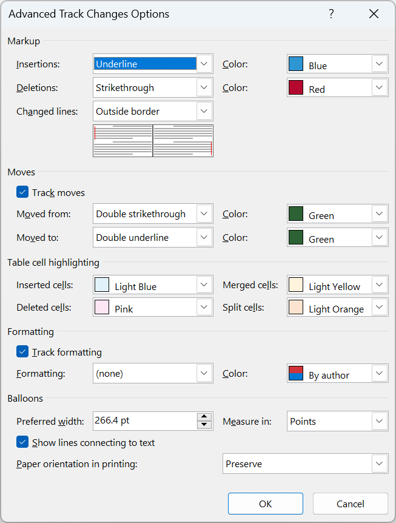

# Frequently asked questions about track changes in Word document

The frequently asked questions about working with track changes in Word documents using DocIO are listed below.

## How to check whether a Word document contains tracked changes or not? 

You can check whether a Word document contains tracked changes by using [HasChanges](https://help.syncfusion.com/cr/document-processing/Syncfusion.DocIO.DLS.WordDocument.html#Syncfusion_DocIO_DLS_WordDocument_HasChanges) property in Essential DocIO.

The following code example shows how to check whether a Word document contains tracked changes.




//Opens an existing word document 
FileStream fileStreamPath = new FileStream("Template.docx", FileMode.Open, FileAccess.Read, FileShare.ReadWrite);           
WordDocument document = new WordDocument(fileStreamPath, FormatType.Docx);
//Gets a flag which denotes whether the Word document has track changes
bool hasChanges = document.HasChanges;
//When the document has track changes, accepts all changes
if (hasChanges)
    document.Revisions.AcceptAll();
//Saves the Word document to MemoryStream
MemoryStream stream = new MemoryStream();
document.Save(stream, FormatType.Docx);
//Closes the document
document.Close();



//Opens an existing Word document
WordDocument document = new WordDocument("Template.docx", FormatType.Docx);
//Gets a flag which denotes whether the Word document has track changes
bool hasChanges = document.HasChanges;
//When the document has track changes, accepts all changes
if (hasChanges)
    document.Revisions.AcceptAll();
//Saves and closes the document
document.Save("Sample.docx", FormatType.Docx);
document.Close();
 


'Opens an existing Word document
Dim document As WordDocument = New WordDocument("Template.docx", FormatType.Docx)
Dim hasChanges As Boolean = document.HasChanges
'When the document has track changes, accepts all changes
If hasChanges Then
    document.Revisions.AcceptAll()
End If
'Saves and closes the document
document.Save("Sample.docx", FormatType.Docx)
document.Close()




You can download a complete working sample from [GitHub](https://github.com/SyncfusionExamples/DocIO-Examples/tree/main/Track-Changes/Accept-all-changes).

## How to accept or reject track changes of specific type in the Word document?

You can **accept or reject track changes by revision type** in the tracked changes Word document. 

For example, if you like to accept or reject changes of specific revision type (insertions, deletions, formatting, move to, or move from), you can iterate into the revisions in Word document and then accept or reject the particular revision type using Essential DocIO.

The following code example shows how to accept or reject track changes of specific type in the Word document .




//Opens an existing word document 
FileStream fileStreamPath = new FileStream("Template.docx", FileMode.Open, FileAccess.Read, FileShare.ReadWrite);           
WordDocument document = new WordDocument(fileStreamPath, FormatType.Docx);
//Iterates into all the revisions in Word document
for (int i = document.Revisions.Count - 1; i >= 0; i--)
{
    // Gets the type of the track changes revision
    RevisionType revisionType = document.Revisions[i].RevisionType;
    //Accepts only insertion and Move from revisions changes
    if (revisionType == RevisionType.Insertions || revisionType == RevisionType.MoveFrom)
        document.Revisions[i].Accept();
    //Resets to last item when accept the moving related revisions.
    if (i > document.Revisions.Count - 1)
        i = document.Revisions.Count;
}
//Saves the Word document to MemoryStream
MemoryStream stream = new MemoryStream();
document.Save(stream, FormatType.Docx);
//Closes the document
document.Close();



//Opens an existing Word document
WordDocument document = new WordDocument("Template.docx", FormatType.Docx);
//Iterates into all the revisions in Word document
for (int i = document.Revisions.Count - 1; i >= 0; i--)
{
    // Gets the type of the track changes revision
    RevisionType revisionType = document.Revisions[i].RevisionType;
    //Accepts only insertion and Move from revisions changes
    if (revisionType == RevisionType.Insertions || revisionType == RevisionType.MoveFrom)
        document.Revisions[i].Accept();
    //Resets to last item when accept the moving related revisions.
    if (i > document.Revisions.Count - 1)
        i = document.Revisions.Count;
}
//Saves and closes the document
document.Save("Sample.docx", FormatType.Docx);
document.Close();
 


'Opens an existing Word document
Dim document As WordDocument = New WordDocument("Template.docx", FormatType.Docx)
'Iterates into all the revisions in Word document
For i As Integer = document.Revisions.Count - 1 To 0 Step -1
    Dim revisionType As RevisionType = document.Revisions(i).RevisionType
    'Accepts only insertion and Move from revisions changes
    If ((revisionType = RevisionType.Insertions) OrElse (revisionType = RevisionType.MoveFrom)) Then
        document.Revisions(i).Accept()
    End If
    'Resets to last item when accept the moving related revisions.
    If i > document.Revisions.Count - 1 Then
    i = document.Revisions.Count
    End If
Next
'Saves and closes the document
document.Save("Sample.docx", FormatType.Docx)
document.Close()




You can download a complete working sample from [GitHub](https://github.com/SyncfusionExamples/DocIO-Examples/tree/main/Track-Changes/Accept-or-reject-specific-type).

## How to enable track changes for Word document?

TrackChanges is used to keep track of the changes made to a Word document. This can be enabled by using the [TrackChanges](https://help.syncfusion.com/cr/document-processing/Syncfusion.DocIO.DLS.WordDocument.html#Syncfusion_DocIO_DLS_WordDocument_TrackChanges) property of the Word document.

The following code example shows how to enable track changes of the document.




//Creates a new Word document 
WordDocument document = new WordDocument();
//Adds new section to the document
IWSection section = document.AddSection();
//Adds new paragraph to the section
IWParagraph paragraph = section.AddParagraph();
//Appends text to the paragraph
IWTextRange text = paragraph.AppendText("This sample illustrates how to track the changes made to the word document. ");
//Sets font name and size for text
text.CharacterFormat.FontName = "Times New Roman";
text.CharacterFormat.FontSize = 14;
text = paragraph.AppendText("This track changes is useful in shared environment.");
text.CharacterFormat.FontSize = 12;
//Turns on the track changes option
document.TrackChanges = true;
//Saves the Word document to  MemoryStream
MemoryStream stream = new MemoryStream();
document.Save(stream, FormatType.Docx);
//Closes the document
document.Close();



//Creates a new Word document 
WordDocument document = new WordDocument();
//Adds new section to the document
IWSection section = document.AddSection();
//Adds new paragraph to the section
IWParagraph paragraph = section.AddParagraph();
//Appends text to the paragraph
IWTextRange text = paragraph.AppendText("This sample illustrates how to track the changes made to the word document. ");
//Sets font name and size for text
text.CharacterFormat.FontName = "Times New Roman";
text.CharacterFormat.FontSize = 14;
text = paragraph.AppendText("This track changes is useful in shared environment.");
text.CharacterFormat.FontSize = 12;
//Turns on the track changes option
document.TrackChanges = true;
//Saves and closes the document
document.Save("Sample.docx", FormatType.Docx);
document.Close();



'Creates a new Word document 
Dim document As New WordDocument()
'Adds new section to the document
Dim section As IWSection = document.AddSection()
'Adds new paragraph to the section
Dim paragraph As IWParagraph = section.AddParagraph()
'Appends text to the paragraph
Dim text As IWTextRange = paragraph.AppendText("This sample illustrates how to track the changes made to the word document. ")
'Sets font name and size for text
text.CharacterFormat.FontName = "Times New Roman"
text.CharacterFormat.FontSize = 14
text = paragraph.AppendText("This track changes is useful in shared environment.")
text.CharacterFormat.FontSize = 12
'Turns on the track changes option
document.TrackChanges = True
'Saves and closes the document
document.Save("Sample.docx", FormatType.Docx)
document.Close()




You can download a complete working sample from [GitHub](https://github.com/SyncfusionExamples/DocIO-Examples/tree/main/Track-Changes/Enable-track-changes-of-Word).

## What happens when Word documents with track changes are used for comparing? 

The .NET Word library (DocIO) accepts all the changes in input documents and then performs a comparison between two Word documents.

## Why track changes color are different in Word document?

The colors for track changes in a Word document may appear different due to the settings applied in the Word application. Word automatically assigns colors to inserted and deleted text based on the track changes settings. If the colors appear differently, it could be due to customized settings for insertions, deletions, and other tracked changes in the document.

To change the colors for insertions, deletions, or other changes, open the **Review tab**, select **Change Tracking Options**. In the Track Changes Options dialog, click on the **Advanced** button. In the **Insertions and Deletions** section, you can choose your preferred color for insertions and deletions from the dropdown menus. Once you’ve selected your desired colors, click OK to apply the changes. This will ensure that the colors for tracked changes reflect your preferences. For more details, you can refer to the official Microsoft support guide on [changing the track changes color](https://support.microsoft.com/en-us/office/change-the-track-changes-color-48c80bb3-458c-4abb-8e21-25f9bac47484).

## Is it possible to track changes made programmatically using the DocIO library?

No, the DocIO library does not support tracking changes made programmatically. However, it allows managing existing tracked changes in a Word document. You can:

- Accept or reject revisions.
- Accept or reject all changes made by a specific author.
- Retrieve revision details such as author name, date, and type of revision.

