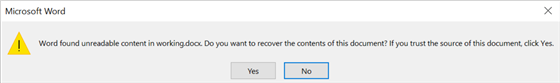

# Frequently asked questions about Word document 

The frequently asked questions about Word document manipulation using DocIO are listed below.

## How to open a document from stream using DocIO?

A document can be opened as stream by using HttpWebResponse. This stream does not support seek operation and so the contents should be read manually to get the position and length of the stream. The following code illustrates how to load the document from stream.




//Gets the document as stream
HttpWebRequest request = (HttpWebRequest)WebRequest.Create("https://www.swiftview.com/tech/letterlegal5.doc");
HttpWebResponse response = (HttpWebResponse)request.GetResponse();
Stream stream = response.GetResponseStream();
//Converts it to byte array
byte[] buffer = ReadFully(stream, 32768);
//Stores bytes into the memory stream.
MemoryStream ms = new MemoryStream();
ms.Write(buffer, 0, buffer.Length);
ms.Seek(0, SeekOrigin.Begin);
stream.Close();
//Creates a new document.
WordDocument document = new WordDocument();
//Opens the template document from the MemoryStream.
document.Open(ms, FormatType.Doc);
//Saves and closes the document
document.Save("Sample.docx", FormatType.Docx);
document.Close();



'Gets the document as stream
Dim request As HttpWebRequest = DirectCast(WebRequest.Create("https://www.swiftview.com/tech/letterlegal5.doc"), HttpWebRequest)
Dim response As HttpWebResponse = DirectCast(request.GetResponse(), HttpWebResponse)
Dim stream As Stream = response.GetResponseStream()
'Converts it to byte array
Dim buffer As Byte() = ReadFully(stream, 32768)
'Stores bytes into the memory stream.
Dim ms As New MemoryStream()
ms.Write(buffer, 0, buffer.Length)
ms.Seek(0, SeekOrigin.Begin)
stream.Close()
'Creates a new document.
Dim document As New WordDocument ()
'Opens the template document from the MemoryStream.
document.Open(ms, FormatType.Doc)
'Saves and closes the document
document.Save("Sample.docx", FormatType.Docx)
document.Close()




The following code illustrates the method used to read the stream and convert the stream to bytes.




public static byte[] ReadFully(Stream stream, int initialLength)
{
    //When an unhelpful initial length has been passed, just use 32K.
    if (initialLength < 1)
        initialLength = 32768;
    byte[] buffer = new byte[initialLength];
    int read = 0;
    int chunk;
    while ((chunk = stream.Read(buffer, read, buffer.Length - read)) > 0)
    {
        read += chunk;
        //After reaching the end of the buffer, check and see whether you can find any information.
        if (read == buffer.Length)
        {
            int nextByte = stream.ReadByte();
            //End of stream? Then, you are done.
            if (nextByte == -1)            
                return buffer;
            //Resize the buffer, put in the byte you have just read, and continue.
            byte[] newBuffer = new byte[buffer.Length * 2];
            Array.Copy(buffer, newBuffer, buffer.Length);
            newBuffer[read] = (byte)nextByte;
            buffer = newBuffer;
            read++;
        }
    }
    //Buffer is now too big. Shrink it.
    byte[] ret = new byte[read];
    Array.Copy(buffer, ret, read);
    return ret;
}



Public Shared Function ReadFully(stream As Stream, initialLength As Integer) As Byte()
    'When an unhelpful initial length has been passed, just use 32K.
    If initialLength < 1 Then initialLength = 32768
    Dim buffer As Byte() = New Byte(initialLength - 1) {}
    Dim read As Integer = 0
    Dim chunk As Integer
    chunk = stream.Read(buffer, read, buffer.Length - read)
    While (chunk > 0)
        read += chunk
        'After reaching the end of the buffer, check and see whether you can find any information.
        If read = buffer.Length Then 
            Dim nextByte As Integer = stream.ReadByte()
            'End of stream? Then, you are done.
            If nextByte = -1 Then Return buffer
            'Resize the buffer, put in the byte you have just read, and continue.
            Dim newBuffer As Byte() = New Byte(buffer.Length * 2 - 1) {}
            Array.Copy(buffer, newBuffer, buffer.Length)
            newBuffer(read) = CByte(nextByte)
            buffer = newBuffer
            read += 1
        End If
    End While
    'Buffer is now too big. Shrink it.
    Dim ret As Byte() = New Byte(read - 1) {}
    Array.Copy(buffer, ret, read)
    Return ret
End Function




You can download a complete working sample from [GitHub](https://github.com/SyncfusionExamples/DocIO-Examples/tree/main/Read-and-Save-document/Open-Word-document-from-url).

## How to attach a Template to a Word document?

The following code illustrates how to set the template for the document.

  


//Loads a source document
WordDocument document = new WordDocument("Template.docx"); 
//Attaches the template document to the source document
document.AttachedTemplate.Path = @"D:/Data/Template.docx";
//Updates the styles of the document from the attached template each time the document is opened
document.UpdateStylesOnOpen = true;
//Saves and closes the document
document.Save("Sample.docx", FormatType.Docx);
document.Close();



'Loads a source document
Dim document As New WordDocument("Template.docx")
'Attaches the template document to the source document
document.AttachedTemplate.Path = "D:/Data/Template.docx"
'Updates the styles of the document from the attached template each time the document is opened
document.UpdateStylesOnOpen = True
'Saves and closes the document
document.Save("Sample.docx", FormatType.Docx)
document.Close()


  

You can download a complete working sample from [GitHub](https://github.com/SyncfusionExamples/DocIO-Examples/tree/main/FAQs/Attach-template-to-Word-document).

## How to check the compatibility mode of the Word document?

The [CompatibilityMode](https://help.syncfusion.com/cr/document-processing/Syncfusion.DocIO.DLS.CompatibilityMode.html) of a Word document can also be determined. The following code example illustrates how to check the compatibility mode of the Word document.




//Load an existing Word document.
using (WordDocument document = new WordDocument("Input.docx", FormatType.Docx))
{
    //Get the compatibility mode.
    CompatibilityMode compatibilityMode = document.Settings.CompatibilityMode;
    Console.WriteLine(compatibilityMode);
    //Save a Word document.
    document.Save("Sample.docx", FormatType.Docx);
}



'Load an existing Word document.
Using document As WordDocument = New WordDocument("Input.docx", FormatType.Docx)
    'Get the compatibility mode.
    CompatibilityMode compatibilityMode = document.Settings.CompatibilityMode
    Console.WriteLine(compatibilityMode)
    'Save a Word document.
    document.Save("Sample.docx", FormatType.Docx)
End Using




You can download a complete working sample from [GitHub](https://github.com/SyncfusionExamples/DocIO-Examples/tree/main/FAQs/Check-compatibility-mode).

## Which units does Essential&reg; DocIO uses for measurement properties such as size, margins, etc, in a Word document?

Essential&reg; DocIO library uses Points for measurement properties in a Word document.

## How to convert Units (cm, mm, or inches) to Points for DocIO?

Syncfusion® .NET Word Library (DocIO) uses points as the default unit for various measurements, such as margins, indentation, and spacing. If you have measurements in centimeters (cm), millimeters (mm), or inches, you'll need to convert them to points before using them in DocIO code.

### Conversion Formulas for Units to Points

- **Centimeters (cm) to Points**: Multiply the cm value by **28.3465**.
- **Millimeters (mm) to Points**: Multiply the mm value by **2.83465**.
- **Inches to Points**: Multiply the inch value by **72**.




// Assuming you have a margin value in centimeters
float marginInCentimeter = 2f;
// Convert cm to points
float marginInPoints = marginInCentimeter * 28.3465f;

// Assuming you have a margin value in millimeters
float marginInMillimeter = 20f;
// Convert cm to points
float marginInPoints = marginInMillimeter * 2.83465f;

// Assuming you have a margin value in inches
float marginInInches = 1f;
// Convert cm to points
float marginInPoints = marginInInches * 72f;



' Assuming you have a margin value in centimeters
Dim marginInCentimeter As Single = 2.0F
' Convert cm to points
Dim marginInPointsFromCentimeter As Single = marginInCentimeter * 28.3465F

' Assuming you have a margin value in millimeters
Dim marginInMillimeter As Single = 20.0F
' Convert mm to points
Dim marginInPointsFromMillimeter As Single = marginInMillimeter * 2.83465F

' Assuming you have a margin value in inches
Dim marginInInches As Single = 1.0F
' Convert inches to points
Dim marginInPointsFromInches As Single = marginInInches * 72.0F




## Why does the 'File Not Supported' exception occur in Syncfusion® DocIO? 

This issue may occur if the input Word document is in a pre-97 Word format (complex format document) created using Microsoft Word versions prior to Word 97. Syncfusion® DocIO does not support these older complex format documents.

To resolve this, resave the input document using a more recent version of Microsoft Word. DocIO supports documents created in Microsoft Word versions from 97-2003 and later.

For more information on compatibility, refer [here](https://help.syncfusion.com/document-processing/word/word-library/net/overview).

## Why do documents remain locked after use?

This issue often occurs because the [FileStream](https://learn.microsoft.com/en-us/dotnet/api/system.io.filestream?view=net-7.0) class used to open the document is not closed properly. To ensure proper closure of the file stream, it is recommended to use the `using` statement. This guarantees that the [FileStream](https://learn.microsoft.com/en-us/dotnet/api/system.io.filestream?view=net-7.0) is disposed of correctly, even if an error occurs.

The following code demonstrates how to use a *using* block to handle file streams:




using (FileStream stream = new FileStream(filePath, FileMode.Open, FileAccess.Read))
{
    // Use the file stream here (e.g., read data, write data)
}



Using stream As New FileStream(filePath, FileMode.Open, FileAccess.Read)
    ' Use the file stream here (e.g., read data, write data)
End Using




## Can DocIO perform line-by-line comparisons for Word documents?

A Word document is a flow document, meaning its content is not preserved page by page but sequentially, section by section. Each section can span multiple pages depending on its content, such as tables, text, images, etc.

When a Word document is opened in a viewer or editor, the content is dynamically rendered page by page for viewing or editing. However, as per the Word file format specification, this page-by-page and line-by-line rendered information is not preserved at the document level.

DocIO is a non-UI component that provides a comprehensive document object model for manipulating Word document content. However, it is not feasible to extract line-by-line information from a Word document using DocIO. Due to this limitation, line-by-line comparisons are not possible with DocIO.

## Why "Wrong signature" exception thrown while trying to opening a .xml file using DocIO library?

If you encounter a **Wrong signature** exception while attempting to open an XML file using DocIO, it likely indicates that the XML file is not in the supported Word Processing 2007 or 2003 format. DocIO specifically supports these XML formats. To resolve this issue, please verify that the input XML file adheres to the Word Processing 2007 or 2003 format.

For more information on Word Processing XML, refer to the documentation [here](https://help.syncfusion.com/document-processing/word/word-library/net/word-file-formats#word-processing-xml-xml).

## How to set the current culture while running the .NET application?

If you notice that certain content in a Word document, such as dates or other culture-sensitive fields, is displayed in the wrong language or format, it could be due to the culture settings of your application. To ensure that the application displays content according to a specific culture, you can set the current culture programmatically.

For example, if you want to set the culture to French to display date and time in French, you can follow these steps:

The following code illustrates how to get the current culture.




CultureInfo currentCulture = CultureInfo.CurrentCulture;



Dim currentCulture As CultureInfo = CultureInfo.CurrentCulture




The following code illustrates how to set the culture.




CultureInfo culture = new CultureInfo("fr-CA");
CultureInfo.DefaultThreadCurrentCulture = culture;
CultureInfo.DefaultThreadCurrentUICulture = culture;



Dim culture As New CultureInfo("fr-CA")
CultureInfo.DefaultThreadCurrentCulture = culture
CultureInfo.DefaultThreadCurrentUICulture = culture




After setting the culture, you can load documents and process them according to the new culture, ensuring correct formatting throughout your application.

##  Is it possible to split Word document by pages using DocIO?

A Word document is a flow-based document, where contents are not preserved page by page. Instead, the contents are preserved sequentially, section by section. Each section may extend across multiple pages based on its contents, such as tables, text, images, and more.

The Word viewer/editor renders the contents of the document page by page dynamically when opened for viewing or editing. However, this page-wise rendered information is not preserved at the document level, as per the Word file format specification.

DocIO is a non-UI component that provides a full-fledged document object model to manipulate the Word document contents. Hence, it is not feasible to split the Word document by pages.

You can, however, split the Word document by sections, headings, bookmarks, or placeholders. Refer to the [documentation](https://help.syncfusion.com/document-processing/word/word-library/net/word-document/split-word-documents) for more details.

## Is it possible to fetch the page number of Word document elements using DocIO?

No, DocIO cannot retrieve the page number of elements such as text, images, tables, or paragraphs. This is because a Word document is flow-based, where content is not preserved page by page but sequentially, section by section. Each section may span multiple pages depending on its content, such as tables, text, and images.

The Word viewer/editor dynamically renders the document page by page when opened for viewing or editing. However, this page-wise rendering is not stored at the document level, as per the Word file format specification.

DocIO is a non-UI component that provides a full-fledged document object model for manipulating Word document content. Therefore, fetching the page number of text, images, or any other elements from a Word document using DocIO is not feasible.

## How to check if two Word documents have the same content while ignoring formatting changes?

By default, DocIO checks both content and formatting in Word files. To focus only on content, you can use the [DetectFormatChanges](https://help.syncfusion.com/cr/document-processing/Syncfusion.DocIO.DLS.ComparisonOptions.html#Syncfusion_DocIO_DLS_ComparisonOptions_DetectFormatChanges) API to skip formatting checks.

To check if the compared Word document has changes, you can use the [HasChanges](https://help.syncfusion.com/cr/document-processing/Syncfusion.DocIO.DLS.WordDocument.html#Syncfusion_DocIO_DLS_WordDocument_HasChanges) property in DocIO to identify content differences when comparing two Word documents.

The following code snippet demonstrates how to compares two Word documents while ignoring formatting changes and saves the result and print the result if there are any changes between the original and revised documents.




// Load the original and revised Word documents.
//Load the original document.
using (FileStream originalDocumentStreamPath = new FileStream("Data/OriginalDocument.docx", FileMode.Open, FileAccess.Read))
{
    using (WordDocument originalDocument = new WordDocument(originalDocumentStreamPath, FormatType.Docx))
    {
        //Load the revised document.
        using (FileStream revisedDocumentStreamPath = new FileStream("Data/RevisedDocument.docx", FileMode.Open, FileAccess.Read))
        {
            using (WordDocument revisedDocument = new WordDocument(revisedDocumentStreamPath, FormatType.Docx))
            {
                // Configure comparison options to ignore formatting changes.
                ComparisonOptions compareOptions = new ComparisonOptions();
                compareOptions.DetectFormatChanges = false;            
                // Compare the documents.
                originalDocument.Compare(revisedDocument);	            
                // Check if there are content differences.
                if (originalDocument.HasChanges)
                    Console.WriteLine("Differences detected in the document content.");
                else
                    Console.WriteLine("The documents have the same content."); 
                Console.ReadLine();
            }
        }                 
    }                           
}



//Load the original document.
using (WordDocument originalDocument = new WordDocument("Data/OriginalDocument.docx", FormatType.Docx))
{
    //Load the revised document.
    using (WordDocument revisedDocument = new WordDocument("Data/RevisedDocument.docx", FormatType.Docx))
   {
        // Configure comparison options to ignore formatting changes.
        ComparisonOptions compareOptions = new ComparisonOptions();
        compareOptions.DetectFormatChanges = false;
        // Compare the documents.
        originalDocument.Compare(revisedDocument);
        // Check if there are content differences.
        if (originalDocument.HasChanges)
            Console.WriteLine("Differences detected in the document content.");
        else
            Console.WriteLine("The documents have the same content.");
        Console.ReadLine();        
    }
}



' Load the original document.
Using originalDocument As New WordDocument("Data/OriginalDocument.docx", FormatType.Docx)
    ' Load the revised document.
    Using revisedDocument As New WordDocument("Data/RevisedDocument.docx", FormatType.Docx)
        ' Configure comparison options to ignore formatting changes.
        Dim compareOptions As New ComparisonOptions()
        compareOptions.DetectFormatChanges = False
        ' Compare the documents.
        originalDocument.Compare(revisedDocument)
        ' Check if there are content differences.
        If originalDocument.HasChanges Then
            Console.WriteLine("Differences detected in the document content.")
        Else
            Console.WriteLine("The documents have the same content.")
        End If
        Console.ReadLine()
    End Using
End Using




You can download a complete working sample from [GitHub](https://github.com/SyncfusionExamples/DocIO-Examples/tree/main/Compare-Word-documents/Check-document-has-diff-after-compare).

## Is it possible to set a watermark for only the first page of a Word document?

No, it is not possible to add a watermark to only the first page of a Word document because watermarks apply to the entire document by default in Microsoft Word.

As a workaround, you can insert an image or text in the header of the first page to mimic a watermark effect. Refer to the [GitHub sample]( https://github.com/SyncfusionExamples/DocIO-Examples/tree/main/Sections/Set-image-in-first-page-header) for more details.

## Why does the item index in a Word document differ from the DocIO library?

DocIO indexes items based on the document’s internal file structure rather than the UI rendering. Elements like floating objects may appear in a different order in Microsoft Word UI compared to their actual position in the document’s underlying structure. Since DocIO follows this structure, the difference in indexing is expected.

## How to view Word documents in my .NET MAUI application using DocIO?

Currently, DocIO does not have dedicated viewer control for Word documents in .NET MAUI. However, we can achieve this by converting the Word document to PDF and then displaying the PDF using a PDF viewer control.

To convert a Word document to PDF in .NET MAUI using DocIO, refer to the sample provided [here](https://github.com/SyncfusionExamples/DocIO-Examples/tree/main/Word-to-PDF-Conversion/Convert-Word-document-to-PDF/.NET-MAUI). To view the PDF in the .NET MAUI PDF viewer control, follow the [documentation](https://help.syncfusion.com/maui/pdf-viewer/getting-started). 

## How to identify if a Word document is in portrait or landscape?

A Word document consists of sections, and each section can have different page orientations. The [PageOrientation](https://help.syncfusion.com/cr/document-processing/Syncfusion.DocIO.DLS.PageOrientation.html) of a section can be determined using the [PageSetup](https://help.syncfusion.com/cr/document-processing/Syncfusion.DocIO.DLS.WSection.html#Syncfusion_DocIO_DLS_WSection_PageSetup) property.

The following code illustrates how to check the orientation of each section in a Word document. 




// Open the Word document from a file stream
using (FileStream fileStreamPath = new FileStream("Template.docx", FileMode.Open, FileAccess.Read, FileShare.ReadWrite))
{
    using (WordDocument document = new WordDocument(fileStreamPath, FormatType.Docx))
    {
        // Loop through all sections to check page orientation
        foreach (WSection section in document.Sections)
        {
            PageOrientation orientation = section.PageSetup.Orientation;
            // Perform operations based on orientation
        }
        // Save the Word document to a MemoryStream
        using (MemoryStream stream = new MemoryStream())
        {
            document.Save(stream, FormatType.Docx);
        }
    }
}



// Open the template document
using (WordDocument document = new WordDocument("Template.docx"))
{
    // Loop through all sections to check page orientation
    foreach (WSection section in document.Sections)
    {
        PageOrientation orientation = section.PageSetup.Orientation;
        // Perform operations based on orientation
    }
    // Save the modified document
    document.Save("Sample.docx", FormatType.Docx);
} 



' Open the template document
Using document As New WordDocument("Template.docx")
    ' Loop through all sections to check page orientation
    For Each section As WSection In document.Sections
        Dim orientation As PageOrientation = section.PageSetup.Orientation
        ' Perform operations based on orientation
    Next
    ' Save the modified document
    document.Save("Sample.docx", FormatType.Docx)
End Using 




For more details about specifying page properties, refer [here](https://help.syncfusion.com/document-processing/word/word-library/net/working-with-sections#specifying-page-properties).

## Is it possible to download a Word document from an AWS S3 bucket and use it in DocIO?

Yes, you can download a Word document from an AWS S3 bucket and use it with DocIO. Refer to the [documentation](https://help.syncfusion.com/document-processing/word/word-library/net/open-and-save-word-document-in-aws-s3-cloud-storage#download-file-from-aws-s3-cloud-storage) to learn more about downloading and loading documents from an AWS S3 bucket.

## Can DocIO open or process MPIP-protected Word documents?

No, DocIO cannot open or process Microsoft Purview Information Protection (MPIP) protected Word files because it requires user authentication. DocIO is a standalone library and does not integrate with Microsoft 365 or Azure AD, so it cannot decrypt MPIP-protected content.

## Why does content imported from one Word document to another start on a new page, even without a section break?

This occurs when page setup properties (like margins, or paper size) differ between the source and destination documents. In DocIO, importing content clones the entire section, including its page settings. If these settings don’t match, Microsoft Word treats it as a separate section and starts it on a new page when opening in Word viewer— even if no section break is specified. This is the default behavior.

As a workaround, keep the same section and page setup properties in both the source and destination documents before merging. Alternatively, iterate through each section of the source document and set its page properties to match those of the destination document.

The following code illustrates how to set the page properties to source document as same as the destination document.



// Match page setup before importing
IWSection sourceSection = sourceDoc.Sections[0];
IWSection destSection = destinationDoc.Sections[0];
//Sets the destination document page setup properties to the source document sections.
sourceSection.PageSetup.DifferentFirstPage = destSecPageSetup.DifferentFirstPage;
sourceSection.PageSetup.Margins.All = destSection.PageSetup.Margins.All;
sourceSection.PageSetup.Orientation = destSection.PageSetup.Orientation;
sourceSection.PageSetup.PageSize = destSection.PageSetup.PageSize;
// Now import the section
destinationDoc.Sections.Add(sourceDoc.Sections[0].Clone());



## Does DocIO process corrupted Word documents?

Corruption in Word document can be due to improper structure, invalid tags, or encoded characters. Microsoft Word can recover corrupted documents by rewriting the internal structure if you click "Yes."

In DocIO, if the structure is incorrect, an exception is thrown. Otherwise, DocIO tries to parse the document, which may result in missing elements or corruption. DocIO does not auto-correct file-level corruption, so the output may still have issues.

## Is custom chart templates (.crtx) supported in Word Library?

No, the .NET Word Library does not support custom chart templates (.crtx files).

These templates are part of Microsoft Excel's UI and are stored outside the document. Since the Word Library works programmatically and doesn't rely on external UI-based templates, applying .crtx files isn't supported.

## How does Syncfusion DocIO process Word documents internally?

Syncfusion DocIO processes Word documents by loading them into a memory stream as a structured Document Object Model (DOM). It organizes content into sections, paragraphs, tables, and other elements, allowing easy editing and formatting.
 
When performing operations like editing or cloning, DocIO traverses this structure and carefully handles each element to preserve the document's formatting, styles, and structure. For large or complex documents with many nested elements, it may take some time.

## Why does the document editor sometimes throw a script error when switching between different documents?

This error occurs when the previous editor instance is not properly destroyed before initializing a new one. It can result in residual event listeners and internal state conflicts. To resolve this, ensure that the existing editor instance is explicitly destroyed before creating a new one.
 

## Method `GetFontExactHeight` does not have an implementation error occurs at runtime. What is the cause and how to resolve it?

This error occurs due to a version mismatch between dependent libraries. The method may be unavailable or incompatible when different versions of related libraries are used in the same project. Ensure all related libraries used in the project are of the same version to maintain compatibility and prevent runtime errors.

N> All Syncfusion packages (e.g., `Syncfusion.DocIO`, `Syncfusion.DocIORenderer`, and `Syncfusion.Pdf`) must be referenced with the same version number in the project.
Using mismatched versions can cause runtime errors such as Method 'GetFontExactHeight' in type 'Syncfusion.DocIORenderer.RenderHelper' does not have an implementation.

## Is it possible to insert chart at specific page in Word document?

No, it is not possible to directly insert a chart at a specific page in a Word document. A Word document is a flow-based document, where contents are not preserved page by page. Instead, the contents are preserved sequentially, section by section. Each section may extend across multiple pages based on its contents, such as tables, text, images, etc.

The Word viewer/editor dynamically renders the document page by page during editing or viewing, but this layout is not preserved at the document level.

DocIO is a non-UI component that allows manipulation of Word document contents through a comprehensive document object model. However, it does not support retrieving or modifying content based on specific page numbers because pages are not fixed entities in the document structure.

Here are three approaches using DocIO to insert a chart at a specific location based on document elements:

`Approach 1: Content Control with Titles`

Use content controls with titles to define locations in the Word document. DocIO can locate these controls and insert a chart at those positions.

For more information on working with content control, refer to the documentation [here](https://help.syncfusion.com/document-processing/word/word-library/net/find-item-in-word-document#find-item-by-property).

`Approach 2: Replace Placeholder Text with a Chart`

Insert unique placeholder strings (e.g., <<InsertChartHere>>) in the  Word document. You can programmatically find and replace these placeholders with charts.

For more information on working with Find and Replace, refer to the KB [here](https://support.syncfusion.com/kb/article/13951/how-to-find-and-replace-a-text-with-chart-in-word-document).

This KB demonstrates how to find and replace text with the chart in the document.

For more details, refer to the documentation [here](https://help.syncfusion.com/document-processing/word/word-library/net/working-with-find-and-replace). 

`Approach 3: Use Bookmarks for Targeted Location`

Place bookmarks at desired locations in the document. DocIO can find these Bookmarks and replace their content with a chart.

For more information on working with Bookmark, refer to the documentation [here](https://help.syncfusion.com/document-processing/word/word-library/net/working-with-bookmarks#replacing-content-in-a-bookmark).

## How to preserve formatting of source document while inserting in a bookmark location in another document?

When inserting a source document into a destination document at a specific bookmark location using the .NET Word Library DocIO, the formatting from the source document may not be preserved by default. This occurs because the destination document can override styles during the import process.

To retain the original formatting of the source document, the [ImportOptions](https://help.syncfusion.com/cr/document-processing/Syncfusion.DocIO.DLS.ImportOptions.html) property should be set to [ImportOptions.KeepSourceFormatting](https://help.syncfusion.com/cr/document-processing/Syncfusion.DocIO.DLS.ImportOptions.html#Syncfusion_DocIO_DLS_ImportOptions_KeepSourceFormatting) before performing the insertion. This ensures that all styles, fonts, and formatting from the source document are preserved in the destination document.

The following code sample how to preserve the formatting of the source document when inserting it at a bookmark location in another document.




 // Load the destination document
 WordDocument destinationDocument = new WordDocument("DestinationDocument.docx");
 // Load the source document
 WordDocument sourceDocument = new WordDocument("SourceDocument.docx");
 // Create a part of the source document for import
 WordDocumentPart sourceDoc = new WordDocumentPart(sourceDocument);
 // Set import options to keep source formatting
 destinationDocument.ImportOptions = ImportOptions.KeepSourceFormatting;
 // Create a bookmarks navigator for the destination document
 BookmarksNavigator bookmarksNavigator = new BookmarksNavigator(destinationDocument);
 // Move to the specified bookmark in the destination document
 bookmarksNavigator.MoveToBookmark("bkmk1");
 // Replace the content at the bookmark with the source document content
 bookmarksNavigator.ReplaceContent(sourceDoc);
 // Save the modified destination document to a new file
 destinationDocument.Save("Output.docx", FormatType.Docx);
 // Close the documents
 sourceDoc.Close();
 sourceDocument.Close();
 destinationDocument.Close();



' Load the destination document
Dim destinationDocument As New WordDocument("DestinationDocument.docx")
' Load the source document
Dim sourceDocument As New WordDocument("SourceDocument.docx")
' Create a part of the source document for import
Dim sourceDoc As New WordDocumentPart(sourceDocument)
' Set import options to keep source formatting
destinationDocument.ImportOptions = ImportOptions.KeepSourceFormatting
' Create a bookmarks navigator for the destination document
Dim bookmarksNavigator As New BookmarksNavigator(destinationDocument)
' Move to the specified bookmark in the destination document
bookmarksNavigator.MoveToBookmark("bkmk1")
' Replace the content at the bookmark with the source document content
bookmarksNavigator.ReplaceContent(sourceDoc)
' Save the modified destination document to a new file
destinationDocument.Save("Output.docx", FormatType.Docx)
' Close the documents
sourceDoc.Close()
sourceDocument.Close()
destinationDocument.Close()




N> When using this option, the Table of Contents (TOC) entries may appear in blue. This is because they are styled with the `Hyperlink` style, which applies blue font color by default. This is expected behavior and not an issue.

## Is it possible to get position (in points or coordinates) of an element?

No, it's not possible to get the exact position (like X, Y coordinates or page number) of an element in a Word document using DocIO.
 
This is because a Word document is a flow-based document, where contents are not preserved page by page. Instead, the contents are preserved sequentially, section by section. Each section may extend across multiple pages based on its contents, such as tables, text, images, and more. Position information of elements is not maintained at the file level in a Word document.

DocIO is a non-UI component that provides a full-fledged document object model to manipulate the Word document contents based on file-level information. Hence, it is not feasible to retrieve the position of an element within a Word document using DocIO.
