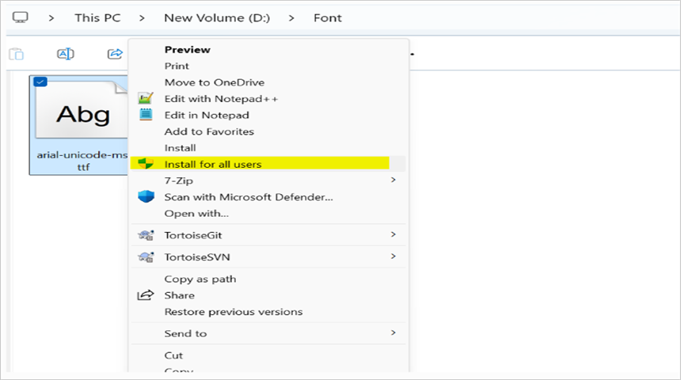

# Frequently asked questions about Word to PDF and image conversions

The frequently asked questions about Word to PDF and image conversions using DocIO are listed below.

## Could not find Syncfusion.OfficeChartToImageConverter assembly in .NET 3.5 Framework, does it mean there is no support for chart conversion in this Framework? 

Yes, OfficeChartToImageConverter assembly is not supported in .NET 3.5 Framework and it is available in .NET 4.0 Framework.

## Is it possible to convert 3D charts to PDF or image?

Current version of the DocIO library does not provide support for converting 3D charts to PDF or image format.

## Is it possible to specify PDF conformance level in Word to PDF conversion?

Yes, you can specify the PDF conformance level in Word to PDF conversion. For more details, refer [PDF Conformance](https://help.syncfusion.com/document-processing/pdf/pdf-library/net/working-with-pdf-conformance).

## Which one is better Azure App Service or Cloud Service for Word to PDF or image using DocIO?

When the Word document contains metafile images (*.emf or *.wmf), we recommend using Azure Cloud Service.

We have found metafile images (*.emf, *.wmf) that are not supported in Azure App Service while converting a Word document with metafile images into PDF or image. And also, this is one of the known limitations in Azure App Service. In this scenario, internally, Essential&reg; DocIO preserves RedX images in the same size during the Word to PDF or image conversion to avoid pagination problems.

## Why images are preserved as RedX images in Word to PDF or image conversion?

**In .NET Core or .NET targeting applications**, metafile (*.wmf, *.emf) images have some limitations in DocIORenderer. Internally, DocIORenderer used the SkiaSharp graphics library to layout the text and images in PDF or image conversion. And SkiaSharp library does not support the metafile (".emf", ".wmf") images, so, it does not preserve the images in the mentioned applications.

Starting from version 27.x.x, the .NET Word Library (DocIO) uses its own Metafile renderer to preserve EMF images during Word to PDF or image conversions. However, it does not support converting certain metafile formats, including WMF, EMF Plus, EMF Dual, and EMF Spool files. If a Word document contains these types of images, DocIO preserves them as RedX images with the original image size during conversion to avoid pagination problems.

To preserve the expected images in the PDF or image conversion, we suggest you convert the metafile image formats to bitmap image format (JPEG or PNG) and then perform Word to PDF or image conversion.

**Suggestions:**

1. You can convert metafile image format to bitmap image format in the Word document using DocIO, you can refer to KB documentation link: [Convert and replace metafile image in word document to bitmap](https://support.syncfusion.com/kb/article/11331/how-to-convert-and-replace-emf-image-in-word-document-to-png-with-same-size). As this approach uses System.Drawing.Common, it is known limitation in Linux or cross platforms.

2. Otherwise, you can use the [WPF](https://www.nuget.org/packages/Syncfusion.DocToPDFConverter.Wpf/) or [Windows Forms](https://www.nuget.org/packages/Syncfusion.DocToPDFConverter.WinForms/) platform NuGet packages for .NET Core 3.0 or later versions targeting applications from v17.3.0.x and use the same [C# tab](https://help.syncfusion.com/document-processing/word/conversions/word-to-pdf/net/word-to-pdf) code examples for it. But in Mac and Linux environment, using the [WPF](https://www.nuget.org/packages/Syncfusion.DocToPDFConverter.Wpf) or [Windows Forms](https://www.nuget.org/packages/Syncfusion.DocToPDFConverter.WinForms/) platform NuGet packages have limitations.

## Why are content controls not preserved as editable form fields in the converted PDF document even when PreserveFormFields is enabled? 

Content controls behave differently from legacy form fields, such as Text, Checkbox, and Drop-down fields, during conversions to PDF format. While legacy form fields are typically preserved as editable form fields in the resulting PDF document, content controls are converted to plain text. The [PreserveFormFields](https://help.syncfusion.com/cr/document-processing/Syncfusion.DocToPDFConverter.DocToPDFConverterSettings.html#Syncfusion_DocToPDFConverter_DocToPDFConverterSettings_PreserveFormFields) API specifically retains the interactive nature of legacy form fields, not content controls.
To ensure that form fields remain editable in the PDF converted from Word document, it is recommended to use [Text](https://help.syncfusion.com/document-processing/word/word-library/net/working-with-form-fields#text-form-field), [Checkbox](https://help.syncfusion.com/document-processing/word/word-library/net/working-with-form-fields#check-box), and [Drop-down](https://help.syncfusion.com/document-processing/word/word-library/net/working-with-form-fields#drop-down) form fields instead of content controls in the Word document. Additionally, to preserve the form fields as editable in the resulting PDF, set the [PreserveFormFields](https://help.syncfusion.com/cr/document-processing/Syncfusion.DocToPDFConverter.DocToPDFConverterSettings.html#Syncfusion_DocToPDFConverter_DocToPDFConverterSettings_PreserveFormFields) API to true.

You can download a complete working sample from [GitHub](https://github.com/SyncfusionExamples/DocIO-Examples/tree/main/Word-to-PDF-Conversion/Create-fillable-PDF-from-Word).

## Why are some fonts missing when converting a Word document to PDF in the Syncfusion® demo application?

The Syncfusion® [online demo](https://ej2aspnetcore.azurewebsites.net/aspnetcore/word/wordtopdf#/material3) has a limited set of default fonts. If certain fonts are missing during the Word-to-PDF conversion, it may cause preservation problems.

To ensure the fonts appear exactly as they do in the Word document during PDF conversion in our [online demo](https://ej2aspnetcore.azurewebsites.net/aspnetcore/word/wordtopdf#/material3), we recommend embedding the missing fonts directly into the Word document before performing the conversion. For detailed guidance on embedding fonts in a Word document using Microsoft Word, refer [here](https://support.syncfusion.com/kb/article/13969/how-to-resolve-font-problems-during-word-to-pdf-or-image-conversion#suggestion-3:-embed-fonts-in-docx).

## How to edit a Word document in Microsoft Word and convert it to PDF/image simultaneously using the DocIO library?

To preserve editable content while converting a Word document to a PDF or image without closing Microsoft Word, open and edit the document in Word, save the changes, and use the [OpenReadOnly](https://help.syncfusion.com/cr/document-processing/Syncfusion.DocIO.DLS.WordDocument.html#Syncfusion_DocIO_DLS_WordDocument_OpenReadOnly_System_String_Syncfusion_DocIO_FormatType_) method to load the document in read-only mode for conversion. Changes that are not saved in the Word document using Microsoft Word will not appear in the converted PDF or image.

For more details about open Word document in read only mode, refer to the [documentation](https://help.syncfusion.com/document-processing/word/word-library/net/loading-and-saving-document#opening-the-read-only-word-document).

## Are you experiencing font access problems in IIS during Word to PDF/Image, but not locally?

This issue occurs when fonts are installed using the basic *Install* option. Fonts installed this way are not shared system-wide, so IIS cannot access them.

To resolve this, uninstall the fonts and reinstall them by right-clicking the font file and selecting the **Install for all users option** to make them available system-wide. After that, restart your machine and host the application in IIS for seamless functionality.

Refer to the image below for guidance on selecting the Install for all users option:

## How to resolve the "SKImageInfo" exception during Word to PDF or image conversion in Linux OS?

If you encounter the exception *The type initializer for 'SkiaSharp.SKImageInfo' threw an exception*, it may be due to installing incompatible versions of the following NuGet packages:

- [SkiaSharp.NativeAssets.Linux](https://www.nuget.org/packages/SkiaSharp.NativeAssets.Linux)
- [HarfBuzzSharp.NativeAssets.Linux](https://www.nuget.org/packages/HarfBuzzSharp.NativeAssets.Linux)

To resolve this, reinstall the correct versions of these NuGet packages as specified in the [documentation](https://help.syncfusion.com/document-processing/word/word-library/net/faqs/linux-faqs#what-are-the-nuget-packages-to-be-installed-to-perform-word-to-pdf-conversion-in-linux-os), along with the required [Word to PDF conversion NuGet packages](https://help.syncfusion.com/document-processing/word/word-library/net/nuget-packages-required#converting-word-document-to-pdf).

If using Docker, ensure you install the libfontconfig package within your Docker container, as mentioned in the [documentation](https://help.syncfusion.com/document-processing/word/word-library/net/faqs/linux-faqs#how-to-resolve-libskiasharp-not-found-exception).

## How to convert Word document to PDF/A?

To convert a Word document to PDF/A, refer to this [link](https://help.syncfusion.com/document-processing/word/conversions/word-to-pdf/net/word-to-pdf-settings#pdf-conformance-level).
