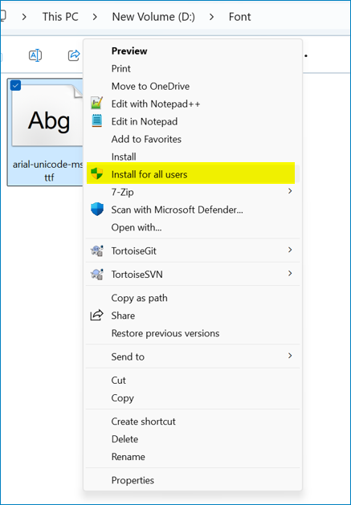

# Frequently asked questions about Word to PDF and image conversions

The frequently asked questions about Word to PDF and image conversions using DocIO are listed below.

## Could not find Syncfusion.OfficeChartToImageConverter assembly in .NET 3.5 Framework, does it mean there is no support for chart conversion in this Framework? 

Yes, OfficeChartToImageConverter assembly is not supported in .NET 3.5 Framework and it is available in .NET 4.0 Framework.

## Is it possible to convert 3D charts to PDF or image?

Current version of the DocIO library does not provide support for converting 3D charts to PDF or image format.

## Is it possible to specify PDF conformance level in Word to PDF conversion?

Yes, you can specify the PDF conformance level in Word to PDF conversion. For more details, refer [PDF Conformance](https://help.syncfusion.com/document-processing/pdf/pdf-library/net/working-with-pdf-conformance).

## Why are content controls not preserved as editable form fields in the converted PDF document even when PreserveFormFields is enabled? 

Content controls behave differently from legacy form fields, such as Text, Checkbox, and Drop-down fields, during conversions to PDF format. While legacy form fields are typically preserved as editable form fields in the resulting PDF document, content controls are converted to plain text. The [PreserveFormFields](https://help.syncfusion.com/cr/document-processing/Syncfusion.DocToPDFConverter.DocToPDFConverterSettings.html#Syncfusion_DocToPDFConverter_DocToPDFConverterSettings_PreserveFormFields) API specifically retains the interactive nature of legacy form fields, not content controls.
To ensure that form fields remain editable in the PDF converted from Word document, it is recommended to use [Text](https://help.syncfusion.com/document-processing/word/word-library/net/working-with-form-fields#text-form-field), [Checkbox](https://help.syncfusion.com/document-processing/word/word-library/net/working-with-form-fields#check-box), and [Drop-down](https://help.syncfusion.com/document-processing/word/word-library/net/working-with-form-fields#drop-down) form fields instead of content controls in the Word document. Additionally, to preserve the form fields as editable in the resulting PDF, set the [PreserveFormFields](https://help.syncfusion.com/cr/document-processing/Syncfusion.DocToPDFConverter.DocToPDFConverterSettings.html#Syncfusion_DocToPDFConverter_DocToPDFConverterSettings_PreserveFormFields) API to true.

You can download a complete working sample from [GitHub](https://github.com/SyncfusionExamples/DocIO-Examples/tree/main/Word-to-PDF-Conversion/Create-fillable-PDF-from-Word).

## Why are some fonts missing when converting a Word document to PDF in the Syncfusion® demo application?

The Syncfusion® [online demo](https://ej2.syncfusion.com/aspnetcore/word/wordtopdf#/bootstrap5) has a limited set of default fonts. If certain fonts are missing during the Word-to-PDF conversion, it may cause preservation problems.

To ensure the fonts appear exactly as they do in the Word document during PDF conversion in our [online demo](https://ej2.syncfusion.com/aspnetcore/word/wordtopdf#/bootstrap5), we recommend embedding the missing fonts directly into the Word document before performing the conversion. For detailed guidance on embedding fonts in a Word document using Microsoft Word, refer [here](https://support.syncfusion.com/kb/article/13969/how-to-resolve-font-problems-during-word-to-pdf-or-image-conversion#suggestion-3:-embed-fonts-in-docx).

## How to edit a Word document in Microsoft Word and convert it to PDF/image simultaneously using the DocIO library?

To preserve editable content while converting a Word document to a PDF or image without closing Microsoft Word, open and edit the document in Word, save the changes, and use the [OpenReadOnly](https://help.syncfusion.com/cr/document-processing/Syncfusion.DocIO.DLS.WordDocument.html#Syncfusion_DocIO_DLS_WordDocument_OpenReadOnly_System_String_Syncfusion_DocIO_FormatType_) method to load the document in read-only mode for conversion. Changes that are not saved in the Word document using Microsoft Word will not appear in the converted PDF or image.

For more details about open Word document in read only mode, refer to the [documentation](https://help.syncfusion.com/document-processing/word/word-library/net/loading-and-saving-document#opening-the-read-only-word-document).

## Are you experiencing font access problems in IIS during Word to PDF/Image, but not locally?

This issue occurs when fonts are installed using the basic *Install* option. Fonts installed this way are not shared system-wide, so IIS cannot access them.

To resolve this, uninstall the fonts and reinstall them by right-clicking the font file and selecting the **Install for all users option** to make them available system-wide. After that, restart your machine and host the application in IIS for seamless functionality.

Refer to the image below for guidance on selecting the Install for all users option:

## How to resolve the "SKImageInfo" exception during Word to PDF or image conversion in Linux OS?

If you encounter the exception *The type initializer for 'SkiaSharp.SKImageInfo' threw an exception*, it may be due to installing incompatible versions of the following NuGet packages:

- [SkiaSharp.NativeAssets.Linux](https://www.nuget.org/packages/SkiaSharp.NativeAssets.Linux)
- [HarfBuzzSharp.NativeAssets.Linux](https://www.nuget.org/packages/HarfBuzzSharp.NativeAssets.Linux)

To resolve this, reinstall the correct versions of these NuGet packages as specified in the [documentation](https://help.syncfusion.com/document-processing/word/word-library/net/faqs/linux-faqs#what-are-the-nuget-packages-to-be-installed-to-perform-word-to-pdf-conversion-in-linux-os), along with the required [Word to PDF conversion NuGet packages](https://help.syncfusion.com/document-processing/word/word-library/net/nuget-packages-required#converting-word-document-to-pdf).

If using Docker, ensure you install the libfontconfig package within your Docker container, as mentioned in the [documentation](https://help.syncfusion.com/document-processing/word/word-library/net/faqs/linux-faqs#how-to-resolve-libskiasharp-not-found-exception).

## Will the same fonts be rendered when exporting a document to a PDF file?

Yes, if the fonts used in the document are installed on the machine during PDF conversion, they will be preserved in the output. However, if any fonts are missing, they will be substituted with default fonts, which may affect the appearance of the content.

For details on resolving font preservation issues during Word-to-PDF or image conversion, refer to the [documentation](https://support.syncfusion.com/kb/article/13969/how-to-resolve-font-problems-during-word-to-pdf-or-image-conversion).

## Why is the chart not preserved during Word-to-PDF or image conversion in .NET Framework?

During Word-to-PDF conversion in .NET Framework, need to initialize the [ChartToImageConverter]( https://help.syncfusion.com/cr/document-processing/Syncfusion.OfficeChartToImageConverter.ChartToImageConverter.html) to ensure that the chart is preserved in the PDF document. 

The following code example illustrates how to initialize [ChartToImageConverter]( https://help.syncfusion.com/cr/document-processing/Syncfusion.OfficeChartToImageConverter.ChartToImageConverter.html).



//Initializes the ChartToImageConverter for converting charts during Word to pdf conversion
wordDocument.ChartToImageConverter = new ChartToImageConverter();



For more details about the conversion, refer [here]( https://help.syncfusion.com/document-processing/word/conversions/word-to-pdf/overview?cs-save-lang=1&cs-lang=csharp#convert-word-to-pdf).

## How to convert Word document to PDF/A?

To convert a Word document to PDF/A, refer to this [link](https://help.syncfusion.com/document-processing/word/conversions/word-to-pdf/net/word-to-pdf-settings#pdf-conformance-level).

## How to validate the PDF conformance level in a DocIO-converted PDF?

PDF conformance can be verified using tools like **Adobe Acrobat Pro, VeraPDF, Xodo Validator, and PDFCreator Validator**. These tools check if the PDF meets compliance standards. DocIO-generated PDFs can be validated using any of these tools to ensure compliance with the required standards.

## Why does memory usage appear high in Visual Studio after converting a Word document to PDF using DocIO?

When converting Word documents to PDF using the Syncfusion DocIO library, Visual Studio may continue to show high memory usage—even after the conversion and proper disposal of objects. This does not indicate a memory leak.

To confirm that memory is being properly released, the following sample demonstrates how to measure heap memory using GC.GetTotalMemory(false) before and after document processing:



Console.WriteLine("Heap memory before loading document: " + GetMemoryInKB() + " KB");
// Load Word document
WordDocument document = new WordDocument("Input.docx", FormatType.Docx);
Console.WriteLine("Heap memory after loading document: " + GetMemoryInKB() + " KB");
// Convert to PDF
DocIORenderer renderer = new DocIORenderer();
PdfDocument pdf = renderer.ConvertToPDF(document);
Console.WriteLine("Heap memory after PDF conversion: " + GetMemoryInKB() + " KB");
// Save PDF to file
using (FileStream output = new FileStream("Output.pdf", FileMode.Create, FileAccess.Write))
{
    pdf.Save(output);
}
// Dispose objects
pdf.Dispose();
renderer.Dispose();
document.Dispose();
// Force garbage collection
GC.Collect();
GC.WaitForPendingFinalizers();
Console.WriteLine("Heap memory after disposing objects: " + GetMemoryInKB() + " KB");

static long GetMemoryInKB()
{
    return GC.GetTotalMemory(false) / 1000;
}



From the output above, you can see that heap memory is being reclaimed properly, even if Visual Studio's process memory view does not update immediately.

## Is it possible to substitute fonts in a Word document?

No, DocIO does not support substituting fonts within a Word document. Font substitution is applied only during Word-to-PDF and image conversions to ensure rendering accuracy. To change fonts in the actual Word document, refer to: [How to change font for all text in a Word document](https://support.syncfusion.com/kb/article/17487/how-to-change-the-font-for-all-text-in-a-net-core-word-document).

## How does hyphenation work in Microsoft Word compared to Syncfusion® DocIO?

**In Microsoft Word:** Microsoft Word automatically applies hyphenation based on built-in language rules. It uses its own internal dictionary that is not directly accessible. Users can enable/disable auto-hyphenation in Word settings.

**In Syncfusion® DocIO:** DocIO applies hyphenation rules using an external dictionary file. During hyphenation, it checks the language code for each word and applies hyphenation based on the corresponding dictionary file. If the required dictionary file is missing for a word, hyphenation is not performed for that word in the given Word document because no matching dictionary file is found for the language code.

## How to identify the language of a specific word in a Word document?

In Microsoft Word, select the word, then navigate to Review > Language > Set Proofing Language to check the language assigned to it.

## Why does hyphenation appear incorrectly or missing in the converted PDF?

Incorrect hyphenation happens when words are split improperly. This may be caused by missing hyphenation rules in the dictionary or font substitution. If the font used in the Word document is not available in the environment, a fallback font is used, which can alter text size and cause unexpected hyphenation. You can use the [SubstituteFont](https://help.syncfusion.com/cr/document-processing/Syncfusion.DocIO.DLS.FontSettings.html#Syncfusion_DocIO_DLS_FontSettings_SubstituteFont) event to detect and log missing fonts during conversion. Refer to the [GitHub sample](https://github.com/SyncfusionExamples/DocIO-Examples/tree/main/Word-to-PDF-Conversion/Get-missing-fonts-for-pdf-conversion) for printing the missing fonts by passing the input document.

Missing hyphenation occurs when certain words are not hyphenated at all. This usually means the dictionary file is missing or does not contain hyphenation rules for those words.

## How to improve hyphenation accuracy during Word to PDF conversion?

To improve hyphenation accuracy during Word to PDF conversion:
- **Verify the dictionary file:** Ensure the .dic file contains valid hyphenation patterns for the target language.
- **Test with different dictionaries:** Use alternative .dic files to identify better or more accurate hyphenation results.

## How to set custom Image Resolution in ASP.NET Core?

DocIO supports converting Word documents to images with standard resolution in **Windows Forms, WPF, ASP.NET**, and **ASP.NET MVC** platforms.

In **ASP.NET Core (Windows only)**, DocIO does not provide built-in support to set custom image resolution (DPI) or size (width/height) during Word-to-image conversion. However, you can adjust the resolution and dimensions of the exported images after conversion using **System.Drawing** APIs.

This approach works only on Windows. The System.Drawing.Common package is supported on Windows only from .NET 6. Refer to the .NET documentation [System.Drawing.Common is Windows-only](https://docs.microsoft.com/en-us/dotnet/core/compatibility/core-libraries/6.0/system-drawing-common-windows-only)

The following example demonstrates how to convert a Word document to images and set custom image resolution and size.



// Open the input Word document stream in read mode
using (FileStream docStream = new FileStream(Path.GetFullPath(@"Data/Template.docx"), FileMode.Open, FileAccess.Read))
{
    // Load the Word document using Syncfusion DocIO
    using (WordDocument document = new WordDocument(docStream, FormatType.Automatic))
    {
        // Create an instance of DocIORenderer to render the Word document as images
        using (DocIORenderer render = new DocIORenderer())
        {
            // Convert all pages of the Word document to image streams
            Stream[] imageStreams = document.RenderAsImages();
            // Iterate through each image stream (one per page)
            for (int i = 0; i < imageStreams.Length; i++)
            {
                // Reset the stream position to the beginning
                imageStreams[i].Position = 0;
                // Define custom dimensions for the output image
                int customWidth = 1500;
                int customHeight = 1500;
                // Load the image from stream
                Image image = Image.FromStream(imageStreams[i]);

                // Save the image to a new memory stream in PNG format
                MemoryStream stream = new MemoryStream();
                image.Save(stream, ImageFormat.Png);
                // Create a new bitmap with custom size and pixel format
                Bitmap bitmap = new Bitmap(customWidth, customHeight, PixelFormat.Format32bppPArgb);
                // Create graphics object to draw on the bitmap
                Graphics graphics = Graphics.FromImage(bitmap);
                // Set bitmap resolution to 300 DPI
                bitmap.SetResolution(300, 300);
                // Draw the resized image onto the custom-sized bitmap
                graphics.DrawImage(Image.FromStream(stream), new Rectangle(0, 0, bitmap.Width, bitmap.Height));
                // Save the final bitmap image to output folder
                bitmap.Save(Path.GetFullPath(@"Output/Image_" + i + ".png"));
            }
        }
    }
}



You can download a complete working sample from [GitHub](https://github.com/SyncfusionExamples/DocIO-Examples/tree/main/Word-to-Image-conversion/Set-custom-image-resolution/.NET).

## What languages and Unicode support are available in the DocIO library?

DocIO library supports **multiple languages, including Chinese and Japanese**, with no specific language limitations when creating and saving Word documents.

For **Unicode support** during Word-to-PDF conversion, the library provides fallback font options to ensure proper rendering of Unicode characters. Refer to the [documentation on fallback fonts](https://help.syncfusion.com/document-processing/word/conversions/word-to-pdf/net/fallback-fonts-word-to-pdf#supported-script-types).

## What are Web Layout View and Print Layout View in Microsoft Word, and which one does DocIO use for PDF conversion?

**Web Layout View:** Displays the document as it would appear on a webpage, without page breaks or print formatting.

**Print Layout View:** Shows the document as it would appear when printed, with page breaks, headers, and margins.

**DocIO PDF conversion behavior:**
DocIO uses the **Print Layout View** during document conversion to preserve the layout, including page breaks and formatting.
