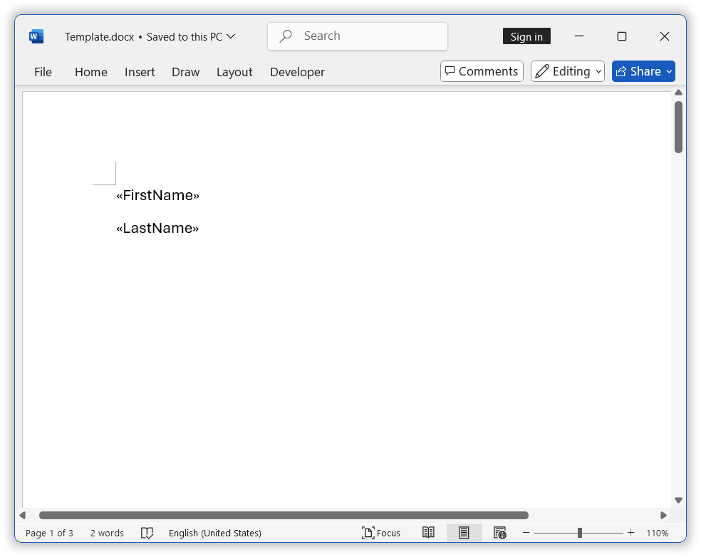

# Troubleshooting Mail Merge Issues in .NET Word Library

## Why is mail merge not working correctly in DocIO?

Mail merge issues can arise due to incorrect merge fields, mismatched data sources, or missing fields in the template. Ensure the following:

*  Merge fields (<<FieldName>>) are used instead of plain text.
*  **Data Source Check:** Ensure the required fields exist in the data source.
*  **Match Field Names:** Sometimes, the field names in the Word document are different from the property names in your data source class. For example, if your document has "FirstName" and "LastName", but your Employee class uses different names, mail merge will not work correctly.

   **How to fix this:**
     * The property names in your MergeField class should be exactly the same as the merge field names in your Word document.
     * Field names are case-sensitive, so make sure they match exactly.
     * You can press **Alt + F9** in Microsoft Word to see the actual field codes and check if they are correct.

**Example:**
**Word Document Fields:**

**.NET Class Structure to Match Merge Fields:**




public class Employee
{
   public string FirstName { get; set; }  // Matches merge field name
   public string LastName { get; set; }   // Matches merge field name
}


*  **Show Field Codes:** Press Alt + F9 in Microsoft Word to reveal field codes and verify they are correct.

## Why does mail merge not recognize manually typed text in Word document?

Mail merge only works with merge fields, not manually typed placeholders. If text is entered instead of a merge field, Word treats it as plain text.

**Solution using Microsoft Word:**
1.	Navigate to Insert → Field or press <kbd>Ctrl</kbd>+<kbd>F9</kbd>.
2.	Right-click the inserted field and select Edit Field.
3.	Choose MergeField from the list and specify the field name.

**Solution using DocIO:**

Refer to [Syncfusion&reg; Documentation](https://help.syncfusion.com/document-processing/word/word-library/net/working-with-find-and-replace#find-and-replace-a-pattern-of-text-with-a-merge-field) for detailed implementation.

## Why is nested group mail merge not functioning correctly?

Nested mail merge requires proper execution using the correct method and structure.
*  Use the appropriate overload of the ExecuteNestedGroup method to handle nested groups effectively. Refer to the Syncfusion documentation for supported overloads.
*  Ensure the data structure follows the correct hierarchy for nested groups to maintain implicit relational data.
