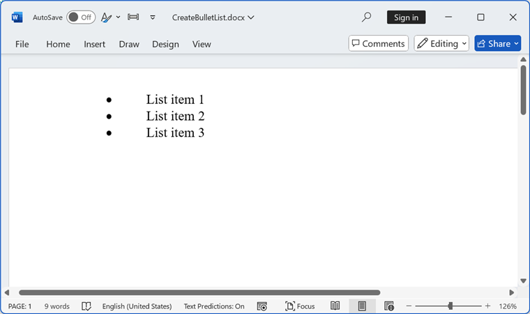
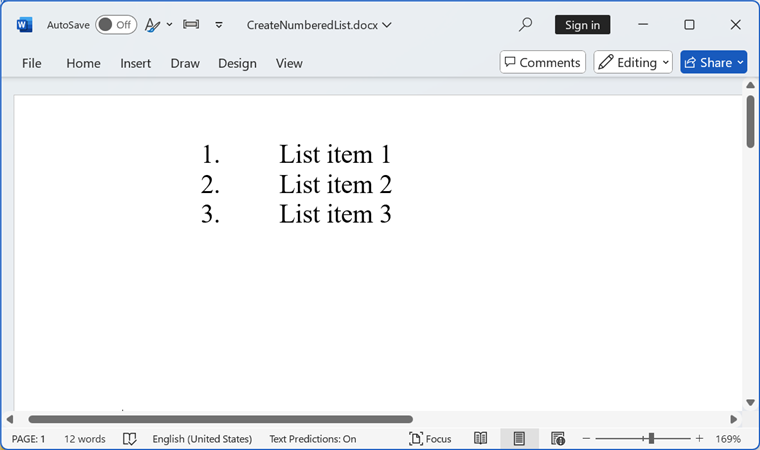
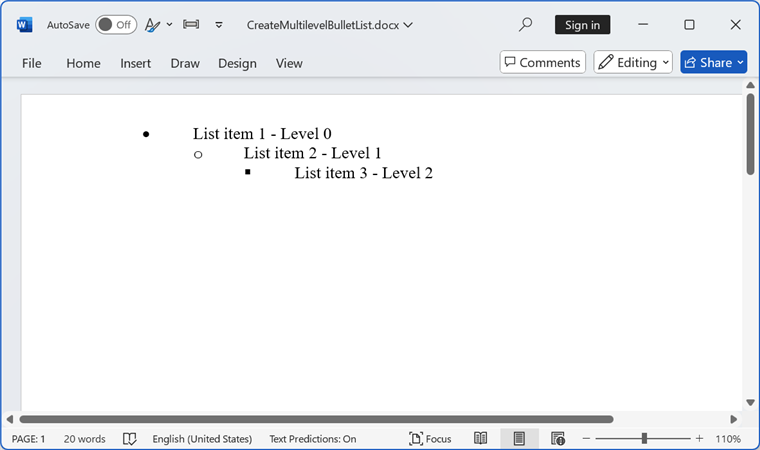
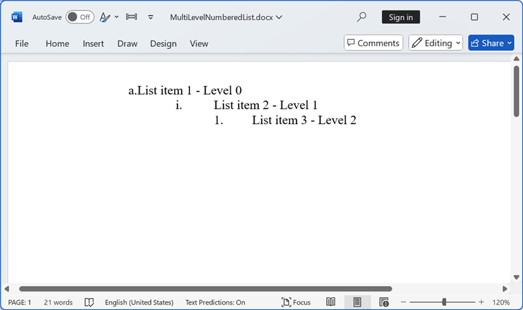
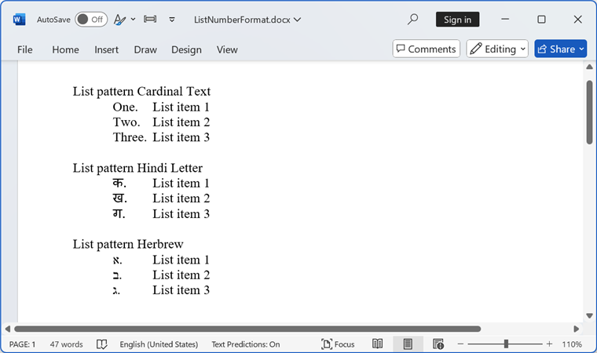
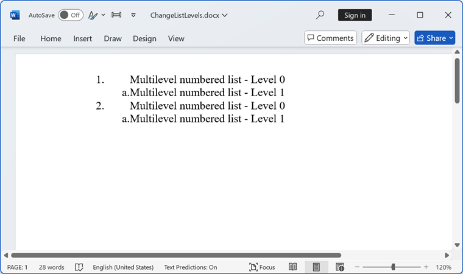
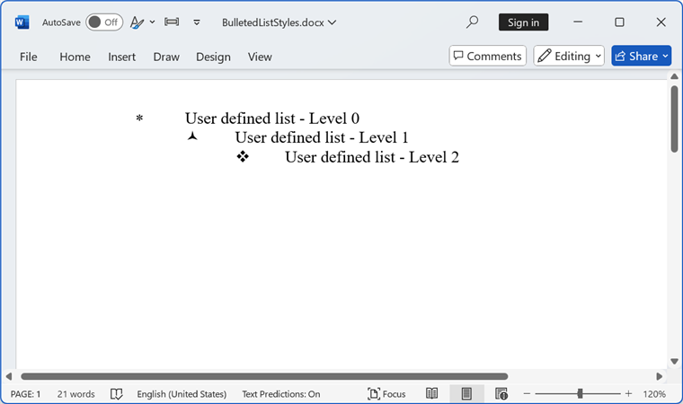
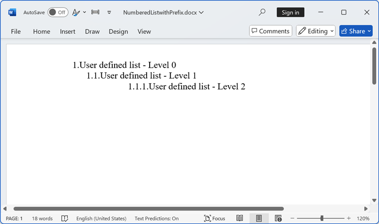

# Working with Lists

Lists can organize and format the contents of a document in hierarchical way. There are nine levels in the list, starting from level 0 to level 8. DocIO supports both built-in list styles and custom list styles. The following are the types of list supported in DocIO: 

* Numbered list
* Bulleted list 

## Create Bulleted List

The following code example explains how to create a simple bulleted list.




//Creates a new Word document 
WordDocument document = new WordDocument();
//Adds new section to the document
IWSection section = document.AddSection();
//Adds new paragraph to the section
IWParagraph paragraph = section.AddParagraph();
//Applies default numbered list style
paragraph.ListFormat.ApplyDefBulletStyle();
//Adds text to the paragraph
paragraph.AppendText("List item 1");
//Continues the list defined
paragraph.ListFormat.ContinueListNumbering();
//Adds second paragraph
paragraph = section.AddParagraph();
paragraph.AppendText("List item 2");
//Continues last defined list
paragraph.ListFormat.ContinueListNumbering();
//Adds new paragraph
paragraph = section.AddParagraph();
paragraph.AppendText("List item 3");
//Continues last defined list
paragraph.ListFormat.ContinueListNumbering();
//Saves the Word document to MemoryStream.
MemoryStream stream = new MemoryStream();
document.Save(stream, FormatType.Docx);
//Closes the Word document.
document.Close();



//Creates a new Word document 
WordDocument document = new WordDocument();
//Adds new section to the document
IWSection section = document.AddSection();
//Adds new paragraph to the section
IWParagraph paragraph = section.AddParagraph();
//Applies default numbered list style
paragraph.ListFormat.ApplyDefBulletStyle();
//Adds text to the paragraph
paragraph.AppendText("List item 1");
//Continues the list defined
paragraph.ListFormat.ContinueListNumbering();
//Adds second paragraph
paragraph = section.AddParagraph();
paragraph.AppendText("List item 2");
//Continues last defined list
paragraph.ListFormat.ContinueListNumbering();
//Adds new paragraph
paragraph = section.AddParagraph();
paragraph.AppendText("List item 3");
//Continues last defined list
paragraph.ListFormat.ContinueListNumbering();
//Saves the Word document
document.Save("Sample.docx", FormatType.Docx);
//Closes the document
document.Close();



'Creates a new Word document 
Dim document As New WordDocument()
'Adds new section to the document
Dim section As IWSection = document.AddSection()
'Adds new paragraph to the section
Dim paragraph As IWParagraph = section.AddParagraph()
'Applies default numbered list style
paragraph.ListFormat.ApplyDefBulletStyle()
'Adds text to the paragraph
paragraph.AppendText("List item 1")
'Continues the list defined
paragraph.ListFormat.ContinueListNumbering()
'Adds second paragraph
paragraph = section.AddParagraph()
paragraph.AppendText("List item 2")
'Continues last defined list
paragraph.ListFormat.ContinueListNumbering()
'Adds new paragraph
paragraph = section.AddParagraph()
paragraph.AppendText("List item 3")
'Continues last defined list
paragraph.ListFormat.ContinueListNumbering()
'Saves the Word document
document.Save("Sample.docx", FormatType.Docx)
'Closes the document
document.Close()




By running the above code, you will generate a **Bullet List** as shown below.

You can download a complete working sample from [GitHub](https://github.com/SyncfusionExamples/DocIO-Examples/tree/main/Paragraphs/Simple-bulleted-list).

## Create Numbered List

The following code example explains how to create a simple numbered list.




//Creates a new Word document 
WordDocument document = new WordDocument();
//Adds new section to the document
IWSection section = document.AddSection();
//Adds new paragraph to the section
IWParagraph paragraph = section.AddParagraph();
//Applies default numbered list style
paragraph.ListFormat.ApplyDefNumberedStyle();
//Adds text to the paragraph
paragraph.AppendText("List item 1");
//Continues the list defined
paragraph.ListFormat.ContinueListNumbering();
//Adds second paragraph
paragraph = section.AddParagraph();
paragraph.AppendText("List item 2");
//Continues last defined list
paragraph.ListFormat.ContinueListNumbering();
//Adds new paragraph
paragraph = section.AddParagraph();
paragraph.AppendText("List item 3");
//Continues last defined list
paragraph.ListFormat.ContinueListNumbering();
//Saves the Word document to MemoryStream.
MemoryStream stream = new MemoryStream();
document.Save(stream, FormatType.Docx);
//Closes the Word document.
document.Close();



//Creates a new Word document 
WordDocument document = new WordDocument();
//Adds new section to the document
IWSection section = document.AddSection();
//Adds new paragraph to the section
IWParagraph paragraph = section.AddParagraph();
//Applies default numbered list style
paragraph.ListFormat.ApplyDefNumberedStyle();
//Adds text to the paragraph
paragraph.AppendText("List item 1");
//Continues the list defined
paragraph.ListFormat.ContinueListNumbering();
//Adds second paragraph
paragraph = section.AddParagraph();
paragraph.AppendText("List item 2");
//Continues last defined list
paragraph.ListFormat.ContinueListNumbering();
//Adds new paragraph
paragraph = section.AddParagraph();
paragraph.AppendText("List item 3");
//Continues last defined list
paragraph.ListFormat.ContinueListNumbering();
//Saves the Word document
document.Save("Sample.docx", FormatType.Docx);
//Closes the document
document.Close();



'Creates a new Word document 
Dim document As New WordDocument()
'Adds new section to the document
Dim section As IWSection = document.AddSection()
'Adds new paragraph to the section
Dim paragraph As IWParagraph = section.AddParagraph()
'Applies default numbered list style
paragraph.ListFormat.ApplyDefNumberedStyle()
'Adds text to the paragraph
paragraph.AppendText("List item 1")
'Continues the list defined
paragraph.ListFormat.ContinueListNumbering()
'Adds second paragraph
paragraph = section.AddParagraph()
paragraph.AppendText("List item 2")
'Continues last defined list
paragraph.ListFormat.ContinueListNumbering()
'Adds new paragraph
paragraph = section.AddParagraph()
paragraph.AppendText("List item 3")
'Continues last defined list
paragraph.ListFormat.ContinueListNumbering()
'Saves the Word document
document.Save("Sample.docx", FormatType.Docx)
'Closes the document
document.Close()




By running the above code, you will generate a **Numbered List** as shown below.

You can download a complete working sample from [GitHub](https://github.com/SyncfusionExamples/DocIO-Examples/tree/main/Paragraphs/Simple-numbered-list).

## Create Multilevel Bulleted List

The following code example explains how to create a multilevel bulleted list.




//Creates a new Word document 
WordDocument document = new WordDocument();
//Adds new section to the document
IWSection section = document.AddSection();
//Adds new paragraph to the section
IWParagraph paragraph = section.AddParagraph();
//Applies default numbered list style
paragraph.ListFormat.ApplyDefBulletStyle();
//Adds text to the paragraph
paragraph.AppendText("List item 1 - Level 0");
//Continues the list defined
paragraph.ListFormat.ContinueListNumbering();
//Adds second paragraph
paragraph = section.AddParagraph();
paragraph.AppendText("List item 2 - Level 1");
//Continues last defined list
paragraph.ListFormat.ContinueListNumbering();
//Increases the level indent
paragraph.ListFormat.IncreaseIndentLevel();
//Adds new paragraph
paragraph = section.AddParagraph();
paragraph.AppendText("List item 3 - Level 2");
//Continues last defined list
paragraph.ListFormat.ContinueListNumbering();
//Increases the level indent
paragraph.ListFormat.IncreaseIndentLevel();
//Saves the Word document to MemoryStream.
MemoryStream stream = new MemoryStream();
document.Save(stream, FormatType.Docx);
//Closes the Word document.
document.Close();



//Creates a new Word document 
WordDocument document = new WordDocument();
//Adds new section to the document
IWSection section = document.AddSection();
//Adds new paragraph to the section
IWParagraph paragraph = section.AddParagraph();
//Applies default numbered list style
paragraph.ListFormat.ApplyDefBulletStyle();
//Adds text to the paragraph
paragraph.AppendText("List item 1 - Level 0");
//Continues the list defined
paragraph.ListFormat.ContinueListNumbering();
//Adds second paragraph
paragraph = section.AddParagraph();
paragraph.AppendText("List item 2 - Level 1");
//Continues last defined list
paragraph.ListFormat.ContinueListNumbering();
//Increases the level indent
paragraph.ListFormat.IncreaseIndentLevel();
//Adds new paragraph
paragraph = section.AddParagraph();
paragraph.AppendText("List item 3 - Level 2");
//Continues last defined list
paragraph.ListFormat.ContinueListNumbering();
//Increases the level indent
paragraph.ListFormat.IncreaseIndentLevel();
//Saves the Word document
document.Save("Sample.docx", FormatType.Docx);
//Closes the document
document.Close();



'Creates a new Word document 
Dim document As New WordDocument()
'Adds new section to the document
Dim section As IWSection = document.AddSection()
'Adds new paragraph to the section
Dim paragraph As IWParagraph = section.AddParagraph()
'Applies default numbered list style
paragraph.ListFormat.ApplyDefBulletStyle()
'Adds text to the paragraph
paragraph.AppendText("List item 1 - Level 0")
'Continues the list defined
paragraph.ListFormat.ContinueListNumbering()
'Adds second paragraph
paragraph = section.AddParagraph()
paragraph.AppendText("List item 2 - Level 1")
'Continues last defined list
paragraph.ListFormat.ContinueListNumbering()
'Increases the level indent
paragraph.ListFormat.IncreaseIndentLevel()
'Adds new paragraph
paragraph = section.AddParagraph()
paragraph.AppendText("List item 3 - Level 2")
'Continues last defined list
paragraph.ListFormat.ContinueListNumbering()
'Increases the level indent
paragraph.ListFormat.IncreaseIndentLevel()
'Saves the Word document
document.Save("Sample.docx", FormatType.Docx)
'Closes the document
document.Close()




By running the above code, you will generate a **Multilevel Bullet List** as shown below.

You can download a complete working sample from [GitHub](https://github.com/SyncfusionExamples/DocIO-Examples/tree/main/Paragraphs/Multilevel-bulleted-list).

## Create Multilevel Numbered List

The following code example explains how to create multilevel numbered list.




//Creates a new Word document 
WordDocument document = new WordDocument();
//Adds new section to the document     
IWSection section = document.AddSection();
//Adds new paragraph to the section
IWParagraph paragraph = section.AddParagraph();
//Applies default numbered list style
paragraph.ListFormat.ApplyDefNumberedStyle();
//Adds text to the paragraph
paragraph.AppendText("List item 1 - Level 0");
//Continues the list defined
paragraph.ListFormat.ContinueListNumbering();
//Adds second paragraph
paragraph = section.AddParagraph();
paragraph.AppendText("List item 2 - Level 1");
//Continues last defined list
paragraph.ListFormat.ContinueListNumbering();
//Increases the level indent
paragraph.ListFormat.IncreaseIndentLevel();
//Adds new paragraph
paragraph = section.AddParagraph();
paragraph.AppendText("List item 3 - Level 2");
//Continues last defined list
paragraph.ListFormat.ContinueListNumbering();
//Increases the level indent
paragraph.ListFormat.IncreaseIndentLevel();
//Saves the Word document to MemoryStream.
MemoryStream stream = new MemoryStream();
document.Save(stream, FormatType.Docx);
//Closes the Word document.
document.Close();



//Creates a new Word document 
WordDocument document = new WordDocument();
//Adds new section to the document
IWSection section = document.AddSection();
//Adds new paragraph to the section
IWParagraph paragraph = section.AddParagraph();
//Applies default numbered list style
paragraph.ListFormat.ApplyDefNumberedStyle();
//Adds text to the paragraph
paragraph.AppendText("List item 1 - Level 0");
//Continues the list defined
paragraph.ListFormat.ContinueListNumbering();
//Adds second paragraph
paragraph = section.AddParagraph();
paragraph.AppendText("List item 2 - Level 1");
//Continues last defined list
paragraph.ListFormat.ContinueListNumbering();
//Increases the level indent
paragraph.ListFormat.IncreaseIndentLevel();
//Adds new paragraph
paragraph = section.AddParagraph();
paragraph.AppendText("List item 3 - Level 2");
//Continues last defined list
paragraph.ListFormat.ContinueListNumbering();
//Increases the level indent
paragraph.ListFormat.IncreaseIndentLevel();
//Saves the Word document
document.Save("Sample.docx", FormatType.Docx);
//Closes the document
document.Close();



'Creates a new Word document 
Dim document As New WordDocument()
'Adds new section to the document
Dim section As IWSection = document.AddSection()
'Adds new paragraph to the section
Dim paragraph As IWParagraph = section.AddParagraph()
'Applies default numbered list style
paragraph.ListFormat.ApplyDefNumberedStyle()
'Adds text to the paragraph
paragraph.AppendText("List item 1 - Level 0")
'Continues the list defined
paragraph.ListFormat.ContinueListNumbering()
'Adds second paragraph
paragraph = section.AddParagraph()
paragraph.AppendText("List item 2 - Level 1")
'Continues last defined list
paragraph.ListFormat.ContinueListNumbering()
'Increases the level indent
paragraph.ListFormat.IncreaseIndentLevel()
'Adds new paragraph
paragraph = section.AddParagraph()
paragraph.AppendText("List item 3 - Level 2")
'Continues last defined list
paragraph.ListFormat.ContinueListNumbering()
'Increases the level indent
paragraph.ListFormat.IncreaseIndentLevel()
'Saves the Word document
document.Save("Sample.docx", FormatType.Docx)
'Closes the document
document.Close()




By running the above code, you will generate a **Multilevel Numbered List** as shown below.

You can download a complete working sample from [GitHub](https://github.com/SyncfusionExamples/DocIO-Examples/tree/main/Paragraphs/Multilevel-numbered-list).

## List number format

The ListPatternType enum in DocIO lets you customize how list numbers appear in Word documents. It supports 61 styles, including Arabic, Hebrew, and more. This is useful for creating region-specific documents or applying culturally appropriate numbering formats.

The following code example demonstrates how to create a list number format.




// Creates a new Word document.
WordDocument document = new WordDocument();
// Adds a new section to the document.
IWSection section = document.AddSection();
IWParagraph paragraph = section.AddParagraph();

// Adds a numbered list style with CardinalText pattern (One, Two, Three, ...).
ListStyle listStyle = document.AddListStyle(ListType.Numbered, "CardinalText");
WListLevel levelOne = listStyle.Levels[0];
levelOne.PatternType = ListPatternType.CardinalText;
levelOne.StartAt = 1;
// Adds a heading paragraph for the CardinalText list.
paragraph = section.AddParagraph();
paragraph.AppendText("List pattern Cardinal Text");
// Adds first list item using CardinalText style.
paragraph = section.AddParagraph();
paragraph.AppendText("List item 1");
paragraph.ListFormat.ApplyStyle("CardinalText");
paragraph.ListFormat.ContinueListNumbering();
// Adds second list item using CardinalText style.
paragraph = section.AddParagraph();
paragraph.AppendText("List item 2");
paragraph.ListFormat.ApplyStyle("CardinalText");
paragraph.ListFormat.ContinueListNumbering();
// Adds third list item using CardinalText style.
paragraph = section.AddParagraph();
paragraph.AppendText("List item 3");
paragraph.ListFormat.ApplyStyle("CardinalText");
paragraph.ListFormat.ContinueListNumbering();
// Adds a blank paragraph before the next list.
paragraph = section.AddParagraph();

// Adds a numbered list style with HindiLetter1 pattern.
listStyle = document.AddListStyle(ListType.Numbered, "HindiLetter1");
levelOne = listStyle.Levels[0];
levelOne.PatternType = ListPatternType.HindiLetter1;
levelOne.StartAt = 1;
// Adds a heading paragraph for the HindiLetter1 list.
paragraph = section.AddParagraph();
paragraph.AppendText("List pattern Hindi Letter");
// Adds first list item using HindiLetter1 style.
paragraph = section.AddParagraph();
paragraph.AppendText("List item 1");
paragraph.ListFormat.ApplyStyle("HindiLetter1");
paragraph.ListFormat.ContinueListNumbering();
// Adds second list item using HindiLetter1 style.
paragraph = section.AddParagraph();
paragraph.AppendText("List item 2");
paragraph.ListFormat.ApplyStyle("HindiLetter1");
paragraph.ListFormat.ContinueListNumbering();
// Adds third list item using HindiLetter1 style.
paragraph = section.AddParagraph();
paragraph.AppendText("List item 3");
paragraph.ListFormat.ApplyStyle("HindiLetter1");
paragraph.ListFormat.ContinueListNumbering();
// Adds a blank paragraph before the next list.
paragraph = section.AddParagraph();

// Adds a numbered list style with Hebrew1 pattern.
listStyle = document.AddListStyle(ListType.Numbered, "Hebrew1");
levelOne = listStyle.Levels[0];
levelOne.PatternType = ListPatternType.Hebrew1;
levelOne.StartAt = 1;
// Adds a heading paragraph for the Hebrew1 list.
paragraph = section.AddParagraph();
paragraph.AppendText("List pattern Herbrew");
// Adds first list item using Hebrew1 style.
paragraph = section.AddParagraph();
paragraph.AppendText("List item 1");
paragraph.ListFormat.ApplyStyle("Hebrew1");
paragraph.ListFormat.ContinueListNumbering();
// Adds second list item using Hebrew1 style.
paragraph = section.AddParagraph();
paragraph.AppendText("List item 2");
paragraph.ListFormat.ApplyStyle("Hebrew1");
paragraph.ListFormat.ContinueListNumbering();
// Adds third list item using Hebrew1 style.
paragraph = section.AddParagraph();
paragraph.AppendText("List item 3");
paragraph.ListFormat.ApplyStyle("Hebrew1");
paragraph.ListFormat.ContinueListNumbering();
//Saves the Word document to MemoryStream.
MemoryStream stream = new MemoryStream();
document.Save(stream, FormatType.Docx);
//Closes the Word document.
document.Close();



// Creates a new Word document.
WordDocument document = new WordDocument();
// Adds a new section to the document.
IWSection section = document.AddSection();
IWParagraph paragraph = section.AddParagraph();

// Adds a numbered list style with CardinalText pattern (One, Two, Three, ...).
ListStyle listStyle = document.AddListStyle(ListType.Numbered, "CardinalText");
WListLevel levelOne = listStyle.Levels[0];
levelOne.PatternType = ListPatternType.CardinalText;
levelOne.StartAt = 1;
// Adds a heading paragraph for the CardinalText list.
paragraph = section.AddParagraph();
paragraph.AppendText("List pattern Cardinal Text");
// Adds first list item using CardinalText style.
paragraph = section.AddParagraph();
paragraph.AppendText("List item 1");
paragraph.ListFormat.ApplyStyle("CardinalText");
paragraph.ListFormat.ContinueListNumbering();
// Adds second list item using CardinalText style.
paragraph = section.AddParagraph();
paragraph.AppendText("List item 2");
paragraph.ListFormat.ApplyStyle("CardinalText");
paragraph.ListFormat.ContinueListNumbering();
// Adds third list item using CardinalText style.
paragraph = section.AddParagraph();
paragraph.AppendText("List item 3");
paragraph.ListFormat.ApplyStyle("CardinalText");
paragraph.ListFormat.ContinueListNumbering();
// Adds a blank paragraph before the next list.
paragraph = section.AddParagraph();

// Adds a numbered list style with HindiLetter1 pattern.
listStyle = document.AddListStyle(ListType.Numbered, "HindiLetter1");
levelOne = listStyle.Levels[0];
levelOne.PatternType = ListPatternType.HindiLetter1;
levelOne.StartAt = 1;
// Adds a heading paragraph for the HindiLetter1 list.
paragraph = section.AddParagraph();
paragraph.AppendText("List pattern Hindi Letter");
// Adds first list item using HindiLetter1 style.
paragraph = section.AddParagraph();
paragraph.AppendText("List item 1");
paragraph.ListFormat.ApplyStyle("HindiLetter1");
paragraph.ListFormat.ContinueListNumbering();
// Adds second list item using HindiLetter1 style.
paragraph = section.AddParagraph();
paragraph.AppendText("List item 2");
paragraph.ListFormat.ApplyStyle("HindiLetter1");
paragraph.ListFormat.ContinueListNumbering();
// Adds third list item using HindiLetter1 style.
paragraph = section.AddParagraph();
paragraph.AppendText("List item 3");
paragraph.ListFormat.ApplyStyle("HindiLetter1");
paragraph.ListFormat.ContinueListNumbering();
// Adds a blank paragraph before the next list.
paragraph = section.AddParagraph();

// Adds a numbered list style with Hebrew1 pattern.
listStyle = document.AddListStyle(ListType.Numbered, "Hebrew1");
levelOne = listStyle.Levels[0];
levelOne.PatternType = ListPatternType.Hebrew1;
levelOne.StartAt = 1;
// Adds a heading paragraph for the Hebrew1 list.
paragraph = section.AddParagraph();
paragraph.AppendText("List pattern Herbrew");
// Adds first list item using Hebrew1 style.
paragraph = section.AddParagraph();
paragraph.AppendText("List item 1");
paragraph.ListFormat.ApplyStyle("Hebrew1");
paragraph.ListFormat.ContinueListNumbering();
// Adds second list item using Hebrew1 style.
paragraph = section.AddParagraph();
paragraph.AppendText("List item 2");
paragraph.ListFormat.ApplyStyle("Hebrew1");
paragraph.ListFormat.ContinueListNumbering();
// Adds third list item using Hebrew1 style.
paragraph = section.AddParagraph();
paragraph.AppendText("List item 3");
paragraph.ListFormat.ApplyStyle("Hebrew1");
paragraph.ListFormat.ContinueListNumbering();
//Saves the Word document
document.Save("Sample.docx", FormatType.Docx);
//Closes the document
document.Close();



' Creates a new Word document.
Dim document As New WordDocument()
' Adds a new section to the document.
Dim section As IWSection = document.AddSection()
Dim paragraph As IWParagraph = section.AddParagraph()

' Adds a numbered list style with CardinalText pattern (One, Two, Three, ...).
Dim listStyle As ListStyle = document.AddListStyle(ListType.Numbered, "CardinalText")
Dim levelOne As WListLevel = listStyle.Levels(0)
levelOne.PatternType = ListPatternType.CardinalText
levelOne.StartAt = 1
' Adds a heading paragraph for the CardinalText list.
paragraph = section.AddParagraph()
paragraph.AppendText("List pattern Cardinal Text")
' Adds first list item using CardinalText style.
paragraph = section.AddParagraph()
paragraph.AppendText("List item 1")
paragraph.ListFormat.ApplyStyle("CardinalText")
paragraph.ListFormat.ContinueListNumbering()
' Adds second list item using CardinalText style.
paragraph = section.AddParagraph()
paragraph.AppendText("List item 2")
paragraph.ListFormat.ApplyStyle("CardinalText")
paragraph.ListFormat.ContinueListNumbering()
' Adds third list item using CardinalText style.
paragraph = section.AddParagraph()
paragraph.AppendText("List item 3")
paragraph.ListFormat.ApplyStyle("CardinalText")
paragraph.ListFormat.ContinueListNumbering()
' Adds a blank paragraph before the next list.
paragraph = section.AddParagraph()

' Adds a numbered list style with HindiLetter1 pattern.
listStyle = document.AddListStyle(ListType.Numbered, "HindiLetter1")
levelOne = listStyle.Levels(0)
levelOne.PatternType = ListPatternType.HindiLetter1
levelOne.StartAt = 1
' Adds a heading paragraph for the HindiLetter1 list.
paragraph = section.AddParagraph()
paragraph.AppendText("List pattern Hindi Letter")
' Adds first list item using HindiLetter1 style.
paragraph = section.AddParagraph()
paragraph.AppendText("List item 1")
paragraph.ListFormat.ApplyStyle("HindiLetter1")
paragraph.ListFormat.ContinueListNumbering()
' Adds second list item using HindiLetter1 style.
paragraph = section.AddParagraph()
paragraph.AppendText("List item 2")
paragraph.ListFormat.ApplyStyle("HindiLetter1")
paragraph.ListFormat.ContinueListNumbering()
' Adds third list item using HindiLetter1 style.
paragraph = section.AddParagraph()
paragraph.AppendText("List item 3")
paragraph.ListFormat.ApplyStyle("HindiLetter1")
paragraph.ListFormat.ContinueListNumbering()
' Adds a blank paragraph before the next list.
paragraph = section.AddParagraph()

' Adds a numbered list style with Hebrew1 pattern.
listStyle = document.AddListStyle(ListType.Numbered, "Hebrew1")
levelOne = listStyle.Levels(0)
levelOne.PatternType = ListPatternType.Hebrew1
levelOne.StartAt = 1
' Adds a heading paragraph for the Hebrew1 list.
paragraph = section.AddParagraph()
paragraph.AppendText("List pattern Hebrew")
' Adds first list item using Hebrew1 style.
paragraph = section.AddParagraph()
paragraph.AppendText("List item 1")
paragraph.ListFormat.ApplyStyle("Hebrew1")
paragraph.ListFormat.ContinueListNumbering()
' Adds second list item using Hebrew1 style.
paragraph = section.AddParagraph()
paragraph.AppendText("List item 2")
paragraph.ListFormat.ApplyStyle("Hebrew1")
paragraph.ListFormat.ContinueListNumbering()
' Adds third list item using Hebrew1 style.
paragraph = section.AddParagraph()
paragraph.AppendText("List item 3")
paragraph.ListFormat.ApplyStyle("Hebrew1")
paragraph.ListFormat.ContinueListNumbering()
'Saves the Word document
document.Save("Sample.docx", FormatType.Docx)
'Closes the document
document.Close()




By running the above code, you will generate a **List Numbered Format** as shown below.

N> Except for the following [ListPatternType](https://help.syncfusion.com/cr/document-processing/Syncfusion.DocIO.DLS.ListPatternType.html) enumeration values: Arabic, Bullet, ChineseCountingThousand, FarEast, KanjiDigit, LeadingZero, LowLetter, LowRoman, None, Number, Ordinal, OrdinalText, Special, UpLetter, and UpRoman, all other [ListPatternType](https://help.syncfusion.com/cr/document-processing/Syncfusion.DocIO.DLS.ListPatternType.html) values are supported only during DOCX to DOCX, DOCX to PDF, and DOCX to image conversions.

## Customize List

You can customize lists in Word documents using DocIO, allowing you to define numbering styles, bullet symbols, indentation levels, and list patterns to suit your formatting needs.

The following code example explains how to create user defined list styles.




//Creates a new Word document 
WordDocument document = new WordDocument();
//Adds new section to the document
IWSection section = document.AddSection();
//Adds new list style to the document          
ListStyle listStyle = document.AddListStyle(ListType.Numbered, "UserDefinedList");
WListLevel levelOne = listStyle.Levels[0];
//Defines the follow character, prefix, suffix, start index for level 0
levelOne.FollowCharacter = FollowCharacterType.Tab;
levelOne.NumberPrefix = "(";
levelOne.NumberSufix = ")";
levelOne.PatternType = ListPatternType.LowRoman;
levelOne.StartAt = 1;
levelOne.TabSpaceAfter = 5;
levelOne.NumberAlignment = ListNumberAlignment.Center;
WListLevel levelTwo = listStyle.Levels[1];
//Defines the follow character, suffix, pattern, start index for level 1
levelTwo.FollowCharacter = FollowCharacterType.Tab;
levelTwo.NumberSufix = "}";
levelTwo.PatternType = ListPatternType.LowLetter;
levelTwo.StartAt = 2;
//Adds new paragraph to the section
IWParagraph paragraph = section.AddParagraph();
//Adds text to the paragraph
paragraph.AppendText("User defined list - Level 0");
//Applies default numbered list style
paragraph.ListFormat.ApplyStyle("UserDefinedList");
//Adds second paragraph
paragraph = section.AddParagraph();
paragraph.AppendText("User defined list - Level 1");
//Continues last defined list
paragraph.ListFormat.ContinueListNumbering();
//Increases the level indent
paragraph.ListFormat.IncreaseIndentLevel();
//Saves the Word document to MemoryStream.
MemoryStream stream = new MemoryStream();
document.Save(stream, FormatType.Docx);
//Closes the Word document.
document.Close();



//Creates a new Word document 
WordDocument document = new WordDocument();
//Adds new section to the document
IWSection section = document.AddSection(); 
//Adds new list style to the document          
ListStyle listStyle = document.AddListStyle(ListType.Numbered, "UserDefinedList");
WListLevel levelOne = listStyle.Levels[0];
//Defines the follow character, prefix, suffix, start index for level 0
levelOne.FollowCharacter = FollowCharacterType.Tab;
levelOne.NumberPrefix = "(";
levelOne.NumberSufix = ")";
levelOne.PatternType = ListPatternType.LowRoman;
levelOne.StartAt = 1;
levelOne.TabSpaceAfter = 5;
levelOne.NumberAlignment = ListNumberAlignment.Center;
WListLevel levelTwo = listStyle.Levels[1];
//Defines the follow character, suffix, pattern, start index for level 1
levelTwo.FollowCharacter = FollowCharacterType.Tab;
levelTwo.NumberSufix = "}";
levelTwo.PatternType = ListPatternType.LowLetter;
levelTwo.StartAt = 2; 
//Adds new paragraph to the section
IWParagraph paragraph = section.AddParagraph();  
//Adds text to the paragraph
paragraph.AppendText("User defined list - Level 0");
//Applies default numbered list style
paragraph.ListFormat.ApplyStyle("UserDefinedList");
//Adds second paragraph
paragraph = section.AddParagraph();
paragraph.AppendText("User defined list - Level 1");
//Continues last defined list
paragraph.ListFormat.ContinueListNumbering();
//Increases the level indent
paragraph.ListFormat.IncreaseIndentLevel();
//Saves the Word document
document.Save("Sample.docx", FormatType.Docx);
//Closes the document
document.Close();



'Creates a new Word document 
Dim document As New WordDocument()
'Adds new section to the document
Dim section As IWSection = document.AddSection()
'Adds new list style to the document          
Dim listStyle As ListStyle = document.AddListStyle(ListType.Numbered, "UserDefinedList")
Dim levelOne As WListLevel = listStyle.Levels(0)
'Defines the follow character, prefix, suffix, start index for level 0
levelOne.FollowCharacter = FollowCharacterType.Tab
levelOne.NumberPrefix = "("
levelOne.NumberSufix = ")"
levelOne.PatternType = ListPatternType.LowRoman
levelOne.StartAt = 1
levelOne.TabSpaceAfter = 5
levelOne.NumberAlignment = ListNumberAlignment.Center
Dim levelTwo As WListLevel = listStyle.Levels(1)
'Defines the follow character, suffix, pattern, start index for level 1
levelTwo.FollowCharacter = FollowCharacterType.Tab
levelTwo.NumberSufix = "}"
levelTwo.PatternType = ListPatternType.LowLetter
levelTwo.StartAt = 2
'Adds new paragraph to the section
Dim paragraph As IWParagraph = section.AddParagraph()
'Adds text to the paragraph
paragraph.AppendText("User defined list - Level 0")
'Applies default numbered list style
paragraph.ListFormat.ApplyStyle("UserDefinedList")
'Adds second paragraph
paragraph = section.AddParagraph()
paragraph.AppendText("User defined list - Level 1")
'Continues last defined list
paragraph.ListFormat.ContinueListNumbering()
'Increases the level indent
paragraph.ListFormat.IncreaseIndentLevel()
'Saves the Word document
document.Save("Sample.docx", FormatType.Docx)
'Closes the document
document.Close()




You can download a complete working sample from [GitHub](https://github.com/SyncfusionExamples/DocIO-Examples/tree/main/Paragraphs/User-defined-numbered-list).

## Change List Levels

The list levels can be incremented or decremented by using the [IncreaseIndentLevel](https://help.syncfusion.com/cr/document-processing/Syncfusion.DocIO.DLS.WListFormat.html#Syncfusion_DocIO_DLS_WListFormat_IncreaseIndentLevel) and [DecreaseIndentLevel](https://help.syncfusion.com/cr/document-processing/Syncfusion.DocIO.DLS.WListFormat.html#Syncfusion_DocIO_DLS_WListFormat_DecreaseIndentLevel) methods respectively. The following code example explains how to increase or decrease the list indent levels.




//Creates a new Word document 
WordDocument document = new WordDocument();
//Adds new section to the document
IWSection section = document.AddSection();
//Adds new paragraph to the section
IWParagraph paragraph = section.AddParagraph();
//Applies default numbered list style
paragraph.ListFormat.ApplyDefNumberedStyle();
//Adds text to the paragraph
paragraph.AppendText("Multilevel numbered list - Level 0");
//Continues the list defined
paragraph.ListFormat.ContinueListNumbering();
//Adds second paragraph
paragraph = section.AddParagraph();
paragraph.AppendText("Multilevel numbered list - Level 1");  
//Continues last defined list
paragraph.ListFormat.ContinueListNumbering();
//Increases the level indent
paragraph.ListFormat.IncreaseIndentLevel();
//Adds new paragraph
paragraph = section.AddParagraph();
paragraph.AppendText("Multilevel numbered list - Level 0");
//Continues last defined list
paragraph.ListFormat.ContinueListNumbering();
//Increases the level indent
paragraph.ListFormat.DecreaseIndentLevel();   
//Adds new paragraph
paragraph = section.AddParagraph();
paragraph.AppendText("Multilevel numbered list - Level 1");
//Continues last defined list
paragraph.ListFormat.ContinueListNumbering();
//Increases the level indent
paragraph.ListFormat.IncreaseIndentLevel();
//Saves the Word document to MemoryStream.
MemoryStream stream = new MemoryStream();
document.Save(stream, FormatType.Docx);
//Closes the Word document.
document.Close();



//Creates a new Word document 
WordDocument document = new WordDocument();
//Adds new section to the document
IWSection section = document.AddSection();
//Adds new paragraph to the section
IWParagraph paragraph = section.AddParagraph();
//Applies default numbered list style
paragraph.ListFormat.ApplyDefNumberedStyle();
//Adds text to the paragraph
paragraph.AppendText("Multilevel numbered list - Level 0");
//Continues the list defined
paragraph.ListFormat.ContinueListNumbering();
//Adds second paragraph
paragraph = section.AddParagraph();
paragraph.AppendText("Multilevel numbered list - Level 1");
//Continues last defined list
paragraph.ListFormat.ContinueListNumbering();
//Increases the level indent
paragraph.ListFormat.IncreaseIndentLevel();
//Adds new paragraph
paragraph = section.AddParagraph();
paragraph.AppendText("Multilevel numbered list - Level 0");
//Continues last defined list
paragraph.ListFormat.ContinueListNumbering();
//Increases the level indent
paragraph.ListFormat.DecreaseIndentLevel();
//Adds new paragraph
paragraph = section.AddParagraph();
paragraph.AppendText("Multilevel numbered list - Level 1");
//Continues last defined list
paragraph.ListFormat.ContinueListNumbering();
//Increases the level indent
paragraph.ListFormat.IncreaseIndentLevel();
//Saves the Word document
document.Save("Sample.docx", FormatType.Docx);
//Closes the document
document.Close();



'Creates a new Word document 
Dim document As New WordDocument()
'Adds new section to the document
Dim section As IWSection = document.AddSection()
'Adds new paragraph to the section
Dim paragraph As IWParagraph = section.AddParagraph()
'Applies default numbered list style
paragraph.ListFormat.ApplyDefNumberedStyle()
'Adds text to the paragraph
paragraph.AppendText("Multilevel numbered list - Level 0")
'Continues the list defined
paragraph.ListFormat.ContinueListNumbering()
'Adds second paragraph
paragraph = section.AddParagraph()
paragraph.AppendText("Multilevel numbered list - Level 1")
'Continues last defined list
paragraph.ListFormat.ContinueListNumbering()
'Increases the level indent
paragraph.ListFormat.IncreaseIndentLevel()
'Adds new paragraph
paragraph = section.AddParagraph()
paragraph.AppendText("Multilevel numbered list - Level 0")
'Continues last defined list
paragraph.ListFormat.ContinueListNumbering()
'Increases the level indent
paragraph.ListFormat.DecreaseIndentLevel()
'Adds new paragraph
paragraph = section.AddParagraph()
paragraph.AppendText("Multilevel numbered list - Level 1")
'Continues last defined list
paragraph.ListFormat.ContinueListNumbering()
'Increases the level indent
paragraph.ListFormat.IncreaseIndentLevel()
'Saves the Word document
document.Save("Sample.docx", FormatType.Docx)
'Closes the document
document.Close()




By running the above code, you will generate a **Increase or Decrease List indent** as shown below.

You can download a complete working sample from [GitHub](https://github.com/SyncfusionExamples/DocIO-Examples/tree/main/Paragraphs/Increase-or-decrease-list-indent).

## Bulleted List Styles

The following code example illustrates how to create a user defined bulleted list style.




//Create a new Word document.
WordDocument document = new WordDocument();
//Add a new section to the document.
IWSection section = document.AddSection();
//Add a new list style to the document.
ListStyle listStyle = document.AddListStyle(ListType.Bulleted, "UserDefinedList");
WListLevel levelOne = listStyle.Levels[0];
//Define the following character, pattern and start index for level 0.
levelOne.PatternType = ListPatternType.Bullet;
levelOne.BulletCharacter = "*";
levelOne.StartAt = 1;
WListLevel levelTwo = listStyle.Levels[1];
//Define the following character, pattern and start index for level 1.
levelTwo.PatternType = ListPatternType.Bullet;
levelTwo.BulletCharacter = "\u00A9";
levelTwo.CharacterFormat.FontName = "Wingdings";
levelTwo.StartAt = 1;
WListLevel levelThree = listStyle.Levels[2];
//Define the following character, pattern and start index for level 2.
levelThree.PatternType = ListPatternType.Bullet;
levelThree.BulletCharacter = "\u0076";
levelThree.CharacterFormat.FontName = "Wingdings";
levelThree.StartAt = 1;
//Add a new paragraph to the section.
IWParagraph paragraph = section.AddParagraph();
//Add a text to the paragraph.
paragraph.AppendText("User defined list - Level 0");
//Apply the default bulleted list style.
paragraph.ListFormat.ApplyStyle("UserDefinedList");
//Add second paragraph.
paragraph = section.AddParagraph();
paragraph.AppendText("User defined list - Level 1");
//Continue the last defined list.
paragraph.ListFormat.ContinueListNumbering();
//Increase the level indent.
paragraph.ListFormat.IncreaseIndentLevel();
//Add second paragraph.
paragraph = section.AddParagraph();
paragraph.AppendText("User defined list - Level 2");
//Continue the last defined list.
paragraph.ListFormat.ContinueListNumbering();
//Increase the level indent.
paragraph.ListFormat.IncreaseIndentLevel();
//Saves the Word document to MemoryStream.
MemoryStream stream = new MemoryStream();
document.Save(stream, FormatType.Docx);
//Closes the Word document.
document.Close();



//Create a new Word document.
WordDocument document = new WordDocument();
//Add a new section to the document.
IWSection section = document.AddSection();
//Add a new list style to the document.
ListStyle listStyle = document.AddListStyle(ListType.Bulleted, "UserDefinedList");
WListLevel levelOne = listStyle.Levels[0];
//Define the following character, pattern and start index for level 0.
levelOne.PatternType = ListPatternType.Bullet;
levelOne.BulletCharacter = "*";
levelOne.StartAt = 1;
WListLevel levelTwo = listStyle.Levels[1];
//Define the following character, pattern and start index for level 1.
levelTwo.PatternType = ListPatternType.Bullet;
levelTwo.BulletCharacter = "\u00A9";
levelTwo.CharacterFormat.FontName = "Wingdings";
levelTwo.StartAt = 1;
WListLevel levelThree = listStyle.Levels[2];
//Define the following character, pattern and start index for level 2.
levelThree.PatternType = ListPatternType.Bullet;
levelThree.BulletCharacter = "\u0076";
levelThree.CharacterFormat.FontName = "Wingdings";
levelThree.StartAt = 1;
//Add a new paragraph to the section.
IWParagraph paragraph = section.AddParagraph();
//Add a text to the paragraph.
paragraph.AppendText("User defined list - Level 0");
//Apply the default bulleted list style.
paragraph.ListFormat.ApplyStyle("UserDefinedList");
//Add second paragraph.
paragraph = section.AddParagraph();
paragraph.AppendText("User defined list - Level 1");
//Continue the last defined list.
paragraph.ListFormat.ContinueListNumbering();
//Increase the level indent.
paragraph.ListFormat.IncreaseIndentLevel();
//Add second paragraph.
paragraph = section.AddParagraph();
paragraph.AppendText("User defined list - Level 2");
//Continue the last defined list.
paragraph.ListFormat.ContinueListNumbering();
//Increase the level indent.
paragraph.ListFormat.IncreaseIndentLevel();
//Save the Word document.
document.Save("Sample.docx", FormatType.Docx);
//Close the document.
document.Close();



'Create a new Word document. 
Dim document As New WordDocument()
'Add a new section to the document.
Dim section As IWSection = document.AddSection()
'Add a new list style to the document.          
Dim listStyle As ListStyle = document.AddListStyle(ListType.Bulleted, "UserDefinedList")
Dim levelOne As WListLevel = listStyle.Levels(0)
'Define the following  character, pattern and start index for level 0.
levelOne.PatternType = ListPatternType.Bullet
levelOne.BulletCharacter = "*"
levelOne.StartAt = 1
Dim levelTwo As WListLevel = listStyle.Levels(1)
'Define the following character, pattern and start index for level 1.
levelTwo.PatternType = ListPatternType.Bullet
levelTwo.BulletCharacter = ChrW(169)
levelTwo.CharacterFormat.FontName = "Wingdings"
levelTwo.StartAt = 1
Dim levelThree As WListLevel = listStyle.Levels(2)
'Define the following character, pattern and start index for level 2.
levelThree.PatternType = ListPatternType.Bullet
levelThree.BulletCharacter = ChrW(118)
levelThree.CharacterFormat.FontName = "Wingdings"
levelThree.StartAt = 1
'Add a new paragraph to the section.
Dim paragraph As IWParagraph = section.AddParagraph()
'Add a text to the paragraph.
paragraph.AppendText("User defined list - Level 0")
'Apply the default bulleted list style.
paragraph.ListFormat.ApplyStyle("UserDefinedList")
'Add second paragraph.
paragraph = section.AddParagraph()
paragraph.AppendText("User defined list - Level 1")
'Continue the last defined list.
paragraph.ListFormat.ContinueListNumbering()
'Increase the level indent.
paragraph.ListFormat.IncreaseIndentLevel()
'Add second paragraph.
paragraph = section.AddParagraph()
paragraph.AppendText("User defined list - Level 2")
'Continue the last defined list.
paragraph.ListFormat.ContinueListNumbering()
'Increase the level indent.
paragraph.ListFormat.IncreaseIndentLevel()
'Save the Word document.
document.Save("Sample.docx", FormatType.Docx)
'Close the document.
document.Close()


 

By running the above code, you will generate a **Bulleted List Styles** as shown below.

You can download a complete working sample from [GitHub](https://github.com/SyncfusionExamples/DocIO-Examples/tree/main/Paragraphs/User-defined-bulleted-list).

## Numbered List with Prefix

The following code example explains how to create numbered list with prefix from previous level.

N> The [NumberPrefix](https://help.syncfusion.com/cr/document-processing/Syncfusion.DocIO.DLS.WListLevel.html#Syncfusion_DocIO_DLS_WListLevel_NumberPrefix) value for the numbered list should meet the syntax "\u000N" to update the previous list level value as prefix to the current list level. For example, it should be represented as (“\u0000.” or “\u0000.\u0001.”).




//Creates a new Word document 
WordDocument document = new WordDocument();
//Adds new section to the document
IWSection section = document.AddSection();
//Adds new list style to the document          
ListStyle listStyle = document.AddListStyle(ListType.Numbered, "UserDefinedList");
WListLevel levelOne = listStyle.Levels[0];
//Defines the follow character, prefix from previous level, start index for level 0
levelOne.FollowCharacter = FollowCharacterType.Nothing;
levelOne.PatternType = ListPatternType.Arabic;
levelOne.StartAt = 1;
WListLevel levelTwo = listStyle.Levels[1];
//Defines the follow character, prefix from previous level, pattern, start index for level 1
levelTwo.FollowCharacter = FollowCharacterType.Nothing;
levelTwo.NumberPrefix = "\u0000.";
levelTwo.PatternType = ListPatternType.Arabic;
levelTwo.StartAt = 1;
WListLevel levelThree = listStyle.Levels[2];
//Defines the follow character, prefix from previous level, pattern, start index for level 1
levelThree.FollowCharacter = FollowCharacterType.Nothing;
levelThree.NumberPrefix = "\u0000.\u0001.";
levelThree.PatternType = ListPatternType.Arabic;
levelThree.StartAt = 1;
//Adds new paragraph to the section
IWParagraph paragraph = section.AddParagraph();
//Adds text to the paragraph
paragraph.AppendText("User defined list - Level 0");
//Applies default numbered list style
paragraph.ListFormat.ApplyStyle("UserDefinedList");
//Adds second paragraph
paragraph = section.AddParagraph();
paragraph.AppendText("User defined list - Level 1");
//Continues last defined list
paragraph.ListFormat.ContinueListNumbering();
//Increases the level indent
paragraph.ListFormat.IncreaseIndentLevel();
//Adds second paragraph
paragraph = section.AddParagraph();
paragraph.AppendText("User defined list - Level 2");
//Continues last defined list
paragraph.ListFormat.ContinueListNumbering();
//Increases the level indent
paragraph.ListFormat.IncreaseIndentLevel();
//Saves the Word document to MemoryStream.
MemoryStream stream = new MemoryStream();
document.Save(stream, FormatType.Docx);
//Closes the Word document.
document.Close();



//Creates a new Word document 
WordDocument document = new WordDocument();
//Adds new section to the document
IWSection section = document.AddSection(); 
//Adds new list style to the document          
ListStyle listStyle = document.AddListStyle(ListType.Numbered, "UserDefinedList");
WListLevel levelOne = listStyle.Levels[0];
//Defines the follow character, prefix from previous level, start index for level 0
levelOne.FollowCharacter = FollowCharacterType.Nothing;
levelOne.PatternType = ListPatternType.Arabic;
levelOne.StartAt = 1;
WListLevel levelTwo = listStyle.Levels[1];
//Defines the follow character, prefix from previous level, pattern, start index for level 1
levelTwo.FollowCharacter = FollowCharacterType.Nothing;
levelTwo.NumberPrefix = "\u0000.";
levelTwo.PatternType = ListPatternType.Arabic;
levelTwo.StartAt = 1;
WListLevel levelThree = listStyle.Levels[2];
//Defines the follow character, prefix from previous level, pattern, start index for level 1
levelThree.FollowCharacter = FollowCharacterType.Nothing;
levelThree.NumberPrefix = "\u0000.\u0001.";
levelThree.PatternType = ListPatternType.Arabic;
levelThree.StartAt = 1; 
//Adds new paragraph to the section
IWParagraph paragraph = section.AddParagraph();  
//Adds text to the paragraph
paragraph.AppendText("User defined list - Level 0");
//Applies default numbered list style
paragraph.ListFormat.ApplyStyle("UserDefinedList");
//Adds second paragraph
paragraph = section.AddParagraph();
paragraph.AppendText("User defined list - Level 1");
//Continues last defined list
paragraph.ListFormat.ContinueListNumbering();
//Increases the level indent
paragraph.ListFormat.IncreaseIndentLevel();
//Adds second paragraph
paragraph = section.AddParagraph();
paragraph.AppendText("User defined list - Level 2");
//Continues last defined list
paragraph.ListFormat.ContinueListNumbering();
//Increases the level indent
paragraph.ListFormat.IncreaseIndentLevel();
//Saves the Word document
document.Save("Sample.docx", FormatType.Docx);
//Closes the document
document.Close();



'Creates a new Word document 
Dim document As New WordDocument()
'Adds new section to the document
Dim section As IWSection = document.AddSection()
'Adds new list style to the document          
Dim listStyle As ListStyle = document.AddListStyle(ListType.Numbered, "UserDefinedList")
Dim levelOne As WListLevel = listStyle.Levels(0)
'Defines the follow character, prefix from previous level, start index for level 0
levelOne.FollowCharacter = FollowCharacterType.[Nothing]
levelOne.PatternType = ListPatternType.Arabic
levelOne.StartAt = 1
Dim levelTwo As WListLevel = listStyle.Levels(1)
'Defines the follow character, prefix from previous level, pattern, start index for level 1
levelTwo.FollowCharacter = FollowCharacterType.[Nothing]
levelTwo.NumberPrefix = vbNullChar & "."
levelTwo.PatternType = ListPatternType.Arabic
levelTwo.StartAt = 1
Dim levelThree As WListLevel = listStyle.Levels(2)
'Defines the follow character, prefix from previous level, pattern, start index for level 1
levelThree.FollowCharacter = FollowCharacterType.[Nothing]
levelThree.NumberPrefix = vbNullChar & "." & ChrW(1) & "."
levelThree.PatternType = ListPatternType.Arabic
levelThree.StartAt = 1
'Adds new paragraph to the section
Dim paragraph As IWParagraph = section.AddParagraph()
'Adds text to the paragraph
paragraph.AppendText("User defined list - Level 0")
'Applies default numbered list style
paragraph.ListFormat.ApplyStyle("UserDefinedList")
'Adds second paragraph
paragraph = section.AddParagraph()
paragraph.AppendText("User defined list - Level 1")
'Continues last defined list
paragraph.ListFormat.ContinueListNumbering()
'Increases the level indent
paragraph.ListFormat.IncreaseIndentLevel()
'Adds second paragraph
paragraph = section.AddParagraph()
paragraph.AppendText("User defined list - Level 2")
'Continues last defined list
paragraph.ListFormat.ContinueListNumbering()
'Increases the level indent
paragraph.ListFormat.IncreaseIndentLevel()
'Saves the Word document
document.Save("Sample.docx", FormatType.Docx)
'Closes the document
document.Close()




By running the above code, you will generate a **Numbered List with Prefix** as shown below.

You can download a complete working sample from [GitHub](https://github.com/SyncfusionExamples/DocIO-Examples/tree/main/Paragraphs/List-with-prefix-from-previous-level).

## Get List Value

You can get the string that represents the appearance of **list value of the paragraph** in the Word document using the [ListString](https://help.syncfusion.com/cr/document-processing/Syncfusion.DocIO.DLS.WParagraph.html#Syncfusion_DocIO_DLS_WParagraph_ListString) API. 

This API holds the static string of the list value recently calculated while saving the document as Text. It is not updated automatically for each modification done in the Word document. Hence, you should either invoke the [GetText()](https://help.syncfusion.com/cr/document-processing/Syncfusion.DocIO.DLS.WordDocument.html#Syncfusion_DocIO_DLS_WordDocument_GetText) method of [WordDocument](https://help.syncfusion.com/cr/document-processing/Syncfusion.DocIO.DLS.WordDocument.html) or save the Word document as Text to get the actual list value from this API.

The following example shows how to **get a string that represents the appearance of list value of the paragraph**.




//Loads an existing Word document
FileStream fileStreamPath = new FileStream("Template.docx", FileMode.Open, FileAccess.Read, FileShare.ReadWrite);
WordDocument document = new WordDocument(fileStreamPath, FormatType.Docx);
//Gets the document text
document.GetText();
//Gets the string that represents the appearance of list value of the paragraph
String listString = document.LastParagraph.ListString;        
//Saves the Word document to MemoryStream.
MemoryStream stream = new MemoryStream();
document.Save(stream, FormatType.Docx);
//Closes the Word document.
document.Close();



//Loads an existing Word document
WordDocument document = new WordDocument("Template.docx");
//Gets the document text
document.GetText();
//Gets the string that represents the appearance of list value of the paragraph
String listString = document.LastParagraph.ListString;
//Saves and closes the WordDocument instance
document.Save("Sample.docx", FormatType.Docx);
document.Close();



'Loads an existing Word document
Dim document As WordDocument = New WordDocument("Template.docx")
' Gets the document text
document.GetText()
'Gets the string that represents the appearance of list value of the paragraph
Dim listString As String = document.LastParagraph.ListString
'Saves and closes the WordDocument instance
document.Save("Sample.docx", FormatType.Docx)
document.Close()




You can download a complete working sample from [GitHub](https://github.com/SyncfusionExamples/DocIO-Examples/tree/main/Paragraphs/Get-list-value).

N> For a picture bulleted list, the [ListString](https://help.syncfusion.com/cr/document-processing/Syncfusion.DocIO.DLS.WParagraph.html#Syncfusion_DocIO_DLS_WParagraph_ListString) API is not valid and it will return an empty string.

## See Also

* [How to find list of used fonts in the Word document](https://support.syncfusion.com/kb/article/11334/how-to-find-list-of-used-fonts-in-the-word-document)
* [How to resize list character in a Word document?](https://support.syncfusion.com/kb/article/12327/how-to-resize-list-character-in-a-word-document)
* [How to retrieve list values for a specific heading in a Word document](https://support.syncfusion.com/kb/article/17713/how-to-retrieve-list-values-for-a-specific-heading-in-a-word-document)
* [How to apply a left indent to the imported content after the list paragraph in a Word document](https://support.syncfusion.com/kb/article/17544/how-to-apply-a-left-indent-to-the-imported-content-in-core-docio)
* [How to apply continuous list numbering when merging two documents with different list styles](https://support.syncfusion.com/kb/article/17848/how-to-apply-continuous-list-numbering-when-merging-two-documents-with-different-list-styles)
* [How to restart numbering when replacing multiple texts with the same HTML list in Word document?](https://support.syncfusion.com/kb/article/19665/how-to-restart-numbering-when-replacing-multiple-texts-with-the-same-html-list-in-word-document)
* [How to create a list with a hanging indent in a Word document?](https://support.syncfusion.com/kb/article/19649/how-to-create-a-list-with-a-hanging-indent-in-a-word-document)
