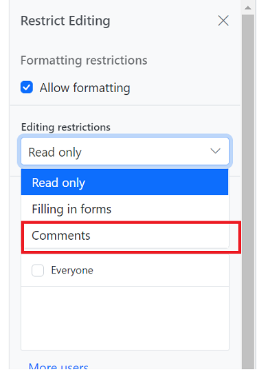

# Comments in Angular Document editor component

Document Editor allows you to add comments to documents. You can add, navigate and remove comments in code and from the UI.

## Add a new comment

Comments can be inserted to the selected text.

```typescript
this.documentEditor.editor.insertComment('Test comment');
```

## Add a New Comment with Date, Author, and Status

Comments can be inserted into the selected text with a specified date, author, and status [`insertComment`](https://ej2.syncfusion.com/angular/documentation/api/document-editor/editor/#insertcomment).

```typescript
// In this example, a comment with the text "Hello world"
// is added by the author Nancy Davolio on July 23, 2024, at 2:30 PM. 
// The isResolved status is set to false.

// Create a specific date: July 23, 2024, at 2:30:00 PM.
// Note: July is represented by 6 (0-based index).
let specificDate = new Date(2024, 6, 23, 14, 30, 0); 

// Define the properties of the comment including author, date, and resolution status.
let commentProperties: CommentProperties = { 
    author: 'Nancy Davolio',          // The author of the comment.
    dateTime: specificDate,           // The date and time when the comment is created.
    isResolved: false                 // The status of the comment; false indicates it is unresolved.
};

// Insert the comment with the specified properties into the document editor.
this.documentEditor.editor.insertComment('Hello world', commentProperties);
```

## Add a Reply Comment with Date, Author, and Status

Reply comments can be inserted into the parent comment with a specified date, author using [`insertReplyComment`](https://ej2.syncfusion.com/angular/documentation/api/document-editor/editor/#insertreplycomment).

```typescript
// In this example, a comment with the text "Hello world"
// is added by the author Nancy Davolio on July 23, 2024, at 2:30 PM. 
// The isResolved status is set to false.

// Create a specific date: July 23, 2024, at 2:30:00 PM.
// Note: July is represented by 6 (0-based index).
let specificDate = new Date(2024, 6, 23, 14, 30, 0);

// Define the properties of the comment including author, date, and resolution status.
let commentProperties: CommentProperties = { 
    author: 'Nancy Davolio',          // The author of the comment.
    dateTime: specificDate,           // The date and time when the comment is created.
    isResolved: false                 // The status of the comment; false indicates it is unresolved.
};

// Insert the comment with the specified properties into the Document Editor.
let comment: Comment = this.documentEditor.editor.insertComment('Hello world', commentProperties);
// Insert a reply comment with specified properties into the Document Editor
this.documentEditor.editor.insertReplyComment(comment.id, 'Hello world', commentProperties);
```

## Get Comments

Document Editor allows to get the comments along with its reply and comment properties using [`getComments`](https://ej2.syncfusion.com/angular/documentation/api/document-editor/#getcomments).

```typescript
//Get Comments in the document along with the properties author, date, status.
let commentinfo: CommentInfo[] = this.container.documentEditor.getComments();
```

## Comment navigation

Next and previous comments can be navigated using the below code snippet.

```typescript
//Navigate to next comment
this.documentEditor.selection.navigateNextComment();

//Navigate to previous comment
this.documentEditor.selection.navigatePreviousComment();
```

## Delete comment

Current comment can be deleted using [`deleteComment`](https://ej2.syncfusion.com/angular/documentation/api/document-editor/editor/#deletecomment).

```typescript
//Delete the current selected comment.
this.container.documentEditor.editor.deleteComment();

//Get Comments in the document along with the properties author, date, status.
let commentinfo: CommentInfo[] = this.container.documentEditor.getComments();

//Delete the particular parent comments and all of its reply comments
this.container.documentEditor.editor.deleteComment(commentinfo[0].id);

//Delete the particular reply comment.
this.container.documentEditor.editor.deleteComment(commentinfo[0].replies[0].id);
```

## Delete all comment

All the comments in the document can be deleted using the below code snippet.

```typescript
this.documentEditor.editor.deleteAllComments();
```

## Protect the document in comments only mode

Document Editor provides support for protecting the document with `CommentsOnly` protection. In this protection, user allowed to add or edit comments alone in the document.

Document editor provides an option to protect and unprotect document using [`enforceProtection`](https://ej2.syncfusion.com/angular/documentation/api/document-editor/editor/#enforceprotection) and [`stopProtection`](https://ej2.syncfusion.com/angular/documentation/api/document-editor/editor/#stopprotection) API.

The following example code illustrates how to enforce and stop protection in Document editor container.

```typescript
import { Component, OnInit, ViewChild } from '@angular/core';
import {
  ToolbarService,
  DocumentEditorContainerComponent,
} from '@syncfusion/ej2-angular-documenteditor';
import {
  DocumentEditorContainerModule,
} from '@syncfusion/ej2-angular-documenteditor';

@Component({
  selector: 'app-container',
  standalone: true,
  imports: [DocumentEditorContainerModule],
  providers: [ToolbarService],
  template: `<div><button ejs-button (click)="protectDocument()" >Protect</button>
  <button ejs-button (click)="unProtectDocument()" >Unprotect</button>
    <ejs-documenteditorcontainer #documenteditor_default 
      serviceUrl="https://document.syncfusion.com/web-services/docx-editor/api/documenteditor/" 
      height="600px" 
      style="display:block" 
      [enableToolbar]="true">
    </ejs-documenteditorcontainer>
</div>
  `,
})
export class AppComponent implements OnInit {
  @ViewChild('documenteditor_default')
  public container?: DocumentEditorContainerComponent;

  ngOnInit(): void {}
  public protectDocument(): void {
    //enforce protection
    this.container?.documentEditor.editor.enforceProtection(
      '123',
      'CommentsOnly'
    );
  }

  public unProtectDocument(): void {
    //stop the document protection
    this.container?.documentEditor.editor.stopProtection('123');
  }
}
```

> The Web API hosted link `https://document.syncfusion.com/web-services/docx-editor/api/documenteditor/` utilized in the Document Editor's serviceUrl property is intended solely for demonstration and evaluation purposes. For production deployment, please host your own web service with your required server configurations. You can refer and reuse the [GitHub Web Service example](https://github.com/SyncfusionExamples/EJ2-DocumentEditor-WebServices) or [Docker image](https://hub.docker.com/r/syncfusion/word-processor-server) for hosting your own web service and use for the serviceUrl property.

Comment only protection can be enabled in UI by using [Restrict Editing pane](./document-management#restrict-editing-pane)



>Note: In enforce Protection method, first parameter denotes password and second parameter denotes protection type. Possible values of protection type are `NoProtection |ReadOnly |FormFieldsOnly |CommentsOnly`. In stop protection method, parameter denotes the password.

## Mention support in Comments

Mention support displays a list of items that users can select or tag from the suggested list. To use this feature, type the @ character in the comment box and select or tag the user from the suggestion list.

The following example illustrates how to enable mention support in the Document Editor

```typescript
import { Component, OnInit } from '@angular/core';
import { ToolbarService , DocumentEditorSettingsModel } from '@syncfusion/ej2-angular-documenteditor';
@Component({
      selector: 'app-root',
      // specifies the template string for the DocumentEditorContainer component
      template: `<ejs-documenteditorcontainer serviceUrl="https://document.syncfusion.com/web-services/docx-editor/api/documenteditor/" height="600px" style="display:block" [documentEditorSettings]= "settings" [enableToolbar]=true> </ejs-documenteditorcontainer>`,
      providers: [ToolbarService]
})
export class AppComponent implements OnInit {
    public mentionData: any = [
        { "Name": "Mary Kate", "EmailId": "marry@company.com" },
        { "Name": "Andrew James", "EmailId": "james@company.com" },
        { "Name": "Andrew Fuller", "EmailId": "andrew@company.com"}
    ];
    public settings: DocumentEditorSettingsModel = { mentionSettings : { dataSource: this.mentionData, fields: { text: 'Name' }}  };
    ngOnInit(): void {
    }
}
```

> The Web API hosted link `https://document.syncfusion.com/web-services/docx-editor/api/documenteditor/` utilized in the Document Editor's serviceUrl property is intended solely for demonstration and evaluation purposes. For production deployment, please host your own web service with your required server configurations. You can refer and reuse the [GitHub Web Service example](https://github.com/SyncfusionExamples/EJ2-DocumentEditor-WebServices) or [Docker image](https://hub.docker.com/r/syncfusion/word-processor-server) for hosting your own web service and use for the serviceUrl property.

## Events

DocumentEditor provides [beforeCommentAction](https://ej2.syncfusion.com/angular/documentation/api/document-editor/#beforecommentaction) event, which is triggered on comment actions like Post, edit, reply, resolve and reopen. This event provides an opportunity to perform custom logic on comment actions like Post, edit, reply, resolve and reopen. The event handler receives the [CommentActionEventArgs](https://ej2.syncfusion.com/angular/documentation/api/document-editor/commentActionEventArgs/) object as an argument, which allows access to information about the comment.

To demonstrate a specific use case, let’s consider an example where we want to restrict the delete functionality based on the author’s name. The following code snippet illustrates how to allow only the author of a comment to delete:

```typescript
import { Component, OnInit, ViewChild} from '@angular/core';
import { ToolbarService , DocumentEditorSettingsModel, DocumentEditorContainerModule, CommentActionEventArgs, DocumentEditorContainerComponent, beforeCommentActionEvent } from '@syncfusion/ej2-angular-documenteditor';
@Component({
  imports: [
    DocumentEditorContainerModule
  ],
  standalone: true,
  selector: 'app-root',
  // specifies the template string for the DocumentEditorContainer component
  template: `<ejs-documenteditorcontainer serviceUrl="https://document.syncfusion.com/web-services/docx-editor/api/documenteditor/" height="600px" style="display:block" #documenteditor_default [documentEditorSettings]= "settings" (beforeCommentAction)="beforeComment($event)" [enableToolbar]=true> </ejs-documenteditorcontainer>`,
  providers: [ToolbarService]
})
export class AppComponent implements OnInit {
  @ViewChild('documenteditor_default', { static: true }) 
  public container!: DocumentEditorContainerComponent;
  public mentionData: any = [
    { "Name": "Mary Kate", "EmailId": "marry@company.com" },
    { "Name": "Andrew James", "EmailId": "james@company.com" },
    { "Name": "Andrew Fuller", "EmailId": "andrew@company.com" }
  ];
  public settings: DocumentEditorSettingsModel = { mentionSettings: { dataSource: this.mentionData, fields: { text: 'Name' } } };
  ngOnInit(): void {
    this.container.currentUser="Guest User";
  }
  // Event get triggerd on comment actions like Post, edit, reply, resolve and reopen
  public beforeComment(args: CommentActionEventArgs) {
    // Check the type and author of the comment and current user are different
    if (args.type === "Delete" && this.container.currentUser !== args.author) {
      // Cancel the comment action
      args.cancel = true;
    }
  }
}
```

> The Web API hosted link `https://document.syncfusion.com/web-services/docx-editor/api/documenteditor/` utilized in the Document Editor's serviceUrl property is intended solely for demonstration and evaluation purposes. For production deployment, please host your own web service with your required server configurations. You can refer and reuse the [GitHub Web Service example](https://github.com/SyncfusionExamples/EJ2-DocumentEditor-WebServices) or [Docker image](https://hub.docker.com/r/syncfusion/word-processor-server) for hosting your own web service and use for the serviceUrl property.
