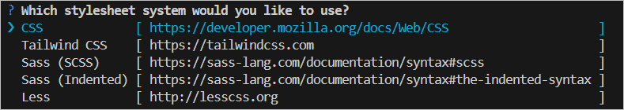

# Getting started with Angular Document editor component

This section explains the steps to create a Word document editor within your application and demonstrates the basic usage of the Document editor component.

To get started quickly with Document editor component using CLI, you can check the video below.



## Prerequisites

[System requirements for Syncfusion<sup style="font-size:70%">&reg;</sup> Angular Document editor](https://ej2.syncfusion.com/angular/documentation/system-requirement)

## Dependencies

The list of dependencies required to use the Document editor component in your application is given below:

```javascript
|-- @syncfusion/ej2-angular-documenteditor
    |-- @syncfusion/ej2-angular-base
    |-- @syncfusion/ej2-documenteditor
    |-- @syncfusion/ej2-base
    |-- @syncfusion/ej2-buttons
    |-- @syncfusion/ej2-compression
    |-- @syncfusion/ej2-data
    |-- @syncfusion/ej2-dropdowns
    |-- @syncfusion/ej2-file-utils
    |-- @syncfusion/ej2-inputs
    |-- @syncfusion/ej2-lists
    |-- @syncfusion/ej2-navigations
    |-- @syncfusion/ej2-popups
    |-- @syncfusion/ej2-splitbuttons
    |-- @syncfusion/ej2-charts
```

### Server-side dependencies

The Document editor component requires server-side interactions for the following operations:

* [Open file formats other than SFDT](./import#convert-word-documents-into-sfdt)
* [Paste with formatting](./clipboard#paste-with-formatting)
* [Restrict editing](./document-management)
* [Spell check](./spell-check)
* [Save as file formats other than SFDT and DOCX](./saving-documents/server-side-export)

>Note: If you don't require the above functionalities, you can deploy the component as a pure client-side solution without any server-side interactions.

For detailed information about server-side dependencies, refer to the [Web Services Overview](./web-services-overview) page.

## Setup Angular environment

You can use [Angular CLI](https://github.com/angular/angular-cli) to set up your Angular applications. To install Angular CLI, use the following command:

```bash
npm install -g @angular/cli@16.0.1
```

## Create an Angular application

Start a new Angular application using the Angular CLI command below:

```bash
ng new my-app
```

This command will prompt you for a few settings for the new project, such as whether to add Angular routing and which stylesheet format to use.



By default, it will create a CSS-based application.

Next, navigate to the created project folder:

```bash
cd my-app
```

## Adding Syncfusion<sup style="font-size:70%">&reg;</sup> Document editor package

All available Essential<sup style="font-size:70%">&reg;</sup> JS 2 packages are published in the [`npmjs.com`](https://www.npmjs.com/~syncfusionorg) registry.

To install the Document editor component, use the following command:

```bash
npm install @syncfusion/ej2-angular-documenteditor --save
```

>Note: The `--save` flag instructs npm to include the Document editor package inside the dependencies section of the `package.json` file.

## Adding CSS reference

The following CSS files are available in the `node_modules/@syncfusion` package folder. Reference these styles in the `src/styles.css` file using the following code:

```css
@import '../node_modules/@syncfusion/ej2-base/styles/material.css';
@import '../node_modules/@syncfusion/ej2-buttons/styles/material.css';
@import '../node_modules/@syncfusion/ej2-inputs/styles/material.css';
@import '../node_modules/@syncfusion/ej2-popups/styles/material.css';
@import '../node_modules/@syncfusion/ej2-lists/styles/material.css';
@import '../node_modules/@syncfusion/ej2-navigations/styles/material.css';
@import '../node_modules/@syncfusion/ej2-splitbuttons/styles/material.css';
@import '../node_modules/@syncfusion/ej2-dropdowns/styles/material.css';
@import '../node_modules/@syncfusion/ej2-angular-documenteditor/styles/material.css';
```

## Choosing a component

Syncfusion offers two Document editor components with different feature sets:

* **DocumentEditorContainer**: A complete solution with a predefined toolbar, properties pane, and status bar for comprehensive document editing
* **DocumentEditor**: A customizable component where you build the UI according to your specific requirements

>Note: Starting from version `v19.3.0.x`, the text size measurement accuracy has been optimized to match Microsoft Word pagination for most documents. This improvement is enabled by default. You can [disable it to retain the pagination behavior of older versions](./how-to/disable-optimized-text-measuring) if needed.

### DocumentEditorContainer component

The DocumentEditorContainer is a predefined component that wraps the DocumentEditor, toolbar, properties pane, and status bar into a single component. The toolbar and properties pane allow users to view and modify documents through public APIs available in the DocumentEditor.

#### Adding DocumentEditorContainer component

Modify the template in the `src/app/app.component.ts` file to render the DocumentEditorContainer component. Add the Angular DocumentEditorContainer using the `<ejs-documenteditorcontainer>` selector in the template section of the `app.component.ts` file:

```typescript
import { DocumentEditorContainerModule } from '@syncfusion/ej2-angular-documenteditor';
import { Component, OnInit } from '@angular/core';
import { ToolbarService } from '@syncfusion/ej2-angular-documenteditor';

@Component({
    imports: [        
        DocumentEditorContainerModule
    ],
    standalone: true,
    selector: 'app-root',
    template: `<ejs-documenteditorcontainer 
                   serviceUrl="https://document.syncfusion.com/web-services/docx-editor/api/documenteditor/" 
                   height="600px" 
                   style="display:block" 
                   [enableToolbar]=true>
               </ejs-documenteditorcontainer>`,
    providers: [ToolbarService]
})
export class AppComponent implements OnInit {
    ngOnInit(): void {
    }
}
```

>Important: The Web API hosted link `https://document.syncfusion.com/web-services/docx-editor/api/documenteditor/` used in the Document editor's serviceUrl property is intended solely for demonstration and evaluation purposes. For production deployment, host your own web service with the required server configurations. Refer to the [GitHub Web Service example](https://github.com/SyncfusionExamples/EJ2-DocumentEditor-WebServices) or use the [Docker image](https://hub.docker.com/r/syncfusion/word-processor-server) for hosting your own web service.

#### Run the DocumentEditorContainer application

The project is configured to compile and run the application in a browser. Use the following command to run the application:

```bash
ng serve --open
```

The DocumentEditorContainer output will be displayed as follows:










  



>Note: If you see a license banner when running your application, you need to obtain a license key and register it within the application to use Syncfusion components. For more information on how to obtain and register a license key, refer to the [Licensing overview](https://ej2.syncfusion.com/angular/documentation/licensing/overview) page.

### DocumentEditor component

The DocumentEditor component is used to create, view, and edit Word documents. With this component, you can customize the UI options based on your requirements to modify documents.

#### Adding DocumentEditor component

Modify the template in the `src/app/app.component.ts` file to render the DocumentEditor component. Add the Angular DocumentEditor using the `<ejs-documenteditor>` selector in the template section of the `app.component.ts` file:

```typescript
import { DocumentEditorModule } from '@syncfusion/ej2-angular-documenteditor';
import { Component, OnInit } from '@angular/core';
import { 
    PrintService, 
    SfdtExportService, 
    WordExportService, 
    TextExportService, 
    SelectionService, 
    SearchService, 
    EditorService, 
    ImageResizerService, 
    EditorHistoryService, 
    ContextMenuService, 
    OptionsPaneService, 
    HyperlinkDialogService, 
    TableDialogService, 
    BookmarkDialogService, 
    TableOfContentsDialogService, 
    PageSetupDialogService, 
    StyleDialogService, 
    ListDialogService, 
    ParagraphDialogService, 
    BulletsAndNumberingDialogService, 
    FontDialogService, 
    TablePropertiesDialogService, 
    BordersAndShadingDialogService, 
    TableOptionsDialogService, 
    CellOptionsDialogService, 
    StylesDialogService 
} from '@syncfusion/ej2-angular-documenteditor';

@Component({
    imports: [        
        DocumentEditorModule
    ],
    standalone: true,
    selector: 'app-root',
    template: `<ejs-documenteditor 
                   id="container" 
                   height="330px" 
                   serviceUrl="https://document.syncfusion.com/web-services/docx-editor/api/documenteditor/" 
                   [isReadOnly]=false 
                   [enablePrint]=true 
                   [enableSelection]=true 
                   [enableEditor]=true 
                   [enableEditorHistory]=true 
                   [enableContextMenu]=true 
                   [enableSearch]=true 
                   [enableOptionsPane]=true>
               </ejs-documenteditor>`,
    providers: [
        PrintService, 
        SfdtExportService, 
        WordExportService, 
        TextExportService, 
        SelectionService, 
        SearchService, 
        EditorService, 
        ImageResizerService, 
        EditorHistoryService, 
        ContextMenuService, 
        OptionsPaneService, 
        HyperlinkDialogService, 
        TableDialogService, 
        BookmarkDialogService, 
        TableOfContentsDialogService, 
        PageSetupDialogService, 
        StyleDialogService, 
        ListDialogService, 
        ParagraphDialogService, 
        BulletsAndNumberingDialogService, 
        FontDialogService, 
        TablePropertiesDialogService, 
        BordersAndShadingDialogService, 
        TableOptionsDialogService, 
        CellOptionsDialogService, 
        StylesDialogService
    ]
})
export class AppComponent implements OnInit {
    ngOnInit(): void {
    }
}
```

>Important: The Web API hosted link `https://document.syncfusion.com/web-services/docx-editor/api/documenteditor/` used in the Document editor's serviceUrl property is intended solely for demonstration and evaluation purposes. For production deployment, host your own web service with the required server configurations. Refer to the [GitHub Web Service example](https://github.com/SyncfusionExamples/EJ2-DocumentEditor-WebServices) or use the [Docker image](https://hub.docker.com/r/syncfusion/word-processor-server) for hosting your own web service.

#### Run the DocumentEditor application

Use the following command to compile and run the application in a browser:

```bash
ng serve --open
```

The DocumentEditor output will be displayed as follows:










  


## Next steps

After successfully setting up the Document editor component, explore these resources to enhance your implementation:

* [How to localize the Document editor container](./global-local)
* [How to load a document by default](./how-to/open-default-document)
* [How to customize the toolbar](./how-to/customize-tool-bar)
* [How to resize the Document editor component](./how-to/resize-document-editor)
* [How to add a save button to the DocumentEditorContainer toolbar](./how-to/add-save-button-in-toolbar)

## Troubleshooting

If you encounter issues during setup, consider the following:

* Ensure all dependencies are correctly installed by running `npm install`
* Verify that your Node.js and Angular CLI versions meet the minimum requirements
* Check that the CSS imports are correctly referenced in the `src/styles.css` file
* Clear the npm cache if dependency conflicts occur: `npm cache clean --force`
* For server-side functionality issues, verify your web service is properly configured and accessible
* If using Angular standalone components, ensure you're using Angular 14 or later