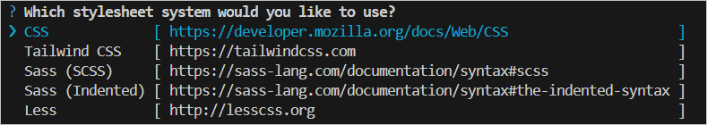

# Getting Started with Angular DOCX Editor

Syncfusion® DOCX Editor (Document Editor) enables you to create, edit, view, and print Word documents in web applications. This section guides you through the steps to get started and create a DOCX Editor in an Angular application. 

To get started quickly with Document editor component using CLI, you can check the video below.



## Prerequisites

[System requirements for Syncfusion<sup style="font-size:70%">&reg;</sup> Angular Document editor](https://ej2.syncfusion.com/angular/documentation/system-requirement)

## Server-side dependencies

The Document editor component requires server-side interactions for the following operations:

* Open file formats other than SFDT
* Paste with formatting
* Restrict editing
* Spell check
* Save as file formats other than SFDT and DOCX

>Note: If you don't require the above functionalities, you can deploy the component as a pure client-side solution without any server-side interactions.

For detailed information about server-side dependencies, refer to the [Web Services Overview](./web-services-overview) page.

## Setup Angular environment

You can use [Angular CLI](https://github.com/angular/angular-cli) to set up your Angular applications. To install Angular CLI, use the following command:

```bash
npm install -g @angular/cli@16.0.1
```

## Create an Angular application

Start a new Angular application using the Angular CLI command below:

```bash
ng new my-app
```

This command will prompt you for a few settings for the new project, such as whether to add Angular routing and which stylesheet format to use.



By default, it will create a CSS-based application.

Next, navigate to the created project folder:

```bash
cd my-app
```

## Install the Syncfusion<sup style="font-size:70%">&reg;</sup> Document Editor packages

The Syncfusion<sup style="font-size:70%">&reg;</sup> DOCX Editor package is available in the public npm registry and can be installed directly from [`npmjs.com`](https://www.npmjs.com/~syncfusionorg).

To install the Document editor component, use the following command:

```bash
npm install @syncfusion/ej2-angular-documenteditor --save
```

## Adding CSS reference

The following CSS files are available in the `node_modules/@syncfusion` package folder. Reference these styles in the `src/styles.css` file using the following code:

```css
@import '../node_modules/@syncfusion/ej2-base/styles/material.css';
@import '../node_modules/@syncfusion/ej2-buttons/styles/material.css';
@import '../node_modules/@syncfusion/ej2-inputs/styles/material.css';
@import '../node_modules/@syncfusion/ej2-popups/styles/material.css';
@import '../node_modules/@syncfusion/ej2-lists/styles/material.css';
@import '../node_modules/@syncfusion/ej2-navigations/styles/material.css';
@import '../node_modules/@syncfusion/ej2-splitbuttons/styles/material.css';
@import '../node_modules/@syncfusion/ej2-dropdowns/styles/material.css';
@import '../node_modules/@syncfusion/ej2-angular-documenteditor/styles/material.css';
```

## Add the Syncfusion<sup style="font-size:70%">&reg;</sup> Document Editor component

Modify the template in the `src/app/app.component.ts` file to render the DocumentEditorContainer component. Add the Angular DocumentEditorContainer using the `<ejs-documenteditorcontainer>` selector in the template section of the `app.component.ts` file:

```typescript
import { DocumentEditorContainerModule } from '@syncfusion/ej2-angular-documenteditor';
import { Component, OnInit } from '@angular/core';
import { ToolbarService } from '@syncfusion/ej2-angular-documenteditor';

@Component({
    imports: [        
        DocumentEditorContainerModule
    ],
    standalone: true,
    selector: 'app-root',
    template: `<ejs-documenteditorcontainer 
                   serviceUrl="https://document.syncfusion.com/web-services/docx-editor/api/documenteditor/" 
                   height="600px" 
                   style="display:block" 
                   [enableToolbar]=true>
               </ejs-documenteditorcontainer>`,
    providers: [ToolbarService]
})
export class AppComponent implements OnInit {
    ngOnInit(): void {
    }
}
```

> The hosted Web API URL is for demo and evaluation purposes only. For production, host your own web service using the [GitHub Web Service example](https://github.com/SyncfusionExamples/EJ2-DocumentEditor-WebServices) or the [Docker image](https://hub.docker.com/r/syncfusion/word-processor-server).

## Run the application

Run the application using the following command:

```bash
ng serve --open
```
Open http://localhost:4200 in your browser to see the DocumentEditorContainer output displayed as shown below.

The DocumentEditorContainer output will be displayed as follows:










  



>Note: If you see a license banner when running your application, you need to obtain a license key and register it within the application to use Syncfusion components. For more information on how to obtain and register a license key, refer to the [Licensing overview](https://ej2.syncfusion.com/angular/documentation/licensing/overview) page.