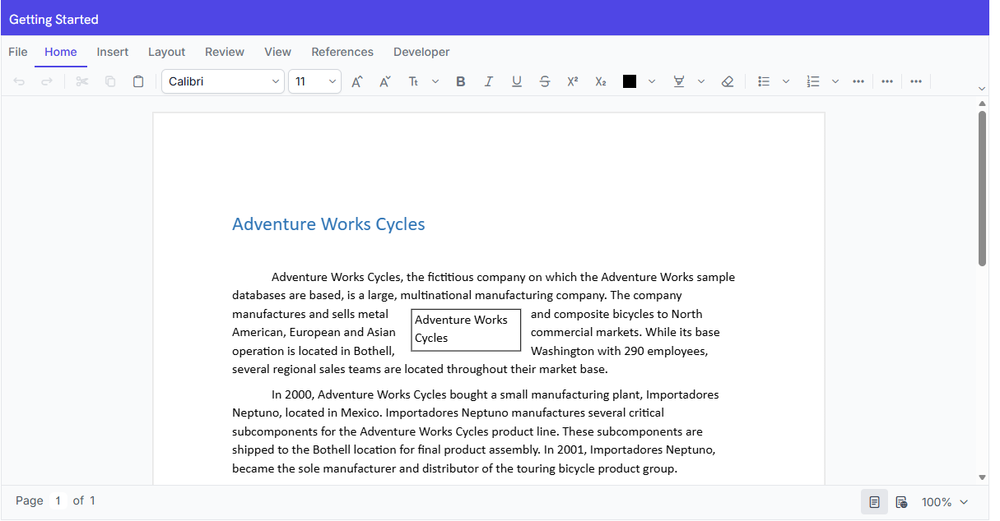
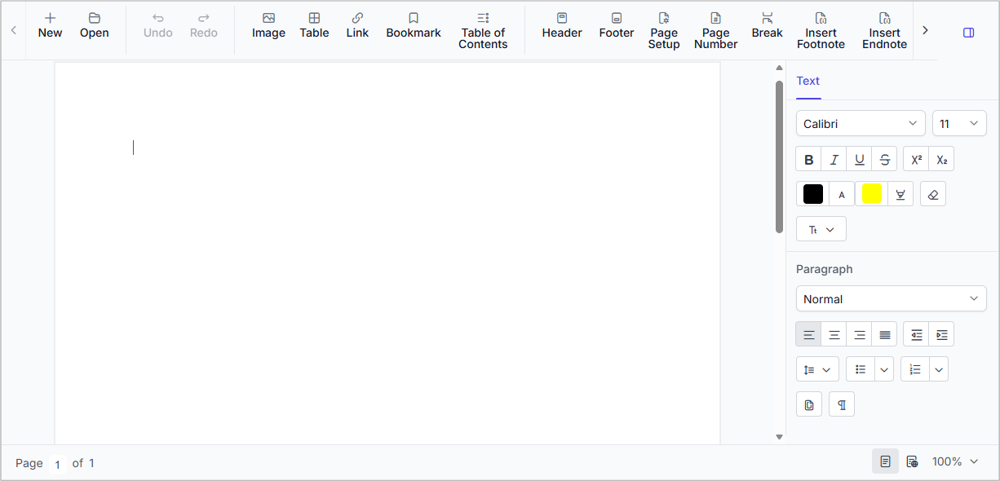

# Getting Started with Angular DOCX Editor

[Angular DOCX Editor](https://www.syncfusion.com/docx-editor-sdk/angular-docx-editor) (Document Editor) enables you to create, edit, view, and print Word documents in web applications. This section guides you through the steps to get started and create a Document Editor in an Angular application. 





## Create a new Angular application using Syncfusion CLI

You can create an Angular application using the Syncfusion CLI. The CLI provides two ways to create a project:

### Non-interactive mode

Non-interactive mode allows you to create a project directly using a single command with the required command-line arguments.




sf new syncfusion-angular-app --framework angular --template docx-editor --theme tailwind3




In this mode, the project configuration is passed directly in the command. The above command creates an Angular application configured with the Syncfusion® DOCX Editor component.

### Interactive mode




sf




When you run the `sf` command, the CLI prompts you to select the required project configuration. To create an Angular application with the Syncfusion® `DOCX Editor` component, select the following options:




√ Project name? ... syncfusion-angular-app
√ Choose Framework: » Angular
√ Choose Template: » DOCX Editor
√ Choose Theme: » Tailwind3
√ Choose Style Format: » CSS
√ Would you like to integrate the Syncfusion MCP Server (AI Assistant) into this project? ... no
√ Would you like to install Syncfusion Component Skills for AI-powered development? ... no
√ Install dependencies and start app now? ... no




The above selections generate an Angular application configured with the Syncfusion® `DOCX Editor` component. You can choose different values for language, theme, style format, MCP setup, and skills installation based on your project requirements.

The Syncfusion® CLI creates the project with a predefined template. After the project is generated, you can customize or replace the component code based on your application requirements.

## Run the project
Once the project is created, navigate to the project directory and run the following commands in your terminal.




cd syncfusion-angular-app
npm install
ng serve




The output will appear as follows:







## Prerequisites

* [System requirements for Angular components](https://ej2.syncfusion.com/angular/documentation/system-requirement)
* [Browser Compatibility](https://ej2.syncfusion.com/angular/documentation/browser)

## Setup Angular environment

You can use [Angular CLI](https://github.com/angular/angular-cli) to set up your Angular application. To install Angular CLI, use the following command:

```bash
npm install -g @angular/cli
```

## Create an Angular application

**Step 1:** Start a new Angular application using the Angular CLI command below:

```bash
ng new documenteditor-app
```

**Step 2:** This command will prompt you to configure settings like enabling Angular routing and choosing a stylesheet format.

```text
? Which stylesheet system would you like to use?
❯ CSS             [ https://developer.mozilla.org/docs/Web/CSS                     ]
  Tailwind CSS    [ https://tailwindcss.com                                        ]
  Sass (SCSS)     [ https://sass-lang.com/documentation/syntax#scss                ]
  Sass (Indented) [ https://sass-lang.com/documentation/syntax#the-indented-syntax ]
  Less            [ http://lesscss.org                                             ]
```

In this guide, CSS is selected as the stylesheet format.

**Step 3:** During project setup, when prompted for the server-side rendering (SSR) option, choose the appropriate configuration.

```text
? Do you want to enable Server-Side Rendering (SSR) and Static Site Generation (SSG/Prerendering)? (y/N) N
```

**Step 4:** Select the required AI tool or 'none' if you do not need any AI tool.

```text
? Which AI tools do you want to configure with Angular best practices? https://angular.dev/ai/develop-with-ai
❯ None
  Agents.md      [ https://agents.md/                                               ]
  Claude         [ https://docs.anthropic.com/en/docs/claude-code/memory            ]
  Cursor         [ https://docs.cursor.com/en/context/rules                         ]
  Gemini         [ https://ai.google.dev/gemini-api/docs                            ]
  GitHub Copilot [ https://code.visualstudio.com/docs/copilot/copilot-customization ]
  JetBrains AI   [ https://www.jetbrains.com/help/junie/customize-guidelines.html   ]
```

**Step 5:** Navigate to the created project folder.

```bash
cd documenteditor-app
```

## Install the Document Editor packages

The Document Editor package is available in the public npm registry and can be installed directly from [`npmjs.com`](https://www.npmjs.com/package/@syncfusion/ej2-angular-documenteditor).

To install the Document Editor component, use the following command:

```bash
npm install @syncfusion/ej2-angular-documenteditor --save
```

## Register a Syncfusion License Key

Before initializing the Angular DOCX Editor control, generate a Syncfusion license key and register it in your application.

- [Generate a Syncfusion License Key](https://help.syncfusion.com/document-processing/licensing/how-to-generate)
- [Register a Syncfusion License Key in Angular](https://help.syncfusion.com/document-processing/licensing/how-to-register-in-an-application#angular)

## Import the required CSS styles

The following CSS files are available in the `node_modules/@syncfusion` package folder. Reference these styles in the `src/styles.css` file using the following code:




@import '../node_modules/@syncfusion/ej2-base/styles/tailwind3.css';
@import '../node_modules/@syncfusion/ej2-buttons/styles/tailwind3.css';
@import '../node_modules/@syncfusion/ej2-inputs/styles/tailwind3.css';
@import '../node_modules/@syncfusion/ej2-popups/styles/tailwind3.css';
@import '../node_modules/@syncfusion/ej2-lists/styles/tailwind3.css';
@import '../node_modules/@syncfusion/ej2-navigations/styles/tailwind3.css';
@import '../node_modules/@syncfusion/ej2-splitbuttons/styles/tailwind3.css';
@import '../node_modules/@syncfusion/ej2-dropdowns/styles/tailwind3.css';
@import '../node_modules/@syncfusion/ej2-angular-documenteditor/styles/tailwind3.css';




N> This example uses the `Tailwind 3` theme. To use a different built-in theme, replace the `tailwind3.css` references with the corresponding theme stylesheets. Refer to the [Themes documentation](https://ej2.syncfusion.com/angular/documentation/appearance/overview) for information about the available themes and the different ways to include theme styles in an Angular application.

## Initialize the Document Editor

Modify `src/app/app.ts` to render the Document Editor component by adding the Angular DOCX Editor selector in its template section.




import { Component } from '@angular/core';
import {
  DocumentEditorContainerModule,
  ToolbarService
} from '@syncfusion/ej2-angular-documenteditor';

@Component({
  selector: 'app-root',
  standalone: true,
  imports: [DocumentEditorContainerModule],
  providers: [ToolbarService],
  template: `
    <!-- Use the following service URL only for demo purposes -->
    <ejs-documenteditorcontainer
      serviceUrl="https://document.syncfusion.com/web-services/docx-editor/api/documenteditor/"
      height="600px"
      style="display: block"
      [enableToolbar]="true">
    </ejs-documenteditorcontainer>
  `
})
export class App {}




N> The hosted Web API URL is for demo and evaluation purposes only. For production, host your own web service using the [GitHub Web Service example](https://github.com/SyncfusionExamples/EJ2-DocumentEditor-WebServices) or the [Docker image](https://hub.docker.com/r/syncfusion/word-processor-server).

## Run the application

Run the application using the following command:

```bash
ng serve --open
```

After the application starts, open the localhost URL shown in the terminal. The DOCX Editor is rendered in the browser with a toolbar and an editable document area, as shown below.



You can also explore the Document Editor interactively using the live sample below.



N> [View Sample in GitHub](https://github.com/SyncfusionExamples/Angular-DOCX-Editor-Examples/tree/master/getting-started).





## Server-side dependencies

The Document Editor component requires server-side interactions for the following operations:

* Open file formats other than SFDT
* Paste with formatting
* Restrict editing
* Spell check
* Save as file formats other than SFDT and DOCX

N> If you don't require the above functionalities, you can deploy the component as a pure client-side solution without any server-side interactions.

For detailed information about server-side dependencies, refer to the [Web Services Overview](./web-services-overview) page.

N> Looking for the full Angular DOCX Editor component overview, features, pricing, and documentation? Visit the [Angular DOCX Editor](https://www.syncfusion.com/docx-editor-sdk/angular-docx-editor) page.

## Online Demo

Explore how to create, edit, and print Word documents in the Angular DOCX Editor in this live demo [here](https://document.syncfusion.com/demos/docx-editor/angular/#/tailwind3/document-editor/default).

## Getting Started Video

Follow this quick walkthrough to install, configure, and start using the Angular DOCX Editor in your application.


## See also

- [Open a document](./import)
- [Save a document](./export)
- [Collaborative Editing](./collaborative-editing/overview)
- [Troubleshooting](https://help.syncfusion.com/document-processing/word/word-processor/angular/troubleshooting)
