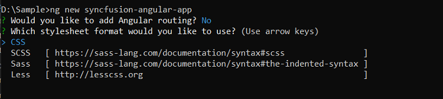

# Getting started with Angular Document editor component

This section explains the steps to create a Word document editor within your application and demonstrates the basic usage of the Document Editor component.

To get started quickly with DocumentEditor component using CLI, you can check the video below.



## Prerequisites

[System requirements for Syncfusion<sup style="font-size:70%">&reg;</sup> Angular Document Editor](https://ej2.syncfusion.com/angular/documentation/system-requirement)

## Dependencies

The list of dependencies required to use the Document Editor component in your application is given below:

```javascript
|-- @syncfusion/ej2-angular-documenteditor
    |-- @syncfusion/ej2-angular-base
    |-- @syncfusion/ej2-documenteditor
    |-- @syncfusion/ej2-base
    |-- @syncfusion/ej2-buttons
    |-- @syncfusion/ej2-compression
    |-- @syncfusion/ej2-data
    |-- @syncfusion/ej2-dropdowns
    |-- @syncfusion/ej2-file-utils
    |-- @syncfusion/ej2-inputs
    |-- @syncfusion/ej2-lists
    |-- @syncfusion/ej2-navigations
    |-- @syncfusion/ej2-popups
    |-- @syncfusion/ej2-splitbuttons
    |-- @syncfusion/ej2-charts
```

### Server side dependencies

The Document Editor component requires server-side interactions for the following operations:

* [Open file formats other than SFDT](./import#convert-word-documents-into-sfdt)
* [Paste with formatting](./clipboard#paste-with-formatting)
* [Restrict editing](./document-management)
* [SpellCheck](./spell-check)
* [Save as file formats other than SFDT and DOCX](./saving-documents/server-side-export)

>Note: If you don't require the above functionalities then you can deploy as pure client-side component without any server-side interactions.

To know about server-side dependencies, please refer this [page](./web-services-overview).

## Setup Angular Environment

You can use [Angular CLI](https://github.com/angular/angular-cli) to setup your Angular applications. To install Angular CLI use the following command.

```bash
npm install -g @angular/cli@16.0.1
```

## Create an Angular Application

Start a new Angular application using below Angular CLI command.

```bash
ng new my-app
```

This command will prompt you for a few settings for the new project, such as whether to add Angular routing and which stylesheet format to use.



By default, it will create a CSS-based application.

Next, navigate to the created project folder:

```
cd my-app
```

## Adding Syncfusion<sup style="font-size:70%">&reg;</sup> Document Editor package

All the available Essential<sup style="font-size:70%">&reg;</sup> JS 2 packages are published in [`npmJs.com`](https://www.npmjs.com/~syncfusionorg) registry.

To install Document Editor component, use the following command.

```bash
npm install @syncfusion/ej2-angular-documenteditor --save
```

> The **--save** will instruct NPM to include the grid package inside of the **dependencies** section of the **package.json**.

## Adding CSS reference

The following CSS files are available in **../node_modules/@syncfusion** package folder.
This can be referenced in [src/styles.css] using following code.

```css
@import '../node_modules/@syncfusion/ej2-base/styles/material.css';
@import '../node_modules/@syncfusion/ej2-buttons/styles/material.css';
@import '../node_modules/@syncfusion/ej2-inputs/styles/material.css';
@import '../node_modules/@syncfusion/ej2-popups/styles/material.css';
@import '../node_modules/@syncfusion/ej2-lists/styles/material.css';
@import '../node_modules/@syncfusion/ej2-navigations/styles/material.css';
@import '../node_modules/@syncfusion/ej2-splitbuttons/styles/material.css';
@import '../node_modules/@syncfusion/ej2-dropdowns/styles/material.css';
@import '../node_modules/@syncfusion/ej2-angular-documenteditor/styles/material.css';
```

## Adding Component

You can add `DocumentEditorContainer` Component with  predefined toolbar and properties pane options or `DocumentEditor` component with customize options.

>Note: Starting from `v19.3.0.x`, we have optimized the accuracy of text size measurements such as to match Microsoft Word pagination for most Word documents. This improvement is included as default behavior along with an optional API [to disable it and retain the document pagination behavior of older versions](./how-to/disable-optimized-text-measuring).

### DocumentEditorContainer Component

DocumentEditorContainer is a predefined component which wraps DocumentEditor, Toolbar, Properties pane, and Status bar into a single component. And the toolbar and properties pane is used to view and modify the document in DocumentEditor thought public APIs available in it.

#### Adding DocumentEditorContainer component

Modify the template in [src/app/app.component.ts] file to render the Document Editor Container component.
Add the Angular Document Editor Container by using `<ejs-documenteditor>` selector in **template** section of the app.component.ts file.

```typescript

import { DocumentEditorContainerModule } from '@syncfusion/ej2-angular-documenteditor'
import { Component, OnInit } from '@angular/core';
import { ToolbarService } from '@syncfusion/ej2-angular-documenteditor';
@Component({
imports: [        
      DocumentEditorContainerModule
    ],
    standalone: true,
    selector: 'app-root',
    // specifies the template string for the DocumentEditorContainer component
    template: `<ejs-documenteditorcontainer serviceUrl="https://document.syncfusion.com/web-services/docx-editor/api/documenteditor/" height="600px" style="display:block" [enableToolbar]=true> </ejs-documenteditorcontainer>`,
    providers: [ToolbarService]
})
export class AppComponent implements OnInit {

    ngOnInit(): void {
    }
}

```

> The Web API hosted link `https://document.syncfusion.com/web-services/docx-editor/api/documenteditor/` utilized in the Document Editor's serviceUrl property is intended solely for demonstration and evaluation purposes. For production deployment, please host your own web service with your required server configurations. You can refer and reuse the [GitHub Web Service example](https://github.com/SyncfusionExamples/EJ2-DocumentEditor-WebServices) or [Docker image](https://hub.docker.com/r/syncfusion/word-processor-server) for hosting your own web service and use for the serviceUrl property.

#### Run the DocumentEditorContainer application

The quick-start project is configured to compile and run the application in a browser. Use the following command to run the application.

```javascript
ng serve --open
```

DocumentEditorContainer output will be displayed as follows.










  


> The Web API hosted link `https://document.syncfusion.com/web-services/docx-editor/api/documenteditor/` utilized in the Document Editor's serviceUrl property is intended solely for demonstration and evaluation purposes. For production deployment, please host your own web service with your required server configurations. You can refer and reuse the [GitHub Web Service example](https://github.com/SyncfusionExamples/EJ2-DocumentEditor-WebServices) or [Docker image](https://hub.docker.com/r/syncfusion/word-processor-server) for hosting your own web service and use for the serviceUrl property.

>Note: If you see a license banner when running your application, it means that you need to obtain a license key and register it within the application in order to use Syncfusion components. You can find more information on how to obtain and register a license key on our [Licensing overview](https://ej2.syncfusion.com/angular/documentation/licensing/overview) page.

### DocumentEditor Component

DocumentEditor Component is used to create , view and edit word documents. In this , you can customize the UI options based on your requirements to modify the document.

#### Adding DocumentEditor component

Modify the template in [src/app/app.component.ts] file to render the Document Editor component.
Add the Angular Document Editor by using `<ejs-documenteditor>` selector in `template` section of the app.component.ts file.

```typescript

import { DocumentEditorContainerModule } from '@syncfusion/ej2-angular-documenteditor'
import { Component, OnInit } from '@angular/core';
@Component({
imports: [        
      DocumentEditorContainerModule
    ],
    standalone: true,
    selector: 'app-root',
    // specifies the template string for the DocumentEditorContainer component
    template: `<ejs-documenteditorcontainer serviceUrl="https://document.syncfusion.com/web-services/docx-editor/api/documenteditor/"> </ejs-documenteditorcontainer>`
})
export class AppComponent implements OnInit {

    ngOnInit(): void {
    }
}

```

> The Web API hosted link `https://document.syncfusion.com/web-services/docx-editor/api/documenteditor/` utilized in the Document Editor's serviceUrl property is intended solely for demonstration and evaluation purposes. For production deployment, please host your own web service with your required server configurations. You can refer and reuse the [GitHub Web Service example](https://github.com/SyncfusionExamples/EJ2-DocumentEditor-WebServices) or [Docker image](https://hub.docker.com/r/syncfusion/word-processor-server) for hosting your own web service and use for the serviceUrl property.

#### Run the  DocumentEditor application

The quick start project is configured to compile and run the application in a browser. Use the following command to run the application.

```javascript
ng serve --open
```

Output will be displayed as follows.










  


> The Web API hosted link `https://document.syncfusion.com/web-services/docx-editor/api/documenteditor/` utilized in the Document Editor's serviceUrl property is intended solely for demonstration and evaluation purposes. For production deployment, please host your own web service with your required server configurations. You can refer and reuse the [GitHub Web Service example](https://github.com/SyncfusionExamples/EJ2-DocumentEditor-WebServices) or [Docker image](https://hub.docker.com/r/syncfusion/word-processor-server) for hosting your own web service and use for the serviceUrl property.


## Frequently Asked Questions

* [How to localize the Document Editor container](./global-local).
* [How to load the document by default](./how-to/open-default-document).
* [How to customize tool bar](./how-to/customize-tool-bar).
* [How to resize Document editor component?](./how-to/resize-document-editor)
* [How to add a save button to the DocumentEditorContainer component toolbar](./how-to/add-save-button-in-toolbar).
