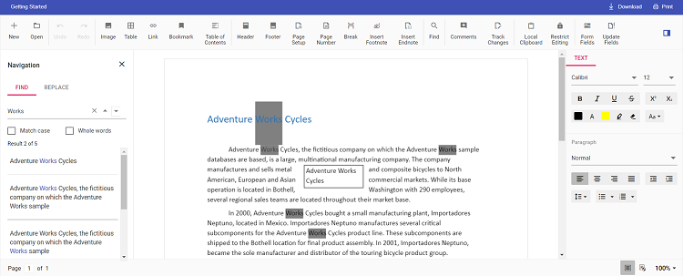

# Change Search Highlight Color in Angular Document Editor

Document editor provides an options to change the default search highlight color using [`searchHighlightColor`](https://ej2.syncfusion.com/angular/documentation/api/document-editor/documentEditorSettingsModel/#searchhighlightcolor) in Document editor settings. The highlight color which is given in [`documentEditorSettings`](https://ej2.syncfusion.com/angular/documentation/api/document-editor-container/#documenteditorsettings) will be highlighted on the searched text. By default, search highlight color is `yellow`.

Similarly, you can use [`documentEditorSettings`](https://ej2.syncfusion.com/angular/documentation/api/document-editor/#documenteditorsettings) property for DocumentEditor also.

The following example code illustrates how to change the default search highlight color.

```typescript
import { Component, OnInit, ViewChild } from '@angular/core';
import {
  ToolbarService,
  DocumentEditorContainerComponent,
} from '@syncfusion/ej2-angular-documenteditor';
import { DocumentEditorContainerModule } from '@syncfusion/ej2-angular-documenteditor';
@Component({
  selector: 'app-container',
  standalone: true,
  imports: [DocumentEditorContainerModule],
  providers: [ToolbarService],
  template: `<ejs-documenteditorcontainer #documenteditor_default 
      serviceUrl="https://document.syncfusion.com/web-services/docx-editor/api/documenteditor/" 
      height="600px" 
      style="display:block" 
      [documentEditorSettings]= "searchHighlightColor"
      [enableToolbar]=true >
    </ejs-documenteditorcontainer>
  `,
})
export class AppComponent implements OnInit {
  @ViewChild('documenteditor_default')
  public container?: DocumentEditorContainerComponent;
  // Add required color to change the default search highlight color
  public searchHighlightColor = { searchHighlightColor: 'Grey' };
  ngOnInit(): void {}
}
```

> The Web API hosted link `https://document.syncfusion.com/web-services/docx-editor/api/documenteditor/` utilized in the Document Editor's serviceUrl property is intended solely for demonstration and evaluation purposes. For production deployment, please host your own web service with your required server configurations. You can refer and reuse the [GitHub Web Service example](https://github.com/SyncfusionExamples/EJ2-DocumentEditor-WebServices) or [Docker image](https://hub.docker.com/r/syncfusion/word-processor-server) for hosting your own web service and use for the serviceUrl property.

Output will be like below:

