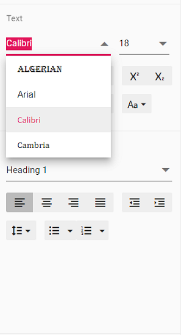

# Customize font family drop down in Angular Document editor

Document editor provides an options to customize the font family drop down list values using [`fontFamilies`](https://ej2.syncfusion.com/angular/documentation/api/document-editor/documentEditorSettingsModel/#fontfamilies) in Document editor settings. Fonts which are added in fontFamilies of [`documentEditorSettings`](https://ej2.syncfusion.com/angular/documentation/api/document-editor-container/#documenteditorsettings) will be displayed on font drop down list of text properties pane and font dialog.

Similarly, you can use [`documentEditorSettings`](https://ej2.syncfusion.com/angular/documentation/api/document-editor/#documenteditorsettings) property for DocumentEditor also.

The following example code illustrates how to change the font families in Document editor container.

```typescript
import { Component, OnInit } from '@angular/core';
import { ToolbarService } from '@syncfusion/ej2-angular-documenteditor';
@Component({
      selector: 'app-root',
      // specifies the template string for the DocumentEditorContainer component
      template: `<ejs-documenteditorcontainer serviceUrl="https://document.syncfusion.com/web-services/docx-editor/api/documenteditor/" height="600px" style="display:block" [documentEditorSettings]= "fontFamilies" [enableToolbar]=true> </ejs-documenteditorcontainer>`,
      providers: [ToolbarService]
})
export class AppComponent implements OnInit {
    // Add required font families to list it in font drop down
    public fontFamilies={fontFamilies :['Algerian', 'Arial', 'Calibri', 'Cambria']};
    ngOnInit(): void {
    }
}
```

> The Web API hosted link `https://document.syncfusion.com/web-services/docx-editor/api/documenteditor/` utilized in the Document Editor's serviceUrl property is intended solely for demonstration and evaluation purposes. For production deployment, please host your own web service with your required server configurations. You can refer and reuse the [GitHub Web Service example](https://github.com/SyncfusionExamples/EJ2-DocumentEditor-WebServices) or [Docker image](https://hub.docker.com/r/syncfusion/word-processor-server) for hosting your own web service and use for the serviceUrl property.

Output will be like below:

