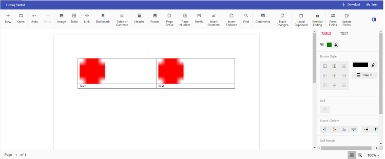

# Insert Text or Image in Table in Angular Document Editor

Using Document editor API's, you can insert [`text`](../how-to/insert-text-in-current-position#insert-text-in-current-cursor-position) or [`image`](../image#images) in [`table`](../table#create-a-table) programmatically based on your requirement.

Use [`selection`](../how-to/move-selection-to-specific-position#selects-content-based-on-start-and-end-hierarchical-index) API's to navigate between rows and cells.

The following example illustrates how to create 2*2 table and then add text and image programmatically.

```typescript
import { Component, OnInit, ViewChild } from '@angular/core';
import {
  ToolbarService,
  DocumentEditorContainerComponent,
} from '@syncfusion/ej2-angular-documenteditor';
import { DocumentEditorContainerModule } from '@syncfusion/ej2-angular-documenteditor';
@Component({
  selector: 'app-container',
  standalone: true,
  imports: [DocumentEditorContainerModule],
  providers: [ToolbarService],
  template: `<ejs-documenteditorcontainer #documenteditor_default 
      serviceUrl="https://document.syncfusion.com/web-services/docx-editor/api/documenteditor/" 
      height="600px" 
      style="display:block" 
      (created)="onCreated()"
      [enableToolbar]=true >
    </ejs-documenteditorcontainer>
  `,
})
export class AppComponent implements OnInit {
  @ViewChild('documenteditor_default')
  public container?: DocumentEditorContainerComponent;
  ngOnInit(): void {}
  onCreated() {
    // To insert the table in cursor position
    this.container?.documentEditor.editor.insertTable(2, 2);
    // To insert the image at table first cell
    this.container?.documentEditor.editor.insertImage(
      'data:image/png;base64,iVBORw0KGgoAAAANSUhEUgAAAAUAAAAFCAYAAACNbyblAAAAHElEQVQI12P4    //8/w38GIAXDIBKE0DHxgljNBAAO9TXL0Y4OHwAAAABJRU5ErkJggg=='
    );
    // To move the cursor to next cell
    this.moveCursorToNextCell();
    // To insert the image at table second cell
    this.container?.documentEditor.editor.insertImage(
      'data:image/png;base64,iVBORw0KGgoAAAANSUhEUgAAAAUAAAAFCAYAAACNbyblAAAAHElEQVQI12P4    //8/w38GIAXDIBKE0DHxgljNBAAO9TXL0Y4OHwAAAABJRU5ErkJggg=='
    );
    // To move the cursor to next row
    this.moveCursorToNextRow();
    // To insert text in cursor position
    this.container?.documentEditor.editor.insertText('Text');
    // To move the cursor to next cell
    this.moveCursorToNextCell();
    // To insert text in cursor position
    this.container?.documentEditor.editor.insertText('Text');
  }
  moveCursorToNextCell() {
    // To get current selection start offset
    var startOffset = this.container?.documentEditor.selection.startOffset;
    var offSet = (startOffset as string).split(';');
    // Increasing cell index to consider next cell
    var cellIndex = parseInt(offSet[3]) + 1;

    offSet[3] = cellIndex.toString();
    // Changing start offset
    startOffset = offSet.join(';');
    // Navigating selection using select method
    this.container?.documentEditor.selection.select(startOffset, startOffset);
  }

  moveCursorToNextRow() {
    // To get current selection start offset
    var startOffset = this.container?.documentEditor.selection.startOffset;
    var offSet = (startOffset as string).split(';');
    // Increasing row index to consider next row
    var rowIndex = parseInt(offSet[2]) + 1;
    offSet[2] = rowIndex.toString();
    var cellIndex = 0;
    offSet[3] = cellIndex.toString();
    // Changing start offset
    startOffset = startOffset = offSet.join(';');
    // Navigating selection using select method
    this.container?.documentEditor.selection.select(startOffset, startOffset);
  }
}
```

> The Web API hosted link `https://document.syncfusion.com/web-services/docx-editor/api/documenteditor/` utilized in the Document Editor's serviceUrl property is intended solely for demonstration and evaluation purposes. For production deployment, please host your own web service with your required server configurations. You can refer and reuse the [GitHub Web Service example](https://github.com/SyncfusionExamples/EJ2-DocumentEditor-WebServices) or [Docker image](https://hub.docker.com/r/syncfusion/word-processor-server) for hosting your own web service and use for the serviceUrl property.

The output will be like below.

