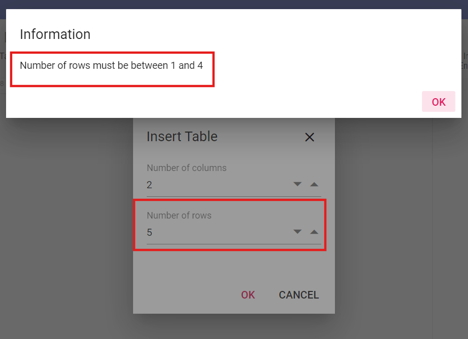
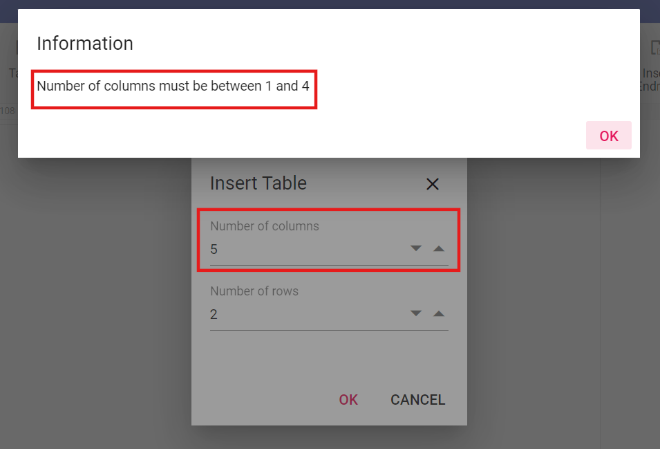

# Table in Angular Document Editor component

Tables are an efficient way to present information. [Angular Document Editor](https://www.syncfusion.com/docx-editor-sdk/angular-docx-editor) can display and edit tables. You can select and edit them through keyboard, mouse, or touch interactions. Document Editor exposes a rich set of APIs to perform these operations programmatically.

## Create a table

You can create and insert a table at the cursor position by specifying the required number of rows and columns.

Refer to the following sample code.

```ts
 this.documentEditor.editor.insertTable(3,3);
```

## Set the maximum number of Rows when inserting a table

You can use the [maximumRows](https://ej2.syncfusion.com/angular/documentation/api/document-editor/documentEditorSettings#maximumrows) property to set the maximum number of rows allowed while inserting a table in the Document Editor component.

```ts
@Component({
    template: `<ejs-documenteditorcontainer [documentEditorSettings]="settings"></ejs-documenteditorcontainer>`
})
export class AppComponent {
  public settings: DocumentEditorSettingsModel = {
    maximumRows: 4
  };
}
```

When the maximum row limit is reached, an alert will appear, as follows:



N> The maximum value of Row is 32767, as per Microsoft Word application. You can set any value less than or equal to 32767 to this property.

## Set the maximum number of Columns when inserting a table

You can use the [maximumColumns](https://ej2.syncfusion.com/angular/documentation/api/document-editor/documentEditorSettings#maximumcolumns) property to set the maximum number of columns allowed while inserting a table in the Document Editor component.

Refer to the following sample code.

```ts
@Component({
    template: `<ejs-documenteditorcontainer [documentEditorSettings]="settings"></ejs-documenteditorcontainer>`
})
export class AppComponent {
  public settings: DocumentEditorSettingsModel = {
    maximumColumns: 4
  };
}
```

When the maximum column limit is reached, an alert will appear, as follows:



N> The maximum value of Column is 63, as per Microsoft Word application. You can set any value less than or equal to 63 to this property.

## Insert rows

You can add a row (or several rows) above or below the row at the cursor position by using the [`insertRow`](https://ej2.syncfusion.com/angular/documentation/api/document-editor/editor/#insertrow) method. This method accepts the following parameters:

Parameter | Type | Description
----------|------|-------------
above(optional) | boolean | This is optional. If omitted, it defaults to false and inserts below the row at the cursor position.
count(optional) | number | This is optional. If omitted, it defaults to 1.

Refer to the following sample code.

```ts
//Inserts a row below the row at cursor position
this.documentEditor.editor.insertRow();
//Inserts a row above the row at cursor position
this.documentEditor.editor.insertRow(false);
//Inserts three rows below the row at cursor position
this.documentEditor.editor.insertRow(true, 3);
```

## Insert columns

You can add a column (or several columns) to the left or right of the column at the cursor position by using the [`insertColumn`](https://ej2.syncfusion.com/angular/documentation/api/document-editor/editor/#insertcolumn) method. This method accepts the following parameters:

Parameter | Type | Description
----------|------|-------------
left(optional) | boolean| This is optional. If omitted, it defaults to false and inserts to the right of the column at the cursor position.
count(optional) | number |  This is optional. If omitted, it defaults to 1.

Refer to the following sample code.

```ts
//Insert a column to the right of the column at cursor position.
this.documentEditor.editor.insertColumn();
//Insert a column to the left of the column at cursor position.
this.documentEditor.editor.insertColumn(false);
//Insert two columns to the left of the column at cursor position.
this.documentEditor.editor.insertColumn(false, 2);
```

### Select an entire table

If the cursor position is inside a table, you can select the entire table by using the following sample code.

```ts
this.documentEditor.selection.selectTable();
```

### Select row

You can select the entire row at the cursor position by using the following sample code.

```ts
this.documentEditor.selection.selectRow();
```

If the current selection spans across cells of different rows, all these rows will be selected.

### Select column

You can select the entire column at the cursor position by using the following sample code.

```ts
this.documentEditor.selection.selectColumn();
```

If the current selection spans across cells of different columns, all these columns will be selected.

### Select cell

You can select the cell at the cursor position by using the following sample code.

```ts
this.documentEditor.selection.selectCell();
```

## Delete table

Document Editor allows you to delete the entire table. You can use the [`deleteTable()`](https://ej2.syncfusion.com/angular/documentation/api/document-editor/editor/#deletetable) method of the editor instance when the selection is in a table. Refer to the following sample code.

```ts
this.documentEditor.editor.deleteTable();
```

## Delete row

Document Editor allows you to delete the selected number of rows. You can use the [`deleteRow()`](https://ej2.syncfusion.com/angular/documentation/api/document-editor/editor/#deleterow) method of the editor instance to delete the selected number of rows when the selection is in a table. Refer to the following sample code.

```ts
this.documentEditor.editor.deleteRow();
```

## Delete column

Document Editor allows you to delete the selected number of columns. You can use the [`deleteColumn()`](https://ej2.syncfusion.com/angular/documentation/api/document-editor/editor/#deletecolumn) method of the editor instance to delete the selected number of columns when the selection is in a table. Refer to the following sample code.

```ts
this.documentEditor.editor.deleteColumn();
```

## Merge cells

You can merge cells vertically, horizontally, or a combination of both into a single cell. To vertically merge the cells, the columns within the selection must align on the left and right. To horizontally merge the cells, the rows within the selection must align on the top and bottom.
Refer to the following sample code.

```ts
this.documentEditor.editor.mergeCells()
```

## Positioning the table

Document Editor preserves the position properties of the table and renders the table based on those properties. Position properties cannot be modified programmatically, but tables positioned relative to a paragraph will move automatically with text edits.

## How to work with tables

The following sample demonstrates how to delete table rows or columns, merge cells, and bind the API to a button.










  


## See Also

* [Feature modules](./feature-module)
* [Insert table dialog](./dialog#table-dialog)
