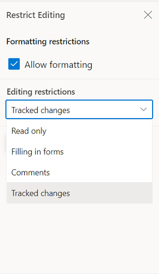

# Track changes in Angular Document editor component

Track Changes allows you to keep a record of changes or edits made to a document. You can then choose to accept or reject the modifications. It is a useful tool for managing changes made by several reviewers to the same document. If track changes option is enabled, all editing operations are preserved as revisions in Document Editor.

## Enable track changes in Document Editor

The following example demonstrates how to enable track changes.

```
 <ejs-documenteditor [enableTrackChanges]=true height="330px" style="display:block"></ejs-documenteditor>
```

>Track changes are document level settings. When opening a document, if the document does not have track changes enabled, then enableTrackChanges will be disabled even if we set [enableTrackChanges] = true in the initial rendering. If you want to enable track changes for all the documents, then we recommend enabling track changes during the document change event. The following example demonstrates how to enable Track changes for the all the Document while Opening.

```typescript
<ejs-documenteditorcontainer #documenteditor_default [enableToolbar]=true [locale]="culture" (created)="onCreate()" (documentChange)="onDocumentChange()" height="600px" [serviceUrl]="hostUrl"  style="display:block;"></ejs-documenteditorcontainer>

onDocumentChange(): void {
  if (this.container !== null) {
    this.container.documentEditor.enableTrackChanges = true;
  }
}
```

## Get all tracked revisions

The following example demonstrate how to get all tracked revision from current document.

```typescript
/**
 * Get revisions from the current document
 */
let revisions : RevisionCollection = this.documentEditor.revisions;
```

## Accept or Reject all changes programmatically

The following example demonstrates how to accept/reject all changes.

```typescript
/**
 * Get revisions from the current document
 */
let revisions : RevisionCollection = this.documentEditor.revisions;

/**
 * Accept all tracked changes
 */
revisions.acceptAll();

/**
 * Reject all tracked changes
 */
revisions.rejectAll();
```

## Accept or reject a specific revision

The following example demonstrates how to accept/reject specific revision in the Document Editor.

```typescript
/**
 * Get revisions from the current document
 */
let revisions : RevisionCollection = this.documentEditor.revisions;
/**
 * Accept specific changes
 */
revisions.get(0).accept();
/**
 * Reject specific changes
 */
revisions.get(1).reject();
```

## Navigate between the tracked changes

The following example demonstrates how to navigate tracked revision programmatically.

```typescript
/**
 * Navigate to next tracked change from the current selection.
 */
this.documentEditor.selection.navigateNextRevision();

/**
 * Navigate to previous tracked change from the current selection.
 */
this.documentEditor.selection.navigatePreviousRevision();
```

## Filtering changes based on user

In DocumentEditor, we have built-in review panel in which we have provided support for filtering changes based on the user.



## Custom metadata along with author

The Document Editor provides options to customize revisions using [`revisionsettings`](https://ej2.syncfusion.com/angular/documentation/api/document-editor/documenteditorsettingsmodel#revisionsettings). The [`customData`](https://ej2.syncfusion.com/angular/documentation/api/document-editor/revisionsettings#customdata) property allows you to attach additional metadata to tracked revisions in the Word Processor. This metadata can represent roles, tags, or any custom identifier for the revision. To display this metadata along with the author name in the Track Changes pane, you must enable the [`showCustomDataWithAuthor`](https://ej2.syncfusion.com/angular/documentation/api/document-editor/revisionsettings#showcustomdatawithauthor) property.

The following example code illustrates how to enable and update custom metadata for track changes revisions.

```ts
import { Component, OnInit, ViewChild } from '@angular/core';
import {
  RibbonService,
  DocumentEditorContainerComponent,
} from '@syncfusion/ej2-angular-documenteditor';
import { DocumentEditorContainerModule } from '@syncfusion/ej2-angular-documenteditor';
@Component({
  selector: 'app-container',
  standalone: true,
  imports: [DocumentEditorContainerModule],
  providers: [RibbonService],
  template: `<ejs-documenteditorcontainer #documenteditor_default 
      serviceUrl="hostUrl" 
      height="600px" 
      style="display:block" 
      [enableTrackChanges]=true
      [documentEditorSettings]= "Settings" >
    </ejs-documenteditorcontainer>
  `,
})
export class AppComponent implements OnInit {
  @ViewChild('documenteditor_default')
  public container?: DocumentEditorContainerComponent;
  public Settings = {
    revisionSettings: {
      customData: 'Developer',
      showCustomDataWithAuthor: true,
    }};
  ngOnInit(): void {}
}
```
The Track Changes pane will display the author name along with the custom metadata, as shown in the screenshot below.


>Note:
* When you export the document as SFDT, the customData value is stored in the revision collection. When you reopen the SFDT, the custom data is automatically restored and displayed in the Track Changes pane.
* Other than SFDT export (e.g. DOCX and other), the customData is not preserved, as it is specific to the Document Editor component.

## Protect the document in track changes only mode

Document Editor provides support for protecting the document with `RevisionsOnly` protection. In this protection, all the users are allowed to view the document and do their corrections, but they cannot accept or reject any tracked changes in the document. Later, the author can view their corrections and accept or reject the changes.

Document editor provides an option to protect and unprotect document using [`enforceProtection`](https://ej2.syncfusion.com/angular/documentation/api/document-editor/editor/#enforceprotection) and [`stopProtection`](https://ej2.syncfusion.com/angular/documentation/api/document-editor/editor/#stopprotection) API.

The following example code illustrates how to enforce and stop protection in Document editor container.

```typescript
import { Component, ViewEncapsulation, ViewChild } from '@angular/core';
import { DocumentEditorContainerComponent, ToolbarService } from '@syncfusion/ej2-angular-documenteditor';

@Component({
      selector: 'app-container',
      // specifies the template string for the Document Editor component
      template: `<div><button ejs-button (click)="protectDocument()" >Protect</button>
      <button ejs-button (click)="unProtectDocument()" >Unprotect</button>
      <ejs-documenteditorcontainer #document_editor serviceUrl="https://document.syncfusion.com/web-services/docx-editor/api/documenteditor/" height="600px" style="display:block" [enableToolbar]=true> </ejs-documenteditorcontainer></div>`,
      encapsulation: ViewEncapsulation.None,
      providers: [ToolbarService]
})
export class AppComponent {
    @ViewChild('document_editor')
    public container: DocumentEditorContainerComponent;

    public protectDocument(): void {
        //enforce protection
        container.documentEditor.editor.enforceProtection('123', 'RevisionsOnly');
    }

    public unProtectDocument(): void {
        //stop the document protection
        container.documentEditor.editor.stopProtection('123');
    }
}
```

> The Web API hosted link `https://document.syncfusion.com/web-services/docx-editor/api/documenteditor/` utilized in the Document Editor's serviceUrl property is intended solely for demonstration and evaluation purposes. For production deployment, please host your own web service with your required server configurations. You can refer and reuse the [GitHub Web Service example](https://github.com/SyncfusionExamples/EJ2-DocumentEditor-WebServices) or [Docker image](https://hub.docker.com/r/syncfusion/word-processor-server) for hosting your own web service and use for the serviceUrl property.

Tracked changes only protection can be enabled in UI by using [Restrict Editing pane](./document-management#restrict-editing-pane)


>Note: In enforce Protection method, first parameter denotes password and second parameter denotes protection type. Possible values of protection type are `NoProtection |ReadOnly |FormFieldsOnly |CommentsOnly |RevisionsOnly`. In stop protection method, parameter denotes the password.

## Event

You can restrict the accept and reject changes based on the author name. The following example demonstrates how to restrict an author from accept/reject changes.

```typescript
import { Component, OnInit, ViewChild } from '@angular/core';
import {
  ToolbarService,
  DocumentEditorContainerComponent,
} from '@syncfusion/ej2-angular-documenteditor';
import { ClickEventArgs } from '@syncfusion/ej2-navigations';
import {
  CustomToolbarItemModel,
  DocumentEditorContainerModule,
} from '@syncfusion/ej2-angular-documenteditor';

@Component({
  selector: 'app-container',
  standalone: true,
  imports: [DocumentEditorContainerModule],
  providers: [ToolbarService],
  template: `
    <ejs-documenteditorcontainer #documenteditor_default 
      serviceUrl="https://document.syncfusion.com/web-services/docx-editor/api/documenteditor/" 
      height="600px" 
      style="display:block" 
      (beforeAcceptRejectChanges)="beforeAcceptRejectChanges($event)"
      [enableToolbar]="true">
    </ejs-documenteditorcontainer>
  `,
})
export class AppComponent implements OnInit {
  @ViewChild('documenteditor_default')
  public container?: DocumentEditorContainerComponent;

  ngOnInit(): void {}
  beforeAcceptRejectChanges(args: { author: string; cancel: boolean }) {
    // Check the author of the revision
    if (args.author !== 'Hary') {
      // Cancel the accept/reject action
      args.cancel = true;
    }
  }
}
```
